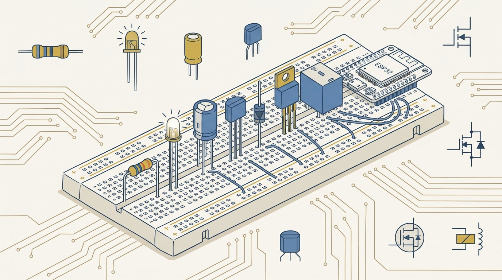
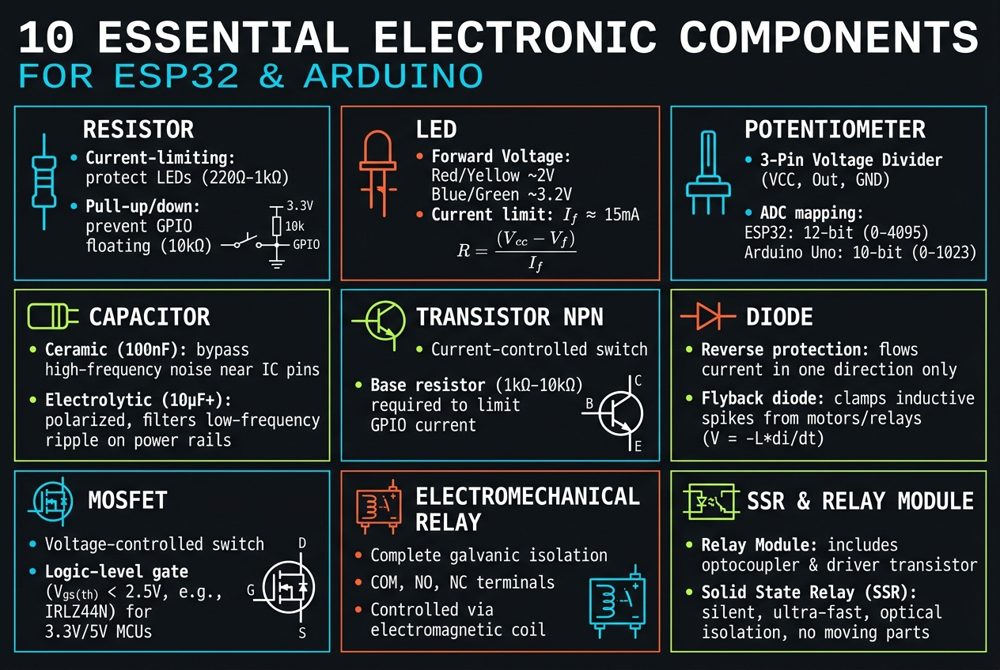

<!-- _class: title -->

# 10 อุปกรณ์อิเล็กทรอนิกส์พื้นฐานสำหรับ ESP32 และ Arduino

Resistor, LED, Potentiometer, Capacitor, Transistor, Diode, MOSFET, Relay — เข้าใจ 10 ตัวนี้แล้วอ่านวงจรออกทั้งหมด

<!-- Speaker: เกริ่นว่าโพสต์นี้สรุปจากวิดีโอ "Learn ESP32 Faster with These 10 Components" — 10 อุปกรณ์ที่ปรากฏซ้ำในแทบทุกวงจร ESP32/Arduino -->

---

<!-- _class: cheatsheet -->
<!-- _backgroundColor: #f8f7f4 -->

<!-- Speaker: ภาพรวมทั้ง 9 หัวข้อในหน้าเดียว ใช้เป็นตัวชี้นำก่อนลงรายละเอียด -->

---

## TL;DR: 10 ตัวต่อที่ปรากฏซ้ำในแทบทุกวงจร

เข้าใจหน้าที่และข้อจำกัดของแต่ละตัวแล้ว จะอ่านวงจรคนอื่นออกและ debug ปัญหา wiring ได้เร็วขึ้นมาก

<svg viewBox="0 0 1100 340" width="100%" xmlns="http://www.w3.org/2000/svg">
  <rect x="60" y="40" width="980" height="260" rx="16" fill="var(--paper)" stroke="var(--soft-2)" stroke-width="1.5" style="filter:drop-shadow(0 4px 12px rgba(15,23,42,.08))"/>
  <rect x="60" y="40" width="8" height="260" rx="4" fill="var(--accent)"/>
  <circle cx="150" cy="170" r="42" fill="var(--accent)" opacity=".12"/>
  <circle cx="150" cy="170" r="30" fill="var(--accent)"/>
  <text x="150" y="177" font-size="20" fill="var(--paper)" text-anchor="middle" dominant-baseline="central" font-family="system-ui" font-weight="700">10</text>
  <text x="230" y="130" font-size="19" font-weight="700" fill="var(--ink)" font-family="system-ui">Resistor · LED · Potentiometer · Capacitor</text>
  <text x="230" y="160" font-size="19" font-weight="700" fill="var(--ink)" font-family="system-ui">Transistor · Diode · MOSFET · Relay</text>
  <text x="230" y="200" font-size="14" fill="var(--ink-dim)" font-family="system-ui">Building blocks ที่ซ้อนทับกันในโปรเจกต์ที่ซับซ้อนขึ้น</text>
  <text x="230" y="225" font-size="14" fill="var(--muted)" font-family="system-ui">Source: "Learn ESP32 Faster with These 10 Components"</text>
</svg>

<b>★ Takeaway:</b> 10 อุปกรณ์นี้คือ building block ที่ปรากฏซ้ำในแทบทุกโปรเจกต์ ESP32/Arduino

<!-- Speaker: เน้นว่านี่ไม่ใช่แค่ทฤษฎี แต่เป็นสิ่งที่เจอจริงในทุกวงจร -->

---

## ทำไมต้องรู้จัก 10 อุปกรณ์นี้ก่อน

มือใหม่มักก็อปวงจรจาก tutorial มาต่อได้ แต่ไม่รู้ว่าทำไมต้องมี resistor ตัวนี้ หรือทำไม capacitor ต้องต่อขั้วถูก

  

    
Pattern

    <h3>ปรากฏซ้ำแทบทุกวงจร</h3>
    
ตั้งแต่ LED blink ธรรมดา ไปจนถึงควบคุมมอเตอร์และไฟบ้าน 230V

  

  

    
Protection

    <h3>ป้องกันความเสียหาย</h3>
    
GPIO pin ของ ESP32 ทนกระแสได้จำกัดมาก อุปกรณ์เหล่านี้ปกป้องชิปโดยตรงหรือโดยอ้อม

  

  

    
Bridge

    <h3>สะพานเชื่อม 3.3V กับโลกจริง</h3>
    
ทั้งโหลดกระแสสูง (มอเตอร์ รีเลย์) และไฟฟ้าแรงสูง (AC mains)

  

  

    
Transfer

    <h3>เข้าใจตัวหนึ่งต่อยอดได้ทั้งชุด</h3>
    
เข้าใจ transistor แล้ว MOSFET จะง่ายขึ้นมาก — หลักการ "switch ที่ควบคุมด้วยสัญญาณเล็กๆ" เหมือนกัน

  

<b>★ Takeaway:</b> 10 อุปกรณ์นี้คือสะพานเชื่อมระหว่างโลก 3.3V ของ ESP32 กับโลกไฟฟ้าจริง

<!-- Speaker: อธิบายว่าทำไมเลือก 10 ตัวนี้ ไม่ใช่ตัวอื่น -->

---

## 1. Resistor — จำกัดกระแสและตั้งค่า Pull-up/Pull-down

ทดลองจากวิดีโอต้นทาง: ถอด resistor ออก กระแสพุ่งจาก 6 mA เป็น 34 mA ทันที

<svg viewBox="0 0 1100 360" width="100%" xmlns="http://www.w3.org/2000/svg">
  <rect x="40" y="20" width="500" height="320" rx="12" fill="var(--paper)" stroke="var(--soft-2)" stroke-width="1.5" style="filter:drop-shadow(var(--shadow-sm))"/>
  <rect x="40" y="20" width="500" height="52" rx="12" fill="var(--danger-wash)"/>
  <text x="290" y="53" font-size="16" font-weight="700" fill="var(--danger-ink)" text-anchor="middle" font-family="system-ui">Without Resistor</text>
  <line x1="100" y1="150" x2="220" y2="150" stroke="var(--ink)" stroke-width="2"/>
  <circle cx="270" cy="150" r="24" fill="none" stroke="var(--danger)" stroke-width="3"/>
  <text x="270" y="156" font-size="14" fill="var(--danger)" text-anchor="middle" font-family="system-ui" font-weight="700">LED</text>
  <line x1="294" y1="150" x2="440" y2="150" stroke="var(--ink)" stroke-width="2"/>
  <text x="290" y="215" font-size="26" font-weight="700" fill="var(--danger)" text-anchor="middle" font-family="system-ui">34 mA</text>
  <text x="290" y="240" font-size="13" fill="var(--ink-dim)" text-anchor="middle" font-family="system-ui">current spikes — risk of damage</text>
  <rect x="560" y="20" width="500" height="320" rx="12" fill="var(--paper)" stroke="var(--accent)" stroke-width="2" style="filter:drop-shadow(var(--shadow-md))"/>
  <rect x="560" y="20" width="500" height="52" rx="12" fill="var(--accent-wash)"/>
  <text x="810" y="53" font-size="16" font-weight="700" fill="var(--accent-deep)" text-anchor="middle" font-family="system-ui">With Resistor (Recommended)</text>
  <line x1="610" y1="150" x2="700" y2="150" stroke="var(--ink)" stroke-width="2"/>
  <rect x="700" y="138" width="50" height="24" rx="4" fill="var(--accent)"/>
  <text x="725" y="155" font-size="11" fill="var(--paper)" text-anchor="middle" font-family="system-ui" font-weight="700">330R</text>
  <line x1="750" y1="150" x2="800" y2="150" stroke="var(--ink)" stroke-width="2"/>
  <circle cx="850" cy="150" r="24" fill="none" stroke="var(--success)" stroke-width="3"/>
  <text x="850" y="156" font-size="14" fill="var(--success)" text-anchor="middle" font-family="system-ui" font-weight="700">LED</text>
  <line x1="874" y1="150" x2="960" y2="150" stroke="var(--ink)" stroke-width="2"/>
  <text x="810" y="215" font-size="26" font-weight="700" fill="var(--success)" text-anchor="middle" font-family="system-ui">6 mA</text>
  <text x="810" y="240" font-size="13" fill="var(--ink-dim)" text-anchor="middle" font-family="system-ui">safe, GPIO protected</text>
  <text x="810" y="295" font-size="13" fill="var(--muted)" text-anchor="middle" font-family="system-ui">Pull-up/down: 10 kΩ ป้องกัน floating input pin</text>
</svg>

<b>★ Takeaway:</b> Resistor จำกัดกระแสให้ LED/GPIO และแก้ปัญหา floating pin ด้วย pull-up/pull-down (10 kΩ)

<!-- Speaker: เน้นตัวเลข 6 mA vs 34 mA เป็นหลักฐานที่จับต้องได้ -->

---

## 2. LED — ทิศทางกระแสและ Forward Voltage ตามสี

ต้องมี resistor ต่ออนุกรมเสมอ ไม่งั้น LED จะดึงกระแสเกินจนร้อนและไหม้

<table style="width:100%; border-collapse:collapse;">
<thead>
<tr style="background:var(--soft);">
<th style="padding:8px 12px; text-align:left; border-bottom:2px solid var(--soft-2);">สี LED</th>
<th style="padding:8px 12px; text-align:left; border-bottom:2px solid var(--soft-2);">Forward Voltage</th>
<th style="padding:8px 12px; text-align:left; border-bottom:2px solid var(--soft-2);">เหตุผล</th>
</tr>
</thead>
<tbody>
<tr><td style="padding:8px 12px; border-bottom:1px solid var(--soft-2);">แดง (Red)</td><td style="padding:8px 12px; border-bottom:1px solid var(--soft-2); color:var(--accent); font-weight:700;">~1.8–2.0V</td><td style="padding:8px 12px; border-bottom:1px solid var(--soft-2); color:var(--ink-dim);">พลังงานโฟตอนต่ำกว่า</td></tr>
<tr><td style="padding:8px 12px; border-bottom:1px solid var(--soft-2);">เขียว/เหลือง</td><td style="padding:8px 12px; border-bottom:1px solid var(--soft-2); color:var(--accent); font-weight:700;">~2.0–2.2V</td><td style="padding:8px 12px; border-bottom:1px solid var(--soft-2); color:var(--ink-dim);">GaP-based chip</td></tr>
<tr><td style="padding:8px 12px;">ฟ้า/ขาว (Blue/White)</td><td style="padding:8px 12px; color:var(--danger); font-weight:700;">~3.0–3.4V</td><td style="padding:8px 12px; color:var(--ink-dim);">InGaN chip — พลังงานโฟตอนสูงกว่า</td></tr>
</tbody>
</table>

  
<h3>Anode (+)</h3>
ขาที่ยาวกว่า

  
<h3>Cathode (−)</h3>
ขาสั้น / ด้านตัดเรียบบนตัวถัง

<b>★ Takeaway:</b> สีฟ้า/ขาวต้องการแรงดันสูงกว่าสีแดงเกือบเท่าตัว — คำนวณ resistor ตามสีที่ใช้จริง

<!-- Speaker: ชี้ตาราง — ย้ำว่าค่า resistor ต้องคำนวณใหม่ถ้าเปลี่ยนสี LED -->

---

## 3. Potentiometer — ตัวแบ่งแรงดันแบบปรับได้

หมุนปุ่มแล้ว wiper ภายในเลื่อนไปตาม resistor ทำให้แรงดัน output เปลี่ยนตามไปด้วย

<svg viewBox="0 0 1100 340" width="100%" xmlns="http://www.w3.org/2000/svg">
  <rect x="80" y="60" width="500" height="60" rx="8" fill="var(--soft)" stroke="var(--ink-dim)" stroke-width="2"/>
  <circle cx="330" cy="90" r="14" fill="var(--accent)"/>
  <line x1="330" y1="90" x2="330" y2="40" stroke="var(--accent)" stroke-width="3"/>
  <text x="330" y="25" font-size="13" fill="var(--accent)" text-anchor="middle" font-family="system-ui" font-weight="700">Wiper</text>
  <line x1="80" y1="200" x2="80" y2="90" stroke="var(--ink)" stroke-width="2"/>
  <text x="60" y="220" font-size="14" fill="var(--ink)" text-anchor="middle" font-family="system-ui" font-weight="700">3.3V</text>
  <line x1="580" y1="200" x2="580" y2="90" stroke="var(--ink)" stroke-width="2"/>
  <text x="600" y="220" font-size="14" fill="var(--ink)" text-anchor="middle" font-family="system-ui" font-weight="700">GND</text>
  <line x1="330" y1="40" x2="330" y2="10" stroke="var(--accent)" stroke-width="2" stroke-dasharray="4 3"/>
  <line x1="330" y1="10" x2="850" y2="10" stroke="var(--accent)" stroke-width="2" stroke-dasharray="4 3"/>
  <line x1="850" y1="10" x2="850" y2="200" stroke="var(--accent)" stroke-width="2"/>
  <rect x="780" y="200" width="140" height="60" rx="8" fill="var(--accent)" opacity=".12"/>
  <rect x="780" y="200" width="140" height="60" rx="8" fill="none" stroke="var(--accent)" stroke-width="2"/>
  <text x="850" y="235" font-size="14" fill="var(--accent-deep)" text-anchor="middle" font-family="system-ui" font-weight="700">ESP32 ADC</text>
  <text x="330" y="280" font-size="14" fill="var(--ink-dim)" text-anchor="middle" font-family="system-ui">3 ขา: ปลายสองข้าง = ไฟเลี้ยง+GND, ขากลาง = analog input</text>
</svg>

<b>★ Takeaway:</b> Potentiometer ให้สัญญาณ analog ต่อเนื่องแก่ ESP32 ทันที — หรี่ไฟ/ปรับพารามิเตอร์โดยไม่ต้องเขียนโค้ดซับซ้อน

<!-- Speaker: ชี้ wiper ที่เลื่อน แล้วโยงไปที่ ADC ของ ESP32 -->

---

## 4. Capacitor — Ceramic vs Electrolytic

ทั้งสองชนิดกรองไฟและ decoupling เหมือนกัน แต่ต่างกันที่ขั้วและปริมาณพลังงานที่เก็บได้

<svg viewBox="0 0 1100 380" width="100%" xmlns="http://www.w3.org/2000/svg">
  <rect x="40" y="20" width="490" height="340" rx="12" fill="var(--paper)" stroke="var(--soft-2)" stroke-width="1.5" style="filter:drop-shadow(var(--shadow-sm))"/>
  <rect x="40" y="20" width="490" height="56" rx="12" fill="var(--soft)" opacity=".8"/>
  <text x="285" y="54" font-size="17" font-weight="700" fill="var(--ink-dim)" text-anchor="middle" font-family="system-ui">Ceramic Capacitor</text>
  <text x="80" y="120" font-size="15" fill="var(--ink)" font-family="system-ui">ไม่มีขั้ว (non-polarized)</text>
  <text x="80" y="155" font-size="15" fill="var(--ink-dim)" font-family="system-ui">Capacitance เล็ก (pF–μF)</text>
  <text x="80" y="190" font-size="15" fill="var(--ink-dim)" font-family="system-ui">ต่อทิศทางไหนก็ได้</text>
  <text x="80" y="230" font-size="14" fill="var(--success-ink)" font-family="system-ui" font-weight="700">ปลอดภัยกว่า ต่อผิดไม่พัง</text>
  <rect x="570" y="20" width="490" height="340" rx="12" fill="var(--paper)" stroke="var(--danger)" stroke-width="2" style="filter:drop-shadow(var(--shadow-md))"/>
  <rect x="570" y="20" width="490" height="56" rx="12" fill="var(--danger-wash)"/>
  <text x="815" y="54" font-size="17" font-weight="700" fill="var(--danger-ink)" text-anchor="middle" font-family="system-ui">Electrolytic Capacitor</text>
  <text x="610" y="120" font-size="15" fill="var(--ink)" font-family="system-ui">มีขั้ว (polarized)</text>
  <text x="610" y="155" font-size="15" fill="var(--ink)" font-family="system-ui">Capacitance ใหญ่กว่ามาก</text>
  <text x="610" y="190" font-size="15" fill="var(--ink)" font-family="system-ui">ขายาว = บวก, แถบตัวถัง = ลบ</text>
  <text x="610" y="230" font-size="14" fill="var(--danger-ink)" font-family="system-ui" font-weight="700">ต่อผิดขั้ว = เสี่ยงระเบิด/รั่ว</text>
  <circle cx="550" cy="190" r="28" fill="var(--accent)"/>
  <text x="550" y="195" font-size="14" font-weight="700" fill="var(--paper)" text-anchor="middle" dominant-baseline="central" font-family="system-ui">VS</text>
</svg>

<b>★ Takeaway:</b> ทั้งสองชนิดทำงานเหมือนกัน แต่ electrolytic มีขั้ว — ต่อผิดขั้วอันตรายกว่าที่คิด

<!-- Speaker: เน้นความแตกต่างเรื่องขั้ว เพราะเป็นจุดที่มือใหม่พลาดบ่อยที่สุด -->

---

## 5. Transistor (NPN) — สวิตช์ควบคุมด้วยกระแส

GPIO pin จ่ายกระแสได้จำกัด transistor จึงเป็นตัวกลางให้ ESP32 สวิตช์โหลดหนักได้อย่างปลอดภัย

<svg viewBox="0 0 1100 360" width="100%" xmlns="http://www.w3.org/2000/svg">
  <rect x="60" y="30" width="240" height="300" rx="12" fill="var(--accent-wash)"/>
  <text x="180" y="70" font-size="14" fill="var(--accent-deep)" text-anchor="middle" font-family="system-ui" font-weight="700">ESP32 GPIO</text>
  <line x1="180" y1="90" x2="180" y2="150" stroke="var(--ink)" stroke-width="2"/>
  <rect x="150" y="150" width="60" height="22" rx="4" fill="var(--accent)"/>
  <text x="180" y="166" font-size="10" fill="var(--paper)" text-anchor="middle" font-family="system-ui" font-weight="700">1kR</text>
  <text x="230" y="166" font-size="12" fill="var(--ink-dim)" font-family="system-ui">Base R</text>
  <line x1="180" y1="172" x2="180" y2="230" stroke="var(--ink)" stroke-width="2"/>
  <circle cx="420" cy="200" r="90" fill="var(--paper)" stroke="var(--ink)" stroke-width="2.5"/>
  <text x="420" y="150" font-size="14" fill="var(--ink)" text-anchor="middle" font-family="system-ui" font-weight="700">NPN</text>
  <line x1="330" y1="200" x2="380" y2="200" stroke="var(--ink)" stroke-width="2.5"/>
  <text x="345" y="190" font-size="13" fill="var(--accent)" text-anchor="middle" font-family="system-ui" font-weight="700">B</text>
  <line x1="380" y1="160" x2="380" y2="240" stroke="var(--ink)" stroke-width="3"/>
  <line x1="380" y1="170" x2="440" y2="120" stroke="var(--ink)" stroke-width="2.5"/>
  <text x="450" y="105" font-size="13" fill="var(--success)" text-anchor="middle" font-family="system-ui" font-weight="700">C</text>
  <line x1="380" y1="230" x2="440" y2="280" stroke="var(--ink)" stroke-width="2.5"/>
  <text x="450" y="300" font-size="13" fill="var(--danger)" text-anchor="middle" font-family="system-ui" font-weight="700">E</text>
  <line x1="440" y1="120" x2="440" y2="60" stroke="var(--ink)" stroke-width="2"/>
  <rect x="620" y="30" width="420" height="90" rx="10" fill="var(--soft)"/>
  <text x="640" y="60" font-size="14" fill="var(--ink)" font-family="system-ui" font-weight="700">Collector → โหลดหนัก (Relay/Motor)</text>
  <text x="640" y="90" font-size="14" fill="var(--ink)" font-family="system-ui" font-weight="700">Emitter → GND</text>
  <line x1="440" y1="280" x2="440" y2="330" stroke="var(--ink)" stroke-width="2"/>
  <text x="440" y="345" font-size="13" fill="var(--muted)" text-anchor="middle" font-family="system-ui">GND</text>
</svg>

<b>★ Takeaway:</b> Transistor ควบคุมด้วยกระแสเล็กที่ Base — ต้องมี resistor ต่อที่ขา Base เสมอ

<!-- Speaker: ชี้ 3 ขา C/B/E และย้ำว่า base resistor ป้องกัน GPIO -->

---

## 6. Diode — ป้องกันกระแสย้อนกลับ 2 บทบาท

ประตูทางเดียวสำหรับกระแสไฟฟ้า — ยอมให้ไหลทิศทางถูกต้อง กันไม่ให้ไหลย้อนกลับ

  

    
Role 1

    <h3>Reverse Polarity Protection</h3>
    
ป้องกันความเสียหายเมื่อต่อไฟผิดขั้ว เช่น ป้องกันพอร์ต USB จากแหล่งจ่ายไฟภายนอก

  

  

    
Role 2

    <h3>Flyback Diode</h3>
    
ต่อคร่อมโหลด inductive (รีเลย์/มอเตอร์) — เมื่อคอยล์ตัดไฟ back-EMF จะไหลวนผ่าน diode แทนที่จะทำลาย transistor

  

<b>★ Takeaway:</b> แถบสีบนตัว diode = cathode (ลบ) — ห้ามละเว้น flyback diode กับโหลด inductive เด็ดขาด

<!-- Speaker: เน้นว่า diode มี 2 หน้าที่ที่มือใหม่มักลืมอันที่สอง -->

---

## 7. MOSFET (N-Channel) — สวิตช์ควบคุมด้วยแรงดัน

คล้าย transistor แต่ควบคุมด้วยแรงดัน (Gate) แทนกระแส — ประหยัดพลังงานกว่ามาก

<svg viewBox="0 0 1100 380" width="100%" xmlns="http://www.w3.org/2000/svg">
  <rect x="40" y="20" width="490" height="340" rx="12" fill="var(--paper)" stroke="var(--danger)" stroke-width="2" style="filter:drop-shadow(var(--shadow-sm))"/>
  <rect x="40" y="20" width="490" height="56" rx="12" fill="var(--danger-wash)"/>
  <text x="285" y="54" font-size="16" font-weight="700" fill="var(--danger-ink)" text-anchor="middle" font-family="system-ui">Standard MOSFET</text>
  <text x="80" y="130" font-size="30" font-weight="700" fill="var(--danger)" font-family="system-ui">Vgs(th) ~10V</text>
  <text x="80" y="170" font-size="14" fill="var(--ink-dim)" font-family="system-ui">ต้องการแรงดัน Gate สูงถึงจะเปิดสวิตช์เต็มที่</text>
  <text x="80" y="210" font-size="14" fill="var(--danger-ink)" font-family="system-ui" font-weight="700">ESP32 (3.3V/5V) เปิดไม่เต็มที่ → ร้อนสะสม</text>
  <rect x="570" y="20" width="490" height="340" rx="12" fill="var(--paper)" stroke="var(--accent)" stroke-width="2" style="filter:drop-shadow(var(--shadow-md))"/>
  <rect x="570" y="20" width="490" height="56" rx="12" fill="var(--accent-wash)"/>
  <text x="815" y="54" font-size="16" font-weight="700" fill="var(--accent-deep)" text-anchor="middle" font-family="system-ui">Logic-Level MOSFET</text>
  <text x="610" y="130" font-size="30" font-weight="700" fill="var(--accent)" font-family="system-ui">Vgs(th) ≤1.5–2V</text>
  <text x="610" y="170" font-size="14" fill="var(--ink)" font-family="system-ui">เปิดสวิตช์เต็มที่ที่ 3.3V/5V logic</text>
  <text x="610" y="210" font-size="14" fill="var(--success-ink)" font-family="system-ui" font-weight="700">แทบไม่ดึงกระแสควบคุม + ความร้อนต่ำ</text>
  <text x="815" y="280" font-size="13" fill="var(--muted)" text-anchor="middle" font-family="system-ui">3 ขา: Gate · Drain · Source</text>
</svg>

<b>★ Takeaway:</b> ซื้อ MOSFET สำหรับ ESP32/Arduino ต้องเช็ค "logic-level" เสมอ ไม่งั้นสวิตช์ไม่เต็มที่

<!-- Speaker: นี่คือ mistake ที่พบบ่อยที่สุดของมือใหม่ที่ขับโหลดด้วย MOSFET -->

---

## 8. Electromechanical Relay — แยกวงจรไฟแรงสูง

จ่ายไฟให้คอยล์ → สนามแม่เหล็กดึงหน้าสัมผัสโลหะเปลี่ยนตำแหน่ง → Electrical Isolation สมบูรณ์

<svg viewBox="0 0 1100 340" width="100%" xmlns="http://www.w3.org/2000/svg">
  <rect x="60" y="40" width="260" height="200" rx="10" fill="var(--accent-wash)"/>
  <text x="190" y="80" font-size="14" fill="var(--accent-deep)" text-anchor="middle" font-family="system-ui" font-weight="700">ESP32 · 3.3V</text>
  <text x="190" y="110" font-size="30" font-weight="700" fill="var(--accent)" text-anchor="middle" font-family="system-ui">COIL</text>
  <text x="190" y="150" font-size="13" fill="var(--ink-dim)" text-anchor="middle" font-family="system-ui">Low-voltage control side</text>
  <line x1="320" y1="140" x2="440" y2="140" stroke="var(--muted)" stroke-width="2" stroke-dasharray="6 4"/>
  <text x="380" y="120" font-size="12" fill="var(--muted)" text-anchor="middle" font-family="system-ui">isolation</text>
  <rect x="440" y="40" width="600" height="240" rx="10" fill="var(--danger-wash)"/>
  <text x="740" y="75" font-size="14" fill="var(--danger-ink)" text-anchor="middle" font-family="system-ui" font-weight="700">AC Mains · 230V</text>
  <circle cx="560" cy="160" r="10" fill="var(--ink)"/>
  <text x="560" y="140" font-size="13" fill="var(--ink)" text-anchor="middle" font-family="system-ui" font-weight="700">COM</text>
  <line x1="560" y1="160" x2="660" y2="120" stroke="var(--ink)" stroke-width="3"/>
  <text x="680" y="115" font-size="13" fill="var(--success-ink)" text-anchor="middle" font-family="system-ui" font-weight="700">NO</text>
  <line x1="560" y1="160" x2="660" y2="200" stroke="var(--muted)" stroke-width="2" stroke-dasharray="4 3"/>
  <text x="680" y="210" font-size="13" fill="var(--muted)" text-anchor="middle" font-family="system-ui">NC</text>
  <text x="740" y="255" font-size="13" fill="var(--danger-ink)" text-anchor="middle" font-family="system-ui">ช้ากว่าสวิตช์อิเล็กทรอนิกส์ + มีเสียงคลิก</text>
</svg>

<b>★ Takeaway:</b> Relay คือสะพานเชื่อมโลก 3.3V กับไฟแรงสูง — bare relay มี COM/NO/NC ให้เลือกสถานะเริ่มต้น

<!-- Speaker: เน้นเส้นประที่แสดง isolation — นี่คือจุดขายของ relay -->

---

## 9. Relay Module vs Solid State Relay (SSR)

Relay module = electromechanical relay + วงจรป้องกันครบชุดในแผงเดียว, SSR = สวิตช์สารกึ่งตัวนำไม่มีชิ้นส่วนเคลื่อนที่

<svg viewBox="0 0 1100 380" width="100%" xmlns="http://www.w3.org/2000/svg">
  <rect x="40" y="20" width="490" height="340" rx="12" fill="var(--paper)" stroke="var(--accent)" stroke-width="2" style="filter:drop-shadow(var(--shadow-md))"/>
  <rect x="40" y="20" width="490" height="56" rx="12" fill="var(--accent-wash)"/>
  <text x="285" y="54" font-size="16" font-weight="700" fill="var(--accent-deep)" text-anchor="middle" font-family="system-ui">Relay Module (Recommended for beginners)</text>
  <text x="80" y="120" font-size="15" fill="var(--ink)" font-family="system-ui">รวม: transistor + flyback diode</text>
  <text x="80" y="150" font-size="15" fill="var(--ink)" font-family="system-ui">+ status LED + resistor ในแผงเดียว</text>
  <text x="80" y="190" font-size="15" fill="var(--success-ink)" font-family="system-ui" font-weight="700">Plug-and-play ไม่ต้องประกอบเอง</text>
  <text x="80" y="230" font-size="14" fill="var(--ink-dim)" font-family="system-ui">Switching: millisecond, มีเสียงคลิก</text>
  <rect x="570" y="20" width="490" height="340" rx="12" fill="var(--paper)" stroke="var(--soft-2)" stroke-width="1.5" style="filter:drop-shadow(var(--shadow-sm))"/>
  <rect x="570" y="20" width="490" height="56" rx="12" fill="var(--soft)" opacity=".8"/>
  <text x="815" y="54" font-size="16" font-weight="700" fill="var(--ink-dim)" text-anchor="middle" font-family="system-ui">Solid State Relay (SSR)</text>
  <text x="610" y="120" font-size="15" fill="var(--ink)" font-family="system-ui">ไม่มีชิ้นส่วนเคลื่อนที่ (semiconductor)</text>
  <text x="610" y="155" font-size="15" fill="var(--ink)" font-family="system-ui">เร็วกว่า (microsecond), เงียบกว่า</text>
  <text x="610" y="190" font-size="15" fill="var(--ink)" font-family="system-ui">อายุการใช้งานยาวกว่า</text>
  <text x="610" y="230" font-size="14" fill="var(--warning-ink)" font-family="system-ui" font-weight="700">แพงกว่า + ต้องระบายความร้อนเพิ่ม</text>
</svg>

<b>★ Takeaway:</b> งานสวิตช์ความถี่ต่ำ (เปิด/ปิดไฟบ้าน) relay module มาตรฐานคุ้มค่ากว่า SSR ที่แพงและร้อนกว่า

<!-- Speaker: ให้คำแนะนำจริง — ไม่ใช่ SSR ดีกว่าเสมอไป -->

---

## Caveats / Limits — ข้อควรระวังก่อนต่อวงจรจริง

6 กับดักที่มือใหม่พลาดบ่อยที่สุดเมื่อทำงานกับ 10 อุปกรณ์นี้

  
<h3>LED ไม่มี resistor</h3>
6→34 mA ทันที ที่ถอด resistor ออก — พังเร็วกว่าที่คิด

  
<h3>Electrolytic ผิดขั้ว</h3>
ต่างจาก ceramic — ต่อผิดขั้วเสี่ยงระเบิด/รั่วสารเคมี

  
<h3>MOSFET ทั่วไปใช้ไม่ได้เต็มที่</h3>
ต้องเช็ค "logic-level" หรือ Vgs(th) ก่อนซื้อเสมอ

  
<h3>ห้ามละเว้น Flyback Diode</h3>
โหลด inductive ทุกตัวต้องมี — ไม่งั้น back-EMF ทำลาย transistor/MOSFET

  
<h3>SSR ไม่ใช่ตัวเลือกที่ดีกว่าเสมอไป</h3>
แพงกว่า + ต้องมี heatsink — งานสวิตช์ต่ำใช้ relay module พอ

  
<h3>Pull-up/down ต้องเลือกค่าให้เหมาะ</h3>
10 kΩ มาตรฐาน — เล็กเกินไปสิ้นเปลืองกระแสไม่จำเป็น

<b>★ Takeaway:</b> ทุกข้อผิดพลาดข้างบนป้องกันได้ด้วยการอ่าน datasheet และเลือกค่าอุปกรณ์ให้ถูกก่อนต่อวงจรจริง

<!-- Speaker: จบด้วยข้อควรระวัง ก่อนสรุปปิดท้าย -->

---

## Key Takeaways

สิ่งที่ต้องจำแม้จะข้ามเนื้อหาส่วนอื่นไปทั้งหมด

  
<h3>Resistor</h3>
จำกัดกระแส + แก้ floating pin ด้วย pull-up/down

  
<h3>LED</h3>
สีต่างกัน = forward voltage ต่างกัน เกือบเท่าตัว

  
<h3>Capacitor</h3>
Electrolytic มีขั้ว เก็บพลังงานได้มากกว่า ceramic

  
<h3>Transistor vs MOSFET</h3>
ควบคุมด้วยกระแส (Base) vs แรงดัน (Gate)

  
<h3>Diode</h3>
ป้องกันไฟย้อนขั้ว + เป็น flyback diode กันโหลด inductive

  
<h3>Relay</h3>
สะพานเชื่อมโลก 3.3V กับไฟแรงสูง — module พร้อมใช้กว่า bare relay

<b>★ Takeaway:</b> เข้าใจ 10 ตัวนี้ = อ่านวงจร ESP32/Arduino ส่วนใหญ่ในโลกออกได้ เพราะเป็น building block ที่ซ้อนทับกันในโปรเจกต์ที่ซับซ้อนขึ้น

<!-- Speaker: ปิดท้ายด้วยข้อความหลักของทั้งเดค -->
