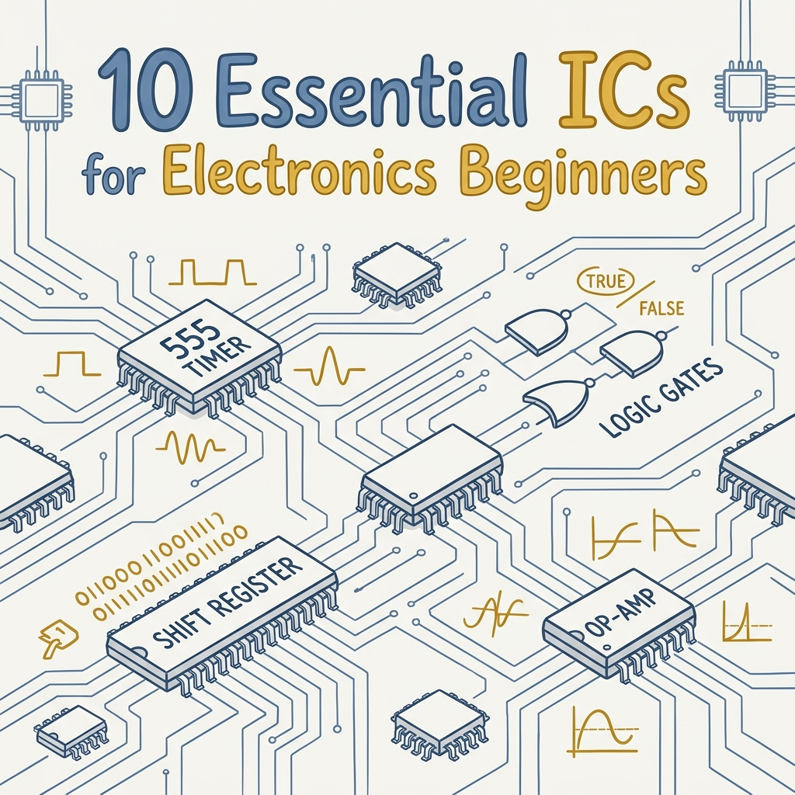
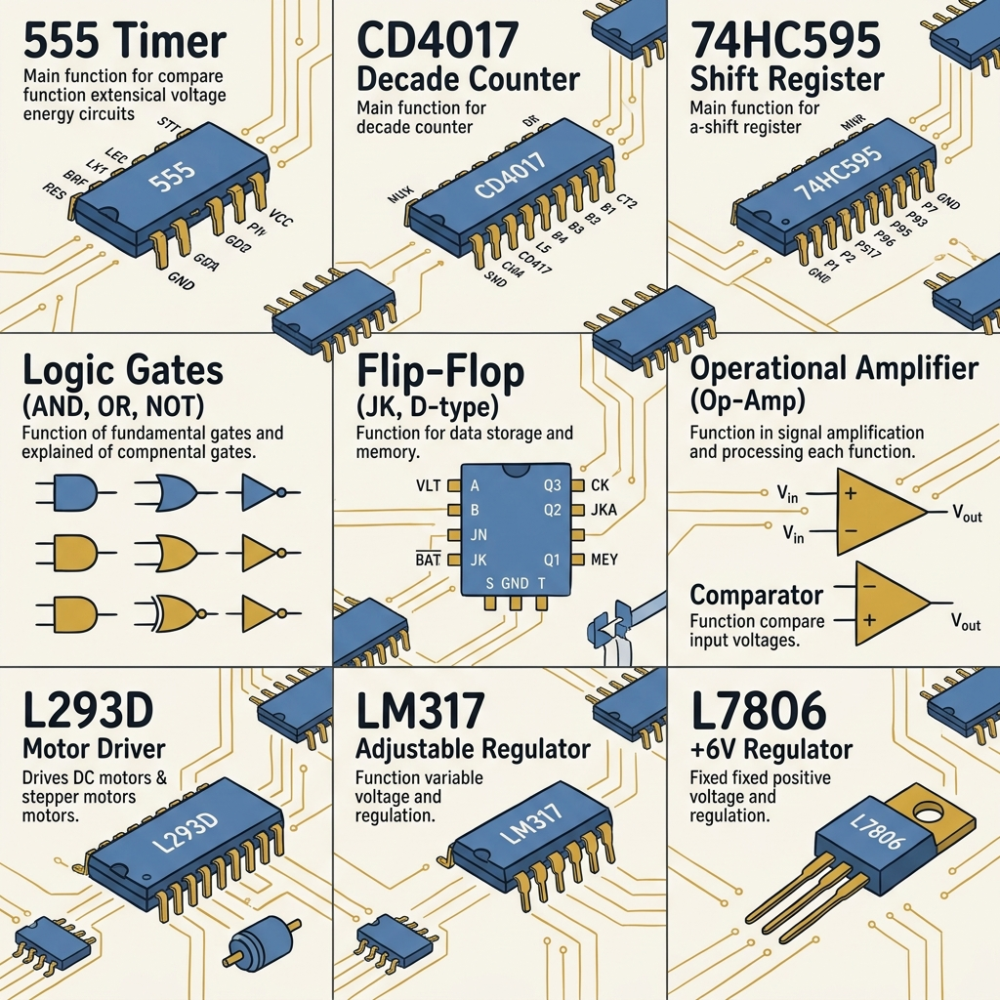
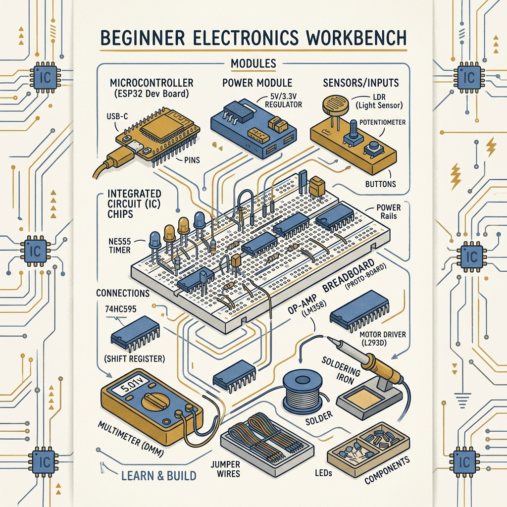
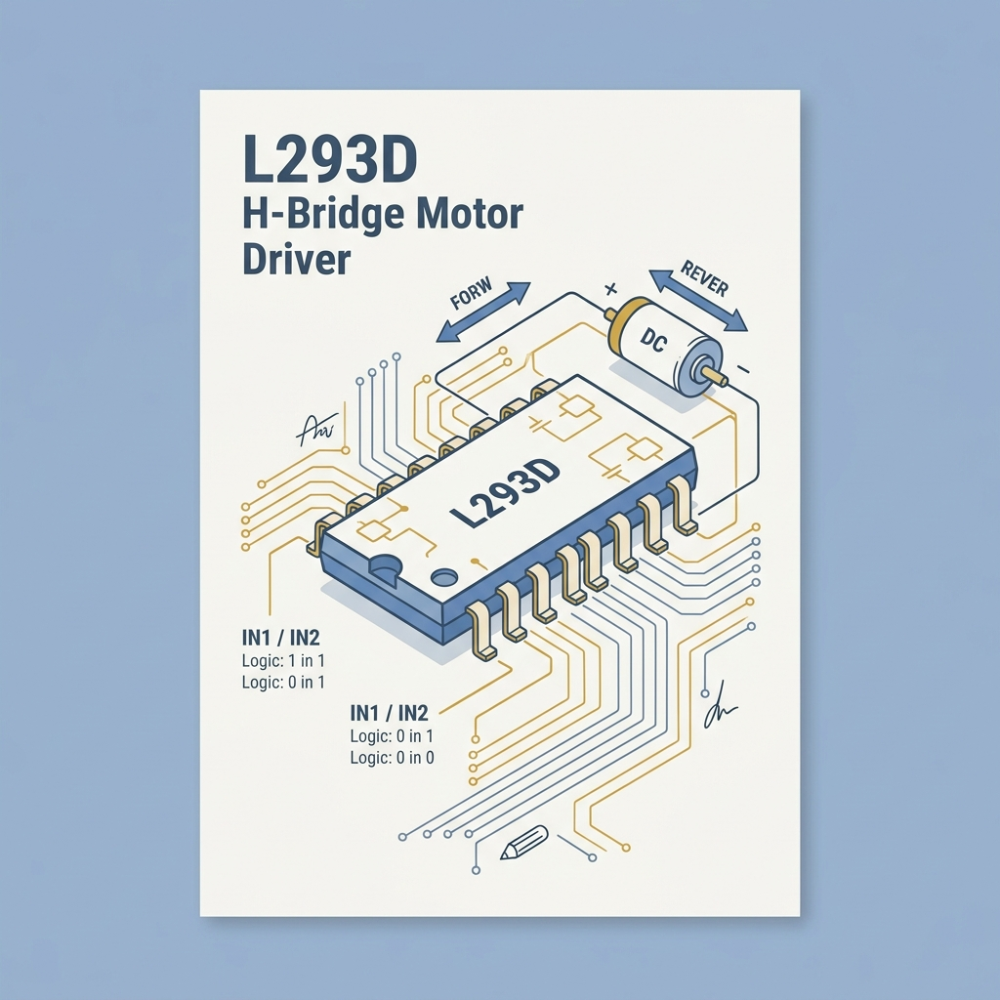

<!-- _class: title -->

# 10 Essential ICs for Electronics Beginners

555 Timer · CD4017 · 74HC595 · Logic Gates · Flip-Flop · Op-Amp · Comparator · L293D · LM317

<!-- Speaker: ไอซีทั้ง 10 ตัวนี้คือ building blocks ของวงจรอิเล็กทรอนิกส์พื้นฐาน เรียนรู้จบแล้วต่อโครงงานได้จริง -->

---

<!-- _class: cheatsheet -->
<!-- _backgroundColor: #f8f7f4 -->

<!-- Speaker: ภาพรวม 10 ไอซี — แต่ละช่องมี IC name, function หลัก, และ key pins. ใช้เป็น one-page reference ขณะทำงาน -->

---

## Why These 10 ICs?

10 building blocks ที่ครอบคลุม timing, counting, I/O expansion, logic, memory, sensing, actuation, และ power.

  

    
Accessible

    <h3>ราคา 20–50 บาท</h3>
    
หาซื้อได้ทั่วไป ทั้งร้านอิเล็กทรอนิกส์และออนไลน์

  

  

    
Foundational

    <h3>หลักการเดียวกับสมัยใหม่</h3>
    
SPI, PWM, H-bridge ใน Arduino/ESP32 ใช้แนวคิดเดียวกัน

  

  

    
Versatile

    <h3>เรียนหนึ่งใช้ได้หลาย</h3>
    
ต่อกันได้: 555 → CD4017 → LED chaser ใน 15 นาที

  

  

    
Stackable

    <h3>Daisy-chain ได้</h3>
    
74HC595 สองตัวต่อกัน → 16 outputs ด้วย 3 สัญญาณ

  

<b>★ Takeaway:</b> ราคาถูก, หาง่าย, ต่อกันได้ — เรียนรู้ 10 ตัวนี้แล้วเข้าใจ embedded systems ทุกชนิด

<!-- Speaker: เหตุผลที่เลือก 10 ตัวนี้ — ไม่ใช่แค่พื้นฐาน แต่เป็น gateway สู่หลักการที่ microcontroller สมัยใหม่ใช้ -->

---

## NE555 Timer: 3 Modes, 1 Chip

ไอซีที่ขายดีที่สุดในประวัติศาสตร์ — astable สร้าง clock, monostable สร้าง pulse, bistable เป็น latch.

<svg viewBox="0 0 1100 380" width="100%" xmlns="http://www.w3.org/2000/svg">
  <!-- Three mode boxes side by side -->
  <rect x="30" y="30" width="320" height="310" rx="12" fill="var(--paper)" stroke="var(--accent)" stroke-width="2" style="filter:drop-shadow(var(--shadow-sm))"/>
  <rect x="30" y="30" width="320" height="52" rx="12" fill="var(--accent)" opacity=".12"/>
  <text x="190" y="62" font-size="18" font-weight="700" fill="var(--accent)" text-anchor="middle" font-family="system-ui">Astable</text>
  <text x="190" y="102" font-size="14" fill="var(--ink)" text-anchor="middle" font-family="system-ui">Continuous square wave</text>
  <text x="190" y="128" font-size="12" fill="var(--ink-dim)" text-anchor="middle" font-family="system-ui">f = 1.44 / ((R1+2xR2) x C)</text>
  <!-- square wave icon -->
  <polyline points="100,180 100,155 140,155 140,195 180,195 180,155 220,155 220,195 260,195 260,155 290,155 290,180" fill="none" stroke="var(--accent)" stroke-width="2.5"/>
  <text x="190" y="250" font-size="12" fill="var(--ink-dim)" text-anchor="middle" font-family="system-ui">LED blink, oscillator</text>
  <text x="190" y="272" font-size="12" fill="var(--muted)" text-anchor="middle" font-family="system-ui">clock for CD4017</text>

  <rect x="390" y="30" width="320" height="310" rx="12" fill="var(--paper)" stroke="var(--gold)" stroke-width="2" style="filter:drop-shadow(var(--shadow-sm))"/>
  <rect x="390" y="30" width="320" height="52" rx="12" fill="var(--gold)" opacity=".12"/>
  <text x="550" y="62" font-size="18" font-weight="700" fill="var(--ink)" text-anchor="middle" font-family="system-ui">Monostable</text>
  <text x="550" y="102" font-size="14" fill="var(--ink)" text-anchor="middle" font-family="system-ui">Single pulse on trigger</text>
  <text x="550" y="128" font-size="12" fill="var(--ink-dim)" text-anchor="middle" font-family="system-ui">t = 1.1 x R x C</text>
  <!-- one-shot pulse icon -->
  <polyline points="430,190 430,190 460,190 460,155 520,155 520,190 670,190" fill="none" stroke="var(--gold)" stroke-width="2.5"/>
  <text x="550" y="250" font-size="12" fill="var(--ink-dim)" text-anchor="middle" font-family="system-ui">Button debounce</text>
  <text x="550" y="272" font-size="12" fill="var(--muted)" text-anchor="middle" font-family="system-ui">delay timer</text>

  <rect x="750" y="30" width="320" height="310" rx="12" fill="var(--paper)" stroke="var(--success)" stroke-width="2" style="filter:drop-shadow(var(--shadow-sm))"/>
  <rect x="750" y="30" width="320" height="52" rx="12" fill="var(--success)" opacity=".12"/>
  <text x="910" y="62" font-size="18" font-weight="700" fill="var(--success-ink)" text-anchor="middle" font-family="system-ui">Bistable</text>
  <text x="910" y="102" font-size="14" fill="var(--ink)" text-anchor="middle" font-family="system-ui">Latched HIGH or LOW</text>
  <text x="910" y="128" font-size="12" fill="var(--ink-dim)" text-anchor="middle" font-family="system-ui">Two stable states</text>
  <!-- latch icon -->
  <rect x="850" y="155" width="120" height="40" rx="8" fill="var(--success)" opacity=".15" stroke="var(--success)" stroke-width="1.5"/>
  <text x="910" y="180" font-size="13" fill="var(--success-ink)" text-anchor="middle" font-family="system-ui">OUTPUT = STABLE</text>
  <text x="910" y="250" font-size="12" fill="var(--ink-dim)" text-anchor="middle" font-family="system-ui">SR Latch</text>
  <text x="910" y="272" font-size="12" fill="var(--muted)" text-anchor="middle" font-family="system-ui">power-on state</text>
  <rect x="30" y="40" width="1" height="1" fill="none"/>
</svg>

<b>★ Takeaway:</b> Astable mode + CD4017 = LED chaser ใน 10 นาที — first project ที่สอน timing, counting, และ output expansion พร้อมกัน

<!-- Speaker: 555 Timer เป็นจุดเริ่มต้นที่ดีเพราะต่อกับไอซีอื่นทุกตัวในรายการนี้ได้ -->

---

## CD4017 Decade Counter: One Output at a Time

รับ clock pulse จาก 555 → เลื่อน HIGH ไปทีละ pin Q0–Q9 → LED chaser คลาสสิค

<svg viewBox="0 0 1100 340" width="100%" xmlns="http://www.w3.org/2000/svg">
  <!-- Left: signal flow -->
  <rect x="30" y="80" width="180" height="70" rx="10" fill="var(--accent)" opacity=".12" stroke="var(--accent)" stroke-width="1.5"/>
  <text x="120" y="110" font-size="14" font-weight="700" fill="var(--accent)" text-anchor="middle" font-family="system-ui">555 Timer</text>
  <text x="120" y="132" font-size="12" fill="var(--ink-dim)" text-anchor="middle" font-family="system-ui">Astable clock</text>
  <path d="M210,115 L260,115" stroke="var(--accent)" stroke-width="2" marker-end="url(#arr)"/>
  <defs>
    <marker id="arr" markerWidth="8" markerHeight="8" refX="6" refY="3" orient="auto">
      <path d="M0,0 L0,6 L8,3 z" fill="var(--accent)"/>
    </marker>
  </defs>
  <!-- CD4017 chip -->
  <rect x="260" y="50" width="200" height="200" rx="10" fill="var(--soft)" stroke="var(--ink-dim)" stroke-width="2"/>
  <text x="360" y="140" font-size="16" font-weight="700" fill="var(--ink)" text-anchor="middle" font-family="system-ui">CD4017</text>
  <text x="360" y="162" font-size="11" fill="var(--muted)" text-anchor="middle" font-family="system-ui">Decade Counter</text>
  <!-- CLK label -->
  <text x="252" y="120" font-size="10" fill="var(--accent)" text-anchor="end" font-family="system-ui">CLK</text>
  <!-- Outputs Q0-Q9 -->
  <path d="M460,80 L510,80" stroke="var(--muted)" stroke-width="1.5" marker-end="url(#arr2)"/>
  <path d="M460,100 L510,100" stroke="var(--muted)" stroke-width="1.5" marker-end="url(#arr2)"/>
  <path d="M460,120 L510,120" stroke="var(--muted)" stroke-width="1.5" marker-end="url(#arr2)"/>
  <path d="M460,140 L510,140" stroke="var(--muted)" stroke-width="1.5" marker-end="url(#arr2)"/>
  <path d="M460,160 L510,160" stroke="var(--muted)" stroke-width="1.5" marker-end="url(#arr2)"/>
  <path d="M460,180 L510,180" stroke="var(--muted)" stroke-width="1.5" marker-end="url(#arr2)"/>
  <path d="M460,200 L510,200" stroke="var(--muted)" stroke-width="1.5" marker-end="url(#arr2)"/>
  <path d="M460,220 L510,220" stroke="var(--accent)" stroke-width="2.5" marker-end="url(#arr)"/>
  <defs>
    <marker id="arr2" markerWidth="8" markerHeight="8" refX="6" refY="3" orient="auto">
      <path d="M0,0 L0,6 L8,3 z" fill="var(--muted)"/>
    </marker>
  </defs>
  <!-- Q labels -->
  <text x="468" y="78" font-size="10" fill="var(--muted)" font-family="system-ui">Q0</text>
  <text x="468" y="98" font-size="10" fill="var(--muted)" font-family="system-ui">Q1</text>
  <text x="468" y="118" font-size="10" fill="var(--muted)" font-family="system-ui">Q2</text>
  <text x="468" y="138" font-size="10" fill="var(--muted)" font-family="system-ui">Q3</text>
  <text x="468" y="158" font-size="10" fill="var(--muted)" font-family="system-ui">Q4</text>
  <text x="468" y="178" font-size="10" fill="var(--muted)" font-family="system-ui">Q5</text>
  <text x="468" y="198" font-size="10" fill="var(--muted)" font-family="system-ui">Q6-9</text>
  <text x="468" y="218" font-size="10" fill="var(--accent)" font-family="system-ui">active</text>
  <!-- LED array -->
  <circle cx="540" cy="80" r="12" fill="var(--muted)" opacity=".3"/>
  <circle cx="540" cy="100" r="12" fill="var(--muted)" opacity=".3"/>
  <circle cx="540" cy="120" r="12" fill="var(--muted)" opacity=".3"/>
  <circle cx="540" cy="140" r="12" fill="var(--muted)" opacity=".3"/>
  <circle cx="540" cy="160" r="12" fill="var(--muted)" opacity=".3"/>
  <circle cx="540" cy="180" r="12" fill="var(--muted)" opacity=".3"/>
  <circle cx="540" cy="200" r="12" fill="var(--muted)" opacity=".3"/>
  <circle cx="540" cy="220" r="16" fill="var(--gold)" opacity=".9"/>
  <text x="540" y="285" font-size="12" fill="var(--ink-dim)" text-anchor="middle" font-family="system-ui">LED array (Q0-Q9)</text>
  <!-- Right: key spec table -->
  <rect x="620" y="40" width="450" height="250" rx="10" fill="var(--paper)" stroke="var(--soft-2)" stroke-width="1.5"/>
  <text x="845" y="75" font-size="15" font-weight="700" fill="var(--ink)" text-anchor="middle" font-family="system-ui">Key Connections</text>
  <rect x="640" y="90" width="410" height="1" fill="var(--soft-2)"/>
  <text x="650" y="118" font-size="13" font-weight="700" fill="var(--ink)" font-family="system-ui">CLK (pin 14)</text>
  <text x="650" y="138" font-size="12" fill="var(--ink-dim)" font-family="system-ui">Clock input from 555 astable</text>
  <text x="650" y="165" font-size="13" font-weight="700" fill="var(--ink)" font-family="system-ui">CLK EN (pin 13) → GND</text>
  <text x="650" y="185" font-size="12" fill="var(--ink-dim)" font-family="system-ui">Must tie LOW to enable counting</text>
  <text x="650" y="212" font-size="13" font-weight="700" fill="var(--ink)" font-family="system-ui">RST (pin 15) → GND</text>
  <text x="650" y="232" font-size="12" fill="var(--ink-dim)" font-family="system-ui">Tie LOW; pull HIGH to reset to Q0</text>
  <text x="650" y="259" font-size="13" font-weight="700" fill="var(--accent)" font-family="system-ui">Carry Out (pin 12)</text>
  <text x="650" y="279" font-size="12" fill="var(--ink-dim)" font-family="system-ui">Pulse every 10 counts — daisy-chain</text>
  <rect x="30" y="40" width="1" height="1" fill="none"/>
</svg>

<b>★ Takeaway:</b> CD4017 + 555 Timer = LED chaser ใน 20 นาที — วงจรคลาสสิคที่สอนหลักการ counter, clock, และ one-hot output

<!-- Speaker: one-hot encoding คือ principle เดียวกับ state machine ใน microcontroller -->

---

## 74HC595: 3 Pins Control 8 Outputs

SIPO shift register — serial data in, parallel data out. ประหยัด GPIO ของ microcontroller อย่างมาก

<svg viewBox="0 0 1100 340" width="100%" xmlns="http://www.w3.org/2000/svg">
  <!-- MCU block -->
  <rect x="30" y="80" width="160" height="160" rx="10" fill="var(--soft)" stroke="var(--ink-dim)" stroke-width="1.5"/>
  <text x="110" y="155" font-size="14" font-weight="700" fill="var(--ink)" text-anchor="middle" font-family="system-ui">MCU</text>
  <text x="110" y="175" font-size="11" fill="var(--muted)" text-anchor="middle" font-family="system-ui">(Arduino)</text>
  <!-- 3 lines -->
  <path d="M190,110 L300,110" stroke="var(--accent)" stroke-width="2.5" stroke-dasharray="6,3"/>
  <path d="M190,160 L300,160" stroke="var(--gold)" stroke-width="2.5" stroke-dasharray="6,3"/>
  <path d="M190,210 L300,210" stroke="var(--success)" stroke-width="2.5" stroke-dasharray="6,3"/>
  <text x="245" y="100" font-size="11" fill="var(--accent)" text-anchor="middle" font-family="system-ui">DATA (SER)</text>
  <text x="245" y="152" font-size="11" fill="var(--ink)" text-anchor="middle" font-family="system-ui">SHIFT CLK</text>
  <text x="245" y="203" font-size="11" fill="var(--success-ink)" text-anchor="middle" font-family="system-ui">LATCH CLK</text>
  <!-- 74HC595 chip -->
  <rect x="300" y="60" width="200" height="220" rx="10" fill="var(--soft)" stroke="var(--accent)" stroke-width="2"/>
  <text x="400" y="160" font-size="15" font-weight="700" fill="var(--ink)" text-anchor="middle" font-family="system-ui">74HC595</text>
  <text x="400" y="182" font-size="11" fill="var(--muted)" text-anchor="middle" font-family="system-ui">Shift Register</text>
  <!-- 8 output lines -->
  <line x1="500" y1="85" x2="570" y2="85" stroke="var(--muted)" stroke-width="1.5"/>
  <line x1="500" y1="112" x2="570" y2="112" stroke="var(--muted)" stroke-width="1.5"/>
  <line x1="500" y1="139" x2="570" y2="139" stroke="var(--muted)" stroke-width="1.5"/>
  <line x1="500" y1="166" x2="570" y2="166" stroke="var(--muted)" stroke-width="1.5"/>
  <line x1="500" y1="193" x2="570" y2="193" stroke="var(--muted)" stroke-width="1.5"/>
  <line x1="500" y1="220" x2="570" y2="220" stroke="var(--muted)" stroke-width="1.5"/>
  <line x1="500" y1="247" x2="570" y2="247" stroke="var(--muted)" stroke-width="1.5"/>
  <line x1="500" y1="265" x2="570" y2="265" stroke="var(--muted)" stroke-width="1.5"/>
  <!-- LED circles -->
  <circle cx="590" cy="85" r="14" fill="var(--accent)" opacity=".7"/>
  <circle cx="590" cy="112" r="14" fill="var(--muted)" opacity=".3"/>
  <circle cx="590" cy="139" r="14" fill="var(--accent)" opacity=".7"/>
  <circle cx="590" cy="166" r="14" fill="var(--muted)" opacity=".3"/>
  <circle cx="590" cy="193" r="14" fill="var(--accent)" opacity=".7"/>
  <circle cx="590" cy="220" r="14" fill="var(--muted)" opacity=".3"/>
  <circle cx="590" cy="247" r="14" fill="var(--accent)" opacity=".7"/>
  <circle cx="590" cy="265" r="14" fill="var(--muted)" opacity=".3"/>
  <text x="590" y="305" font-size="11" fill="var(--ink-dim)" text-anchor="middle" font-family="system-ui">QA–QH</text>
  <!-- Label: 3 in 8 out -->
  <text x="220" y="290" font-size="13" font-weight="700" fill="var(--ink)" text-anchor="middle" font-family="system-ui">3 lines in</text>
  <text x="590" y="320" font-size="13" font-weight="700" fill="var(--accent)" text-anchor="middle" font-family="system-ui">8 outputs</text>
  <!-- Daisy chain hint -->
  <rect x="660" y="80" width="400" height="200" rx="10" fill="var(--paper)" stroke="var(--soft-2)" stroke-width="1.5"/>
  <text x="860" y="115" font-size="14" font-weight="700" fill="var(--ink)" text-anchor="middle" font-family="system-ui">Daisy-Chain</text>
  <text x="860" y="142" font-size="12" fill="var(--ink-dim)" text-anchor="middle" font-family="system-ui">Q7S (pin 9) of chip 1</text>
  <path d="M780,158 L940,158" stroke="var(--accent)" stroke-width="1.5" stroke-dasharray="4,3"/>
  <text x="860" y="178" font-size="12" fill="var(--ink-dim)" text-anchor="middle" font-family="system-ui">SER (pin 14) of chip 2</text>
  <text x="860" y="210" font-size="13" font-weight="700" fill="var(--accent)" text-anchor="middle" font-family="system-ui">= 16 outputs, same 3 lines</text>
  <text x="860" y="235" font-size="11" fill="var(--muted)" text-anchor="middle" font-family="system-ui">Extend to 32, 64... outputs</text>
  <text x="860" y="255" font-size="11" fill="var(--muted)" text-anchor="middle" font-family="system-ui">Same SPI principle as modern MCU</text>
  <rect x="30" y="40" width="1" height="1" fill="none"/>
</svg>

<b>★ Takeaway:</b> 74HC595 สอนหลักการ SPI — ส่งข้อมูล serial แล้ว latch parallel ออก เหมือนกับที่ microcontroller สมัยใหม่ใช้กับ sensors และ displays

<!-- Speaker: เหตุผลที่ต้องมี latch clock คือเพื่อป้องกัน glitch ขณะกำลัง shift ข้อมูล -->

---

## Logic Gates: Foundation of All Digital Circuits

AND, OR, NOT, NAND — ทุก CPU ในโลกสร้างจาก logic gates เหล่านี้

  

    
74HC08 — AND

    <h3>A AND B</h3>
    
Output HIGH เมื่อ input ทั้งสองเป็น HIGH. ใช้เปิด circuit เมื่อ 2 เงื่อนไขเป็นจริงพร้อมกัน

  

  

    
74HC32 — OR

    <h3>A OR B</h3>
    
Output HIGH เมื่ออย่างน้อย 1 input เป็น HIGH. ใช้รวมสัญญาณหลายแหล่ง

  

  

    
74HC04 — NOT

    <h3>NOT A</h3>
    
กลับสัญญาณ: HIGH → LOW, LOW → HIGH. 6 inverters ต่อชิป. สร้าง oscillator ได้ด้วยตัวเอง

  

  

    
74HC00 — NAND

    <h3>Universal Gate</h3>
    
NAND สร้าง AND/OR/NOT/XOR ได้ทุกแบบ. ชิปเดียวสร้าง logic ใดก็ได้ในทางทฤษฎี

  

<b>★ Takeaway:</b> NAND gate คือ "universal" gate — CPU ทุกตัวในโลก ตั้งแต่ Arduino ถึง M4 chip คือ NAND gates หลายพันล้านตัวต่อกัน

<!-- Speaker: การที่ NAND เป็น universal gate คือข้อเท็จจริงสำคัญของ digital logic -->

---

## Flip-Flop & Op-Amp: Memory and Amplification

74HC74 จำ 1 bit ต่อ clock edge — LM358 ขยายสัญญาณ analog ก่อนส่ง MCU

  

    
74HC74 — D Flip-Flop

    <h3>Edge-triggered Memory</h3>
    
จำค่า D ขณะ clock rising edge. ไม่สนใจ input ระหว่าง clock cycles.

    <ul>
      <li>Frequency divider: Q̄ → D = clock/2</li>
      <li>Shift register: chain หลายตัว</li>
      <li>RAM 8GB = flip-flop ~64 billion ตัว</li>
    </ul>
  

  

    
LM358 — Dual Op-Amp

    <h3>Signal Amplifier</h3>
    
ขยายสัญญาณแรงดัน ใช้ไฟ 3–32V. 2 op-amps ในชิปเดียว.

    <ul>
      <li>Non-inv: Gain = 1 + Rf/R1</li>
      <li>Inverting: Gain = -(Rf/R1)</li>
      <li>ขยาย microphone, LDR, thermistor → ADC</li>
    </ul>
  

<b>★ Takeaway:</b> Flip-flop = bridge ระหว่าง digital logic กับ memory; Op-Amp = bridge ระหว่าง analog world กับ digital MCU

<!-- Speaker: การเข้าใจว่า flip-flop คือ 1-bit memory ทำให้เข้าใจได้ว่า RAM และ CPU cache ทำงานอย่างไร -->

---

## Comparator & Voltage Regulators

LM393 ตัดสินใจว่า V+ หรือ V− สูงกว่า — L7806/LM317 รักษาแรงดันให้เสถียร

  

    
LM393 — Dual Comparator

    <h3>Voltage Decision Maker</h3>
    
V+ > V− → HIGH; V+ &lt; V− → LOW. ออกแบบมาเพื่อ saturation ต่างจาก op-amp ที่ linear.

    <ul>
      <li>Light sensor: LDR divider vs potentiometer</li>
      <li>Over-temp alarm: thermistor vs ref</li>
      <li>Zero-crossing detector for AC</li>
    </ul>
  

  

    
L7806 / LM317 — Regulators

    <h3>Stable Voltage Supply</h3>
    
L78xx: fixed output (5V, 6V, 12V, max 1A). LM317: adjustable 1.25–37V.

    <ul>
      <li>LM317 formula: Vout = 1.25 x (1 + R2/R1)</li>
      <li>Dropout: Vin must exceed Vout by 2–3V</li>
      <li>Add 0.1uF + 10uF caps on both rails</li>
    </ul>
  

<b>★ Takeaway:</b> เรียนรู้ regulator ก่อนเสมอ — แรงดันเกินทำลาย IC ทุกตัวในรายการนี้ได้ใน microsecond

<!-- Speaker: comparator กับ op-amp ต่างกันที่การออกแบบ internal: comparator ไม่มี frequency compensation ทำให้เร็วกว่า -->

---

## L293D: Logic to Mechanical

H-bridge driver เชื่อม logic signal 3.3V/5V กับ DC motor 12V/600mA — หลักการ H-bridge เดียวกับ EV

  

    
Direction Control

    <h3>IN1 / IN2 Truth Table</h3>
    
IN1=H, IN2=L → Forward

    
IN1=L, IN2=H → Reverse

    
IN1=IN2 → Stop (brake)

  

  

    
Speed Control

    <h3>EN Pin + PWM</h3>
    
EN=HIGH → Full speed

    
EN=PWM signal → Variable speed

    
Controls 2 DC motors or 1 stepper

  

<b>★ Takeaway:</b> L293D สอน H-bridge concept — EV ทุกคันใช้หลักการเดียวกัน เพียงแต่ scale จาก 600mA เป็น 400A

<!-- Speaker: limitation คือ voltage drop ~2V และ efficiency ต่ำ ถ้า motor > 1A ใช้ DRV8833 หรือ L298N แทน -->

---

## Common Caveats

ข้อผิดพลาดที่ทำให้ IC ตายบ่อยที่สุด — รู้ก่อน ประหยัดได้หลายร้อยบาท

  

    
Voltage Mismatch

    <h3>74HC vs CD4000</h3>
    
74HC: 2–6V. CD4000: 3–18V. ใช้ผิด supply → ตายทันที. ตรวจ datasheet ก่อนต่อ

  

  

    
Floating Input

    <h3>Logic Gate Input</h3>
    
Input ลอย → oscillate แบบสุ่ม. ต่อ pull-up 10k หรือ pull-down 10k เสมอ

  

  

    
L293D Power

    <h3>~2V Dropout</h3>
    
Efficiency ต่ำ มี heat สูง. Motor &gt; 1A → ใช้ L298N หรือ DRV8833 แทน

  

  

    
LM317 Min Load

    <h3>Min 3.5mA</h3>
    
ถ้ากระแสไหล &lt; 3.5mA → output ไม่เสถียร. เพิ่ม dummy load resistor

  

  

    
LM358 Rail

    <h3>Not Rail-to-Rail</h3>
    
Output ไม่ถึง rail ~1V. ต้องการ rail-to-rail → ใช้ MCP6002 แทน

  

  

    
555 Timer

    <h3>Decoupling Cap</h3>
    
ดึง current spike สูง. ใส่ 100nF ใกล้ขา Vcc เสมอ ป้องกัน noise

  

<b>★ Takeaway:</b> Decoupling capacitor (100nF) ใกล้ Vcc ของทุก IC คือ best practice ที่ช่วยได้ใน 80% ของปัญหา noise และ oscillation

<!-- Speaker: ปัญหา floating input เป็นสาเหตุอันดับ 1 ของ "วงจรทำงานบ้างไม่ทำงานบ้าง" -->

---

## Key Takeaways

10 ไอซี 10 หลักการ — เรียนรู้แล้วเข้าใจ embedded systems ทั้งหมด

  

    
Timing & Counting

    <h3>555 + CD4017</h3>
    
Clock signal → sequential counter. First project ที่ต่อกันได้ใน 15 นาที

  

  

    
I/O Expansion

    <h3>74HC595</h3>
    
3 MCU pins → 8 outputs. SPI protocol ใน miniature form

  

  

    
Logic & Memory

    <h3>Gates + Flip-Flop</h3>
    
Building blocks ของทุก CPU. NAND = universal gate

  

  

    
Analog Interface

    <h3>Op-Amp + Comparator</h3>
    
อ่านโลก analog ก่อนส่ง MCU. Sensor ทุกชนิดผ่านสองตัวนี้

  

  

    
Actuation

    <h3>L293D H-Bridge</h3>
    
Logic → Mechanical. หลักการเดียวกับ EV motor controller

  

  

    
Power

    <h3>L7806 / LM317</h3>
    
เรียนก่อน — แรงดันเกินทำลาย IC ทุกตัวได้ใน microsecond

  

<b>★ Takeaway:</b> 10 ตัวนี้ = timing + counting + I/O expansion + logic + memory + sensing + actuation + power — ครบทุก layer ของ embedded system

<!-- Speaker: ขอบคุณ จบ deck นี้แล้ว ลองต่อ 555 + CD4017 เป็น LED chaser เป็น first project ได้เลย -->
