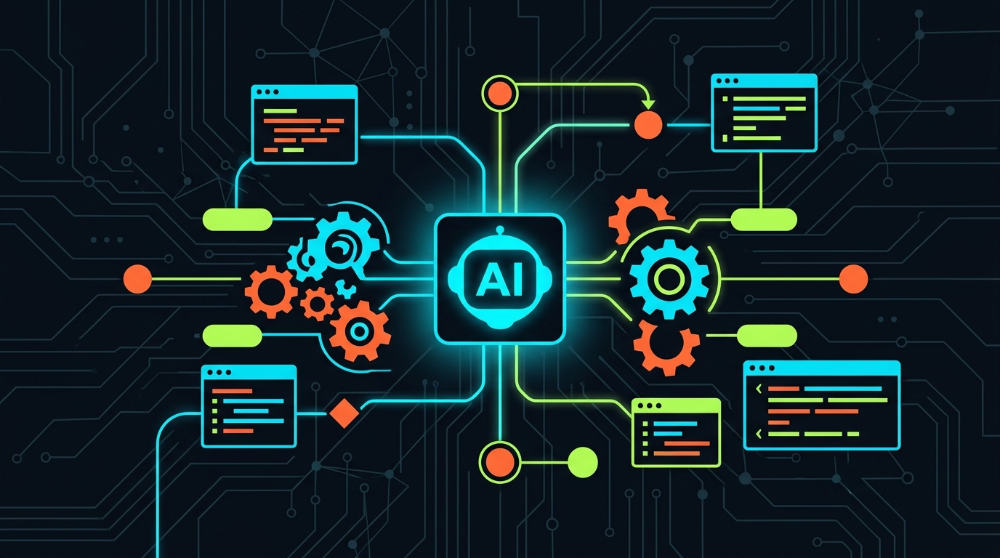
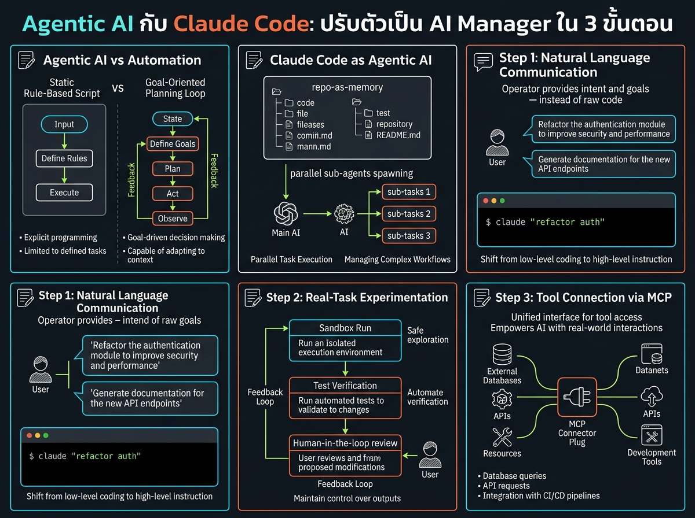

<!-- _class: title -->

# Agentic AI กับ Claude Code: ปรับตัวเป็น AI Manager ใน 3 ขั้นตอน

จากตอบคำถามสู่ลงมือทำเองจนถึงเป้าหมาย — ไม่ต้องมีพื้นฐานโค้ด

<!-- Speaker: 30-second intro — AI ยุคใหม่ไม่ใช่แค่ตอบคำถาม แต่ลงมือทำงานแทนคนได้ ทักษะที่ต้องมีคือการเป็น AI Manager -->

---

<!-- _class: cheatsheet -->
<!-- _backgroundColor: #f8f7f4 -->

<!-- Speaker: 60-second cheatsheet orientation — ชี้ 5 concept หลักก่อนเข้าเนื้อหา -->

---

## ทำไม Agentic AI ถึงสำคัญตอนนี้

Automation เดิมทำตามกฎตายตัว แต่ Agentic AI ตัดสินใจและลงมือทำเองจนถึงเป้าหมาย

<svg viewBox="0 0 700 320" width="100%" xmlns="http://www.w3.org/2000/svg">
  <rect x="30" y="30" width="640" height="90" rx="12" fill="var(--soft)" stroke="var(--soft-2)" stroke-width="1.5"/>
  <text x="60" y="65" font-size="16" font-weight="700" fill="var(--ink)" font-family="system-ui">Old automation</text>
  <text x="60" y="95" font-size="13" fill="var(--ink-dim)" font-family="system-ui">Fixed rules — breaks on the unexpected, waits for a human fix</text>
  <rect x="30" y="140" width="640" height="90" rx="12" fill="var(--accent-wash)" stroke="var(--accent)" stroke-width="2"/>
  <text x="60" y="175" font-size="16" font-weight="700" fill="var(--accent-deep)" font-family="system-ui">Agentic AI</text>
  <text x="60" y="205" font-size="13" fill="var(--ink)" font-family="system-ui">Takes action toward a goal on its own — you state the outcome, not the steps</text>
  <path d="M350 230 L350 260" stroke="var(--muted)" stroke-width="2" marker-end="url(#arr)"/>
  <text x="350" y="290" font-size="13" fill="var(--ink-dim)" text-anchor="middle" font-family="system-ui">The skill gap now: managing AI, not writing code</text>
  <defs><marker id="arr" viewBox="0 0 10 10" refX="8" refY="5" markerWidth="6" markerHeight="6" orient="auto"><path d="M0 0L10 5L0 10z" fill="var(--muted)"/></marker></defs>
</svg>

<b>★ Takeaway:</b> คนไม่ได้แพ้ AI แต่จะแพ้คนที่ใช้ AI เป็น — องค์กรที่ปรับตัวไม่ทันเสียเปรียบ

<!-- Speaker: โฟกัสที่ risk ที่แท้จริงคือคู่แข่งที่ใช้ AI คล่องกว่า ไม่ใช่ AI แย่งงานตรงๆ -->

---

## Agentic AI vs Automation แบบเดิม

Agentic loop: กำหนดเป้าหมาย → ประเมินสถานการณ์ → ลงมือ → ตรวจผล → วนซ้ำจนสำเร็จ

<svg viewBox="0 0 1100 380" width="100%" xmlns="http://www.w3.org/2000/svg">
  <rect x="40" y="20" width="490" height="340" rx="12" fill="var(--paper)" stroke="var(--soft-2)" stroke-width="1.5" style="filter:drop-shadow(var(--shadow-sm))"/>
  <rect x="40" y="20" width="490" height="56" rx="12" fill="var(--soft)" opacity=".8"/>
  <text x="285" y="54" font-size="17" font-weight="700" fill="var(--ink-dim)" text-anchor="middle" font-family="system-ui">Traditional Automation</text>
  <text x="80" y="110" font-size="15" fill="var(--ink)" font-family="system-ui">Follows fixed, pre-written rules</text>
  <text x="80" y="145" font-size="15" fill="var(--ink-dim)" font-family="system-ui">Fails hard on unexpected input</text>
  <text x="80" y="180" font-size="15" fill="var(--muted)" font-family="system-ui">Needs a human to fix every break</text>
  <rect x="570" y="20" width="490" height="340" rx="12" fill="var(--paper)" stroke="var(--accent)" stroke-width="2" style="filter:drop-shadow(var(--shadow-md))"/>
  <rect x="570" y="20" width="490" height="56" rx="12" fill="var(--accent)" opacity=".08"/>
  <text x="815" y="54" font-size="17" font-weight="700" fill="var(--accent)" text-anchor="middle" font-family="system-ui">Agentic AI (Claude Code)</text>
  <text x="610" y="110" font-size="15" fill="var(--ink)" font-family="system-ui">Dynamic planning loop toward a goal</text>
  <text x="610" y="145" font-size="15" fill="var(--ink)" font-family="system-ui">Observes results, self-corrects</text>
  <text x="610" y="180" font-size="15" fill="var(--ink)" font-family="system-ui">Only stops when the goal is verified done</text>
  <circle cx="550" cy="190" r="28" fill="var(--accent)"/>
  <text x="550" y="195" font-size="14" font-weight="700" fill="var(--paper)" text-anchor="middle" dominant-baseline="central" font-family="system-ui">VS</text>
</svg>

<b>★ Takeaway:</b> "Agentic" แปลว่า AI ลงมือทำเองต่อเนื่องได้ ไม่ใช่แค่ตอบคำถามทีละครั้ง

<!-- Speaker: เน้นคำว่า take action on its own towards a goal -->

---

## Claude Code as Agentic AI

Repository เป็นความจำถาวร ทำให้ Claude Code เข้าใจบริบทงานทั้งหมดโดยไม่ต้องอธิบายซ้ำ

<svg viewBox="0 0 700 320" width="100%" xmlns="http://www.w3.org/2000/svg">
  <rect x="20" y="20" width="660" height="80" rx="10" fill="var(--soft)"/>
  <text x="45" y="52" font-size="15" font-weight="700" fill="var(--ink)" font-family="system-ui">Repo-as-memory</text>
  <text x="45" y="78" font-size="13" fill="var(--ink-dim)" font-family="system-ui">Reads the whole project, keeps context persistent</text>
  <rect x="20" y="115" width="660" height="80" rx="10" fill="var(--soft)"/>
  <text x="45" y="147" font-size="15" font-weight="700" fill="var(--ink)" font-family="system-ui">Division of labor</text>
  <text x="45" y="173" font-size="13" fill="var(--ink-dim)" font-family="system-ui">Human: what to build. Agent: how to build it</text>
  <rect x="20" y="210" width="660" height="80" rx="10" fill="var(--soft)"/>
  <text x="45" y="242" font-size="15" font-weight="700" fill="var(--ink)" font-family="system-ui">Parallel sub-agents</text>
  <text x="45" y="268" font-size="13" fill="var(--ink-dim)" font-family="system-ui">Splits work across sub-agents running at once</text>
</svg>

<b>★ Takeaway:</b> Claude Code ต่างจาก chatbot ตรงที่มันทำงานหลายขั้นตอนแบบต่อเนื่องได้เอง

<!-- Speaker: ยกตัวอย่าง sub-agent วิเคราะห์ไฟล์หลายไฟล์พร้อมกัน -->

---

## 3 ขั้นตอนสู่การเป็น AI Manager

ไม่ต้องเขียนโค้ดเป็น แต่ต้องรู้จักมอบหมาย ตรวจสอบ และเชื่อมต่อเครื่องมือ

<svg viewBox="0 0 1100 340" width="100%" xmlns="http://www.w3.org/2000/svg">
  <rect x="30" y="80" width="300" height="200" rx="14" fill="var(--paper)" stroke="var(--accent)" stroke-width="2" style="filter:drop-shadow(var(--shadow-sm))"/>
  <circle cx="180" cy="120" r="22" fill="var(--accent)"/>
  <text x="180" y="126" font-size="16" font-weight="700" fill="var(--paper)" text-anchor="middle" font-family="system-ui">1</text>
  <text x="180" y="168" font-size="14" font-weight="700" fill="var(--ink)" text-anchor="middle" font-family="system-ui">Natural Language</text>
  <text x="180" y="190" font-size="12" fill="var(--ink-dim)" text-anchor="middle" font-family="system-ui">บอกเป้าหมาย + guardrail</text>
  <text x="180" y="210" font-size="12" fill="var(--muted)" text-anchor="middle" font-family="system-ui">ปฐมนิเทศแบบพนักงานใหม่</text>
  <path d="M340 180 L390 180" stroke="var(--muted)" stroke-width="2.5" marker-end="url(#arr2)"/>
  <rect x="400" y="80" width="300" height="200" rx="14" fill="var(--paper)" stroke="var(--accent)" stroke-width="2" style="filter:drop-shadow(var(--shadow-sm))"/>
  <circle cx="550" cy="120" r="22" fill="var(--accent)"/>
  <text x="550" y="126" font-size="16" font-weight="700" fill="var(--paper)" text-anchor="middle" font-family="system-ui">2</text>
  <text x="550" y="168" font-size="14" font-weight="700" fill="var(--ink)" text-anchor="middle" font-family="system-ui">Real-Task Test</text>
  <text x="550" y="190" font-size="12" fill="var(--ink-dim)" text-anchor="middle" font-family="system-ui">ลองกับงานที่ทำซ้ำทุกสัปดาห์</text>
  <text x="550" y="210" font-size="12" fill="var(--muted)" text-anchor="middle" font-family="system-ui">Review + Feedback ทุกครั้ง</text>
  <path d="M710 180 L760 180" stroke="var(--muted)" stroke-width="2.5" marker-end="url(#arr2)"/>
  <rect x="770" y="80" width="300" height="200" rx="14" fill="var(--paper)" stroke="var(--gold)" stroke-width="2" style="filter:drop-shadow(var(--shadow-md))"/>
  <circle cx="920" cy="120" r="22" fill="var(--gold)"/>
  <text x="920" y="126" font-size="16" font-weight="700" fill="var(--paper)" text-anchor="middle" font-family="system-ui">3</text>
  <text x="920" y="168" font-size="14" font-weight="700" fill="var(--ink)" text-anchor="middle" font-family="system-ui">Connect via MCP</text>
  <text x="920" y="190" font-size="12" fill="var(--ink-dim)" text-anchor="middle" font-family="system-ui">ผูกเครื่องมือที่ใช้ประจำ</text>
  <text x="920" y="210" font-size="12" fill="var(--muted)" text-anchor="middle" font-family="system-ui">DB, GitHub, Gmail แบบ end-to-end</text>
  <defs><marker id="arr2" viewBox="0 0 10 10" refX="8" refY="5" markerWidth="7" markerHeight="7" orient="auto"><path d="M0 0L10 5L0 10z" fill="var(--muted)"/></marker></defs>
</svg>

<b>★ Takeaway:</b> เริ่มจากสื่อสารชัด → ทดลองงานจริง+รีวิว → ค่อยขยายด้วย MCP เมื่อคุ้นมือ

<!-- Speaker: ย้ำว่า step 2 คือหัวใจของการเป็น manager คือ review ไม่ใช่ปล่อยผ่าน -->

---

## Caveats: AI Manager ยังต้องตรวจสอบเสมอ

Agentic AI ไม่ใช่ระบบที่ปล่อยทำงานได้โดยไม่มีคนคุม

  

    
Guardrail

    <h3>คำสั่งกำกวม = พลาดง่าย</h3>
    
ความแม่นยำขึ้นกับความชัดเจนของ guardrail ที่ผู้ใช้กำหนดไว้ตั้งแต่แรก

  

  

    
Security

    <h3>MCP ต้องจำกัดสิทธิ์</h3>
    
เชื่อมต่อฐานข้อมูล/อีเมลผ่าน MCP ควรให้สิทธิ์เท่าที่จำเป็นเท่านั้น

  

  

    
Human-in-loop

    <h3>Domain expertise ยังจำเป็น</h3>
    
ความเชี่ยวชาญของคนช่วยจับความผิดพลาดที่ agent มองไม่เห็นเอง

  

<b>★ Takeaway:</b> งานที่กระทบข้อมูลจริงหรือส่งออกภายนอก ต้อง review ทุกครั้ง ไม่มีข้อยกเว้น

<!-- Speaker: ย้ำ security ของ MCP connection เป็นความเสี่ยงที่มองข้ามบ่อยที่สุด -->

---

## Key Takeaways

สิ่งที่ต้องจำแม้ข้ามเนื้อหาส่วนอื่นไปทั้งหมด

<svg viewBox="0 0 1100 340" width="100%" xmlns="http://www.w3.org/2000/svg">
  <circle cx="550" cy="170" r="160" fill="none" stroke="var(--soft-2)" stroke-width="1.5"/>
  <circle cx="550" cy="170" r="110" fill="none" stroke="var(--accent)" stroke-width="1.5" opacity=".4"/>
  <circle cx="550" cy="170" r="60" fill="var(--accent)" opacity=".1"/>
  <circle cx="550" cy="170" r="60" fill="none" stroke="var(--accent)" stroke-width="2"/>
  <text x="550" y="164" font-size="15" font-weight="700" fill="var(--accent)" text-anchor="middle" font-family="system-ui">AI Manager</text>
  <text x="550" y="184" font-size="13" fill="var(--ink)" text-anchor="middle" font-family="system-ui">mindset</text>
  <text x="380" y="100" font-size="13" fill="var(--ink)" font-family="system-ui" text-anchor="middle">Natural</text>
  <text x="380" y="120" font-size="12" fill="var(--muted)" font-family="system-ui" text-anchor="middle">language</text>
  <text x="730" y="100" font-size="13" fill="var(--ink)" font-family="system-ui" text-anchor="middle">Real-task</text>
  <text x="730" y="120" font-size="12" fill="var(--muted)" font-family="system-ui" text-anchor="middle">review</text>
  <text x="220" y="170" font-size="13" fill="var(--muted)" font-family="system-ui" text-anchor="middle">No-code</text>
  <text x="220" y="190" font-size="13" fill="var(--muted)" font-family="system-ui" text-anchor="middle">entry</text>
  <text x="880" y="170" font-size="13" fill="var(--muted)" font-family="system-ui" text-anchor="middle">MCP</text>
  <text x="880" y="190" font-size="13" fill="var(--muted)" font-family="system-ui" text-anchor="middle">tool-connect</text>
</svg>

<b>★ Takeaway:</b> ไม่ต้องเขียนโค้ดเก่ง แต่ต้องบริหาร AI เป็น — สื่อสารชัด ทดลองจริง รีวิวเสมอ แล้วค่อยขยายด้วย MCP

<!-- Speaker: ปิดท้ายด้วย call-to-action ให้ลองงานจริงชิ้นแรกภายในสัปดาห์นี้ -->
