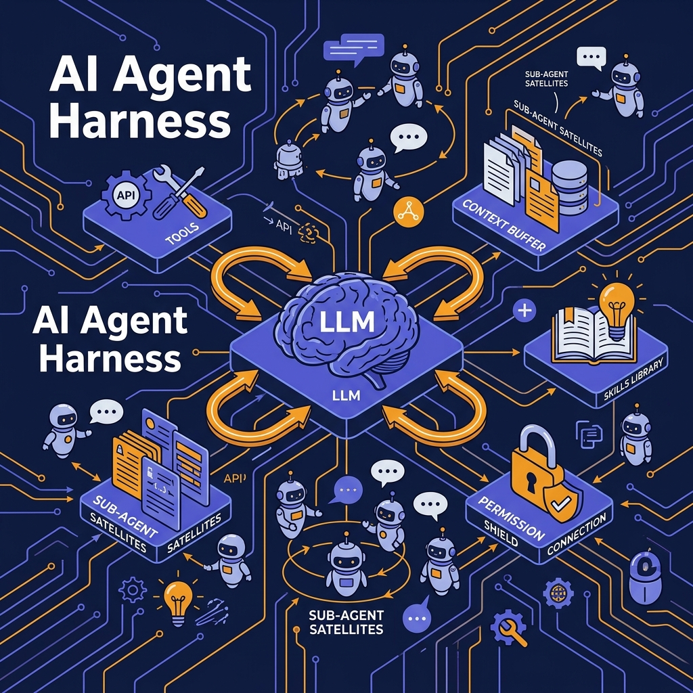
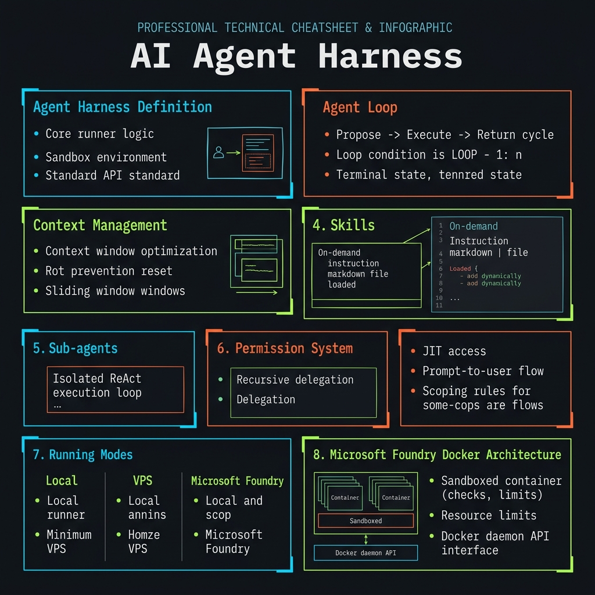
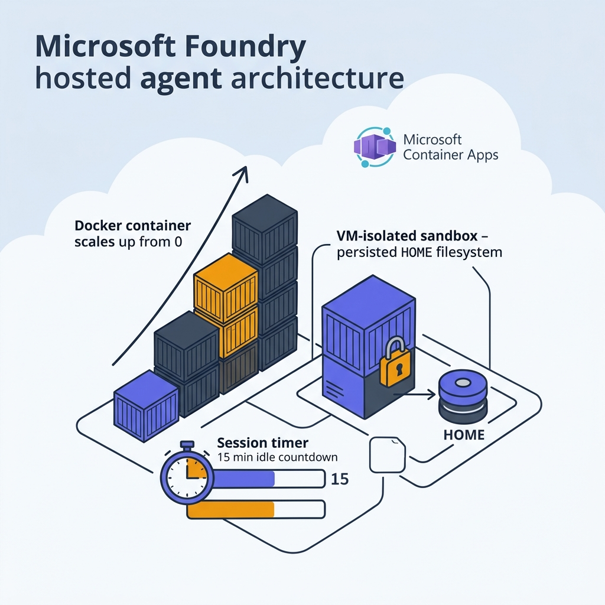

<!-- _class: title -->

# AI Agent Harness

Context Management, Skills, Sub-agents & Microsoft Foundry Hosted Agents

<!-- Speaker: 30s intro — LLM alone is helpless in the real world; harness turns it into an autonomous worker. The quality of the harness determines what the agent can do. -->

---

<!-- _class: cheatsheet -->
<!-- _backgroundColor: #f8f7f4 -->

<!-- Speaker: 60s cheatsheet overview — 8 panels map to 8 sections: Harness definition, Agent Loop, Context Rot, Skills, Sub-agents, Permissions, 3 Modes, Foundry. -->

---

## Harness Automates the Human-in-the-Loop

ChatGPT ต้องการ human copy-paste loop — harness ทำแทนอัตโนมัติ

<svg viewBox="0 0 1100 320" width="100%" xmlns="http://www.w3.org/2000/svg">
  <rect x="60" y="30" width="430" height="260" rx="12" fill="var(--paper)" stroke="var(--soft-2)" stroke-width="1.5" style="filter:drop-shadow(var(--shadow-sm))"/>
  <rect x="60" y="30" width="430" height="48" rx="12" fill="var(--soft)" opacity=".9"/>
  <text x="275" y="60" font-size="15" font-weight="700" fill="var(--ink-dim)" text-anchor="middle" font-family="system-ui">Without Harness — Manual Loop</text>
  <text x="90" y="110" font-size="14" fill="var(--ink)" font-family="system-ui">1. Human writes prompt in ChatGPT</text>
  <text x="90" y="140" font-size="14" fill="var(--ink)" font-family="system-ui">2. LLM returns code suggestion</text>
  <text x="90" y="170" font-size="14" fill="var(--ink)" font-family="system-ui">3. Human copies to editor manually</text>
  <text x="90" y="200" font-size="14" fill="var(--ink)" font-family="system-ui">4. Human runs tests, copies errors back</text>
  <text x="90" y="235" font-size="14" fill="var(--danger)" font-family="system-ui">5. Repeat manually — every iteration</text>
  <text x="560" y="170" font-size="30" font-weight="700" fill="var(--accent)" text-anchor="middle" font-family="system-ui">-&gt;</text>
  <rect x="610" y="30" width="430" height="260" rx="12" fill="var(--paper)" stroke="var(--accent)" stroke-width="2" style="filter:drop-shadow(var(--shadow-md))"/>
  <rect x="610" y="30" width="430" height="48" rx="12" fill="var(--accent)" opacity=".1"/>
  <text x="825" y="60" font-size="15" font-weight="700" fill="var(--accent)" text-anchor="middle" font-family="system-ui">With Harness — Autonomous Loop</text>
  <text x="640" y="110" font-size="14" fill="var(--ink)" font-family="system-ui">1. Human defines the goal once</text>
  <text x="640" y="140" font-size="14" fill="var(--ink)" font-family="system-ui">2. LLM proposes next action</text>
  <text x="640" y="170" font-size="14" fill="var(--ink)" font-family="system-ui">3. Harness executes (edit, run, call)</text>
  <text x="640" y="200" font-size="14" fill="var(--ink)" font-family="system-ui">4. Result injected back into context</text>
  <text x="640" y="235" font-size="14" fill="var(--success)" font-family="system-ui">5. Loop continues until task done</text>
  <rect x="1" y="1" width="1" height="1" fill="none"/>
</svg>

<b>★ Takeaway:</b> Harness replaces the human shuttle — model proposes, harness acts, loop runs autonomously until done.

<!-- Speaker: Cursor vs ChatGPT web — the gap is entirely the harness. Same underlying model, wildly different capability. -->

---

## Harness = Scaffolding That Multiplies Model Capability

3 core responsibilities — upgrade harness ได้ผลกว่า upgrade model version

<svg viewBox="0 0 1100 340" width="100%" xmlns="http://www.w3.org/2000/svg">
  <rect x="60" y="30" width="300" height="280" rx="12" fill="var(--paper)" stroke="var(--soft-2)" stroke-width="1.5" style="filter:drop-shadow(var(--shadow-md))"/>
  <rect x="60" y="30" width="300" height="6" rx="3" fill="var(--accent)"/>
  <circle cx="210" cy="105" r="32" fill="var(--accent)" opacity=".12"/>
  <circle cx="210" cy="105" r="22" fill="var(--accent)"/>
  <text x="210" y="111" font-size="16" font-weight="700" fill="var(--paper)" text-anchor="middle" dominant-baseline="central" font-family="system-ui">1</text>
  <text x="210" y="157" font-size="15" font-weight="700" fill="var(--ink)" text-anchor="middle" font-family="system-ui">Context Management</text>
  <text x="210" y="183" font-size="12" fill="var(--ink-dim)" text-anchor="middle" font-family="system-ui">Controls what model sees</text>
  <text x="210" y="205" font-size="12" fill="var(--muted)" text-anchor="middle" font-family="system-ui">each turn: code, errors,</text>
  <text x="210" y="225" font-size="12" fill="var(--muted)" text-anchor="middle" font-family="system-ui">history, tool results</text>
  <rect x="400" y="30" width="300" height="280" rx="12" fill="var(--paper)" stroke="var(--soft-2)" stroke-width="1.5" style="filter:drop-shadow(var(--shadow-md))"/>
  <rect x="400" y="30" width="300" height="6" rx="3" fill="var(--gold)"/>
  <circle cx="550" cy="105" r="32" fill="var(--gold)" opacity=".2"/>
  <circle cx="550" cy="105" r="22" fill="var(--gold)"/>
  <text x="550" y="111" font-size="16" font-weight="700" fill="var(--paper)" text-anchor="middle" dominant-baseline="central" font-family="system-ui">2</text>
  <text x="550" y="157" font-size="15" font-weight="700" fill="var(--ink)" text-anchor="middle" font-family="system-ui">Tool Execution</text>
  <text x="550" y="183" font-size="12" fill="var(--ink-dim)" text-anchor="middle" font-family="system-ui">Executes real actions</text>
  <text x="550" y="205" font-size="12" fill="var(--muted)" text-anchor="middle" font-family="system-ui">edit files, run tests,</text>
  <text x="550" y="225" font-size="12" fill="var(--muted)" text-anchor="middle" font-family="system-ui">call APIs — not just propose</text>
  <rect x="740" y="30" width="300" height="280" rx="12" fill="var(--paper)" stroke="var(--soft-2)" stroke-width="1.5" style="filter:drop-shadow(var(--shadow-md))"/>
  <rect x="740" y="30" width="300" height="6" rx="3" fill="var(--success)"/>
  <circle cx="890" cy="105" r="32" fill="var(--success)" opacity=".12"/>
  <circle cx="890" cy="105" r="22" fill="var(--success)"/>
  <text x="890" y="111" font-size="16" font-weight="700" fill="var(--paper)" text-anchor="middle" dominant-baseline="central" font-family="system-ui">3</text>
  <text x="890" y="157" font-size="15" font-weight="700" fill="var(--ink)" text-anchor="middle" font-family="system-ui">Loop Control</text>
  <text x="890" y="183" font-size="12" fill="var(--ink-dim)" text-anchor="middle" font-family="system-ui">Decides: continue loop</text>
  <text x="890" y="205" font-size="12" fill="var(--muted)" text-anchor="middle" font-family="system-ui">or declare task done</text>
  <text x="890" y="225" font-size="12" fill="var(--muted)" text-anchor="middle" font-family="system-ui">or escalate to human</text>
  <rect x="1" y="1" width="1" height="1" fill="none"/>
</svg>

<b>★ Takeaway:</b> Harness คือ multiplier — 3 responsibilities นี้กำหนดว่า agent ทำอะไรได้บ้าง.

<!-- Speaker: Every agentic product — Cursor, Claude Code, Devin — implements these 3. Quality gap is in the implementation, not the model. -->

---

## Agent Loop: Model Proposes, Harness Executes

แต่ละรอบ: context → LLM → action → execute → result กลับ context; loop จนงานเสร็จ

<svg viewBox="0 0 1100 320" width="100%" xmlns="http://www.w3.org/2000/svg">
  <rect x="30" y="110" width="150" height="70" rx="12" fill="var(--soft)" stroke="var(--soft-2)" stroke-width="1.5"/>
  <text x="105" y="143" font-size="14" font-weight="700" fill="var(--ink)" text-anchor="middle" font-family="system-ui">Context</text>
  <text x="105" y="165" font-size="11" fill="var(--ink-dim)" text-anchor="middle" font-family="system-ui">prepared by harness</text>
  <line x1="180" y1="145" x2="218" y2="145" stroke="var(--muted)" stroke-width="2"/>
  <polygon points="218,139 230,145 218,151" fill="var(--muted)"/>
  <rect x="230" y="110" width="150" height="70" rx="12" fill="var(--accent)" opacity=".15" stroke="var(--accent)" stroke-width="1.5"/>
  <text x="305" y="143" font-size="14" font-weight="700" fill="var(--accent)" text-anchor="middle" font-family="system-ui">LLM</text>
  <text x="305" y="165" font-size="11" fill="var(--ink-dim)" text-anchor="middle" font-family="system-ui">choose action</text>
  <line x1="380" y1="145" x2="418" y2="145" stroke="var(--muted)" stroke-width="2"/>
  <polygon points="418,139 430,145 418,151" fill="var(--muted)"/>
  <rect x="430" y="110" width="150" height="70" rx="12" fill="var(--gold)" opacity=".15" stroke="var(--gold)" stroke-width="1.5"/>
  <text x="505" y="143" font-size="14" font-weight="700" fill="var(--warning-ink)" text-anchor="middle" font-family="system-ui">Action</text>
  <text x="505" y="165" font-size="11" fill="var(--ink-dim)" text-anchor="middle" font-family="system-ui">tool call or answer</text>
  <line x1="580" y1="145" x2="618" y2="145" stroke="var(--muted)" stroke-width="2"/>
  <polygon points="618,139 630,145 618,151" fill="var(--muted)"/>
  <rect x="630" y="110" width="150" height="70" rx="12" fill="var(--success)" opacity=".1" stroke="var(--success)" stroke-width="1.5"/>
  <text x="705" y="143" font-size="14" font-weight="700" fill="var(--success-ink)" text-anchor="middle" font-family="system-ui">Execute</text>
  <text x="705" y="165" font-size="11" fill="var(--ink-dim)" text-anchor="middle" font-family="system-ui">harness runs tool</text>
  <line x1="780" y1="145" x2="818" y2="145" stroke="var(--muted)" stroke-width="2"/>
  <polygon points="818,139 830,145 818,151" fill="var(--muted)"/>
  <rect x="830" y="110" width="240" height="70" rx="12" fill="var(--soft)" stroke="var(--soft-2)" stroke-width="1.5"/>
  <text x="950" y="143" font-size="14" font-weight="700" fill="var(--ink)" text-anchor="middle" font-family="system-ui">Result</text>
  <text x="950" y="165" font-size="11" fill="var(--ink-dim)" text-anchor="middle" font-family="system-ui">output injected into context</text>
  <path d="M950 180 C950 260 105 260 105 180" fill="none" stroke="var(--accent)" stroke-width="2" stroke-dasharray="6,4"/>
  <polygon points="99,174 105,186 111,174" fill="var(--accent)"/>
  <text x="530" y="250" font-size="13" fill="var(--accent)" text-anchor="middle" font-family="system-ui">Loop: repeat until done / step-limit / escalate</text>
  <rect x="1" y="1" width="1" height="1" fill="none"/>
</svg>

<b>★ Takeaway:</b> LLM never executes directly — harness owns all side effects; loop breaks at step limit or task complete.

<!-- Speaker: LLM is a proposer only. Harness is the executor. This separation is the safety and control lever in every production system. -->

---

## Context Rot Silently Degrades Agent Quality

Context เต็มด้วยข้อมูลล้าสมัย → LLM เสียสมาธิ → quality ลดลงโดยไม่มี error

<svg viewBox="0 0 1100 300" width="100%" xmlns="http://www.w3.org/2000/svg">
  <rect x="30" y="20" width="470" height="260" rx="12" fill="var(--paper)" stroke="var(--danger)" stroke-width="1.5" opacity=".8" style="filter:drop-shadow(var(--shadow-sm))"/>
  <text x="265" y="52" font-size="14" font-weight="700" fill="var(--danger)" text-anchor="middle" font-family="system-ui">Context Rot — Bloated Window</text>
  <rect x="70" y="66" width="390" height="32" rx="4" fill="var(--danger)" opacity=".7"/>
  <text x="265" y="87" font-size="11" fill="var(--paper)" text-anchor="middle" font-family="system-ui">Old errors (irrelevant, 18 turns ago)</text>
  <rect x="70" y="106" width="390" height="32" rx="4" fill="var(--danger)" opacity=".5"/>
  <text x="265" y="127" font-size="11" fill="var(--paper)" text-anchor="middle" font-family="system-ui">Duplicate tool results (repeated fetches)</text>
  <rect x="70" y="146" width="390" height="32" rx="4" fill="var(--warning)" opacity=".6"/>
  <text x="265" y="167" font-size="11" fill="var(--paper)" text-anchor="middle" font-family="system-ui">Stale plan summary (outdated)</text>
  <rect x="70" y="186" width="186" height="32" rx="4" fill="var(--success)" opacity=".7"/>
  <text x="163" y="207" font-size="11" fill="var(--paper)" text-anchor="middle" font-family="system-ui">Relevant context</text>
  <text x="265" y="250" font-size="12" fill="var(--danger)" text-anchor="middle" font-family="system-ui">Only 40% of tokens carry meaning</text>
  <rect x="600" y="20" width="470" height="260" rx="12" fill="var(--paper)" stroke="var(--success)" stroke-width="1.5" style="filter:drop-shadow(var(--shadow-sm))"/>
  <text x="835" y="52" font-size="14" font-weight="700" fill="var(--success)" text-anchor="middle" font-family="system-ui">Managed Context — Active Harness</text>
  <rect x="640" y="66" width="390" height="32" rx="4" fill="var(--success)" opacity=".7"/>
  <text x="835" y="87" font-size="11" fill="var(--paper)" text-anchor="middle" font-family="system-ui">Summarized history (compact)</text>
  <rect x="640" y="106" width="390" height="32" rx="4" fill="var(--accent)" opacity=".6"/>
  <text x="835" y="127" font-size="11" fill="var(--paper)" text-anchor="middle" font-family="system-ui">Staged skill: only current task guide</text>
  <rect x="640" y="146" width="390" height="32" rx="4" fill="var(--accent)" opacity=".4"/>
  <text x="835" y="167" font-size="11" fill="var(--paper)" text-anchor="middle" font-family="system-ui">Latest tool result (priority eviction)</text>
  <text x="835" y="250" font-size="12" fill="var(--success)" text-anchor="middle" font-family="system-ui">92% of tokens carry meaning</text>
  <rect x="1" y="1" width="1" height="1" fill="none"/>
</svg>

<b>★ Takeaway:</b> Context Rot ไม่มี error — set budget + summarize ตั้งแต่ต้น; สัญญาณคือ agent ค่อยๆ ตอบแย่ลงโดยไม่รู้ตัว.

<!-- Speaker: Three harness defenses: summarization (old turns → compressed), staged loading (skills on demand), priority eviction (low-relevance entries removed). -->

---

## Skills: On-Demand Instruction, Not Permanent Bloat

Load เฉพาะ skill ที่ task ต้องการ — ลด context ตั้งแต่เริ่มต้น ไม่ต้องยัด rule ทุกอย่างใน system prompt

  

    
Definition

    <h3>Skill คืออะไร</h3>
    
ไฟล์ instruction ที่ Harness โหลดเข้า context แบบ on-demand — มี approach, checklist, constraints สำหรับงานประเภทนั้น

  

  

    
Trigger

    <h3>Load เมื่อ task ตรงกัน</h3>
    
สร้าง post → โหลด knowledge-hub skill. สร้าง slide → โหลด marp-deck skill. Task อื่นไม่ได้รับ instruction ที่ไม่เกี่ยวข้อง

  

  

    
Benefit

    <h3>Context เล็กกว่า + Sharp กว่า</h3>
    
System prompt ไม่บวมด้วย rule ทุกอย่าง — model เห็นแค่ instruction ที่ relevant ต่อ task ปัจจุบัน

  

<b>★ Takeaway:</b> Skills = on-demand instruction injection — harness เป็นคนเลือกว่า task นี้ต้องรู้อะไร.

<!-- Speaker: SKILL.md files loaded at task-match time, evicted when task changes. This is how Claude Code's superpowers skills work. -->

---

## Sub-agents: Context Isolation = No Cross-Task Noise

Parent spawns sub-agent สำหรับงานเฉพาะ — each gets own context + filtered tool registry

  

    
Isolation

    <h3>Clean Context ต่องาน</h3>
    
แต่ละ sub-agent มี context แยก — ป้องกัน context rot ข้ามงาน; parent context ไม่รั่วไหล

  

  

    
Speed

    <h3>Parallel Execution</h3>
    
Research + code + test รันพร้อมกันได้ — parent orchestrates, sub-agents execute in parallel

  

  

    
Safety

    <h3>Tool Scoping</h3>
    
Code-Explorer: read-only. Security-Reviewer: scanner only. Parent ควบคุม tool registry ของแต่ละ sub-agent

  

  

    
Cost Alert

    <h3>Each = LLM Call</h3>
    
ค่าใช้จ่ายพุ่งถ้าไม่ set step limit — ตั้ง max_steps ทุก sub-agent เสมอก่อน spawn

  

<b>★ Takeaway:</b> Sub-agents ซื้อ parallelism + isolation แต่แลกด้วย cost — set step limits ก่อนเสมอ.

<!-- Speaker: Agent tool = spawn sub-agent. Each gets isolated context, scoped tools, own ReAct loop. Cost multiplies fast without step limits. -->

---

## Permission System: Governance at Runtime, Not in Prompt

Constraints encoded as declarative rules, enforced at runtime — model ยัง hallucinate ได้; harness คือ gate

  

    
Tier 1 — Auto

    <h3>Allowlist / Denylist</h3>
    
Tool/command ไหนรัน auto ได้ (git status, read file) vs อันไหนต้องถาม (force push, DROP TABLE) — กำหนดเป็น rule

  

  

    
Tier 2 — Scoped

    <h3>Just-in-Time Access</h3>
    
สิทธิ์เข้า sensitive API ให้เฉพาะ duration ของ task — revoke อัตโนมัติเมื่องานเสร็จ ลด attack surface

  

  

    
Tier 3 — Human Gate

    <h3>Human-in-the-Loop</h3>
    
Destructive ops (force push, DB drop, external POST) ต้องได้ confirm จาก human — harness block จนกว่าจะ approve

  

<b>★ Takeaway:</b> Permission อยู่ที่ harness layer — ต้องมี validation layer เพราะ model สามารถ propose action ที่ไม่ได้ allow ได้เสมอ.

<!-- Speaker: This is runtime governance — not training-time alignment. The harness is the last defense. Model hallucinations hit the permission gate, not the filesystem. -->

---

## 3 Modes: Local → VPS → Foundry

Free but fragile → always-on but wasteful → always-on + pay only when active

<svg viewBox="0 0 1100 300" width="100%" xmlns="http://www.w3.org/2000/svg">
  <rect x="20" y="20" width="320" height="260" rx="12" fill="var(--paper)" stroke="var(--soft-2)" stroke-width="1.5" style="filter:drop-shadow(var(--shadow-sm))"/>
  <rect x="20" y="20" width="320" height="48" rx="12" fill="var(--soft)"/>
  <text x="180" y="50" font-size="16" font-weight="700" fill="var(--ink-dim)" text-anchor="middle" font-family="system-ui">Local PC</text>
  <text x="42" y="94" font-size="12" fill="var(--success-ink)" font-family="system-ui">+ Free (existing hardware)</text>
  <text x="42" y="116" font-size="12" fill="var(--success-ink)" font-family="system-ui">+ Low latency, full control</text>
  <text x="42" y="150" font-size="12" fill="var(--danger)" font-family="system-ui">- Machine must stay on</text>
  <text x="42" y="172" font-size="12" fill="var(--danger)" font-family="system-ui">- Sleep = agent stops</text>
  <text x="42" y="210" font-size="11" fill="var(--ink-dim)" font-family="system-ui">Best: dev, testing</text>
  <text x="42" y="232" font-size="11" fill="var(--ink-dim)" font-family="system-ui">Cost: $0</text>
  <text x="42" y="254" font-size="11" fill="var(--ink-dim)" font-family="system-ui">Uptime: machine-dependent</text>
  <rect x="390" y="20" width="320" height="260" rx="12" fill="var(--paper)" stroke="var(--warning)" stroke-width="1.5" style="filter:drop-shadow(var(--shadow-sm))"/>
  <rect x="390" y="20" width="320" height="48" rx="12" fill="var(--warning)" opacity=".1"/>
  <text x="550" y="50" font-size="16" font-weight="700" fill="var(--warning-ink)" text-anchor="middle" font-family="system-ui">Cloud VPS</text>
  <text x="412" y="94" font-size="12" fill="var(--success-ink)" font-family="system-ui">+ 24/7 uptime</text>
  <text x="412" y="116" font-size="12" fill="var(--success-ink)" font-family="system-ui">+ Full environment control</text>
  <text x="412" y="150" font-size="12" fill="var(--danger)" font-family="system-ui">- Pay 24h even when idle</text>
  <text x="412" y="172" font-size="12" fill="var(--danger)" font-family="system-ui">- Manual OS maintenance</text>
  <text x="412" y="210" font-size="11" fill="var(--ink-dim)" font-family="system-ui">Best: always-on low cost</text>
  <text x="412" y="232" font-size="11" fill="var(--ink-dim)" font-family="system-ui">Cost: ~EUR3.79/mo fixed</text>
  <text x="412" y="254" font-size="11" fill="var(--ink-dim)" font-family="system-ui">Uptime: 24/7</text>
  <rect x="760" y="20" width="320" height="260" rx="12" fill="var(--paper)" stroke="var(--accent)" stroke-width="2" style="filter:drop-shadow(var(--shadow-md))"/>
  <rect x="760" y="20" width="320" height="48" rx="12" fill="var(--accent)" opacity=".1"/>
  <text x="920" y="50" font-size="16" font-weight="700" fill="var(--accent)" text-anchor="middle" font-family="system-ui">Microsoft Foundry</text>
  <text x="782" y="94" font-size="12" fill="var(--success-ink)" font-family="system-ui">+ Scale-to-zero (15 min idle)</text>
  <text x="782" y="116" font-size="12" fill="var(--success-ink)" font-family="system-ui">+ Pay active CPU+mem only</text>
  <text x="782" y="138" font-size="12" fill="var(--success-ink)" font-family="system-ui">+ State persists ($HOME)</text>
  <text x="782" y="172" font-size="12" fill="var(--warning-ink)" font-family="system-ui">~ Docker + Azure setup</text>
  <text x="782" y="210" font-size="11" fill="var(--ink-dim)" font-family="system-ui">Best: production, bursty load</text>
  <text x="782" y="232" font-size="11" fill="var(--ink-dim)" font-family="system-ui">Cost: per active session</text>
  <text x="782" y="254" font-size="11" fill="var(--ink-dim)" font-family="system-ui">Uptime: 24/7 scale-to-zero</text>
  <rect x="1" y="1" width="1" height="1" fill="none"/>
</svg>

<b>★ Takeaway:</b> Foundry = จ่ายค่าแรงงาน ไม่ใช่ค่าเช่า; idle cost คือ differentiator — Local $0, VPS จ่ายเต็ม, Foundry $0 หลัง 15 นาที.

<!-- Speaker: The key question is idle cost. If your agent runs 2h/day on a VPS, you pay 100% for 92% idle time. Foundry eliminates that. -->

---

## Microsoft Foundry: Docker + Scale-to-Zero Architecture

Docker image → Azure Container Registry → per-session VM sandbox → $HOME + Cosmos DB persisted

<svg viewBox="0 0 700 290" width="100%" xmlns="http://www.w3.org/2000/svg">
  <rect x="10" y="16" width="130" height="58" rx="10" fill="var(--soft)" stroke="var(--soft-2)" stroke-width="1.5"/>
  <text x="75" y="44" font-size="13" font-weight="700" fill="var(--ink)" text-anchor="middle" font-family="system-ui">1. Build</text>
  <text x="75" y="64" font-size="11" fill="var(--ink-dim)" text-anchor="middle" font-family="system-ui">Docker image</text>
  <polygon points="142,45 152,40 152,50" fill="var(--muted)"/>
  <rect x="154" y="16" width="130" height="58" rx="10" fill="var(--soft)" stroke="var(--soft-2)" stroke-width="1.5"/>
  <text x="219" y="44" font-size="13" font-weight="700" fill="var(--ink)" text-anchor="middle" font-family="system-ui">2. Push ACR</text>
  <text x="219" y="64" font-size="11" fill="var(--ink-dim)" text-anchor="middle" font-family="system-ui">Azure registry</text>
  <polygon points="286,45 296,40 296,50" fill="var(--muted)"/>
  <rect x="298" y="16" width="130" height="58" rx="10" fill="var(--accent)" opacity=".15" stroke="var(--accent)" stroke-width="1.5"/>
  <text x="363" y="44" font-size="13" font-weight="700" fill="var(--accent)" text-anchor="middle" font-family="system-ui">3. Deploy</text>
  <text x="363" y="64" font-size="11" fill="var(--ink-dim)" text-anchor="middle" font-family="system-ui">az foundry agent</text>
  <polygon points="430,45 440,40 440,50" fill="var(--muted)"/>
  <rect x="442" y="16" width="248" height="58" rx="10" fill="var(--success)" opacity=".1" stroke="var(--success)" stroke-width="1.5"/>
  <text x="566" y="44" font-size="13" font-weight="700" fill="var(--success-ink)" text-anchor="middle" font-family="system-ui">4. HTTP Invoke</text>
  <text x="566" y="64" font-size="11" fill="var(--ink-dim)" text-anchor="middle" font-family="system-ui">OpenAI-compatible endpoint</text>
  <rect x="10" y="100" width="680" height="178" rx="10" fill="var(--paper)" stroke="var(--soft-2)" stroke-width="1.5" style="filter:drop-shadow(var(--shadow-sm))"/>
  <text x="350" y="128" font-size="13" font-weight="700" fill="var(--ink)" text-anchor="middle" font-family="system-ui">Sandbox Sizes (Preview)</text>
  <rect x="10" y="136" width="680" height="26" fill="var(--soft)"/>
  <text x="175" y="154" font-size="12" fill="var(--ink-dim)" text-anchor="middle" font-family="system-ui">CPU</text>
  <text x="375" y="154" font-size="12" fill="var(--ink-dim)" text-anchor="middle" font-family="system-ui">Memory</text>
  <text x="575" y="154" font-size="12" fill="var(--ink-dim)" text-anchor="middle" font-family="system-ui">Use Case</text>
  <text x="175" y="185" font-size="12" fill="var(--ink)" text-anchor="middle" font-family="system-ui">0.5 vCPU</text>
  <text x="375" y="185" font-size="12" fill="var(--ink)" text-anchor="middle" font-family="system-ui">1 GiB</text>
  <text x="575" y="185" font-size="12" fill="var(--ink-dim)" text-anchor="middle" font-family="system-ui">Light agents</text>
  <text x="175" y="210" font-size="12" fill="var(--ink)" text-anchor="middle" font-family="system-ui">1 vCPU</text>
  <text x="375" y="210" font-size="12" fill="var(--ink)" text-anchor="middle" font-family="system-ui">2 GiB</text>
  <text x="575" y="210" font-size="12" fill="var(--ink-dim)" text-anchor="middle" font-family="system-ui">Standard workloads</text>
  <text x="175" y="235" font-size="12" fill="var(--ink)" text-anchor="middle" font-family="system-ui">2 vCPU</text>
  <text x="375" y="235" font-size="12" fill="var(--ink)" text-anchor="middle" font-family="system-ui">4 GiB</text>
  <text x="575" y="235" font-size="12" fill="var(--ink-dim)" text-anchor="middle" font-family="system-ui">Heavy computation</text>
  <text x="175" y="262" font-size="11" fill="var(--muted)" text-anchor="middle" font-family="system-ui">Python + C# only</text>
  <text x="375" y="262" font-size="11" fill="var(--muted)" text-anchor="middle" font-family="system-ui">max 50 sessions/region</text>
  <text x="575" y="262" font-size="11" fill="var(--muted)" text-anchor="middle" font-family="system-ui">Preview mid-2026</text>
  <rect x="1" y="1" width="1" height="1" fill="none"/>
</svg>

<b>★ Takeaway:</b> Compute stateless แต่ผู้ใช้เห็น session ต่อเนื่อง — $HOME + Cosmos DB persist state ข้าม scale-to-zero cycles.

<!-- Speaker: Each session = VM-isolated sandbox. Compute disappears after 15 min idle, state stays. azd CLI provisions the whole stack from azure.yaml. -->

---

## Key Takeaways

Harness คือ multiplier — context, skills, permissions, deployment mode ล้วนกำหนด agent capability

  

    
Core

    <h3>Harness = Multiplier</h3>
    
คุณภาพ harness กำหนด capability มากกว่า model version — upgrade harness ก่อน

  

  

    
Silent Risk

    <h3>Context Rot</h3>
    
ค่อยๆ แย่ลงโดยไม่มี error — ต้องบริหาร context ด้วย summarize + staged loading

  

  

    
Efficiency

    <h3>Skills = On-Demand</h3>
    
โหลดเฉพาะ instruction ที่ task ต้องการ — ลด context bloat ตั้งแต่เริ่ม

  

  

    
Isolation

    <h3>Sub-agents</h3>
    
Clean context + parallel execution — ระวัง step limits; แต่ละ spawn คือ LLM call

  

  

    
Governance

    <h3>Permission at Runtime</h3>
    
Harness enforce — ไม่ใช่ prompt; validation layer จำเป็นเพราะ model hallucinate ได้เสมอ

  

  

    
Deployment

    <h3>Local → VPS → Foundry</h3>
    
ฟรีแต่ fragile → idle waste → pay-per-use scale-to-zero; เลือกตาม idle cost tolerance

  

<b>★ Takeaway:</b> Foundry Hosted Agent = บิลค่าแรงงาน ไม่ใช่ค่าเช่า; harness คือสิ่งที่ทำให้ LLM กลายเป็น agent จริงๆ.

<!-- Speaker: 6 cards = 6 sections. If reader takes one thing: harness quality > model quality. The deployment mode is just where you host the harness. -->
