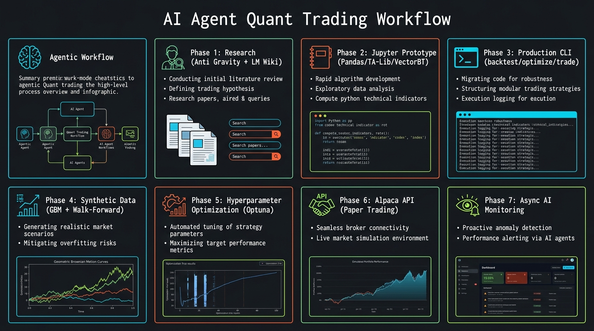

<!-- _class: title -->

# AI Agent กับการพัฒนาระบบ Quant Trading

เวิร์กโฟลว์ 6 ขั้นตอน: Research → Prototype → Production → Backtest → Optimize → Trade

<!-- Speaker: ไม่ใช่ "AI เทรดแทน" — แต่คือ pipeline ที่เป็นระบบ ตั้งแต่ค้นวิชาการจนถึง broker API -->

---

<!-- _class: cheatsheet -->
<!-- _backgroundColor: #f8f7f4 -->

<!-- Speaker: 60-second overview — ชี้ 7 panels: Research / Jupyter / CLI / Synthetic Data / Optuna / Alpaca / Monitoring -->

---

## ไม่ใช่ Magic — แต่เป็นระบบที่ AI เร่งทุกขั้นตอน

Prompt สั้นๆ ไม่สร้างกลยุทธ์ที่ทนทาน — ต้องมี pipeline ที่เป็น science

<svg viewBox="0 0 1100 340" width="100%" xmlns="http://www.w3.org/2000/svg">
  <!-- callout-box: TL;DR summary -->
  <rect x="50" y="30" width="1000" height="280" rx="16" fill="var(--paper)" stroke="var(--soft-2)" stroke-width="1.5" style="filter:drop-shadow(0 4px 12px rgba(15,23,42,.08))"/>
  <rect x="50" y="30" width="8" height="280" rx="4" fill="var(--accent)"/>
  <!-- 3 key points -->
  <circle cx="160" cy="120" r="32" fill="var(--accent)" opacity=".12"/>
  <circle cx="160" cy="120" r="22" fill="var(--accent)"/>
  <text x="160" y="126" font-size="14" fill="var(--paper)" text-anchor="middle" font-family="system-ui" font-weight="700">1</text>
  <text x="210" y="112" font-size="17" font-weight="700" fill="var(--ink)" font-family="system-ui">Research</text>
  <text x="210" y="136" font-size="13" fill="var(--ink-dim)" font-family="system-ui">Anti Gravity + Literature Search + LM Wiki</text>
  <circle cx="160" cy="200" r="32" fill="var(--gold)" opacity=".15"/>
  <circle cx="160" cy="200" r="22" fill="var(--gold)"/>
  <text x="160" y="206" font-size="14" fill="white" text-anchor="middle" font-family="system-ui" font-weight="700">2</text>
  <text x="210" y="192" font-size="17" font-weight="700" fill="var(--ink)" font-family="system-ui">Build</text>
  <text x="210" y="216" font-size="13" fill="var(--ink-dim)" font-family="system-ui">Jupyter Prototype → Production CLI (3 modules)</text>
  <circle cx="160" cy="280" r="32" fill="var(--success)" opacity=".15"/>
  <circle cx="160" cy="280" r="22" fill="var(--success)"/>
  <text x="160" y="286" font-size="14" fill="white" text-anchor="middle" font-family="system-ui" font-weight="700">3</text>
  <text x="210" y="272" font-size="17" font-weight="700" fill="var(--ink)" font-family="system-ui">Deploy</text>
  <text x="210" y="296" font-size="13" fill="var(--ink-dim)" font-family="system-ui">Synthetic Data + Optuna HPO + Alpaca API + Async Monitor</text>
  <!-- separator -->
  <line x1="560" y1="60" x2="560" y2="310" stroke="var(--soft-2)" stroke-width="1" stroke-dasharray="4,4"/>
  <text x="630" y="100" font-size="22" font-weight="800" fill="var(--accent)" font-family="system-ui">AI = Accelerator</text>
  <text x="630" y="132" font-size="14" fill="var(--ink-dim)" font-family="system-ui">not the trader</text>
  <text x="630" y="175" font-size="14" fill="var(--ink)" font-family="system-ui">- Speed up literature review</text>
  <text x="630" y="205" font-size="14" fill="var(--ink)" font-family="system-ui">- Generate + optimize code</text>
  <text x="630" y="235" font-size="14" fill="var(--ink)" font-family="system-ui">- Monitor risk asynchronously</text>
  <text x="630" y="265" font-size="14" fill="var(--danger)" font-family="system-ui">- NOT 24/7 real-time trading</text>
  <rect x="0" y="0" width="1" height="1" fill="none"/>
</svg>

<b>★ Takeaway:</b> AI เร่งทุกขั้นตอนของ quant pipeline — แต่กลยุทธ์และ domain knowledge ยังต้องมาจากคุณ

<!-- Speaker: Key message — AI is a force multiplier, not a magic oracle. -->

---

## Phase 1: Research — ค้นคว้าวิชาการด้วย Anti Gravity

Literature review ที่เคยใช้เวลาสัปดาห์ ให้เหลือชั่วโมง

<svg viewBox="0 0 1100 300" width="100%" xmlns="http://www.w3.org/2000/svg">
  <!-- arrow-flow: 5-step research pipeline -->
  <!-- Step boxes -->
  <rect x="20" y="90" width="170" height="120" rx="10" fill="var(--accent-wash)" stroke="var(--accent)" stroke-width="1.5"/>
  <text x="105" y="130" font-size="12" font-weight="700" fill="var(--accent)" text-anchor="middle" font-family="system-ui">Trading Idea</text>
  <text x="105" y="152" font-size="11" fill="var(--ink-dim)" text-anchor="middle" font-family="system-ui">e.g. Volatility</text>
  <text x="105" y="170" font-size="11" fill="var(--ink-dim)" text-anchor="middle" font-family="system-ui">Contraction</text>
  <text x="105" y="188" font-size="11" fill="var(--ink-dim)" text-anchor="middle" font-family="system-ui">+ Momentum</text>
  <!-- arrow 1 -->
  <line x1="190" y1="150" x2="224" y2="150" stroke="var(--muted)" stroke-width="2"/>
  <polygon points="224,145 234,150 224,155" fill="var(--muted)"/>
  <!-- Step 2 -->
  <rect x="234" y="90" width="170" height="120" rx="10" fill="var(--paper)" stroke="var(--soft-2)" stroke-width="1.5" style="filter:drop-shadow(var(--shadow-sm))"/>
  <text x="319" y="126" font-size="12" font-weight="700" fill="var(--ink)" text-anchor="middle" font-family="system-ui">Anti Gravity</text>
  <text x="319" y="148" font-size="11" fill="var(--ink-dim)" text-anchor="middle" font-family="system-ui">+ Gemini / Opus</text>
  <text x="319" y="168" font-size="11" fill="var(--ink-dim)" text-anchor="middle" font-family="system-ui">Literature Search</text>
  <text x="319" y="188" font-size="10" fill="var(--muted)" text-anchor="middle" font-family="system-ui">arXiv keyword scan</text>
  <!-- arrow 2 -->
  <line x1="404" y1="150" x2="438" y2="150" stroke="var(--muted)" stroke-width="2"/>
  <polygon points="438,145 448,150 438,155" fill="var(--muted)"/>
  <!-- Step 3 -->
  <rect x="448" y="90" width="170" height="120" rx="10" fill="var(--paper)" stroke="var(--soft-2)" stroke-width="1.5" style="filter:drop-shadow(var(--shadow-sm))"/>
  <text x="533" y="126" font-size="12" font-weight="700" fill="var(--ink)" text-anchor="middle" font-family="system-ui">Digest Paper</text>
  <text x="533" y="148" font-size="11" fill="var(--ink-dim)" text-anchor="middle" font-family="system-ui">PDF download</text>
  <text x="533" y="168" font-size="11" fill="var(--ink-dim)" text-anchor="middle" font-family="system-ui">AI summarize</text>
  <text x="533" y="188" font-size="10" fill="var(--muted)" text-anchor="middle" font-family="system-ui">concept + method</text>
  <!-- arrow 3 -->
  <line x1="618" y1="150" x2="652" y2="150" stroke="var(--muted)" stroke-width="2"/>
  <polygon points="652,145 662,150 652,155" fill="var(--muted)"/>
  <!-- Step 4 -->
  <rect x="662" y="90" width="170" height="120" rx="10" fill="var(--paper)" stroke="var(--soft-2)" stroke-width="1.5" style="filter:drop-shadow(var(--shadow-sm))"/>
  <text x="747" y="126" font-size="12" font-weight="700" fill="var(--ink)" text-anchor="middle" font-family="system-ui">Markdown Save</text>
  <text x="747" y="148" font-size="11" fill="var(--ink-dim)" text-anchor="middle" font-family="system-ui">LM Wiki</text>
  <text x="747" y="168" font-size="11" fill="var(--ink-dim)" text-anchor="middle" font-family="system-ui">in Obsidian</text>
  <text x="747" y="188" font-size="10" fill="var(--muted)" text-anchor="middle" font-family="system-ui">queryable knowledge</text>
  <!-- arrow 4 -->
  <line x1="832" y1="150" x2="866" y2="150" stroke="var(--muted)" stroke-width="2"/>
  <polygon points="866,145 876,150 866,155" fill="var(--muted)"/>
  <!-- Step 5 -->
  <rect x="876" y="90" width="204" height="120" rx="10" fill="var(--success-wash)" stroke="var(--success)" stroke-width="1.5"/>
  <text x="978" y="126" font-size="12" font-weight="700" fill="var(--success-ink)" text-anchor="middle" font-family="system-ui">Grounded Idea</text>
  <text x="978" y="148" font-size="11" fill="var(--success-ink)" text-anchor="middle" font-family="system-ui">Research-backed</text>
  <text x="978" y="168" font-size="11" fill="var(--success-ink)" text-anchor="middle" font-family="system-ui">strategy hypothesis</text>
  <text x="978" y="188" font-size="10" fill="var(--success)" text-anchor="middle" font-family="system-ui">ready to prototype</text>
  <!-- labels -->
  <text x="105" y="78" font-size="10" fill="var(--muted)" text-anchor="middle" font-family="system-ui">INPUT</text>
  <text x="978" y="78" font-size="10" fill="var(--muted)" text-anchor="middle" font-family="system-ui">OUTPUT</text>
  <rect x="0" y="0" width="1" height="1" fill="none"/>
</svg>

<b>★ Takeaway:</b> Anti Gravity + LLM skills แปลง literature review จากสัปดาห์เป็นชั่วโมง — ผลลัพธ์คือ LM Wiki ที่ query ได้

<!-- Speaker: Emphasize the LM Wiki output — it becomes the AI's memory for subsequent steps. -->

---

## Phase 2: Prototype ใน Jupyter Notebook

ทดสอบ component ทีละชิ้นก่อน production

  

    
Data

    <h3>Pandas</h3>
    
Time series manipulation, OHLCV processing, signal alignment

  

  

    
Indicators

    <h3>TA-Lib</h3>
    
RSI, Bollinger Bands, ATR, MACD — 150+ technical indicators

  

  

    
Data Source

    <h3>OpenBB</h3>
    
Multi-source financial platform — equities, crypto, macro data

  

  

    
Backtest

    <h3>VectorBT</h3>
    
Vectorized backtest — 10-100x faster than event-driven loops

  

<b>★ Takeaway:</b> Jupyter ช่วยทดสอบ stop-loss หรือ indicator parameter ทีละตัวโดยไม่ต้องรันทั้ง codebase — iteration เร็วกว่ามาก

<!-- Speaker: VectorBT is the key speed enabler — vectorized means NumPy speed, not Python loops. -->

---

## Phase 3: Production CLI — แยก 3 Modules

AI แปลง Notebook เป็น Python files ที่ AI Agent เรียกได้ผ่าน command line

<svg viewBox="0 0 1100 320" width="100%" xmlns="http://www.w3.org/2000/svg">
  <!-- Top: Jupyter Notebook -->
  <rect x="400" y="10" width="300" height="60" rx="10" fill="var(--soft-2)" stroke="var(--muted)" stroke-width="1.5"/>
  <text x="550" y="38" font-size="14" font-weight="700" fill="var(--ink)" text-anchor="middle" font-family="system-ui">Jupyter Notebook</text>
  <text x="550" y="58" font-size="11" fill="var(--ink-dim)" text-anchor="middle" font-family="system-ui">prototype.ipynb</text>
  <!-- Arrow down to AI Agent -->
  <line x1="550" y1="70" x2="550" y2="110" stroke="var(--accent)" stroke-width="2"/>
  <polygon points="545,110 555,110 550,120" fill="var(--accent)"/>
  <!-- AI Agent -->
  <rect x="420" y="120" width="260" height="50" rx="10" fill="var(--accent)" opacity=".9"/>
  <text x="550" y="142" font-size="13" font-weight="700" fill="white" text-anchor="middle" font-family="system-ui">AI Agent</text>
  <text x="550" y="160" font-size="11" fill="rgba(255,255,255,.85)" text-anchor="middle" font-family="system-ui">skill: run code production</text>
  <!-- 3 arrows to modules -->
  <line x1="440" y1="170" x2="200" y2="230" stroke="var(--muted)" stroke-width="1.5"/>
  <polygon points="196,224 202,234 208,224" fill="var(--muted)"/>
  <line x1="550" y1="170" x2="550" y2="230" stroke="var(--muted)" stroke-width="1.5"/>
  <polygon points="545,230 555,230 550,240" fill="var(--muted)"/>
  <line x1="660" y1="170" x2="900" y2="230" stroke="var(--muted)" stroke-width="1.5"/>
  <polygon points="896,224 902,234 908,224" fill="var(--muted)"/>
  <!-- Module 1: backtest.py -->
  <rect x="60" y="240" width="290" height="70" rx="10" fill="var(--paper)" stroke="var(--accent)" stroke-width="2" style="filter:drop-shadow(var(--shadow-sm))"/>
  <text x="205" y="265" font-size="13" font-weight="700" fill="var(--accent)" text-anchor="middle" font-family="system-ui">backtest.py</text>
  <text x="205" y="285" font-size="11" fill="var(--ink-dim)" text-anchor="middle" font-family="system-ui">--symbol --period --stop-loss</text>
  <text x="205" y="302" font-size="10" fill="var(--muted)" text-anchor="middle" font-family="system-ui">runs strategy simulation</text>
  <!-- Module 2: optimize.py -->
  <rect x="405" y="240" width="290" height="70" rx="10" fill="var(--paper)" stroke="var(--gold)" stroke-width="2" style="filter:drop-shadow(var(--shadow-sm))"/>
  <text x="550" y="265" font-size="13" font-weight="700" fill="var(--warning-ink)" text-anchor="middle" font-family="system-ui">optimize.py</text>
  <text x="550" y="285" font-size="11" fill="var(--ink-dim)" text-anchor="middle" font-family="system-ui">Optuna / Grid Search HPO</text>
  <text x="550" y="302" font-size="10" fill="var(--muted)" text-anchor="middle" font-family="system-ui">finds best parameters</text>
  <!-- Module 3: trade.py -->
  <rect x="750" y="240" width="290" height="70" rx="10" fill="var(--paper)" stroke="var(--success)" stroke-width="2" style="filter:drop-shadow(var(--shadow-sm))"/>
  <text x="895" y="265" font-size="13" font-weight="700" fill="var(--success-ink)" text-anchor="middle" font-family="system-ui">trade.py</text>
  <text x="895" y="285" font-size="11" fill="var(--ink-dim)" text-anchor="middle" font-family="system-ui">Alpaca / eToro broker API</text>
  <text x="895" y="302" font-size="10" fill="var(--muted)" text-anchor="middle" font-family="system-ui">executes live orders</text>
  <rect x="0" y="0" width="1" height="1" fill="none"/>
</svg>

<b>★ Takeaway:</b> CLI modules ทำให้ AI Agent เรียกแต่ละขั้นตอนได้ด้วย text — ไม่ต้องโหลด Jupyter kernel ลด token cost อย่างมาก

<!-- Speaker: This is the key architectural decision — CLI as AI-agent interface. -->

---

## Phase 4: Synthetic Data — ป้องกัน Overfitting

Historical data เดียวไม่พอ — ต้องเพิ่ม synthetic stress tests

<svg viewBox="0 0 1100 300" width="100%" xmlns="http://www.w3.org/2000/svg">
  <!-- comparison-2col: historical vs synthetic -->
  <rect x="30" y="10" width="480" height="280" rx="12" fill="var(--paper)" stroke="var(--soft-2)" stroke-width="1.5" style="filter:drop-shadow(var(--shadow-sm))"/>
  <rect x="30" y="10" width="480" height="52" rx="12" fill="var(--soft)" opacity=".8"/>
  <text x="270" y="42" font-size="16" font-weight="700" fill="var(--ink-dim)" text-anchor="middle" font-family="system-ui">Historical Data Only</text>
  <text x="80" y="94" font-size="13" fill="var(--danger)" font-family="system-ui">Data snooping bias risk</text>
  <text x="80" y="118" font-size="13" fill="var(--ink-dim)" font-family="system-ui">100 backtests → coincidence</text>
  <text x="80" y="142" font-size="13" fill="var(--ink-dim)" font-family="system-ui">Survivorship bias in data</text>
  <text x="80" y="166" font-size="13" fill="var(--ink-dim)" font-family="system-ui">Yahoo Finance quality issues</text>
  <text x="80" y="210" font-size="12" fill="var(--muted)" font-family="system-ui">Sources: FMP, Yahoo Finance</text>
  <text x="80" y="232" font-size="12" fill="var(--muted)" font-family="system-ui">Time range: limited</text>
  <!-- right panel -->
  <rect x="590" y="10" width="480" height="280" rx="12" fill="var(--paper)" stroke="var(--accent)" stroke-width="2" style="filter:drop-shadow(var(--shadow-md))"/>
  <rect x="590" y="10" width="480" height="52" rx="12" fill="var(--accent)" opacity=".08"/>
  <text x="830" y="42" font-size="16" font-weight="700" fill="var(--accent)" text-anchor="middle" font-family="system-ui">Historical + Synthetic</text>
  <text x="640" y="94" font-size="13" fill="var(--success-ink)" font-family="system-ui">Stress test edge cases</text>
  <text x="640" y="118" font-size="13" fill="var(--ink)" font-family="system-ui">GBM / stochastic vol models</text>
  <text x="640" y="142" font-size="13" fill="var(--ink)" font-family="system-ui">Control volatility + drift</text>
  <text x="640" y="166" font-size="13" fill="var(--ink)" font-family="system-ui">Walk-Forward validation</text>
  <text x="640" y="210" font-size="12" fill="var(--accent)" font-family="system-ui">+ AI-generated scenarios</text>
  <text x="640" y="232" font-size="12" fill="var(--accent)" font-family="system-ui">Out-of-sample hold-out</text>
  <!-- VS circle -->
  <circle cx="550" cy="150" r="30" fill="var(--accent)"/>
  <text x="550" y="155" font-size="14" font-weight="700" fill="white" text-anchor="middle" font-family="system-ui">VS</text>
  <rect x="0" y="0" width="1" height="1" fill="none"/>
</svg>

<b>★ Takeaway:</b> Geometric Brownian Motion + stochastic vol models ช่วย stress test scenarios ที่ historical data ไม่มี — ลด overfit risk

<!-- Speaker: The key question: does strategy survive conditions it's never seen? -->

---

## Phase 5: Hyperparameter Optimization ด้วย Optuna

Automate การค้นหา parameter ที่ optimal ด้วย Bayesian search

<svg viewBox="0 0 1100 300" width="100%" xmlns="http://www.w3.org/2000/svg">
  <!-- arrow-flow: HPO pipeline -->
  <rect x="20" y="80" width="180" height="140" rx="10" fill="var(--accent-wash)" stroke="var(--accent)" stroke-width="1.5"/>
  <text x="110" y="118" font-size="12" font-weight="700" fill="var(--accent)" text-anchor="middle" font-family="system-ui">Parameter Space</text>
  <text x="110" y="140" font-size="11" fill="var(--ink-dim)" text-anchor="middle" font-family="system-ui">bb_period: 10-50</text>
  <text x="110" y="158" font-size="11" fill="var(--ink-dim)" text-anchor="middle" font-family="system-ui">stop_loss: 1-5%</text>
  <text x="110" y="176" font-size="11" fill="var(--ink-dim)" text-anchor="middle" font-family="system-ui">take_profit: 2-10%</text>
  <text x="110" y="200" font-size="10" fill="var(--muted)" text-anchor="middle" font-family="system-ui">money mgmt focus</text>
  <!-- arrow -->
  <line x1="200" y1="150" x2="245" y2="150" stroke="var(--muted)" stroke-width="2"/>
  <polygon points="245,145 255,150 245,155" fill="var(--muted)"/>
  <!-- Optuna box -->
  <rect x="255" y="80" width="220" height="140" rx="10" fill="var(--paper)" stroke="var(--gold)" stroke-width="2" style="filter:drop-shadow(var(--shadow-sm))"/>
  <text x="365" y="118" font-size="13" font-weight="700" fill="var(--warning-ink)" text-anchor="middle" font-family="system-ui">Optuna HPO</text>
  <text x="365" y="140" font-size="11" fill="var(--ink-dim)" text-anchor="middle" font-family="system-ui">Bayesian search</text>
  <text x="365" y="158" font-size="11" fill="var(--ink-dim)" text-anchor="middle" font-family="system-ui">500 trials</text>
  <text x="365" y="178" font-size="11" fill="var(--ink-dim)" text-anchor="middle" font-family="system-ui">maximize Sharpe</text>
  <text x="365" y="200" font-size="10" fill="var(--muted)" text-anchor="middle" font-family="system-ui">faster than Grid Search</text>
  <!-- arrow -->
  <line x1="475" y1="150" x2="520" y2="150" stroke="var(--muted)" stroke-width="2"/>
  <polygon points="520,145 530,150 520,155" fill="var(--muted)"/>
  <!-- Best params -->
  <rect x="530" y="80" width="200" height="140" rx="10" fill="var(--paper)" stroke="var(--soft-2)" stroke-width="1.5" style="filter:drop-shadow(var(--shadow-sm))"/>
  <text x="630" y="118" font-size="12" font-weight="700" fill="var(--ink)" text-anchor="middle" font-family="system-ui">Best Params</text>
  <text x="630" y="140" font-size="11" fill="var(--ink-dim)" text-anchor="middle" font-family="system-ui">in-sample winner</text>
  <text x="630" y="158" font-size="11" fill="var(--ink-dim)" text-anchor="middle" font-family="system-ui">Sharpe: 1.8</text>
  <text x="630" y="178" font-size="11" fill="var(--ink-dim)" text-anchor="middle" font-family="system-ui">MaxDD: 12%</text>
  <!-- arrow -->
  <line x1="730" y1="150" x2="775" y2="150" stroke="var(--muted)" stroke-width="2"/>
  <polygon points="775,145 785,150 775,155" fill="var(--muted)"/>
  <!-- Walk-Forward -->
  <rect x="785" y="80" width="295" height="140" rx="10" fill="var(--success-wash)" stroke="var(--success)" stroke-width="2"/>
  <text x="932" y="118" font-size="12" font-weight="700" fill="var(--success-ink)" text-anchor="middle" font-family="system-ui">Walk-Forward</text>
  <text x="932" y="140" font-size="11" fill="var(--success-ink)" text-anchor="middle" font-family="system-ui">out-of-sample test</text>
  <text x="932" y="160" font-size="11" fill="var(--success-ink)" text-anchor="middle" font-family="system-ui">rolling windows</text>
  <text x="932" y="182" font-size="11" fill="var(--success-ink)" text-anchor="middle" font-family="system-ui">pass = robust strategy</text>
  <text x="932" y="202" font-size="10" fill="var(--success)" text-anchor="middle" font-family="system-ui">fail = overfit, retry</text>
  <rect x="0" y="0" width="1" height="1" fill="none"/>
</svg>

<b>★ Takeaway:</b> Optuna Bayesian search หา optimum เร็วกว่า Grid Search — แต่ Walk-Forward Analysis คือด่านสุดท้ายที่จะบอกว่าผลจริง

<!-- Speaker: HPO on money management > indicator tuning. Risk params matter more than signal params. -->

---

## Phase 6: Alpaca API — ส่งสัญญาณไปโบรกเกอร์

Paper Trading ก่อน — endpoint เดียวกับ live, ไม่มีความเสี่ยง

<svg viewBox="0 0 1100 290" width="100%" xmlns="http://www.w3.org/2000/svg">
  <!-- flow: trade.py → Paper → Live -->
  <!-- trade.py -->
  <rect x="30" y="80" width="200" height="130" rx="10" fill="var(--paper)" stroke="var(--accent)" stroke-width="2" style="filter:drop-shadow(var(--shadow-sm))"/>
  <text x="130" y="120" font-size="13" font-weight="700" fill="var(--accent)" text-anchor="middle" font-family="system-ui">trade.py</text>
  <text x="130" y="142" font-size="11" fill="var(--ink-dim)" text-anchor="middle" font-family="system-ui">optimal params</text>
  <text x="130" y="162" font-size="11" fill="var(--ink-dim)" text-anchor="middle" font-family="system-ui">from optimize.py</text>
  <text x="130" y="196" font-size="10" fill="var(--muted)" text-anchor="middle" font-family="system-ui">MarketOrderRequest</text>
  <!-- arrow to paper -->
  <line x1="230" y1="145" x2="280" y2="145" stroke="var(--muted)" stroke-width="2"/>
  <polygon points="280,140 290,145 280,150" fill="var(--muted)"/>
  <!-- Paper Trading -->
  <rect x="290" y="60" width="220" height="170" rx="10" fill="var(--warning-wash)" stroke="var(--gold)" stroke-width="2" style="filter:drop-shadow(var(--shadow-sm))"/>
  <text x="400" y="100" font-size="13" font-weight="700" fill="var(--warning-ink)" text-anchor="middle" font-family="system-ui">Paper Trading</text>
  <text x="400" y="122" font-size="11" fill="var(--warning-ink)" text-anchor="middle" font-family="system-ui">paper=True</text>
  <text x="400" y="144" font-size="11" fill="var(--ink-dim)" text-anchor="middle" font-family="system-ui">Real-time data</text>
  <text x="400" y="164" font-size="11" fill="var(--ink-dim)" text-anchor="middle" font-family="system-ui">Fake money</text>
  <text x="400" y="184" font-size="11" fill="var(--ink-dim)" text-anchor="middle" font-family="system-ui">Same API endpoints</text>
  <text x="400" y="214" font-size="10" fill="var(--warning)" text-anchor="middle" font-family="system-ui">forward-test here first</text>
  <!-- condition arrow -->
  <line x1="510" y1="145" x2="580" y2="145" stroke="var(--success)" stroke-width="2"/>
  <polygon points="580,140 590,145 580,150" fill="var(--success)"/>
  <rect x="490" y="100" width="110" height="30" rx="4" fill="var(--success-wash)"/>
  <text x="545" y="120" font-size="10" fill="var(--success-ink)" text-anchor="middle" font-family="system-ui">pass forward</text>
  <!-- Live Trading -->
  <rect x="590" y="60" width="220" height="170" rx="10" fill="var(--success-wash)" stroke="var(--success)" stroke-width="2" style="filter:drop-shadow(var(--shadow-md))"/>
  <text x="700" y="100" font-size="13" font-weight="700" fill="var(--success-ink)" text-anchor="middle" font-family="system-ui">Live Trading</text>
  <text x="700" y="122" font-size="11" fill="var(--success-ink)" text-anchor="middle" font-family="system-ui">paper=False</text>
  <text x="700" y="144" font-size="11" fill="var(--ink)" text-anchor="middle" font-family="system-ui">Real orders</text>
  <text x="700" y="164" font-size="11" fill="var(--ink)" text-anchor="middle" font-family="system-ui">IEX feed (free)</text>
  <text x="700" y="184" font-size="11" fill="var(--ink)" text-anchor="middle" font-family="system-ui">Alpaca / eToro</text>
  <text x="700" y="214" font-size="10" fill="var(--success)" text-anchor="middle" font-family="system-ui">algorithm runs on server</text>
  <!-- arrow to monitor -->
  <line x1="810" y1="145" x2="860" y2="145" stroke="var(--muted)" stroke-width="2"/>
  <polygon points="860,140 870,145 860,150" fill="var(--muted)"/>
  <!-- Monitor -->
  <rect x="870" y="80" width="210" height="130" rx="10" fill="var(--paper)" stroke="var(--muted)" stroke-width="1.5" style="filter:drop-shadow(var(--shadow-sm))"/>
  <text x="975" y="118" font-size="12" font-weight="700" fill="var(--ink)" text-anchor="middle" font-family="system-ui">AI Monitor</text>
  <text x="975" y="138" font-size="11" fill="var(--ink-dim)" text-anchor="middle" font-family="system-ui">async / batch</text>
  <text x="975" y="158" font-size="11" fill="var(--ink-dim)" text-anchor="middle" font-family="system-ui">risk adjustment</text>
  <text x="975" y="178" font-size="11" fill="var(--ink-dim)" text-anchor="middle" font-family="system-ui">NOT real-time</text>
  <rect x="0" y="0" width="1" height="1" fill="none"/>
</svg>

<b>★ Takeaway:</b> เปลี่ยนแค่ `paper=True/False` — forward test ด้วย real-time data ก่อน live เสมอ; algorithm รันบน server ไม่ใช่ LLM

<!-- Speaker: The paper/live switch is one boolean — but discipline to test first is everything. -->

---

## Phase 7: AI Monitoring — Async ไม่ใช่ Real-Time

AI เป็น risk manager ไม่ใช่ trader — batch review ลด token cost มหาศาล

<svg viewBox="0 0 640 280" width="100%" xmlns="http://www.w3.org/2000/svg">
  <!-- left column: wrong vs right -->
  <rect x="10" y="10" width="290" height="120" rx="10" fill="var(--danger-wash)" stroke="var(--danger)" stroke-width="1.5"/>
  <text x="155" y="38" font-size="12" font-weight="700" fill="var(--danger-ink)" text-anchor="middle" font-family="system-ui">WRONG: Real-time AI loop</text>
  <text x="155" y="60" font-size="11" fill="var(--danger-ink)" text-anchor="middle" font-family="system-ui">24/7 LLM calls per tick</text>
  <text x="155" y="80" font-size="11" fill="var(--danger-ink)" text-anchor="middle" font-family="system-ui">API token cost = huge</text>
  <text x="155" y="100" font-size="11" fill="var(--danger-ink)" text-anchor="middle" font-family="system-ui">Latency too slow</text>
  <text x="155" y="118" font-size="10" fill="var(--danger)" text-anchor="middle" font-family="system-ui">hallucination risk on live data</text>
  <rect x="10" y="148" width="290" height="120" rx="10" fill="var(--success-wash)" stroke="var(--success)" stroke-width="1.5"/>
  <text x="155" y="176" font-size="12" font-weight="700" fill="var(--success-ink)" text-anchor="middle" font-family="system-ui">RIGHT: Async Batch Review</text>
  <text x="155" y="198" font-size="11" fill="var(--success-ink)" text-anchor="middle" font-family="system-ui">Algorithm trades (no LLM)</text>
  <text x="155" y="218" font-size="11" fill="var(--success-ink)" text-anchor="middle" font-family="system-ui">AI reviews logs hourly</text>
  <text x="155" y="238" font-size="11" fill="var(--success-ink)" text-anchor="middle" font-family="system-ui">Adjusts risk policy</text>
  <text x="155" y="258" font-size="10" fill="var(--success)" text-anchor="middle" font-family="system-ui">human approves changes</text>
  <!-- right: AI role -->
  <rect x="330" y="10" width="300" height="258" rx="10" fill="var(--paper)" stroke="var(--soft-2)" stroke-width="1.5" style="filter:drop-shadow(var(--shadow-sm))"/>
  <text x="480" y="45" font-size="13" font-weight="700" fill="var(--ink)" text-anchor="middle" font-family="system-ui">AI Role: Risk Manager</text>
  <text x="355" y="80" font-size="11" fill="var(--ink)" font-family="system-ui">- Detect drawdown pattern</text>
  <text x="355" y="104" font-size="11" fill="var(--ink)" font-family="system-ui">- Spot regime shifts</text>
  <text x="355" y="128" font-size="11" fill="var(--ink)" font-family="system-ui">- Flag sector underperformance</text>
  <text x="355" y="152" font-size="11" fill="var(--ink)" font-family="system-ui">- Suggest position reduction</text>
  <text x="355" y="176" font-size="11" fill="var(--ink)" font-family="system-ui">- Send Discord/Telegram alert</text>
  <line x1="350" y1="195" x2="620" y2="195" stroke="var(--soft-2)" stroke-width="1"/>
  <text x="355" y="220" font-size="11" fill="var(--muted)" font-family="system-ui">NOT: execute orders directly</text>
  <text x="355" y="244" font-size="11" fill="var(--muted)" font-family="system-ui">NOT: run every tick</text>
  <rect x="0" y="0" width="1" height="1" fill="none"/>
</svg>

<b>★ Takeaway:</b> Algorithm เทรด — AI review batch logs; human อนุมัติ policy change — pattern นี้ลด cost และ hallucination risk

<!-- Speaker: The key insight: LLMs are expensive and slow for real-time loops. Batch review is the right abstraction. -->

---

## Key Takeaways: เวิร์กโฟลว์ที่เป็นระบบ ไม่ใช่ Shortcut

7 หลักการที่ทำให้ quant trading pipeline ทนทานได้จริง

  

    
Research

    <h3>LM Wiki สำคัญกว่า Prompt</h3>
    
AI ต้องการ context ที่ดี — research-backed hypothesis สร้างจาก LM Wiki ไม่ใช่ prompt สั้น

  

  

    
Architecture

    <h3>3 Modules ทำงานแยกกัน</h3>
    
backtest / optimize / trade แยก responsibilities ชัดเจน — AI Agent เรียกได้ทีละ module

  

  

    
Validation

    <h3>Walk-Forward บังคับ</h3>
    
Backtest ดีไม่รับประกัน live performance — Walk-Forward คือด่านสุดท้ายก่อน deploy

  

  

    
Data

    <h3>Synthetic Data ป้องกัน Overfit</h3>
    
GBM + stochastic vol stress test scenarios ที่ historical data ไม่มี

  

  

    
HPO

    <h3>Optuna เหนือ Grid Search</h3>
    
Bayesian search หา optimum เร็วกว่า — focus บน money management ก่อน indicator

  

  

    
Monitoring

    <h3>AI Async ไม่ใช่ Real-Time</h3>
    
Algorithm เทรด — AI batch review; real-time LLM loop แพงและช้าเกินไป

  

<b>★ Takeaway:</b> Pipeline ที่ robust = Research + 3-Module CLI + Synthetic Data + Walk-Forward + Alpaca Paper + Async Monitor — ขาดขั้นตอนใดขั้นตอนหนึ่ง ความเสี่ยงเพิ่มขึ้นมาก

<!-- Speaker: The full pipeline is the point — each phase catches a different failure mode. -->
