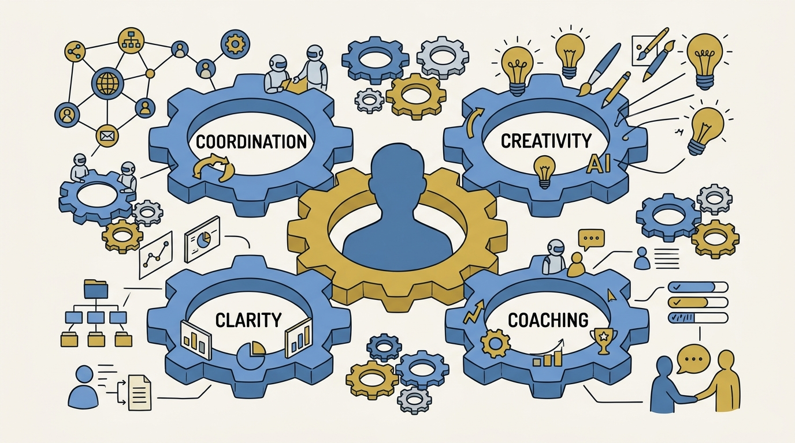
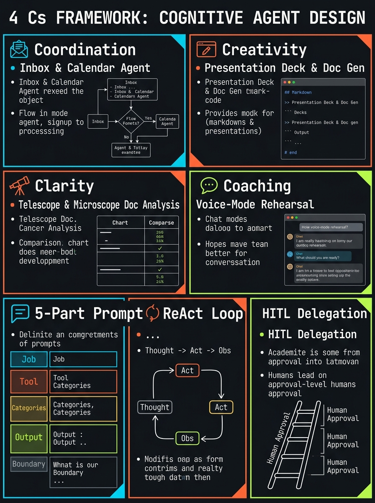
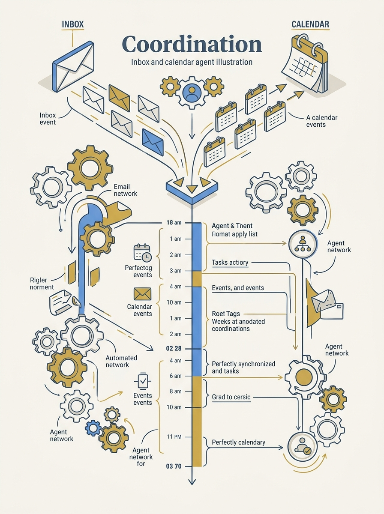
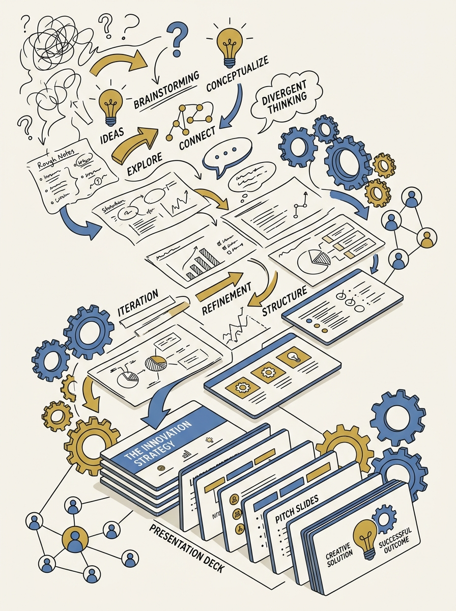
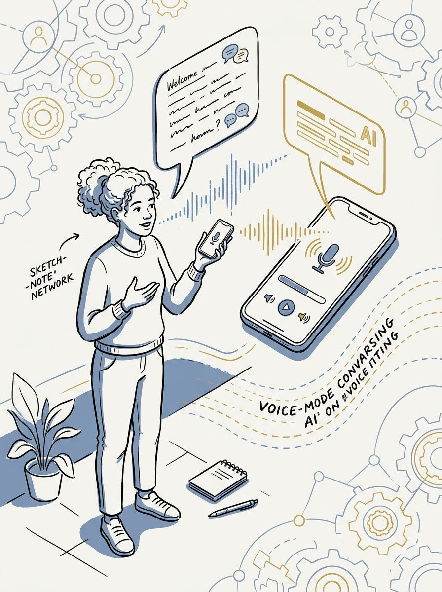

<!-- _class: title -->

# 4 Cs Framework: AI Agents for Coordination, Creativity, Clarity, Coaching

จัดการ inbox/calendar · สร้าง presentation · วิเคราะห์เอกสาร · ซ้อมสัมภาษณ์ด้วย voice mode — โดยมนุษย์เป็นศูนย์กลางเสมอ

<!-- Speaker: เปิดด้วย pain point — 117 emails/day, interrupted every 2 min. แนะนำว่า framework นี้ใช้ได้กับ Claude/ChatGPT/Gemini เหมือนกัน -->

---

<!-- _class: cheatsheet -->
<!-- _backgroundColor: #f8f7f4 -->

<!-- Speaker: ภาพรวม 4 pillar ก่อนเจาะลึกทีละตัว -->

---

## ทำไมต้องมี Framework นี้

Microsoft ศึกษาพฤติกรรมการทำงานจริง พบว่าความสนใจของเราถูกตัดเป็นชิ้นๆ ทุกวัน

  

    
Inbox Load

    <h3>117 emails/day</h3>
    
อีเมลเฉลี่ยที่พนักงานทั่วไปได้รับต่อวัน

  

  

    
Interruption Rate

    <h3>every 2 minutes</h3>
    
ถูกขัดจังหวะด้วยอีเมล ประชุม หรือข้อความ

  

  

    
Daily Total

    <h3>275 times/day</h3>
    
รวมการขัดจังหวะทั้งหมด (ยังไม่นับ social media)

  

<b>★ Takeaway:</b> ปัญหาไม่ใช่เครื่องมือ AI แต่คือวิธีคิด — 4 Cs คือระบบคิดที่ใช้ได้กับ Claude, ChatGPT หรือ Gemini เหมือนกัน

<!-- Speaker: อ้างอิงสถิติ Microsoft ก่อนเข้า pillar แรก -->

---

## 4 Cs Framework: Coordination · Creativity · Clarity · Coaching

แต่ละ pillar แก้ปัญหาคนละมิติของการทำงาน — ใช้ prompt skeleton เดียวกันทุกตัว

  

    
Pillar 1

    <h3>Coordination</h3>
    
Inbox + Calendar agent — หยุดวันทำงานถูกจี้ด้วยการขัดจังหวะ

  

  

    
Pillar 2

    <h3>Creativity</h3>
    
Deck/Document agent — แปลงโน้ตดิบเป็นร่างที่พร้อมตัดสิน

  

  

    
Pillar 3

    <h3>Clarity</h3>
    
Deep-analysis agent — แปลเอกสารซับซ้อนให้เข้าใจง่าย

  

  

    
Pillar 4

    <h3>Coaching</h3>
    
Voice-mode agent — ซ้อมบทสนทนาสำคัญแบบ one-shot

  

<b>★ Takeaway:</b> คนละ pillar คนละ use case แต่ทุกตัวยึดหลักเดียวกัน: มนุษย์ยังกำกับผลลัพธ์สุดท้ายเสมอ

<!-- Speaker: แนะนำ 4 pillar ก่อนเข้ารายละเอียด prompt structure -->

---

## Prompt ที่ดีมี 5 ส่วน + ReAct Loop

ทุก agent ในทุก pillar ใช้ prompt skeleton เดียวกัน และวิ่งบน loop เดียวกัน

<svg viewBox="0 0 1100 340" width="100%" xmlns="http://www.w3.org/2000/svg">
  <rect x="40" y="40" width="180" height="90" rx="12" fill="var(--paper)" stroke="var(--accent)" stroke-width="2"/>
  <text x="130" y="75" font-size="15" font-weight="700" fill="var(--accent)" text-anchor="middle" font-family="system-ui">1. Job</text>
  <text x="130" y="98" font-size="11" fill="var(--ink-dim)" text-anchor="middle" font-family="system-ui">what task</text>

  <rect x="240" y="40" width="180" height="90" rx="12" fill="var(--paper)" stroke="var(--soft-2)" stroke-width="1.5"/>
  <text x="330" y="75" font-size="15" font-weight="700" fill="var(--ink)" text-anchor="middle" font-family="system-ui">2. Tool</text>
  <text x="330" y="98" font-size="11" fill="var(--ink-dim)" text-anchor="middle" font-family="system-ui">what data/app</text>

  <rect x="440" y="40" width="180" height="90" rx="12" fill="var(--paper)" stroke="var(--soft-2)" stroke-width="1.5"/>
  <text x="530" y="75" font-size="15" font-weight="700" fill="var(--ink)" text-anchor="middle" font-family="system-ui">3. Categories</text>
  <text x="530" y="98" font-size="11" fill="var(--ink-dim)" text-anchor="middle" font-family="system-ui">how to bucket</text>

  <rect x="640" y="40" width="180" height="90" rx="12" fill="var(--paper)" stroke="var(--soft-2)" stroke-width="1.5"/>
  <text x="730" y="75" font-size="15" font-weight="700" fill="var(--ink)" text-anchor="middle" font-family="system-ui">4. Output</text>
  <text x="730" y="98" font-size="11" fill="var(--ink-dim)" text-anchor="middle" font-family="system-ui">format/length</text>

  <rect x="840" y="40" width="180" height="90" rx="12" fill="var(--paper)" stroke="var(--danger)" stroke-width="2"/>
  <text x="930" y="75" font-size="15" font-weight="700" fill="var(--danger)" text-anchor="middle" font-family="system-ui">5. Boundary</text>
  <text x="930" y="98" font-size="11" fill="var(--ink-dim)" text-anchor="middle" font-family="system-ui">what NOT to do</text>

  <path d="M220 85 L240 85" stroke="var(--muted)" stroke-width="2" marker-end="url(#arrow4c)"/>
  <path d="M420 85 L440 85" stroke="var(--muted)" stroke-width="2" marker-end="url(#arrow4c)"/>
  <path d="M620 85 L640 85" stroke="var(--muted)" stroke-width="2" marker-end="url(#arrow4c)"/>
  <path d="M820 85 L840 85" stroke="var(--muted)" stroke-width="2" marker-end="url(#arrow4c)"/>
  <defs>
    <marker id="arrow4c" markerWidth="8" markerHeight="8" refX="6" refY="4" orient="auto">
      <path d="M0,0 L8,4 L0,8 z" fill="var(--muted)"/>
    </marker>
  </defs>

  <rect x="240" y="200" width="620" height="110" rx="16" fill="var(--soft)" stroke="var(--soft-2)" stroke-width="1.5"/>
  <text x="550" y="230" font-size="14" font-weight="700" fill="var(--ink)" text-anchor="middle" font-family="system-ui">ReAct Loop (underneath every agent)</text>
  <circle cx="330" cy="270" r="34" fill="var(--accent)" opacity=".12"/>
  <text x="330" y="266" font-size="12" font-weight="700" fill="var(--accent)" text-anchor="middle" font-family="system-ui">Reason</text>
  <path d="M364 270 L436 270" stroke="var(--muted)" stroke-width="2" marker-end="url(#arrow4c)"/>
  <circle cx="470" cy="270" r="34" fill="var(--gold)" opacity=".15"/>
  <text x="470" y="266" font-size="12" font-weight="700" fill="var(--ink)" text-anchor="middle" font-family="system-ui">Act</text>
  <path d="M504 270 L576 270" stroke="var(--muted)" stroke-width="2" marker-end="url(#arrow4c)"/>
  <circle cx="610" cy="270" r="34" fill="var(--success)" opacity=".12"/>
  <text x="610" y="266" font-size="11" font-weight="700" fill="var(--success-ink)" text-anchor="middle" font-family="system-ui">Observe</text>
  <path d="M610 236 C 610 190, 330 190, 330 236" stroke="var(--muted)" stroke-width="1.5" fill="none" stroke-dasharray="4,3" marker-end="url(#arrow4c)"/>
</svg>

<b>★ Takeaway:</b> Job / Tool / Categories / Output / Boundary — ใส่ให้ครบ 5 ส่วน แล้ว agent จะวิ่ง Reason→Act→Observe ให้เอง

<!-- Speaker: อธิบาย 5 ส่วนของ prompt แล้วโยงเข้า ReAct loop -->

---

## Coordination: Inbox และ Calendar หยุดจี้วันทำงาน

เริ่มจาก email agent ก่อน แล้วค่อยเพิ่ม calendar เมื่อไว้ใจ output แล้วเท่านั้น

<svg viewBox="0 0 700 320" width="100%" xmlns="http://www.w3.org/2000/svg">
  <rect x="20" y="20" width="200" height="60" rx="10" fill="var(--paper)" stroke="var(--accent)" stroke-width="2"/>
  <text x="120" y="46" font-size="13" font-weight="700" fill="var(--accent)" text-anchor="middle" font-family="system-ui">Connect Gmail</text>
  <text x="120" y="66" font-size="10" fill="var(--ink-dim)" text-anchor="middle" font-family="system-ui">via connectors</text>

  <path d="M120 80 L120 110" stroke="var(--muted)" stroke-width="2" marker-end="url(#arrowco)"/>
  <rect x="20" y="112" width="200" height="60" rx="10" fill="var(--paper)" stroke="var(--soft-2)" stroke-width="1.5"/>
  <text x="120" y="138" font-size="13" font-weight="700" fill="var(--ink)" text-anchor="middle" font-family="system-ui">Sort 3 buckets</text>
  <text x="120" y="158" font-size="10" fill="var(--ink-dim)" text-anchor="middle" font-family="system-ui">urgent / info / ignore</text>

  <path d="M120 172 L120 202" stroke="var(--muted)" stroke-width="2" marker-end="url(#arrowco)"/>
  <rect x="20" y="204" width="200" height="60" rx="10" fill="var(--paper)" stroke="var(--soft-2)" stroke-width="1.5"/>
  <text x="120" y="230" font-size="13" font-weight="700" fill="var(--ink)" text-anchor="middle" font-family="system-ui">Draft, don't send</text>
  <text x="120" y="250" font-size="10" fill="var(--ink-dim)" text-anchor="middle" font-family="system-ui">boundary: your approval</text>

  <path d="M220 234 L260 234" stroke="var(--muted)" stroke-width="2" marker-end="url(#arrowco)"/>
  <rect x="264" y="204" width="200" height="60" rx="10" fill="var(--paper)" stroke="var(--soft-2)" stroke-width="1.5"/>
  <text x="364" y="230" font-size="13" font-weight="700" fill="var(--ink)" text-anchor="middle" font-family="system-ui">+ Calendar</text>
  <text x="364" y="250" font-size="10" fill="var(--ink-dim)" text-anchor="middle" font-family="system-ui">flag conflicts</text>

  <path d="M464 234 L504 234" stroke="var(--muted)" stroke-width="2" marker-end="url(#arrowco)"/>
  <rect x="508" y="204" width="180" height="60" rx="10" fill="var(--paper)" stroke="var(--gold)" stroke-width="2"/>
  <text x="598" y="230" font-size="13" font-weight="700" fill="var(--gold)" text-anchor="middle" font-family="system-ui">Executive Assistant</text>
  <text x="598" y="250" font-size="10" fill="var(--ink-dim)" text-anchor="middle" font-family="system-ui">promoted after trust</text>

  <defs>
    <marker id="arrowco" markerWidth="8" markerHeight="8" refX="6" refY="4" orient="auto">
      <path d="M0,0 L8,4 L0,8 z" fill="var(--muted)"/>
    </marker>
  </defs>
</svg>

<b>★ Takeaway:</b> ลำดับมอบอำนาจ: visible → efficient → automatic → delegate — อย่ามอบอำนาจตัดสินใจให้ agent ทันที

<!-- Speaker: ย้ำว่า "Don't send anything without my approval" คือ boundary ที่ต้องใส่ตั้งแต่แรก -->

---

## Creativity: จากโน้ตดิบสู่ Presentation Deck จริง

Agent ช่วยประกอบร่าง แต่มนุษย์ยังเป็นผู้กำกับที่ตัดสินผลลัพธ์สุดท้าย

<svg viewBox="0 0 700 320" width="100%" xmlns="http://www.w3.org/2000/svg">
  <rect x="20" y="30" width="660" height="60" rx="10" fill="var(--paper)" stroke="var(--accent)" stroke-width="2"/>
  <text x="350" y="56" font-size="13" font-weight="700" fill="var(--accent)" text-anchor="middle" font-family="system-ui">Point agent to folder of rough notes</text>
  <text x="350" y="76" font-size="10" fill="var(--ink-dim)" text-anchor="middle" font-family="system-ui">"8-10 slides, 15-minute pitch to the CFO"</text>

  <path d="M350 90 L350 118" stroke="var(--muted)" stroke-width="2" marker-end="url(#arrowcr)"/>
  <rect x="20" y="120" width="660" height="60" rx="10" fill="var(--paper)" stroke="var(--gold)" stroke-width="2"/>
  <text x="350" y="146" font-size="13" font-weight="700" fill="var(--gold)" text-anchor="middle" font-family="system-ui">Claude "skills" generate real .pptx/.docx/.xlsx</text>
  <text x="350" y="166" font-size="10" fill="var(--ink-dim)" text-anchor="middle" font-family="system-ui">opens and edits directly in Microsoft Office</text>

  <path d="M350 180 L350 208" stroke="var(--muted)" stroke-width="2" marker-end="url(#arrowcr)"/>
  <rect x="20" y="210" width="315" height="60" rx="10" fill="var(--paper)" stroke="var(--soft-2)" stroke-width="1.5"/>
  <text x="177" y="236" font-size="13" font-weight="700" fill="var(--ink)" text-anchor="middle" font-family="system-ui">You direct edits</text>
  <text x="177" y="256" font-size="10" fill="var(--ink-dim)" text-anchor="middle" font-family="system-ui">"make this a 3-bullet slide"</text>

  <rect x="365" y="210" width="315" height="60" rx="10" fill="var(--paper)" stroke="var(--soft-2)" stroke-width="1.5"/>
  <text x="522" y="236" font-size="13" font-weight="700" fill="var(--ink)" text-anchor="middle" font-family="system-ui">Brand template → skill</text>
  <text x="522" y="256" font-size="10" fill="var(--ink-dim)" text-anchor="middle" font-family="system-ui">reused on every future deck</text>

  <defs>
    <marker id="arrowcr" markerWidth="8" markerHeight="8" refX="6" refY="4" orient="auto">
      <path d="M0,0 L8,4 L0,8 z" fill="var(--muted)"/>
    </marker>
  </defs>
</svg>

<b>★ Takeaway:</b> ป้อนความชัดเจนเข้าไป AI จะขยายความชัดเจนนั้น — ป้อนความสับสน AI ก็ขยายความสับสนเช่นกัน

<!-- Speaker: เน้นว่า output constraint (จำนวนสไลด์, เวลาพิทช์) คือส่วนสำคัญที่สุดของ prompt -->

---

## Clarity: Telescope กับ Microscope

สองโหมดสำหรับสองปัญหาที่ต่างกัน — ข้อมูลกระจัดกระจาย vs เอกสารเดียวที่หนาแน่น

<svg viewBox="0 0 1100 380" width="100%" xmlns="http://www.w3.org/2000/svg">
  <rect x="40" y="20" width="490" height="340" rx="12" fill="var(--paper)" stroke="var(--soft-2)" stroke-width="1.5" style="filter:drop-shadow(var(--shadow-sm))"/>
  <rect x="40" y="20" width="490" height="56" rx="12" fill="var(--soft)" opacity=".8"/>
  <text x="285" y="54" font-size="17" font-weight="700" fill="var(--ink-dim)" text-anchor="middle" font-family="system-ui">Telescope</text>
  <text x="80" y="110" font-size="14" fill="var(--ink)" font-family="system-ui">รวบรวมข้อมูลกระจัดกระจาย</text>
  <text x="80" y="140" font-size="13" fill="var(--ink-dim)" font-family="system-ui">emails + web + Google Drive</text>
  <text x="80" y="170" font-size="13" fill="var(--ink-dim)" font-family="system-ui">ก่อนปิดดีลกับบริษัทที่ไม่รู้จัก</text>
  <text x="80" y="210" font-size="12" fill="var(--muted)" font-family="system-ui">คำสำคัญ: "please verify" · "be concise"</text>
  <text x="80" y="235" font-size="12" fill="var(--muted)" font-family="system-ui">ใช้ Claude+Gemini+ChatGPT ไขว้ตรวจสอบ</text>

  <rect x="570" y="20" width="490" height="340" rx="12" fill="var(--paper)" stroke="var(--accent)" stroke-width="2" style="filter:drop-shadow(var(--shadow-md))"/>
  <rect x="570" y="20" width="490" height="56" rx="12" fill="var(--accent)" opacity=".08"/>
  <text x="815" y="54" font-size="17" font-weight="700" fill="var(--accent)" text-anchor="middle" font-family="system-ui">Microscope</text>
  <text x="610" y="110" font-size="14" fill="var(--ink)" font-family="system-ui">เจาะลึกเอกสารเดียวที่หนาแน่น</text>
  <text x="610" y="140" font-size="13" fill="var(--ink)" font-family="system-ui">เช่น สัญญา, กรมธรรม์, รายงานแพทย์</text>
  <text x="610" y="170" font-size="13" fill="var(--ink)" font-family="system-ui">ห้ามใช้ "summarize" เปล่าๆ</text>
  <text x="610" y="210" font-size="12" fill="var(--accent-deep)" font-family="system-ui">5-column table: says / plain-English /</text>
  <text x="610" y="230" font-size="12" fill="var(--accent-deep)" font-family="system-ui">why it matters / risk level / questions</text>

  <circle cx="550" cy="190" r="28" fill="var(--accent)"/>
  <text x="550" y="195" font-size="13" font-weight="700" fill="var(--paper)" text-anchor="middle" dominant-baseline="central" font-family="system-ui">VS</text>
</svg>

<b>★ Takeaway:</b> ข้อมูลอ่อนไหว (การเงิน/การแพทย์) — พิจารณาความเสี่ยงก่อนอัปโหลดเข้า AI เสมอ

<!-- Speaker: ยกตัวอย่างสัญญาจริงเพื่อโชว์ทำไม "summarize" อย่างเดียวไม่พอ -->

---

## Coaching: ซ้อมบทสนทนาที่มีโอกาสเดียวด้วย Voice Mode

93% ของคนกังวลเรื่องสัมภาษณ์งาน — วิธีลดความกังวลที่ได้ผลที่สุดคือซ้อมพูดออกเสียงจริง

<svg viewBox="0 0 700 320" width="100%" xmlns="http://www.w3.org/2000/svg">
  <rect x="20" y="20" width="200" height="70" rx="10" fill="var(--paper)" stroke="var(--accent)" stroke-width="2"/>
  <text x="120" y="50" font-size="12.5" font-weight="700" fill="var(--accent)" text-anchor="middle" font-family="system-ui">1. Upload context</text>
  <text x="120" y="70" font-size="10" fill="var(--ink-dim)" text-anchor="middle" font-family="system-ui">resume, JD, cover letter</text>

  <path d="M220 55 L250 55" stroke="var(--muted)" stroke-width="2" marker-end="url(#arrowch)"/>
  <rect x="254" y="20" width="200" height="70" rx="10" fill="var(--paper)" stroke="var(--soft-2)" stroke-width="1.5"/>
  <text x="354" y="50" font-size="12.5" font-weight="700" fill="var(--ink)" text-anchor="middle" font-family="system-ui">2. Assign persona</text>
  <text x="354" y="70" font-size="10" fill="var(--ink-dim)" text-anchor="middle" font-family="system-ui">"skeptical hiring manager"</text>

  <path d="M454 55 L484 55" stroke="var(--muted)" stroke-width="2" marker-end="url(#arrowch)"/>
  <rect x="488" y="20" width="192" height="70" rx="10" fill="var(--paper)" stroke="var(--gold)" stroke-width="2"/>
  <text x="584" y="50" font-size="12.5" font-weight="700" fill="var(--gold)" text-anchor="middle" font-family="system-ui">3. Voice mode</text>
  <text x="584" y="70" font-size="10" fill="var(--ink-dim)" text-anchor="middle" font-family="system-ui">talk out loud, real-time</text>

  <path d="M584 90 L354 130" stroke="var(--muted)" stroke-width="2" marker-end="url(#arrowch)"/>
  <rect x="254" y="132" width="200" height="70" rx="10" fill="var(--paper)" stroke="var(--soft-2)" stroke-width="1.5"/>
  <text x="354" y="162" font-size="12.5" font-weight="700" fill="var(--ink)" text-anchor="middle" font-family="system-ui">4. Break character</text>
  <text x="354" y="182" font-size="10" fill="var(--ink-dim)" text-anchor="middle" font-family="system-ui">agent → interview coach</text>

  <path d="M254 167 L220 167" stroke="var(--muted)" stroke-width="2" marker-end="url(#arrowch)"/>
  <rect x="20" y="132" width="200" height="70" rx="10" fill="var(--paper)" stroke="var(--success)" stroke-width="2"/>
  <text x="120" y="162" font-size="12.5" font-weight="700" fill="var(--success-ink)" text-anchor="middle" font-family="system-ui">5. Prep card</text>
  <text x="120" y="182" font-size="10" fill="var(--ink-dim)" text-anchor="middle" font-family="system-ui">one-page summary</text>

  <defs>
    <marker id="arrowch" markerWidth="8" markerHeight="8" refX="6" refY="4" orient="auto">
      <path d="M0,0 L8,4 L0,8 z" fill="var(--muted)"/>
    </marker>
  </defs>
</svg>

<b>★ Takeaway:</b> เป้าหมายไม่ใช่สคริปต์ท่องจำ แต่คือสร้าง judgment และ taste ให้ด้นสดได้จริงในสถานการณ์จริง

<!-- Speaker: เล่า anecdote CEO ซ้อม board meeting ด้วย agent 6-7 ตัวพร้อมกัน -->

---

## Human-in-the-Loop: หลักการที่ยึดไว้ตลอดทั้ง 4 Pillar

Agent คือ multiplier ของ judgment มนุษย์ ไม่ใช่ตัวแทนที่ทำงานอิสระ

  

    
Coordination

    <h3>Earn trust slowly</h3>
    
ตั้ง boundary ชัดเจน ไม่มอบอำนาจตัดสินใจทันที

  

  

    
Creativity

    <h3>You direct</h3>
    
Agent สร้างร่าง มนุษย์ตัดสินว่าอะไรใช้ได้

  

  

    
Clarity

    <h3>Cross-verify</h3>
    
ใช้ AI หลายตัวไขว้ตรวจสอบ + เลี่ยงข้อมูลอ่อนไหว

  

  

    
Coaching

    <h3>Build your own skill</h3>
    
เป้าหมายคือความสามารถของคุณ ไม่ใช่สคริปต์ agent

  

<b>★ Takeaway:</b> เครื่องจักรชนะเสมอเรื่องความเร็วและความจำ — แต่ attention, creativity, clarity, judgment ยังเป็นของมนุษย์

<!-- Speaker: เชื่อมกลับไปที่ปิดท้ายวิดีโอ — ก่อนขึ้นสไลด์สถิติปิดท้าย -->

---

## เครื่องจักรชนะเรื่องความเร็ว มนุษย์ชนะเรื่อง Judgment

ความกังวลเรื่อง AI แย่งงานมีจริง แต่สิ่งที่เครื่องจักรเป็นเจ้าของไม่ได้คือการตัดสินใจ

  

    
Survey: Job Displacement Fear

    <h3>70% ของชาวอเมริกัน</h3>
    
เชื่อว่า AI จะลดโอกาสงาน — ตัวเลขพุ่งเป็น <b>81%</b> ในกลุ่ม Gen Z

  

  

    
Closing Principle

    <h3>Attention · Creativity · Clarity · Judgment</h3>
    
สิ่งที่เครื่องจักรไม่มีวันเป็นเจ้าของได้ — ปล่อยให้เครื่องจักรฉลาดและเร็วขึ้นต่อไป แต่คุณไม่จำเป็นต้องกลายเป็นเครื่องจักรเอง

  

<b>★ Takeaway:</b> ถ้าการแข่งขันคือความเร็วหรือความจำ เครื่องจักรชนะเสมอ — แต่ judgment ยังเป็นของมนุษย์

<!-- Speaker: ปิดท้ายด้วยข้อความจาก Sandeep — เชื่อมโยงกลับสู่ TL;DR ตอนต้น -->

---

## Key Takeaways

สิ่งที่ผู้อ่านที่ข้าม body ไปเลยยังต้องรู้

  

    <h3>4 Cs = 4 use case</h3>
    
Coordination / Creativity / Clarity / Coaching — ใช้ได้กับ Claude, ChatGPT, Gemini เหมือนกัน

  

  

    <h3>Prompt 5 ส่วน + ReAct</h3>
    
Job, Tool, Categories, Output, Boundary — ทุก agent วิ่งบน Reason → Act loop

  

  

    <h3>Delegate ทีละขั้น</h3>
    
Visible → Efficient → Automatic → Delegate — ห้ามข้ามขั้นตอน

  

  

    <h3>Telescope vs Microscope</h3>
    
รวบรวมข้อมูลกระจาย vs เจาะลึกเอกสารเดียว — ห้ามใช้ "summarize" เปล่าๆ กับเอกสารกฎหมาย

  

  

    <h3>Voice mode คือหัวใจของ Coaching</h3>
    
พูดออกเสียงจริง + "break character" ให้ agent สลับเป็นโค้ช

  

  

    <h3>มนุษย์ยังกำกับเสมอ</h3>
    
Agent เป็น multiplier ของ attention, creativity, clarity, judgment — ไม่ใช่ตัวแทนอิสระ

  

<b>★ Takeaway:</b> ถ้าจำได้ข้อเดียว — เริ่มจาก Coordination ก่อน (email agent) แล้วค่อยขยายไปทีละ pillar

<!-- Speaker: ปิดท้าย ชวนดู post เต็มสำหรับ prompt ตัวอย่างแบบละเอียด -->
