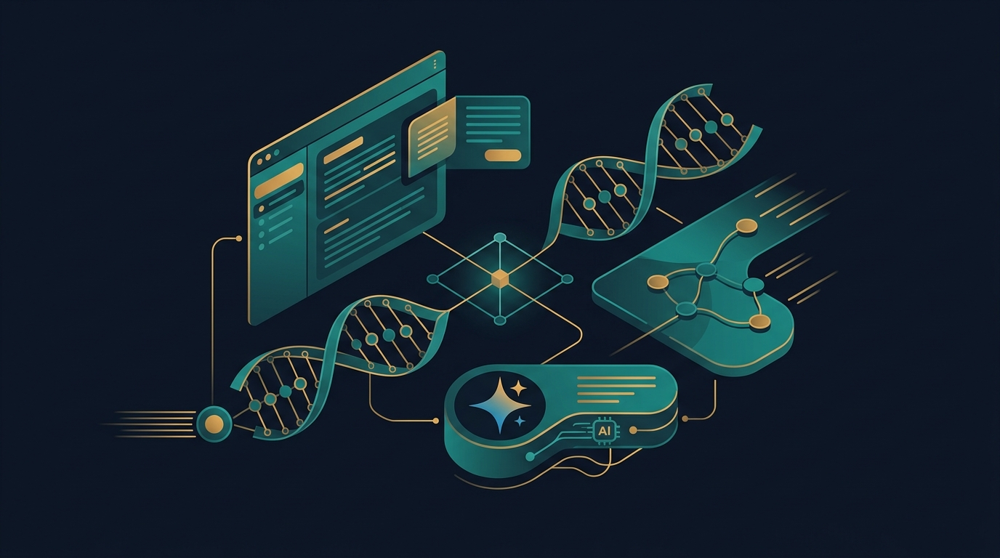
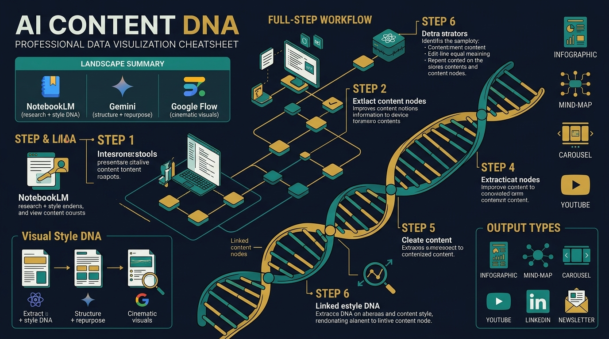
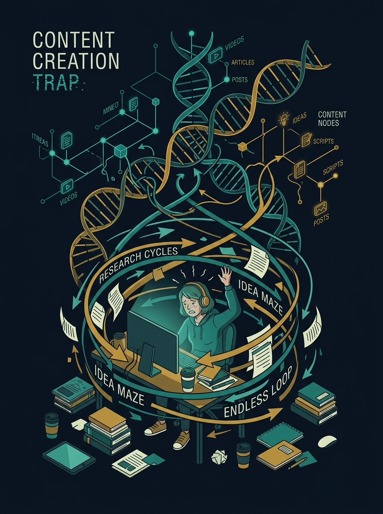
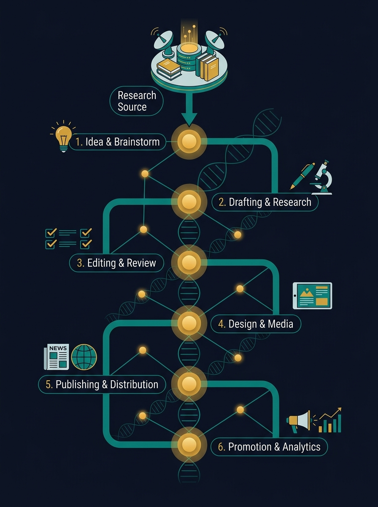

<!-- _class: title -->

# AI Content DNA

1 research source → 6+ content formats · NotebookLM + Gemini + Google Flow · ฟรีทั้งหมด

<!-- Speaker: Hook — "คุณเคยทำวิจัยเดิมซ้ำ 3 ครั้งสำหรับบทความ วิดีโอ และ newsletter ไหม? ใน deck นี้เราจะหยุดทำแบบนั้น" -->

---

<!-- _class: cheatsheet -->
<!-- _backgroundColor: #0f172a -->

<!-- Speaker: ชี้ทั้ง 3 โซน: ซ้าย = NotebookLM/research, กลาง = Gemini/structure, ขวา = Flow/visuals + 6-step workflow ด้านล่าง -->

---

## TL;DR: 1 Source, Infinite Outputs

AI Content DNA turns a single research article into a full content ecosystem — no re-research.

<svg viewBox="0 0 1100 340" width="100%" xmlns="http://www.w3.org/2000/svg">
  <!-- Central source node -->
  <circle cx="550" cy="170" r="64" fill="var(--accent)" opacity=".15"/>
  <circle cx="550" cy="170" r="48" fill="var(--accent)" opacity=".3"/>
  <circle cx="550" cy="170" r="32" fill="var(--accent)"/>
  <text x="550" y="164" font-size="11" font-weight="700" fill="white" text-anchor="middle" font-family="system-ui">Research</text>
  <text x="550" y="180" font-size="11" font-weight="700" fill="white" text-anchor="middle" font-family="system-ui">Article</text>
  <!-- Spokes -->
  <line x1="550" y1="138" x2="550" y2="52" stroke="var(--gold)" stroke-width="2" stroke-dasharray="4 3"/>
  <line x1="550" y1="202" x2="550" y2="288" stroke="var(--gold)" stroke-width="2" stroke-dasharray="4 3"/>
  <line x1="502" y1="152" x2="350" y2="90" stroke="var(--muted)" stroke-width="1.5" stroke-dasharray="4 3"/>
  <line x1="598" y1="152" x2="750" y2="90" stroke="var(--muted)" stroke-width="1.5" stroke-dasharray="4 3"/>
  <line x1="502" y1="188" x2="350" y2="250" stroke="var(--muted)" stroke-width="1.5" stroke-dasharray="4 3"/>
  <line x1="598" y1="188" x2="750" y2="250" stroke="var(--muted)" stroke-width="1.5" stroke-dasharray="4 3"/>
  <!-- Output nodes -->
  <rect x="460" y="20" width="180" height="38" rx="8" fill="var(--gold)" opacity=".15" stroke="var(--gold)" stroke-width="1.5"/>
  <text x="550" y="44" font-size="13" font-weight="700" fill="var(--gold)" text-anchor="middle" font-family="system-ui">Mind Map + Infographic</text>
  <rect x="460" y="282" width="180" height="38" rx="8" fill="var(--gold)" opacity=".15" stroke="var(--gold)" stroke-width="1.5"/>
  <text x="550" y="306" font-size="13" font-weight="700" fill="var(--gold)" text-anchor="middle" font-family="system-ui">YouTube + Newsletter</text>
  <rect x="220" y="72" width="160" height="38" rx="8" fill="var(--accent)" opacity=".12" stroke="var(--accent)" stroke-width="1.5"/>
  <text x="300" y="96" font-size="13" font-weight="700" fill="var(--accent)" text-anchor="middle" font-family="system-ui">NotebookLM</text>
  <rect x="720" y="72" width="160" height="38" rx="8" fill="var(--accent)" opacity=".12" stroke="var(--accent)" stroke-width="1.5"/>
  <text x="800" y="96" font-size="13" font-weight="700" fill="var(--accent)" text-anchor="middle" font-family="system-ui">Gemini</text>
  <rect x="220" y="232" width="160" height="38" rx="8" fill="var(--accent)" opacity=".12" stroke="var(--accent)" stroke-width="1.5"/>
  <text x="300" y="256" font-size="13" font-weight="700" fill="var(--accent)" text-anchor="middle" font-family="system-ui">Google Flow</text>
  <rect x="720" y="232" width="160" height="38" rx="8" fill="var(--muted)" opacity=".15" stroke="var(--muted)" stroke-width="1.5"/>
  <text x="800" y="256" font-size="13" font-weight="700" fill="var(--ink-dim)" text-anchor="middle" font-family="system-ui">LinkedIn Carousel</text>
  <rect x="0" y="0" width="1" height="1" fill="none"/>
</svg>

<b>★ Takeaway:</b> Visual Style DNA is the shared type system — it keeps all 3 tools visually consistent without manual coordination.

<!-- Speaker: ชี้แสดง 6 output node รอบ source ตรงกลาง อธิบายว่า DNA กลางคือสิ่งที่ทำให้ทุกอย่าง sync กัน -->

---

## The Content Creation Trap

Most creators repeat research 3× for the same topic — article, video, newsletter each start from zero.

<svg viewBox="0 0 700 300" width="100%" xmlns="http://www.w3.org/2000/svg">
  <!-- Problem loop -->
  <rect x="20" y="30" width="180" height="60" rx="10" fill="var(--danger-wash)" stroke="var(--danger)" stroke-width="1.5"/>
  <text x="110" y="57" font-size="13" font-weight="700" fill="var(--danger-ink)" text-anchor="middle" font-family="system-ui">Research (3hrs)</text>
  <text x="110" y="78" font-size="11" fill="var(--danger-ink)" text-anchor="middle" font-family="system-ui">Article v1</text>
  <rect x="260" y="30" width="180" height="60" rx="10" fill="var(--danger-wash)" stroke="var(--danger)" stroke-width="1.5"/>
  <text x="350" y="57" font-size="13" font-weight="700" fill="var(--danger-ink)" text-anchor="middle" font-family="system-ui">Research (3hrs)</text>
  <text x="350" y="78" font-size="11" fill="var(--danger-ink)" text-anchor="middle" font-family="system-ui">Video script</text>
  <rect x="500" y="30" width="180" height="60" rx="10" fill="var(--danger-wash)" stroke="var(--danger)" stroke-width="1.5"/>
  <text x="590" y="57" font-size="13" font-weight="700" fill="var(--danger-ink)" text-anchor="middle" font-family="system-ui">Research (3hrs)</text>
  <text x="590" y="78" font-size="11" fill="var(--danger-ink)" text-anchor="middle" font-family="system-ui">Newsletter</text>
  <!-- Arrows -->
  <line x1="200" y1="60" x2="258" y2="60" stroke="var(--danger)" stroke-width="2"/>
  <polygon points="250,55 258,60 250,65" fill="var(--danger)"/>
  <line x1="440" y1="60" x2="498" y2="60" stroke="var(--danger)" stroke-width="2"/>
  <polygon points="490,55 498,60 490,65" fill="var(--danger)"/>
  <!-- Label -->
  <rect x="200" y="130" width="300" height="50" rx="10" fill="var(--soft)" stroke="var(--accent)" stroke-width="2"/>
  <text x="350" y="152" font-size="14" font-weight="700" fill="var(--accent)" text-anchor="middle" font-family="system-ui">9+ hours / week</text>
  <text x="350" y="172" font-size="12" fill="var(--ink-dim)" text-anchor="middle" font-family="system-ui">same facts, different packaging</text>
  <!-- Solution teaser -->
  <rect x="200" y="218" width="300" height="50" rx="10" fill="var(--accent)" opacity=".12" stroke="var(--accent)" stroke-width="2"/>
  <text x="350" y="240" font-size="14" font-weight="700" fill="var(--accent)" text-anchor="middle" font-family="system-ui">Content DNA: research once</text>
  <text x="350" y="260" font-size="12" fill="var(--ink-dim)" text-anchor="middle" font-family="system-ui">distribute everywhere</text>
  <rect x="0" y="0" width="1" height="1" fill="none"/>
</svg>

<b>★ Takeaway:</b> The problem isn't lack of tools — it's lack of a shared DNA that connects them all.

<!-- Speaker: Research 3 ครั้งสำหรับ content เดียวกัน = กับดักที่ทุกคนติดอยู่ Content DNA แก้ตรงนี้ -->

---

## Content DNA Architecture: Source → Ecosystem

One research source fans out through 3 tools via a shared Visual Style DNA template.

<svg viewBox="0 0 1100 380" width="100%" xmlns="http://www.w3.org/2000/svg">
  <!-- Source box -->
  <rect x="40" y="150" width="160" height="80" rx="12" fill="var(--ink)" stroke="var(--gold)" stroke-width="2"/>
  <text x="120" y="182" font-size="14" font-weight="700" fill="var(--gold)" text-anchor="middle" font-family="system-ui">Research</text>
  <text x="120" y="202" font-size="14" font-weight="700" fill="var(--gold)" text-anchor="middle" font-family="system-ui">Article</text>
  <text x="120" y="222" font-size="11" fill="var(--muted)" text-anchor="middle" font-family="system-ui">PDF / URL / YouTube</text>
  <!-- Arrow to DNA -->
  <line x1="200" y1="190" x2="288" y2="190" stroke="var(--gold)" stroke-width="2"/>
  <polygon points="280,185 288,190 280,195" fill="var(--gold)"/>
  <!-- DNA box -->
  <rect x="290" y="140" width="200" height="100" rx="12" fill="var(--gold)" opacity=".15" stroke="var(--gold)" stroke-width="2"/>
  <text x="390" y="168" font-size="13" font-weight="700" fill="var(--gold)" text-anchor="middle" font-family="system-ui">Visual Style DNA</text>
  <text x="390" y="188" font-size="11" fill="var(--ink-dim)" text-anchor="middle" font-family="system-ui">color + typography</text>
  <text x="390" y="204" font-size="11" fill="var(--ink-dim)" text-anchor="middle" font-family="system-ui">layout + mood</text>
  <text x="390" y="220" font-size="11" fill="var(--ink-dim)" text-anchor="middle" font-family="system-ui">brand identity</text>
  <!-- Arrows to tools -->
  <line x1="490" y1="165" x2="588" y2="100" stroke="var(--accent)" stroke-width="2"/>
  <polygon points="582,96 590,104 580,106" fill="var(--accent)"/>
  <line x1="490" y1="190" x2="590" y2="190" stroke="var(--accent)" stroke-width="2"/>
  <polygon points="582,185 590,190 582,195" fill="var(--accent)"/>
  <line x1="490" y1="215" x2="588" y2="280" stroke="var(--accent)" stroke-width="2"/>
  <polygon points="580,274 590,278 584,288" fill="var(--accent)"/>
  <!-- Tool boxes -->
  <rect x="592" y="60" width="160" height="80" rx="10" fill="var(--accent)" opacity=".12" stroke="var(--accent)" stroke-width="2"/>
  <text x="672" y="92" font-size="13" font-weight="700" fill="var(--accent)" text-anchor="middle" font-family="system-ui">NotebookLM</text>
  <text x="672" y="110" font-size="11" fill="var(--ink-dim)" text-anchor="middle" font-family="system-ui">Research + Infographic</text>
  <text x="672" y="128" font-size="11" fill="var(--ink-dim)" text-anchor="middle" font-family="system-ui">Mind Map + Audio</text>
  <rect x="592" y="150" width="160" height="80" rx="10" fill="var(--accent)" opacity=".12" stroke="var(--accent)" stroke-width="2"/>
  <text x="672" y="182" font-size="13" font-weight="700" fill="var(--accent)" text-anchor="middle" font-family="system-ui">Gemini</text>
  <text x="672" y="200" font-size="11" fill="var(--ink-dim)" text-anchor="middle" font-family="system-ui">Structure + Timeline</text>
  <text x="672" y="218" font-size="11" fill="var(--ink-dim)" text-anchor="middle" font-family="system-ui">YouTube + Newsletter</text>
  <rect x="592" y="240" width="160" height="80" rx="10" fill="var(--accent)" opacity=".12" stroke="var(--accent)" stroke-width="2"/>
  <text x="672" y="272" font-size="13" font-weight="700" fill="var(--accent)" text-anchor="middle" font-family="system-ui">Google Flow</text>
  <text x="672" y="290" font-size="11" fill="var(--ink-dim)" text-anchor="middle" font-family="system-ui">Carousel + Cinematic</text>
  <text x="672" y="308" font-size="11" fill="var(--ink-dim)" text-anchor="middle" font-family="system-ui">Veo 3 + Imagen 4</text>
  <!-- Arrow to outputs -->
  <line x1="752" y1="100" x2="840" y2="130" stroke="var(--muted)" stroke-width="1.5" stroke-dasharray="4 3"/>
  <line x1="752" y1="190" x2="840" y2="190" stroke="var(--muted)" stroke-width="1.5" stroke-dasharray="4 3"/>
  <line x1="752" y1="280" x2="840" y2="250" stroke="var(--muted)" stroke-width="1.5" stroke-dasharray="4 3"/>
  <!-- Outputs -->
  <text x="848" y="118" font-size="12" fill="var(--gold)" font-family="system-ui" font-weight="600">Mind Map  Infographic</text>
  <text x="848" y="138" font-size="12" fill="var(--gold)" font-family="system-ui" font-weight="600">Podcast  Slide Deck</text>
  <text x="848" y="183" font-size="12" fill="var(--gold)" font-family="system-ui" font-weight="600">Timeline  LinkedIn Post</text>
  <text x="848" y="203" font-size="12" fill="var(--gold)" font-family="system-ui" font-weight="600">YouTube Script  Newsletter</text>
  <text x="848" y="243" font-size="12" fill="var(--gold)" font-family="system-ui" font-weight="600">Carousel Images</text>
  <text x="848" y="263" font-size="12" fill="var(--gold)" font-family="system-ui" font-weight="600">Cinematic Video Clips</text>
  <rect x="0" y="0" width="1" height="1" fill="none"/>
</svg>

<b>★ Takeaway:</b> Visual Style DNA is injected into all 3 tools — one style decision propagates across every output automatically.

<!-- Speaker: อธิบาย flow ซ้ายไปขวา: source → DNA → 3 tools → 6+ outputs DNA คือ "type system" ที่ทำให้ทุก output compatible -->

---

## Tool 1: NotebookLM — Research + Style DNA

NotebookLM is the knowledge base: add sources, generate Visual Style DNA, produce all visual assets.

  

    
Sources Accepted

    <h3>Any Format</h3>
    <ul>
      <li>URL บทความ / เว็บไซต์</li>
      <li>PDF documents</li>
      <li>YouTube video URL</li>
      <li>Google Docs / Slides</li>
      <li>Pasted text</li>
    </ul>
  

  

    
Infographic Styles (2026)

    <h3>10 Presets + Custom</h3>
    <ul>
      <li>Professional · Bento Grid</li>
      <li>Sketch Note · Kawaii</li>
      <li>Editorial · Bricks</li>
      <li>Anime · Clay · Scientific</li>
      <li><b>Custom</b> = paste Style DNA</li>
    </ul>
  

  

    
Outputs

    <h3>5 Asset Types</h3>
    <ul>
      <li>Mind Map (interactive)</li>
      <li>Infographic (PNG)</li>
      <li>Audio Overview (MP3)</li>
      <li>Slide Deck (PPTX)</li>
      <li>Briefing Document</li>
    </ul>
  

<b>★ Takeaway:</b> The "Custom" infographic style slot is where you paste the Visual Style DNA — this is how brand consistency propagates into every NotebookLM asset.

<!-- Speaker: เน้น Custom style slot — นี่คือ injection point ของ DNA เข้าไปใน NotebookLM -->

---

## Visual Style DNA: 3-Step Extraction

Extract visual identity from any reference infographic in under 2 minutes — no design skills needed.

<svg viewBox="0 0 1100 320" width="100%" xmlns="http://www.w3.org/2000/svg">
  <!-- Step 1 -->
  <rect x="40" y="60" width="260" height="200" rx="12" fill="var(--paper)" stroke="var(--soft-2)" stroke-width="1.5" style="filter:drop-shadow(0 4px 12px rgba(15,23,42,.08))"/>
  <circle cx="90" cy="110" r="24" fill="var(--accent)" opacity=".15"/>
  <circle cx="90" cy="110" r="16" fill="var(--accent)"/>
  <text x="90" y="115" font-size="14" font-weight="700" fill="white" text-anchor="middle" font-family="system-ui">1</text>
  <text x="200" y="104" font-size="15" font-weight="700" fill="var(--ink)" text-anchor="middle" font-family="system-ui">Find Reference</text>
  <text x="200" y="130" font-size="12" fill="var(--ink-dim)" text-anchor="middle" font-family="system-ui">Screenshot infographic</text>
  <text x="200" y="150" font-size="12" fill="var(--ink-dim)" text-anchor="middle" font-family="system-ui">you like the look of</text>
  <text x="200" y="190" font-size="11" fill="var(--muted)" text-anchor="middle" font-family="system-ui">Pinterest / Dribbble / Twitter</text>
  <text x="200" y="208" font-size="11" fill="var(--muted)" text-anchor="middle" font-family="system-ui">any source works</text>
  <!-- Arrow 1→2 -->
  <line x1="300" y1="160" x2="388" y2="160" stroke="var(--accent)" stroke-width="2"/>
  <polygon points="380,155 388,160 380,165" fill="var(--accent)"/>
  <!-- Step 2 -->
  <rect x="390" y="60" width="320" height="200" rx="12" fill="var(--paper)" stroke="var(--gold)" stroke-width="2" style="filter:drop-shadow(0 4px 12px rgba(15,23,42,.08))"/>
  <circle cx="450" cy="110" r="24" fill="var(--gold)" opacity=".2"/>
  <circle cx="450" cy="110" r="16" fill="var(--gold)"/>
  <text x="450" y="115" font-size="14" font-weight="700" fill="white" text-anchor="middle" font-family="system-ui">2</text>
  <text x="570" y="104" font-size="15" font-weight="700" fill="var(--ink)" text-anchor="middle" font-family="system-ui">Gemini Extracts Style</text>
  <text x="570" y="128" font-size="11" fill="var(--ink-dim)" text-anchor="middle" font-family="system-ui">Upload screenshot + prompt:</text>
  <text x="570" y="148" font-size="11" fill="var(--accent)" text-anchor="middle" font-family="system-ui" font-style="italic">"Extract visual style as</text>
  <text x="570" y="164" font-size="11" fill="var(--accent)" text-anchor="middle" font-family="system-ui" font-style="italic">NotebookLM style desc"</text>
  <text x="570" y="192" font-size="11" fill="var(--muted)" text-anchor="middle" font-family="system-ui">Returns: hex codes + layout</text>
  <text x="570" y="208" font-size="11" fill="var(--muted)" text-anchor="middle" font-family="system-ui">+ typography + mood</text>
  <!-- Arrow 2→3 -->
  <line x1="710" y1="160" x2="798" y2="160" stroke="var(--accent)" stroke-width="2"/>
  <polygon points="790,155 798,160 790,165" fill="var(--accent)"/>
  <!-- Step 3 -->
  <rect x="800" y="60" width="260" height="200" rx="12" fill="var(--soft)" stroke="var(--accent)" stroke-width="2" style="filter:drop-shadow(0 4px 12px rgba(15,23,42,.08))"/>
  <circle cx="850" cy="110" r="24" fill="var(--accent)" opacity=".2"/>
  <circle cx="850" cy="110" r="16" fill="var(--accent)"/>
  <text x="850" y="115" font-size="14" font-weight="700" fill="white" text-anchor="middle" font-family="system-ui">3</text>
  <text x="970" y="104" font-size="15" font-weight="700" fill="var(--ink)" text-anchor="middle" font-family="system-ui">Paste into NotebookLM</text>
  <text x="970" y="130" font-size="12" fill="var(--ink-dim)" text-anchor="middle" font-family="system-ui">Infographic icon</text>
  <text x="970" y="150" font-size="12" fill="var(--ink-dim)" text-anchor="middle" font-family="system-ui">Custom Style field</text>
  <text x="970" y="190" font-size="11" fill="var(--success-ink)" text-anchor="middle" font-family="system-ui">All future infographics</text>
  <text x="970" y="208" font-size="11" fill="var(--success-ink)" text-anchor="middle" font-family="system-ui">match your brand</text>
  <rect x="0" y="0" width="1" height="1" fill="none"/>
</svg>

<b>★ Takeaway:</b> Style DNA extraction takes 2 minutes once — after that, every NotebookLM infographic inherits your brand identity automatically.

<!-- Speaker: นี่คือ secret weapon ของ workflow — เทคนิคนี้ไม่มีใน official docs แต่ใช้งานได้จริง -->

---

## Tool 2: Gemini — Structure + Repurpose Engine

Gemini syncs with NotebookLM automatically — no copy-paste. One prompt, four content formats.

  

    
YouTube Script

    <h3>8-min Video</h3>
    
Hook 30s + 3 key points + CTA — all from notebook context, no re-research.

  

  

    
LinkedIn Post

    <h3>1,300 chars</h3>
    
Hook line + 5 bullets + 5 hashtags — compressed from full notebook summary.

  

  

    
Newsletter

    <h3>400-word Issue</h3>
    
Subject line + preview text + body — reformatted, not rewritten from scratch.

  

  

    
Twitter/X Thread

    <h3>7-Tweet Thread</h3>
    
Each tweet self-contained — Gemini splits by insight, not word count.

  

<b>★ Takeaway:</b> Because Gemini syncs with NotebookLM in real-time, every repurpose prompt automatically has access to the full research corpus — no context copying.

<!-- Speaker: เน้น real-time sync — นี่คือ feature ใหม่ Q1 2026 ที่เปลี่ยนเกม ไม่ต้อง paste context ทุกครั้ง -->

---

## Tool 3: Google Flow — Cinematic Visuals

Google Flow (Veo 3 + Imagen 4) generates watermark-free images and cinematic videos from text prompts.

  

    
Imagen 4 — Still Images

    <h3>Cinematic Carousel</h3>
    
Style reference consistency: use first slide as reference — all subsequent slides share the same visual language automatically.

    
<b>No visible watermark</b> on still images (SynthID is invisible).

  

  

    
Veo 3 — Video

    <h3>Short Clips</h3>
    
Text prompt → cinematic video with synchronized audio. 1080p upscaling built-in.

    
Free tier: visible watermark on video. Ultra plan: watermark-free.

  

  

    
Key Capability

    <h3>Multi-Reference</h3>
    
Combine character + background + object references → maintain visual consistency across entire carousel set.

    
Expanded to 140+ countries (I/O 2026).

  

<b>★ Takeaway:</b> Prepend your Visual Style DNA to every Flow prompt — this is the only coherence lever across multiple generated images.

<!-- Speaker: อธิบาย multi-reference feature — นี่คือสิ่งที่ทำให้ carousel ดู professional มีสไตล์เดียวกัน -->

---

## Full Workflow: 6 Steps, ~2–3 Hours

From zero to full content ecosystem — one research pass, six output types.

<svg viewBox="0 0 700 300" width="100%" xmlns="http://www.w3.org/2000/svg">
  <!-- 6-step flow in 2 rows -->
  <rect x="20" y="20" width="190" height="56" rx="8" fill="var(--accent)" opacity=".12" stroke="var(--accent)" stroke-width="1.5"/>
  <text x="40" y="42" font-size="12" font-weight="700" fill="var(--accent)" font-family="system-ui">Step 1: Add Sources</text>
  <text x="40" y="60" font-size="11" fill="var(--ink-dim)" font-family="system-ui">NotebookLM upload articles</text>
  <rect x="260" y="20" width="190" height="56" rx="8" fill="var(--gold)" opacity=".12" stroke="var(--gold)" stroke-width="1.5"/>
  <text x="280" y="42" font-size="12" font-weight="700" fill="var(--warning-ink)" font-family="system-ui">Step 2: Style DNA</text>
  <text x="280" y="60" font-size="11" fill="var(--ink-dim)" font-family="system-ui">Gemini extract + paste</text>
  <rect x="490" y="20" width="190" height="56" rx="8" fill="var(--accent)" opacity=".12" stroke="var(--accent)" stroke-width="1.5"/>
  <text x="510" y="42" font-size="12" font-weight="700" fill="var(--accent)" font-family="system-ui">Step 3: Visual Assets</text>
  <text x="510" y="60" font-size="11" fill="var(--ink-dim)" font-family="system-ui">Mind Map + Infographic</text>
  <!-- Row 1 arrows -->
  <line x1="210" y1="48" x2="258" y2="48" stroke="var(--muted)" stroke-width="1.5"/>
  <polygon points="250,44 258,48 250,52" fill="var(--muted)"/>
  <line x1="450" y1="48" x2="488" y2="48" stroke="var(--muted)" stroke-width="1.5"/>
  <polygon points="480,44 488,48 480,52" fill="var(--muted)"/>
  <!-- Row 2 -->
  <rect x="20" y="168" width="190" height="56" rx="8" fill="var(--accent)" opacity=".12" stroke="var(--accent)" stroke-width="1.5"/>
  <text x="40" y="190" font-size="12" font-weight="700" fill="var(--accent)" font-family="system-ui">Step 4: Structure</text>
  <text x="40" y="208" font-size="11" fill="var(--ink-dim)" font-family="system-ui">Gemini timeline + framework</text>
  <rect x="260" y="168" width="190" height="56" rx="8" fill="var(--success-wash)" stroke="var(--success)" stroke-width="1.5"/>
  <text x="280" y="190" font-size="12" font-weight="700" fill="var(--success-ink)" font-family="system-ui">Step 5: Cinematic</text>
  <text x="280" y="208" font-size="11" fill="var(--ink-dim)" font-family="system-ui">Google Flow carousel</text>
  <rect x="490" y="168" width="190" height="56" rx="8" fill="var(--gold)" opacity=".12" stroke="var(--gold)" stroke-width="1.5"/>
  <text x="510" y="190" font-size="12" font-weight="700" fill="var(--warning-ink)" font-family="system-ui">Step 6: Repurpose</text>
  <text x="510" y="208" font-size="11" fill="var(--ink-dim)" font-family="system-ui">YouTube + LinkedIn + Email</text>
  <!-- Row 2 arrows -->
  <line x1="210" y1="196" x2="258" y2="196" stroke="var(--muted)" stroke-width="1.5"/>
  <polygon points="250,192 258,196 250,200" fill="var(--muted)"/>
  <line x1="450" y1="196" x2="488" y2="196" stroke="var(--muted)" stroke-width="1.5"/>
  <polygon points="480,192 488,196 480,200" fill="var(--muted)"/>
  <!-- Row connector -->
  <line x1="585" y1="76" x2="585" y2="100" stroke="var(--muted)" stroke-width="1.5" stroke-dasharray="4 3"/>
  <line x1="585" y1="100" x2="115" y2="100" stroke="var(--muted)" stroke-width="1.5" stroke-dasharray="4 3"/>
  <line x1="115" y1="100" x2="115" y2="168" stroke="var(--muted)" stroke-width="1.5" stroke-dasharray="4 3"/>
  <polygon points="110,160 115,168 120,160" fill="var(--muted)"/>
  <rect x="0" y="0" width="1" height="1" fill="none"/>
</svg>

<b>★ Takeaway:</b> Steps 1–3 are one-time setup; Steps 4–6 repeat for every new content piece in ~30 minutes once Style DNA template exists.

<!-- Speaker: Row 1 = preparation (research + DNA + assets), Row 2 = production (structure + visuals + repurpose) -->

---

## Get Started: Quick Access

All 3 tools accessible in under 1 minute — no installation, no credit card.

  

    
Tool 1

    <h3>NotebookLM</h3>
    
<b>notebooklm.google.com</b>

    
Free (Google account). New Notebook → Add Source → Generate Infographic.

    
Custom style slot: Infographic icon → Custom Description.

  

  

    
Tool 2

    <h3>Gemini</h3>
    
<b>gemini.google.com</b>

    
Free / Advanced. Notebooks sync automatically with NotebookLM (April 2026).

    
No manual context transfer needed.

  

  

    
Tool 3

    <h3>Google Flow / ImageFX</h3>
    
<b>labs.google/flow</b>

    
Waitlist (limited regions). Fallback: aitestkitchen.withgoogle.com/tools/image-fx for Imagen 4 wider access.

  

<b>★ Takeaway:</b> If Flow has a waitlist in your region, use ImageFX directly — same Imagen 4 model, no waitlist, free.

<!-- Speaker: ImageFX fallback สำคัญมาก — คนส่วนใหญ่ไม่รู้ว่า Imagen 4 มีอยู่ใน ImageFX โดยไม่ต้องรอ waitlist -->

---

## Caveats & Limits

Know these before you start — most limits have free workarounds.

  

    
NotebookLM

    <h3>Free Tier Limits</h3>
    
Infographic generation: limited per day. No custom font support. New output formats (PDF, PPTX) require Google AI Ultra subscription.

  

  

    
Gemini

    <h3>File Gen Rollout</h3>
    
Direct PDF / DOCX export still rolling out — not all accounts. Workaround: copy text into Google Docs manually then export.

  

  

    
Google Flow

    <h3>Region + Watermark</h3>
    
Labs waitlist varies by region. Free video tier has visible watermark — still images (Imagen 4) do not. SynthID invisible watermark on all outputs.

  

<b>★ Takeaway:</b> Visual Style DNA is a technique, not an official feature — accuracy depends on reference quality; always verify brand colors in the first generated infographic before full rollout.

<!-- Speaker: SynthID caveat สำคัญสำหรับ commercial use — ตรวจสอบ terms of service ก่อน publish เพื่อขาย -->

---

## Key Takeaways

What changes when you apply Content DNA to your workflow.

<svg viewBox="0 0 1100 340" width="100%" xmlns="http://www.w3.org/2000/svg">
  <!-- Concentric rings -->
  <circle cx="220" cy="170" r="150" fill="none" stroke="var(--soft-2)" stroke-width="1.5"/>
  <circle cx="220" cy="170" r="100" fill="none" stroke="var(--accent)" stroke-width="1.5" opacity=".4"/>
  <circle cx="220" cy="170" r="50" fill="var(--accent)" opacity=".1"/>
  <circle cx="220" cy="170" r="50" fill="none" stroke="var(--accent)" stroke-width="2"/>
  <text x="220" y="164" font-size="13" font-weight="700" fill="var(--accent)" text-anchor="middle" font-family="system-ui">Content</text>
  <text x="220" y="182" font-size="13" font-weight="700" fill="var(--accent)" text-anchor="middle" font-family="system-ui">DNA</text>
  <text x="130" y="88" font-size="11" fill="var(--ink)" text-anchor="middle" font-family="system-ui">Style DNA</text>
  <text x="310" y="88" font-size="11" fill="var(--ink)" text-anchor="middle" font-family="system-ui">3 Free Tools</text>
  <text x="80" y="175" font-size="11" fill="var(--muted)" text-anchor="middle" font-family="system-ui">Research</text>
  <text x="80" y="192" font-size="11" fill="var(--muted)" text-anchor="middle" font-family="system-ui">Once</text>
  <text x="360" y="175" font-size="11" fill="var(--muted)" text-anchor="middle" font-family="system-ui">Visual</text>
  <text x="360" y="192" font-size="11" fill="var(--muted)" text-anchor="middle" font-family="system-ui">Consistency</text>
  <!-- Right side takeaways -->
  <rect x="430" y="20" width="640" height="300" rx="12" fill="var(--soft)" stroke="var(--soft-2)" stroke-width="1.5"/>
  <rect x="430" y="20" width="6" height="300" rx="3" fill="var(--gold)"/>
  <text x="460" y="52" font-size="13" font-weight="700" fill="var(--ink)" font-family="system-ui">1 source</text>
  <text x="560" y="52" font-size="13" fill="var(--ink-dim)" font-family="system-ui">→ 6+ formats, no re-research</text>
  <text x="460" y="84" font-size="13" font-weight="700" fill="var(--ink)" font-family="system-ui">Style DNA</text>
  <text x="570" y="84" font-size="13" fill="var(--ink-dim)" font-family="system-ui">→ brand-consistent all outputs</text>
  <text x="460" y="116" font-size="13" font-weight="700" fill="var(--ink)" font-family="system-ui">Gemini sync</text>
  <text x="580" y="116" font-size="13" fill="var(--ink-dim)" font-family="system-ui">→ no copy-paste context</text>
  <text x="460" y="148" font-size="13" font-weight="700" fill="var(--ink)" font-family="system-ui">Imagen 4</text>
  <text x="556" y="148" font-size="13" fill="var(--ink-dim)" font-family="system-ui">→ cinematic carousel, no visible wm</text>
  <text x="460" y="180" font-size="13" font-weight="700" fill="var(--ink)" font-family="system-ui">Cost</text>
  <text x="506" y="180" font-size="13" fill="var(--success-ink)" font-family="system-ui">→ $0 (all free tier)</text>
  <text x="460" y="212" font-size="13" font-weight="700" fill="var(--ink)" font-family="system-ui">Time</text>
  <text x="510" y="212" font-size="13" fill="var(--ink-dim)" font-family="system-ui">→ 2-3 hrs vs. 9+ hrs traditional</text>
  <text x="460" y="250" font-size="12" fill="var(--muted)" font-family="system-ui">ImageFX fallback if Flow waitlisted</text>
  <text x="460" y="270" font-size="12" fill="var(--muted)" font-family="system-ui">SynthID: check ToS for commercial use</text>
  <rect x="0" y="0" width="1" height="1" fill="none"/>
</svg>

<b>★ Takeaway:</b> Content DNA is not a tool — it's a mental model. The 3 tools are already free; the DNA is the missing connector.

<!-- Speaker: สรุป — DNA คือ mindset shift ไม่ใช่ feature เพิ่มอีกตัว ถ้าจำได้อย่างเดียว จำ Visual Style DNA extraction step -->
