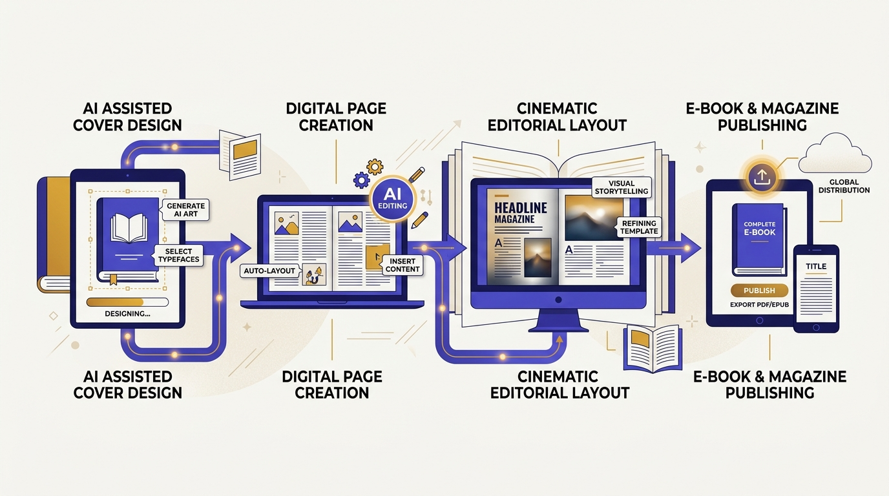
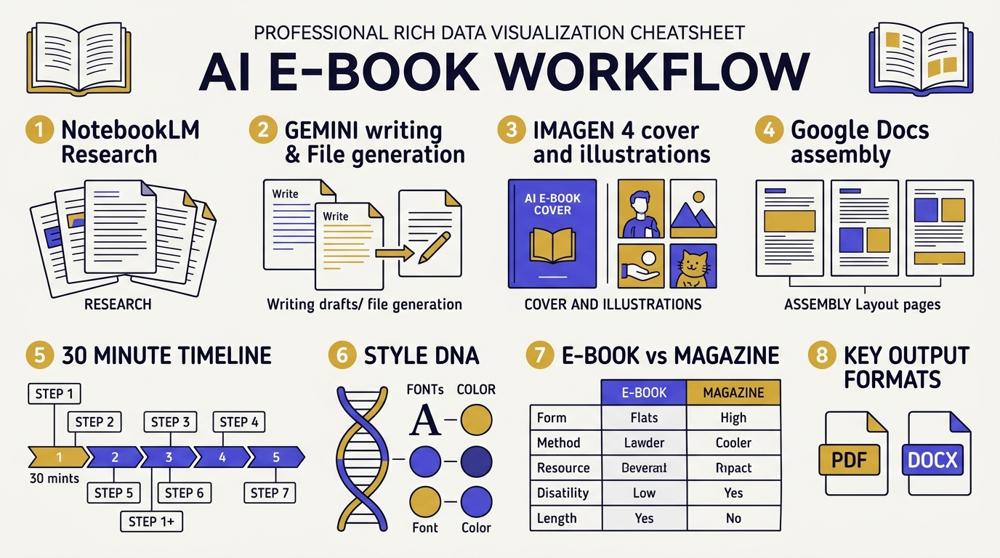
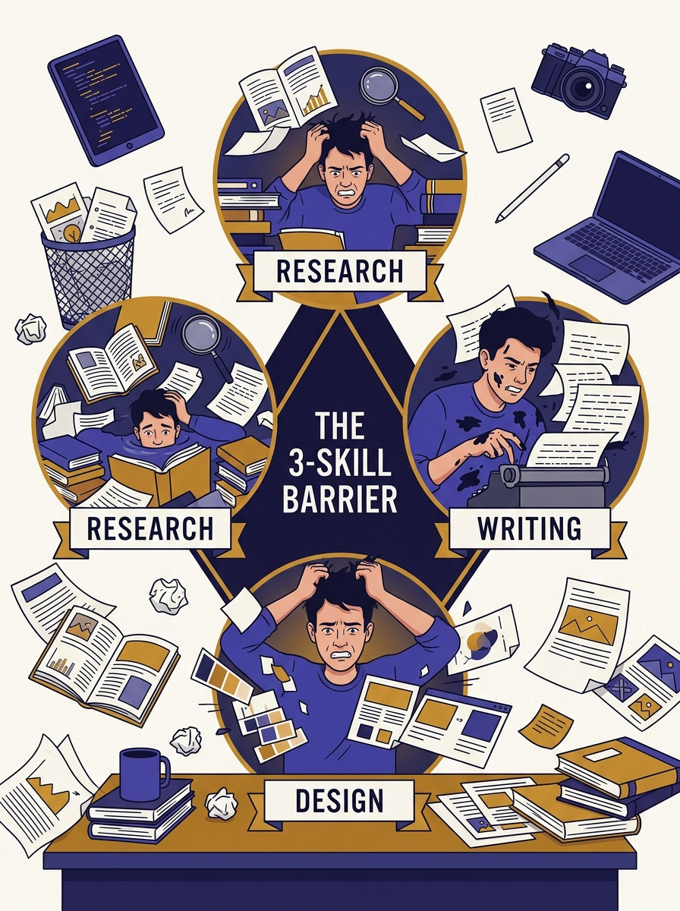
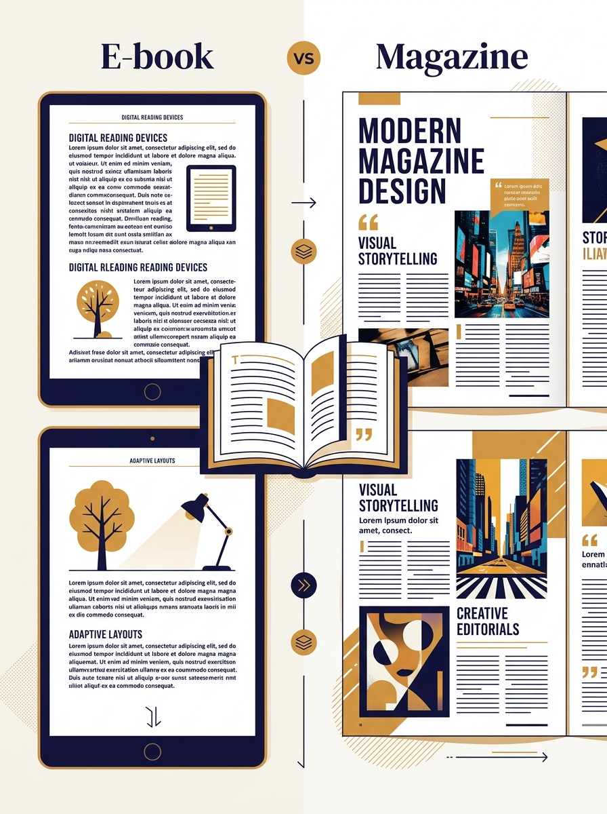

<!-- _class: title -->

# AI E-book & Magazine Workflow

NotebookLM → Gemini → Imagen 4 → Google Docs · research to PDF in 30 min · all free

<!-- Speaker: "สร้าง E-book ระดับมืออาชีพโดยไม่ต้องเขียนหรือออกแบบเอง — 4 เครื่องมือฟรีจาก Google ทำได้ทั้งหมด" -->

---

<!-- _class: cheatsheet -->
<!-- _backgroundColor: #f8f7f4 -->

<!-- Speaker: ชี้ 4 โซนหลัก: NotebookLM (research), Gemini (write+file), Imagen 4 (visuals), Google Docs (assemble) + timeline 30 นาที -->

---

## TL;DR: From Research to PDF in 30 Minutes

Four free Google tools handle all three traditional publishing skills: research, writing, and design.

<svg viewBox="0 0 1100 320" width="100%" xmlns="http://www.w3.org/2000/svg">
  <!-- Step boxes -->
  <rect x="30" y="100" width="190" height="120" rx="12" fill="var(--soft)" stroke="var(--accent)" stroke-width="2"/>
  <rect x="30" y="100" width="190" height="32" rx="12" fill="var(--accent)"/>
  <rect x="30" y="120" width="190" height="12" rx="0" fill="var(--accent)"/>
  <text x="125" y="122" font-size="13" font-weight="700" fill="white" text-anchor="middle" font-family="system-ui">1. NotebookLM</text>
  <text x="125" y="158" font-size="12" fill="var(--ink-dim)" text-anchor="middle" font-family="system-ui">Research</text>
  <text x="125" y="178" font-size="12" fill="var(--ink-dim)" text-anchor="middle" font-family="system-ui">Outline</text>
  <text x="125" y="198" font-size="12" fill="var(--ink-dim)" text-anchor="middle" font-family="system-ui">Briefing Doc</text>
  <!-- Arrow 1->2 -->
  <line x1="220" y1="160" x2="278" y2="160" stroke="var(--accent)" stroke-width="2"/>
  <polygon points="270,155 278,160 270,165" fill="var(--accent)"/>
  <rect x="280" y="100" width="190" height="120" rx="12" fill="var(--soft)" stroke="var(--accent)" stroke-width="2"/>
  <rect x="280" y="100" width="190" height="32" rx="12" fill="var(--accent)"/>
  <rect x="280" y="120" width="190" height="12" rx="0" fill="var(--accent)"/>
  <text x="375" y="122" font-size="13" font-weight="700" fill="white" text-anchor="middle" font-family="system-ui">2. Gemini</text>
  <text x="375" y="158" font-size="12" fill="var(--ink-dim)" text-anchor="middle" font-family="system-ui">Write Chapters</text>
  <text x="375" y="178" font-size="12" fill="var(--ink-dim)" text-anchor="middle" font-family="system-ui">Design Brief</text>
  <text x="375" y="198" font-size="12" fill="var(--ink-dim)" text-anchor="middle" font-family="system-ui">Export PDF/DOCX</text>
  <!-- Arrow 2->3 -->
  <line x1="470" y1="160" x2="528" y2="160" stroke="var(--gold)" stroke-width="2"/>
  <polygon points="520,155 528,160 520,165" fill="var(--gold)"/>
  <rect x="530" y="100" width="190" height="120" rx="12" fill="var(--warning-wash)" stroke="var(--gold)" stroke-width="2"/>
  <rect x="530" y="100" width="190" height="32" rx="12" fill="var(--gold)"/>
  <rect x="530" y="120" width="190" height="12" rx="0" fill="var(--gold)"/>
  <text x="625" y="122" font-size="13" font-weight="700" fill="white" text-anchor="middle" font-family="system-ui">3. Imagen 4</text>
  <text x="625" y="158" font-size="12" fill="var(--ink-dim)" text-anchor="middle" font-family="system-ui">Book Cover</text>
  <text x="625" y="178" font-size="12" fill="var(--ink-dim)" text-anchor="middle" font-family="system-ui">Illustrations</text>
  <text x="625" y="198" font-size="12" fill="var(--ink-dim)" text-anchor="middle" font-family="system-ui">Infographics</text>
  <!-- Arrow 3->4 -->
  <line x1="720" y1="160" x2="778" y2="160" stroke="var(--success)" stroke-width="2"/>
  <polygon points="770,155 778,160 770,165" fill="var(--success)"/>
  <rect x="780" y="100" width="190" height="120" rx="12" fill="var(--success-wash)" stroke="var(--success)" stroke-width="2"/>
  <rect x="780" y="100" width="190" height="32" rx="12" fill="var(--success)"/>
  <rect x="780" y="120" width="190" height="12" rx="0" fill="var(--success)"/>
  <text x="875" y="122" font-size="13" font-weight="700" fill="white" text-anchor="middle" font-family="system-ui">4. Google Docs</text>
  <text x="875" y="158" font-size="12" fill="var(--ink-dim)" text-anchor="middle" font-family="system-ui">Assemble All</text>
  <text x="875" y="178" font-size="12" fill="var(--ink-dim)" text-anchor="middle" font-family="system-ui">Layout + Style</text>
  <text x="875" y="198" font-size="12" fill="var(--success-ink)" text-anchor="middle" font-family="system-ui" font-weight="700">Export PDF</text>
  <!-- Time label -->
  <rect x="380" y="258" width="340" height="36" rx="8" fill="var(--accent)" opacity=".1" stroke="var(--accent)" stroke-width="1.5"/>
  <text x="550" y="281" font-size="13" font-weight="700" fill="var(--accent)" text-anchor="middle" font-family="system-ui">Total: ~30 minutes for a 6-chapter E-book</text>
  <rect x="0" y="0" width="1" height="1" fill="none"/>
</svg>

<b>★ Takeaway:</b> Each tool covers one of the three traditional skills — research, writing, design. Zero skill gaps remain.

<!-- Speaker: 4 tools = 4 roles ที่ปกติต้องการ 4 คนหรือ 4 สัปดาห์ ตอนนี้ทำได้ใน 30 นาที คนเดียว -->

---

## The 3-Skill Barrier Traditional Publishing Requires

Solo creators need research, writing, and graphic design simultaneously — most get stuck on at least one.

<svg viewBox="0 0 700 290" width="100%" xmlns="http://www.w3.org/2000/svg">
  <!-- Triangle of skills -->
  <polygon points="350,40 150,250 550,250" fill="none" stroke="var(--muted)" stroke-width="1.5" stroke-dasharray="6 4"/>
  <!-- Corner skill nodes -->
  <circle cx="350" cy="40" r="40" fill="var(--danger-wash)" stroke="var(--danger)" stroke-width="2"/>
  <text x="350" y="36" font-size="12" font-weight="700" fill="var(--danger-ink)" text-anchor="middle" font-family="system-ui">Research</text>
  <text x="350" y="53" font-size="11" fill="var(--danger-ink)" text-anchor="middle" font-family="system-ui">3+ hours</text>
  <circle cx="150" cy="250" r="40" fill="var(--warning-wash)" stroke="var(--warning)" stroke-width="2"/>
  <text x="150" y="246" font-size="12" font-weight="700" fill="var(--warning-ink)" text-anchor="middle" font-family="system-ui">Writing</text>
  <text x="150" y="263" font-size="11" fill="var(--warning-ink)" text-anchor="middle" font-family="system-ui">5+ hours</text>
  <circle cx="550" cy="250" r="40" fill="var(--accent-wash)" stroke="var(--accent)" stroke-width="2"/>
  <text x="550" y="246" font-size="12" font-weight="700" fill="var(--accent)" text-anchor="middle" font-family="system-ui">Design</text>
  <text x="550" y="263" font-size="11" fill="var(--accent)" text-anchor="middle" font-family="system-ui">3+ hours</text>
  <!-- Center solution -->
  <circle cx="350" cy="180" r="48" fill="var(--success-wash)" stroke="var(--success)" stroke-width="2"/>
  <text x="350" y="174" font-size="13" font-weight="700" fill="var(--success-ink)" text-anchor="middle" font-family="system-ui">AI</text>
  <text x="350" y="193" font-size="13" font-weight="700" fill="var(--success-ink)" text-anchor="middle" font-family="system-ui">Pipeline</text>
  <line x1="350" y1="79" x2="350" y2="132" stroke="var(--success)" stroke-width="1.5" stroke-dasharray="4 3"/>
  <line x1="185" y1="222" x2="310" y2="200" stroke="var(--success)" stroke-width="1.5" stroke-dasharray="4 3"/>
  <line x1="515" y1="222" x2="390" y2="200" stroke="var(--success)" stroke-width="1.5" stroke-dasharray="4 3"/>
  <rect x="0" y="0" width="1" height="1" fill="none"/>
</svg>

<b>★ Takeaway:</b> The AI pipeline collapses the 3-skill triangle — each tool fills exactly one vertex, so solo creators can publish without a team.

<!-- Speaker: ชี้ 3 vertex: research, writing, design — แล้วชี้ AI Pipeline ตรงกลางที่ทำหน้าที่เชื่อมทั้ง 3 -->

---

## Step 1: NotebookLM — Research Engine (June 2026)

NotebookLM upgraded to Gemini 3.5 with agentic research, code execution, and new output formats.

  

    
Sources Accepted

    <h3>Any Format</h3>
    <ul>
      <li>URL articles / websites</li>
      <li>PDF documents</li>
      <li>YouTube video URL</li>
      <li>Google Docs / Slides</li>
      <li>Pasted text</li>
    </ul>
  

  

    
June 2026 New Features

    <h3>Gemini 3.5 Upgrade</h3>
    <ul>
      <li>Agentic source discovery</li>
      <li>Code execution in notebook</li>
      <li>Charts + PDFs + PowerPoint output</li>
      <li>Deeper context understanding</li>
    </ul>
  

  

    
E-book Outputs

    <h3>5 Asset Types</h3>
    <ul>
      <li>Briefing Document (facts)</li>
      <li>Study Guide (Q&amp;A)</li>
      <li>Mind Map (chapter flow)</li>
      <li>Infographic (key data)</li>
      <li>Audio Overview (MP3)</li>
    </ul>
  

<b>★ Takeaway:</b> Generate a Briefing Document first — it becomes the factual foundation that Gemini uses to write all 6 chapters without hallucinating.

<!-- Speaker: Briefing Document เป็น key — มันคือ grounded facts ที่ prevent hallucination ใน Gemini step ถัดไป -->

---

## Step 2: Gemini — Write Chapters + Generate Files

Gemini takes the NotebookLM outline and writes full chapters, design briefs, and downloadable files.

  

    
Chapter Content

    <h3>700-word Chapters</h3>
    
Body text + 2 callout boxes + key quote + 3-bullet summary per chapter.

  

  

    
Design Brief

    <h3>Image Specs</h3>
    
Per-chapter brief: concept, color, mood, size, style — ready to paste into Imagen 4.

  

  

    
File Generation

    <h3>Direct Downloads</h3>
    
.pdf · .docx · .xlsx · Markdown · LaTeX — generated from prompt, no template needed.

  

  

    
Structure Prompt

    <h3>TOC + Heading Styles</h3>
    
"Export as Google Docs with Title Page, TOC, Chapters 1-6, heading H1/H2/Body styles."

  

<b>★ Takeaway:</b> File generation (.pdf, .docx) is still rolling out — if unavailable, copy text into Google Docs directly; the workflow is identical, just one extra step.

<!-- Speaker: Design brief ใน Gemini คือ bridge ระหว่าง writing step และ visual step — สำคัญมากอย่าข้าม -->

---

## Step 3: Imagen 4 — Cinematic Book Visuals

Imagen 4 (GA Feb 2026) renders book covers with readable title text — no Photoshop post-processing required.

<svg viewBox="0 0 1100 360" width="100%" xmlns="http://www.w3.org/2000/svg">
  <!-- Header row -->
  <rect x="40" y="30" width="200" height="36" rx="6" fill="var(--accent)"/>
  <text x="140" y="53" font-size="13" font-weight="700" fill="white" text-anchor="middle" font-family="system-ui">Image Type</text>
  <rect x="260" y="30" width="380" height="36" rx="6" fill="var(--accent)"/>
  <text x="450" y="53" font-size="13" font-weight="700" fill="white" text-anchor="middle" font-family="system-ui">Prompt Pattern</text>
  <rect x="660" y="30" width="200" height="36" rx="6" fill="var(--accent)"/>
  <text x="760" y="53" font-size="13" font-weight="700" fill="white" text-anchor="middle" font-family="system-ui">Dimensions</text>
  <rect x="880" y="30" width="180" height="36" rx="6" fill="var(--accent)"/>
  <text x="970" y="53" font-size="13" font-weight="700" fill="white" text-anchor="middle" font-family="system-ui">Notes</text>
  <!-- Row 1: Book Cover -->
  <rect x="40" y="80" width="1020" height="60" rx="4" fill="var(--soft)"/>
  <text x="140" y="115" font-size="13" font-weight="700" fill="var(--ink)" text-anchor="middle" font-family="system-ui">Book Cover</text>
  <text x="450" y="108" font-size="12" fill="var(--ink-dim)" text-anchor="middle" font-family="system-ui">[Style DNA] cover, title</text>
  <text x="450" y="128" font-size="12" fill="var(--ink-dim)" text-anchor="middle" font-family="system-ui">'[Title]', author '[Name]'</text>
  <text x="760" y="115" font-size="13" fill="var(--ink)" text-anchor="middle" font-family="system-ui">1600x2560 portrait</text>
  <text x="970" y="115" font-size="12" fill="var(--success-ink)" text-anchor="middle" font-family="system-ui">Text renders correctly</text>
  <!-- Row 2: Chapter Illustration -->
  <rect x="40" y="154" width="1020" height="60" rx="4" fill="var(--paper)"/>
  <text x="140" y="189" font-size="13" font-weight="700" fill="var(--ink)" text-anchor="middle" font-family="system-ui">Chapter Illus.</text>
  <text x="450" y="182" font-size="12" fill="var(--ink-dim)" text-anchor="middle" font-family="system-ui">[Style DNA] editorial illus for</text>
  <text x="450" y="202" font-size="12" fill="var(--ink-dim)" text-anchor="middle" font-family="system-ui">chapter about [topic]</text>
  <text x="760" y="189" font-size="13" fill="var(--ink)" text-anchor="middle" font-family="system-ui">1200x800 landscape</text>
  <text x="970" y="189" font-size="12" fill="var(--ink-dim)" text-anchor="middle" font-family="system-ui">Use 1st as reference</text>
  <!-- Row 3: Infographic -->
  <rect x="40" y="228" width="1020" height="60" rx="4" fill="var(--soft)"/>
  <text x="140" y="263" font-size="13" font-weight="700" fill="var(--ink)" text-anchor="middle" font-family="system-ui">Infographic</text>
  <text x="450" y="256" font-size="12" fill="var(--ink-dim)" text-anchor="middle" font-family="system-ui">[Style DNA] data infographic,</text>
  <text x="450" y="276" font-size="12" fill="var(--ink-dim)" text-anchor="middle" font-family="system-ui">[N] steps, dark background</text>
  <text x="760" y="263" font-size="13" fill="var(--ink)" text-anchor="middle" font-family="system-ui">1200x1200 square</text>
  <text x="970" y="263" font-size="12" fill="var(--ink-dim)" text-anchor="middle" font-family="system-ui">Sidebar or full page</text>
  <!-- Row 4: Pull Quote -->
  <rect x="40" y="302" width="1020" height="44" rx="4" fill="var(--paper)"/>
  <text x="140" y="329" font-size="13" font-weight="700" fill="var(--ink)" text-anchor="middle" font-family="system-ui">Pull Quote</text>
  <text x="450" y="329" font-size="12" fill="var(--ink-dim)" text-anchor="middle" font-family="system-ui">[Style DNA] typographic design, quote: '[text]', minimal</text>
  <text x="760" y="329" font-size="13" fill="var(--ink)" text-anchor="middle" font-family="system-ui">800x800 square</text>
  <text x="970" y="329" font-size="12" fill="var(--gold)" text-anchor="middle" font-family="system-ui">Accent pages</text>
  <rect x="0" y="0" width="1" height="1" fill="none"/>
</svg>

<b>★ Takeaway:</b> Always upload the first generated image as a reference for all subsequent images — this is the only way to maintain visual consistency across a 6-chapter E-book.

<!-- Speaker: Style DNA + reference image = visual consistency ที่ปกติต้องการ art director ตรวจทุกภาพ -->

---

## Step 4: Google Docs — Assemble + Export PDF

Google Docs with built-in Gemini AI is the final assembly stage — paste, layout, and export in one tool.

<svg viewBox="0 0 1100 320" width="100%" xmlns="http://www.w3.org/2000/svg">
  <!-- Step 1 -->
  <rect x="30" y="80" width="180" height="160" rx="10" fill="var(--soft)" stroke="var(--accent)" stroke-width="1.5"/>
  <circle cx="80" cy="122" r="20" fill="var(--accent)"/>
  <text x="80" y="127" font-size="14" font-weight="700" fill="white" text-anchor="middle" font-family="system-ui">1</text>
  <text x="125" y="118" font-size="12" font-weight="700" fill="var(--ink)" font-family="system-ui">Page Setup</text>
  <text x="55" y="152" font-size="11" fill="var(--ink-dim)" font-family="system-ui">File → Page Setup</text>
  <text x="55" y="170" font-size="11" fill="var(--ink-dim)" font-family="system-ui">E-book: 6x9 inch</text>
  <text x="55" y="188" font-size="11" fill="var(--ink-dim)" font-family="system-ui">Magazine: A4 land</text>
  <text x="55" y="206" font-size="11" fill="var(--ink-dim)" font-family="system-ui">Set margins</text>
  <!-- Arrow -->
  <line x1="210" y1="160" x2="248" y2="160" stroke="var(--accent)" stroke-width="2"/>
  <polygon points="240,155 248,160 240,165" fill="var(--accent)"/>
  <!-- Step 2 -->
  <rect x="250" y="80" width="180" height="160" rx="10" fill="var(--soft)" stroke="var(--accent)" stroke-width="1.5"/>
  <circle cx="300" cy="122" r="20" fill="var(--accent)"/>
  <text x="300" y="127" font-size="14" font-weight="700" fill="white" text-anchor="middle" font-family="system-ui">2</text>
  <text x="345" y="118" font-size="12" font-weight="700" fill="var(--ink)" font-family="system-ui">Paste Content</text>
  <text x="275" y="152" font-size="11" fill="var(--ink-dim)" font-family="system-ui">Chapter text from Gemini</text>
  <text x="275" y="170" font-size="11" fill="var(--ink-dim)" font-family="system-ui">Apply Heading H1/H2</text>
  <text x="275" y="188" font-size="11" fill="var(--ink-dim)" font-family="system-ui">Body text: 11pt 1.5</text>
  <text x="275" y="206" font-size="11" fill="var(--ink-dim)" font-family="system-ui">Define Callout style</text>
  <!-- Arrow -->
  <line x1="430" y1="160" x2="468" y2="160" stroke="var(--gold)" stroke-width="2"/>
  <polygon points="460,155 468,160 460,165" fill="var(--gold)"/>
  <!-- Step 3 -->
  <rect x="470" y="80" width="180" height="160" rx="10" fill="var(--warning-wash)" stroke="var(--gold)" stroke-width="1.5"/>
  <circle cx="520" cy="122" r="20" fill="var(--gold)"/>
  <text x="520" y="127" font-size="14" font-weight="700" fill="white" text-anchor="middle" font-family="system-ui">3</text>
  <text x="565" y="118" font-size="12" font-weight="700" fill="var(--ink)" font-family="system-ui">Insert Images</text>
  <text x="495" y="152" font-size="11" fill="var(--ink-dim)" font-family="system-ui">Insert → Image</text>
  <text x="495" y="170" font-size="11" fill="var(--ink-dim)" font-family="system-ui">Cover at page 1</text>
  <text x="495" y="188" font-size="11" fill="var(--ink-dim)" font-family="system-ui">Chapter illus per ch</text>
  <text x="495" y="206" font-size="11" fill="var(--ink-dim)" font-family="system-ui">Set text wrap</text>
  <!-- Arrow -->
  <line x1="650" y1="160" x2="688" y2="160" stroke="var(--success)" stroke-width="2"/>
  <polygon points="680,155 688,160 680,165" fill="var(--success)"/>
  <!-- Step 4 -->
  <rect x="690" y="80" width="180" height="160" rx="10" fill="var(--soft)" stroke="var(--accent)" stroke-width="1.5"/>
  <circle cx="740" cy="122" r="20" fill="var(--accent)"/>
  <text x="740" y="127" font-size="14" font-weight="700" fill="white" text-anchor="middle" font-family="system-ui">4</text>
  <text x="785" y="118" font-size="12" font-weight="700" fill="var(--ink)" font-family="system-ui">Gemini Review</text>
  <text x="715" y="152" font-size="11" fill="var(--ink-dim)" font-family="system-ui">Check heading styles</text>
  <text x="715" y="170" font-size="11" fill="var(--ink-dim)" font-family="system-ui">Fix paragraph breaks</text>
  <text x="715" y="188" font-size="11" fill="var(--ink-dim)" font-family="system-ui">Verify references</text>
  <text x="715" y="206" font-size="11" fill="var(--ink-dim)" font-family="system-ui">Final proofread</text>
  <!-- Arrow -->
  <line x1="870" y1="160" x2="908" y2="160" stroke="var(--success)" stroke-width="2"/>
  <polygon points="900,155 908,160 900,165" fill="var(--success)"/>
  <!-- Step 5 -->
  <rect x="910" y="80" width="160" height="160" rx="10" fill="var(--success-wash)" stroke="var(--success)" stroke-width="2"/>
  <circle cx="955" cy="122" r="20" fill="var(--success)"/>
  <text x="955" y="127" font-size="14" font-weight="700" fill="white" text-anchor="middle" font-family="system-ui">5</text>
  <text x="990" y="118" font-size="12" font-weight="700" fill="var(--success-ink)" font-family="system-ui">Export PDF</text>
  <text x="930" y="152" font-size="11" fill="var(--ink-dim)" font-family="system-ui">File → Download</text>
  <text x="930" y="170" font-size="11" fill="var(--ink-dim)" font-family="system-ui">PDF Document</text>
  <text x="930" y="192" font-size="14" font-weight="700" fill="var(--success-ink)" font-family="system-ui">Done!</text>
  <rect x="0" y="0" width="1" height="1" fill="none"/>
</svg>

<b>★ Takeaway:</b> Use "Help me write" in Google Docs (built-in Gemini) for the layout review step — it spots heading inconsistencies faster than manual scanning.

<!-- Speaker: Google Docs มี Gemini built-in ใช้ "Help me write" prompt ช่วย QA layout ก่อน export -->

---

## E-book vs Magazine: Choose the Right Mode

Page size and image density determine which mode to use — choose before starting Google Docs setup.

<svg viewBox="0 0 680 320" width="100%" xmlns="http://www.w3.org/2000/svg">
  <rect x="0" y="0" width="220" height="40" rx="6" fill="var(--ink)"/>
  <text x="110" y="25" font-size="13" font-weight="700" fill="white" text-anchor="middle" font-family="system-ui">Feature</text>
  <rect x="230" y="0" width="210" height="40" rx="6" fill="var(--accent)"/>
  <text x="335" y="25" font-size="13" font-weight="700" fill="white" text-anchor="middle" font-family="system-ui">E-book Mode</text>
  <rect x="450" y="0" width="230" height="40" rx="6" fill="var(--gold)"/>
  <text x="565" y="25" font-size="13" font-weight="700" fill="white" text-anchor="middle" font-family="system-ui">Magazine Mode</text>
  <rect x="0" y="48" width="220" height="44" rx="4" fill="var(--soft)"/>
  <text x="110" y="75" font-size="12" font-weight="700" fill="var(--ink)" text-anchor="middle" font-family="system-ui">Page size</text>
  <rect x="230" y="48" width="210" height="44" rx="4" fill="var(--accent-wash)"/>
  <text x="335" y="75" font-size="12" fill="var(--ink)" text-anchor="middle" font-family="system-ui">6x9 inch / A5</text>
  <rect x="450" y="48" width="230" height="44" rx="4" fill="var(--warning-wash)"/>
  <text x="565" y="75" font-size="12" fill="var(--ink)" text-anchor="middle" font-family="system-ui">A4 landscape</text>
  <rect x="0" y="100" width="220" height="44" rx="4" fill="var(--soft)"/>
  <text x="110" y="127" font-size="12" font-weight="700" fill="var(--ink)" text-anchor="middle" font-family="system-ui">Text density</text>
  <rect x="230" y="100" width="210" height="44" rx="4" fill="var(--accent-wash)"/>
  <text x="335" y="127" font-size="12" fill="var(--ink)" text-anchor="middle" font-family="system-ui">600-800 words/ch</text>
  <rect x="450" y="100" width="230" height="44" rx="4" fill="var(--warning-wash)"/>
  <text x="565" y="127" font-size="12" fill="var(--ink)" text-anchor="middle" font-family="system-ui">300-400 words</text>
  <rect x="0" y="152" width="220" height="44" rx="4" fill="var(--soft)"/>
  <text x="110" y="179" font-size="12" font-weight="700" fill="var(--ink)" text-anchor="middle" font-family="system-ui">Images/page</text>
  <rect x="230" y="152" width="210" height="44" rx="4" fill="var(--accent-wash)"/>
  <text x="335" y="179" font-size="12" fill="var(--ink)" text-anchor="middle" font-family="system-ui">1-2</text>
  <rect x="450" y="152" width="230" height="44" rx="4" fill="var(--warning-wash)"/>
  <text x="565" y="179" font-size="12" fill="var(--ink)" text-anchor="middle" font-family="system-ui">3-5</text>
  <rect x="0" y="204" width="220" height="44" rx="4" fill="var(--soft)"/>
  <text x="110" y="231" font-size="12" font-weight="700" fill="var(--ink)" text-anchor="middle" font-family="system-ui">Export</text>
  <rect x="230" y="204" width="210" height="44" rx="4" fill="var(--accent-wash)"/>
  <text x="335" y="231" font-size="12" fill="var(--ink)" text-anchor="middle" font-family="system-ui">PDF + EPUB-ready</text>
  <rect x="450" y="204" width="230" height="44" rx="4" fill="var(--warning-wash)"/>
  <text x="565" y="231" font-size="12" fill="var(--ink)" text-anchor="middle" font-family="system-ui">PDF print-ready</text>
  <rect x="0" y="256" width="220" height="44" rx="4" fill="var(--soft)"/>
  <text x="110" y="283" font-size="12" font-weight="700" fill="var(--ink)" text-anchor="middle" font-family="system-ui">Layout tool</text>
  <rect x="230" y="256" width="210" height="44" rx="4" fill="var(--accent-wash)"/>
  <text x="335" y="283" font-size="12" fill="var(--ink)" text-anchor="middle" font-family="system-ui">Google Docs only</text>
  <rect x="450" y="256" width="230" height="44" rx="4" fill="var(--warning-wash)"/>
  <text x="565" y="283" font-size="12" fill="var(--ink)" text-anchor="middle" font-family="system-ui">Docs + Canva final</text>
  <rect x="0" y="0" width="1" height="1" fill="none"/>
</svg>

<b>★ Takeaway:</b> For magazine-style multi-column layouts, finish in Google Docs then move to Canva or Adobe Express for the final layout pass — Docs has no advanced columns.

<!-- Speaker: table เป็น decision guide — เลือก mode ก่อน จะได้ set up Google Docs page ได้ถูกตั้งแต่แรก -->

---

## 30-Minute E-book Quickstart (Worked Example)

Creating "10 AI Tools for Content Creators" — step by step with exact time budget.

<svg viewBox="0 0 1100 340" width="100%" xmlns="http://www.w3.org/2000/svg">
  <!-- Timeline bar -->
  <rect x="60" y="160" width="980" height="8" rx="4" fill="var(--soft-2)"/>
  <rect x="60" y="160" width="980" height="8" rx="4" fill="var(--accent)" opacity=".3"/>
  <!-- Phase 1: 0-5 min -->
  <rect x="60" y="60" width="180" height="90" rx="8" fill="var(--soft)" stroke="var(--accent)" stroke-width="1.5"/>
  <text x="150" y="85" font-size="12" font-weight="700" fill="var(--accent)" text-anchor="middle" font-family="system-ui">0-5 min</text>
  <text x="150" y="103" font-size="12" fill="var(--ink)" text-anchor="middle" font-family="system-ui">NotebookLM</text>
  <text x="150" y="121" font-size="11" fill="var(--ink-dim)" text-anchor="middle" font-family="system-ui">Add 5-8 sources</text>
  <text x="150" y="137" font-size="11" fill="var(--ink-dim)" text-anchor="middle" font-family="system-ui">Get Briefing Doc</text>
  <line x1="150" y1="150" x2="150" y2="160" stroke="var(--accent)" stroke-width="1.5"/>
  <circle cx="150" cy="164" r="6" fill="var(--accent)"/>
  <!-- Phase 2: 5-15 min -->
  <rect x="295" y="60" width="200" height="90" rx="8" fill="var(--soft)" stroke="var(--accent)" stroke-width="1.5"/>
  <text x="395" y="85" font-size="12" font-weight="700" fill="var(--accent)" text-anchor="middle" font-family="system-ui">5-15 min</text>
  <text x="395" y="103" font-size="12" fill="var(--ink)" text-anchor="middle" font-family="system-ui">Gemini Writes</text>
  <text x="395" y="121" font-size="11" fill="var(--ink-dim)" text-anchor="middle" font-family="system-ui">6 chapters × 700 words</text>
  <text x="395" y="137" font-size="11" fill="var(--ink-dim)" text-anchor="middle" font-family="system-ui">+ design briefs</text>
  <line x1="395" y1="150" x2="395" y2="160" stroke="var(--accent)" stroke-width="1.5"/>
  <circle cx="395" cy="164" r="6" fill="var(--accent)"/>
  <!-- Phase 3: 15-25 min -->
  <rect x="560" y="190" width="200" height="90" rx="8" fill="var(--warning-wash)" stroke="var(--gold)" stroke-width="1.5"/>
  <text x="660" y="215" font-size="12" font-weight="700" fill="var(--warning-ink)" text-anchor="middle" font-family="system-ui">15-25 min</text>
  <text x="660" y="233" font-size="12" fill="var(--ink)" text-anchor="middle" font-family="system-ui">Imagen 4 Generates</text>
  <text x="660" y="251" font-size="11" fill="var(--ink-dim)" text-anchor="middle" font-family="system-ui">Cover + 6 illustrations</text>
  <text x="660" y="267" font-size="11" fill="var(--ink-dim)" text-anchor="middle" font-family="system-ui">1-2 min per image</text>
  <line x1="660" y1="168" x2="660" y2="190" stroke="var(--gold)" stroke-width="1.5"/>
  <circle cx="660" cy="164" r="6" fill="var(--gold)"/>
  <!-- Phase 4: 25-30 min -->
  <rect x="840" y="190" width="200" height="90" rx="8" fill="var(--success-wash)" stroke="var(--success)" stroke-width="1.5"/>
  <text x="940" y="215" font-size="12" font-weight="700" fill="var(--success-ink)" text-anchor="middle" font-family="system-ui">25-30 min</text>
  <text x="940" y="233" font-size="12" fill="var(--ink)" text-anchor="middle" font-family="system-ui">Google Docs Assembly</text>
  <text x="940" y="251" font-size="11" fill="var(--ink-dim)" text-anchor="middle" font-family="system-ui">Paste + Layout + Images</text>
  <text x="940" y="267" font-size="11" fill="var(--success-ink)" text-anchor="middle" font-family="system-ui" font-weight="700">Export PDF</text>
  <line x1="940" y1="168" x2="940" y2="190" stroke="var(--success)" stroke-width="1.5"/>
  <circle cx="940" cy="164" r="6" fill="var(--success)"/>
  <rect x="0" y="0" width="1" height="1" fill="none"/>
</svg>

<b>★ Takeaway:</b> Image generation (15–25 min) is the actual bottleneck — not writing. Running Imagen 4 while Gemini writes can shorten the total to ~20 minutes.

<!-- Speaker: ตัวเลขสำคัญ: image generation กินเวลามากที่สุด ถ้า parallelize Gemini writing + Imagen gen จะเร็วกว่านี้ -->

---

## Caveats & Workarounds

Know these before starting — each has a free workaround.

  

    
NotebookLM

    <h3>Ultra-Only Features</h3>
    
New output formats (PDF, PPTX, spreadsheets) require Google AI Ultra or Workspace AI subscription. Free tier: standard outputs only.

    
<b>Workaround:</b> use Briefing Doc + copy to Gemini manually.

  

  

    
Gemini File Gen

    <h3>Rollout in Progress</h3>
    
Direct .pdf / .docx export still rolling out — not all accounts. May see "export" button or not.

    
<b>Workaround:</b> Copy-paste text into Google Docs. Same result, one extra step.

  

  

    
Imagen 4 / Flow

    <h3>3 Known Limits</h3>
    
<b>Text rendering:</b> verify cover spelling before finalizing.

    
<b>Flow waitlist:</b> use ImageFX (aitestkitchen) as fallback — same model.

    
<b>EPUB:</b> use Calibre (free) to convert PDF to .epub for Kindle.

  

<b>★ Takeaway:</b> Every caveat here has a free workaround — the workflow is viable on $0 budget even if premium features are unavailable.

<!-- Speaker: สรุป 3 caveats ทุกอันมี free workaround — workflow ใช้งานได้แม้ไม่มี Ultra subscription -->

---

## Key Takeaways

What changes when AI handles all three publishing roles.

<svg viewBox="0 0 1100 320" width="100%" xmlns="http://www.w3.org/2000/svg">
  <!-- Left concentric rings -->
  <circle cx="200" cy="160" r="140" fill="none" stroke="var(--soft-2)" stroke-width="1.5"/>
  <circle cx="200" cy="160" r="90" fill="none" stroke="var(--accent)" stroke-width="1.5" opacity=".4"/>
  <circle cx="200" cy="160" r="44" fill="var(--accent)" opacity=".1"/>
  <circle cx="200" cy="160" r="44" fill="none" stroke="var(--accent)" stroke-width="2"/>
  <text x="200" y="154" font-size="12" font-weight="700" fill="var(--accent)" text-anchor="middle" font-family="system-ui">4-Tool</text>
  <text x="200" y="172" font-size="12" font-weight="700" fill="var(--accent)" text-anchor="middle" font-family="system-ui">Pipeline</text>
  <text x="108" y="92" font-size="11" fill="var(--ink)" text-anchor="middle" font-family="system-ui">Research</text>
  <text x="292" y="92" font-size="11" fill="var(--ink)" text-anchor="middle" font-family="system-ui">Writing</text>
  <text x="100" y="168" font-size="11" fill="var(--muted)" text-anchor="middle" font-family="system-ui">Design</text>
  <text x="300" y="168" font-size="11" fill="var(--muted)" text-anchor="middle" font-family="system-ui">Layout</text>
  <!-- Right summary list -->
  <rect x="420" y="20" width="650" height="280" rx="12" fill="var(--soft)" stroke="var(--soft-2)" stroke-width="1.5"/>
  <rect x="420" y="20" width="6" height="280" rx="3" fill="var(--gold)"/>
  <text x="450" y="52" font-size="13" font-weight="700" fill="var(--ink)" font-family="system-ui">4 free tools</text>
  <text x="545" y="52" font-size="13" fill="var(--ink-dim)" font-family="system-ui">→ research + write + design + publish</text>
  <text x="450" y="82" font-size="13" font-weight="700" fill="var(--ink)" font-family="system-ui">NotebookLM 2026</text>
  <text x="600" y="82" font-size="13" fill="var(--ink-dim)" font-family="system-ui">→ Gemini 3.5, agentic research</text>
  <text x="450" y="112" font-size="13" font-weight="700" fill="var(--ink)" font-family="system-ui">Gemini file gen</text>
  <text x="574" y="112" font-size="13" fill="var(--ink-dim)" font-family="system-ui">→ .pdf/.docx direct from prompt</text>
  <text x="450" y="142" font-size="13" font-weight="700" fill="var(--ink)" font-family="system-ui">Imagen 4 text</text>
  <text x="568" y="142" font-size="13" fill="var(--ink-dim)" font-family="system-ui">→ readable cover titles, no Photoshop</text>
  <text x="450" y="172" font-size="13" font-weight="700" fill="var(--ink)" font-family="system-ui">Style DNA</text>
  <text x="540" y="172" font-size="13" fill="var(--ink-dim)" font-family="system-ui">→ consistent visuals across all chapters</text>
  <text x="450" y="202" font-size="13" font-weight="700" fill="var(--ink)" font-family="system-ui">30 min</text>
  <text x="510" y="202" font-size="13" fill="var(--success-ink)" font-family="system-ui">→ 6-chapter E-book from scratch</text>
  <text x="450" y="238" font-size="12" fill="var(--muted)" font-family="system-ui">EPUB: Calibre (free) converts PDF/DOCX</text>
  <text x="450" y="258" font-size="12" fill="var(--muted)" font-family="system-ui">Complex layout: Canva after Docs export</text>
  <rect x="0" y="0" width="1" height="1" fill="none"/>
</svg>

<b>★ Takeaway:</b> The pipeline is complete at $0 — bottleneck is image generation time (~1-2 min/image), not skill.

<!-- Speaker: จบด้วย cost = $0 + time bottleneck คือ image gen ถ้าใครต้องการเร็วขึ้นอีก ให้ parallelize step 2 และ 3 -->
