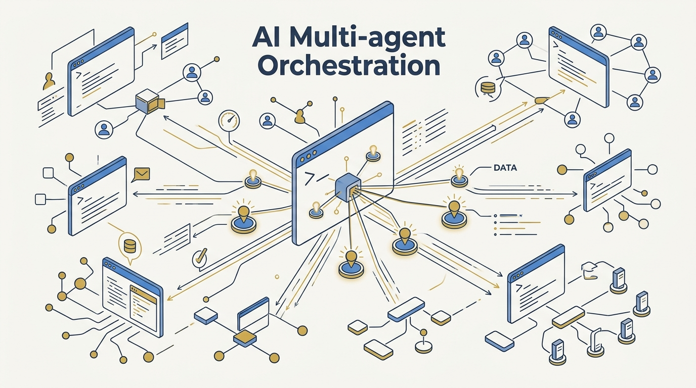
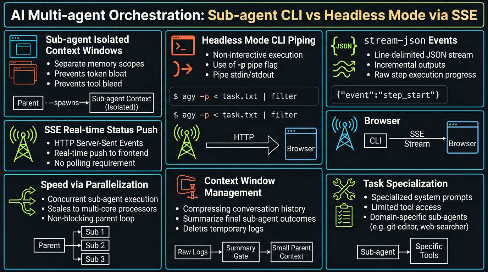
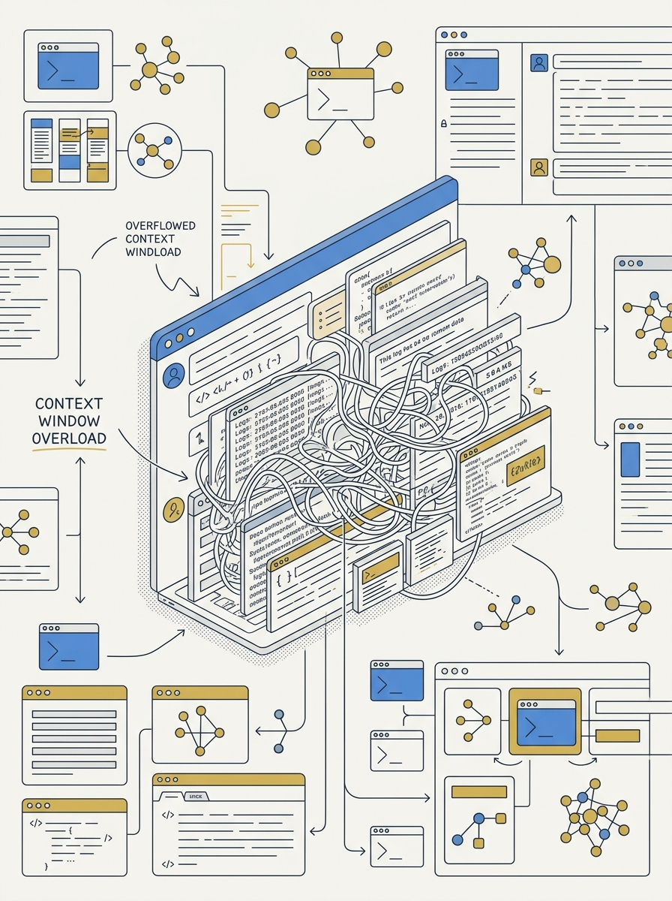
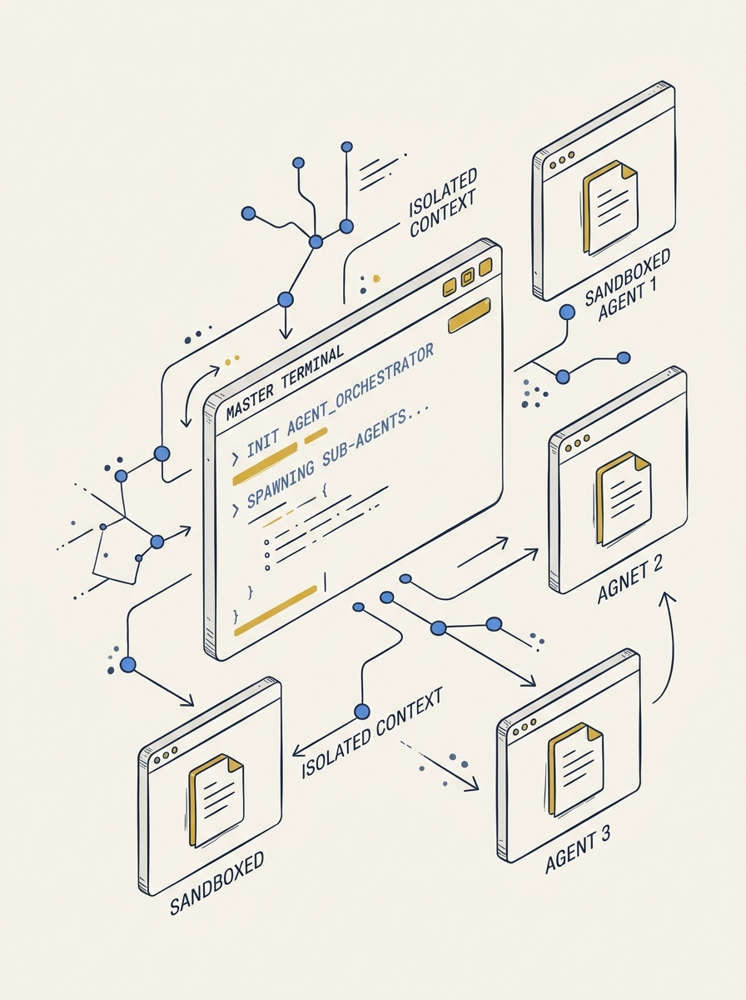

<!-- _class: title -->

# AI Multi-agent Orchestration: Sub-agent CLI กับ Headless Mode ผ่าน SSE

Two orchestration patterns: isolated sub-agent context windows, and cross-CLI headless piping over SSE

<!-- Speaker: Frame the two patterns up front — sub-agent (single CLI, internal delegation) vs headless mode (cross-CLI, external piping via stdin/stdout + SSE). -->

---

<!-- _class: cheatsheet -->
<!-- _backgroundColor: #f8f7f4 -->

<!-- Speaker: Orient the audience to the 7 panels before diving into any one of them. -->

---

## Two Patterns, One Goal: Faster Agents, Cleaner Context

Sub-agent กระจายงานภายในเซสชันเดียว ส่วน Headless Mode ต่อข้าม CLI ผ่าน stdin/stdout และ SSE

<svg viewBox="0 0 1100 380" width="100%" xmlns="http://www.w3.org/2000/svg">
  <rect x="60" y="40" width="980" height="300" rx="16" fill="var(--paper)" stroke="var(--soft-2)" stroke-width="1.5" style="filter:drop-shadow(0 4px 12px rgba(15,23,42,.08))"/>
  <rect x="60" y="40" width="8" height="300" rx="4" fill="var(--accent)"/>
  <circle cx="148" cy="190" r="40" fill="var(--accent)" opacity=".12"/>
  <circle cx="148" cy="190" r="28" fill="var(--accent)"/>
  <text x="148" y="196" font-size="18" fill="var(--paper)" text-anchor="middle" dominant-baseline="central" font-family="system-ui" font-weight="700">2</text>
  <text x="220" y="150" font-size="20" font-weight="700" fill="var(--ink)" font-family="system-ui">Two orchestration patterns</text>
  <text x="220" y="185" font-size="15" fill="var(--ink-dim)" font-family="system-ui">Sub-agent: distribute work inside one CLI session</text>
  <text x="220" y="215" font-size="15" fill="var(--ink-dim)" font-family="system-ui">Headless mode: pipe across multiple CLIs via stdin/stdout</text>
  <text x="220" y="245" font-size="15" fill="var(--muted)" font-family="system-ui">SSE streams live status to a frontend</text>
</svg>

<b>★ Takeaway:</b> ทั้งสองแบบช่วยแยก context และเพิ่มความเร็วด้วยการทำงานแบบขนาน

<!-- Speaker: Set up the two-pattern framing that the rest of the deck follows. -->

---

## Background: Context Window ล้นเมื่อ Agent ทำทุกอย่างเอง

งานที่มีผลลัพธ์เยอะ (log, ผลค้นเอกสาร) ทำให้ context หลักเต็มเร็วและ agent เริ่มหลงประเด็น

<svg viewBox="0 0 700 320" width="100%" xmlns="http://www.w3.org/2000/svg">
  <rect x="40" y="30" width="620" height="80" rx="10" fill="var(--danger-wash)" stroke="var(--danger)" stroke-width="1.5"/>
  <text x="60" y="65" font-size="15" font-weight="700" fill="var(--danger-ink)" font-family="system-ui">One agent, one context</text>
  <text x="60" y="90" font-size="13" fill="var(--danger-ink)" font-family="system-ui">Logs + search results + files pile up together</text>
  <line x1="350" y1="120" x2="350" y2="160" stroke="var(--muted)" stroke-width="2"/>
  <polygon points="342,155 358,155 350,168" fill="var(--muted)"/>
  <rect x="40" y="180" width="620" height="110" rx="10" fill="var(--soft)" stroke="var(--soft-2)" stroke-width="1.5"/>
  <text x="60" y="215" font-size="15" font-weight="700" fill="var(--ink)" font-family="system-ui">Result</text>
  <text x="60" y="240" font-size="13" fill="var(--ink-dim)" font-family="system-ui">Context fills up fast — agent loses focus</text>
  <text x="60" y="262" font-size="13" fill="var(--ink-dim)" font-family="system-ui">Cross-CLI orchestration needs a standard channel too</text>
</svg>

<b>★ Takeaway:</b> การแยกงานออกไปทำในพื้นที่ (context) ของตัวเองคือทางแก้สถาปัตยกรรม ไม่ใช่แค่ฟีเจอร์เสริม

<!-- Speaker: This is the "why" slide — the problem both patterns solve. -->

---

## Sub-agent: Fresh Context Window per Task

Subagent เริ่มต้นด้วย context ใหม่ทั้งหมด ไม่สืบทอดประวัติสนทนาจาก parent

<svg viewBox="0 0 700 320" width="100%" xmlns="http://www.w3.org/2000/svg">
  <rect x="30" y="140" width="140" height="60" rx="8" fill="var(--accent)" opacity=".12" stroke="var(--accent)" stroke-width="1.5"/>
  <text x="100" y="175" font-size="13" font-weight="700" fill="var(--accent-deep)" text-anchor="middle" font-family="system-ui">Orchestrator</text>
  <line x1="170" y1="170" x2="260" y2="90" stroke="var(--muted)" stroke-width="1.5"/>
  <line x1="170" y1="170" x2="260" y2="170" stroke="var(--muted)" stroke-width="1.5"/>
  <line x1="170" y1="170" x2="260" y2="250" stroke="var(--muted)" stroke-width="1.5"/>
  <rect x="260" y="60" width="150" height="60" rx="8" fill="var(--paper)" stroke="var(--soft-2)" stroke-width="1.5"/>
  <text x="335" y="95" font-size="12" fill="var(--ink)" text-anchor="middle" font-family="system-ui">subagent A (fresh)</text>
  <rect x="260" y="140" width="150" height="60" rx="8" fill="var(--paper)" stroke="var(--soft-2)" stroke-width="1.5"/>
  <text x="335" y="175" font-size="12" fill="var(--ink)" text-anchor="middle" font-family="system-ui">subagent B (fresh)</text>
  <rect x="260" y="220" width="150" height="60" rx="8" fill="var(--paper)" stroke="var(--soft-2)" stroke-width="1.5"/>
  <text x="335" y="255" font-size="12" fill="var(--ink)" text-anchor="middle" font-family="system-ui">subagent C (fresh)</text>
  <line x1="410" y1="90" x2="480" y2="170" stroke="var(--gold)" stroke-width="1.5" stroke-dasharray="4 3"/>
  <line x1="410" y1="170" x2="480" y2="170" stroke="var(--gold)" stroke-width="1.5" stroke-dasharray="4 3"/>
  <line x1="410" y1="250" x2="480" y2="170" stroke="var(--gold)" stroke-width="1.5" stroke-dasharray="4 3"/>
  <text x="490" y="175" font-size="11" fill="var(--muted)" font-family="system-ui">summary only</text>
</svg>

<b>★ Takeaway:</b> ต้องใส่ path/error/context ที่จำเป็นลง prompt ตอนเรียก subagent เพราะมันมองไม่เห็นบทสนทนาก่อนหน้า

<!-- Speaker: The dashed lines are the only channel back — summary, not raw context. -->

---

## Headless Mode: Pipe One CLI's stdout into Another's stdin

`-p` flag รันแบบ non-interactive; stdout ของ CLI หนึ่งกลายเป็น stdin ของอีกตัวได้ตรงๆ

<svg viewBox="0 0 1100 380" width="100%" xmlns="http://www.w3.org/2000/svg">
  <rect x="40" y="140" width="260" height="100" rx="10" fill="var(--paper)" stroke="var(--accent)" stroke-width="2"/>
  <text x="170" y="180" font-size="15" font-weight="700" fill="var(--accent-deep)" text-anchor="middle" font-family="system-ui">claude -p</text>
  <text x="170" y="205" font-size="12" fill="var(--ink-dim)" text-anchor="middle" font-family="system-ui">headless CLI #1</text>
  <line x1="300" y1="190" x2="420" y2="190" stroke="var(--gold)" stroke-width="2.5"/>
  <polygon points="410,182 430,190 410,198" fill="var(--gold)"/>
  <text x="360" y="170" font-size="11" fill="var(--muted)" text-anchor="middle" font-family="system-ui">stdout</text>
  <rect x="430" y="140" width="240" height="100" rx="10" fill="var(--soft)" stroke="var(--soft-2)" stroke-width="1.5"/>
  <text x="550" y="185" font-size="13" font-weight="700" fill="var(--ink)" text-anchor="middle" font-family="system-ui">stream-json</text>
  <text x="550" y="208" font-size="11" fill="var(--ink-dim)" text-anchor="middle" font-family="system-ui">newline-delimited events</text>
  <line x1="670" y1="190" x2="790" y2="190" stroke="var(--gold)" stroke-width="2.5"/>
  <polygon points="780,182 800,190 780,198" fill="var(--gold)"/>
  <text x="730" y="170" font-size="11" fill="var(--muted)" text-anchor="middle" font-family="system-ui">stdin</text>
  <rect x="800" y="140" width="260" height="100" rx="10" fill="var(--paper)" stroke="var(--accent)" stroke-width="2"/>
  <text x="930" y="180" font-size="15" font-weight="700" fill="var(--accent-deep)" text-anchor="middle" font-family="system-ui">codex exec</text>
  <text x="930" y="205" font-size="12" fill="var(--ink-dim)" text-anchor="middle" font-family="system-ui">headless CLI #2</text>
</svg>

<b>★ Takeaway:</b> output format ต้องระบุชัด — `text` เปล่าอาจพา metadata ปนเข้าไปถ้าไม่ตั้ง `--output-format`

<!-- Speaker: This is the cross-CLI orchestration primitive — no chat window required. -->

---

## Three Output Formats, One CLI Flag

`--output-format` เลือกได้ 3 แบบ ขึ้นกับว่าใครเป็นผู้บริโภคผลลัพธ์

  

    
Default

    <h3>text</h3>
    
Plain words — for a human reading the terminal directly.

  

  

    
Structured

    <h3>json</h3>
    
Single JSON object with result + session_id — for scripts and CI.

  

  

    
Incremental

    <h3>stream-json</h3>
    
Newline-delimited events as they happen — for SSE and live UIs.

  

<b>★ Takeaway:</b> `stream-json` คือ format ที่ทำให้ระบบภายนอก track สถานะ agent แบบ real-time ได้

<!-- Speaker: Pick the format based on the consumer, not out of habit. -->

---

## SSE: Push Live Status to the Browser, One-Way

Server ฟัง stream-json แล้ว push event ผ่าน SSE ไปหา client โดยไม่ต้อง poll

<svg viewBox="0 0 1100 380" width="100%" xmlns="http://www.w3.org/2000/svg">
  <rect x="60" y="150" width="260" height="90" rx="10" fill="var(--paper)" stroke="var(--soft-2)" stroke-width="1.5"/>
  <text x="190" y="188" font-size="13" font-weight="700" fill="var(--ink)" text-anchor="middle" font-family="system-ui">headless CLI</text>
  <text x="190" y="210" font-size="11" fill="var(--ink-dim)" text-anchor="middle" font-family="system-ui">emits stream-json</text>
  <line x1="320" y1="195" x2="420" y2="195" stroke="var(--muted)" stroke-width="2"/>
  <polygon points="410,187 430,195 410,203" fill="var(--muted)"/>
  <rect x="430" y="150" width="220" height="90" rx="10" fill="var(--accent)" opacity=".1" stroke="var(--accent)" stroke-width="2"/>
  <text x="540" y="188" font-size="13" font-weight="700" fill="var(--accent-deep)" text-anchor="middle" font-family="system-ui">server</text>
  <text x="540" y="210" font-size="11" fill="var(--ink-dim)" text-anchor="middle" font-family="system-ui">parses + patches SSE</text>
  <line x1="650" y1="195" x2="770" y2="195" stroke="var(--gold)" stroke-width="2.5"/>
  <polygon points="760,187 780,195 760,203" fill="var(--gold)"/>
  <text x="710" y="170" font-size="11" fill="var(--muted)" text-anchor="middle" font-family="system-ui">SSE</text>
  <rect x="780" y="150" width="260" height="90" rx="10" fill="var(--paper)" stroke="var(--soft-2)" stroke-width="1.5"/>
  <text x="910" y="188" font-size="13" font-weight="700" fill="var(--ink)" text-anchor="middle" font-family="system-ui">frontend client</text>
  <text x="910" y="210" font-size="11" fill="var(--ink-dim)" text-anchor="middle" font-family="system-ui">EventSource — no polling</text>
  <text x="550" y="290" font-size="12" fill="var(--muted)" text-anchor="middle" font-family="system-ui">"thinking" -&gt; "agent spawned" -&gt; "results synthesized"</text>
</svg>

<b>★ Takeaway:</b> SSE เป็นทางเดียว (server→client) — ต้องการช่องทางแยกถ้าอยาก steer agent กลับ

<!-- Speaker: Contrast with WebSocket — SSE is simpler because the client only ever watches. -->

---

## Three Reasons This Is Faster and Cleaner

ประโยชน์หลักของการแยก context และ orchestrate ข้าม CLI

  

    
Speed

    <h3>Parallelization</h3>
    
Independent subtasks run concurrently — total time = slowest agent, not the sum.

  

  

    
Memory

    <h3>Context window management</h3>
    
Verbose work stays in the subagent — orchestrator never hits its token limit.

  

  

    
Accuracy

    <h3>Task specialization</h3>
    
Narrow system prompt + restricted tools per agent — safer, more precise output.

  

<b>★ Takeaway:</b> แยกงานตามความเชี่ยวชาญ ไม่ใช่ยัดทุกความสามารถไว้ใน agent เดียว

<!-- Speaker: Tie all three benefits back to the isolation principle from slide 3. -->

---

## User Guide: Five Steps from Sub-agent to SSE

ลำดับการทดลองจริง ตั้งแต่ subagent เดี่ยวไปจนถึง orchestration เต็มรูปแบบ

<svg viewBox="0 0 1100 300" width="100%" xmlns="http://www.w3.org/2000/svg">
  <g font-family="system-ui">
    <circle cx="90" cy="150" r="34" fill="var(--accent)"/>
    <text x="90" y="157" font-size="16" fill="var(--paper)" text-anchor="middle" font-weight="700">1</text>
    <text x="90" y="205" font-size="12" fill="var(--ink)" text-anchor="middle">Sub-agent</text>
    <line x1="124" y1="150" x2="266" y2="150" stroke="var(--muted)" stroke-width="2"/>
    <polygon points="256,143 274,150 256,157" fill="var(--muted)"/>
    <circle cx="300" cy="150" r="34" fill="var(--accent)"/>
    <text x="300" y="157" font-size="16" fill="var(--paper)" text-anchor="middle" font-weight="700">2</text>
    <text x="300" y="205" font-size="12" fill="var(--ink)" text-anchor="middle">headless -p</text>
    <line x1="334" y1="150" x2="476" y2="150" stroke="var(--muted)" stroke-width="2"/>
    <polygon points="466,143 484,150 466,157" fill="var(--muted)"/>
    <circle cx="510" cy="150" r="34" fill="var(--accent)"/>
    <text x="510" y="157" font-size="16" fill="var(--paper)" text-anchor="middle" font-weight="700">3</text>
    <text x="510" y="205" font-size="12" fill="var(--ink)" text-anchor="middle">pipe stdin/stdout</text>
    <line x1="544" y1="150" x2="686" y2="150" stroke="var(--muted)" stroke-width="2"/>
    <polygon points="676,143 694,150 676,157" fill="var(--muted)"/>
    <circle cx="720" cy="150" r="34" fill="var(--accent)"/>
    <text x="720" y="157" font-size="16" fill="var(--paper)" text-anchor="middle" font-weight="700">4</text>
    <text x="720" y="205" font-size="12" fill="var(--ink)" text-anchor="middle">stream-json</text>
    <line x1="754" y1="150" x2="896" y2="150" stroke="var(--muted)" stroke-width="2"/>
    <polygon points="886,143 904,150 886,157" fill="var(--muted)"/>
    <circle cx="930" cy="150" r="34" fill="var(--gold)"/>
    <text x="930" y="157" font-size="16" fill="var(--paper)" text-anchor="middle" font-weight="700">5</text>
    <text x="930" y="205" font-size="12" fill="var(--ink)" text-anchor="middle">SSE to frontend</text>
  </g>
</svg>

<b>★ Takeaway:</b> เริ่มจาก subagent เดี่ยวก่อน แล้วค่อยขยับไป cross-CLI piping เมื่อจำเป็นจริง

<!-- Speaker: Walk left to right — each step builds on the previous, don't skip to 5. -->

---

## Troubleshooting: Three Failure Modes

ปัญหาที่พบบ่อยเมื่อต่อ CLI ข้ามตัวและ stream สถานะผ่าน SSE

  

    
Pipe fails

    <h3>No stdin support</h3>
    
ไม่ใช่ทุก CLI รองรับ non-interactive input เหมือนกัน — เช็ค flag ก่อนต่อ pipe

  

  

    
Connection drops

    <h3>SSE timeout</h3>
    
เพิ่ม heartbeat event กันบาง proxy ตัด idle connection ที่นานเกินไป

  

  

    
Wrong output

    <h3>Subagent missing context</h3>
    
ใส่ path/error/decision ที่จำเป็นลง prompt ตอนเรียกจริง เพราะไม่สืบทอด conversation

  

<b>★ Takeaway:</b> ปัญหาส่วนใหญ่มาจากสมมติฐานผิดว่าทุก CLI/agent มีบริบทหรือ interface เหมือนกัน

<!-- Speaker: These are the three questions to ask first when orchestration breaks. -->

---

## Caveats and Limits

ข้อจำกัดที่ต้องรู้ก่อนเอาไปใช้จริง

  

    
Cost

    <h3>Not a "lighter" mode</h3>
    
Headless ตัด UI ออก แต่ agent loop เต็มรูปแบบยังทำงาน — token usage เท่าเดิม

  

  

    
Direction

    <h3>SSE is one-way</h3>
    
Server→client เท่านั้น — steer agent กลับต้องมีช่องทางแยก เช่น POST endpoint

  

  

    
Format match

    <h3>stdout ↔ stdin</h3>
    
ต้องระบุ `--output-format` ให้ตรงกับสิ่งที่ปลายทางรับได้ ไม่งั้น metadata ปนเข้าไป

  

  

    
Fresh start

    <h3>Subagent forgets</h3>
    
ไม่สืบทอด context เดิม — ลืมใส่ข้อมูลจำเป็นลง prompt = ทำงานผิดทิศทาง

  

<b>★ Takeaway:</b> ประเมินก่อนใช้จริง: token cost, ทิศทางการสื่อสาร, format matching, และ context inheritance

<!-- Speaker: Close on realism — this is a pattern with real tradeoffs, not a silver bullet. -->

---

## Key Takeaways

สรุปสิ่งที่ต้องจำแม้จะข้ามเนื้อหาส่วนอื่นไปทั้งหมด

<svg viewBox="0 0 1100 340" width="100%" xmlns="http://www.w3.org/2000/svg">
  <circle cx="550" cy="170" r="160" fill="none" stroke="var(--soft-2)" stroke-width="1.5"/>
  <circle cx="550" cy="170" r="110" fill="none" stroke="var(--accent)" stroke-width="1.5" opacity=".4"/>
  <circle cx="550" cy="170" r="60" fill="var(--accent)" opacity=".1"/>
  <circle cx="550" cy="170" r="60" fill="none" stroke="var(--accent)" stroke-width="2"/>
  <text x="550" y="164" font-size="15" font-weight="700" fill="var(--accent)" text-anchor="middle" font-family="system-ui">isolate</text>
  <text x="550" y="184" font-size="13" fill="var(--ink)" text-anchor="middle" font-family="system-ui">context</text>
  <text x="380" y="100" font-size="13" fill="var(--ink)" font-family="system-ui" text-anchor="middle">Sub-agent</text>
  <text x="380" y="120" font-size="12" fill="var(--muted)" font-family="system-ui" text-anchor="middle">fresh window</text>
  <text x="730" y="100" font-size="13" fill="var(--ink)" font-family="system-ui" text-anchor="middle">Headless</text>
  <text x="730" y="120" font-size="12" fill="var(--muted)" font-family="system-ui" text-anchor="middle">-p + stdin/stdout</text>
  <text x="220" y="170" font-size="13" fill="var(--muted)" font-family="system-ui" text-anchor="middle">stream-json</text>
  <text x="220" y="190" font-size="13" fill="var(--muted)" font-family="system-ui" text-anchor="middle">incremental</text>
  <text x="880" y="170" font-size="13" fill="var(--muted)" font-family="system-ui" text-anchor="middle">SSE</text>
  <text x="880" y="190" font-size="13" fill="var(--muted)" font-family="system-ui" text-anchor="middle">one-way push</text>
</svg>

<b>★ Takeaway:</b> Parallelization + context isolation + task specialization = agent orchestration ที่เร็วขึ้นและแม่นยำขึ้น

<!-- Speaker: End here — this is the one slide worth screenshotting. -->
