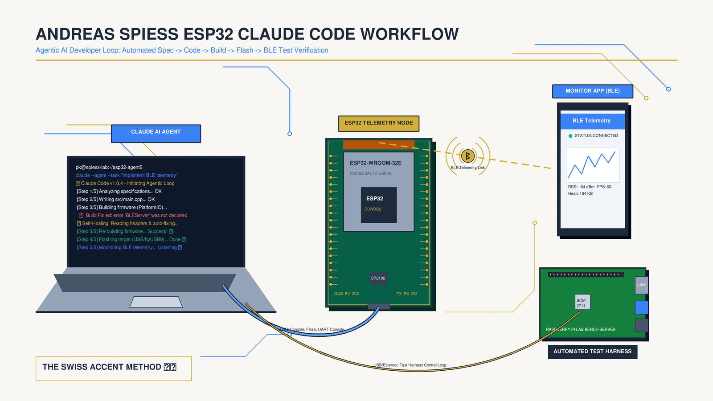
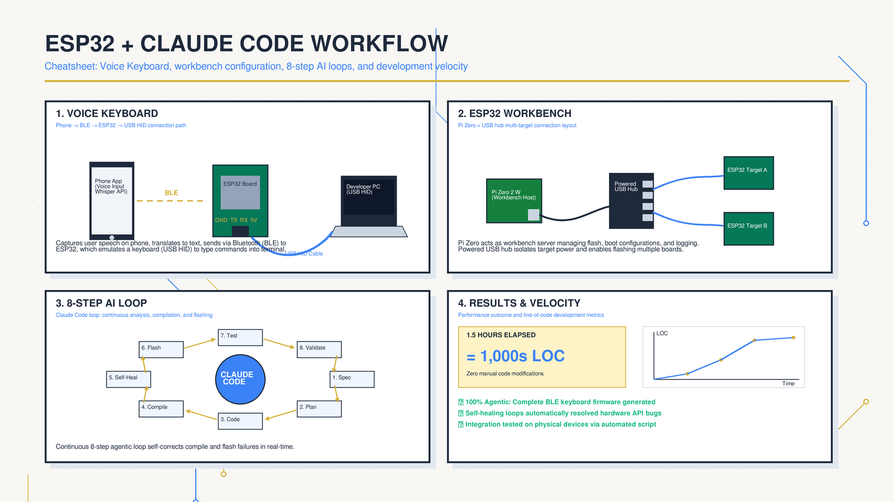

<!-- _class: title -->

# Andreas Spiess + Claude Code + ESP32

iOS Voice Keyboard & Automated Workbench — Idea สู่ Firmware ใน 1.5 ชั่วโมง

<!-- Speaker: Andreas Spiess แสดง 2 โปรเจกต์ใน video เดียว: Voice Keyboard (ESP32 เป็น USB HID) + ESP32 Workbench (Pi Zero ควบคุม AI agent). ทั้งคู่คือผลจาก workflow เดียวกัน -->

---

<!-- _class: cheatsheet -->
<!-- _backgroundColor: #f8f7f4 -->

<!-- Speaker: ภาพรวมทุก concept ใน deck นี้ — Voice Keyboard flow, Workbench setup, 8-Step loop, และผลลัพธ์ 1.5h -->

---

## TL;DR: จาก Voice สู่ Firmware อัตโนมัติ

ESP32 + Claude Code + Pi Zero = pipeline พัฒนา embedded ที่ AI ควบคุมทุก step

<svg viewBox="0 0 1100 320" width="100%" xmlns="http://www.w3.org/2000/svg">
  <!-- callout-box: 3 key pillars -->
  <rect x="40" y="30" width="320" height="260" rx="14" fill="var(--paper)" stroke="var(--accent)" stroke-width="2" style="filter:drop-shadow(0 4px 12px rgba(15,23,42,.08))"/>
  <rect x="40" y="30" width="320" height="52" rx="14" fill="var(--accent)" opacity=".12"/>
  <rect x="40" y="30" width="8" height="260" rx="4" fill="var(--accent)"/>
  <text x="200" y="64" font-size="16" font-weight="700" fill="var(--accent)" text-anchor="middle" font-family="system-ui">Voice Keyboard</text>
  <text x="200" y="110" font-size="13" fill="var(--ink)" text-anchor="middle" font-family="system-ui">Phone</text>
  <text x="200" y="130" font-size="12" fill="var(--ink-dim)" text-anchor="middle" font-family="system-ui">BLE</text>
  <text x="200" y="155" font-size="13" fill="var(--ink)" text-anchor="middle" font-family="system-ui">ESP32</text>
  <text x="200" y="175" font-size="12" fill="var(--ink-dim)" text-anchor="middle" font-family="system-ui">USB HID</text>
  <text x="200" y="200" font-size="13" fill="var(--ink)" text-anchor="middle" font-family="system-ui">PC / Mac / Linux</text>
  <text x="200" y="240" font-size="11" fill="var(--muted)" text-anchor="middle" font-family="system-ui">No driver. Any language.</text>

  <rect x="390" y="30" width="320" height="260" rx="14" fill="var(--paper)" stroke="var(--gold)" stroke-width="2" style="filter:drop-shadow(0 4px 12px rgba(15,23,42,.08))"/>
  <rect x="390" y="30" width="320" height="52" rx="14" fill="var(--gold)" opacity=".10"/>
  <rect x="390" y="30" width="8" height="260" rx="4" fill="var(--gold)"/>
  <text x="550" y="64" font-size="16" font-weight="700" fill="var(--gold)" text-anchor="middle" font-family="system-ui">ESP32 Workbench</text>
  <text x="550" y="110" font-size="13" fill="var(--ink)" text-anchor="middle" font-family="system-ui">Pi Zero 2W</text>
  <text x="550" y="135" font-size="12" fill="var(--ink-dim)" text-anchor="middle" font-family="system-ui">Flash + Monitor + Test</text>
  <text x="550" y="165" font-size="13" fill="var(--ink)" text-anchor="middle" font-family="system-ui">Wi-Fi AP Toggle</text>
  <text x="550" y="190" font-size="12" fill="var(--ink-dim)" text-anchor="middle" font-family="system-ui">MQTT Broker Toggle</text>
  <text x="550" y="240" font-size="11" fill="var(--muted)" text-anchor="middle" font-family="system-ui">AI-controlled hardware lab</text>

  <rect x="740" y="30" width="320" height="260" rx="14" fill="var(--paper)" stroke="var(--success)" stroke-width="2" style="filter:drop-shadow(0 4px 12px rgba(15,23,42,.08))"/>
  <rect x="740" y="30" width="320" height="52" rx="14" fill="var(--success)" opacity=".10"/>
  <rect x="740" y="30" width="8" height="260" rx="4" fill="var(--success)"/>
  <text x="900" y="64" font-size="16" font-weight="700" fill="var(--success)" text-anchor="middle" font-family="system-ui">8-Step AI Loop</text>
  <text x="900" y="110" font-size="13" fill="var(--ink)" text-anchor="middle" font-family="system-ui">Idea + FSD + Plan</text>
  <text x="900" y="135" font-size="12" fill="var(--ink-dim)" text-anchor="middle" font-family="system-ui">Code + Compile</text>
  <text x="900" y="160" font-size="13" fill="var(--ink)" text-anchor="middle" font-family="system-ui">Flash + Test</text>
  <text x="900" y="185" font-size="12" fill="var(--ink-dim)" text-anchor="middle" font-family="system-ui">Fix + Enhance</text>
  <text x="900" y="240" font-size="11" fill="var(--muted)" text-anchor="middle" font-family="system-ui">1.5h → 1000s lines firmware</text>
</svg>

<b>★ Takeaway:</b> สามองค์ประกอบนี้ทำงานร่วมกัน — Workbench ให้ AI สั่ง hardware โดยตรง, FSD ให้ AI มี spec ที่ชัด, 8-Step loop ให้ทุกอย่างทำซ้ำได้

<!-- Speaker: 3 pillars: Voice Keyboard = use case, Workbench = infra, 8-Step = the repeatable workflow -->

---

## Background: ทำไมต้องทำสิ่งนี้?

ปัญหาจริง 2 ข้อที่ผลักดันให้เกิดระบบนี้

  

    
Problem 1 — Serial Port

    <h3>VM มี Serial Controller เดียว</h3>
    
Proxmox ใช้ Zigbee dongle ไปแล้ว ทำให้โปรแกรม ESP32 ตรงไม่ได้ ต้องหา workaround

  

  

    
Problem 2 — Realistic Testing

    <h3>ทดสอบ Failure ไม่ได้</h3>
    
ปิด home Wi-Fi หรือ MQTT production ระหว่างทดสอบไม่ได้ ต้องจำลอง environment ต่างหาก

  

<b>★ Takeaway:</b> ESP32 Workbench เกิดขึ้นเพราะ constraint จริง ไม่ใช่ over-engineering — ปัญหา infra บังคับให้สร้าง lab ที่ AI ควบคุมได้

<!-- Speaker: Context คือสำคัญ — 2 constraint นี้บังคับให้ออกแบบ Workbench. ถ้า computer มี serial port + ไม่ต้องทดสอบ failure scenarios เชื่อมตรงได้เลย -->

---

## iOS Voice Keyboard: ใช้ Phone เป็น Brain

Architecture ง่ายมาก — smartphone รู้จำเสียง, ESP32 แค่ relay ไป USB

<svg viewBox="0 0 1100 320" width="100%" xmlns="http://www.w3.org/2000/svg">
  <!-- arrow-flow: 5-step horizontal pipeline -->
  <!-- Step 1: Phone -->
  <rect x="30" y="90" width="170" height="140" rx="12" fill="var(--paper)" stroke="var(--accent)" stroke-width="2" style="filter:drop-shadow(var(--shadow-md))"/>
  <rect x="30" y="90" width="170" height="40" rx="12" fill="var(--accent)" opacity=".12"/>
  <text x="115" y="117" font-size="13" font-weight="700" fill="var(--accent)" text-anchor="middle" font-family="system-ui">Smartphone</text>
  <text x="115" y="152" font-size="12" fill="var(--ink)" text-anchor="middle" font-family="system-ui">iOS / Android</text>
  <text x="115" y="172" font-size="11" fill="var(--ink-dim)" text-anchor="middle" font-family="system-ui">Speech-to-Text</text>
  <text x="115" y="192" font-size="11" fill="var(--muted)" text-anchor="middle" font-family="system-ui">Native OS API</text>
  <!-- Arrow 1 -->
  <line x1="200" y1="160" x2="242" y2="160" stroke="var(--accent)" stroke-width="2.5" stroke-dasharray="4,2"/>
  <polygon points="242,153 255,160 242,167" fill="var(--accent)"/>
  <text x="228" y="148" font-size="10" fill="var(--accent)" text-anchor="middle" font-family="system-ui">BLE</text>
  <!-- Step 2: ESP32 -->
  <rect x="255" y="90" width="170" height="140" rx="12" fill="var(--paper)" stroke="var(--gold)" stroke-width="2" style="filter:drop-shadow(var(--shadow-md))"/>
  <rect x="255" y="90" width="170" height="40" rx="12" fill="var(--gold)" opacity=".12"/>
  <text x="340" y="117" font-size="13" font-weight="700" fill="var(--gold)" text-anchor="middle" font-family="system-ui">ESP32-S2/S3</text>
  <text x="340" y="152" font-size="12" fill="var(--ink)" text-anchor="middle" font-family="system-ui">BLE Server</text>
  <text x="340" y="172" font-size="11" fill="var(--ink-dim)" text-anchor="middle" font-family="system-ui">USB HID Device</text>
  <text x="340" y="192" font-size="11" fill="var(--muted)" text-anchor="middle" font-family="system-ui">Firmware (ESP-IDF)</text>
  <!-- Arrow 2 -->
  <line x1="425" y1="160" x2="467" y2="160" stroke="var(--gold)" stroke-width="2.5"/>
  <polygon points="467,153 480,160 467,167" fill="var(--gold)"/>
  <text x="453" y="148" font-size="10" fill="var(--gold)" text-anchor="middle" font-family="system-ui">USB</text>
  <!-- Step 3: PC -->
  <rect x="480" y="90" width="170" height="140" rx="12" fill="var(--paper)" stroke="var(--success)" stroke-width="2" style="filter:drop-shadow(var(--shadow-md))"/>
  <rect x="480" y="90" width="170" height="40" rx="12" fill="var(--success)" opacity=".10"/>
  <text x="565" y="117" font-size="13" font-weight="700" fill="var(--success)" text-anchor="middle" font-family="system-ui">PC / Mac</text>
  <text x="565" y="152" font-size="12" fill="var(--ink)" text-anchor="middle" font-family="system-ui">USB HID Keyboard</text>
  <text x="565" y="172" font-size="11" fill="var(--ink-dim)" text-anchor="middle" font-family="system-ui">Any Application</text>
  <text x="565" y="192" font-size="11" fill="var(--muted)" text-anchor="middle" font-family="system-ui">No driver needed</text>
  <!-- Benefits box -->
  <rect x="720" y="70" width="350" height="180" rx="12" fill="var(--soft)" stroke="var(--soft-2)" stroke-width="1.5"/>
  <text x="895" y="102" font-size="14" font-weight="700" fill="var(--ink)" text-anchor="middle" font-family="system-ui">Key Advantages</text>
  <text x="895" y="132" font-size="12" fill="var(--ink)" text-anchor="middle" font-family="system-ui">Multi-language (EN, DE, TH...)</text>
  <text x="895" y="158" font-size="12" fill="var(--ink-dim)" text-anchor="middle" font-family="system-ui">Works with any app</text>
  <text x="895" y="182" font-size="12" fill="var(--ink-dim)" text-anchor="middle" font-family="system-ui">Phone = STT processor</text>
  <text x="895" y="208" font-size="12" fill="var(--muted)" text-anchor="middle" font-family="system-ui">ESP32 = simple relay</text>
  <rect x="720" y="280" width="1" height="1" fill="none"/>
</svg>

<b>★ Takeaway:</b> Separation of concerns — Phone ทำ heavy lifting (STT), ESP32 ทำแค่ relay ข้อความ → USB HID ออกมา; ความซับซ้อนอยู่ที่ firmware BLE stack + HID descriptor

<!-- Speaker: ทำไม ESP32 ไม่ทำ STT เอง? เพราะ phone มี neural engine ดีกว่ามาก. ESP32 เป็นแค่ "USB keyboard adapter". -->

---

## ESP32 Workbench: Pi Zero เป็น AI-Controlled Lab

Raspberry Pi Zero 2W + USB hub = test environment ที่ AI สั่งได้ทุกอย่าง

| Capability | รายละเอียด |
|---|---|
| Connect ESP32 via USB | หลาย board พร้อมกัน |
| Expose serial ports | ส่งต่อไปยัง VM ผ่าน Ethernet |
| Create Wi-Fi AP | จำลอง network isolated |
| Captive portal control | ป้อนข้อมูลอัตโนมัติ |
| Toggle Wi-Fi / MQTT | ทดสอบ failure scenarios |
| Monitor serial output | ดู log แบบ real-time |

  
Key Differentiator

  <h3>AI-Controlled by Design</h3>
  
Python programs ใน Pi ออกแบบมาให้ Claude สั่งได้ผ่าน shell commands

  
Claude สั่ง: flash → monitor → test → fix code → ทำซ้ำ ทั้งหมดในลูปเดียวไม่ต้อง developer แตะ hardware

<b>★ Takeaway:</b> AI agent ควบคุม Workbench โดยตรง — flash, read log, run test, fix code ทั้งหมดในลูปเดียว ไม่ต้อง developer แตะ hardware เลย

<!-- Speaker: ความต่างคือ "designed for AI control" — Python programs ใน Pi ออกแบบมาให้ Claude สั่งได้ผ่าน shell commands. นี่คือ hardware abstraction layer สำหรับ AI -->

---

## 8-Step Workflow (ตอนที่ 1): Spec → Plan

4 steps แรก — วางรากฐาน spec ก่อน code บรรทัดแรก

<svg viewBox="0 0 1100 320" width="100%" xmlns="http://www.w3.org/2000/svg">
  <!-- 4 numbered steps with arrows -->
  <!-- Step 1 -->
  <circle cx="100" cy="100" r="32" fill="var(--accent)" opacity=".15"/>
  <circle cx="100" cy="100" r="32" fill="none" stroke="var(--accent)" stroke-width="2"/>
  <text x="100" y="107" font-size="22" font-weight="700" fill="var(--accent)" text-anchor="middle" font-family="system-ui">1</text>
  <rect x="30" y="148" width="140" height="120" rx="10" fill="var(--paper)" stroke="var(--soft-2)" stroke-width="1.5" style="filter:drop-shadow(var(--shadow-sm))"/>
  <text x="100" y="175" font-size="13" font-weight="700" fill="var(--ink)" text-anchor="middle" font-family="system-ui">GitHub Repo</text>
  <text x="100" y="198" font-size="11" fill="var(--ink-dim)" text-anchor="middle" font-family="system-ui">Create immediately</text>
  <text x="100" y="218" font-size="11" fill="var(--muted)" text-anchor="middle" font-family="system-ui">Commit regularly</text>
  <text x="100" y="238" font-size="11" fill="var(--muted)" text-anchor="middle" font-family="system-ui">Rollback safety net</text>
  <!-- Arrow -->
  <line x1="172" y1="100" x2="228" y2="100" stroke="var(--muted)" stroke-width="2"/>
  <polygon points="226,93 242,100 226,107" fill="var(--muted)"/>
  <!-- Step 2 -->
  <circle cx="310" cy="100" r="32" fill="var(--accent)" opacity=".15"/>
  <circle cx="310" cy="100" r="32" fill="none" stroke="var(--accent)" stroke-width="2"/>
  <text x="310" y="107" font-size="22" font-weight="700" fill="var(--accent)" text-anchor="middle" font-family="system-ui">2</text>
  <rect x="240" y="148" width="140" height="120" rx="10" fill="var(--paper)" stroke="var(--soft-2)" stroke-width="1.5" style="filter:drop-shadow(var(--shadow-sm))"/>
  <text x="310" y="175" font-size="13" font-weight="700" fill="var(--ink)" text-anchor="middle" font-family="system-ui">Idea Document</text>
  <text x="310" y="198" font-size="11" fill="var(--ink-dim)" text-anchor="middle" font-family="system-ui">Markdown format</text>
  <text x="310" y="218" font-size="11" fill="var(--muted)" text-anchor="middle" font-family="system-ui">What, not How</text>
  <text x="310" y="238" font-size="11" fill="var(--muted)" text-anchor="middle" font-family="system-ui">High-level only</text>
  <!-- Arrow -->
  <line x1="382" y1="100" x2="438" y2="100" stroke="var(--muted)" stroke-width="2"/>
  <polygon points="436,93 452,100 436,107" fill="var(--muted)"/>
  <!-- Step 3 -->
  <circle cx="520" cy="100" r="32" fill="var(--gold)" opacity=".20"/>
  <circle cx="520" cy="100" r="32" fill="none" stroke="var(--gold)" stroke-width="2"/>
  <text x="520" y="107" font-size="22" font-weight="700" fill="var(--gold)" text-anchor="middle" font-family="system-ui">3</text>
  <rect x="450" y="148" width="140" height="120" rx="10" fill="var(--paper)" stroke="var(--gold)" stroke-width="1.5" style="filter:drop-shadow(var(--shadow-sm))"/>
  <text x="520" y="175" font-size="13" font-weight="700" fill="var(--gold)" text-anchor="middle" font-family="system-ui">FSD via SOP Skill</text>
  <text x="520" y="198" font-size="11" fill="var(--ink-dim)" text-anchor="middle" font-family="system-ui">MCU + Protocols</text>
  <text x="520" y="218" font-size="11" fill="var(--muted)" text-anchor="middle" font-family="system-ui">Error handling</text>
  <text x="520" y="238" font-size="11" fill="var(--muted)" text-anchor="middle" font-family="system-ui">Test cases ready</text>
  <!-- Arrow -->
  <line x1="592" y1="100" x2="648" y2="100" stroke="var(--muted)" stroke-width="2"/>
  <polygon points="646,93 662,100 646,107" fill="var(--muted)"/>
  <!-- Step 4 -->
  <circle cx="730" cy="100" r="32" fill="var(--accent)" opacity=".15"/>
  <circle cx="730" cy="100" r="32" fill="none" stroke="var(--accent)" stroke-width="2"/>
  <text x="730" y="107" font-size="22" font-weight="700" fill="var(--accent)" text-anchor="middle" font-family="system-ui">4</text>
  <rect x="660" y="148" width="140" height="120" rx="10" fill="var(--paper)" stroke="var(--soft-2)" stroke-width="1.5" style="filter:drop-shadow(var(--shadow-sm))"/>
  <text x="730" y="175" font-size="13" font-weight="700" fill="var(--ink)" text-anchor="middle" font-family="system-ui">Phase Planning</text>
  <text x="730" y="198" font-size="11" fill="var(--ink-dim)" text-anchor="middle" font-family="system-ui">Divide by phases</text>
  <text x="730" y="218" font-size="11" fill="var(--muted)" text-anchor="middle" font-family="system-ui">Reduce complexity</text>
  <text x="730" y="238" font-size="11" fill="var(--muted)" text-anchor="middle" font-family="system-ui">Easier to debug</text>
  <!-- "continues" note -->
  <text x="950" y="107" font-size="14" fill="var(--muted)" font-family="system-ui">Steps 5-8</text>
  <text x="950" y="127" font-size="14" fill="var(--muted)" font-family="system-ui">next slide</text>
  <line x1="800" y1="100" x2="920" y2="100" stroke="var(--muted)" stroke-width="1.5" stroke-dasharray="6,3"/>
  <polygon points="918,93 934,100 918,107" fill="var(--muted)"/>
  <rect x="900" y="280" width="1" height="1" fill="none"/>
</svg>

<b>★ Takeaway:</b> Step 3 คือ key — FSD ที่ AI generate มี test cases พร้อมใช้ทันที → ขั้นตอนหลังนี้ทำงานได้อัตโนมัติทั้งหมด

<!-- Speaker: SOP skill ที่ Andreas สร้าง = Claude อ่าน idea doc แล้ว generate FSD ครบ ไม่ต้องเขียนเอง. นี่คือ leverage ที่สำคัญที่สุดของ workflow นี้ -->

---

## 8-Step Workflow (ตอนที่ 2): Code → Ship

4 steps หลัง — AI ทำการ implement + test ด้วยตัวเอง

<svg viewBox="0 0 1100 320" width="100%" xmlns="http://www.w3.org/2000/svg">
  <!-- Steps 5-8 -->
  <!-- Step 5 -->
  <circle cx="100" cy="100" r="32" fill="var(--accent)" opacity=".15"/>
  <circle cx="100" cy="100" r="32" fill="none" stroke="var(--accent)" stroke-width="2"/>
  <text x="100" y="107" font-size="22" font-weight="700" fill="var(--accent)" text-anchor="middle" font-family="system-ui">5</text>
  <rect x="30" y="148" width="140" height="120" rx="10" fill="var(--paper)" stroke="var(--soft-2)" stroke-width="1.5" style="filter:drop-shadow(var(--shadow-sm))"/>
  <text x="100" y="175" font-size="13" font-weight="700" fill="var(--ink)" text-anchor="middle" font-family="system-ui">Code + Compile</text>
  <text x="100" y="198" font-size="11" fill="var(--ink-dim)" text-anchor="middle" font-family="system-ui">AI writes firmware</text>
  <text x="100" y="218" font-size="11" fill="var(--muted)" text-anchor="middle" font-family="system-ui">Self-fix compile errors</text>
  <text x="100" y="238" font-size="11" fill="var(--muted)" text-anchor="middle" font-family="system-ui">No human needed</text>
  <!-- Arrow -->
  <line x1="172" y1="100" x2="228" y2="100" stroke="var(--muted)" stroke-width="2"/>
  <polygon points="226,93 242,100 226,107" fill="var(--muted)"/>
  <!-- Step 6 -->
  <circle cx="310" cy="100" r="32" fill="var(--gold)" opacity=".20"/>
  <circle cx="310" cy="100" r="32" fill="none" stroke="var(--gold)" stroke-width="2"/>
  <text x="310" y="107" font-size="22" font-weight="700" fill="var(--gold)" text-anchor="middle" font-family="system-ui">6</text>
  <rect x="240" y="148" width="140" height="120" rx="10" fill="var(--paper)" stroke="var(--gold)" stroke-width="1.5" style="filter:drop-shadow(var(--shadow-sm))"/>
  <text x="310" y="175" font-size="13" font-weight="700" fill="var(--gold)" text-anchor="middle" font-family="system-ui">Flash via Workbench</text>
  <text x="310" y="198" font-size="11" fill="var(--ink-dim)" text-anchor="middle" font-family="system-ui">Pi Zero flashes ESP32</text>
  <text x="310" y="218" font-size="11" fill="var(--muted)" text-anchor="middle" font-family="system-ui">Monitor serial log</text>
  <text x="310" y="238" font-size="11" fill="var(--muted)" text-anchor="middle" font-family="system-ui">Confirm boot OK</text>
  <!-- Arrow -->
  <line x1="382" y1="100" x2="438" y2="100" stroke="var(--muted)" stroke-width="2"/>
  <polygon points="436,93 452,100 436,107" fill="var(--muted)"/>
  <!-- Step 7 -->
  <circle cx="520" cy="100" r="32" fill="var(--success)" opacity=".15"/>
  <circle cx="520" cy="100" r="32" fill="none" stroke="var(--success)" stroke-width="2"/>
  <text x="520" y="107" font-size="22" font-weight="700" fill="var(--success)" text-anchor="middle" font-family="system-ui">7</text>
  <rect x="450" y="148" width="140" height="120" rx="10" fill="var(--paper)" stroke="var(--success)" stroke-width="1.5" style="filter:drop-shadow(var(--shadow-sm))"/>
  <text x="520" y="175" font-size="13" font-weight="700" fill="var(--success)" text-anchor="middle" font-family="system-ui">Run FSD Tests</text>
  <text x="520" y="198" font-size="11" fill="var(--ink-dim)" text-anchor="middle" font-family="system-ui">Wi-Fi fail? Test.</text>
  <text x="520" y="218" font-size="11" fill="var(--muted)" text-anchor="middle" font-family="system-ui">MQTT down? Test.</text>
  <text x="520" y="238" font-size="11" fill="var(--muted)" text-anchor="middle" font-family="system-ui">Pass = next phase</text>
  <!-- Arrow -->
  <line x1="592" y1="100" x2="648" y2="100" stroke="var(--muted)" stroke-width="2"/>
  <polygon points="646,93 662,100 646,107" fill="var(--muted)"/>
  <!-- Step 8 -->
  <circle cx="730" cy="100" r="32" fill="var(--accent)" opacity=".15"/>
  <circle cx="730" cy="100" r="32" fill="none" stroke="var(--accent)" stroke-width="2"/>
  <text x="730" y="107" font-size="22" font-weight="700" fill="var(--accent)" text-anchor="middle" font-family="system-ui">8</text>
  <rect x="660" y="148" width="140" height="120" rx="10" fill="var(--paper)" stroke="var(--soft-2)" stroke-width="1.5" style="filter:drop-shadow(var(--shadow-sm))"/>
  <text x="730" y="175" font-size="13" font-weight="700" fill="var(--ink)" text-anchor="middle" font-family="system-ui">Enhance + Iterate</text>
  <text x="730" y="198" font-size="11" fill="var(--ink-dim)" text-anchor="middle" font-family="system-ui">Update FSD first</text>
  <text x="730" y="218" font-size="11" fill="var(--muted)" text-anchor="middle" font-family="system-ui">Repeat steps 4-7</text>
  <text x="730" y="238" font-size="11" fill="var(--muted)" text-anchor="middle" font-family="system-ui">Reusable per project</text>
  <!-- Cycle arrow back -->
  <path d="M800 100 Q950 50 940 160 Q930 270 100 270 Q70 270 70 240" fill="none" stroke="var(--accent)" stroke-width="1.5" stroke-dasharray="6,3" opacity=".5"/>
  <polygon points="70,240 63,256 77,256" fill="var(--accent)" opacity=".5"/>
  <rect x="900" y="280" width="1" height="1" fill="none"/>
</svg>

<b>★ Takeaway:</b> Loop ปิดที่ Step 8 → กลับไป Step 4 — AI manage ทุก iteration ด้วยตัวเอง; developer ทำแค่ define requirement + review ผลลัพธ์

<!-- Speaker: Cycle arrow คือ key insight — นี่ไม่ใช่ linear process แต่เป็น iteration loop. AI เป็น engine; developer เป็น product manager -->

---

## ผลลัพธ์: 1.5 ชั่วโมง = Firmware หลายพันบรรทัด

Andreas ไม่ตัด video เลย — เพิ่มแค่ความเร็ว; ดูได้ว่าจริงหรือเปล่า

<svg viewBox="0 0 1100 300" width="100%" xmlns="http://www.w3.org/2000/svg">
  <!-- Big stat card -->
  <rect x="80" y="20" width="400" height="260" rx="16" fill="var(--accent-wash)" stroke="var(--accent)" stroke-width="2" style="filter:drop-shadow(var(--shadow-lg))"/>
  <rect x="80" y="20" width="400" height="8" rx="8" fill="var(--accent)"/>
  <text x="280" y="105" font-size="72" font-weight="800" fill="var(--accent)" text-anchor="middle" font-family="system-ui">1.5h</text>
  <text x="280" y="145" font-size="16" fill="var(--ink)" text-anchor="middle" font-family="system-ui">iOS Voice Keyboard</text>
  <text x="280" y="168" font-size="14" fill="var(--ink-dim)" text-anchor="middle" font-family="system-ui">Phase 1 + Phase 2 complete</text>
  <text x="280" y="240" font-size="12" fill="var(--muted)" text-anchor="middle" font-family="system-ui">BLE stack + USB HID + firmware logic</text>
  <!-- What was included -->
  <rect x="540" y="20" width="520" height="120" rx="12" fill="var(--paper)" stroke="var(--soft-2)" stroke-width="1.5" style="filter:drop-shadow(var(--shadow-sm))"/>
  <text x="800" y="55" font-size="14" font-weight="700" fill="var(--ink)" text-anchor="middle" font-family="system-ui">Included in 1.5h</text>
  <text x="800" y="82" font-size="12" fill="var(--ink-dim)" text-anchor="middle" font-family="system-ui">Spec generation, code, compile errors fixed</text>
  <text x="800" y="104" font-size="12" fill="var(--ink-dim)" text-anchor="middle" font-family="system-ui">Flash to ESP32, serial monitoring</text>
  <text x="800" y="126" font-size="12" fill="var(--muted)" text-anchor="middle" font-family="system-ui">BLE pairing test, HID keystroke validation</text>
  <rect x="540" y="158" width="520" height="122" rx="12" fill="var(--paper)" stroke="var(--soft-2)" stroke-width="1.5" style="filter:drop-shadow(var(--shadow-sm))"/>
  <text x="800" y="195" font-size="14" font-weight="700" fill="var(--ink)" text-anchor="middle" font-family="system-ui">Dev Setup</text>
  <text x="800" y="220" font-size="12" fill="var(--ink-dim)" text-anchor="middle" font-family="system-ui">Docker container (isolated per project)</text>
  <text x="800" y="242" font-size="12" fill="var(--ink-dim)" text-anchor="middle" font-family="system-ui">Claude Code CLI inside container</text>
  <text x="800" y="264" font-size="12" fill="var(--muted)" text-anchor="middle" font-family="system-ui">Pi Zero Workbench via Ethernet</text>
  <rect x="900" y="290" width="1" height="1" fill="none"/>
</svg>

<b>★ Takeaway:</b> 1.5 ชั่วโมงรวม all overhead — ไม่ใช่แค่เวลาที่ AI เขียนโค้ด แต่รวม spec, debug, flash, และ test จริง; เทียบ manual พัฒนาอาจใช้เวลาเป็นวัน

<!-- Speaker: Andreas เน้นว่า "ไม่ตัดคลิป" — เพิ่มแค่ speed เพื่อ save เวลา viewer. ตัวเลข 1.5h นี้จึงเชื่อถือได้ -->

---

## Caveats: สิ่งที่ต้องรู้ก่อนทำตาม

Infrastructure + cost + complexity — ไม่ใช่ทุกคนต้องการ full setup

  

    
Infrastructure

    <h3>Hardware Overhead</h3>
    
Pi Zero 2W + USB hub + Ethernet cable สำหรับ Workbench เต็มรูปแบบ — ถ้า computer มี serial port เชื่อมตรงได้เลย

  

  

    
VM Constraint

    <h3>Serial Controller จำกัด</h3>
    
Proxmox / hypervisor ส่วนใหญ่มี serial controller เดียว ต้องวางแผน resource allocation ก่อนเริ่ม

  

  

    
Cost + Tool

    <h3>Claude Code ไม่ฟรี</h3>
    
Andreas ยอมรับ "never regretted" แต่ต้องประเมิน ROI — และ workflow นี้ไม่ผูกกับ Claude เท่านั้น (Codex, Gemini ทำได้)

  

<b>★ Takeaway:</b> Start small — ถ้าไม่มี Pi Zero แค่เชื่อม ESP32 ตรงก็ได้ Workbench เป็น optional upgrade สำหรับ automated failure testing

<!-- Speaker: Workbench คือ power-user feature — ไม่จำเป็นสำหรับทุก project. ถ้า project ไม่ต้องทดสอบ Wi-Fi failure เชื่อม ESP32 ตรงพอ -->

---

## Key Takeaways: สิ่งที่ควรจำจาก Deck นี้

จาก "Programmer" สู่ "AI Product Manager" — นี่คือ paradigm shift

  

    
Mindset Shift

    <h3>จัดการ ไม่ใช่เขียน</h3>
    
Andreas ไม่ได้เขียนโค้ดเอง — บอก spec, review output. Developer กลายเป็น product manager ของ AI

  

  

    
Key Enabler

    <h3>FSD + SOP Skill</h3>
    
Functional Spec ที่ดี = AI generate code + test cases ถูกต้องทันที. SOP เป็น Claude skill → ใช้ซ้ำได้ทุก project

  

  

    
Infrastructure

    <h3>Workbench = Isolation</h3>
    
Pi Zero เป็น hardware abstraction ให้ AI ทดสอบ failure scenarios ได้โดยไม่กระทบ production environment

  

<b>★ Takeaway:</b> Workflow นี้ reusable — เขียน SOP ครั้งเดียวในรูป Claude skill ใช้ได้กับ ESP32 project ใหม่ทุกตัว; 1.5h คือ proof ว่า AI เปลี่ยน embedded dev ได้จริง

<!-- Speaker: ปิดด้วย YouTube link: https://youtu.be/nmGEedloQ6E — ดู full video รวมทั้ง live coding + Workbench demo -->

Source: Andreas Spiess — youtu.be/nmGEedloQ6E

