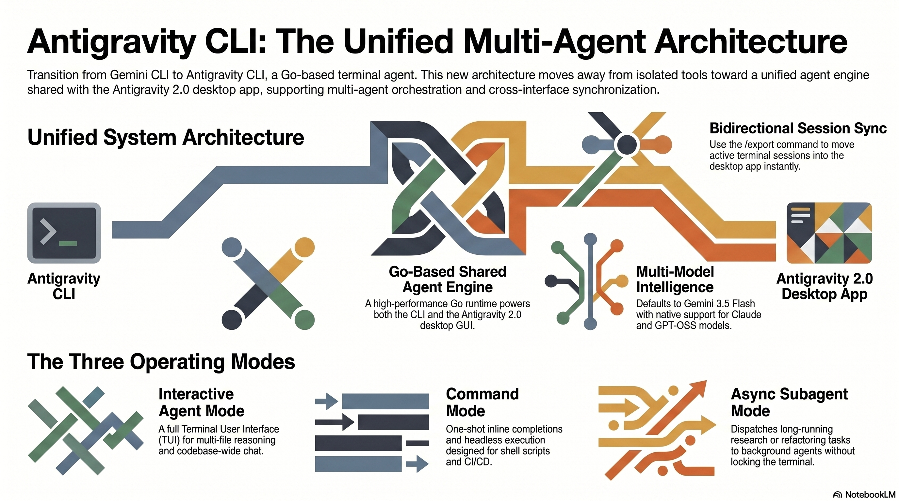

<!-- _class: title -->

# Antigravity 2.0 CLI

Go-based terminal ของ Google · Natural Language → Multi-Agent Automation · I/O 2026

<!-- Speaker: Google replaced Gemini CLI with Antigravity CLI at I/O 2026. This deck covers architecture, 3 modes, orchestration patterns, and migration essentials. -->

---

## Antigravity CLI: สามสิ่งที่ต้องรู้ทันที

Go runtime ที่เร็วกว่า Node, engine เดียวกับ GUI, parallel subagents ใน background

  

    
Runtime

    <h3>Go · Fast Startup</h3>
    
Rewrite จาก Node.js Gemini CLI — memory footprint ต่ำกว่า เหมาะกับ remote SSH และ headless environments

  

  

    
Key Differentiator

    <h3>Shared Agent Engine</h3>
    
CLI กับ Antigravity 2.0 GUI ใช้ core engine ชุดเดียวกัน — sessions และ permissions sync สองทาง

  

  

    
Power Feature

    <h3>Async Subagents</h3>
    
Dispatch งานหลายชิ้น parallel ใน background — terminal ไม่ถูก lock ระหว่างรอ

  

<b>★ Takeaway:</b> Antigravity CLI ไม่ใช่แค่ terminal wrapper — มันคือ orchestration layer เดียวกับ desktop GUI

<!-- Speaker: Lead with the three differentiators. Emphasis: this is NOT just a chat CLI — it shares the exact same agent engine as the full desktop application. -->

---

## AI Agent Race: Google เข้าสู้ด้วย Antigravity CLI

ทุก major AI lab มี terminal agent ของตัวเอง — Gemini CLI retire แล้วใน June 2026

  

    
Anthropic

    <h3>Claude Code</h3>
    
TypeScript-based · Claude Sonnet/Opus · <code>claude</code> command

  

  

    
OpenAI

    <h3>Codex CLI</h3>
    
Node.js-based · GPT-4o/o3 · <code>codex</code> command

  

  

    
xAI

    <h3>Grok CLI</h3>
    
Python-based · Grok 3 · <code>grok</code> command

  

  

    
Google · I/O 2026

    <h3>Antigravity CLI</h3>
    
Go-based · Gemini 3.5 Flash · <code>agy</code> command · แทน Gemini CLI ที่ retire

  

<b>★ Takeaway:</b> ถ้าใช้ Gemini CLI อยู่ — migrate ไป <code>agy</code> ก่อน 18 มิถุนายน 2026 (deadline)

<!-- Speaker: Position in the competitive landscape. The key urgency point: Gemini CLI stops working June 18. Every major lab now has a terminal agent. -->

---

## Architecture: Go Runtime, Multi-Model, SSH-Aware

เร็วกว่า Node.js รุ่นเดิม — รองรับ Gemini/Claude/GPT-OSS, SSH headless authentication

<figure class="img-card">

<figcaption>Source: NotebookLM · Architecture overview: Go runtime, shared engine, model routing, SSH-aware auth</figcaption>
</figure>

<b>★ Takeaway:</b> Default model คือ Gemini 3.5 Flash (4× เร็วกว่า frontier รุ่นก่อน) — ลด latency compounding ใน multi-agent calls

<!-- Speaker: Highlight the Go rewrite benefit: faster startup especially in SSH/remote contexts. Multi-model support means teams can swap to Claude or GPT-OSS if preferred. -->

---

## CLI กับ GUI: Engine เดียวกัน — เลือก Interface ได้

ไม่ใช่ wrapper แยกต่างหาก — preferences, permissions, sessions sync สองทาง real-time

<svg viewBox="0 0 1100 320" width="100%" xmlns="http://www.w3.org/2000/svg">
  <!-- CLI box -->
  <rect x="30" y="60" width="260" height="200" rx="12" fill="var(--paper)" stroke="var(--soft-2)" stroke-width="1.5"/>
  <rect x="30" y="60" width="260" height="50" rx="12" fill="var(--soft)"/>
  <rect x="30" y="96" width="260" height="14" fill="var(--soft)"/>
  <text x="160" y="92" text-anchor="middle" font-size="17" font-weight="700" fill="var(--ink)" font-family="system-ui">CLI (agy)</text>
  <text x="160" y="134" text-anchor="middle" font-size="13" fill="var(--ink-dim)" font-family="system-ui">Terminal / SSH</text>
  <text x="160" y="158" text-anchor="middle" font-size="12" fill="var(--muted)" font-family="system-ui">Keyboard-first</text>
  <text x="160" y="180" text-anchor="middle" font-size="12" fill="var(--muted)" font-family="system-ui">Low resource</text>
  <text x="160" y="204" text-anchor="middle" font-size="11" fill="var(--accent)" font-family="system-ui,monospace">/export → push to GUI</text>
  <text x="160" y="224" text-anchor="middle" font-size="10" fill="var(--muted)" font-family="system-ui">macOS / Linux / Win</text>
  <!-- Arrow CLI to Engine -->
  <line x1="290" y1="155" x2="376" y2="155" stroke="var(--accent)" stroke-width="2.5"/>
  <polygon points="376,148 390,155 376,162" fill="var(--accent)"/>
  <!-- Arrow Engine to CLI -->
  <line x1="376" y1="172" x2="290" y2="172" stroke="var(--muted)" stroke-width="1.5"/>
  <polygon points="290,165 276,172 290,179" fill="var(--muted)"/>
  <!-- Engine box -->
  <rect x="390" y="40" width="320" height="240" rx="14" fill="var(--accent-wash)" stroke="var(--accent)" stroke-width="2"/>
  <text x="550" y="110" text-anchor="middle" font-size="19" font-weight="700" fill="var(--accent-deep)" font-family="system-ui">Agent Engine</text>
  <text x="550" y="136" text-anchor="middle" font-size="13" fill="var(--ink-dim)" font-family="system-ui">Shared Core</text>
  <text x="550" y="162" text-anchor="middle" font-size="12" fill="var(--muted)" font-family="system-ui">Gemini 3.5 Flash (default)</text>
  <text x="550" y="184" text-anchor="middle" font-size="11" fill="var(--muted)" font-family="system-ui">+ Claude + GPT-OSS</text>
  <text x="550" y="206" text-anchor="middle" font-size="11" fill="var(--muted)" font-family="system-ui">Tools / MCP / Hooks</text>
  <text x="550" y="228" text-anchor="middle" font-size="11" fill="var(--muted)" font-family="system-ui">Permissions sync</text>
  <!-- Arrow Engine to GUI -->
  <line x1="710" y1="155" x2="796" y2="155" stroke="var(--accent)" stroke-width="2.5"/>
  <polygon points="796,148 810,155 796,162" fill="var(--accent)"/>
  <!-- Arrow GUI to Engine -->
  <line x1="796" y1="172" x2="710" y2="172" stroke="var(--muted)" stroke-width="1.5"/>
  <polygon points="710,165 696,172 710,179" fill="var(--muted)"/>
  <!-- GUI box -->
  <rect x="810" y="60" width="260" height="200" rx="12" fill="var(--paper)" stroke="var(--soft-2)" stroke-width="1.5"/>
  <rect x="810" y="60" width="260" height="50" rx="12" fill="var(--soft)"/>
  <rect x="810" y="96" width="260" height="14" fill="var(--soft)"/>
  <text x="940" y="92" text-anchor="middle" font-size="17" font-weight="700" fill="var(--ink)" font-family="system-ui">GUI (Desktop)</text>
  <text x="940" y="134" text-anchor="middle" font-size="13" fill="var(--ink-dim)" font-family="system-ui">Visual diffs + graphs</text>
  <text x="940" y="158" text-anchor="middle" font-size="12" fill="var(--muted)" font-family="system-ui">Project dashboard</text>
  <text x="940" y="180" text-anchor="middle" font-size="12" fill="var(--muted)" font-family="system-ui">Orchestration UI</text>
  <text x="940" y="204" text-anchor="middle" font-size="11" fill="var(--muted)" font-family="system-ui">Session import via CLI</text>
  <text x="940" y="224" text-anchor="middle" font-size="10" fill="var(--muted)" font-family="system-ui">macOS / Win / Linux</text>
</svg>

<b>★ Takeaway:</b> Platform improvements deploy to both CLI and GUI at once — ใช้ /export ย้าย session ซับซ้อนจาก terminal เข้า GUI ทันที

<!-- Speaker: The shared-engine architecture is the design decision that sets Antigravity apart. Teams can mix CLI (headless/CI) and GUI (visual review) in the same workflow. -->

---

## สาม Operating Modes ของ Antigravity CLI

Interactive สำหรับ conversation, Command สำหรับ one-shot/pipe, Async Subagent สำหรับ parallel background

<figure class="img-card">

<figcaption>Source: NotebookLM · Three operating modes with use cases and trade-offs</figcaption>
</figure>

<b>★ Takeaway:</b> Async Subagent Mode คือ differentiator ที่แท้จริง — spawn งาน parallel โดยไม่ lock terminal ได้เลย

<!-- Speaker: Most users start with Interactive mode. Command mode powers CI/scripts. Async subagent is the power feature — no other major coding CLI has this built-in. -->

---

## Natural Language → Tool Execution: Workflow ของ Agent

Agent วางแผน เลือก tools และ execute อัตโนมัติ — Hooks และ MCP servers ควบคุม lifecycle

<figure class="img-card">

<figcaption>Source: NotebookLM · NL prompt → agent planning → tool calls → diff approval → Hooks + MCP infrastructure</figcaption>
</figure>

<b>★ Takeaway:</b> Agent ขอ approval ก่อน write เสมอ — ใช้ Hooks เพื่อ enforce format/lint อัตโนมัติในทุก tool call

<!-- Speaker: Key safety point: agent shows diff and requests approval before writing files. Hooks let you add guardrails — e.g., block vendor/ edits, auto-run gofmt after every file write. -->

---

## Image Generation: External Script ไม่ใช่ Built-In Command

ไม่มี agy generate-image — ใช้ agent-driven tool (plugin-dependent) หรือ script เรียก Image API โดยตรง

  

    
Approach 1 — Agent-Driven (tool-dependent)

    <h3>Natural Language Prompt</h3>
    
พิมพ์ใน Interactive Mode: <code>create an image of a cyberpunk city at night</code>

    
Agent เรียก image generation tool ภายใน — ขึ้นกับ plugin/tool ที่ install ไว้

    <ul>
      <li>ไม่ต้อง script แยก</li>
      <li>ผลขึ้นกับ tool ecosystem</li>
      <li>ไม่ guaranteed ทุก installation</li>
    </ul>
  

  

    
Approach 2 — External Script (Recommended)

    <h3>Script เรียก Image API โดยตรง</h3>
    
<code>node generate.js --prompt "Mars city" --output /tmp/mars.png --aspect-ratio 16:9</code>

    
เรียก Imagen / Gemini Image API โดยตรง — ได้ไฟล์ที่ path ที่กำหนด

    <ul>
      <li>Reproducible + scriptable</li>
      <li>Predictable output path</li>
      <li>Pipe-friendly กับ workflows อื่น</li>
    </ul>
  

<b>★ Takeaway:</b> สำหรับ production ใช้ external script เรียก Image API โดยตรง — agent-driven ใช้ได้แต่ขึ้นกับ plugin ecosystem

<!-- Speaker: Official docs don't document built-in image generation. The external script pattern is reliable and production-safe. Treat image generation as a separate capability layer. -->

---

## Async Subagent Orchestration: Parallel Background Agents

Dispatch หลาย tasks พร้อมกัน — แต่ละ agent รายงาน progress ผ่าน status bar และ post diff กลับเมื่อเสร็จ

<figure class="img-card">

<figcaption>Source: NotebookLM · Parallel subagent dispatch — /agents monitoring, /usage quota tracking</figcaption>
</figure>

<b>★ Takeaway:</b> ใช้ /agents ดู status และ /usage ตรวจ quota — N parallel subagents = N× API cost พร้อมกัน

<!-- Speaker: This is the headline power feature. Large refactors across packages run in parallel without blocking the user. But critical warning: parallel agents burn quota in parallel — always /usage first. -->

---

## Quick Start: ติดตั้ง → Auth → First Command

Homebrew / curl install → Google OAuth → Interactive mode พร้อมใช้ในไม่กี่นาที

<svg viewBox="0 0 1100 280" width="100%" xmlns="http://www.w3.org/2000/svg">
  <!-- Step 1: Install -->
  <rect x="20" y="50" width="230" height="180" rx="12" fill="var(--paper)" stroke="var(--soft-2)" stroke-width="1.5"/>
  <circle cx="135" cy="88" r="20" fill="var(--accent)"/>
  <text x="135" y="94" text-anchor="middle" font-size="15" font-weight="700" fill="var(--paper)" font-family="system-ui">1</text>
  <text x="135" y="125" text-anchor="middle" font-size="15" font-weight="700" fill="var(--ink)" font-family="system-ui">Install</text>
  <text x="135" y="152" text-anchor="middle" font-size="11" fill="var(--ink-dim)" font-family="system-ui,monospace">brew install</text>
  <text x="135" y="170" text-anchor="middle" font-size="11" fill="var(--ink-dim)" font-family="system-ui,monospace">google-antigravity/</text>
  <text x="135" y="188" text-anchor="middle" font-size="11" fill="var(--ink-dim)" font-family="system-ui,monospace">tap/agy</text>
  <text x="135" y="212" text-anchor="middle" font-size="10" fill="var(--muted)" font-family="system-ui">or: curl installer</text>
  <!-- Arrow 1 to 2 -->
  <line x1="250" y1="140" x2="304" y2="140" stroke="var(--accent)" stroke-width="2"/>
  <polygon points="304,133 318,140 304,147" fill="var(--accent)"/>
  <!-- Step 2: Auth -->
  <rect x="318" y="50" width="220" height="180" rx="12" fill="var(--paper)" stroke="var(--soft-2)" stroke-width="1.5"/>
  <circle cx="428" cy="88" r="20" fill="var(--accent)"/>
  <text x="428" y="94" text-anchor="middle" font-size="15" font-weight="700" fill="var(--paper)" font-family="system-ui">2</text>
  <text x="428" y="125" text-anchor="middle" font-size="15" font-weight="700" fill="var(--ink)" font-family="system-ui">Authenticate</text>
  <text x="428" y="155" text-anchor="middle" font-size="11" fill="var(--ink-dim)" font-family="system-ui,monospace">agy auth login</text>
  <text x="428" y="182" text-anchor="middle" font-size="10" fill="var(--muted)" font-family="system-ui">Google OAuth</text>
  <text x="428" y="200" text-anchor="middle" font-size="10" fill="var(--muted)" font-family="system-ui">SSH: local browser URL</text>
  <!-- Arrow 2 to 3 -->
  <line x1="538" y1="140" x2="592" y2="140" stroke="var(--accent)" stroke-width="2"/>
  <polygon points="592,133 606,140 592,147" fill="var(--accent)"/>
  <!-- Step 3: First Use -->
  <rect x="606" y="50" width="220" height="180" rx="12" fill="var(--paper)" stroke="var(--soft-2)" stroke-width="1.5"/>
  <circle cx="716" cy="88" r="20" fill="var(--accent)"/>
  <text x="716" y="94" text-anchor="middle" font-size="15" font-weight="700" fill="var(--paper)" font-family="system-ui">3</text>
  <text x="716" y="125" text-anchor="middle" font-size="15" font-weight="700" fill="var(--ink)" font-family="system-ui">First Use</text>
  <text x="716" y="155" text-anchor="middle" font-size="12" fill="var(--ink-dim)" font-family="system-ui,monospace">agy</text>
  <text x="716" y="180" text-anchor="middle" font-size="10" fill="var(--muted)" font-family="system-ui">"explain the arch</text>
  <text x="716" y="198" text-anchor="middle" font-size="10" fill="var(--muted)" font-family="system-ui">of this project"</text>
  <!-- Arrow 3 to 4 -->
  <line x1="826" y1="140" x2="880" y2="140" stroke="var(--accent)" stroke-width="2"/>
  <polygon points="880,133 894,140 880,147" fill="var(--accent)"/>
  <!-- Step 4: Daily -->
  <rect x="894" y="50" width="186" height="180" rx="12" fill="var(--paper)" stroke="var(--success)" stroke-width="2"/>
  <circle cx="987" cy="88" r="20" fill="var(--success)"/>
  <text x="987" y="94" text-anchor="middle" font-size="15" font-weight="700" fill="var(--paper)" font-family="system-ui">4</text>
  <text x="987" y="125" text-anchor="middle" font-size="15" font-weight="700" fill="var(--ink)" font-family="system-ui">Daily Workflow</text>
  <text x="987" y="155" text-anchor="middle" font-size="11" fill="var(--ink-dim)" font-family="system-ui">agy -c "review commit"</text>
  <text x="987" y="178" text-anchor="middle" font-size="10" fill="var(--muted)" font-family="system-ui">/spawn parallel tasks</text>
  <text x="987" y="196" text-anchor="middle" font-size="10" fill="var(--muted)" font-family="system-ui">/agents, /usage, /export</text>
</svg>

<b>★ Takeaway:</b> Install ถึง first useful output ใช้เวลาไม่เกิน 5 นาที — bottleneck เดียวคือ Google OAuth login

<!-- Speaker: Keep it short — most developers will be productive in minutes. Mention the headless SSH auth flow for teams using remote servers. -->

---

## Caveats: 5 สิ่งต้องรู้ก่อน Production

Deadline migrate, code review คือ mandatory, parallel quota, legacy compat, image gen ไม่ built-in

  

    
Urgent

    <h3>Gemini CLI Deadline</h3>
    
Stop serving 18 มิ.ย. 2026 — migrate ก่อน deadline

  

  

    
Review Required

    <h3>AI Code Quality</h3>
    
Review diffs เสมอ — agent สร้าง code ที่ดูถูกแต่มี subtle bug ได้

  

  

    
Cost Watch

    <h3>Parallel Quota</h3>
    
N subagents = N× API cost — ตรวจ /usage ก่อน spawn

  

  

    
Compatibility

    <h3>Legacy Plugins</h3>
    
Gemini CLI extensions อาจยังไม่ tested กับ Go runtime ใหม่

  

  

    
External Only

    <h3>Image Generation</h3>
    
ไม่มี built-in — ต้องใช้ script หรือ image plugin แยก

  

<b>★ Takeaway:</b> ตั้ง budget alert บน Google Cloud Console ก่อนใช้ parallel subagents ใน production

<!-- Speaker: Priority order: migration deadline first, then code review discipline, then cost monitoring. The parallel quota issue has caught teams off guard. -->

---

## Key Takeaways: Antigravity CLI ใน 60 วินาที

จาก migration deadline ถึง orchestration paradigm — 7 สิ่งที่ต้องจำ

  

    
Action Required Now

    <h3>Migrate ก่อน 18 มิ.ย.</h3>
    
Gemini CLI stops working — ติดตั้ง <code>agy</code> และ migrate config วันนี้

  

  

    
Core Architecture

    <h3>Shared Engine</h3>
    
CLI = GUI engine เดียวกัน — /export สลับ interface ได้ทันที sessions sync ตลอด

  

  

    
Paradigm Shift

    <h3>Orchestration Layer</h3>
    
ไม่ใช่ command tool — เป็น NL-driven orchestrator ที่ spawn parallel agents ได้

  

<b>★ Takeaway:</b> Antigravity CLI คือ orchestration layer ไม่ใช่ fixed command tool — value มาจาก agent + tool ecosystem ที่สร้างรอบมัน

<!-- Speaker: Close with the paradigm shift. This is not grep or sed — it's an agent orchestrator. The CLI's power scales with the hooks, MCPs, and subagent workflows you build around it. -->
