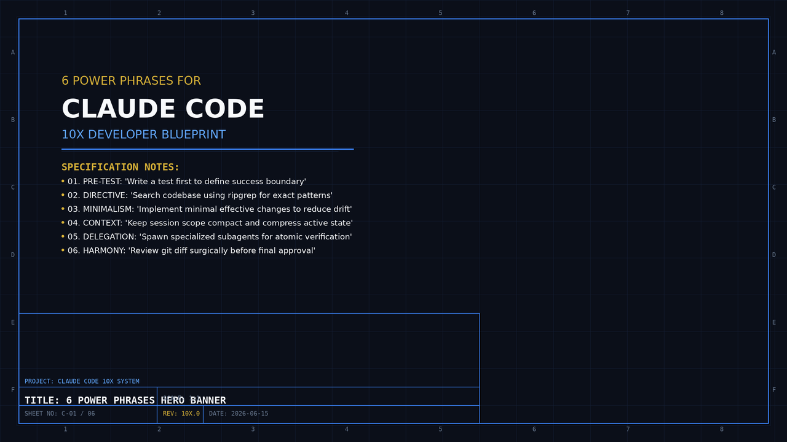
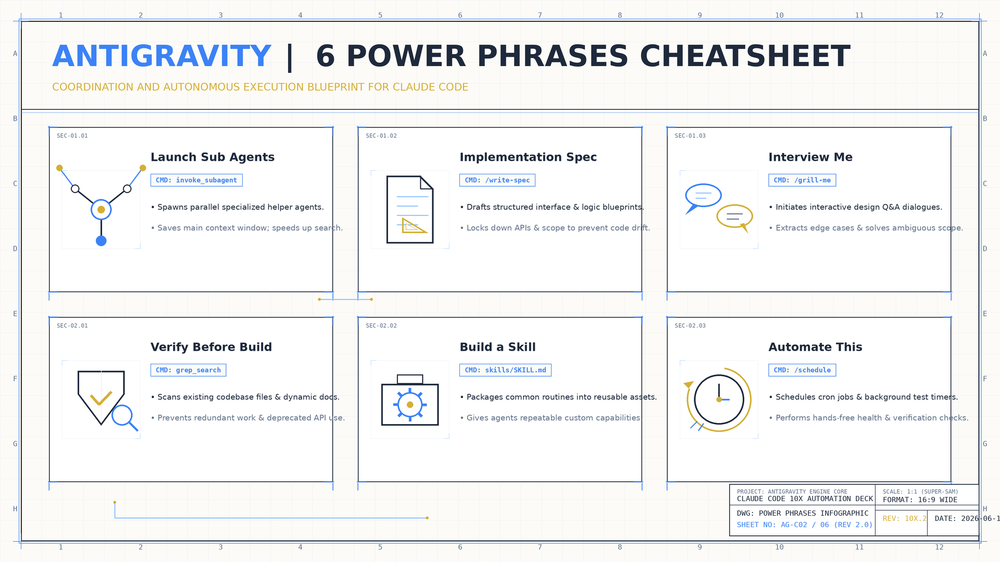

<!-- _class: title -->

# 6 Power Phrases for Claude Code

10x Development Speed — Control AI Agents, Not Just Prompts

<!-- Speaker: 6 specific phrases that shift how you control Claude Code — from reactive vibe coding to structured agent orchestration. 12 slides. -->

---

<!-- _class: cheatsheet -->
<!-- _backgroundColor: #f8f7f4 -->

<!-- Speaker: 6 phrases at a glance — each maps to a distinct workflow problem: parallelism, planning, requirements, verification, knowledge capture, automation. -->

---

## TL;DR: Phrases that Change Everything

Not prompt tricks — workflow patterns that restructure how AI agents work for you.

<svg viewBox="0 0 1100 320" width="100%" xmlns="http://www.w3.org/2000/svg">
  <rect x="40" y="20" width="1020" height="280" rx="16" fill="var(--paper)" stroke="var(--soft-2)" stroke-width="1.5" style="filter:drop-shadow(0 4px 12px rgba(15,23,42,.08))"/>
  <rect x="40" y="20" width="8" height="280" rx="4" fill="var(--accent)"/>
  <!-- 6 phrase tags -->
  <rect x="90" y="50" width="270" height="44" rx="8" fill="var(--accent)" opacity=".1"/>
  <text x="225" y="78" font-size="14" font-weight="700" fill="var(--accent)" text-anchor="middle" font-family="system-ui">1. Launch sub agents</text>
  <rect x="390" y="50" width="310" height="44" rx="8" fill="var(--accent)" opacity=".1"/>
  <text x="545" y="78" font-size="14" font-weight="700" fill="var(--accent)" text-anchor="middle" font-family="system-ui">2. Write implementation spec</text>
  <rect x="730" y="50" width="200" height="44" rx="8" fill="var(--accent)" opacity=".1"/>
  <text x="830" y="78" font-size="14" font-weight="700" fill="var(--accent)" text-anchor="middle" font-family="system-ui">3. Interview me</text>
  <rect x="90" y="120" width="290" height="44" rx="8" fill="var(--gold)" opacity=".15"/>
  <text x="235" y="148" font-size="14" font-weight="700" fill="var(--gold)" text-anchor="middle" font-family="system-ui">4. Verify before you build</text>
  <rect x="410" y="120" width="290" height="44" rx="8" fill="var(--gold)" opacity=".15"/>
  <text x="555" y="148" font-size="14" font-weight="700" fill="var(--gold)" text-anchor="middle" font-family="system-ui">5. Build me a skill</text>
  <rect x="730" y="120" width="200" height="44" rx="8" fill="var(--gold)" opacity=".15"/>
  <text x="830" y="148" font-size="14" font-weight="700" fill="var(--gold)" text-anchor="middle" font-family="system-ui">6. Automate this</text>
  <!-- divider -->
  <line x1="90" y1="186" x2="1040" y2="186" stroke="var(--soft-2)" stroke-width="1"/>
  <text x="90" y="212" font-size="14" fill="var(--ink-dim)" font-family="system-ui">Phrases 1-3: BEFORE building — define what, how, and for whom</text>
  <text x="90" y="238" font-size="14" fill="var(--ink-dim)" font-family="system-ui">Phrases 4-6: AFTER building — verify, codify, and automate</text>
  <text x="90" y="265" font-size="13" fill="var(--muted)" font-family="system-ui">Result: 10x speed from structured agent control, not prompt cleverness</text>
  <rect x="40" y="20" width="1" height="1" fill="none"/>
</svg>

<b>★ Takeaway:</b> 10x speed มาจาก workflow patterns ที่ถูกต้อง ไม่ใช่การเขียน prompt เก่งขึ้น

<!-- Speaker: Frame for the audience — these 6 phrases restructure the agent's behavior before and after execution. -->

---

## Why Vibe Coding Doesn't Scale

Sequential, unplanned, ephemeral — three structural reasons AI stays slow.

  

    
The Pattern

    <h3>Vibe Coding Loop</h3>
    
Type request → wait → review → adjust → repeat. Context grows, Claude slows down and loses earlier details. Sequential by design.

  

  

    
4 Root Problems

    <h3>Why It Breaks at Scale</h3>
    <ul>
      <li>Context window overflows — Claude forgets</li>
      <li>No plan → wrong direction 30 min in</li>
      <li>Sequential work — no parallelism</li>
      <li>Good conversations lost — not reusable</li>
    </ul>
  

<b>★ Takeaway:</b> ปัญหาไม่ใช่ AI ไม่ฉลาดพอ แต่เป็นโครงสร้างการทำงานที่ทำให้ AI ทำงานผิดวิธี

<!-- Speaker: The problem isn't Claude's capability — it's the workflow. These 4 structural issues all have specific phrase fixes. -->

---

## Phrase 1: "Launch sub agents"

Spawn parallel agent sessions — compress 3 hours of work into 30 minutes.

<svg viewBox="0 0 1100 320" width="100%" xmlns="http://www.w3.org/2000/svg">
  <!-- Main node -->
  <rect x="440" y="10" width="220" height="60" rx="10" fill="var(--accent)" style="filter:drop-shadow(var(--shadow-md))"/>
  <text x="550" y="36" font-size="13" font-weight="700" fill="white" text-anchor="middle" font-family="system-ui">Launch sub agents</text>
  <text x="550" y="56" font-size="11" fill="rgba(255,255,255,.8)" text-anchor="middle" font-family="system-ui">Task A + Task B + Task C</text>
  <!-- Branch lines -->
  <line x1="430" y1="70" x2="160" y2="130" stroke="var(--accent)" stroke-width="1.5" opacity=".5"/>
  <line x1="550" y1="70" x2="550" y2="130" stroke="var(--accent)" stroke-width="1.5" opacity=".5"/>
  <line x1="670" y1="70" x2="940" y2="130" stroke="var(--accent)" stroke-width="1.5" opacity=".5"/>
  <!-- Sub-agent boxes -->
  <rect x="60" y="130" width="200" height="100" rx="10" fill="var(--paper)" stroke="var(--accent)" stroke-width="1.5" style="filter:drop-shadow(var(--shadow-sm))"/>
  <text x="160" y="156" font-size="12" font-weight="700" fill="var(--accent)" text-anchor="middle" font-family="system-ui">Agent A</text>
  <text x="160" y="178" font-size="11" fill="var(--ink-dim)" text-anchor="middle" font-family="system-ui">Research libraries</text>
  <text x="160" y="196" font-size="11" fill="var(--muted)" text-anchor="middle" font-family="system-ui">Fresh context</text>
  <text x="160" y="218" font-size="11" fill="var(--success-ink)" text-anchor="middle" font-family="system-ui">Done in 10m</text>
  <rect x="450" y="130" width="200" height="100" rx="10" fill="var(--paper)" stroke="var(--accent)" stroke-width="1.5" style="filter:drop-shadow(var(--shadow-sm))"/>
  <text x="550" y="156" font-size="12" font-weight="700" fill="var(--accent)" text-anchor="middle" font-family="system-ui">Agent B</text>
  <text x="550" y="178" font-size="11" fill="var(--ink-dim)" text-anchor="middle" font-family="system-ui">Write tests</text>
  <text x="550" y="196" font-size="11" fill="var(--muted)" text-anchor="middle" font-family="system-ui">Own cost bucket</text>
  <text x="550" y="218" font-size="11" fill="var(--success-ink)" text-anchor="middle" font-family="system-ui">Done in 12m</text>
  <rect x="840" y="130" width="200" height="100" rx="10" fill="var(--paper)" stroke="var(--accent)" stroke-width="1.5" style="filter:drop-shadow(var(--shadow-sm))"/>
  <text x="940" y="156" font-size="12" font-weight="700" fill="var(--accent)" text-anchor="middle" font-family="system-ui">Agent C</text>
  <text x="940" y="178" font-size="11" fill="var(--ink-dim)" text-anchor="middle" font-family="system-ui">Generate images</text>
  <text x="940" y="196" font-size="11" fill="var(--muted)" text-anchor="middle" font-family="system-ui">Smaller model</text>
  <text x="940" y="218" font-size="11" fill="var(--success-ink)" text-anchor="middle" font-family="system-ui">Done in 8m</text>
  <!-- Merge arrow -->
  <line x1="160" y1="230" x2="430" y2="280" stroke="var(--muted)" stroke-width="1.5" opacity=".6"/>
  <line x1="550" y1="230" x2="550" y2="280" stroke="var(--muted)" stroke-width="1.5" opacity=".6"/>
  <line x1="940" y1="230" x2="670" y2="280" stroke="var(--muted)" stroke-width="1.5" opacity=".6"/>
  <rect x="430" y="280" width="240" height="36" rx="8" fill="var(--success)" opacity=".12"/>
  <text x="550" y="303" font-size="13" font-weight="700" fill="var(--success-ink)" text-anchor="middle" font-family="system-ui">All done in 12m (not 3h)</text>
  <rect x="0" y="0" width="1" height="1" fill="none"/>
</svg>

<b>★ Takeaway:</b> แต่ละ sub agent เริ่ม context ใหม่ ทำงานพร้อมกัน — sequential 3 ชั่วโมง กลายเป็น parallel 30 นาที

<!-- Speaker: Each sub-agent starts fresh — lighter context, potentially cheaper model, fully parallel. The cost is per-agent, so plan scope carefully. -->

---

## Phrase 2: "Write me an implementation spec"

Force Claude to plan before coding — eliminates 30-min backtracking loops.

<svg viewBox="0 0 1100 300" width="100%" xmlns="http://www.w3.org/2000/svg">
  <!-- Vibe path (bad) -->
  <text x="100" y="50" font-size="13" font-weight="700" fill="var(--danger)" font-family="system-ui">Without spec</text>
  <rect x="60" y="65" width="140" height="44" rx="8" fill="var(--paper)" stroke="var(--soft-2)" stroke-width="1.5"/>
  <text x="130" y="93" font-size="12" fill="var(--ink)" text-anchor="middle" font-family="system-ui">Request</text>
  <line x1="200" y1="87" x2="240" y2="87" stroke="var(--danger)" stroke-width="1.5" marker-end="url(#arr-d)"/>
  <rect x="240" y="65" width="140" height="44" rx="8" fill="var(--paper)" stroke="var(--danger)" stroke-width="1.5"/>
  <text x="310" y="93" font-size="12" fill="var(--danger)" text-anchor="middle" font-family="system-ui">Code immediately</text>
  <line x1="380" y1="87" x2="420" y2="87" stroke="var(--danger)" stroke-width="1.5"/>
  <rect x="420" y="65" width="140" height="44" rx="8" fill="var(--paper)" stroke="var(--danger)" stroke-width="1.5"/>
  <text x="490" y="87" font-size="11" fill="var(--danger)" text-anchor="middle" font-family="system-ui">Wrong direction</text>
  <text x="490" y="105" font-size="11" fill="var(--muted)" text-anchor="middle" font-family="system-ui">30 min wasted</text>
  <!-- Curved backtrack arrow -->
  <path d="M 560 87 C 620 87 640 140 580 155 C 520 170 400 160 380 150 C 360 140 370 110 380 109" stroke="var(--danger)" stroke-width="1.5" fill="none" stroke-dasharray="5,3"/>
  <text x="590" y="130" font-size="11" fill="var(--danger)" font-family="system-ui">backtrack!</text>
  <!-- Divider -->
  <line x1="60" y1="180" x2="1040" y2="180" stroke="var(--soft-2)" stroke-width="1"/>
  <!-- With spec path (good) -->
  <text x="100" y="210" font-size="13" font-weight="700" fill="var(--success-ink)" font-family="system-ui">With spec</text>
  <rect x="60" y="225" width="140" height="44" rx="8" fill="var(--paper)" stroke="var(--soft-2)" stroke-width="1.5"/>
  <text x="130" y="253" font-size="12" fill="var(--ink)" text-anchor="middle" font-family="system-ui">Request</text>
  <line x1="200" y1="247" x2="240" y2="247" stroke="var(--success)" stroke-width="1.5"/>
  <rect x="240" y="225" width="160" height="44" rx="8" fill="var(--paper)" stroke="var(--success)" stroke-width="1.5"/>
  <text x="320" y="247" font-size="11" fill="var(--success-ink)" text-anchor="middle" font-family="system-ui">Spec: steps,</text>
  <text x="320" y="263" font-size="11" fill="var(--success-ink)" text-anchor="middle" font-family="system-ui">edge cases, criteria</text>
  <line x1="400" y1="247" x2="440" y2="247" stroke="var(--success)" stroke-width="1.5"/>
  <text x="460" y="240" font-size="11" fill="var(--muted)" font-family="system-ui">Human</text>
  <text x="460" y="256" font-size="11" fill="var(--muted)" font-family="system-ui">approves</text>
  <line x1="520" y1="247" x2="560" y2="247" stroke="var(--success)" stroke-width="1.5"/>
  <rect x="560" y="225" width="140" height="44" rx="8" fill="var(--paper)" stroke="var(--success)" stroke-width="1.5"/>
  <text x="630" y="253" font-size="12" fill="var(--success-ink)" text-anchor="middle" font-family="system-ui">Code: correct</text>
  <line x1="700" y1="247" x2="740" y2="247" stroke="var(--success)" stroke-width="1.5"/>
  <rect x="740" y="225" width="180" height="44" rx="8" fill="var(--success)" opacity=".1" stroke="var(--success)" stroke-width="1.5"/>
  <text x="830" y="247" font-size="12" font-weight="700" fill="var(--success-ink)" text-anchor="middle" font-family="system-ui">Done: no rework</text>
  <text x="830" y="265" font-size="11" fill="var(--muted)" text-anchor="middle" font-family="system-ui">60-70% fewer errors</text>
  <defs>
    <marker id="arr-d" markerWidth="8" markerHeight="8" refX="6" refY="3" orient="auto">
      <path d="M0,0 L0,6 L8,3 z" fill="var(--danger)"/>
    </marker>
  </defs>
  <rect x="0" y="0" width="1" height="1" fill="none"/>
</svg>

<b>★ Takeaway:</b> Spec บังคับให้ Claude คิดก่อนทำ — ลด backtrack และ error rate ลง 60–70%

<!-- Speaker: The spec acts as a checkpoint — Claude commits to an approach before writing a single line. You review the plan, not the code. -->

---

## Phrase 3: "Interview me"

Claude becomes your requirements analyst — extracts what you actually need, not what you asked for.

  

    
What you ask for

    <h3>"Build a login form"</h3>
    
Surface-level feature request — Claude builds exactly this and ships something technically correct but incomplete.

  

  

    
Interview me uncovers

    <h3>4 Hidden Requirements</h3>
    <ul>
      <li>Must support mobile (forgot to mention)</li>
      <li>Budget: no paid auth service</li>
      <li>Existing system: Firebase already in use</li>
      <li>Timeline: need it by Thursday</li>
    </ul>
  

  

    
What gets built

    <h3>Correct Solution</h3>
    
Firebase Auth + mobile-first UI — built right the first time because real requirements surfaced before a single line of code.

  

<b>★ Takeaway:</b> ค้นพบ "สร้างผิดอย่าง" ก่อนเริ่มสร้าง ไม่ใช่หลังเสร็จแล้ว

<!-- Speaker: Add a scope constraint: "ask no more than 5 questions" — otherwise Claude can over-interview. The goal is uncovering hidden constraints fast. -->

---

## Phrase 4: "Verify before you build"

CLAUDE.md + MCP tools + human checkpoints — prevents building on false assumptions.

<svg viewBox="0 0 1100 300" width="100%" xmlns="http://www.w3.org/2000/svg">
  <!-- Flow left to right -->
  <rect x="40" y="110" width="160" height="60" rx="10" fill="var(--paper)" stroke="var(--soft-2)" stroke-width="1.5" style="filter:drop-shadow(var(--shadow-sm))"/>
  <text x="120" y="136" font-size="12" font-weight="700" fill="var(--ink)" text-anchor="middle" font-family="system-ui">Verify</text>
  <text x="120" y="154" font-size="11" fill="var(--ink-dim)" text-anchor="middle" font-family="system-ui">assumption X</text>
  <line x1="200" y1="140" x2="250" y2="140" stroke="var(--muted)" stroke-width="1.5"/>
  <!-- MCP tools box -->
  <rect x="250" y="90" width="200" height="100" rx="10" fill="var(--accent)" opacity=".08" stroke="var(--accent)" stroke-width="1.5"/>
  <text x="350" y="118" font-size="12" font-weight="700" fill="var(--accent)" text-anchor="middle" font-family="system-ui">MCP Tools Verify</text>
  <text x="350" y="138" font-size="11" fill="var(--ink-dim)" text-anchor="middle" font-family="system-ui">filesystem, fetch,</text>
  <text x="350" y="156" font-size="11" fill="var(--ink-dim)" text-anchor="middle" font-family="system-ui">database — real check</text>
  <text x="350" y="174" font-size="10" fill="var(--muted)" text-anchor="middle" font-family="system-ui">(not assumed)</text>
  <line x1="450" y1="140" x2="500" y2="140" stroke="var(--muted)" stroke-width="1.5"/>
  <!-- CLAUDE.md update -->
  <rect x="500" y="90" width="200" height="100" rx="10" fill="var(--paper)" stroke="var(--gold)" stroke-width="1.5" style="filter:drop-shadow(var(--shadow-sm))"/>
  <text x="600" y="118" font-size="12" font-weight="700" fill="var(--gold)" text-anchor="middle" font-family="system-ui">Update CLAUDE.md</text>
  <text x="600" y="138" font-size="11" fill="var(--ink-dim)" text-anchor="middle" font-family="system-ui">API behavior,</text>
  <text x="600" y="156" font-size="11" fill="var(--ink-dim)" text-anchor="middle" font-family="system-ui">constraints learned</text>
  <text x="600" y="174" font-size="10" fill="var(--muted)" text-anchor="middle" font-family="system-ui">persists to future sessions</text>
  <line x1="700" y1="140" x2="750" y2="140" stroke="var(--muted)" stroke-width="1.5"/>
  <!-- Human validation zone -->
  <rect x="750" y="90" width="300" height="100" rx="10" fill="var(--danger-wash)" stroke="var(--danger)" stroke-width="2"/>
  <text x="900" y="115" font-size="12" font-weight="700" fill="var(--danger-ink)" text-anchor="middle" font-family="system-ui">Human Validation Zone</text>
  <text x="900" y="135" font-size="11" fill="var(--ink-dim)" text-anchor="middle" font-family="system-ui">Claude STOPS. You approve.</text>
  <text x="900" y="155" font-size="11" fill="var(--ink-dim)" text-anchor="middle" font-family="system-ui">Before: delete / push prod /</text>
  <text x="900" y="173" font-size="11" fill="var(--ink-dim)" text-anchor="middle" font-family="system-ui">external API call</text>
  <!-- Down arrow from HVZ -->
  <line x1="900" y1="190" x2="900" y2="230" stroke="var(--success)" stroke-width="1.5"/>
  <rect x="800" y="230" width="200" height="44" rx="8" fill="var(--success)" opacity=".1" stroke="var(--success)" stroke-width="1.5"/>
  <text x="900" y="257" font-size="12" font-weight="700" fill="var(--success-ink)" text-anchor="middle" font-family="system-ui">Build — on verified facts</text>
  <rect x="0" y="0" width="1" height="1" fill="none"/>
</svg>

<b>★ Takeaway:</b> Human Validation Zones = safety net สำหรับงาน irreversible — Claude หยุด รอคุณ ก่อนดำเนินการต่อ

<!-- Speaker: The CLAUDE.md update is the compound interest — learnings from this session become context for the next one. -->

---

## Phrase 5: "Build me a skill"

Convert great conversations into reusable commands — Institutional Knowledge that compounds.

<svg viewBox="0 0 1100 300" width="100%" xmlns="http://www.w3.org/2000/svg">
  <!-- Arrow flow: 4 steps -->
  <rect x="40" y="100" width="190" height="80" rx="10" fill="var(--paper)" stroke="var(--soft-2)" stroke-width="1.5" style="filter:drop-shadow(var(--shadow-sm))"/>
  <text x="135" y="128" font-size="12" font-weight="700" fill="var(--ink)" text-anchor="middle" font-family="system-ui">Great conversation</text>
  <text x="135" y="148" font-size="11" fill="var(--ink-dim)" text-anchor="middle" font-family="system-ui">complex workflow solved</text>
  <text x="135" y="165" font-size="11" fill="var(--muted)" text-anchor="middle" font-family="system-ui">patterns discovered</text>
  <line x1="230" y1="140" x2="280" y2="140" stroke="var(--accent)" stroke-width="2"/>
  <polygon points="276,134 286,140 276,146" fill="var(--accent)"/>
  <!-- Step 2 -->
  <rect x="285" y="100" width="190" height="80" rx="10" fill="var(--accent)" opacity=".08" stroke="var(--accent)" stroke-width="1.5" style="filter:drop-shadow(var(--shadow-sm))"/>
  <text x="380" y="128" font-size="12" font-weight="700" fill="var(--accent)" text-anchor="middle" font-family="system-ui">Claude analyzes</text>
  <text x="380" y="148" font-size="11" fill="var(--ink-dim)" text-anchor="middle" font-family="system-ui">decisions, workflow,</text>
  <text x="380" y="165" font-size="11" fill="var(--muted)" text-anchor="middle" font-family="system-ui">edge cases found</text>
  <line x1="475" y1="140" x2="525" y2="140" stroke="var(--accent)" stroke-width="2"/>
  <polygon points="521,134 531,140 521,146" fill="var(--accent)"/>
  <!-- Step 3: Skill file -->
  <rect x="530" y="80" width="230" height="120" rx="10" fill="var(--paper)" stroke="var(--gold)" stroke-width="2" style="filter:drop-shadow(var(--shadow-md))"/>
  <text x="645" y="110" font-size="13" font-weight="700" fill="var(--gold)" text-anchor="middle" font-family="system-ui">Skill file (.md)</text>
  <text x="645" y="130" font-size="11" fill="var(--ink-dim)" text-anchor="middle" font-family="system-ui">Steps + success criteria</text>
  <text x="645" y="148" font-size="11" fill="var(--ink-dim)" text-anchor="middle" font-family="system-ui">Human validation zones</text>
  <text x="645" y="166" font-size="11" font-weight="700" fill="var(--danger-ink)" text-anchor="middle" font-family="system-ui">+ Gotchas section</text>
  <text x="645" y="184" font-size="10" fill="var(--muted)" text-anchor="middle" font-family="system-ui">things that can go wrong</text>
  <line x1="760" y1="140" x2="810" y2="140" stroke="var(--success)" stroke-width="2"/>
  <polygon points="806,134 816,140 806,146" fill="var(--success)"/>
  <!-- Step 4: Reuse -->
  <rect x="815" y="100" width="240" height="80" rx="10" fill="var(--success)" opacity=".1" stroke="var(--success)" stroke-width="1.5" style="filter:drop-shadow(var(--shadow-sm))"/>
  <text x="935" y="128" font-size="12" font-weight="700" fill="var(--success-ink)" text-anchor="middle" font-family="system-ui">Reusable command</text>
  <text x="935" y="148" font-size="11" fill="var(--ink-dim)" text-anchor="middle" font-family="system-ui">/deploy-to-staging</text>
  <text x="935" y="165" font-size="11" fill="var(--muted)" text-anchor="middle" font-family="system-ui">any session, any team member</text>
  <rect x="0" y="0" width="1" height="1" fill="none"/>
</svg>

<b>★ Takeaway:</b> บทสนทนาที่ดีไม่หายไปอีกต่อไป — กลายเป็น Institutional Knowledge ที่ทีมใช้ซ้ำได้ทุก session

<!-- Speaker: The Gotchas section is what separates a good skill from a naive one — Claude documents what went wrong during the conversation so future runs avoid it. -->

---

## Phrase 6: "Automate this"

Only automate what's measurable — avoid the AI Slop trap.

<svg viewBox="0 0 1100 300" width="100%" xmlns="http://www.w3.org/2000/svg">
  <!-- Left: Good to automate -->
  <rect x="40" y="20" width="480" height="260" rx="12" fill="var(--paper)" stroke="var(--success)" stroke-width="2" style="filter:drop-shadow(var(--shadow-md))"/>
  <rect x="40" y="20" width="480" height="52" rx="12" fill="var(--success)" opacity=".1"/>
  <text x="280" y="51" font-size="15" font-weight="700" fill="var(--success-ink)" text-anchor="middle" font-family="system-ui">OK to automate</text>
  <text x="80" y="96" font-size="13" fill="var(--success-ink)" font-family="system-ui">Measurable success criteria</text>
  <text x="80" y="116" font-size="12" fill="var(--ink-dim)" font-family="system-ui">Code formatting + linting</text>
  <text x="80" y="136" font-size="12" fill="var(--ink-dim)" font-family="system-ui">Tests run on every commit</text>
  <text x="80" y="156" font-size="12" fill="var(--ink-dim)" font-family="system-ui">Image resizing / compression</text>
  <text x="80" y="176" font-size="12" fill="var(--ink-dim)" font-family="system-ui">Daily report generation</text>
  <text x="80" y="196" font-size="12" fill="var(--ink-dim)" font-family="system-ui">Dependency security scanning</text>
  <text x="80" y="230" font-size="12" fill="var(--muted)" font-family="system-ui">Rule: repeated 3+ times + no taste</text>
  <text x="80" y="250" font-size="12" fill="var(--muted)" font-family="system-ui">judgment needed</text>
  <!-- Right: AI Slop zone -->
  <rect x="580" y="20" width="480" height="260" rx="12" fill="var(--paper)" stroke="var(--danger)" stroke-width="2" style="filter:drop-shadow(var(--shadow-md))"/>
  <rect x="580" y="20" width="480" height="52" rx="12" fill="var(--danger-wash)"/>
  <text x="820" y="51" font-size="15" font-weight="700" fill="var(--danger-ink)" text-anchor="middle" font-family="system-ui">AI Slop zone — do NOT automate</text>
  <text x="620" y="96" font-size="13" fill="var(--danger-ink)" font-family="system-ui">Requires aesthetic judgment (taste)</text>
  <text x="620" y="116" font-size="12" fill="var(--ink-dim)" font-family="system-ui">Writing marketing copy</text>
  <text x="620" y="136" font-size="12" fill="var(--ink-dim)" font-family="system-ui">Designing UI layouts</text>
  <text x="620" y="156" font-size="12" fill="var(--ink-dim)" font-family="system-ui">Choosing product positioning</text>
  <text x="620" y="176" font-size="12" fill="var(--ink-dim)" font-family="system-ui">Writing brand voice content</text>
  <text x="620" y="196" font-size="12" fill="var(--ink-dim)" font-family="system-ui">Any creative judgment call</text>
  <text x="620" y="230" font-size="12" fill="var(--muted)" font-family="system-ui">Result: correct format, zero quality,</text>
  <text x="620" y="250" font-size="12" fill="var(--muted)" font-family="system-ui">no voice — AI Slop</text>
  <rect x="0" y="0" width="1" height="1" fill="none"/>
</svg>

<b>★ Takeaway:</b> Automate เฉพาะงานที่วัดผลได้ + ไม่ต้อง taste judgment — ป้องกัน AI Slop ที่ถูกต้องแต่ไร้คุณภาพ

<!-- Speaker: AI Slop is structurally correct output with no soul. The test: if removing human judgment produces output you'd actually use, automate it. If not, keep human in the loop. -->

---

## User Guide: 3 Workflow Combos

Combine phrases by situation — before, during, and after the build.

  

    
New Project

    <h3>Start Right</h3>
    
<b>1.</b> Interview me — surface real requirements

    
<b>2.</b> Write me a spec — plan before code

    
<b>3.</b> Launch sub agents — parallel build

  

  

    
Complex Feature

    <h3>Build Carefully</h3>
    
<b>1.</b> Verify before you build — check assumptions

    
<b>2.</b> Launch sub agents — research + prototype + test

    
<b>3.</b> Build me a skill — capture learnings

  

  

    
Recurring Workflow

    <h3>Automate Smart</h3>
    
<b>1.</b> Do the workflow with Claude first

    
<b>2.</b> Build me a skill — from the conversation

    
<b>3.</b> Automate this — only if measurable + no taste

  

<b>★ Takeaway:</b> ไม่มี phrase ที่ใช้ได้กับทุกสถานการณ์ — เลือก combo ตาม context ของงาน

<!-- Speaker: These combos cover 90% of real work patterns. The key is picking the right entry point depending on how much you know upfront. -->

---

## Caveats: What Can Go Wrong

Every phrase has a failure mode — know it before you need it.

  

    
Watch Out

    <h3>Cost &amp; Scope Issues</h3>
    <ul>
      <li><b>Sub agents:</b> each has separate cost — plan scope, avoid runaway long agents</li>
      <li><b>Spec:</b> too exhaustive = inflexible — keep spec focused, not encyclopedic</li>
      <li><b>Interview me:</b> add "max 5 questions" to scope the session</li>
    </ul>
  

  

    
Setup Required

    <h3>Tooling Gotchas</h3>
    <ul>
      <li><b>Verify:</b> MCP tool permissions must be configured first</li>
      <li><b>Build me a skill:</b> review generated skill before using — Claude may over-generalize</li>
      <li><b>Automate this:</b> define success criteria before asking — vague criteria = wrong automation</li>
    </ul>
  

<b>★ Takeaway:</b> แต่ละวลีมี failure mode ของตัวเอง — เพิ่ม constraint ที่ชัดเจน (max N questions, measurable criteria) เพื่อป้องกัน

<!-- Speaker: The fix for each gotcha is usually a one-line constraint added to the phrase. No new skill needed — just scope it. -->

---

## Key Takeaways: 6 Phrases, One System

Use together — each phrase fixes a specific structural failure in AI-assisted development.

  

    
Phrase 1

    <h3>Launch sub agents</h3>
    
Parallelism — 3h → 30m

  

  

    
Phrase 2

    <h3>Write me a spec</h3>
    
Planning — 60-70% fewer errors

  

  

    
Phrase 3

    <h3>Interview me</h3>
    
Requirements — build the right thing

  

  

    
Phrase 4

    <h3>Verify before build</h3>
    
Safety — human checkpoint on irreversible ops

  

  

    
Phrase 5

    <h3>Build me a skill</h3>
    
Institutional Knowledge — conversations don't die

  

  

    
Phrase 6

    <h3>Automate this</h3>
    
Efficiency — measurable only, avoid AI slop

  

<b>★ Takeaway:</b> 10x speed ไม่ใช่ magic — คือการใช้ 6 phrases ที่ถูกต้อง ในเวลาที่ถูกต้อง กับงานที่ถูกประเภท

<!-- Speaker: These 6 phrases aren't a checklist — they're a system. Each one targets a specific structural inefficiency in how most developers work with Claude Code today. -->
