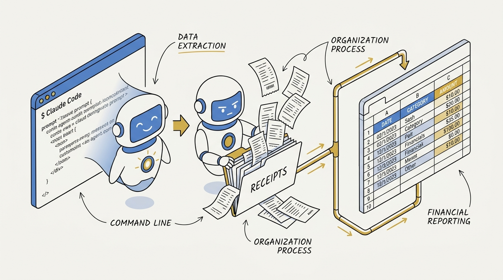
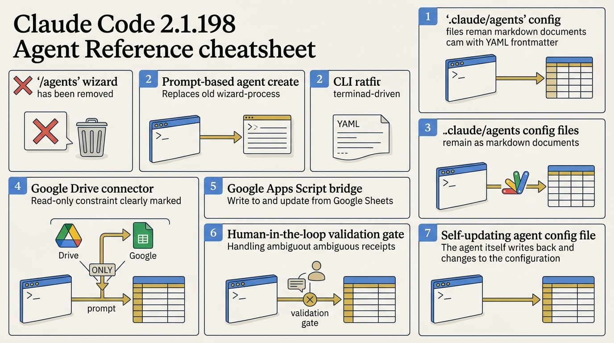
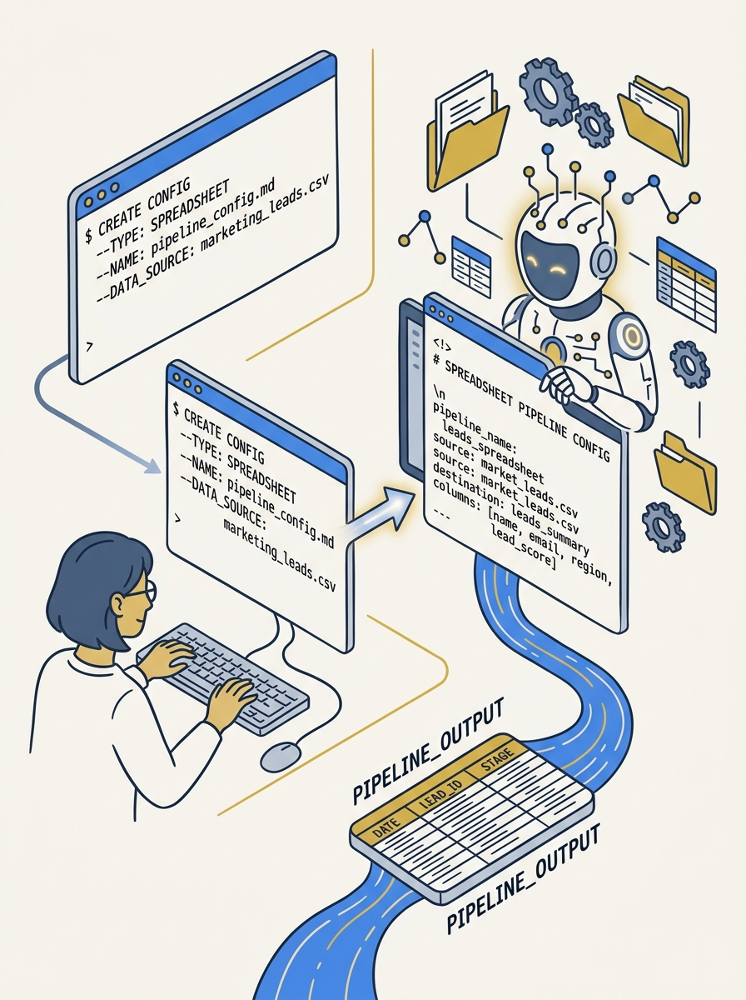
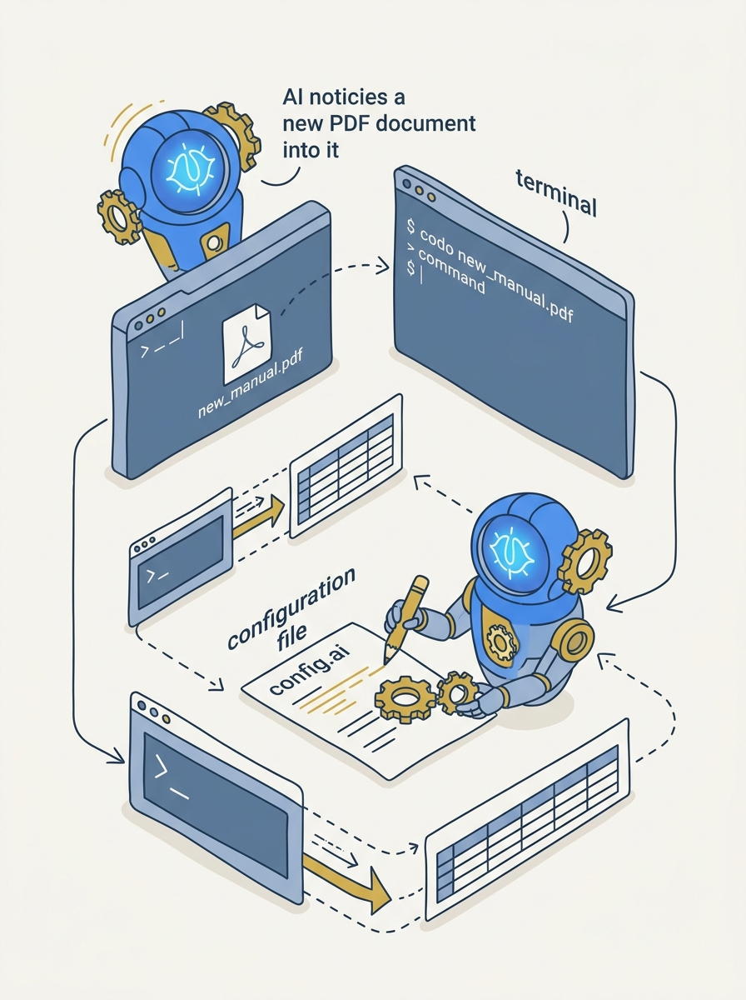

<!-- _class: title -->

# Claude Code 2.1.198: ยกเลิก /agent สร้าง AI Agent ด้วย Prompt

Use Case: อ่านใบเสร็จ PDF จาก Google Drive → กรอก Google Sheets อัตโนมัติ

<!-- Speaker: เกริ่นว่า /agents wizard ถูกถอดออกแล้วใน 2.1.198 วันนี้จะดู workflow ใหม่ผ่าน use case จริง -->

---

<!-- _class: cheatsheet -->
<!-- _backgroundColor: #f8f7f4 -->

<!-- Speaker: ภาพรวมทั้ง 7 concept ของ workflow ใหม่ก่อนลงรายละเอียดทีละส่วน -->

---

## TL;DR

สรุปสั้นก่อนลงรายละเอียด

Key Fact

<h3 style="font-size:22px;">/agents wizard ถูกถอดออกใน 2.1.198 (2 ก.ค. 2026)</h3>

วิธีสร้าง subagent ใหม่คือ <b>พิมพ์ prompt บอก Claude ตรงๆ</b> — ไฟล์ agent ที่ได้ยังเป็น Markdown + YAML frontmatter ใน <code>.claude/agents/</code> เหมือนเดิมทุกประการ ใช้จริงผ่าน use case: สร้าง "expense subagent" อ่านใบเสร็จ PDF จาก Google Drive แล้วกรอกลง Google Sheets อัตโนมัติ

<b>★ Takeaway:</b> UI เปลี่ยนจาก wizard เป็น conversational prompt แต่สถาปัตยกรรม agent เบื้องหลังไม่เปลี่ยน

<!-- Speaker: ย้ำว่านี่ไม่ใช่การตัดฟีเจอร์ subagent ทิ้ง แค่เปลี่ยนวิธีสร้าง -->

---

## สิ่งที่เปลี่ยนจริงใน 2.1.198

ถอด wizard ทิ้ง แต่สถาปัตยกรรม agent เดิมไม่กระทบ

  

    
Removed

    <h3>/agents wizard ถูกถอด</h3>
    
พิมพ์ /agents ตอนนี้ขึ้นข้อความแจ้งว่าคำสั่งถูก remove แล้ว

  

  

    
Replaced By

    <h3>สร้าง agent ด้วย Prompt</h3>
    
พิมพ์อธิบาย agent ที่ต้องการตรงๆ ได้ทั้งไทย/อังกฤษ (อังกฤษประหยัด token กว่า)

  

  

    
Unchanged

    <h3>โครงสร้างไฟล์เดิม</h3>
    
<code>.claude/agents/*.md</code> + YAML frontmatter เหมือนเดิม มีผลทันทีไม่ต้อง restart

  

<b>★ Takeaway:</b> เปลี่ยนแค่ UI การสร้าง agent จาก wizard เป็น prompt เท่านั้น

<!-- Speaker: เน้นว่าคู่มือเก่าที่สอนกด /agents ใช้ไม่ได้แล้ว ต้องปรับ workflow -->

---

## สร้าง Subagent แบบใหม่ด้วย Prompt

อธิบายสิ่งที่ต้องการตรงๆ แทนการกด wizard ทีละขั้น

Prompt Example

"create a subagent that reads receipts and logs expenses"

<b>★ Takeaway:</b> Claude generate ไฟล์ .md ให้เอง พร้อม identifier, description, tool permissions, model, system prompt

<!-- Speaker: ชี้ portrait ด้านขวาว่า flow นี้แทนที่ wizard เดิมทั้งหมด -->

---

## Use Case: ตั้งค่า "Expense Subagent"

อ่านใบเสร็จจากโฟลเดอร์ Google Drive แล้วกรอกลง Google Sheet ตามคอลัมน์ที่กำหนด

  

    
1

    <h3>โฟลเดอร์ Google Drive</h3>
    
เก็บใบเสร็จ/ใบแจ้งหนี้ แยกตามเดือน (ต้องเชื่อม Connector ไว้ก่อน)

  

  
&#8594;

  

    
2

    <h3>Prompt สร้าง agent</h3>
    
วางลิงก์โฟลเดอร์ Drive + ลิงก์ Google Sheet เข้าไปใน prompt

  

  
&#8594;

  

    
3

    <h3>ระบุคอลัมน์</h3>
    
เดือน, section, รายละเอียด, จำนวนเงิน, vendor, วันที่จ่าย

  

  
&#8594;

  

    
4

    <h3>Claude ถามกลับ</h3>
    
ถามวิธีเขียนข้อมูลกลับเข้า Sheet เดิม

  

<b>★ Takeaway:</b> วาง prompt ให้ครบทั้ง input (Drive) + output (Sheet) + คอลัมน์ ตั้งแต่ตอนสร้าง agent

<!-- Speaker: เน้นว่าต้องเชื่อม Google Drive Connector ไว้ล่วงหน้าก่อนถึงจะใช้ flow นี้ได้ -->

---

## ทำไมต้องใช้ Google Apps Script

Connector อ่านไฟล์ได้ แต่แก้ไฟล์ Sheet ที่มีอยู่แล้วไม่ได้ — มี 3 ทางเลือก

  

    
Option 1 · Recommended

    <h3>Google Apps Script</h3>
    
เขียน/append เข้า Sheet เดิมได้ตรงๆ ต้อง setup เพิ่มหน่อยตอนแรก

  

  

    
Option 2

    <h3>Export เป็น CSV</h3>
    
agent สรุปผลเป็นไฟล์ ผู้ใช้ต้อง copy ไปวางใน Sheet เอง

  

  

    
Option 3

    <h3>สร้าง Sheet ใหม่ทุกครั้ง</h3>
    
connector สร้างไฟล์ใหม่ได้ แต่ได้ Sheet ใหม่ทุกครั้งที่เรียก agent

  

<b>★ Takeaway:</b> เลือก Apps Script เพราะเป็นทางเดียวที่ append เข้า Sheet เดิมได้ต่อเนื่อง

<!-- Speaker: อธิบายว่า connector ของ Claude ตามเอกสารทางการคือ read-only จริงๆ ส่วนพฤติกรรมสร้างไฟล์ใหม่เป็นสิ่งที่ผู้ทำคลิปสังเกตจากการใช้งานจริง -->

---

## Deploy Apps Script แล้วเรียกใช้งาน

Claude ให้ขั้นตอน step-by-step แล้วขอข้อมูลกลับ 2 อย่างเพื่อเชื่อมต่อ

  

    
1

    <h3>วาง Script ลง Sheet</h3>
    
ทำตามขั้นตอน 1-2-3-4 ที่ Claude ให้มา

  

  
&#8594;

  

    
2

    <h3>ส่ง URL + Token</h3>
    
Web App URL และ Secret Token กลับเข้าไปในแชท

  

  
&#8594;

  

    
3

    <h3>ทดสอบแถว Test</h3>
    
agent เขียนแถว "Test" ยืนยันว่าเชื่อมต่อสำเร็จ แล้วลบทิ้ง

  

  
&#8594;

  

    
4

    <h3>เรียกใช้งาน</h3>
    
<code>@expense</code> บันทึกใบเสร็จเดือน 6 (วิธีเรียกเหมือนเดิมทุกประการ)

  

<b>★ Takeaway:</b> Secret Token คือกุญแจเข้าถึง Sheet — เก็บเป็นความลับเหมือน API key

<!-- Speaker: ย้ำเรื่องความปลอดภัยของ token ก่อนย้ายไป slide ถัดไป -->

---

## Human-in-the-Loop: Agent หยุดถามเมื่อข้อมูลไม่พอ

บันทึกใบเสร็จทั้งปีทีเดียว 21 รายการ — ผลลัพธ์ไม่ใช่ 100% แต่โปร่งใส

<svg viewBox="0 0 1100 220" width="100%" xmlns="http://www.w3.org/2000/svg">
  <circle cx="220" cy="110" r="80" fill="var(--soft)" stroke="var(--soft-2)" stroke-width="2"/>
  <text x="220" y="100" font-size="40" font-weight="800" fill="var(--ink)" text-anchor="middle" font-family="system-ui">21</text>
  <text x="220" y="135" font-size="14" fill="var(--ink-dim)" text-anchor="middle" font-family="system-ui">total</text>
  <circle cx="550" cy="110" r="80" fill="var(--success-wash)" stroke="var(--success)" stroke-width="2"/>
  <text x="550" y="100" font-size="40" font-weight="800" fill="var(--success-ink)" text-anchor="middle" font-family="system-ui">17</text>
  <text x="550" y="135" font-size="14" fill="var(--success-ink)" text-anchor="middle" font-family="system-ui">success</text>
  <circle cx="880" cy="110" r="80" fill="var(--danger-wash)" stroke="var(--danger)" stroke-width="2"/>
  <text x="880" y="100" font-size="40" font-weight="800" fill="var(--danger-ink)" text-anchor="middle" font-family="system-ui">4</text>
  <text x="880" y="135" font-size="14" fill="var(--danger-ink)" text-anchor="middle" font-family="system-ui">failed</text>
</svg>

  

    
เหตุผลที่ fail

    
สลิปโอนเงินไม่ระบุว่าจ่ายค่าอะไร

  

  

    
เหตุผลที่ fail

    
ใบเสร็จสกุลเงิน USD แปลงเป็น THB ไม่ได้อัตโนมัติ

  

<b>★ Takeaway:</b> Agent ที่ดีหยุดถามเมื่อข้อมูลไม่พอ ไม่เดาตัวเลขการเงินเอง

<!-- Speaker: agent เสนอ 2 ทาง ข้ามรายการไปก่อน หรือให้ผู้ใช้ระบุอัตราแลกเปลี่ยนเอง -->

---

## Agent ปรับปรุงความสามารถของตัวเอง

ลากไฟล์ PDF local วางใน terminal — agent แก้ config ตัวเองก่อนทำงานต่อ

Self-update

Claude สังเกตว่านี่คือ input ประเภทใหม่ (ไฟล์ local ไม่ใช่ Google Drive) จึงแก้ไฟล์ <code>expense.md</code> เพิ่มความสามารถ "อ่านไฟล์แนบโดยตรง" ก่อน แล้วค่อยกลับมาทำงานที่ขอ

<b>★ Takeaway:</b> Subagent แบบ prompt-based ขยายความสามารถตัวเองได้ตามการใช้งานจริง ไม่ใช่แค่ทำตาม spec เดิมตลอดไป

<!-- Speaker: จุดนี้คือไฮไลต์ของคลิป — agent ปรับตัวเองโดยไม่ต้องสั่งตรงๆ -->

---

## Caveats / Limits

สิ่งที่ต้องระวังก่อนใช้งานจริง

  

    
Connector Behavior

    <h3>เอกสารทางการระบุ read-only</h3>
    
พฤติกรรม "สร้างไฟล์ใหม่ได้" ในคลิปเป็นการสังเกตจากดีโม ไม่ใช่ spec ยืนยัน — ทดสอบเองก่อนพึ่งพา

  

  

    
Security

    <h3>Secret Token = กุญแจ Sheet</h3>
    
รั่วไหลแล้วมีคนเขียนข้อมูลปลอมลง Sheet ได้ ห้าม commit เข้า git

  

  

    
Currency

    <h3>แปลงสกุลเงินไม่อัตโนมัติ</h3>
    
USD หรือสกุลอื่นถูกข้าม หรือต้องผู้ใช้ระบุอัตราแลกเปลี่ยนเอง

  

<b>★ Takeaway:</b> docs บางหน้าของ Anthropic เองยังไม่อัปเดตตาม 2.1.198 — เจอ doc เก่าให้เชื่อพฤติกรรมจริงมากกว่า

<!-- Speaker: เตือนเรื่อง GitHub issue ที่ยังไม่ fix quickstart -->

---

## Key Takeaways

สิ่งที่ต้องจำถ้าอ่านแค่หน้านี้หน้าเดียว

  

    <h3>ถอด /agents wizard</h3>
    
สร้าง subagent ใหม่ต้อง prompt ตรงๆ หรือแก้ไฟล์ .claude/agents/*.md เอง

  

  

    <h3>Use case จริง</h3>
    
expense subagent: PDF จาก Google Drive → Google Sheets ผ่าน Apps Script

  

  

    <h3>Human-in-the-loop</h3>
    
agent หยุดถามเมื่อสกุลเงิน/ข้อมูลไม่พอ ไม่เดาตัวเลขการเงินเอง

  

  

    <h3>Self-updating</h3>
    
agent ขยายความสามารถตัวเองได้จาก pattern งานใหม่ที่เจอ

  

<b>★ Takeaway:</b> Secret Token เก็บเป็นความลับเหมือน API key; prompt ภาษาอังกฤษประหยัด token กว่าไทยสำหรับสร้าง agent ซ้ำๆ

<!-- Speaker: ปิดท้ายด้วยการย้ำว่าคู่มือเก่าที่สอน /agents ใช้ไม่ได้แล้ว -->
