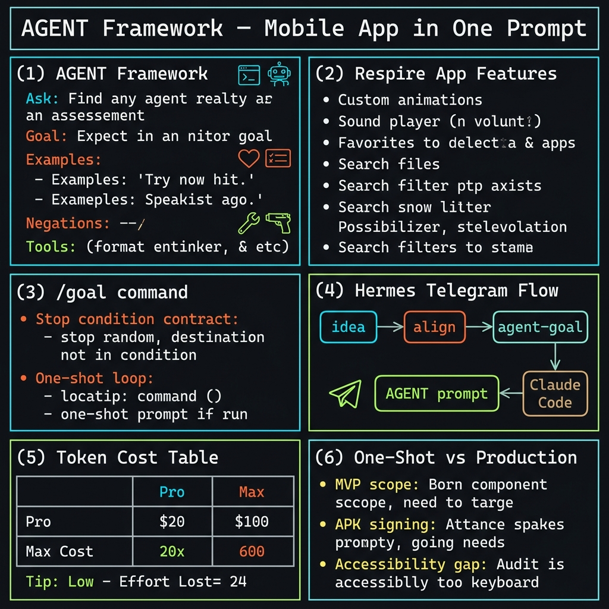
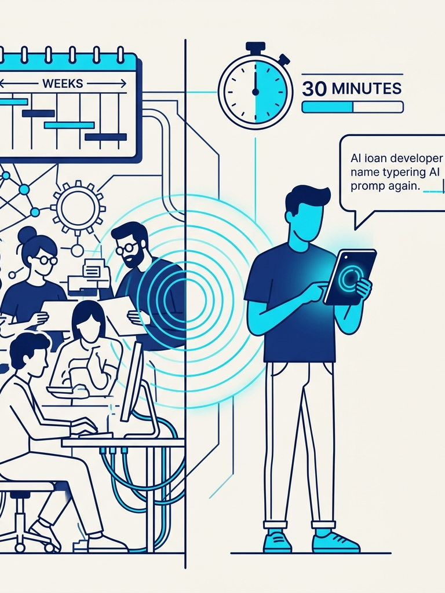
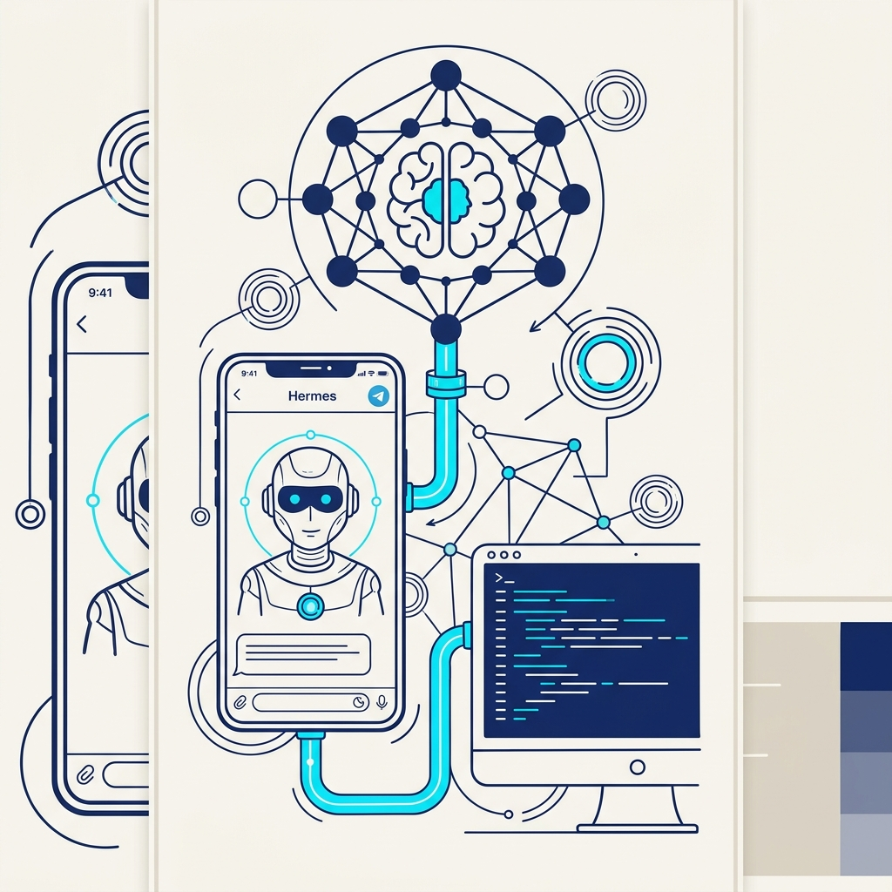

<!-- _class: title -->

# Claude Fable 5 สร้าง Mobile App ในพรอมต์เดียว

เฟรมเวิร์ก AGENT + Hermes Telegram = APK บนมือถือใน 30 นาที

<!-- Speaker: Claude Fable 5 collapsed the entire mobile dev workflow into a single inference session. This deck shows the framework and tools that made it possible. -->

---

<!-- _class: cheatsheet -->
<!-- _backgroundColor: #f8f7f4 -->

<!-- Speaker: One-page reference — AGENT framework, Respire features, Hermes flow, token cost table. We'll go deep on each zone. -->

---

## TL;DR: หนึ่งพรอมต์ → APK บนมือถือ

Claude Fable 5 สร้าง Respire ใน ~30 นาที — features ครบโดยไม่ได้ขอทั้งหมด

<svg viewBox="0 0 1100 340" width="100%" xmlns="http://www.w3.org/2000/svg">
  <rect x="40" y="40" width="200" height="260" rx="14" fill="var(--soft)" stroke="var(--soft-2)" stroke-width="1.5"/>
  <text x="140" y="95" font-size="13" font-weight="700" fill="var(--ink-dim)" text-anchor="middle" font-family="system-ui">ONE PROMPT</text>
  <text x="140" y="120" font-size="24" text-anchor="middle" font-family="system-ui" fill="var(--accent)">+</text>
  <text x="140" y="155" font-size="12" fill="var(--muted)" text-anchor="middle" font-family="system-ui">AGENT contract</text>
  <text x="140" y="175" font-size="12" fill="var(--muted)" text-anchor="middle" font-family="system-ui">via /goal</text>
  <text x="140" y="255" font-size="11" fill="var(--muted)" text-anchor="middle" font-family="system-ui">~30 min</text>
  <path d="M248 170 L308 170" stroke="var(--accent)" stroke-width="2.5" marker-end="url(#arr)" fill="none"/>
  <defs><marker id="arr" markerWidth="8" markerHeight="8" refX="6" refY="3" orient="auto"><path d="M0,0 L0,6 L8,3 z" fill="var(--accent)"/></marker></defs>
  <rect x="316" y="40" width="200" height="260" rx="14" fill="var(--accent-wash)" stroke="var(--accent)" stroke-width="2"/>
  <text x="416" y="95" font-size="12" font-weight="700" fill="var(--accent)" text-anchor="middle" font-family="system-ui">RESPIRE APP</text>
  <text x="416" y="125" font-size="11" fill="var(--ink)" text-anchor="middle" font-family="system-ui">Box Breathing animation</text>
  <text x="416" y="148" font-size="11" fill="var(--ink)" text-anchor="middle" font-family="system-ui">Coherent Flow wave anim.</text>
  <text x="416" y="171" font-size="11" fill="var(--ink)" text-anchor="middle" font-family="system-ui">Sound effects</text>
  <text x="416" y="194" font-size="11" fill="var(--ink)" text-anchor="middle" font-family="system-ui">Filter + Favorites UX</text>
  <text x="416" y="217" font-size="11" fill="var(--ink-dim)" text-anchor="middle" font-family="system-ui">APK — install on Android</text>
  <path d="M524 170 L584 170" stroke="var(--success)" stroke-width="2.5" marker-end="url(#arr2)" fill="none"/>
  <defs><marker id="arr2" markerWidth="8" markerHeight="8" refX="6" refY="3" orient="auto"><path d="M0,0 L0,6 L8,3 z" fill="var(--success)"/></marker></defs>
  <rect x="592" y="40" width="460" height="260" rx="14" fill="var(--success-wash)" stroke="var(--success)" stroke-width="1.5"/>
  <text x="822" y="90" font-size="12" font-weight="700" fill="var(--success-ink)" text-anchor="middle" font-family="system-ui">KEY INSIGHT</text>
  <rect x="622" y="108" width="400" height="160" rx="8" fill="var(--paper)" stroke="var(--success)" stroke-width="1" opacity=".6"/>
  <text x="822" y="145" font-size="14" fill="var(--ink)" text-anchor="middle" font-family="system-ui">Claude decided which animation</text>
  <text x="822" y="168" font-size="14" fill="var(--ink)" text-anchor="middle" font-family="system-ui">fits each technique itself</text>
  <text x="822" y="200" font-size="12" fill="var(--muted)" text-anchor="middle" font-family="system-ui">UX features not in the prompt:</text>
  <text x="822" y="222" font-size="12" fill="var(--ink-dim)" text-anchor="middle" font-family="system-ui">filter levels + favorites system</text>
  <text x="822" y="265" font-size="11" fill="var(--success-ink)" text-anchor="middle" font-family="system-ui">second prompt: rename "Halakon" to "Respire"</text>
</svg>

<b>★ Takeaway:</b> One prompt + 30 min = installable Android app with premium UX — including features nobody asked for.

<!-- Speaker: The name Claude chose, "Halakon," had to be changed in a 2nd prompt. That's the only correction made. Everything else shipped. -->

---

## The Old Way vs The New Way

Mobile app dev used to need a team; now needs a well-crafted prompt.

<svg viewBox="0 0 700 280" width="100%" xmlns="http://www.w3.org/2000/svg">
  <rect x="20" y="20" width="300" height="240" rx="12" fill="var(--soft)" stroke="var(--soft-2)" stroke-width="1.5"/>
  <rect x="20" y="20" width="300" height="44" rx="12" fill="var(--danger-wash)"/>
  <text x="170" y="48" font-size="13" font-weight="700" fill="var(--danger-ink)" text-anchor="middle" font-family="system-ui">Before: Traditional Dev</text>
  <text x="40" y="88" font-size="12" fill="var(--ink-dim)" font-family="system-ui">Dev team + designer + QA</text>
  <text x="40" y="112" font-size="12" fill="var(--ink-dim)" font-family="system-ui">Weeks to months</text>
  <text x="40" y="136" font-size="12" fill="var(--ink-dim)" font-family="system-ui">Boilerplate + toolchain setup</text>
  <text x="40" y="160" font-size="12" fill="var(--ink-dim)" font-family="system-ui">Animation libs to integrate</text>
  <text x="40" y="184" font-size="12" fill="var(--ink-dim)" font-family="system-ui">Build pipeline configuration</text>
  <text x="40" y="232" font-size="11" fill="var(--muted)" font-family="system-ui">Barrier: high cost + expertise</text>
  <rect x="360" y="20" width="310" height="240" rx="12" fill="var(--accent-wash)" stroke="var(--accent)" stroke-width="2"/>
  <rect x="360" y="20" width="310" height="44" rx="12" fill="var(--accent)"/>
  <text x="515" y="48" font-size="13" font-weight="700" fill="white" text-anchor="middle" font-family="system-ui">After: Fable 5 One-Shot</text>
  <text x="380" y="88" font-size="12" fill="var(--ink)" font-family="system-ui">One person with a prompt</text>
  <text x="380" y="112" font-size="12" fill="var(--ink)" font-family="system-ui">~30 minutes</text>
  <text x="380" y="136" font-size="12" fill="var(--ink)" font-family="system-ui">Single inference session</text>
  <text x="380" y="160" font-size="12" fill="var(--ink)" font-family="system-ui">AI designs animations itself</text>
  <text x="380" y="184" font-size="12" fill="var(--ink)" font-family="system-ui">APK ready to install</text>
  <text x="380" y="232" font-size="11" fill="var(--accent)" font-family="system-ui">Barrier: knowing how to prompt well</text>
</svg>

<b>★ Takeaway:</b> The barrier shifted from technical skill to prompt skill — who can build changed fundamentally.

<!-- Speaker: The key shift is NOT just speed. It's who can ship. Non-programmers can now produce installable apps. -->

---

## Respire: 5 Features Built from One Prompt

Claude auto-generated UX features that were never specified — shows emergent design judgment.

  

    
Animation

    <h3>Per-Technique Visuals</h3>
    
Box Breathing and Coherent Flow each have a unique animation. Claude chose which visual fits each technique — not prompted.

  

  

    
Sensory

    <h3>Sound Effects</h3>
    
Audio cues guide the breathing cycle. No screen-watching needed during practice.

  

  

    
Emergent UX

    <h3>Filter + Favorites</h3>
    
Intermediate/advanced filtering and a favorites system appeared without being requested — Fable 5 inferred them from context.

  

<b>★ Takeaway:</b> Fable 5 doesn't just follow specs — it infers missing UX from product context.

<!-- Speaker: The favorites and filter system were emergent — Claude reasoned that any meditation app worth using needs them. This is design judgment, not code generation. -->

---

## AGENT: เฟรมเวิร์ก 5 ส่วนที่ควบคุม Claude

Prompt contract ที่ออกแบบมาสำหรับ /goal command — บอกทั้ง what AND when to stop

  

    
A

    <h3>Ask</h3>
    
Clear request: what, which platform, output format. "Build mobile breathing app, export APK."

  

  

    
G

    <h3>Goal</h3>
    
Stop condition: Claude works until app built, transferred, tested on emulator. No mid-session pauses.

  

  

    
E

    <h3>Examples</h3>
    
Design pegs for quality bar. "Headspace/Calm polish — but original, not copied."

  

  

    
N

    <h3>Negations</h3>
    
Hard constraints. "No generic timer, no medical claims, no cloud login for MVP."

  

  

    
T

    <h3>Tools</h3>
    
Recommended stack. "React Native, Expo EAS, Flutter — pick fastest to APK."

  

<b>★ Takeaway:</b> AGENT works because it specifies the exit condition (G) and what NOT to do (N) — both are missing from most prompts.

<!-- Speaker: Most prompts only have Ask and maybe Examples. Goal and Negations are what make Fable 5 run autonomously to completion. -->

---

## Negations: ทำไมถึงสำคัญกว่า Requirements

LLMs มี default priors ที่แข็งแกร่ง — Negations เป็นวิธีเดียวที่ override ได้ตรงจุด

<svg viewBox="0 0 1100 360" width="100%" xmlns="http://www.w3.org/2000/svg">
  <rect x="40" y="30" width="480" height="300" rx="14" fill="var(--soft)" stroke="var(--soft-2)" stroke-width="1.5"/>
  <rect x="40" y="30" width="480" height="52" rx="14" fill="var(--danger-wash)"/>
  <text x="280" y="62" font-size="14" font-weight="700" fill="var(--danger-ink)" text-anchor="middle" font-family="system-ui">Without Negations</text>
  <text x="60" y="108" font-size="13" fill="var(--ink)" font-family="system-ui">Prompt: "Build a breathing app"</text>
  <rect x="60" y="122" width="440" height="2" rx="1" fill="var(--soft-2)"/>
  <text x="60" y="152" font-size="12" fill="var(--ink-dim)" font-family="system-ui">Claude defaults to: generic countdown timer</text>
  <text x="60" y="178" font-size="12" fill="var(--ink-dim)" font-family="system-ui">Model pulls from most common training patterns</text>
  <text x="60" y="204" font-size="12" fill="var(--ink-dim)" font-family="system-ui">Safe, standard, forgettable UX</text>
  <text x="60" y="280" font-size="12" fill="var(--danger-ink)" font-family="system-ui">Result: app looks like every other timer app</text>
  <rect x="580" y="30" width="480" height="300" rx="14" fill="var(--success-wash)" stroke="var(--success)" stroke-width="2"/>
  <rect x="580" y="30" width="480" height="52" rx="14" fill="var(--success)"/>
  <text x="820" y="62" font-size="14" font-weight="700" fill="white" text-anchor="middle" font-family="system-ui">With Negations (AGENT N)</text>
  <text x="600" y="108" font-size="13" fill="var(--ink)" font-family="system-ui">Adds: "No generic timer UI"</text>
  <rect x="600" y="122" width="440" height="2" rx="1" fill="var(--success-wash)"/>
  <text x="600" y="152" font-size="12" fill="var(--ink)" font-family="system-ui">Claude forced out of high-probability defaults</text>
  <text x="600" y="178" font-size="12" fill="var(--ink)" font-family="system-ui">Explores tail: unique per-technique animations</text>
  <text x="600" y="204" font-size="12" fill="var(--ink)" font-family="system-ui">Infers: what would actually be good here?</text>
  <text x="600" y="280" font-size="12" fill="var(--success-ink)" font-family="system-ui">Result: custom wave + box animations per practice</text>
  <circle cx="542" cy="180" r="32" fill="var(--accent)"/>
  <text x="542" y="186" font-size="11" font-weight="700" fill="white" text-anchor="middle" font-family="system-ui">VS</text>
</svg>

<b>★ Takeaway:</b> Negations force the model off its safest defaults — that's where premium, original design lives.

<!-- Speaker: This is the single most underused technique in prompt engineering. Describing what you want is not enough; you must explicitly block the boring paths. -->

---

## Hermes: สร้าง AGENT Prompt บนมือถือขณะเดินทาง

Hermes agent บน Telegram sync กับ Claude Code — craft prompt ได้ทุกที่

<svg viewBox="0 0 700 280" width="100%" xmlns="http://www.w3.org/2000/svg">
  <circle cx="70" cy="140" r="44" fill="var(--soft)" stroke="var(--soft-2)" stroke-width="1.5"/>
  <text x="70" y="136" font-size="11" fill="var(--ink-dim)" text-anchor="middle" font-family="system-ui">vague</text>
  <text x="70" y="152" font-size="11" fill="var(--ink-dim)" text-anchor="middle" font-family="system-ui">idea</text>
  <path d="M118 140 L168 140" stroke="var(--muted)" stroke-width="2" marker-end="url(#a1)" fill="none"/>
  <defs><marker id="a1" markerWidth="8" markerHeight="8" refX="6" refY="3" orient="auto"><path d="M0,0 L0,6 L8,3 z" fill="var(--muted)"/></marker></defs>
  <rect x="176" y="96" width="120" height="88" rx="10" fill="var(--accent)" opacity=".15" stroke="var(--accent)" stroke-width="1.5"/>
  <text x="236" y="133" font-size="11" font-weight="700" fill="var(--accent)" text-anchor="middle" font-family="system-ui">align skill</text>
  <text x="236" y="153" font-size="10" fill="var(--muted)" text-anchor="middle" font-family="system-ui">3 clarifying</text>
  <text x="236" y="170" font-size="10" fill="var(--muted)" text-anchor="middle" font-family="system-ui">questions</text>
  <path d="M304 140 L354 140" stroke="var(--muted)" stroke-width="2" marker-end="url(#a2)" fill="none"/>
  <defs><marker id="a2" markerWidth="8" markerHeight="8" refX="6" refY="3" orient="auto"><path d="M0,0 L0,6 L8,3 z" fill="var(--muted)"/></marker></defs>
  <rect x="362" y="96" width="130" height="88" rx="10" fill="var(--gold)" opacity=".15" stroke="var(--gold)" stroke-width="1.5"/>
  <text x="427" y="130" font-size="11" font-weight="700" fill="var(--ink)" text-anchor="middle" font-family="system-ui">agent-goal</text>
  <text x="427" y="148" font-size="10" fill="var(--muted)" text-anchor="middle" font-family="system-ui">skill</text>
  <text x="427" y="165" font-size="10" fill="var(--muted)" text-anchor="middle" font-family="system-ui">formats AGENT</text>
  <path d="M500 140 L550 140" stroke="var(--success)" stroke-width="2" marker-end="url(#a3)" fill="none"/>
  <defs><marker id="a3" markerWidth="8" markerHeight="8" refX="6" refY="3" orient="auto"><path d="M0,0 L0,6 L8,3 z" fill="var(--success)"/></marker></defs>
  <rect x="558" y="96" width="120" height="88" rx="10" fill="var(--success-wash)" stroke="var(--success)" stroke-width="2"/>
  <text x="618" y="130" font-size="11" font-weight="700" fill="var(--success-ink)" text-anchor="middle" font-family="system-ui">Claude</text>
  <text x="618" y="148" font-size="11" font-weight="700" fill="var(--success-ink)" text-anchor="middle" font-family="system-ui">Code</text>
  <text x="618" y="166" font-size="10" fill="var(--success-ink)" text-anchor="middle" font-family="system-ui">/goal runs</text>
  <text x="350" y="220" font-size="11" fill="var(--muted)" text-anchor="middle" font-family="system-ui">Hermes + Claude Code share second brain workspace</text>
  <rect x="30" y="238" width="640" height="1" rx="1" fill="var(--soft-2)"/>
  <text x="350" y="258" font-size="10" fill="var(--muted)" text-anchor="middle" font-family="system-ui">same context, skills, memory — no duplication</text>
</svg>

<b>★ Takeaway:</b> Hermes + Claude Code share the same second brain — a vague Telegram message becomes a full AGENT contract automatically.

<!-- Speaker: The creator sent a casual Telegram message while traveling, Hermes asked 3 questions, then produced the full prompt. No keyboard needed for the heavy lifting. -->

---

## Token Cost: Pro vs Max 20x

Building a full app is token-intensive — plan before you start

<svg viewBox="0 0 1100 360" width="100%" xmlns="http://www.w3.org/2000/svg">
  <rect x="40" y="30" width="460" height="290" rx="14" fill="var(--soft)" stroke="var(--soft-2)" stroke-width="1.5"/>
  <rect x="40" y="30" width="460" height="52" rx="14" fill="var(--danger-wash)"/>
  <text x="270" y="62" font-size="14" font-weight="700" fill="var(--danger-ink)" text-anchor="middle" font-family="system-ui">Pro Plan</text>
  <text x="60" y="112" font-size="13" fill="var(--ink)" font-family="system-ui">1 app build = quota exhausted</text>
  <text x="60" y="142" font-size="12" fill="var(--ink-dim)" font-family="system-ui">Risk: hit limit mid-session</text>
  <text x="60" y="170" font-size="12" fill="var(--ink-dim)" font-family="system-ui">Mitigation: set Effort Low first</text>
  <rect x="70" y="196" width="400" height="44" rx="8" fill="var(--warning-wash)" stroke="var(--warning)" stroke-width="1.5"/>
  <text x="270" y="222" font-size="12" fill="var(--warning-ink)" text-anchor="middle" font-family="system-ui">Build early in billing cycle</text>
  <rect x="580" y="30" width="480" height="290" rx="14" fill="var(--success-wash)" stroke="var(--success)" stroke-width="2"/>
  <rect x="580" y="30" width="480" height="52" rx="14" fill="var(--success)"/>
  <text x="820" y="62" font-size="14" font-weight="700" fill="white" text-anchor="middle" font-family="system-ui">Max 20x Plan</text>
  <text x="600" y="112" font-size="13" fill="var(--ink)" font-family="system-ui">1 app = 3–5% weekly rate limit</text>
  <text x="600" y="142" font-size="12" fill="var(--ink-dim)" font-family="system-ui">Can build ~20 apps per week</text>
  <text x="600" y="170" font-size="12" fill="var(--ink-dim)" font-family="system-ui">Effort Low still recommended</text>
  <rect x="610" y="196" width="420" height="44" rx="8" fill="var(--success-wash)" stroke="var(--success)" stroke-width="1.5"/>
  <text x="820" y="222" font-size="12" fill="var(--success-ink)" text-anchor="middle" font-family="system-ui">MVP quality at Effort Low confirmed</text>
  <rect x="40" y="255" width="1020" height="52" rx="10" fill="var(--accent)" opacity=".08" stroke="var(--accent)" stroke-width="1.5"/>
  <text x="550" y="276" font-size="13" font-weight="700" fill="var(--accent)" text-anchor="middle" font-family="system-ui">Both plans: set Effort Low before large builds</text>
  <text x="550" y="298" font-size="12" fill="var(--ink-dim)" text-anchor="middle" font-family="system-ui">/effort low  then  /goal [AGENT contract]</text>
</svg>

<b>★ Takeaway:</b> Effort Low doesn't reduce quality for MVP builds — it reduces reasoning tokens. Always set it before a full app session.

<!-- Speaker: The creator verified that Effort Low produced Respire successfully. The quality bar for an MVP is met; it's only extended reasoning that's cut. -->

---

## Caveats: MVP ≠ Production-Ready

One-shot builds are impressive starting points — not finished products

  

    
Deploy Limit

    <h3>APK is Sideload-Only</h3>
    
Not a signed release build. Requires "Unknown Sources" on Android. Play Store submission needs signing, store listing, and compliance review.

  

  

    
Quality Gap

    <h3>MVP Has No Safety Net</h3>
    
No error handling audit, no accessibility review, no performance profiling. Ship to users = additional engineering work required.

  

  

    
Naming Risk

    <h3>Claude-Generated Names</h3>
    
"Halakon" came from training data — may collide with existing trademarks. Always trademark-search any AI-generated app name.

  

  

    
Setup Note

    <h3>Hermes is Custom</h3>
    
Telegram + Claude Code integration is the creator's personal setup. AGENT framework is transferable; the Hermes agent is not out-of-the-box.

  

<b>★ Takeaway:</b> One-shot = excellent validated prototype; production shipping still needs signing, QA, and compliance work.

<!-- Speaker: Be honest about what one-shot produces. It's a proof of concept that works on your phone. It's not ready for 10,000 users. -->

---

## Key Takeaways

What to carry away from this demo and framework

<svg viewBox="0 0 1100 320" width="100%" xmlns="http://www.w3.org/2000/svg">
  <circle cx="550" cy="160" r="148" fill="none" stroke="var(--soft-2)" stroke-width="1.5"/>
  <circle cx="550" cy="160" r="98" fill="none" stroke="var(--accent)" stroke-width="1.5" opacity=".4"/>
  <circle cx="550" cy="160" r="52" fill="var(--accent)" opacity=".1"/>
  <circle cx="550" cy="160" r="52" fill="none" stroke="var(--accent)" stroke-width="2"/>
  <text x="550" y="153" font-size="13" font-weight="700" fill="var(--accent)" text-anchor="middle" font-family="system-ui">AGENT</text>
  <text x="550" y="172" font-size="11" fill="var(--ink)" text-anchor="middle" font-family="system-ui">framework</text>
  <text x="360" y="82" font-size="12" fill="var(--ink)" text-anchor="middle" font-family="system-ui">Negations</text>
  <text x="360" y="100" font-size="11" fill="var(--muted)" text-anchor="middle" font-family="system-ui">most powerful N</text>
  <text x="750" y="82" font-size="12" fill="var(--ink)" text-anchor="middle" font-family="system-ui">Goal stops</text>
  <text x="750" y="100" font-size="11" fill="var(--muted)" text-anchor="middle" font-family="system-ui">agentic loop</text>
  <text x="200" y="160" font-size="12" fill="var(--ink-dim)" text-anchor="middle" font-family="system-ui">Hermes</text>
  <text x="200" y="178" font-size="11" fill="var(--muted)" text-anchor="middle" font-family="system-ui">mobile crafting</text>
  <text x="900" y="160" font-size="12" fill="var(--ink-dim)" text-anchor="middle" font-family="system-ui">Effort Low</text>
  <text x="900" y="178" font-size="11" fill="var(--muted)" text-anchor="middle" font-family="system-ui">token guard</text>
  <text x="360" y="238" font-size="12" fill="var(--ink-dim)" text-anchor="middle" font-family="system-ui">30 min APK</text>
  <text x="750" y="238" font-size="12" fill="var(--ink-dim)" text-anchor="middle" font-family="system-ui">MVP only</text>
</svg>

<b>★ Takeaway:</b> AGENT framework + /goal + Effort Low = repeatable one-shot mobile app pipeline for anyone, not just developers.

<!-- Speaker: The core insight is that Negations are the unlock. Everything else is infrastructure around that one insight. -->
