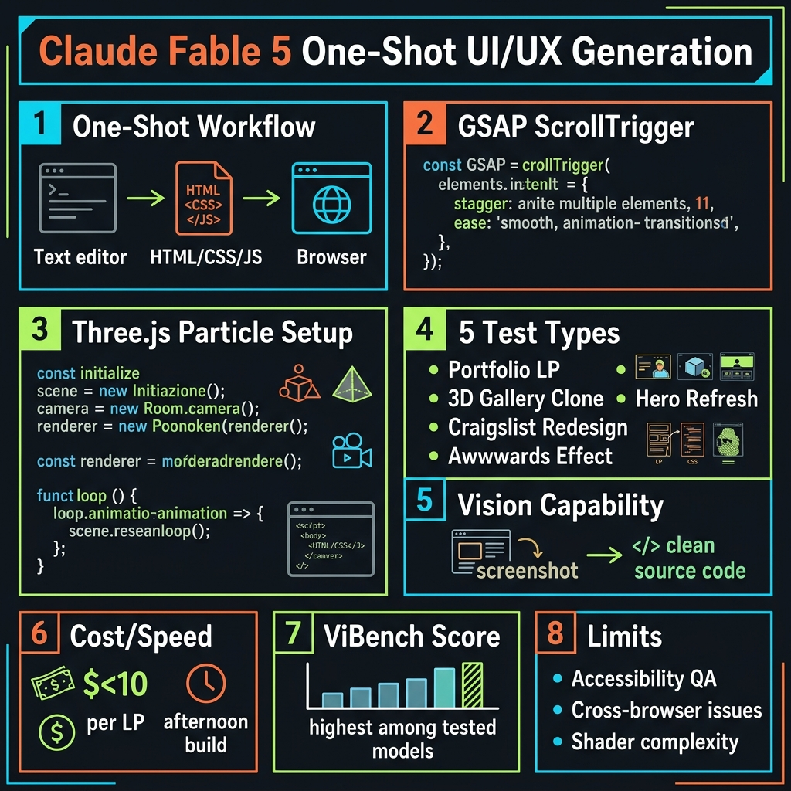

<!-- _class: title -->

# รีวิว Claude Fable 5: UI/UX One-Shot 5 Tests

นักออกแบบที่เขียนโค้ดไม่เป็น → สร้างหน้าเว็บ GSAP + 3JS ได้ในพรอมต์เดียว

<!-- Speaker: Fable 5 เปิดตัว 9 มิ.ย. 2026 — วันนี้ทดสอบ 5 scenarios จริงว่า one-shot UI ทำได้จริงแค่ไหน -->

---

<!-- _class: cheatsheet -->
<!-- _backgroundColor: #f8f7f4 -->

<!-- Speaker: Cheatsheet ครอบคลุมทั้งหมด — 5 tests, GSAP/Three.js patterns, ราคา, และ limits. -->

---

## One-Shot UI: Fable 5 เปลี่ยนสมการ Frontend

จาก "ต้องรู้ GSAP, Three.js, CSS Grid" → "อธิบายเป็นภาษาธรรมชาติ แล้วได้ HTML ที่รันได้"

<svg viewBox="0 0 1100 320" width="100%" xmlns="http://www.w3.org/2000/svg">
  <!-- callout-box: TL;DR summary -->
  <rect x="40" y="30" width="1020" height="260" rx="16" fill="var(--paper)" stroke="var(--soft-2)" stroke-width="1.5" style="filter:drop-shadow(0 4px 12px rgba(15,23,42,.08))"/>
  <rect x="40" y="30" width="8" height="260" rx="4" fill="var(--accent)"/>
  <!-- Icon circle -->
  <circle cx="130" cy="160" r="44" fill="var(--accent)" opacity=".1"/>
  <circle cx="130" cy="160" r="30" fill="var(--accent)"/>
  <text x="130" y="166" font-size="20" fill="var(--paper)" text-anchor="middle" dominant-baseline="central" font-family="system-ui" font-weight="700">5</text>
  <!-- Lines -->
  <text x="200" y="125" font-size="22" font-weight="700" fill="var(--ink)" font-family="system-ui">Claude Fable 5 — ViBench #1 for vibe-coding (Jun 2026)</text>
  <text x="200" y="162" font-size="16" fill="var(--ink-dim)" font-family="system-ui">GSAP ScrollTrigger, Three.js particles, CSS modern layout — all from one prompt</text>
  <text x="200" y="196" font-size="16" fill="var(--muted)" font-family="system-ui">Landing page prototype: under $10 · afternoon build · designer-native language</text>
  <!-- Right badge -->
  <rect x="840" y="55" width="180" height="48" rx="10" fill="var(--accent)" opacity=".1"/>
  <text x="930" y="84" font-size="13" font-weight="700" fill="var(--accent)" text-anchor="middle" font-family="system-ui">$10/M input</text>
  <rect x="840" y="115" width="180" height="48" rx="10" fill="var(--warning-wash)"/>
  <text x="930" y="144" font-size="13" font-weight="700" fill="var(--warning-ink)" text-anchor="middle" font-family="system-ui">$50/M output</text>
  <rect x="840" y="175" width="180" height="48" rx="10" fill="var(--success-wash)"/>
  <text x="930" y="204" font-size="13" font-weight="700" fill="var(--success-ink)" text-anchor="middle" font-family="system-ui">90% cache discount</text>
  <rect x="0" y="0" width="1" height="1" fill="none"/>
</svg>

<b>★ Takeaway:</b> Fable 5 one-shots UI ที่มี animation ซับซ้อนได้จริง — เปิดทางให้ designer ที่เขียนโค้ดไม่เป็นสร้าง prototype ได้ทันที

<!-- Speaker: นี่คือ summary ของทั้ง deck — ลงรายละเอียดแต่ละ test ต่อไป -->

---

## Designer + Code Gap: ปัญหาที่ Fable 5 แก้ได้

Feedback loop เดิมนาน — designer อธิบาย → dev เขียน → ผิด → วนซ้ำ

<svg viewBox="0 0 700 280" width="100%" xmlns="http://www.w3.org/2000/svg">
  <!-- arrow-flow: OLD loop vs NEW -->
  <!-- OLD path (red, top) -->
  <rect x="20" y="30" width="130" height="44" rx="8" fill="var(--danger-wash)" stroke="var(--danger)" stroke-width="1.5"/>
  <text x="85" y="57" font-size="13" font-weight="700" fill="var(--danger-ink)" text-anchor="middle" font-family="system-ui">Designer</text>
  <polygon points="155,52 175,52 175,48 190,52 175,56 175,52" fill="var(--danger)"/>
  <rect x="195" y="30" width="130" height="44" rx="8" fill="var(--danger-wash)" stroke="var(--danger)" stroke-width="1.5"/>
  <text x="260" y="57" font-size="13" font-weight="700" fill="var(--danger-ink)" text-anchor="middle" font-family="system-ui">Dev writes</text>
  <polygon points="330,52 350,52 350,48 365,52 350,56 350,52" fill="var(--danger)"/>
  <rect x="370" y="30" width="130" height="44" rx="8" fill="var(--danger-wash)" stroke="var(--danger)" stroke-width="1.5"/>
  <text x="435" y="57" font-size="13" font-weight="700" fill="var(--danger-ink)" text-anchor="middle" font-family="system-ui">Wrong</text>
  <path d="M500,52 Q600,52 600,90 Q600,100 585,100" fill="none" stroke="var(--danger)" stroke-width="1.5" stroke-dasharray="5,3"/>
  <path d="M85,74 Q85,95 85,95" fill="none" stroke="var(--danger)" stroke-width="1.5" stroke-dasharray="5,3"/>
  <text x="355" y="115" font-size="11" fill="var(--danger)" text-anchor="middle" font-family="system-ui">Repeat 5–10 times</text>
  <!-- NEW path (green, bottom) -->
  <rect x="20" y="170" width="130" height="44" rx="8" fill="var(--success-wash)" stroke="var(--success)" stroke-width="2"/>
  <text x="85" y="197" font-size="13" font-weight="700" fill="var(--success-ink)" text-anchor="middle" font-family="system-ui">Designer</text>
  <polygon points="155,192 185,192 185,188 205,192 185,196 185,192" fill="var(--success)"/>
  <rect x="210" y="170" width="160" height="44" rx="8" fill="var(--accent-wash)" stroke="var(--accent)" stroke-width="2"/>
  <text x="290" y="197" font-size="13" font-weight="700" fill="var(--accent-deep)" text-anchor="middle" font-family="system-ui">Fable 5 prompt</text>
  <polygon points="375,192 405,192 405,188 425,192 405,196 405,192" fill="var(--success)"/>
  <rect x="430" y="170" width="190" height="44" rx="8" fill="var(--success-wash)" stroke="var(--success)" stroke-width="2"/>
  <text x="525" y="197" font-size="13" font-weight="700" fill="var(--success-ink)" text-anchor="middle" font-family="system-ui">HTML+CSS+JS ready</text>
  <text x="355" y="240" font-size="11" fill="var(--success-ink)" text-anchor="middle" font-family="system-ui">One shot — under $10</text>
  <rect x="0" y="0" width="1" height="1" fill="none"/>
</svg>

<b>★ Takeaway:</b> Fable 5 ตัด feedback loop จาก 5–10 รอบ เหลือ 1 prompt → iterate จาก working code ได้ทันที

<!-- Speaker: เปรียบ old vs new workflow ก่อนลงรายละเอียด 5 tests -->

---

## Claude Fable 5: 3 ความสามารถหลัก

Flagship model ณ มิ.ย. 2026 — ออกแบบมาสำหรับงาน complex ที่ต้องแม่นยำสูง

  

    
Vision Reconstruction

    <h3>Screenshot → Code</h3>
    
สร้าง source code ของ web app ได้จาก screenshot เพียงอย่างเดียว — ไม่ต้องมี source

  

  

    
One-Shot Efficiency

    <h3>Intent over Syntax</h3>
    
เข้าใจ developer intent — "apps ที่ต้อง 100 prompts เมื่อปีก่อน ตอนนี้ one-shot ได้"

  

  

    
Long-Context Reasoning

    <h3>Millions of Tokens</h3>
    
รักษา focus ข้าม million tokens ใน long-running task — plan → sub-agent → self-check

  

<b>★ Takeaway:</b> Vision + one-shot + long-context รวมกันทำให้ Fable 5 สร้าง UI จาก URL ได้โดยตรง — ไม่ต้องมี source code

<!-- Speaker: 3 capabilities นี้คือ core ของทุก test ที่จะเห็น -->

---

## 5 Tests: จาก Portfolio ถึง Awwwards Effect

ทดสอบระดับความยากจาก landing page พื้นฐาน → clone effect รางวัลระดับ world-class

  

    
Test 1

    <h3>Portfolio Landing</h3>
    
Prompt → hero + work grid + scroll animation ครบในรอบเดียว เลือก stack เอง

  

  

    
Test 2

    <h3>3D Gallery Clone</h3>
    
URL → Three.js helix/carousel effect โดยไม่มี source code — vision reconstruction

  

  

    
Test 3

    <h3>Hero Refresh</h3>
    
Hero section เก่า → GSAP ScrollTrigger + parallax + gradient ที่ responsive

  

  

    
Test 4

    <h3>Craigslist Modern</h3>
    
URL → modern UI ที่ยังรักษา content architecture และ information hierarchy

  

  

    
Test 5

    <h3>Awwwards Effect</h3>
    
Award site URL → micro-interaction + custom cursor + GSAP + CSS properties clone

  

<b>★ Takeaway:</b> Tests ระดับ 1–5 เพิ่ม difficulty ชัดเจน — Test 5 ต้องใช้ GSAP + CSS custom properties + WebGL ในรอบเดียว

<!-- Speaker: แต่ละ test เพิ่ม complexity — สิ่งที่น่าสนใจคือ Fable 5 ผ่านได้ทุก level -->

---

## GSAP + Three.js: โค้ดที่ได้ใช้งานได้จริง

Pattern ที่ Fable 5 เขียนถูกต้องทั้ง parameters โดยไม่ต้องระบุ version หรือ CDN

<svg viewBox="0 0 1100 340" width="100%" xmlns="http://www.w3.org/2000/svg">
  <!-- Two columns: GSAP left, Three.js right -->
  <!-- GSAP panel -->
  <rect x="30" y="20" width="500" height="300" rx="12" fill="var(--paper)" stroke="var(--soft-2)" stroke-width="1.5" style="filter:drop-shadow(var(--shadow-sm))"/>
  <rect x="30" y="20" width="500" height="46" rx="12" fill="var(--accent)" opacity=".08"/>
  <text x="280" y="48" font-size="15" font-weight="700" fill="var(--accent)" text-anchor="middle" font-family="system-ui">GSAP ScrollTrigger</text>
  <!-- Code lines (English only in SVG) -->
  <text x="55" y="90" font-size="12" fill="var(--ink-dim)" font-family="monospace">gsap.from(".feature-card", {</text>
  <text x="55" y="112" font-size="12" fill="var(--muted)" font-family="monospace">  scrollTrigger: { trigger: ".section",</text>
  <text x="55" y="134" font-size="12" fill="var(--muted)" font-family="monospace">    start: "top 80%" },</text>
  <text x="55" y="156" font-size="12" fill="var(--accent)" font-family="monospace">  y: 40, opacity: 0, duration: 0.7,</text>
  <text x="55" y="178" font-size="12" fill="var(--accent)" font-family="monospace">  stagger: 0.15, ease: "power2.out"</text>
  <text x="55" y="200" font-size="12" fill="var(--ink-dim)" font-family="monospace">});</text>
  <!-- Badges -->
  <rect x="55" y="230" width="90" height="28" rx="6" fill="var(--success-wash)"/>
  <text x="100" y="248" font-size="11" font-weight="700" fill="var(--success-ink)" text-anchor="middle" font-family="system-ui">trigger OK</text>
  <rect x="160" y="230" width="90" height="28" rx="6" fill="var(--success-wash)"/>
  <text x="205" y="248" font-size="11" font-weight="700" fill="var(--success-ink)" text-anchor="middle" font-family="system-ui">stagger OK</text>
  <rect x="265" y="230" width="90" height="28" rx="6" fill="var(--success-wash)"/>
  <text x="310" y="248" font-size="11" font-weight="700" fill="var(--success-ink)" text-anchor="middle" font-family="system-ui">ease OK</text>
  <!-- Three.js panel -->
  <rect x="570" y="20" width="500" height="300" rx="12" fill="var(--paper)" stroke="var(--soft-2)" stroke-width="1.5" style="filter:drop-shadow(var(--shadow-sm))"/>
  <rect x="570" y="20" width="500" height="46" rx="12" fill="var(--gold)" opacity=".12"/>
  <text x="820" y="48" font-size="15" font-weight="700" fill="var(--warning-ink)" text-anchor="middle" font-family="system-ui">Three.js Particle Field</text>
  <text x="595" y="90" font-size="12" fill="var(--ink-dim)" font-family="monospace">const scene = new THREE.Scene();</text>
  <text x="595" y="112" font-size="12" fill="var(--muted)" font-family="monospace">const camera = new THREE.PerspectiveCamera</text>
  <text x="595" y="134" font-size="12" fill="var(--muted)" font-family="monospace">  (75, w/h, 0.1, 1000);</text>
  <text x="595" y="156" font-size="12" fill="var(--warning-ink)" font-family="monospace">// 2,000 particles in rotating sphere</text>
  <text x="595" y="178" font-size="12" fill="var(--accent)" font-family="monospace">renderer.setAnimationLoop(animate);</text>
  <rect x="595" y="220" width="110" height="28" rx="6" fill="var(--accent-wash)"/>
  <text x="650" y="238" font-size="11" font-weight="700" fill="var(--accent-deep)" text-anchor="middle" font-family="system-ui">scene setup OK</text>
  <rect x="720" y="220" width="100" height="28" rx="6" fill="var(--accent-wash)"/>
  <text x="770" y="238" font-size="11" font-weight="700" fill="var(--accent-deep)" text-anchor="middle" font-family="system-ui">loop OK</text>
  <rect x="835" y="220" width="110" height="28" rx="6" fill="var(--accent-wash)"/>
  <text x="890" y="238" font-size="11" font-weight="700" fill="var(--accent-deep)" text-anchor="middle" font-family="system-ui">geometry OK</text>
  <rect x="0" y="0" width="1" height="1" fill="none"/>
</svg>

<b>★ Takeaway:</b> Fable 5 เขียน GSAP + Three.js ได้ถูกต้องทุก parameter โดยไม่ต้องบอก version — โค้ดที่ได้รันได้ทันทีในทุก browser

<!-- Speaker: สิ่งที่น่าแปลกใจคือ parameters ถูกต้องทั้งหมด — ไม่ใช่แค่ syntax แต่ semantic ด้วย -->

---

## One-Shot ลด Feedback Loop: สำคัญสำหรับ Designer

ปัญหาไม่ใช่ "ไม่รู้ syntax" — ปัญหาคือ loop ที่ยาวระหว่าง idea กับ working code

<svg viewBox="0 0 700 260" width="100%" xmlns="http://www.w3.org/2000/svg">
  <!-- Horizontal flow: visual language → Fable 5 → HTML runs -->
  <rect x="20" y="80" width="160" height="100" rx="10" fill="var(--soft)" stroke="var(--soft-2)" stroke-width="1.5"/>
  <text x="100" y="118" font-size="13" font-weight="700" fill="var(--ink)" text-anchor="middle" font-family="system-ui">Visual Language</text>
  <text x="100" y="140" font-size="11" fill="var(--muted)" text-anchor="middle" font-family="system-ui">"helix gallery"</text>
  <text x="100" y="158" font-size="11" fill="var(--muted)" text-anchor="middle" font-family="system-ui">"frosted glass card"</text>
  <polygon points="185,130 215,130 215,125 235,130 215,135 215,130" fill="var(--accent)"/>
  <rect x="240" y="80" width="180" height="100" rx="10" fill="var(--accent)" opacity=".1" stroke="var(--accent)" stroke-width="2"/>
  <text x="330" y="122" font-size="14" font-weight="700" fill="var(--accent)" text-anchor="middle" font-family="system-ui">Fable 5</text>
  <text x="330" y="142" font-size="11" fill="var(--ink-dim)" text-anchor="middle" font-family="system-ui">One prompt</text>
  <text x="330" y="160" font-size="11" fill="var(--muted)" text-anchor="middle" font-family="system-ui">no code knowledge needed</text>
  <polygon points="425,130 455,130 455,125 475,130 455,135 455,130" fill="var(--success)"/>
  <rect x="480" y="80" width="190" height="100" rx="10" fill="var(--success-wash)" stroke="var(--success)" stroke-width="2"/>
  <text x="575" y="122" font-size="13" font-weight="700" fill="var(--success-ink)" text-anchor="middle" font-family="system-ui">HTML+CSS+JS</text>
  <text x="575" y="142" font-size="11" fill="var(--success-ink)" text-anchor="middle" font-family="system-ui">Runs in browser</text>
  <text x="575" y="160" font-size="11" fill="var(--muted)" text-anchor="middle" font-family="system-ui">Ready to iterate</text>
  <rect x="0" y="0" width="1" height="1" fill="none"/>
</svg>

<b>★ Takeaway:</b> Designer ป้อน visual language ที่ตัวเองคุ้นเคย → ได้ working code ทันที — iterate จาก quality starting point ไม่ใช่ blank page

<!-- Speaker: นี่คือ insight สำคัญที่สุด — Fable 5 พูดภาษา designer ได้ -->

---

## Caveats: สิ่งที่ One-Shot ยังทำไม่ได้

Output คือ prototype-quality — ต้องมี QA ก่อน deploy production จริง

  

    
Production Gap

    <h3>QA ยังต้องทำ</h3>
    
ต้องทดสอบ WCAG accessibility, cross-browser, performance optimization ก่อน deploy จริง

  

  

    
Three.js Ceiling

    <h3>Shader ซับซ้อน</h3>
    
Particle/geometry ได้ดี แต่ PBR material, shadow, complex GLSL shader ยังต้อง iteration

  

  

    
Cost at Scale

    <h3>$50/M output</h3>
    
Generate-and-throw-away workflow ราคาสะสมสูง — เหมาะกับ one-shot ไม่ใช่ batch generation

  

<b>★ Takeaway:</b> Fable 5 ≠ Claude Design — ทำงานผ่าน API/code เท่านั้น ไม่มี drag-and-drop; one-shot output ต้องผ่าน QA ก่อน production

<!-- Speaker: สิ่งสำคัญ — Fable 5 เป็น prototype accelerator ไม่ใช่ production publisher -->

---

## Key Takeaways

สิ่งที่ designer + developer ควรจำจาก 5 tests นี้

<svg viewBox="0 0 1100 320" width="100%" xmlns="http://www.w3.org/2000/svg">
  <!-- concentric rings summary -->
  <circle cx="550" cy="160" r="150" fill="none" stroke="var(--soft-2)" stroke-width="1.5"/>
  <circle cx="550" cy="160" r="100" fill="none" stroke="var(--accent)" stroke-width="1.5" opacity=".35"/>
  <circle cx="550" cy="160" r="55" fill="var(--accent)" opacity=".1"/>
  <circle cx="550" cy="160" r="55" fill="none" stroke="var(--accent)" stroke-width="2"/>
  <text x="550" y="153" font-size="13" font-weight="700" fill="var(--accent)" text-anchor="middle" font-family="system-ui">One-Shot</text>
  <text x="550" y="172" font-size="11" fill="var(--ink)" text-anchor="middle" font-family="system-ui">UI works</text>
  <!-- Ring 2 labels -->
  <text x="380" y="90" font-size="12" fill="var(--ink)" font-family="system-ui" text-anchor="middle">GSAP + 3JS</text>
  <text x="380" y="108" font-size="11" fill="var(--muted)" font-family="system-ui" text-anchor="middle">code-correct</text>
  <text x="720" y="90" font-size="12" fill="var(--ink)" font-family="system-ui" text-anchor="middle">Vision Clone</text>
  <text x="720" y="108" font-size="11" fill="var(--muted)" font-family="system-ui" text-anchor="middle">URL → UI</text>
  <!-- Outer ring labels -->
  <text x="210" y="155" font-size="11" fill="var(--muted)" font-family="system-ui" text-anchor="middle">Under $10</text>
  <text x="210" y="172" font-size="11" fill="var(--muted)" font-family="system-ui" text-anchor="middle">per page</text>
  <text x="890" y="155" font-size="11" fill="var(--muted)" font-family="system-ui" text-anchor="middle">Prototype</text>
  <text x="890" y="172" font-size="11" fill="var(--muted)" font-family="system-ui" text-anchor="middle">not prod</text>
  <text x="550" y="310" font-size="11" fill="var(--muted)" font-family="system-ui" text-anchor="middle">QA still required · Claude Design (Opus 4.7) is a separate product</text>
  <rect x="0" y="0" width="1" height="1" fill="none"/>
</svg>

<b>★ Takeaway:</b> Fable 5 แปลง visual language เป็น working HTML ได้โดยตรง — เครื่องมือทรงพลังสำหรับนักออกแบบที่เขียนโค้ดไม่เป็น

<!-- Speaker: จุดศูนย์กลางคือ one-shot works — ล้อมด้วย technical proof และ practical limits -->
