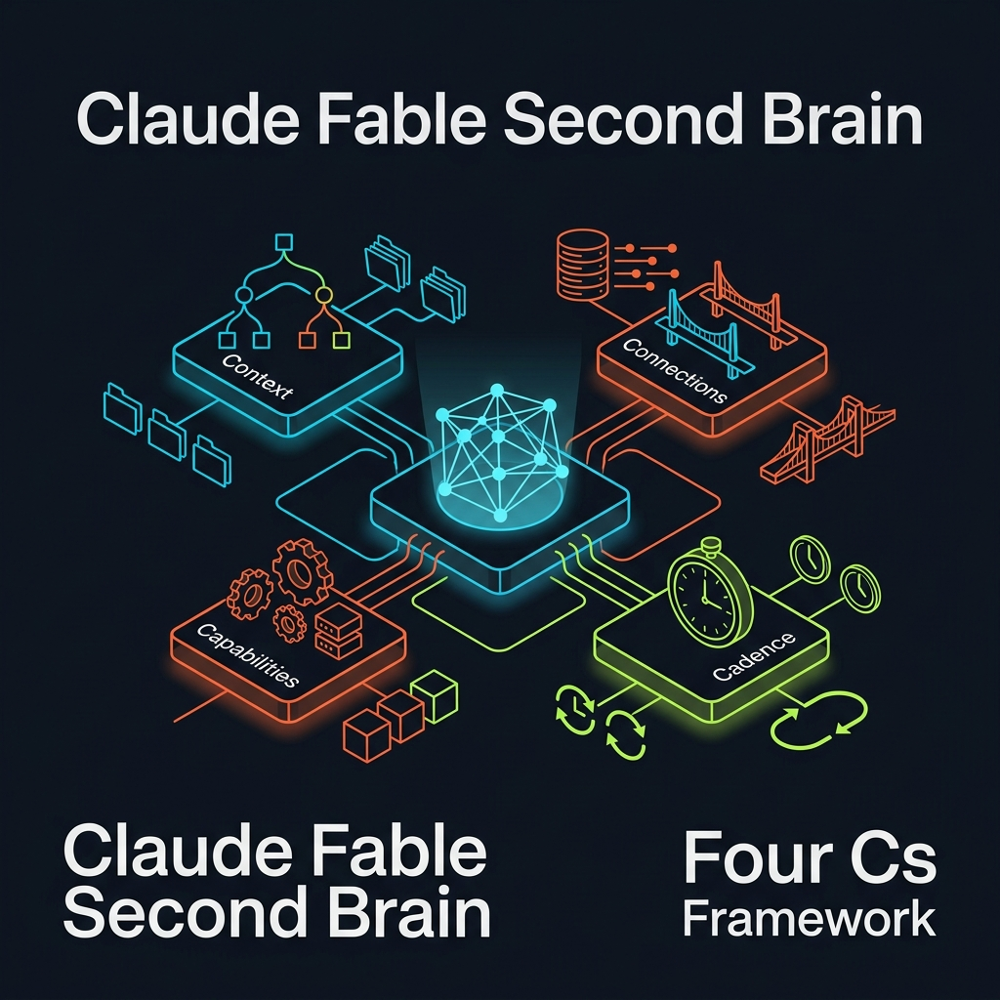
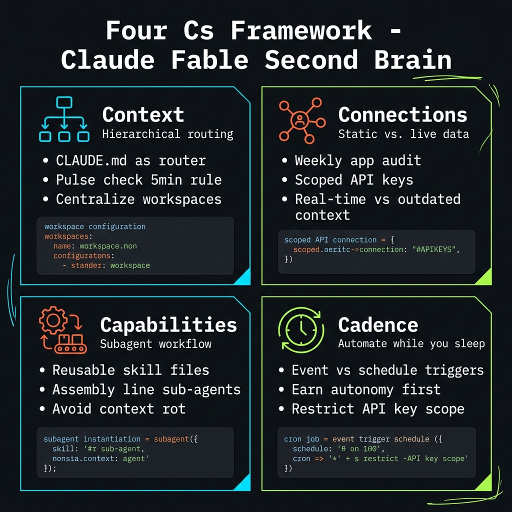
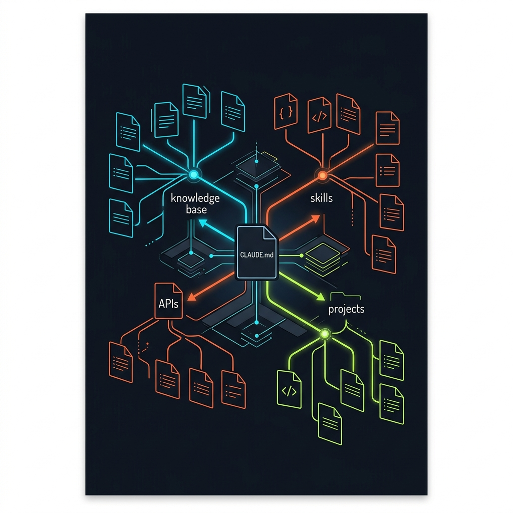

<!-- _class: title -->

# เจาะลึก: สร้าง Second Brain ด้วย Claude Fable และ Four Cs Framework

Context · Connections · Capabilities · Cadence — สร้าง AI Operating System ส่วนตัว

<!-- Speaker: 4 building blocks, 2 layers — second brain first, then AI OS on top. Each C must be built in order. -->

---

<!-- _class: cheatsheet -->
<!-- _backgroundColor: #f8f7f4 -->

<!-- Speaker: 60-second cheatsheet orientation. Top row = Second Brain layer (Context + Connections). Bottom row = AIOS layer (Capabilities + Cadence). Walk each quadrant before advancing. -->

---

## Four Cs: Two Layers, One System

Framework ของ Nate Herkelman — สร้าง second brain ก่อน จากนั้น automate ทีหลัง

<svg viewBox="0 0 1100 320" width="100%" xmlns="http://www.w3.org/2000/svg">
  <!-- Layer 1: Second Brain -->
  <rect x="40" y="20" width="490" height="130" rx="14" fill="var(--accent-wash)" stroke="var(--accent)" stroke-width="2"/>
  <text x="285" y="52" font-size="13" font-weight="700" fill="var(--accent)" text-anchor="middle" font-family="system-ui" letter-spacing=".06em">SECOND BRAIN — Layer 1</text>
  <rect x="70" y="66" width="200" height="64" rx="10" fill="var(--paper)" stroke="var(--accent)" stroke-width="1.5"/>
  <text x="170" y="96" font-size="17" font-weight="700" fill="var(--accent)" text-anchor="middle" font-family="system-ui">Context</text>
  <text x="170" y="118" font-size="13" fill="var(--ink-dim)" text-anchor="middle" font-family="system-ui">Routing Tree</text>
  <rect x="300" y="66" width="200" height="64" rx="10" fill="var(--paper)" stroke="var(--accent)" stroke-width="1.5"/>
  <text x="400" y="96" font-size="17" font-weight="700" fill="var(--accent)" text-anchor="middle" font-family="system-ui">Connections</text>
  <text x="400" y="118" font-size="13" fill="var(--ink-dim)" text-anchor="middle" font-family="system-ui">Static + Live Data</text>
  <!-- Layer 2: AIOS -->
  <rect x="570" y="20" width="490" height="130" rx="14" fill="var(--success-wash)" stroke="var(--success)" stroke-width="2"/>
  <text x="815" y="52" font-size="13" font-weight="700" fill="var(--success)" text-anchor="middle" font-family="system-ui" letter-spacing=".06em">AI OPERATING SYSTEM — Layer 2</text>
  <rect x="600" y="66" width="200" height="64" rx="10" fill="var(--paper)" stroke="var(--success)" stroke-width="1.5"/>
  <text x="700" y="96" font-size="17" font-weight="700" fill="var(--success)" text-anchor="middle" font-family="system-ui">Capabilities</text>
  <text x="700" y="118" font-size="13" fill="var(--ink-dim)" text-anchor="middle" font-family="system-ui">Skills + Workflows</text>
  <rect x="830" y="66" width="200" height="64" rx="10" fill="var(--paper)" stroke="var(--success)" stroke-width="1.5"/>
  <text x="930" y="96" font-size="17" font-weight="700" fill="var(--success)" text-anchor="middle" font-family="system-ui">Cadence</text>
  <text x="930" y="118" font-size="13" fill="var(--ink-dim)" text-anchor="middle" font-family="system-ui">Automation</text>
  <!-- Arrow between layers -->
  <line x1="535" y1="85" x2="565" y2="85" stroke="var(--muted)" stroke-width="2"/>
  <polygon points="565,79 579,85 565,91" fill="var(--muted)"/>
  <!-- Caption boxes -->
  <rect x="40" y="175" width="490" height="120" rx="12" fill="var(--soft)"/>
  <text x="285" y="205" font-size="15" font-weight="600" fill="var(--ink)" text-anchor="middle" font-family="system-ui">Know yourself + reach live data</text>
  <text x="285" y="230" font-size="13" fill="var(--ink-dim)" text-anchor="middle" font-family="system-ui">AI answers questions about you &amp; your business</text>
  <text x="285" y="268" font-size="12" fill="var(--muted)" text-anchor="middle" font-family="system-ui">Gut check: does it sound like a stranger or a co-founder?</text>
  <rect x="570" y="175" width="490" height="120" rx="12" fill="var(--soft)"/>
  <text x="815" y="205" font-size="15" font-weight="600" fill="var(--ink)" text-anchor="middle" font-family="system-ui">Execute tasks + run autonomously</text>
  <text x="815" y="230" font-size="13" fill="var(--ink-dim)" text-anchor="middle" font-family="system-ui">AI does your work — not just responds to prompts</text>
  <text x="815" y="268" font-size="12" fill="var(--muted)" text-anchor="middle" font-family="system-ui">Skills + automation running even while you sleep</text>
  <rect x="0" y="0" width="1" height="1" fill="none"/>
</svg>

<b>★ Takeaway:</b> ต้องสร้างตามลำดับ — ข้ามขั้นไม่ได้ ไม่มี second brain = ไม่มี AIOS ที่น่าเชื่อถือ

<!-- Speaker: First 2 Cs = knowledge. Last 2 Cs = action. Can't automate what the AI doesn't know. -->

---

## Mindset Shift: จาก Chatbot เป็น Co-founder

The fundamental reframe that makes everything else work

  

    
Before

    <h3>Chatbot mindset</h3>
    
ถาม → รับคำตอบ → ปิด session ทิ้ง ไม่มี memory ไม่มี context ถามใหม่ทุกครั้ง

  

  

    
After

    <h3>Co-founder mindset</h3>
    
AI รู้จักคุณ รู้จักธุรกิจ รู้จัก goals ทำงานร่วมกันแบบ teammates — ไม่ใช่แค่ tool

  

  

    
Gut Check

    <h3>Stranger or teammate?</h3>
    
เปิด Claude Code แล้วถามเรื่องตัวเอง — คำตอบฟังดูเหมือน "คนแปลกหน้า" หรือ "เพื่อนร่วมงาน"?

  

  

    
Platform

    <h3>Default to Claude Code</h3>
    
Nate: ใช้ Claude Code เป็น default สำหรับทุกงาน — ไม่ใช่ browser ทำงานทุกอย่างผ่าน AIOS แทน

  

<b>★ Takeaway:</b> Mindset ต้องเปลี่ยนก่อน tool — ถ้ายังมอง Claude เป็น chatbot จะไม่ได้ผลจาก Four Cs

<!-- Speaker: Nate's CLAUDE.md literally starts with "you are my executive assistant." That intent changes everything downstream. -->

---

## Context: CLAUDE.md as Your Routing Tree

Not a system prompt — a map that points your agent to everything it needs

<svg viewBox="0 0 700 290" width="100%" xmlns="http://www.w3.org/2000/svg">
  <!-- Central CLAUDE.md box -->
  <rect x="240" y="10" width="200" height="54" rx="10" fill="var(--accent)" />
  <text x="340" y="34" font-size="15" font-weight="700" fill="white" text-anchor="middle" font-family="system-ui">CLAUDE.md</text>
  <text x="340" y="54" font-size="12" fill="rgba(255,255,255,.8)" text-anchor="middle" font-family="system-ui">Router / Index</text>
  <!-- Lines from center -->
  <line x1="240" y1="37" x2="150" y2="105" stroke="var(--muted)" stroke-width="1.5" stroke-dasharray="5,3"/>
  <line x1="290" y1="64" x2="200" y2="120" stroke="var(--muted)" stroke-width="1.5" stroke-dasharray="5,3"/>
  <line x1="340" y1="64" x2="340" y2="120" stroke="var(--muted)" stroke-width="1.5" stroke-dasharray="5,3"/>
  <line x1="390" y1="64" x2="470" y2="120" stroke="var(--muted)" stroke-width="1.5" stroke-dasharray="5,3"/>
  <line x1="440" y1="37" x2="540" y2="105" stroke="var(--muted)" stroke-width="1.5" stroke-dasharray="5,3"/>
  <!-- Leaf boxes -->
  <rect x="60" y="105" width="160" height="50" rx="8" fill="var(--soft)" stroke="var(--soft-2)" stroke-width="1.5"/>
  <text x="140" y="128" font-size="13" font-weight="600" fill="var(--ink)" text-anchor="middle" font-family="system-ui">Wiki / Notes</text>
  <text x="140" y="146" font-size="11" fill="var(--muted)" text-anchor="middle" font-family="system-ui">Knowledge Base</text>
  <rect x="110" y="170" width="160" height="50" rx="8" fill="var(--soft)" stroke="var(--soft-2)" stroke-width="1.5"/>
  <text x="190" y="193" font-size="13" font-weight="600" fill="var(--ink)" text-anchor="middle" font-family="system-ui">API Keys</text>
  <text x="190" y="211" font-size="11" fill="var(--muted)" text-anchor="middle" font-family="system-ui">Credential Paths</text>
  <rect x="250" y="120" width="160" height="50" rx="8" fill="var(--soft)" stroke="var(--soft-2)" stroke-width="1.5"/>
  <text x="330" y="143" font-size="13" font-weight="600" fill="var(--ink)" text-anchor="middle" font-family="system-ui">Skills</text>
  <text x="330" y="161" font-size="11" fill="var(--muted)" text-anchor="middle" font-family="system-ui">Active Workflows</text>
  <rect x="390" y="170" width="160" height="50" rx="8" fill="var(--soft)" stroke="var(--soft-2)" stroke-width="1.5"/>
  <text x="470" y="193" font-size="13" font-weight="600" fill="var(--ink)" text-anchor="middle" font-family="system-ui">Projects</text>
  <text x="470" y="211" font-size="11" fill="var(--muted)" text-anchor="middle" font-family="system-ui">Active Sub-repos</text>
  <rect x="470" y="105" width="160" height="50" rx="8" fill="var(--soft)" stroke="var(--soft-2)" stroke-width="1.5"/>
  <text x="550" y="128" font-size="13" font-weight="600" fill="var(--ink)" text-anchor="middle" font-family="system-ui">Sub-agents</text>
  <text x="550" y="146" font-size="11" fill="var(--muted)" text-anchor="middle" font-family="system-ui">Agent Configs</text>
  <!-- Pulse check badge -->
  <rect x="50" y="235" width="600" height="44" rx="8" fill="var(--warning-wash)" stroke="var(--warning)" stroke-width="1.5"/>
  <text x="350" y="252" font-size="13" font-weight="700" fill="var(--warning-ink)" text-anchor="middle" font-family="system-ui">Pulse Check: if AI takes &gt;5 min to find a known file</text>
  <text x="350" y="270" font-size="12" fill="var(--warning-ink)" text-anchor="middle" font-family="system-ui">— architecture needs reorganization</text>
  <rect x="0" y="0" width="1" height="1" fill="none"/>
</svg>

<b>★ Takeaway:</b> CLAUDE.md ที่ดีไม่ได้อธิบายว่า AI คือใคร — มันชี้ทาง AI ไปหาทุกอย่าง

<!-- Speaker: Nate's CLAUDE.md: wiki path, hot cache, master index, API key locations, skill directory, active project pointers. It's a sitemap, not instructions. -->

---

## Connections: Static vs Live Data

CLAUDE.md stores what you wrote once — Connections pull what's true right now

<svg viewBox="0 0 1100 280" width="100%" xmlns="http://www.w3.org/2000/svg">
  <!-- Static box -->
  <rect x="40" y="20" width="440" height="230" rx="14" fill="var(--paper)" stroke="var(--soft-2)" stroke-width="1.5" style="filter:drop-shadow(var(--shadow-sm))"/>
  <rect x="40" y="20" width="440" height="52" rx="14" fill="var(--soft)"/>
  <text x="260" y="52" font-size="16" font-weight="700" fill="var(--ink-dim)" text-anchor="middle" font-family="system-ui">STATIC (Context)</text>
  <text x="80" y="100" font-size="14" fill="var(--ink)" font-family="system-ui">SOPs, background, bios</text>
  <text x="80" y="126" font-size="14" fill="var(--ink-dim)" font-family="system-ui">Written once, updated manually</text>
  <text x="80" y="152" font-size="14" fill="var(--ink-dim)" font-family="system-ui">Example: 620k subscribers</text>
  <rect x="60" y="175" width="400" height="52" rx="8" fill="var(--danger-wash)"/>
  <text x="260" y="197" font-size="13" fill="var(--danger-ink)" font-family="system-ui" text-anchor="middle" font-weight="600">Risk: goes stale immediately</text>
  <text x="260" y="215" font-size="12" fill="var(--danger-ink)" font-family="system-ui" text-anchor="middle">Cannot reflect real-time business state</text>
  <!-- Arrow between -->
  <text x="543" y="152" font-size="30" fill="var(--accent)" text-anchor="middle" font-family="system-ui">+</text>
  <!-- Live box -->
  <rect x="620" y="20" width="440" height="230" rx="14" fill="var(--paper)" stroke="var(--accent)" stroke-width="2" style="filter:drop-shadow(var(--shadow-md))"/>
  <rect x="620" y="20" width="440" height="52" rx="14" fill="var(--accent-wash)"/>
  <text x="840" y="52" font-size="16" font-weight="700" fill="var(--accent)" text-anchor="middle" font-family="system-ui">LIVE (Connections)</text>
  <text x="660" y="100" font-size="14" fill="var(--ink)" font-family="system-ui">Revenue, subscribers, calendar</text>
  <text x="660" y="126" font-size="14" fill="var(--ink-dim)" font-family="system-ui">API / CLI endpoints, scoped keys</text>
  <text x="660" y="152" font-size="14" fill="var(--ink-dim)" font-family="system-ui">Example: 800k actual subscribers</text>
  <rect x="640" y="175" width="400" height="52" rx="8" fill="var(--success-wash)"/>
  <text x="840" y="197" font-size="13" fill="var(--success-ink)" font-family="system-ui" text-anchor="middle" font-weight="600">Always accurate at query time</text>
  <text x="840" y="215" font-size="12" fill="var(--success-ink)" font-family="system-ui" text-anchor="middle">Google Workspace, QuickBooks, Stripe, Slack</text>
  <rect x="0" y="0" width="1" height="1" fill="none"/>
</svg>

<b>★ Takeaway:</b> ใช้ scoped API keys เสมอ — key ที่อ่านได้แต่ลบไม่ได้ จำกัด blast radius ตั้งแต่แรก

<!-- Speaker: Nate showed live: Claude said he had 620k subscribers from static memory. Real count was ~800k. Live connection fixes this. Audit: what do you open every week? Connect those. -->

---

## Capabilities: Build Your Assembly Line

Stop opening browsers — default to AIOS for every task; chain agents to avoid context rot

<svg viewBox="0 0 1100 270" width="100%" xmlns="http://www.w3.org/2000/svg">
  <!-- Step 1: Single massive prompt (bad) -->
  <rect x="40" y="20" width="1020" height="64" rx="10" fill="var(--danger-wash)" stroke="var(--danger)" stroke-width="1.5"/>
  <text x="100" y="48" font-size="14" font-weight="700" fill="var(--danger-ink)" font-family="system-ui">Bad: One massive prompt</text>
  <text x="340" y="48" font-size="14" fill="var(--danger-ink)" font-family="system-ui">— research + draft + polish in one context = context rot</text>
  <text x="940" y="52" font-size="20" fill="var(--danger)" text-anchor="middle" font-family="system-ui">✕</text>
  <!-- Step 2: Assembly line (good) -->
  <!-- Box 1 -->
  <rect x="40" y="130" width="200" height="80" rx="12" fill="var(--soft)" stroke="var(--accent)" stroke-width="2"/>
  <text x="140" y="164" font-size="16" font-weight="700" fill="var(--accent)" text-anchor="middle" font-family="system-ui">Research</text>
  <text x="140" y="186" font-size="13" fill="var(--ink-dim)" text-anchor="middle" font-family="system-ui">Agent</text>
  <!-- Arrow + clear -->
  <line x1="242" y1="170" x2="330" y2="170" stroke="var(--muted)" stroke-width="2"/>
  <polygon points="330,164 344,170 330,176" fill="var(--muted)"/>
  <rect x="254" y="148" width="76" height="28" rx="6" fill="var(--warning-wash)" stroke="var(--warning)" stroke-width="1"/>
  <text x="292" y="167" font-size="11" fill="var(--warning-ink)" text-anchor="middle" font-family="system-ui">clear ctx</text>
  <!-- Box 2 -->
  <rect x="344" y="130" width="200" height="80" rx="12" fill="var(--soft)" stroke="var(--accent)" stroke-width="2"/>
  <text x="444" y="164" font-size="16" font-weight="700" fill="var(--accent)" text-anchor="middle" font-family="system-ui">Draft</text>
  <text x="444" y="186" font-size="13" fill="var(--ink-dim)" text-anchor="middle" font-family="system-ui">Agent</text>
  <!-- Arrow + clear -->
  <line x1="546" y1="170" x2="634" y2="170" stroke="var(--muted)" stroke-width="2"/>
  <polygon points="634,164 648,170 634,176" fill="var(--muted)"/>
  <rect x="558" y="148" width="76" height="28" rx="6" fill="var(--warning-wash)" stroke="var(--warning)" stroke-width="1"/>
  <text x="596" y="167" font-size="11" fill="var(--warning-ink)" text-anchor="middle" font-family="system-ui">clear ctx</text>
  <!-- Box 3 -->
  <rect x="648" y="130" width="200" height="80" rx="12" fill="var(--soft)" stroke="var(--accent)" stroke-width="2"/>
  <text x="748" y="164" font-size="16" font-weight="700" fill="var(--accent)" text-anchor="middle" font-family="system-ui">Polish</text>
  <text x="748" y="186" font-size="13" fill="var(--ink-dim)" text-anchor="middle" font-family="system-ui">Agent</text>
  <!-- Output box -->
  <line x1="850" y1="170" x2="920" y2="170" stroke="var(--muted)" stroke-width="2"/>
  <polygon points="920,164 934,170 920,176" fill="var(--muted)"/>
  <rect x="934" y="138" width="136" height="64" rx="10" fill="var(--success-wash)" stroke="var(--success)" stroke-width="1.5"/>
  <text x="1002" y="165" font-size="14" font-weight="700" fill="var(--success-ink)" text-anchor="middle" font-family="system-ui">Clean</text>
  <text x="1002" y="185" font-size="13" fill="var(--success-ink)" text-anchor="middle" font-family="system-ui">Output</text>
  <!-- Good label -->
  <text x="40" y="122" font-size="14" font-weight="700" fill="var(--success-ink)" font-family="system-ui">Good: Specialized assembly line</text>
  <rect x="0" y="0" width="1" height="1" fill="none"/>
</svg>

<b>★ Takeaway:</b> Skills = capital ที่สะสม — ทุก prompt ซ้ำที่บันทึกเป็น skill ปรับปรุงทุก run = compound value

<!-- Speaker: Nate's "Grill Me" skill = 15-30 relentless questions to extract undocumented knowledge from your head. Assembly line: each agent gets fresh context. No context rot. -->

---

## Cadence: "Earn Autonomy" Before You Sleep

Automating before battle-testing = risk. Nate learned this the hard way.

  

    
Trigger types

    <h3>Event + Schedule</h3>
    
<strong>Event:</strong> ลูกค้าจอง call → agent เตรียม brief <strong>Schedule:</strong> ทุกอาทิตย์คืน → สรุปสัปดาห์

    
Tools: Claude Code routines, Modal TypeScript, n8n

  

  

    
Real failure story

    <h3>150,000 email accident</h3>
    
Agent misunderstood task → sent discount code to <strong>150k–200k people</strong> because it physically had email API keys.

    
Lesson: text prompt is NOT a permission layer.

  

  

    
Rule

    <h3>Earn Autonomy</h3>
    
battle-test skill แบบ manual อย่างน้อย 1–2 สัปดาห์ ก่อนให้ run อัตโนมัติ

  

  

    
Security principle

    <h3>Scoped Keys Only</h3>
    
ถ้า AI เข้าถึง database ได้จริง — สมมติว่ามันจะทำ ให้ physical keys แบบ scoped เท่านั้น

  

<b>★ Takeaway:</b> Autonomy is earned, not given — restrict physical API access; blast radius is real

<!-- Speaker: The email story is real. 150-200k people got a discount code. The model had the keys. The text prompt saying "only email confirmed purchases" wasn't enforced at the key level. -->

---

## User Guide: 5 Steps to Your AIOS

Build in order — each step depends on the previous one being solid

<svg viewBox="0 0 1100 230" width="100%" xmlns="http://www.w3.org/2000/svg">
  <!-- Step boxes with sequential arrows -->
  <!-- Step 1 -->
  <rect x="20" y="40" width="175" height="150" rx="12" fill="var(--soft)" stroke="var(--accent)" stroke-width="2"/>
  <circle cx="107" cy="68" r="18" fill="var(--accent)"/>
  <text x="107" y="74" font-size="14" font-weight="700" fill="white" text-anchor="middle" font-family="system-ui">1</text>
  <text x="107" y="108" font-size="13" font-weight="700" fill="var(--ink)" text-anchor="middle" font-family="system-ui">Foundation</text>
  <text x="107" y="128" font-size="11" fill="var(--ink-dim)" text-anchor="middle" font-family="system-ui">Install Claude Code</text>
  <text x="107" y="148" font-size="11" fill="var(--ink-dim)" text-anchor="middle" font-family="system-ui">Create AIOS folder</text>
  <text x="107" y="168" font-size="11" fill="var(--ink-dim)" text-anchor="middle" font-family="system-ui">Centralize projects</text>
  <!-- Arrow 1-2 -->
  <polygon points="198,109 212,115 198,121" fill="var(--muted)"/>
  <line x1="196" y1="115" x2="198" y2="115" stroke="var(--muted)" stroke-width="2"/>
  <!-- Step 2 -->
  <rect x="215" y="40" width="175" height="150" rx="12" fill="var(--soft)" stroke="var(--accent)" stroke-width="2"/>
  <circle cx="302" cy="68" r="18" fill="var(--accent)"/>
  <text x="302" y="74" font-size="14" font-weight="700" fill="white" text-anchor="middle" font-family="system-ui">2</text>
  <text x="302" y="108" font-size="13" font-weight="700" fill="var(--ink)" text-anchor="middle" font-family="system-ui">Context</text>
  <text x="302" y="128" font-size="11" fill="var(--ink-dim)" text-anchor="middle" font-family="system-ui">Write CLAUDE.md</text>
  <text x="302" y="148" font-size="11" fill="var(--ink-dim)" text-anchor="middle" font-family="system-ui">Map all file paths</text>
  <text x="302" y="168" font-size="11" fill="var(--ink-dim)" text-anchor="middle" font-family="system-ui">Pulse check: &lt;5 min</text>
  <!-- Arrow 2-3 -->
  <polygon points="393,109 407,115 393,121" fill="var(--muted)"/>
  <line x1="391" y1="115" x2="393" y2="115" stroke="var(--muted)" stroke-width="2"/>
  <!-- Step 3 -->
  <rect x="410" y="40" width="175" height="150" rx="12" fill="var(--soft)" stroke="var(--accent)" stroke-width="2"/>
  <circle cx="497" cy="68" r="18" fill="var(--accent)"/>
  <text x="497" y="74" font-size="14" font-weight="700" fill="white" text-anchor="middle" font-family="system-ui">3</text>
  <text x="497" y="108" font-size="13" font-weight="700" fill="var(--ink)" text-anchor="middle" font-family="system-ui">Connections</text>
  <text x="497" y="128" font-size="11" fill="var(--ink-dim)" text-anchor="middle" font-family="system-ui">Audit weekly apps</text>
  <text x="497" y="148" font-size="11" fill="var(--ink-dim)" text-anchor="middle" font-family="system-ui">Scoped API keys</text>
  <text x="497" y="168" font-size="11" fill="var(--ink-dim)" text-anchor="middle" font-family="system-ui">CLI/API connect</text>
  <!-- Arrow 3-4 -->
  <polygon points="588,109 602,115 588,121" fill="var(--muted)"/>
  <line x1="586" y1="115" x2="588" y2="115" stroke="var(--muted)" stroke-width="2"/>
  <!-- Step 4 -->
  <rect x="605" y="40" width="175" height="150" rx="12" fill="var(--soft)" stroke="var(--success)" stroke-width="2"/>
  <circle cx="692" cy="68" r="18" fill="var(--success)"/>
  <text x="692" y="74" font-size="14" font-weight="700" fill="white" text-anchor="middle" font-family="system-ui">4</text>
  <text x="692" y="108" font-size="13" font-weight="700" fill="var(--ink)" text-anchor="middle" font-family="system-ui">Capabilities</text>
  <text x="692" y="128" font-size="11" fill="var(--ink-dim)" text-anchor="middle" font-family="system-ui">Write SKILL.md</text>
  <text x="692" y="148" font-size="11" fill="var(--ink-dim)" text-anchor="middle" font-family="system-ui">Run + feedback</text>
  <text x="692" y="168" font-size="11" fill="var(--ink-dim)" text-anchor="middle" font-family="system-ui">Iterate weekly</text>
  <!-- Arrow 4-5 -->
  <polygon points="783,109 797,115 783,121" fill="var(--muted)"/>
  <line x1="781" y1="115" x2="783" y2="115" stroke="var(--muted)" stroke-width="2"/>
  <!-- Step 5 -->
  <rect x="800" y="40" width="280" height="150" rx="12" fill="var(--soft)" stroke="var(--warning)" stroke-width="2"/>
  <circle cx="940" cy="68" r="18" fill="var(--warning)"/>
  <text x="940" y="74" font-size="14" font-weight="700" fill="white" text-anchor="middle" font-family="system-ui">5</text>
  <text x="940" y="108" font-size="13" font-weight="700" fill="var(--ink)" text-anchor="middle" font-family="system-ui">Cadence</text>
  <text x="940" y="128" font-size="11" fill="var(--ink-dim)" text-anchor="middle" font-family="system-ui">After 1-2 weeks manual use</text>
  <text x="940" y="148" font-size="11" fill="var(--ink-dim)" text-anchor="middle" font-family="system-ui">Set cron/event trigger</text>
  <text x="940" y="168" font-size="11" fill="var(--ink-dim)" text-anchor="middle" font-family="system-ui">Verify permissions first</text>
  <rect x="0" y="0" width="1" height="1" fill="none"/>
</svg>

<b>★ Takeaway:</b> Steps 1–3 = Second Brain (knowledge); Steps 4–5 = AIOS (action) — don't skip to automation early

<!-- Speaker: Most people want to jump to step 5. Don't. A Cadence running on wrong Context is an automated mistake machine. -->

---

## Caveats: What Nate Doesn't Always Say Out Loud

Real trade-offs before you invest time building this system

  

    
Cost — verified fact

    <h3>Fable 5: $10/$50 per MTok</h3>
    
แพงกว่า Opus 4.8 สองเท่า Nate ยอมรับว่าใช้ limit $200/เดือนหมดเร็วกว่า models ก่อนมาก ต้องวางแผน tiered model strategy

  

  

    
Opinion — not a benchmark

    <h3>"Fable Gets It"</h3>
    
Nate กล่าวว่า Fable "intrinsically gets it" — นี่คือความเห็นส่วนตัวจากประสบการณ์ ไม่ใช่ข้อมูล benchmark ที่ Anthropic published

  

  

    
Privacy

    <h3>Your Life in an AI</h3>
    
การป้อน business data, client data, personal life เข้า AI มี trade-off ด้าน privacy — โดยเฉพาะในองค์กรที่มี data governance

  

  

    
Vendor lock-in

    <h3>Claude-specific Stack</h3>
    
CLAUDE.md, Claude Code skills, Claude APIs — ย้ายไป provider อื่นลำบาก ต้องนับเป็น long-term cost ในการตัดสินใจ

  

<b>★ Takeaway:</b> Framework ดี แต่ต้องรู้ cost จริง ทั้ง monetary, privacy, และ lock-in ก่อนตัดสินใจ invest

<!-- Speaker: Glasswing guardrails also: Fable at launch was over-cautious (Nate's claim, not Anthropic's public statement). Expect some task refusals that improve over time. -->

---

## Key Takeaways

สิ่งที่ต้องจำหากอ่านได้แค่หน้าเดียว

  

    
Order matters

    <h3>Context → Connections → Capabilities → Cadence</h3>
    
ลำดับบังคับ ข้ามขั้นไม่ได้ — ไม่มี second brain = AIOS ไม่น่าเชื่อถือ

  

  

    
Routing Tree

    <h3>CLAUDE.md = Map, not instructions</h3>
    
ชี้ทาง agent ไปหาทุกอย่าง pulse check: &lt;5 min สำหรับไฟล์ที่รู้ว่าอยู่ที่ไหน

  

  

    
Static vs Live

    <h3>Connections = ความจริงปัจจุบัน</h3>
    
scoped API keys เสมอ — อย่าให้ full access ตั้งแต่แรก

  

  

    
Skills

    <h3>Compound Capital</h3>
    
ทุก prompt ซ้ำที่บันทึกเป็น skill + ปรับปรุงทุก run = value ที่สะสมได้

  

  

    
Autonomy

    <h3>Earn it — 150k email lesson</h3>
    
manual battle-test 1–2 สัปดาห์ก่อน automate restrict physical API keys

  

  

    
Cost discipline

    <h3>Fable for complex only</h3>
    
$10/$50 per MTok — delegate routine tasks to Sonnet/Haiku via dynamic workflows

  

<b>★ Takeaway:</b> Four Cs = framework จริงที่ใช้ได้ แต่ต้องแยก Nate's opinion จาก Anthropic product facts — ตรวจสอบก่อน deploy

<!-- Speaker: Source video: youtube.com/watch?v=8QQ_INxAhRs — Nate Herkelman, Uppit AI. Model facts: docs.anthropic.com/en/docs/about-claude/models/overview -->
