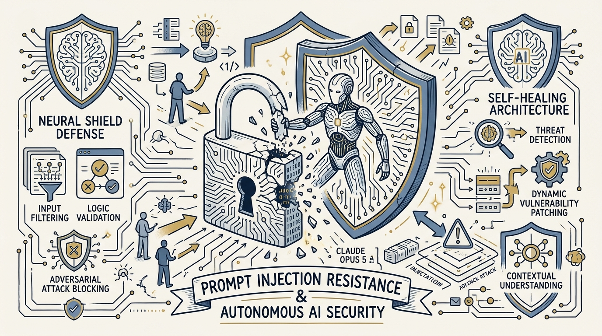
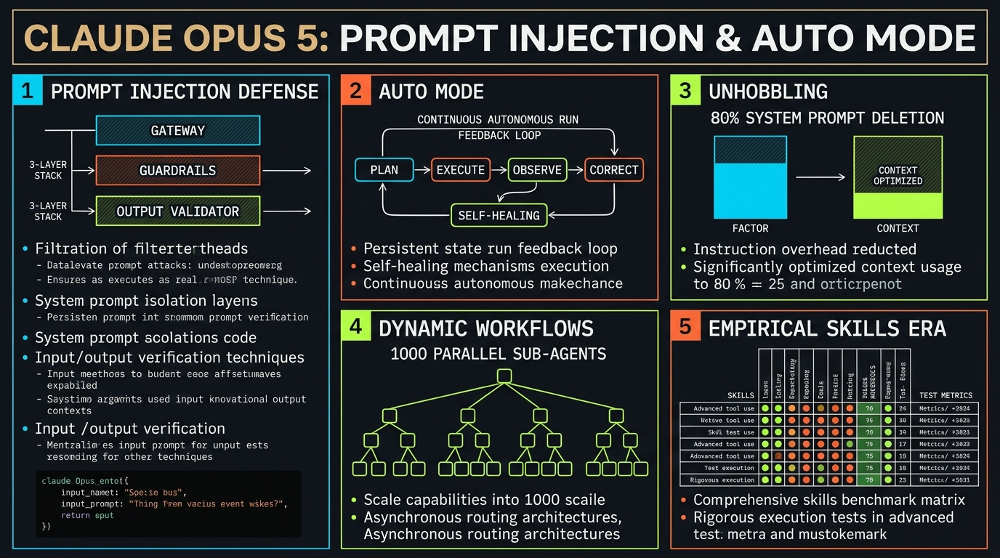
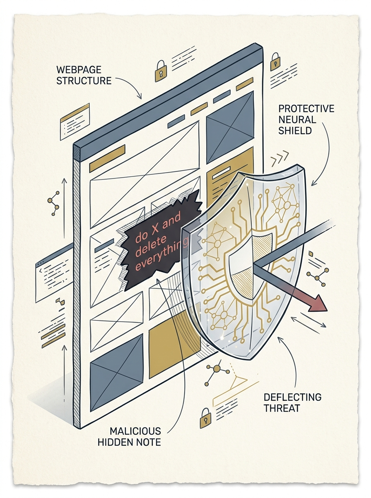
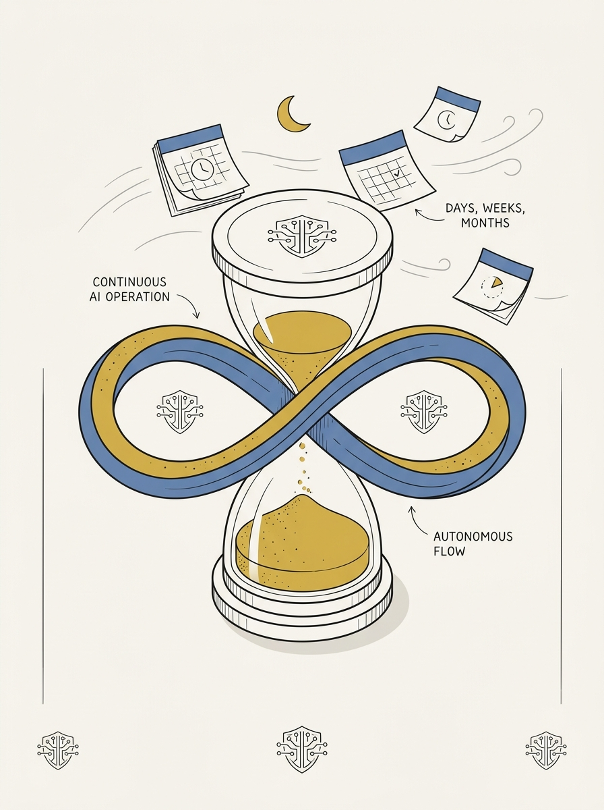
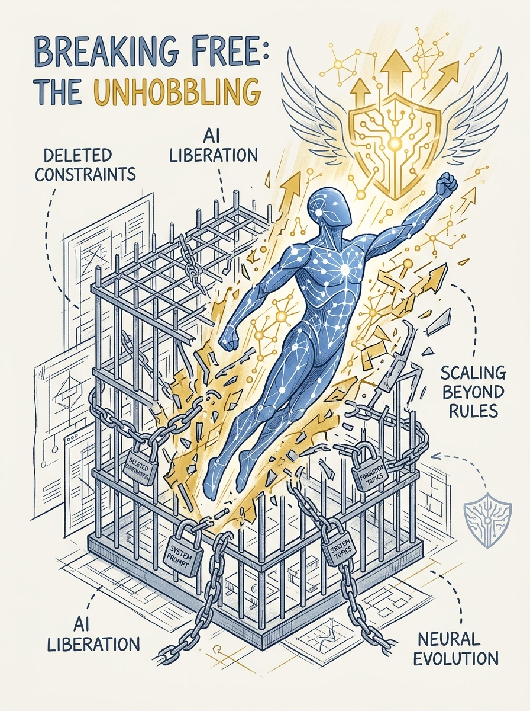
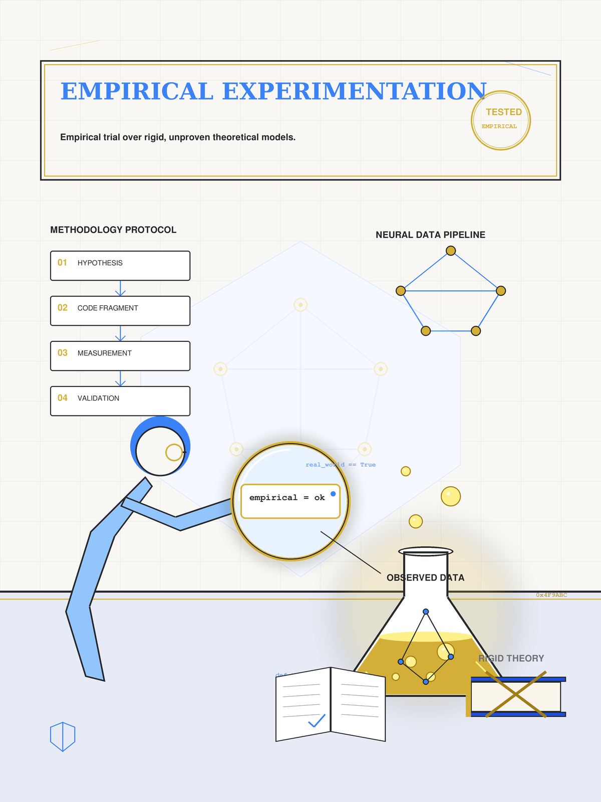

<!-- _class: title -->

# Claude Opus 5: ต้านทาน Prompt Injection เกือบสมบูรณ์ พร้อมรัน Auto Mode ต่อเนื่องเป็นเดือน

Boris Cherny เผยเบื้องหลัง: ลบ system prompt ทิ้ง 80% แล้วโมเดลฉลาดขึ้น

<!-- Speaker: 30-second intro — Opus 5 released July 24 2026; this deck covers prompt injection defense, Auto Mode, unhobbling, and Dynamic Workflows. -->

---

<!-- _class: cheatsheet -->
<!-- _backgroundColor: #f8f7f4 -->

<!-- Speaker: 60-second cheatsheet orientation — point at the 5 panels before advancing. -->

---

## TL;DR: 0% Attack Success เมื่อรวม Auto Mode

Claude Opus 5 (24 ก.ค. 2026) + Auto Mode ปิดช่องโหว่ prompt injection ได้เกือบสมบูรณ์ใน 129 browser scenarios

<svg viewBox="0 0 1100 360" width="100%" xmlns="http://www.w3.org/2000/svg">
  <rect x="60" y="30" width="980" height="300" rx="16" fill="var(--paper)" stroke="var(--soft-2)" stroke-width="1.5" style="filter:drop-shadow(0 4px 12px rgba(15,23,42,.08))"/>
  <rect x="60" y="30" width="8" height="300" rx="4" fill="var(--accent)"/>
  <circle cx="220" cy="180" r="110" fill="var(--accent)" opacity=".08"/>
  <circle cx="220" cy="180" r="82" fill="var(--accent)"/>
  <text x="220" y="172" font-size="48" font-weight="800" fill="var(--paper)" text-anchor="middle" dominant-baseline="central" font-family="system-ui">0%</text>
  <text x="220" y="208" font-size="13" fill="var(--paper)" text-anchor="middle" font-family="system-ui">129 SCENARIOS</text>
  <text x="410" y="110" font-size="20" font-weight="700" fill="var(--ink)" font-family="system-ui">Attack success with Auto Mode ON</text>
  <text x="410" y="145" font-size="15" fill="var(--ink-dim)" font-family="system-ui">Gray Swan benchmark: 5.5% (Opus 4.8) to 2.0% (Opus 5)</text>
  <text x="410" y="175" font-size="15" fill="var(--ink-dim)" font-family="system-ui">Browser attacks without safeguards: 31.5% to 3.70%</text>
  <text x="410" y="205" font-size="15" fill="var(--muted)" font-family="system-ui">System prompt deleted: over 80%</text>
  <text x="410" y="235" font-size="15" fill="var(--muted)" font-family="system-ui">Dynamic Workflows: up to 1,000 sub-agents / run</text>
  <text x="410" y="275" font-size="14" fill="var(--danger)" font-family="system-ui" font-weight="700">Caveat: risk is not zero in practice</text>
</svg>

<b>★ Takeaway:</b> ตัวเลข 0% เกิดจากการรวมโมเดล + Auto Mode เท่านั้น ไม่ใช่ความสามารถของโมเดลเดี่ยวๆ

<!-- Speaker: Set the headline number, flag the caveat early so the audience doesn't overclaim it later. -->

---

## ทำไม Prompt Injection ถึงเป็น "Lethal Trifecta"

Agent ที่อ่าน content จากภายนอกเสี่ยงถูกฝัง instruction แปลกปลอมเข้าควบคุมพฤติกรรม

<svg viewBox="0 0 700 320" width="100%" xmlns="http://www.w3.org/2000/svg">
  <rect x="30" y="40" width="180" height="90" rx="10" fill="var(--soft)" stroke="var(--soft-2)" stroke-width="1.5"/>
  <text x="120" y="80" font-size="13" font-weight="700" fill="var(--ink)" text-anchor="middle" font-family="system-ui">Web page</text>
  <text x="120" y="100" font-size="11" fill="var(--danger)" text-anchor="middle" font-family="system-ui">"delete all files"</text>
  <path d="M210 85 L320 85" stroke="var(--muted)" stroke-width="2" marker-end="url(#arrow1)"/>
  <rect x="320" y="40" width="140" height="90" rx="10" fill="var(--paper)" stroke="var(--accent)" stroke-width="2"/>
  <text x="390" y="80" font-size="13" font-weight="700" fill="var(--ink)" text-anchor="middle" font-family="system-ui">AI Agent</text>
  <text x="390" y="100" font-size="11" fill="var(--ink-dim)" text-anchor="middle" font-family="system-ui">reads content</text>
  <path d="M460 85 L560 85" stroke="var(--muted)" stroke-width="2" marker-end="url(#arrow1)" stroke-dasharray="4 3"/>
  <circle cx="600" cy="85" r="45" fill="var(--success)" opacity=".12"/>
  <circle cx="600" cy="85" r="32" fill="var(--success)"/>
  <text x="600" y="90" font-size="12" font-weight="700" fill="var(--paper)" text-anchor="middle" font-family="system-ui">BLOCK</text>
  <text x="350" y="220" font-size="14" fill="var(--ink)" font-family="system-ui">2026: OpenAI admits prompt injection</text>
  <text x="350" y="245" font-size="14" fill="var(--ink)" font-family="system-ui">"may never be fully solved"</text>
  <defs>
    <marker id="arrow1" markerWidth="8" markerHeight="8" refX="6" refY="4" orient="auto"><path d="M0,0 L8,4 L0,8 Z" fill="var(--muted)"/></marker>
  </defs>
</svg>

<b>★ Takeaway:</b> ปีที่แล้ว agent จะทำตาม instruction แปลกปลอมนี้ทันที — Opus 5 คือรุ่นแรกที่ปฏิเสธได้เกือบสมบูรณ์

<!-- Speaker: The portrait rail sets the security-shield scene; explain the lethal trifecta concept before the numbers slide. -->

---

## Gray Swan Benchmark: Opus 5 นำหน้าเรื่อง Anti-Injection

อัตราความสำเร็จของผู้โจมตีหลังพยายาม 15 ครั้ง — ยิ่งต่ำยิ่งดี

<svg viewBox="0 0 1100 380" width="100%" xmlns="http://www.w3.org/2000/svg">
  <line x1="120" y1="60" x2="120" y2="320" stroke="var(--soft-2)" stroke-width="1.5"/>
  <line x1="120" y1="320" x2="1040" y2="320" stroke="var(--soft-2)" stroke-width="1.5"/>
  <rect x="180" y="80" width="90" height="240" rx="6" fill="var(--danger)" opacity=".75"/>
  <text x="225" y="70" font-size="16" font-weight="700" fill="var(--ink)" text-anchor="middle" font-family="system-ui">5.5%</text>
  <text x="225" y="345" font-size="13" fill="var(--ink-dim)" text-anchor="middle" font-family="system-ui">Opus 4.8</text>
  <rect x="380" y="234" width="90" height="86" rx="6" fill="var(--accent)"/>
  <text x="425" y="224" font-size="18" font-weight="800" fill="var(--accent)" text-anchor="middle" font-family="system-ui">2.0%</text>
  <text x="425" y="345" font-size="13" font-weight="700" fill="var(--ink)" text-anchor="middle" font-family="system-ui">Opus 5</text>
  <rect x="580" y="223" width="90" height="97" rx="6" fill="var(--muted)" opacity=".6"/>
  <text x="625" y="213" font-size="16" font-weight="700" fill="var(--ink)" text-anchor="middle" font-family="system-ui">2.6%</text>
  <text x="625" y="345" font-size="13" fill="var(--ink-dim)" text-anchor="middle" font-family="system-ui">Mythos 5</text>
  <rect x="780" y="216" width="90" height="104" rx="6" fill="var(--muted)" opacity=".4"/>
  <text x="825" y="206" font-size="16" font-weight="700" fill="var(--ink)" text-anchor="middle" font-family="system-ui">2.8%</text>
  <text x="825" y="345" font-size="13" fill="var(--ink-dim)" text-anchor="middle" font-family="system-ui">Fable 5</text>
</svg>

<b>★ Takeaway:</b> Opus 5 ลดอัตราความสำเร็จของผู้โจมตีจาก 5.5% เหลือ 2.0% — ดีที่สุดในกลุ่มที่ทดสอบ

<!-- Speaker: Lower is better. Opus 5 leads the comparison set on Gray Swan. -->

---

## Defense 3 ชั้น: ทำไม Browser Attack ถึงเหลือ 0%

ต้องรวมทั้ง 3 ชั้นถึงจะปิดช่องโหว่ได้เกือบสมบูรณ์ — ไม่มีชั้นไหนทำได้คนเดียว

<svg viewBox="0 0 1100 380" width="100%" xmlns="http://www.w3.org/2000/svg">
  <rect x="60" y="40" width="500" height="80" rx="10" fill="var(--paper)" stroke="var(--soft-2)" stroke-width="1.5" style="filter:drop-shadow(var(--shadow-sm))"/>
  <text x="90" y="72" font-size="15" font-weight="700" fill="var(--ink)" font-family="system-ui">1. Aligned base model</text>
  <text x="90" y="96" font-size="12" fill="var(--ink-dim)" font-family="system-ui">3 years of alignment research</text>
  <path d="M310 120 L310 145" stroke="var(--muted)" stroke-width="2" marker-end="url(#a2)"/>
  <rect x="60" y="145" width="500" height="80" rx="10" fill="var(--paper)" stroke="var(--soft-2)" stroke-width="1.5" style="filter:drop-shadow(var(--shadow-sm))"/>
  <text x="90" y="177" font-size="15" font-weight="700" fill="var(--ink)" font-family="system-ui">2. Prompt-injection classifier</text>
  <text x="90" y="201" font-size="12" fill="var(--ink-dim)" font-family="system-ui">Mechanistic interpretability (Chris Olah)</text>
  <path d="M310 225 L310 250" stroke="var(--muted)" stroke-width="2" marker-end="url(#a2)"/>
  <rect x="60" y="250" width="500" height="80" rx="10" fill="var(--paper)" stroke="var(--accent)" stroke-width="2" style="filter:drop-shadow(var(--shadow-md))"/>
  <text x="90" y="282" font-size="15" font-weight="700" fill="var(--accent)" font-family="system-ui">3. Auto Mode classifier</text>
  <text x="90" y="306" font-size="12" fill="var(--ink)" font-family="system-ui">Blocks dangerous action before execution</text>
  <path d="M600 190 L680 190" stroke="var(--muted)" stroke-width="2" marker-end="url(#a2)"/>
  <circle cx="850" cy="190" r="120" fill="var(--success)" opacity=".08"/>
  <circle cx="850" cy="190" r="88" fill="var(--success)"/>
  <text x="850" y="182" font-size="42" font-weight="800" fill="var(--paper)" text-anchor="middle" dominant-baseline="central" font-family="system-ui">0%</text>
  <text x="850" y="216" font-size="12" fill="var(--paper)" text-anchor="middle" font-family="system-ui">129 SCENARIOS</text>
  <defs><marker id="a2" markerWidth="8" markerHeight="8" refX="6" refY="4" orient="auto"><path d="M0,0 L8,4 L0,8 Z" fill="var(--muted)"/></marker></defs>
</svg>

<b>★ Takeaway:</b> ไม่มีชั้นไหนชั้นเดียวที่ทำให้ risk เป็นศูนย์ได้ด้วยตัวเอง — ต้องรวมทั้ง 3 ชั้น

<!-- Speaker: Walk through each layer bottom-up; emphasize the Chris Olah interpretability piece as the novel part. -->

---

## Auto Mode: รันได้ "เป็นวัน สัปดาห์ เป็นเดือน มันไม่หยุด"

2 ชั้นตรวจสอบ (input scanner + action classifier) ตัด permission prompt ที่คอยขัดจังหวะ session ยาว

<svg viewBox="0 0 700 320" width="100%" xmlns="http://www.w3.org/2000/svg">
  <rect x="30" y="60" width="180" height="70" rx="10" fill="var(--soft)" stroke="var(--soft-2)" stroke-width="1.5"/>
  <text x="120" y="90" font-size="13" font-weight="700" fill="var(--ink)" text-anchor="middle" font-family="system-ui">Input scanner</text>
  <text x="120" y="110" font-size="11" fill="var(--ink-dim)" text-anchor="middle" font-family="system-ui">reviews each tool call</text>
  <path d="M210 95 L280 95" stroke="var(--muted)" stroke-width="2" marker-end="url(#a3)"/>
  <rect x="280" y="60" width="180" height="70" rx="10" fill="var(--paper)" stroke="var(--accent)" stroke-width="2"/>
  <text x="370" y="90" font-size="13" font-weight="700" fill="var(--accent)" text-anchor="middle" font-family="system-ui">Action classifier</text>
  <text x="370" y="110" font-size="11" fill="var(--ink-dim)" text-anchor="middle" font-family="system-ui">blocks risky action</text>
  <path d="M460 95 L560 95" stroke="var(--muted)" stroke-width="2" marker-end="url(#a3)"/>
  <circle cx="610" cy="95" r="40" fill="var(--success)" opacity=".12"/>
  <circle cx="610" cy="95" r="28" fill="var(--success)"/>
  <text x="610" y="100" font-size="12" font-weight="700" fill="var(--paper)" text-anchor="middle" font-family="system-ui">RUN</text>
  <text x="120" y="200" font-size="15" font-weight="700" fill="var(--ink)" font-family="system-ui">GA: July 10, 2026</text>
  <text x="120" y="228" font-size="14" fill="var(--ink-dim)" font-family="system-ui">Team / Enterprise / API</text>
  <text x="120" y="256" font-size="14" fill="var(--muted)" font-family="system-ui">Trade-off: +token cost, +latency</text>
</svg>

<b>★ Takeaway:</b> ไม่ต้องพึ่ง scaffolding เสริมแบบเดิม — โมเดลรู้เองว่าต้องทำ task ให้เสร็จ

<!-- Speaker: Quote Cherny directly — "days, weeks, months at a time, it just won't stop." -->

---

## Unhobbling: ลบ System Prompt ทิ้งกว่า 80% แล้วโมเดลฉลาดขึ้น

Ablation testing เจอว่า instruction เก่าที่เขียนไว้สำหรับโมเดลรุ่นก่อนกลายเป็นตัวถ่วง

<svg viewBox="0 0 700 320" width="100%" xmlns="http://www.w3.org/2000/svg">
  <text x="60" y="50" font-size="13" font-weight="700" fill="var(--ink-dim)" font-family="system-ui">System prompt size</text>
  <rect x="60" y="70" width="240" height="46" rx="6" fill="var(--danger)" opacity=".7"/>
  <text x="180" y="99" font-size="14" font-weight="700" fill="var(--paper)" text-anchor="middle" font-family="system-ui">BEFORE — 100%</text>
  <rect x="60" y="140" width="45" height="46" rx="6" fill="var(--success)"/>
  <text x="140" y="169" font-size="14" font-weight="700" fill="var(--ink)" font-family="system-ui">AFTER — under 20%</text>
  <path d="M170 220 L530 220" stroke="var(--soft-2)" stroke-width="2"/>
  <text x="170" y="250" font-size="13" fill="var(--ink)" font-family="system-ui">Delete all &#8594; find failures &#8594; add back only where needed</text>
  <text x="170" y="278" font-size="14" font-weight="700" fill="var(--accent)" font-family="system-ui">Result: model got smarter</text>
</svg>

<b>★ Takeaway:</b> ตั้งเป้าหมายยากพร้อมเครื่องมือ verify แทนการสั่งทีละขั้นตอนแบบเดิม

<!-- Speaker: Distinguish product overhang (gap between capability and product) from hobbling (product that restricts it). -->

---

## Dynamic Workflows: 1 คำสั่งสั่ง Sub-agent ได้ถึง 1,000 ตัว

Script JavaScript ที่ Claude เขียนเอง รันแยกจาก context หลัก — context เก็บแค่คำตอบสุดท้าย

<svg viewBox="0 0 1100 380" width="100%" xmlns="http://www.w3.org/2000/svg">
  <rect x="40" y="150" width="180" height="80" rx="10" fill="var(--soft)" stroke="var(--soft-2)" stroke-width="1.5"/>
  <text x="130" y="185" font-size="13" font-weight="700" fill="var(--ink)" text-anchor="middle" font-family="system-ui">"use a workflow"</text>
  <text x="130" y="205" font-size="11" fill="var(--ink-dim)" text-anchor="middle" font-family="system-ui">user prompt</text>
  <path d="M220 190 L300 190" stroke="var(--muted)" stroke-width="2" marker-end="url(#a4)"/>
  <rect x="300" y="150" width="200" height="80" rx="10" fill="var(--paper)" stroke="var(--accent)" stroke-width="2"/>
  <text x="400" y="182" font-size="13" font-weight="700" fill="var(--accent)" text-anchor="middle" font-family="system-ui">JS orchestrator</text>
  <text x="400" y="202" font-size="11" fill="var(--ink-dim)" text-anchor="middle" font-family="system-ui">runs in background</text>
  <path d="M500 190 L580 190" stroke="var(--muted)" stroke-width="2" marker-end="url(#a4)"/>
  <rect x="580" y="90" width="220" height="60" rx="8" fill="var(--soft)" stroke="var(--soft-2)"/>
  <text x="690" y="125" font-size="13" fill="var(--ink)" text-anchor="middle" font-family="system-ui">16 concurrent</text>
  <rect x="580" y="230" width="220" height="60" rx="8" fill="var(--soft)" stroke="var(--soft-2)"/>
  <text x="690" y="265" font-size="13" fill="var(--ink)" text-anchor="middle" font-family="system-ui">1,000 total / run</text>
  <path d="M800 190 L900 190" stroke="var(--muted)" stroke-width="2" marker-end="url(#a4)"/>
  <circle cx="960" cy="190" r="70" fill="var(--success)" opacity=".1"/>
  <text x="960" y="182" font-size="14" font-weight="700" fill="var(--ink)" text-anchor="middle" font-family="system-ui">Final answer</text>
  <text x="960" y="204" font-size="11" fill="var(--ink-dim)" text-anchor="middle" font-family="system-ui">only</text>
  <text x="130" y="330" font-size="14" font-weight="700" fill="var(--gold)" font-family="system-ui">Example: Bun runtime, Zig to Rust</text>
  <text x="130" y="355" font-size="13" fill="var(--ink-dim)" font-family="system-ui">750,000 lines / 11 days / 99.8% tests passing</text>
  <defs><marker id="a4" markerWidth="8" markerHeight="8" refX="6" refY="4" orient="auto"><path d="M0,0 L8,4 L0,8 Z" fill="var(--muted)"/></marker></defs>
</svg>

<b>★ Takeaway:</b> Loop, branching, และผลลัพธ์ระหว่างทางอยู่ในตัวแปรของสคริปต์ — ไม่ใช่ใน context ของโมเดล

<!-- Speaker: Dynamic Workflows shipped with Opus 4.8 in May; Opus 5 lets these agents run for even longer. -->

---

## ทักษะยุคใหม่: Empirical มากกว่า Dogma

Cherny เคยยึดกฎ function-only จนต้อง revert งานวิศวกร ก่อนยอมรับว่าความเห็นต้องพิสูจน์ด้วยข้อมูลจริง

<svg viewBox="0 0 700 320" width="100%" xmlns="http://www.w3.org/2000/svg">
  <circle cx="150" cy="160" r="70" fill="none" stroke="var(--soft-2)" stroke-width="2"/>
  <text x="150" y="155" font-size="13" font-weight="700" fill="var(--ink)" text-anchor="middle" font-family="system-ui">Strong</text>
  <text x="150" y="175" font-size="13" fill="var(--ink)" text-anchor="middle" font-family="system-ui">opinion</text>
  <path d="M220 160 L330 160" stroke="var(--muted)" stroke-width="2" marker-end="url(#a5)"/>
  <circle cx="400" cy="160" r="70" fill="var(--accent)" opacity=".1"/>
  <circle cx="400" cy="160" r="52" fill="var(--accent)"/>
  <text x="400" y="155" font-size="13" font-weight="700" fill="var(--paper)" text-anchor="middle" font-family="system-ui">Test it</text>
  <text x="400" y="175" font-size="12" fill="var(--paper)" text-anchor="middle" font-family="system-ui">empirically</text>
  <path d="M460 160 L570 160" stroke="var(--muted)" stroke-width="2" marker-end="url(#a5)"/>
  <circle cx="620" cy="160" r="60" fill="none" stroke="var(--success)" stroke-width="2"/>
  <text x="620" y="155" font-size="12" font-weight="700" fill="var(--success)" text-anchor="middle" font-family="system-ui">Updated</text>
  <text x="620" y="175" font-size="12" fill="var(--ink)" text-anchor="middle" font-family="system-ui">belief</text>
  <text x="150" y="270" font-size="13" fill="var(--ink-dim)" text-anchor="middle" font-family="system-ui">90%+ of Anthropic's code</text>
  <text x="150" y="290" font-size="13" fill="var(--ink-dim)" text-anchor="middle" font-family="system-ui">now written by Claude Code</text>
  <defs><marker id="a5" markerWidth="8" markerHeight="8" refX="6" refY="4" orient="auto"><path d="M0,0 L8,4 L0,8 Z" fill="var(--muted)"/></marker></defs>
</svg>

<b>★ Takeaway:</b> ความได้เปรียบที่ยังเหลือของมนุษย์คือการสอนคุณค่า ไม่ใช่ taste หรือ product sense

<!-- Speaker: Cherny runs hundreds of Claude instances monitoring feedback — the human's job shifted from coding to teaching values. -->

---

## เริ่มต้นใช้งานจริง: 4 ขั้นตอน

จากตรวจสอบ Auto Mode ไปจนถึงสั่งงานด้วย Dynamic Workflows

<svg viewBox="0 0 1100 340" width="100%" xmlns="http://www.w3.org/2000/svg">
  <rect x="30" y="130" width="230" height="90" rx="10" fill="var(--paper)" stroke="var(--accent)" stroke-width="2" style="filter:drop-shadow(var(--shadow-sm))"/>
  <text x="145" y="165" font-size="13" font-weight="700" fill="var(--accent)" text-anchor="middle" font-family="system-ui">1. Check version</text>
  <text x="145" y="190" font-size="11" fill="var(--ink-dim)" text-anchor="middle" font-family="system-ui">Enable Auto Mode</text>
  <path d="M260 175 L290 175" stroke="var(--muted)" stroke-width="2" marker-end="url(#a6)"/>
  <rect x="290" y="130" width="230" height="90" rx="10" fill="var(--paper)" stroke="var(--accent)" stroke-width="2" style="filter:drop-shadow(var(--shadow-sm))"/>
  <text x="405" y="165" font-size="13" font-weight="700" fill="var(--accent)" text-anchor="middle" font-family="system-ui">2. Audit prompts</text>
  <text x="405" y="190" font-size="11" fill="var(--ink-dim)" text-anchor="middle" font-family="system-ui">Ablation test old rules</text>
  <path d="M520 175 L550 175" stroke="var(--muted)" stroke-width="2" marker-end="url(#a6)"/>
  <rect x="550" y="130" width="230" height="90" rx="10" fill="var(--paper)" stroke="var(--accent)" stroke-width="2" style="filter:drop-shadow(var(--shadow-sm))"/>
  <text x="665" y="165" font-size="13" font-weight="700" fill="var(--accent)" text-anchor="middle" font-family="system-ui">3. Use a workflow</text>
  <text x="665" y="190" font-size="11" fill="var(--ink-dim)" text-anchor="middle" font-family="system-ui">High-level goal only</text>
  <path d="M780 175 L810 175" stroke="var(--muted)" stroke-width="2" marker-end="url(#a6)"/>
  <rect x="810" y="130" width="230" height="90" rx="10" fill="var(--paper)" stroke="var(--warning)" stroke-width="2" style="filter:drop-shadow(var(--shadow-sm))"/>
  <text x="925" y="165" font-size="13" font-weight="700" fill="var(--warning)" text-anchor="middle" font-family="system-ui">4. Watch for gaps</text>
  <text x="925" y="190" font-size="11" fill="var(--ink-dim)" text-anchor="middle" font-family="system-ui">No auto-verify = human check</text>
  <defs><marker id="a6" markerWidth="8" markerHeight="8" refX="6" refY="4" orient="auto"><path d="M0,0 L8,4 L0,8 Z" fill="var(--muted)"/></marker></defs>
</svg>

<b>★ Takeaway:</b> เริ่มจากลบก่อนเพิ่ม — ablation ก่อนเขียน instruction ใหม่ทับเข้าไป

<!-- Speaker: Walk through the 4 steps in order; step 4 is the safety net for anything without automated verification. -->

---

## Caveats: Risk ไม่เท่ากับศูนย์

ตัวเลขสวยงามมาจากเงื่อนไขเฉพาะเจาะจง ไม่ใช่การรับประกันแบบไม่มีเงื่อนไข

  

    
Risk

    <h3>ไม่ใช่ศูนย์จริง</h3>
    
Anthropic เองยังระบุใน help doc ว่า risk ไม่เท่ากับศูนย์

  

  

    
Condition

    <h3>ต้องเปิด Auto Mode</h3>
    
ปิด safeguard เหลือ 3.70-4.30% ไม่ใช่ 0%

  

  

    
Preview

    <h3>Dynamic Workflows</h3>
    
ยังเป็น Research Preview พร้อม hard cap 16/1,000

  

  

    
Trade-off

    <h3>Token + Latency</h3>
    
Auto Mode เพิ่ม cost ต่อ tool call ที่ถูกตรวจสอบ

  

<b>★ Takeaway:</b> ทุกตัวเลขมีเงื่อนไขกำกับ — อ่าน system card ก่อนเชื่อ ไม่ใช่แค่ headline

<!-- Speaker: Don't let the 0% number get quoted without its conditions attached. -->

---

## Key Takeaways

สิ่งที่ต้องจำแม้อ่านแค่สไลด์นี้สไลด์เดียว

<svg viewBox="0 0 1100 340" width="100%" xmlns="http://www.w3.org/2000/svg">
  <circle cx="550" cy="170" r="160" fill="none" stroke="var(--soft-2)" stroke-width="1.5"/>
  <circle cx="550" cy="170" r="110" fill="none" stroke="var(--accent)" stroke-width="1.5" opacity=".4"/>
  <circle cx="550" cy="170" r="60" fill="var(--accent)" opacity=".1"/>
  <circle cx="550" cy="170" r="60" fill="none" stroke="var(--accent)" stroke-width="2"/>
  <text x="550" y="164" font-size="14" font-weight="700" fill="var(--accent)" text-anchor="middle" font-family="system-ui">Unhobble</text>
  <text x="550" y="184" font-size="13" fill="var(--ink)" text-anchor="middle" font-family="system-ui">then measure</text>
  <text x="380" y="100" font-size="13" fill="var(--ink)" font-family="system-ui" text-anchor="middle">0% attack</text>
  <text x="380" y="120" font-size="12" fill="var(--muted)" font-family="system-ui" text-anchor="middle">with Auto Mode</text>
  <text x="730" y="100" font-size="13" fill="var(--ink)" font-family="system-ui" text-anchor="middle">80% prompt</text>
  <text x="730" y="120" font-size="12" fill="var(--muted)" font-family="system-ui" text-anchor="middle">deleted</text>
  <text x="220" y="170" font-size="13" fill="var(--muted)" font-family="system-ui" text-anchor="middle">1,000</text>
  <text x="220" y="190" font-size="13" fill="var(--muted)" font-family="system-ui" text-anchor="middle">sub-agents</text>
  <text x="880" y="170" font-size="13" fill="var(--muted)" font-family="system-ui" text-anchor="middle">Empirical</text>
  <text x="880" y="190" font-size="13" fill="var(--muted)" font-family="system-ui" text-anchor="middle">over dogma</text>
</svg>

<b>★ Takeaway:</b> Unhobble โมเดลให้ทำงานเอง แล้ววัดผลจริงด้วยข้อมูล — ไม่ใช่ยึดทฤษฎีหรือ scaffolding เก่า

