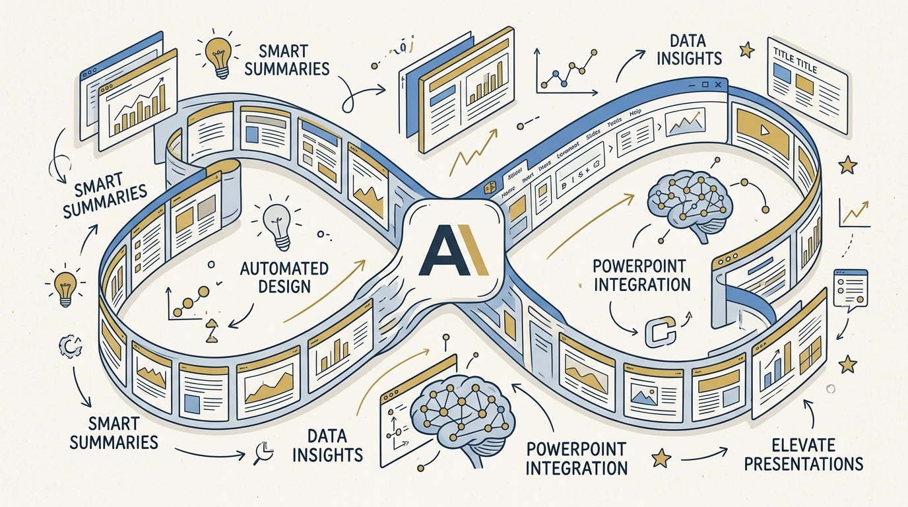
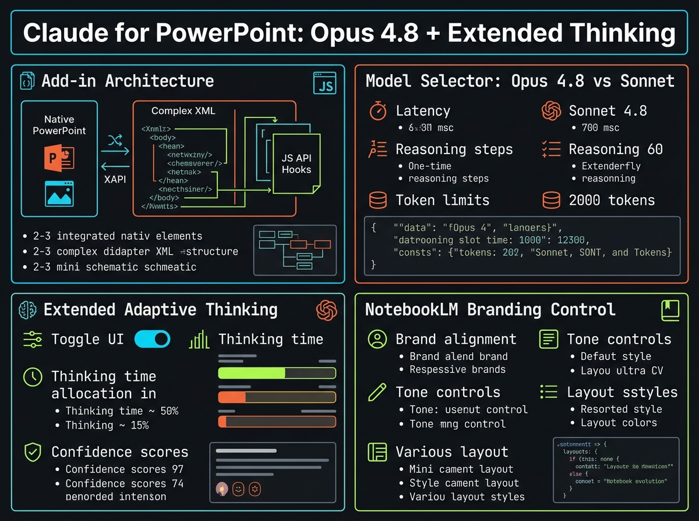
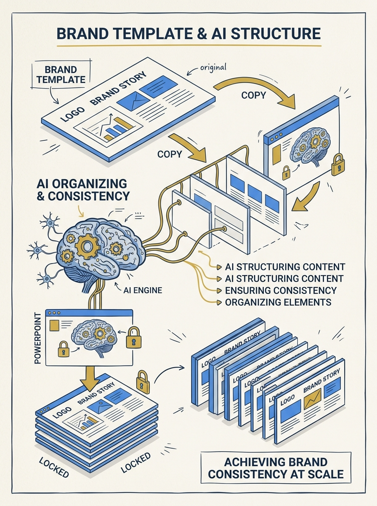
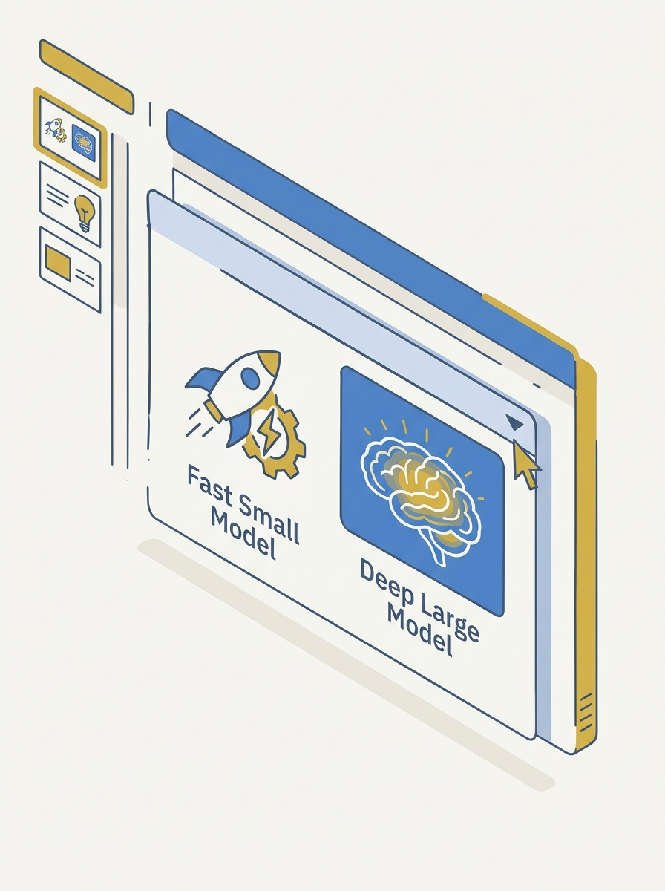

<!-- _class: title -->

# Claude for PowerPoint: Opus 4.8 + Extended Thinking

สร้างสไลด์คงแบรนด์เดิมได้จริง ไม่ใช่แค่ export ภาพนิ่ง

<!-- Speaker: เกริ่นว่า Claude for PowerPoint คือ add-in ทางการจาก Anthropic ต่างจาก NotebookLM ตรงที่แก้ไขต่อได้ในไฟล์จริง -->

---

<!-- _class: cheatsheet -->
<!-- _backgroundColor: #f8f7f4 -->

<!-- Speaker: ภาพรวมทั้งเดคใน 60 วินาที ก่อนเจาะรายละเอียดแต่ละส่วน -->

---

## TL;DR: Add-in ที่อ่านเทมเพลตเดิม แก้ไขต่อได้จริง

ต่างจาก NotebookLM ที่ export เป็นภาพนิ่งแก้ไม่ได้

<svg viewBox="0 0 1100 380" width="100%" xmlns="http://www.w3.org/2000/svg">
  <rect x="60" y="40" width="980" height="300" rx="16" fill="var(--paper)" stroke="var(--soft-2)" stroke-width="1.5" style="filter:drop-shadow(0 4px 12px rgba(15,23,42,.08))"/>
  <rect x="60" y="40" width="8" height="300" rx="4" fill="var(--accent)"/>
  <circle cx="148" cy="190" r="40" fill="var(--accent)" opacity=".12"/>
  <circle cx="148" cy="190" r="28" fill="var(--accent)"/>
  <text x="148" y="196" font-size="18" fill="var(--paper)" text-anchor="middle" dominant-baseline="central" font-family="system-ui" font-weight="700">1</text>
  <text x="220" y="170" font-size="20" font-weight="700" fill="var(--ink)" font-family="system-ui">Native PowerPoint elements, not exported images</text>
  <text x="220" y="202" font-size="15" fill="var(--ink-dim)" font-family="system-ui">Reads slide master, fonts, colors as context</text>
  <text x="220" y="232" font-size="15" fill="var(--muted)" font-family="system-ui">Model selector: Sonnet (fast) or Opus 4.8 (deep reasoning)</text>
</svg>

<b>★ Takeaway:</b> ปลั๊กอินทางการที่ทำงานในไฟล์จริง คุมแบรนด์ได้ดีกว่า generate แยกไฟล์

<!-- Speaker: ย้ำ 1 ประโยค — native element vs export image คือความต่างที่สำคัญที่สุด -->

---

## ทำไมเรื่องนี้ถึงสำคัญ

เครื่องมือ AI สร้างสไลด์ทั่วไปคุมแบรนดิ้งยาก ต้อง copy กลับไปวางเทมเพลตเองอยู่ดี

<svg viewBox="0 0 700 320" width="100%" xmlns="http://www.w3.org/2000/svg">
  <defs>
    <marker id="af1" markerWidth="10" markerHeight="10" refX="5" refY="5" orient="auto">
      <path d="M0,0 L10,5 L0,10 z" fill="var(--muted)"/>
    </marker>
  </defs>
  <rect x="40" y="40" width="620" height="70" rx="10" fill="var(--soft)" stroke="var(--soft-2)" stroke-width="1"/>
  <text x="60" y="82" font-size="15" fill="var(--ink)" font-family="system-ui">Generic AI tool → generic template output</text>
  <path d="M 350 130 L 350 170" stroke="var(--muted)" stroke-width="2" marker-end="url(#af1)"/>
  <rect x="40" y="190" width="620" height="70" rx="10" fill="var(--paper)" stroke="var(--accent)" stroke-width="2"/>
  <text x="60" y="232" font-size="15" fill="var(--accent)" font-family="system-ui" font-weight="700">Claude for PowerPoint → works inside your file</text>
</svg>

<b>★ Takeaway:</b> เปิดตัว research preview 5 ก.พ. 2026 — ทำงานใน sidebar ของไฟล์ PowerPoint ที่เปิดอยู่จริง

<!-- Speaker: บอกปัญหาเดิม (ควบคุมแบรนด์ยาก) ก่อนเข้าสู่ solution -->

---

## สถาปัตยกรรมของ Add-in

6 ความสามารถหลักที่เอกสารทางการยืนยัน

  

    
Generate

    <h3>สร้างสไลด์ใหม่</h3>
    
เคารพเทมเพลตองค์กรเดิมทุกครั้ง

  

  

    
Edit

    <h3>แก้เฉพาะจุด</h3>
    
ไม่ต้อง regenerate ทั้งเดค

  

  

    
Convert

    <h3>Bullet → Diagram</h3>
    
แปลงเป็น native chart ได้

  

  

    
Build

    <h3>สร้างทั้งเดค</h3>
    
จาก natural language brief

  

  

    
Connect

    <h3>Connectors</h3>
    
ดึงบริบทจากเครื่องมืออื่น

  

  

    
Auto

    <h3>Skills</h3>
    
ใช้ skill ที่เปิดไว้อัตโนมัติ

  

<b>★ Takeaway:</b> Output คือ element ของ PowerPoint จริง ไม่ใช่ไฟล์ภาพ export

<!-- Speaker: ไล่ 6 การ์ดเร็วๆ เน้น Generate กับ Edit เป็นหลัก -->

---

## เลือกโมเดล: Sonnet หรือ Opus 4.8

Sonnet ไวสำหรับงานแก้ไข ส่วน Opus เจาะลึกงานที่ต้องให้เหตุผลข้ามข้อมูลจำนวนมาก

<svg viewBox="0 0 700 320" width="100%" xmlns="http://www.w3.org/2000/svg">
  <rect x="40" y="60" width="280" height="200" rx="12" fill="var(--paper)" stroke="var(--soft-2)" stroke-width="1.5"/>
  <text x="180" y="100" font-size="16" font-weight="700" fill="var(--ink-dim)" text-anchor="middle" font-family="system-ui">Sonnet</text>
  <text x="180" y="140" font-size="13" fill="var(--ink)" text-anchor="middle" font-family="system-ui">Quick edits</text>
  <text x="180" y="165" font-size="13" fill="var(--ink)" text-anchor="middle" font-family="system-ui">Reformatting</text>
  <rect x="380" y="40" width="280" height="220" rx="12" fill="var(--paper)" stroke="var(--accent)" stroke-width="2"/>
  <text x="520" y="80" font-size="16" font-weight="700" fill="var(--accent)" text-anchor="middle" font-family="system-ui">Opus 4.8</text>
  <text x="520" y="120" font-size="13" fill="var(--ink)" text-anchor="middle" font-family="system-ui">Full-deck generation</text>
  <text x="520" y="145" font-size="13" fill="var(--ink)" text-anchor="middle" font-family="system-ui">Reasoning across sources</text>
  <text x="520" y="170" font-size="13" fill="var(--ink)" text-anchor="middle" font-family="system-ui">Narrative restructuring</text>
</svg>

<b>★ Takeaway:</b> Opus 4.8 (28 พ.ค. 2026) คือ Opus รุ่นล่าสุดที่ปรากฏใน model selector

<!-- Speaker: ย้ำว่า model selector ของ add-in อัปเดตตาม Opus รุ่นล่าสุดของ Anthropic -->

---

## Extended Thinking: คิดก่อนตอบ

Toggle ควบคุมว่า Claude จะแสดงขั้นตอนให้เหตุผลก่อนตอบหรือไม่

<svg viewBox="0 0 700 320" width="100%" xmlns="http://www.w3.org/2000/svg">
  <rect x="60" y="60" width="580" height="60" rx="30" fill="var(--soft)"/>
  <circle cx="600" cy="90" r="24" fill="var(--accent)"/>
  <text x="600" y="95" font-size="12" fill="var(--paper)" text-anchor="middle" font-family="system-ui" font-weight="700">ON</text>
  <text x="100" y="95" font-size="14" fill="var(--ink)" font-family="system-ui">Thinking toggle</text>
  <rect x="60" y="150" width="580" height="120" rx="10" fill="var(--paper)" stroke="var(--soft-2)" stroke-width="1.5"/>
  <text x="80" y="185" font-size="13" fill="var(--ink-dim)" font-family="system-ui">Reasoning trace (expandable section)</text>
  <text x="80" y="215" font-size="13" fill="var(--muted)" font-family="system-ui">Plans outline before writing slides</text>
  <text x="80" y="245" font-size="13" fill="var(--muted)" font-family="system-ui">Best for multi-source, complex briefs</text>
</svg>

<b>★ Takeaway:</b> เปิดไว้เมื่อสั่งงานซับซ้อน ปิดเมื่อแก้เร็วๆ เพื่อความไว — ในทางเทคนิคคือ adaptive thinking ของโมเดลตระกูลใหม่

<!-- Speaker: เชื่อมโยงกับ adaptive thinking API ที่อธิบายไว้ในโพสต์ -->

---

## Claude for PowerPoint vs NotebookLM

จุดต่างที่ชัดที่สุดคือรูปแบบ output และการคุมแบรนด์

<svg viewBox="0 0 1100 380" width="100%" xmlns="http://www.w3.org/2000/svg">
  <rect x="40" y="20" width="490" height="340" rx="12" fill="var(--paper)" stroke="var(--soft-2)" stroke-width="1.5" style="filter:drop-shadow(var(--shadow-sm))"/>
  <rect x="40" y="20" width="490" height="56" rx="12" fill="var(--soft)" opacity=".8"/>
  <text x="285" y="54" font-size="17" font-weight="700" fill="var(--ink-dim)" text-anchor="middle" font-family="system-ui">NotebookLM</text>
  <text x="80" y="110" font-size="15" fill="var(--ink)" font-family="system-ui">Static exported image</text>
  <text x="80" y="145" font-size="15" fill="var(--ink-dim)" font-family="system-ui">Not editable after export</text>
  <text x="80" y="180" font-size="15" fill="var(--muted)" font-family="system-ui">Branding control is hard</text>
  <rect x="570" y="20" width="490" height="340" rx="12" fill="var(--paper)" stroke="var(--accent)" stroke-width="2" style="filter:drop-shadow(var(--shadow-md))"/>
  <rect x="570" y="20" width="490" height="56" rx="12" fill="var(--accent)" opacity=".08"/>
  <text x="815" y="54" font-size="17" font-weight="700" fill="var(--accent)" text-anchor="middle" font-family="system-ui">Claude for PowerPoint</text>
  <text x="610" y="110" font-size="15" fill="var(--ink)" font-family="system-ui">Native PowerPoint elements</text>
  <text x="610" y="145" font-size="15" fill="var(--ink)" font-family="system-ui">Fully editable — drag, resize, restyle</text>
  <text x="610" y="180" font-size="15" fill="var(--ink)" font-family="system-ui">Reads slide master directly</text>
  <circle cx="550" cy="190" r="28" fill="var(--accent)"/>
  <text x="550" y="195" font-size="14" font-weight="700" fill="var(--paper)" text-anchor="middle" dominant-baseline="central" font-family="system-ui">VS</text>
</svg>

<b>★ Takeaway:</b> Brand compliance จริงอยู่ราว 85% — ยังต้องมีคนตรวจก่อนส่งงานจริงเสมอ

<!-- Speaker: ชี้ว่า editability คือข้อได้เปรียบเชิงโครงสร้าง ไม่ใช่แค่ความชอบส่วนตัว -->

---

## User Guide: Workflow 5 ขั้นตอน

ตั้งแต่ติดตั้งจนถึงตรวจสอบก่อน finalize

<svg viewBox="0 0 1100 320" width="100%" xmlns="http://www.w3.org/2000/svg">
  <defs>
    <marker id="af2" markerWidth="10" markerHeight="10" refX="5" refY="5" orient="auto">
      <path d="M0,0 L10,5 L0,10 z" fill="var(--muted)"/>
    </marker>
  </defs>
  <g font-family="system-ui">
    <rect x="20" y="120" width="190" height="90" rx="10" fill="var(--paper)" stroke="var(--accent)" stroke-width="2"/>
    <text x="115" y="155" font-size="14" font-weight="700" fill="var(--accent)" text-anchor="middle">1. Install</text>
    <text x="115" y="178" font-size="11" fill="var(--ink-dim)" text-anchor="middle">Marketplace / Admin</text>
    <path d="M215 165 L245 165" stroke="var(--muted)" stroke-width="2" marker-end="url(#af2)"/>
    <rect x="250" y="120" width="190" height="90" rx="10" fill="var(--paper)" stroke="var(--soft-2)" stroke-width="1.5"/>
    <text x="345" y="155" font-size="14" font-weight="700" fill="var(--ink)" text-anchor="middle">2. Load template</text>
    <text x="345" y="178" font-size="11" fill="var(--ink-dim)" text-anchor="middle">Open file first</text>
    <path d="M445 165 L475 165" stroke="var(--muted)" stroke-width="2" marker-end="url(#af2)"/>
    <rect x="480" y="120" width="190" height="90" rx="10" fill="var(--paper)" stroke="var(--soft-2)" stroke-width="1.5"/>
    <text x="575" y="155" font-size="14" font-weight="700" fill="var(--ink)" text-anchor="middle">3. Set Instructions</text>
    <text x="575" y="178" font-size="11" fill="var(--ink-dim)" text-anchor="middle">Brand rules, tone</text>
    <path d="M675 165 L705 165" stroke="var(--muted)" stroke-width="2" marker-end="url(#af2)"/>
    <rect x="710" y="120" width="190" height="90" rx="10" fill="var(--paper)" stroke="var(--soft-2)" stroke-width="1.5"/>
    <text x="805" y="155" font-size="14" font-weight="700" fill="var(--ink)" text-anchor="middle">4. Pick model</text>
    <text x="805" y="178" font-size="11" fill="var(--ink-dim)" text-anchor="middle">Model + Thinking</text>
    <path d="M905 165 L935 165" stroke="var(--muted)" stroke-width="2" marker-end="url(#af2)"/>
    <rect x="940" y="120" width="150" height="90" rx="10" fill="var(--paper)" stroke="var(--gold)" stroke-width="2"/>
    <text x="1015" y="155" font-size="14" font-weight="700" fill="var(--ink)" text-anchor="middle">5. Review</text>
    <text x="1015" y="178" font-size="11" fill="var(--ink-dim)" text-anchor="middle">Accept / Undo</text>
  </g>
</svg>

<b>★ Takeaway:</b> สั่งแก้เฉพาะจุดได้ เช่น ปรับโทนสไลด์ให้เหมาะผู้บริหารแทนทีมเทคนิค โดยไม่กระทบสไลด์อื่น

<!-- Speaker: ย้ำ pro tip — เปิดไฟล์เทมเพลตก่อนเปิด sidebar เสมอ -->

---

## Caveats & Limits

ข้อจำกัดที่ต้องรู้ก่อนใช้งานจริง

  

    
Plan

    <h3>ต้องเสียเงิน</h3>
    
Pro, Max, Team, Enterprise เท่านั้น ไม่มี free tier

  

  

    
Compliance

    <h3>~85% brand compliance</h3>
    
ยังต้องตรวจ 2-4 ชม./เดคก่อนส่งจริง

  

  

    
Security

    <h3>Prompt injection risk</h3>
    
ใช้กับไฟล์/ข้อมูลที่เชื่อถือได้เท่านั้น

  

<b>★ Takeaway:</b> ไม่แนะนำใช้เป็น deliverable สุดท้ายหรือกับข้อมูลอ่อนไหวโดยไม่มีคนตรวจ

<!-- Speaker: เตือนเรื่อง prompt injection ให้ชัด — ไฟล์เทมเพลตแปลกๆ อาจแอบฝังคำสั่ง -->

---

## Key Takeaways

สรุปสิ่งที่ต้องจำจากเดคนี้

<svg viewBox="0 0 1100 340" width="100%" xmlns="http://www.w3.org/2000/svg">
  <circle cx="550" cy="170" r="160" fill="none" stroke="var(--soft-2)" stroke-width="1.5"/>
  <circle cx="550" cy="170" r="110" fill="none" stroke="var(--accent)" stroke-width="1.5" opacity=".4"/>
  <circle cx="550" cy="170" r="60" fill="var(--accent)" opacity=".1"/>
  <circle cx="550" cy="170" r="60" fill="none" stroke="var(--accent)" stroke-width="2"/>
  <text x="550" y="164" font-size="15" font-weight="700" fill="var(--accent)" text-anchor="middle" font-family="system-ui">Native</text>
  <text x="550" y="184" font-size="13" fill="var(--ink)" text-anchor="middle" font-family="system-ui">editable</text>
  <text x="380" y="100" font-size="13" fill="var(--ink)" font-family="system-ui" text-anchor="middle">Model choice</text>
  <text x="380" y="120" font-size="12" fill="var(--muted)" font-family="system-ui" text-anchor="middle">Opus 4.8</text>
  <text x="730" y="100" font-size="13" fill="var(--ink)" font-family="system-ui" text-anchor="middle">Thinking</text>
  <text x="730" y="120" font-size="12" fill="var(--muted)" font-family="system-ui" text-anchor="middle">toggle</text>
  <text x="220" y="170" font-size="13" fill="var(--muted)" font-family="system-ui" text-anchor="middle">Pro plan</text>
  <text x="220" y="190" font-size="13" fill="var(--muted)" font-family="system-ui" text-anchor="middle">required</text>
  <text x="880" y="170" font-size="13" fill="var(--muted)" font-family="system-ui" text-anchor="middle">Human</text>
  <text x="880" y="190" font-size="13" fill="var(--muted)" font-family="system-ui" text-anchor="middle">review</text>
</svg>

<b>★ Takeaway:</b> Add-in ทางการที่อ่านเทมเพลตเดิม แก้ไขต่อได้จริง — คุมแบรนด์ได้ดีกว่า NotebookLM แต่ยังต้องมีคนตรวจก่อนส่งงานจริงเสมอ

