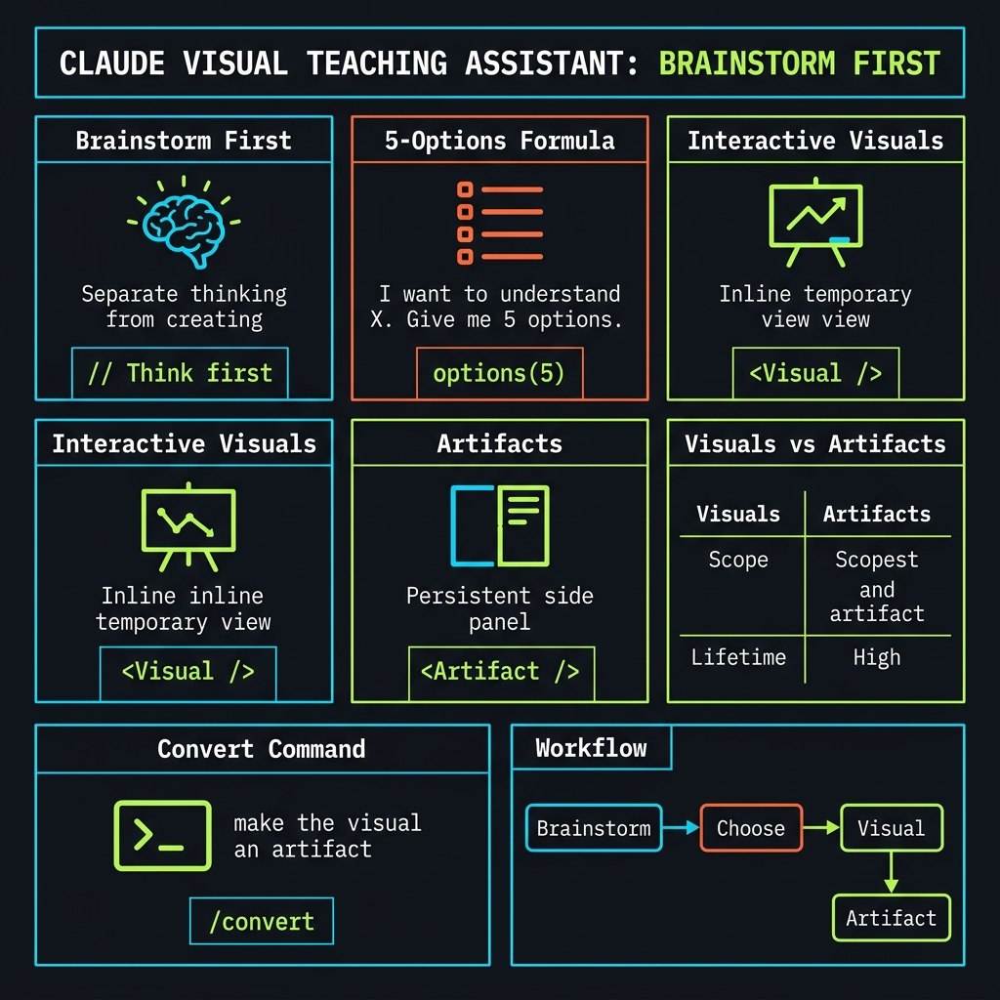
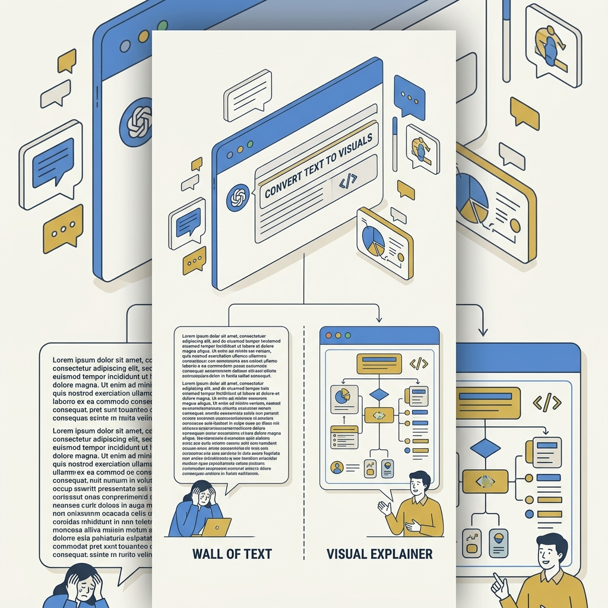
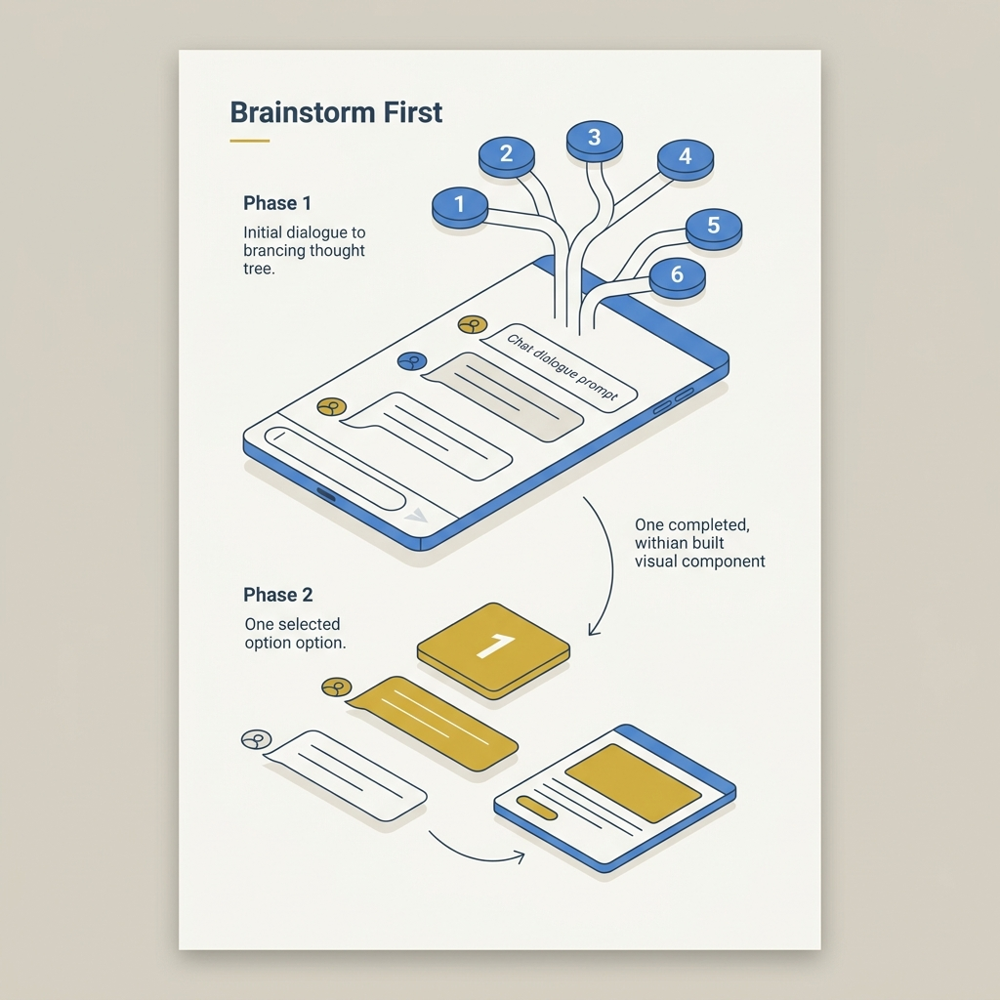

<!-- _class: title -->

# เปลี่ยน Claude เป็นผู้ช่วยสอนด้วยภาพ

Brainstorm First: แยกการคิดออกจากการผลิต

<!-- Speaker: In 5 minutes you'll know how to turn Claude into a visual learning assistant — one prompt technique, but a fundamental shift in how AI works for you. -->

---

<!-- _class: cheatsheet -->
<!-- _backgroundColor: #f8f7f4 -->

<!-- Speaker: Full deck at a glance. Brainstorm First technique, the prompt formula, interactive visuals vs artifacts, and the 5-step workflow. -->

---

## TL;DR: One Prompt Changes Everything

แทนที่จะหวังว่า AI จะเดาถูก — บังคับให้มันคิดก่อนสร้าง

  

    
The Prompt Formula

    <h3>"Give me 5 options first"</h3>
    
บอกให้ Claude เสนอ 5 วิธีแสดงผลก่อน ไม่ต้องสร้างเลยทันที — เราเลือก แล้วค่อยสร้าง

  

  

    
The Upgrade Path

    <h3>Visual &rarr; Artifact &rarr; URL</h3>
    
ภาพโต้ตอบในแชท &rarr; แปลงเป็น Artifact &rarr; ได้ URL สาธารณะที่ใครก็เปิดได้โดยไม่ต้องมีบัญชี Claude

  

<b>&#9733; Takeaway:</b> แยก "brainstorm" ออกจาก "create" — ผลลัพธ์ดีขึ้นเสมอเมื่อ AI คิดหลายทางก่อน

<!-- Speaker: Two moves: use the 5-options prompt to pick the best visual, then escalate to an artifact to share. -->

---

## The Problem: AI Defaults to Wall-of-Text

ทำไม Claude ถึงไม่สร้างภาพโดยอัตโนมัติ — และทำไมถึงต้องขอ

<svg viewBox="0 0 700 280" width="100%" xmlns="http://www.w3.org/2000/svg">
  <defs>
    <marker id="arr-bg" markerWidth="8" markerHeight="8" refX="6" refY="3" orient="auto">
      <path d="M0,0 L0,6 L8,3 z" fill="var(--accent)"/>
    </marker>
  </defs>
  <!-- left: normal ask — wall of text -->
  <rect x="20" y="20" width="295" height="240" rx="12" fill="var(--paper)" stroke="var(--soft-2)" stroke-width="1.5"/>
  <rect x="20" y="20" width="295" height="44" rx="12" fill="var(--soft)"/>
  <text x="168" y="48" font-size="14" font-weight="700" fill="var(--ink-dim)" text-anchor="middle" font-family="system-ui">Normal Ask</text>
  <rect x="40" y="82" width="255" height="8" rx="4" fill="var(--muted)" opacity=".5"/>
  <rect x="40" y="98" width="235" height="8" rx="4" fill="var(--muted)" opacity=".4"/>
  <rect x="40" y="114" width="245" height="8" rx="4" fill="var(--muted)" opacity=".4"/>
  <rect x="40" y="130" width="225" height="8" rx="4" fill="var(--muted)" opacity=".3"/>
  <rect x="40" y="146" width="250" height="8" rx="4" fill="var(--muted)" opacity=".4"/>
  <rect x="40" y="162" width="215" height="8" rx="4" fill="var(--muted)" opacity=".3"/>
  <rect x="40" y="178" width="240" height="8" rx="4" fill="var(--muted)" opacity=".4"/>
  <rect x="40" y="194" width="195" height="8" rx="4" fill="var(--muted)" opacity=".3"/>
  <text x="168" y="236" font-size="12" fill="var(--danger)" text-anchor="middle" font-family="system-ui">Text only — hard to parse</text>
  <!-- VS circle -->
  <circle cx="350" cy="140" r="22" fill="var(--ink)"/>
  <text x="350" y="145" font-size="13" font-weight="700" fill="var(--paper)" text-anchor="middle" dominant-baseline="central" font-family="system-ui">VS</text>
  <!-- right: brainstorm first — visual result -->
  <rect x="385" y="20" width="295" height="240" rx="12" fill="var(--paper)" stroke="var(--accent)" stroke-width="2"/>
  <rect x="385" y="20" width="295" height="44" rx="12" fill="var(--accent)" opacity=".08"/>
  <text x="533" y="48" font-size="14" font-weight="700" fill="var(--accent)" text-anchor="middle" font-family="system-ui">Brainstorm First</text>
  <!-- mini bar chart -->
  <rect x="405" y="70" width="255" height="110" rx="8" fill="var(--accent)" opacity=".05" stroke="var(--accent)" stroke-width="1"/>
  <rect x="420" y="148" width="28" height="28" rx="3" fill="var(--accent)" opacity=".5"/>
  <rect x="458" y="128" width="28" height="48" rx="3" fill="var(--accent)" opacity=".7"/>
  <rect x="496" y="108" width="28" height="68" rx="3" fill="var(--accent)"/>
  <rect x="534" y="120" width="28" height="56" rx="3" fill="var(--accent)" opacity=".75"/>
  <rect x="572" y="132" width="28" height="44" rx="3" fill="var(--accent)" opacity=".55"/>
  <!-- interactive + shareable badges -->
  <rect x="405" y="192" width="115" height="26" rx="8" fill="var(--success)" opacity=".12" stroke="var(--success)" stroke-width="1"/>
  <text x="463" y="209" font-size="11" fill="var(--success-ink)" text-anchor="middle" font-family="system-ui">Interactive</text>
  <rect x="530" y="192" width="110" height="26" rx="8" fill="var(--gold)" opacity=".15" stroke="var(--gold)" stroke-width="1"/>
  <text x="585" y="209" font-size="11" fill="var(--ink)" text-anchor="middle" font-family="system-ui">Shareable URL</text>
  <text x="533" y="236" font-size="12" fill="var(--success)" text-anchor="middle" font-family="system-ui">Visual + actionable</text>
</svg>

<b>&#9733; Takeaway:</b> Claude ไม่สร้างภาพโดย default เพราะใช้ token มากกว่า — แต่ถ้าขอ มันทำได้ และดีกว่ามาก

<!-- Speaker: AI defaults to text because it's token-cheap. Visual generation costs more compute. But when you explicitly request it with the right prompt, the quality difference is dramatic. -->

---

## Brainstorm First: Separate Thinking from Creating

บังคับ AI สำรวจ solution space ก่อนตัดสินใจ — เหมือน Tree-of-Thought แต่ผู้ใช้ควบคุม

<svg viewBox="0 0 700 260" width="100%" xmlns="http://www.w3.org/2000/svg">
  <defs>
    <marker id="arr-bfirst" markerWidth="8" markerHeight="8" refX="6" refY="3" orient="auto">
      <path d="M0,0 L0,6 L8,3 z" fill="var(--accent)"/>
    </marker>
  </defs>
  <!-- Your Topic box -->
  <rect x="10" y="90" width="148" height="60" rx="10" fill="var(--soft)" stroke="var(--soft-2)" stroke-width="1.5"/>
  <text x="84" y="115" font-size="13" font-weight="700" fill="var(--ink)" text-anchor="middle" font-family="system-ui">Your Topic</text>
  <text x="84" y="135" font-size="11" fill="var(--ink-dim)" text-anchor="middle" font-family="system-ui">+ prompt</text>
  <!-- arrow -->
  <line x1="158" y1="120" x2="196" y2="120" stroke="var(--accent)" stroke-width="2" marker-end="url(#arr-bfirst)"/>
  <!-- 5 options box -->
  <rect x="196" y="48" width="158" height="148" rx="10" fill="var(--accent)" opacity=".06" stroke="var(--accent)" stroke-width="1.5"/>
  <text x="275" y="74" font-size="12" font-weight="700" fill="var(--accent)" text-anchor="middle" font-family="system-ui">5 Options</text>
  <text x="275" y="98" font-size="11" fill="var(--ink)" text-anchor="middle" font-family="system-ui">1. Timeline</text>
  <text x="275" y="116" font-size="11" fill="var(--ink)" text-anchor="middle" font-family="system-ui">2. Flow diagram</text>
  <text x="275" y="134" font-size="11" fill="var(--ink)" text-anchor="middle" font-family="system-ui">3. Comparison</text>
  <text x="275" y="152" font-size="11" fill="var(--ink-dim)" text-anchor="middle" font-family="system-ui">4. Chart</text>
  <text x="275" y="170" font-size="11" fill="var(--gold)" font-weight="700" text-anchor="middle" font-family="system-ui">5. Best pick (fav)</text>
  <!-- You choose label -->
  <rect x="196" y="202" width="158" height="26" rx="8" fill="var(--gold)" opacity=".15"/>
  <text x="275" y="219" font-size="11" font-weight="700" fill="var(--ink)" text-anchor="middle" font-family="system-ui">You choose</text>
  <!-- arrow -->
  <line x1="354" y1="120" x2="392" y2="120" stroke="var(--accent)" stroke-width="2" marker-end="url(#arr-bfirst)"/>
  <!-- Build result -->
  <rect x="392" y="68" width="158" height="104" rx="10" fill="var(--paper)" stroke="var(--success)" stroke-width="2"/>
  <rect x="412" y="88" width="118" height="64" rx="6" fill="var(--success)" opacity=".06"/>
  <rect x="426" y="120" width="18" height="26" rx="3" fill="var(--success)" opacity=".5"/>
  <rect x="454" y="104" width="18" height="42" rx="3" fill="var(--success)" opacity=".7"/>
  <rect x="482" y="96" width="18" height="50" rx="3" fill="var(--success)"/>
  <text x="471" y="188" font-size="12" font-weight="700" fill="var(--success)" text-anchor="middle" font-family="system-ui">Visual built!</text>
  <rect x="0" y="0" width="1" height="1" fill="none"/>
</svg>

<b>&#9733; Takeaway:</b> "ให้ 5 ตัวเลือกก่อน" บังคับ AI สำรวจก่อน anchor — Claude มักใส่ตัวเลือกที่ดีที่สุดไว้อันสุดท้าย เลือกหรือรวมได้

<!-- Speaker: The two-phase approach: AI brainstorms five ways to visualize your topic, then YOU choose the winner. This forces exploration before commitment. Claude's favorite is usually option 5. -->

---

## The Prompt Formula: Copy and Use

คำสั่งเดียวที่เปลี่ยน Claude จาก text generator เป็น visual teacher

  
Copy This Prompt

  <h3 style="font-family:monospace; font-size:14px; line-height:1.8; font-weight:500;">
    I want to understand <b>[your topic]</b>. 
    Figure out what visuals would be most useful for me to understand this deeply. 
    Give me five options.
  </h3>

  

    
Phase 1

    <h3>Claude brainstorms</h3>
    
เสนอ 5 แนวคิด ยังไม่สร้างภาพ

  

  

    
Phase 2

    <h3>You choose</h3>
    
"ทำตัวที่ 3" หรือ "รวม 2 กับ 4"

  

  

    
Phase 3

    <h3>Claude creates</h3>
    
สร้าง interactive visual ที่คุณเลือก

  

<b>&#9733; Takeaway:</b> เทคนิคนี้ apply ได้กับทุกงาน — "ให้ 5 วิธีโครงสร้างบทความ" หรือ "ให้ 5 แนวทางแก้ปัญหา X" ก็ใช้ได้เหมือนกัน

<!-- Speaker: Memorize the three-part formula: topic, figure out visuals, give five options. Then respond with your choice. The pattern generalizes beyond visuals to any decision. -->

---

## Interactive Visuals: HTML-Powered Inline

ตั้งแต่มีนาคม 2026 Claude สร้าง interactive diagrams inline ในแชทได้ — ไม่ใช่ static image

  

    
Technology

    <h3>HTML / CSS / JS</h3>
    
โต้ตอบได้จริง — ไม่ใช่รูปภาพนิ่ง

  

  

    
Location

    <h3>Inline in Chat</h3>
    
แสดงระหว่างย่อหน้า ไม่เปิด panel แยก

  

  

    
Trigger

    <h3>Auto or Request</h3>
    
Claude เลือกเอง หรือสั่ง "draw as diagram"

  

  

    
Limit

    <h3>Desktop Only</h3>
    
ไม่ render บน iOS/Android; shared chat ต้อง login

  

<b>&#9733; Takeaway:</b> Interactive visual = whiteboard ชั่วคราว สำหรับคิดสำรวจในแชท — ถ้าต้องการถาวรหรือแชร์ได้ ต้อง upgrade เป็น Artifact

<!-- Speaker: Think of interactive visuals as the sketching phase. They exist in conversation context only. Want permanent and shareable? That's what Artifacts are for. -->

---

## Artifacts: Upgrade Visual to Web App

จาก "sketch ชั่วคราว" เป็น "standalone web app" ที่มี URL ของตัวเอง

<svg viewBox="0 0 700 200" width="100%" xmlns="http://www.w3.org/2000/svg">
  <defs>
    <marker id="arr-artifact" markerWidth="8" markerHeight="8" refX="6" refY="3" orient="auto">
      <path d="M0,0 L0,6 L8,3 z" fill="var(--accent)"/>
    </marker>
  </defs>
  <!-- Step 1: Visual in chat -->
  <rect x="10" y="50" width="128" height="100" rx="10" fill="var(--soft)" stroke="var(--soft-2)" stroke-width="1.5"/>
  <text x="74" y="88" font-size="12" font-weight="700" fill="var(--ink)" text-anchor="middle" font-family="system-ui">Interactive</text>
  <text x="74" y="106" font-size="12" fill="var(--ink-dim)" text-anchor="middle" font-family="system-ui">Visual</text>
  <text x="74" y="128" font-size="10" fill="var(--muted)" text-anchor="middle" font-family="system-ui">in chat</text>
  <!-- arrow -->
  <line x1="138" y1="100" x2="160" y2="100" stroke="var(--accent)" stroke-width="2" marker-end="url(#arr-artifact)"/>
  <!-- Step 2: The command -->
  <rect x="160" y="50" width="148" height="100" rx="10" fill="var(--accent)" opacity=".07" stroke="var(--accent)" stroke-width="1.5"/>
  <text x="234" y="86" font-size="11" fill="var(--ink-dim)" text-anchor="middle" font-family="system-ui">say:</text>
  <text x="234" y="104" font-size="11" font-weight="700" fill="var(--accent)" text-anchor="middle" font-family="system-ui" font-style="italic">"make the visual</text>
  <text x="234" y="120" font-size="11" font-weight="700" fill="var(--accent)" text-anchor="middle" font-family="system-ui" font-style="italic">an artifact"</text>
  <!-- arrow -->
  <line x1="308" y1="100" x2="330" y2="100" stroke="var(--accent)" stroke-width="2" marker-end="url(#arr-artifact)"/>
  <!-- Step 3: Artifact -->
  <rect x="330" y="40" width="128" height="120" rx="10" fill="var(--paper)" stroke="var(--success)" stroke-width="2"/>
  <text x="394" y="82" font-size="12" font-weight="700" fill="var(--success)" text-anchor="middle" font-family="system-ui">Artifact</text>
  <text x="394" y="100" font-size="11" fill="var(--ink-dim)" text-anchor="middle" font-family="system-ui">side panel</text>
  <text x="394" y="118" font-size="10" fill="var(--muted)" text-anchor="middle" font-family="system-ui">+ sliders/buttons</text>
  <text x="394" y="142" font-size="10" fill="var(--muted)" text-anchor="middle" font-family="system-ui">iterate freely</text>
  <!-- arrow -->
  <line x1="458" y1="100" x2="480" y2="100" stroke="var(--accent)" stroke-width="2" marker-end="url(#arr-artifact)"/>
  <!-- Step 4: Publish + URL -->
  <rect x="480" y="40" width="208" height="120" rx="10" fill="var(--gold)" opacity=".07" stroke="var(--gold)" stroke-width="2"/>
  <text x="584" y="76" font-size="12" font-weight="700" fill="var(--ink)" text-anchor="middle" font-family="system-ui">Publish</text>
  <text x="584" y="96" font-size="11" fill="var(--ink-dim)" text-anchor="middle" font-family="system-ui">Public URL</text>
  <text x="584" y="116" font-size="10" fill="var(--success)" text-anchor="middle" font-family="system-ui">No Claude account</text>
  <text x="584" y="134" font-size="10" fill="var(--success)" text-anchor="middle" font-family="system-ui">needed to view</text>
  <text x="584" y="152" font-size="10" fill="var(--muted)" text-anchor="middle" font-family="system-ui">others can remix</text>
  <rect x="0" y="0" width="1" height="1" fill="none"/>
</svg>

<b>&#9733; Takeaway:</b> "make the visual an artifact" — 5 คำที่เปลี่ยน visual ในแชทเป็น web app ที่แชร์ได้ทันที ไม่ต้องมีบัญชี Claude

<!-- Speaker: Four steps: chat visual, say the magic phrase, artifact in side panel, publish to get URL. Anyone in the world can use it without a Claude account. -->

---

## Interactive Visual vs Artifact: Choose the Right Tool

เลือกตามเป้าหมาย: คิดสำรวจในแชท หรือ แชร์ให้ทุกคน

<svg viewBox="0 0 1100 340" width="100%" xmlns="http://www.w3.org/2000/svg">
  <!-- left: Interactive Visual -->
  <rect x="40" y="20" width="470" height="300" rx="12" fill="var(--paper)" stroke="var(--soft-2)" stroke-width="1.5"/>
  <rect x="40" y="20" width="470" height="54" rx="12" fill="var(--soft)"/>
  <text x="275" y="52" font-size="16" font-weight="700" fill="var(--ink-dim)" text-anchor="middle" font-family="system-ui">Interactive Visual</text>
  <text x="80" y="100" font-size="12" fill="var(--muted)" font-family="system-ui">Location</text>
  <text x="215" y="100" font-size="13" fill="var(--ink)" font-weight="600" font-family="system-ui">Inline in chat</text>
  <line x1="80" y1="110" x2="490" y2="110" stroke="var(--soft-2)" stroke-width="1"/>
  <text x="80" y="136" font-size="12" fill="var(--muted)" font-family="system-ui">Persistence</text>
  <text x="215" y="136" font-size="13" fill="var(--warning-ink)" font-family="system-ui">Temporary</text>
  <line x1="80" y1="146" x2="490" y2="146" stroke="var(--soft-2)" stroke-width="1"/>
  <text x="80" y="172" font-size="12" fill="var(--muted)" font-family="system-ui">Share URL</text>
  <text x="215" y="172" font-size="13" fill="var(--danger)" font-family="system-ui">Login required</text>
  <line x1="80" y1="182" x2="490" y2="182" stroke="var(--soft-2)" stroke-width="1"/>
  <text x="80" y="208" font-size="12" fill="var(--muted)" font-family="system-ui">Viewer needs account</text>
  <text x="295" y="208" font-size="13" fill="var(--ink)" font-family="system-ui">Yes</text>
  <line x1="80" y1="218" x2="490" y2="218" stroke="var(--soft-2)" stroke-width="1"/>
  <text x="80" y="244" font-size="12" fill="var(--muted)" font-family="system-ui">Best for</text>
  <text x="215" y="244" font-size="13" fill="var(--ink)" font-family="system-ui">In-chat exploration</text>
  <text x="80" y="298" font-size="12" fill="var(--muted)" font-family="system-ui" font-style="italic">Think: whiteboard sketch</text>
  <!-- VS circle -->
  <circle cx="550" cy="170" r="24" fill="var(--ink)"/>
  <text x="550" y="175" font-size="13" font-weight="700" fill="var(--paper)" text-anchor="middle" dominant-baseline="central" font-family="system-ui">VS</text>
  <!-- right: Artifact -->
  <rect x="590" y="20" width="470" height="300" rx="12" fill="var(--paper)" stroke="var(--accent)" stroke-width="2"/>
  <rect x="590" y="20" width="470" height="54" rx="12" fill="var(--accent)" opacity=".08"/>
  <text x="825" y="52" font-size="16" font-weight="700" fill="var(--accent)" text-anchor="middle" font-family="system-ui">Artifact (for sharing)</text>
  <text x="630" y="100" font-size="12" fill="var(--muted)" font-family="system-ui">Location</text>
  <text x="765" y="100" font-size="13" fill="var(--ink)" font-weight="600" font-family="system-ui">Side panel</text>
  <line x1="630" y1="110" x2="1040" y2="110" stroke="var(--soft-2)" stroke-width="1"/>
  <text x="630" y="136" font-size="12" fill="var(--muted)" font-family="system-ui">Persistence</text>
  <text x="765" y="136" font-size="13" fill="var(--success)" font-family="system-ui">Permanent</text>
  <line x1="630" y1="146" x2="1040" y2="146" stroke="var(--soft-2)" stroke-width="1"/>
  <text x="630" y="172" font-size="12" fill="var(--muted)" font-family="system-ui">Share URL</text>
  <text x="765" y="172" font-size="13" fill="var(--success)" font-family="system-ui">Public URL</text>
  <line x1="630" y1="182" x2="1040" y2="182" stroke="var(--soft-2)" stroke-width="1"/>
  <text x="630" y="208" font-size="12" fill="var(--muted)" font-family="system-ui">Viewer needs account</text>
  <text x="845" y="208" font-size="13" fill="var(--success)" font-family="system-ui">No</text>
  <line x1="630" y1="218" x2="1040" y2="218" stroke="var(--soft-2)" stroke-width="1"/>
  <text x="630" y="244" font-size="12" fill="var(--muted)" font-family="system-ui">Best for</text>
  <text x="765" y="244" font-size="13" fill="var(--ink)" font-family="system-ui">Sharing with anyone</text>
  <text x="630" y="298" font-size="12" fill="var(--muted)" font-family="system-ui" font-style="italic">Think: published web app</text>
  <rect x="0" y="0" width="1" height="1" fill="none"/>
</svg>

<b>&#9733; Takeaway:</b> ถ้าแชร์ให้คนอื่น &rarr; Artifact เสมอ; ถ้าคิดสำรวจเองในแชท &rarr; Interactive Visual ก็พอ

<!-- Speaker: Simple decision: thinking for yourself — interactive visual. Sharing with others — artifact. The key difference is the shareable public URL that requires no Claude account. -->

---

## 5-Step Workflow: From Idea to Shared App

ทำได้ภายใน 5 นาที ด้วยบัญชีฟรี

<svg viewBox="0 0 1100 240" width="100%" xmlns="http://www.w3.org/2000/svg">
  <defs>
    <marker id="arr-flow" markerWidth="8" markerHeight="8" refX="6" refY="3" orient="auto">
      <path d="M0,0 L0,6 L8,3 z" fill="var(--accent)"/>
    </marker>
  </defs>
  <!-- Step 1 -->
  <rect x="10" y="50" width="178" height="140" rx="12" fill="var(--paper)" stroke="var(--soft-2)" stroke-width="1.5"/>
  <circle cx="99" cy="86" r="18" fill="var(--accent)"/>
  <text x="99" y="91" font-size="14" font-weight="700" fill="var(--paper)" text-anchor="middle" dominant-baseline="central" font-family="system-ui">1</text>
  <text x="99" y="118" font-size="12" font-weight="700" fill="var(--ink)" text-anchor="middle" font-family="system-ui">Prepare</text>
  <text x="99" y="138" font-size="11" fill="var(--ink-dim)" text-anchor="middle" font-family="system-ui">Open claude.ai</text>
  <text x="99" y="156" font-size="11" fill="var(--ink-dim)" text-anchor="middle" font-family="system-ui">Enable Artifacts</text>
  <text x="99" y="174" font-size="10" fill="var(--muted)" text-anchor="middle" font-family="system-ui">free account OK</text>
  <!-- arrow -->
  <line x1="188" y1="120" x2="208" y2="120" stroke="var(--accent)" stroke-width="2" marker-end="url(#arr-flow)"/>
  <!-- Step 2 -->
  <rect x="208" y="50" width="178" height="140" rx="12" fill="var(--paper)" stroke="var(--soft-2)" stroke-width="1.5"/>
  <circle cx="297" cy="86" r="18" fill="var(--accent)"/>
  <text x="297" y="91" font-size="14" font-weight="700" fill="var(--paper)" text-anchor="middle" dominant-baseline="central" font-family="system-ui">2</text>
  <text x="297" y="118" font-size="12" font-weight="700" fill="var(--ink)" text-anchor="middle" font-family="system-ui">5 Options</text>
  <text x="297" y="138" font-size="11" fill="var(--ink-dim)" text-anchor="middle" font-family="system-ui">Paste prompt</text>
  <text x="297" y="156" font-size="11" fill="var(--ink-dim)" text-anchor="middle" font-family="system-ui">Claude proposes 5</text>
  <text x="297" y="174" font-size="10" fill="var(--muted)" text-anchor="middle" font-family="system-ui">no visual yet</text>
  <!-- arrow -->
  <line x1="386" y1="120" x2="406" y2="120" stroke="var(--accent)" stroke-width="2" marker-end="url(#arr-flow)"/>
  <!-- Step 3 — highlighted -->
  <rect x="406" y="40" width="178" height="160" rx="12" fill="var(--paper)" stroke="var(--gold)" stroke-width="2.5"/>
  <circle cx="495" cy="80" r="18" fill="var(--gold)"/>
  <text x="495" y="85" font-size="14" font-weight="700" fill="var(--paper)" text-anchor="middle" dominant-baseline="central" font-family="system-ui">3</text>
  <text x="495" y="116" font-size="12" font-weight="700" fill="var(--ink)" text-anchor="middle" font-family="system-ui">Choose</text>
  <text x="495" y="136" font-size="11" fill="var(--ink-dim)" text-anchor="middle" font-family="system-ui">Pick 1 or combine</text>
  <text x="495" y="154" font-size="11" fill="var(--ink-dim)" text-anchor="middle" font-family="system-ui">options together</text>
  <text x="495" y="178" font-size="10" fill="var(--gold)" font-weight="700" text-anchor="middle" font-family="system-ui">YOUR judgment call</text>
  <!-- arrow -->
  <line x1="584" y1="120" x2="604" y2="120" stroke="var(--accent)" stroke-width="2" marker-end="url(#arr-flow)"/>
  <!-- Step 4 -->
  <rect x="604" y="50" width="178" height="140" rx="12" fill="var(--paper)" stroke="var(--soft-2)" stroke-width="1.5"/>
  <circle cx="693" cy="86" r="18" fill="var(--accent)"/>
  <text x="693" y="91" font-size="14" font-weight="700" fill="var(--paper)" text-anchor="middle" dominant-baseline="central" font-family="system-ui">4</text>
  <text x="693" y="118" font-size="12" font-weight="700" fill="var(--ink)" text-anchor="middle" font-family="system-ui">Make Artifact</text>
  <text x="693" y="138" font-size="11" fill="var(--accent)" font-style="italic" text-anchor="middle" font-family="system-ui">"make the visual</text>
  <text x="693" y="156" font-size="11" fill="var(--accent)" font-style="italic" text-anchor="middle" font-family="system-ui">an artifact"</text>
  <text x="693" y="174" font-size="10" fill="var(--muted)" text-anchor="middle" font-family="system-ui">add sliders if needed</text>
  <!-- arrow -->
  <line x1="782" y1="120" x2="802" y2="120" stroke="var(--accent)" stroke-width="2" marker-end="url(#arr-flow)"/>
  <!-- Step 5 -->
  <rect x="802" y="50" width="288" height="140" rx="12" fill="var(--success)" opacity=".05" stroke="var(--success)" stroke-width="2"/>
  <circle cx="920" cy="86" r="18" fill="var(--success)"/>
  <text x="920" y="91" font-size="14" font-weight="700" fill="var(--paper)" text-anchor="middle" dominant-baseline="central" font-family="system-ui">5</text>
  <text x="946" y="118" font-size="12" font-weight="700" fill="var(--success)" text-anchor="middle" font-family="system-ui">Publish + Share</text>
  <text x="946" y="138" font-size="11" fill="var(--ink-dim)" text-anchor="middle" font-family="system-ui">Click Publish</text>
  <text x="946" y="156" font-size="11" fill="var(--ink-dim)" text-anchor="middle" font-family="system-ui">Get public URL</text>
  <text x="946" y="174" font-size="10" fill="var(--success)" text-anchor="middle" font-family="system-ui">No account needed</text>
  <rect x="0" y="0" width="1" height="1" fill="none"/>
</svg>

<b>&#9733; Takeaway:</b> Step 3 คือจุดที่คุณมีอำนาจ — AI เสนอ คุณตัดสินใจ Claude สร้าง ไม่ใช่แค่กด OK ตลอด

<!-- Speaker: Five steps in under five minutes. Step 3 is the critical moment — your domain knowledge, your choice. AI proposes, you decide. That's the philosophy. -->

---

## Caveats: Know the Limits Before You Start

ข้อจำกัดที่ควรรู้ก่อนใช้งานจริง

  

    
Token Cost

    <h3>Visual = More Tokens</h3>
    
Visual generation ใช้ token มากกว่า text — บัญชีฟรีมี rate limit; Pro กระทบ daily usage ถ้าใช้เยอะ

  

  

    
Platform Limit

    <h3>Mobile = No Render</h3>
    
Interactive visuals ไม่แสดงบน iOS/Android app — ต้องใช้ desktop web browser เท่านั้น

  

  

    
Privacy Risk

    <h3>Anyone Can Remix</h3>
    
ทุกคนที่มี URL ของ Artifact สามารถ remix ในบัญชีตัวเองได้ — ไม่เหมาะกับข้อมูล proprietary

  

<b>&#9733; Takeaway:</b> สร้าง Artifact สำหรับความรู้ทั่วไป ไม่ใช่ข้อมูลลับ — ทดสอบบน desktop browser ก่อนแชร์เสมอ

<!-- Speaker: Three limits: tokens cost more, mobile won't show visuals, and anyone with the URL can remix. Design for public knowledge, not internal secrets. -->

---

## Key Takeaways: The Brainstorm-First Mindset

กลยุทธ์ที่เปลี่ยนวิธีทำงานกับ AI ตลอดไป

  

    
Core Technique

    <h3>Brainstorm First</h3>
    
แยกขั้นตอนคิดออกจากขั้นตอนสร้าง — ใช้ได้กับทุกงาน ไม่ใช่แค่ visual

    <ul>
      <li>Prompt: "I want to understand X. Give me 5 options."</li>
      <li>Claude แนะนำ favorite ไว้อันสุดท้าย</li>
      <li>เลือกหรือรวม options ได้</li>
    </ul>
  

  

    
Upgrade Path

    <h3>Visual &rarr; Artifact &rarr; URL</h3>
    
สองระดับ สองเป้าหมาย — เลือกตามสิ่งที่ต้องการ

    <ul>
      <li>Interactive Visual: สำรวจในแชท</li>
      <li>Artifact: แชร์ให้ทุกคน ไม่ต้องมีบัญชี Claude</li>
      <li>Claude Opus: คุณภาพ visualization ดีที่สุด</li>
    </ul>
  

<b>&#9733; Takeaway:</b> "I want to understand X. Figure out what visuals would be most useful. Give me five options." — prompt นี้เปลี่ยนผลลัพธ์ได้ทันที

<!-- Speaker: Remember two things: always ask for options before output; escalate to artifact when sharing. The Brainstorm First mindset applies everywhere, not just visuals. -->
