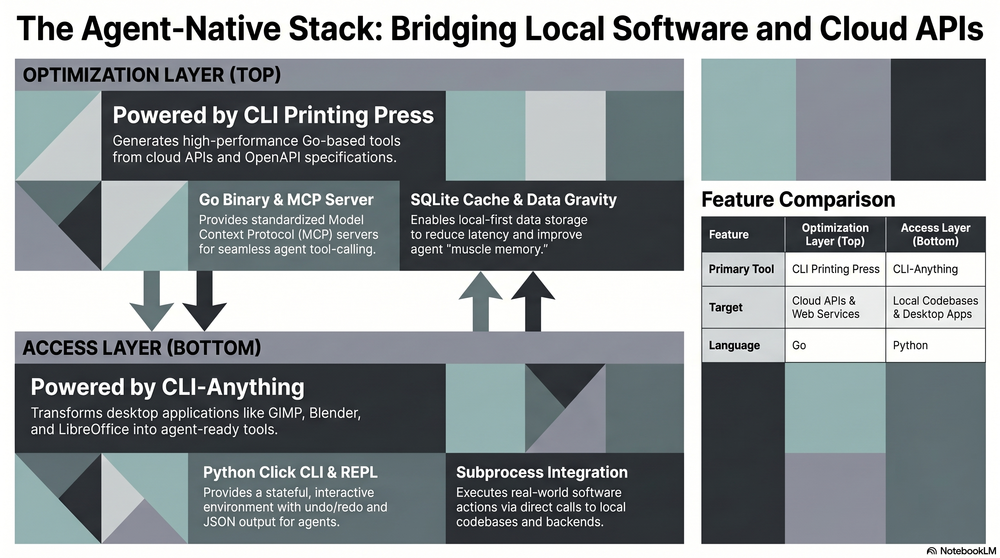
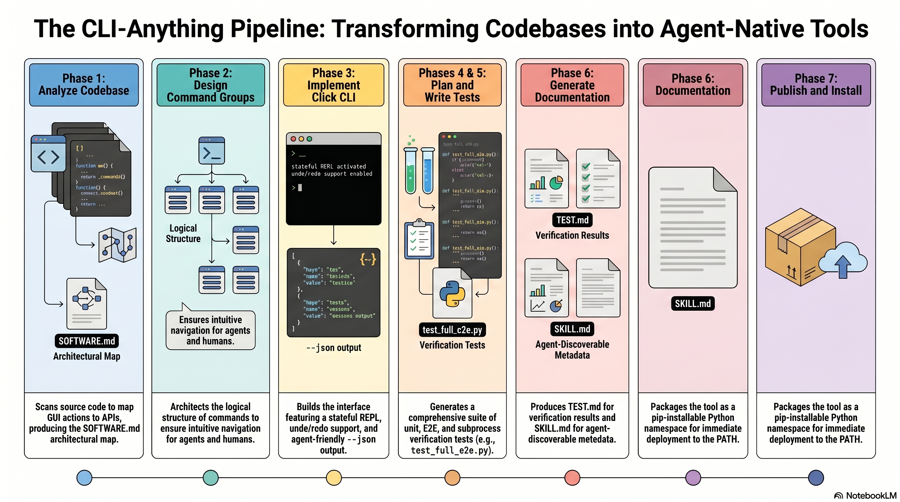

<!-- _class: title -->

# CLI-Anything vs CLI Printing Press

วางสถาปัตยกรรม AI Agent ให้ถูก Layer — Access vs Optimization

<!-- Speaker: Both tools solve the same root problem — agents can't reach real software — but from opposite directions. This deck shows when to use each and how they compose. -->

---

## AI Agent ยังเข้าไม่ถึง "Software จริง" ในองค์กร

สองทางที่มีอยู่ต่างก็มีจุดอ่อน — ต้องการวิธีใหม่

  

    
ทางที่ 1: เรียก REST API

    <h3>Software ในองค์กรไม่มี API</h3>
    
Legacy apps, desktop tools, internal systems ส่วนใหญ่ไม่มี REST endpoint ให้เรียก agent ต้องทำงานกับ raw interface แทน

  

  

    
ทางที่ 2: Browser/UI Automation

    <h3>Fragile, แพง, ไม่ reproducible</h3>
    
Screenshot-based automation พัง เมื่อ UI เปลี่ยน token cost สูง latency สูง และไม่ reliable สำหรับ production workflow

  

<b>★ Takeaway:</b> ต้องการ third path — CLI layer ที่ agent เรียกได้โดยตรงโดยไม่พึ่ง UI

<!-- Speaker: Both current approaches have fundamental flaws. The answer is a CLI abstraction layer between agent and software. -->

---

## Two-Layer Agent Architecture Stack

CLI-Anything = Access Layer | CLI Printing Press = Optimization Layer

<figure class="img-card">

<figcaption>Source: NotebookLM · Access Layer handles local software; Optimization Layer handles remote APIs</figcaption>
</figure>

<b>★ Takeaway:</b> คนละ layer ในสถาปัตยกรรมเดียวกัน — ไม่ใช่คู่แข่ง

<!-- Speaker: Think of it as two layers. CLI-Anything is the wide-access layer at the bottom. Printing Press is the efficiency layer at the top for high-frequency API calls. -->

---

## CLI-Anything: ให้ Agent ใช้ Software จริง ไม่ใช่ Workaround

Python Click CLI + Stateful REPL + --json flag = agent-native interface จาก codebase จริง

  

    
Philosophy

    <h3>Use Real Software</h3>
    
Integrate กับ real backend ผ่าน subprocess หรือ native APIs — ไม่ใช่ reimplementation

  

  

    
Key Features

    <h3>Stateful REPL + JSON</h3>
    
Persistent project state, undo/redo, built-in --json flag ทุก command สำหรับ machine-readable output

  

  

    
Output

    <h3>pip install + SKILL.md</h3>
    
Installable Python package + agent-discoverable SKILL.md ให้ Claude Code ค้นพบได้อัตโนมัติ

  

<b>★ Takeaway:</b> 1,508+ tests รองรับ real apps: Blender, LibreOffice, GIMP, Zotero, CloudCompare

<!-- Speaker: The key insight is using the real software — not building a fake version of it. -->

---

## CLI-Anything: 7-Phase Automated Pipeline

Deterministic pipeline — ไม่ต้องแก้ไขด้วยมือ ทุก phase มี output ที่ verifiable

<figure class="img-card">

<figcaption>Source: NotebookLM · Phase 1–7: Analyze → Design → Implement → Test × 2 → Document → Publish</figcaption>
</figure>

<b>★ Takeaway:</b> Analyze codebase → Software.md → CLI → Tests → SKILL.md → pip install — อัตโนมัติทั้งหมด

<!-- Speaker: This is a fully automated pipeline. You point it at a codebase and get a tested, installable CLI with agent metadata. -->

---

## CLI Printing Press: Data Gravity เปลี่ยน Cloud API ให้เป็น Local Tool

Go binary + SQLite cache + MCP server = agent มี "muscle memory" สำหรับทุก API

  

    
Philosophy

    <h3>Data Gravity</h3>
    
ดึง API data มาไว้ local แทนที่จะให้ agent fetch ทุกครั้ง — ลด latency + token cost อย่างมีนัยสำคัญ

  

  

    
Architecture

    <h3>Go + SQLite + MCP</h3>
    
Statically compiled Go binary, SQLite sync layer, offline search, typed exit codes, machine-owned freshness

  

  

    
Output per run

    <h3>CLI + MCP + Manuscript</h3>
    
Go binary + MCP server (Claude Code ready) + Manuscript proof-of-work + Scorecard quality audit

  

<b>★ Takeaway:</b> Input: OpenAPI spec / GraphQL / HAR file — Output: production-grade Go CLI + MCP server

<!-- Speaker: Data Gravity is the key innovation. Instead of the agent traveling to the API, you bring the data locally. -->

---

## CLI Printing Press: 9-Phase Managed Pipeline

จาก API spec ถึง production CLI — 9 phases ที่ออกแบบมาสำหรับ agent-native ergonomics

<figure class="img-card">

<figcaption>Source: NotebookLM · Phase 1–9: Preflight → Research → Scaffold → Enrich → Regenerate → Review → Agent-readiness → Comparative → Ship</figcaption>
</figure>

<b>★ Takeaway:</b> Phase "Research" รองรับ HAR file สำหรับ API ที่ไม่มี official docs — capture browser traffic แล้วส่งเข้า pipeline

<!-- Speaker: The HAR file support is especially powerful for undocumented internal APIs. Capture the traffic once, generate the CLI from it. -->

---

## เปรียบเทียบ: CLI-Anything vs CLI Printing Press

คนละ target, คนละ language, คนละ pipeline — แต่ agent-native standards เหมือนกัน

<figure class="img-card">

<figcaption>Source: NotebookLM · Comparison across target, language, pipeline, key feature, and example use cases</figcaption>
</figure>

<b>★ Takeaway:</b> ทั้งสองใช้ --help discovery + structured JSON + MCP — agent compose ได้ใน workflow เดียวกัน

<!-- Speaker: Despite the differences, both tools speak the same agent-native language. That's what makes them composable. -->

---

## เลือกใช้อะไร ตอนไหน: Decision Framework

คำถามเดียวที่ต้องถาม: มี source code หรือมี API spec?

<figure class="img-card">

<figcaption>Source: NotebookLM · Decision tree: local source code → CLI-Anything | remote API → CLI Printing Press</figcaption>
</figure>

<b>★ Takeaway:</b> Source code อยู่ local → CLI-Anything | เรียก API/web service → CLI Printing Press | ทั้งสองอยู่ใน stack เดียวกัน

<!-- Speaker: The decision is simple. If you have source code, use CLI-Anything. If you have an API, use Printing Press. In real systems, you'll almost always need both. -->

---

## สถาปัตยกรรมสมบูรณ์: Access + Optimization Stack

CLI-Anything เป็น foundation — CLI Printing Press optimize APIs ที่ใช้งานหนัก

<svg viewBox="0 0 1100 360" width="100%" xmlns="http://www.w3.org/2000/svg">
  <!-- Agent box at top -->
  <rect x="380" y="10" width="340" height="52" rx="10" fill="var(--accent)" style="filter:drop-shadow(var(--shadow-md))"/>
  <text x="550" y="42" font-size="18" font-weight="700" fill="white" text-anchor="middle" font-family="system-ui">AI Agent</text>
  <!-- Arrow down -->
  <line x1="550" y1="62" x2="550" y2="90" stroke="var(--muted)" stroke-width="2" marker-end="url(#arrowhead)"/>
  <!-- Optimization Layer -->
  <rect x="200" y="90" width="700" height="100" rx="12" fill="var(--accent-wash)" stroke="var(--accent)" stroke-width="2"/>
  <text x="550" y="126" font-size="16" font-weight="700" fill="var(--accent-deep)" text-anchor="middle" font-family="system-ui">Optimization Layer — CLI Printing Press</text>
  <text x="550" y="150" font-size="13" fill="var(--ink-dim)" text-anchor="middle" font-family="system-ui">Go binary + SQLite cache + MCP server | GitHub, Stripe, Salesforce, internal REST/GraphQL APIs</text>
  <text x="550" y="172" font-size="12" fill="var(--muted)" text-anchor="middle" font-family="system-ui">Data Gravity: local-first | offline search | compound queries | low latency</text>
  <!-- Arrow down -->
  <line x1="550" y1="190" x2="550" y2="218" stroke="var(--muted)" stroke-width="2" marker-end="url(#arrowhead)"/>
  <!-- Access Layer -->
  <rect x="200" y="218" width="700" height="100" rx="12" fill="var(--success-wash)" stroke="var(--success)" stroke-width="2"/>
  <text x="550" y="254" font-size="16" font-weight="700" fill="var(--success-ink)" text-anchor="middle" font-family="system-ui">Access Layer — CLI-Anything</text>
  <text x="550" y="278" font-size="13" fill="var(--ink-dim)" text-anchor="middle" font-family="system-ui">Python Click CLI + Stateful REPL | Blender, LibreOffice, GIMP, legacy desktop apps</text>
  <text x="550" y="300" font-size="12" fill="var(--muted)" text-anchor="middle" font-family="system-ui">Use Real Software: subprocess/native APIs | pip install | SKILL.md discoverable</text>
  <!-- Arrow down -->
  <line x1="550" y1="318" x2="550" y2="346" stroke="var(--muted)" stroke-width="2" marker-end="url(#arrowhead)"/>
  <!-- Real Software box -->
  <rect x="380" y="346" width="340" height="10" rx="4" fill="var(--soft-2)"/>
  <defs>
    <marker id="arrowhead" markerWidth="8" markerHeight="6" refX="8" refY="3" orient="auto">
      <polygon points="0 0, 8 3, 0 6" fill="var(--muted)"/>
    </marker>
  </defs>
</svg>

<b>★ Takeaway:</b> CLI-Anything ในขั้นเริ่มต้นเพื่อ coverage กว้างสุด — Printing Press ในขั้น optimize APIs ที่ใช้งานหนัก

<!-- Speaker: This is the recommended architecture. Start with CLI-Anything for broad access, layer Printing Press on top for APIs that need optimization. -->

---

## Key Takeaways

สิ่งที่ต้องจำจาก deck นี้

  

    
CLI-Anything

    <h3>Access Layer</h3>
    
ใช้กับ software ที่มี source code — Desktop apps, legacy tools, GUI software ที่ไม่มี API pipeline 7 phases: Analyze → Publish

  

  

    
CLI Printing Press

    <h3>Optimization Layer</h3>
    
ใช้กับ API/web services ที่ต้องการ efficiency — Data Gravity, SQLite cache, MCP server pipeline 9 phases: Preflight → Ship

  

  

    
Decision Rule

    <h3>มี source code? → CLI-Anything</h3>
    
มี API spec/HAR? → Printing Press ทั้งสองร่วมกันในระบบเดียว = coverage + efficiency

  

  

    
Key Insight

    <h3>Data Gravity เปลี่ยนเกม</h3>
    
แทนที่ agent เดินทางไปหา API — ดึงข้อมูลมาไว้ local ก่อน agent ทำงานที่ local speed

  

<b>★ Takeaway:</b> วาง CLI-Anything เป็น foundation ก่อน — ใช้ Printing Press optimize APIs สำคัญที่ใช้งานหนักหรือมี cost สูง

<!-- Speaker: The one-sentence summary: CLI-Anything gives you access to everything, Printing Press makes the APIs you use most run faster and cheaper. -->
