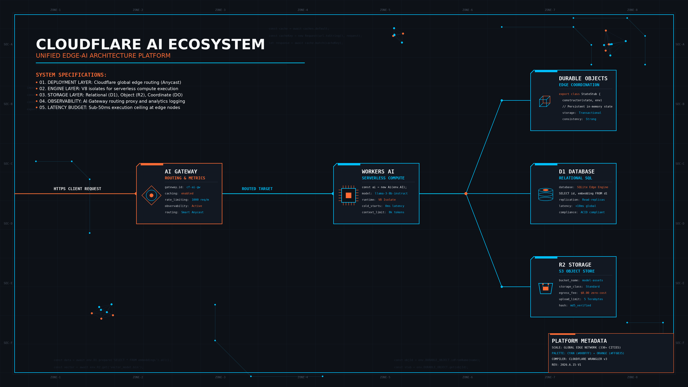
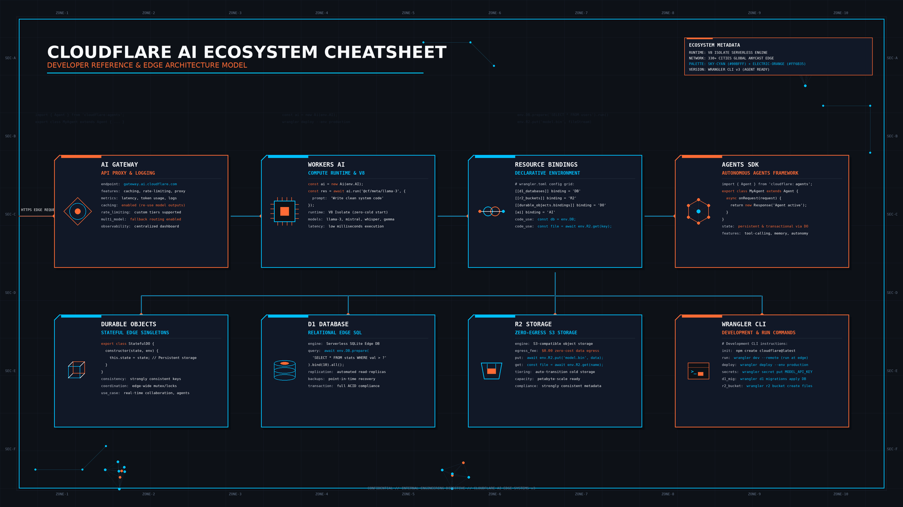
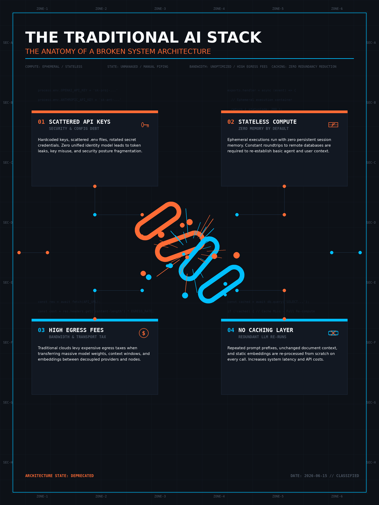
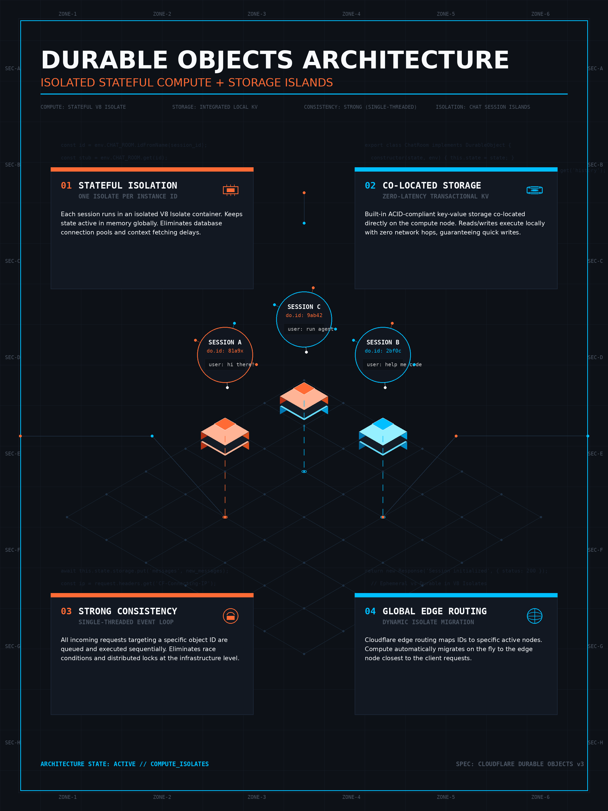

<!-- _class: title -->

# Cloudflare AI Ecosystem

Workers · Durable Objects · D1 · AI Gateway · Agents SDK — complete platform, zero API keys

<!-- Speaker: Cloudflare AI is not just GPU inference — it's a complete platform where every service wires together without a single API key in your code. -->

---

<!-- _class: cheatsheet -->
<!-- _backgroundColor: #f8f7f4 -->

<!-- Speaker: 60-second orientation — 8 components at a glance. Workers at the center, D1/R2 for zero-egress storage, AI Gateway for caching and model routing, Bindings as the glue. -->

---

## Complete Platform, Not Just GPU Inference

Cloudflare AI bundles runtime, storage, auth, and AI — wired together with no credentials in code.

<svg viewBox="0 0 1100 320" width="100%" xmlns="http://www.w3.org/2000/svg">
  <rect x="40" y="20" width="1020" height="280" rx="16" fill="var(--paper)" stroke="var(--soft-2)" stroke-width="1.5" style="filter:drop-shadow(0 4px 12px rgba(15,23,42,.08))"/>
  <rect x="40" y="20" width="8" height="280" rx="4" fill="var(--accent)"/>
  <text x="84" y="80" font-size="17" font-weight="700" fill="var(--ink)" font-family="system-ui">Workers</text>
  <text x="84" y="104" font-size="14" fill="var(--ink-dim)" font-family="system-ui">Serverless runtime — V8 isolates, 330+ cities</text>
  <text x="84" y="148" font-size="17" font-weight="700" fill="var(--ink)" font-family="system-ui">Durable Objects</text>
  <text x="84" y="172" font-size="14" fill="var(--ink-dim)" font-family="system-ui">Per-session compute + SQLite storage in one unit</text>
  <text x="84" y="216" font-size="17" font-weight="700" fill="var(--ink)" font-family="system-ui">D1 + R2</text>
  <text x="84" y="240" font-size="14" fill="var(--ink-dim)" font-family="system-ui">SQL + Object storage — zero egress fees</text>
  <text x="560" y="80" font-size="17" font-weight="700" fill="var(--ink)" font-family="system-ui">AI Gateway</text>
  <text x="560" y="104" font-size="14" fill="var(--ink-dim)" font-family="system-ui">Cache, model fallback, spend limits</text>
  <text x="560" y="148" font-size="17" font-weight="700" fill="var(--ink)" font-family="system-ui">Cloudflare Access</text>
  <text x="560" y="172" font-size="14" fill="var(--ink-dim)" font-family="system-ui">Zero-trust auth — no code change needed</text>
  <text x="560" y="216" font-size="17" font-weight="700" fill="var(--accent)" font-family="system-ui">Bindings</text>
  <text x="560" y="240" font-size="14" fill="var(--ink-dim)" font-family="system-ui">All services wired via wrangler.toml — no API keys</text>
  <line x1="540" y1="50" x2="540" y2="280" stroke="var(--soft-2)" stroke-width="1.5"/>
  <text x="84" y="284" font-size="15" font-weight="700" fill="var(--accent)" font-family="system-ui">+ Agents SDK (Agents Week 2026):</text>
  <text x="380" y="284" font-size="14" fill="var(--ink-dim)" font-family="system-ui">State + WebSockets + Tools — no infra provisioning</text>
  <rect x="0" y="0" width="1" height="1" fill="none"/>
</svg>

<b>★ Takeaway:</b> One wrangler.toml wires your entire AI stack — runtime, storage, auth, AI, agents — no secrets in code.

<!-- Speaker: This is the TL;DR. Every service maps to a binding name — env.AI, env.DB, env.BUCKET. No .env, no IAM roles, no credentials in source code. -->

---

## Traditional AI Stack Has 4 Broken Seams

Most teams patch each seam separately — Cloudflare seals all four with one platform.

  

    
Problem 1

    <h3>Scattered API Keys</h3>
    
OpenAI key in .env, Anthropic in secrets manager, DB creds in CI — breach surface multiplies with every provider added.

  

  

    
Problem 2

    <h3>Stateless Compute</h3>
    
Lambda/Cloud Run forgets session on every request — storing chat history means a separate Redis or DynamoDB call.

  

  

    
Problem 3

    <h3>Egress Tax</h3>
    
S3 + RDS charge per GB transferred out — AI-generated files and query responses add up fast at any real scale.

  

  

    
Problem 4

    <h3>No Caching Layer</h3>
    
Identical prompts sent to OpenAI repeatedly — no request dedup, no spend cap, no model fallback on provider outage.

  

<b>★ Takeaway:</b> Bindings, Durable Objects, D1/R2, and AI Gateway each seal exactly one of these four broken seams.

<!-- Speaker: Four broken seams — each solved by exactly one Cloudflare primitive. This is the architecture story. -->

---

## Workers: Edge Inference, Zero Cold Start

V8 isolates start in sub-millisecond — inference runs at the nearest of 330+ PoPs without container spin-up.

<svg viewBox="0 0 1100 280" width="100%" xmlns="http://www.w3.org/2000/svg">
  <rect x="20" y="100" width="150" height="80" rx="12" fill="var(--paper)" stroke="var(--soft-2)" stroke-width="1.5"/>
  <text x="95" y="136" font-size="13" font-weight="700" fill="var(--ink)" text-anchor="middle" font-family="system-ui">User</text>
  <text x="95" y="158" font-size="12" fill="var(--ink-dim)" text-anchor="middle" font-family="system-ui">HTTPS request</text>
  <line x1="170" y1="140" x2="220" y2="140" stroke="var(--accent)" stroke-width="2"/>
  <polygon points="220,135 230,140 220,145" fill="var(--accent)"/>
  <rect x="230" y="100" width="150" height="80" rx="12" fill="var(--accent-wash)" stroke="var(--accent)" stroke-width="2"/>
  <text x="305" y="136" font-size="13" font-weight="700" fill="var(--accent-deep)" text-anchor="middle" font-family="system-ui">Edge PoP</text>
  <text x="305" y="158" font-size="12" fill="var(--accent-deep)" text-anchor="middle" font-family="system-ui">330+ cities</text>
  <line x1="380" y1="140" x2="430" y2="140" stroke="var(--accent)" stroke-width="2"/>
  <polygon points="430,135 440,140 430,145" fill="var(--accent)"/>
  <rect x="440" y="80" width="170" height="120" rx="12" fill="var(--paper)" stroke="var(--soft-2)" stroke-width="1.5" style="filter:drop-shadow(var(--shadow-md))"/>
  <text x="525" y="128" font-size="13" font-weight="700" fill="var(--ink)" text-anchor="middle" font-family="system-ui">V8 Isolate</text>
  <text x="525" y="150" font-size="12" fill="var(--ink-dim)" text-anchor="middle" font-family="system-ui">Worker code</text>
  <text x="525" y="170" font-size="11" fill="var(--muted)" text-anchor="middle" font-family="system-ui">sub-ms start</text>
  <rect x="450" y="196" width="150" height="22" rx="6" fill="var(--soft)" stroke="var(--soft-2)" stroke-width="1"/>
  <text x="525" y="210" font-size="11" fill="var(--accent)" text-anchor="middle" font-family="system-ui">env.AI.run(...)</text>
  <line x1="610" y1="140" x2="660" y2="140" stroke="var(--accent)" stroke-width="2"/>
  <polygon points="660,135 670,140 660,145" fill="var(--accent)"/>
  <rect x="670" y="80" width="170" height="120" rx="12" fill="var(--accent)" opacity=".9"/>
  <text x="755" y="128" font-size="13" font-weight="700" fill="white" text-anchor="middle" font-family="system-ui">Workers AI</text>
  <text x="755" y="150" font-size="12" fill="rgba(255,255,255,.85)" text-anchor="middle" font-family="system-ui">50+ models</text>
  <text x="755" y="170" font-size="12" fill="rgba(255,255,255,.85)" text-anchor="middle" font-family="system-ui">serverless GPU</text>
  <line x1="840" y1="140" x2="890" y2="140" stroke="var(--muted)" stroke-width="1.5" stroke-dasharray="5,3"/>
  <rect x="900" y="100" width="170" height="80" rx="12" fill="var(--success-wash)" stroke="var(--success)" stroke-width="1.5"/>
  <text x="985" y="136" font-size="13" font-weight="700" fill="var(--success-ink)" text-anchor="middle" font-family="system-ui">Response</text>
  <text x="985" y="158" font-size="12" fill="var(--success-ink)" text-anchor="middle" font-family="system-ui">JSON / Stream</text>
  <rect x="0" y="0" width="1" height="1" fill="none"/>
</svg>

<b>★ Takeaway:</b> env.AI is a runtime binding, not an HTTP client — no external API call leaves user code; Cloudflare routes to the nearest GPU automatically.

<!-- Speaker: The key insight: env.AI talks to Workers AI inside Cloudflare's network. No external API call, no latency penalty, no credential exposure. -->

---

## Durable Objects: Compute + State, Per Session

Each DO instance is a unique JavaScript class + SQLite storage unit — no shared state between sessions.

  

    
Inside one DO instance

    <h3>Compute + Storage fused</h3>
    
Class methods run in the same process as the SQLite KV store — strongly consistent read-after-write, no race conditions.

  

  

    
Isolation guarantee

    <h3>User A != User B</h3>
    
Worker routes by <code>idFromName(sessionId)</code> — each session ID maps to a unique DO; zero shared state leak.

  

  

    
Use cases

    <h3>Chat · Game · Collab</h3>
    
Multi-turn chat history, game state, collaborative documents, real-time coordination. All stateful — no Redis needed.

  

  

    
Constraint

    <h3>Paid plan only</h3>
    
$5/mo minimum. Cold start ~100ms. Max 128 KB per key — use R2 for large payloads like images or generated PDFs.

  

<b>★ Takeaway:</b> Durable Objects replace Redis + DB coordination for per-user state — one primitive, strongly consistent, isolated by session ID.

<!-- Speaker: Think of DO as "each chat session gets its own mini-server." No synchronization needed, no race conditions, no cross-session leaks. -->

---

## D1 + R2: Storage Without the Egress Tax

SQLite + S3-compatible object storage — both accessed from Workers with zero bandwidth fees.

<svg viewBox="0 0 1100 320" width="100%" xmlns="http://www.w3.org/2000/svg">
  <rect x="30" y="20" width="475" height="280" rx="12" fill="var(--paper)" stroke="var(--soft-2)" stroke-width="1.5" style="filter:drop-shadow(var(--shadow-sm))"/>
  <rect x="30" y="20" width="475" height="52" rx="12" fill="var(--danger-wash)"/>
  <text x="267" y="52" font-size="16" font-weight="700" fill="var(--danger-ink)" text-anchor="middle" font-family="system-ui">Traditional: S3 + RDS</text>
  <text x="60" y="100" font-size="14" fill="var(--ink)" font-family="system-ui">S3 egress: ~$0.09/GB transferred out</text>
  <text x="60" y="128" font-size="14" fill="var(--ink-dim)" font-family="system-ui">RDS data transfer: $0.01-0.09/GB</text>
  <text x="60" y="156" font-size="14" fill="var(--ink-dim)" font-family="system-ui">Separate credentials per service</text>
  <text x="60" y="184" font-size="14" fill="var(--ink-dim)" font-family="system-ui">VPC peering required for low latency</text>
  <text x="60" y="220" font-size="14" fill="var(--danger)" font-family="system-ui">10M row reads/day = ~$0.70 egress</text>
  <text x="60" y="248" font-size="14" fill="var(--danger)" font-family="system-ui">1 TB S3 download = ~$90 egress fee</text>
  <text x="60" y="280" font-size="13" fill="var(--muted)" font-family="system-ui">bills compound with every AI output stored</text>
  <rect x="595" y="20" width="475" height="280" rx="12" fill="var(--paper)" stroke="var(--success)" stroke-width="2" style="filter:drop-shadow(var(--shadow-md))"/>
  <rect x="595" y="20" width="475" height="52" rx="12" fill="var(--success-wash)"/>
  <text x="832" y="52" font-size="16" font-weight="700" fill="var(--success-ink)" text-anchor="middle" font-family="system-ui">Cloudflare: D1 + R2</text>
  <text x="625" y="100" font-size="14" fill="var(--ink)" font-family="system-ui">R2 egress: $0.00 — zero bandwidth fees</text>
  <text x="625" y="128" font-size="14" fill="var(--ink-dim)" font-family="system-ui">D1: 5M row reads free / day</text>
  <text x="625" y="156" font-size="14" fill="var(--ink-dim)" font-family="system-ui">Bound via wrangler.toml — no credentials</text>
  <text x="625" y="184" font-size="14" fill="var(--ink-dim)" font-family="system-ui">Co-located with Worker — sub-ms latency</text>
  <text x="625" y="220" font-size="14" fill="var(--success)" font-family="system-ui">10M row reads/day = $0.00 egress</text>
  <text x="625" y="248" font-size="14" fill="var(--success)" font-family="system-ui">1 TB R2 download from Worker = $0.00</text>
  <text x="625" y="280" font-size="13" fill="var(--muted)" font-family="system-ui">store AI outputs freely — egress is free</text>
  <circle cx="548" cy="160" r="28" fill="var(--accent)"/>
  <text x="548" y="165" font-size="14" font-weight="700" fill="white" text-anchor="middle" dominant-baseline="central" font-family="system-ui">VS</text>
  <rect x="0" y="0" width="1" height="1" fill="none"/>
</svg>

<b>★ Takeaway:</b> Switch to D1 + R2 and egress vanishes from the bill — store every AI output, chat log, and generated file without cost anxiety.

<!-- Speaker: At scale, the difference between $90/TB and $0 compounds every month. This is the cost story of Cloudflare AI — egress is the hidden tax that disappears. -->

---

## AI Gateway: Cache, Route, Control

Sits between Worker and every AI provider — adds caching, fallback, rate limits, and spend caps in one config.

  

    
Cost control

    <h3>Response Caching</h3>
    
Identical prompt hash → return cached response. Configurable TTL. One cache hit saves the full token cost.

  

  

    
Reliability

    <h3>Model Fallback</h3>
    
OpenAI 503 → auto-route to Anthropic or Workers AI. Chain multiple providers; configure in dashboard — no code change.

  

  

    
Safety

    <h3>Real-time Spend Limits</h3>
    
Hard budget cap per gateway. Requests halt the moment the limit hits — no surprise bill from a prompt loop or DDoS.

  

  

    
Governance

    <h3>Rate Limiting</h3>
    
Requests/tokens per minute per user. Block abusive clients without touching Worker code.

  

  

    
Observability

    <h3>Full Request Logs</h3>
    
Every request logged: prompt, model, latency, token usage, cache hit/miss. Searchable from the dashboard.

  

  

    
Cloudflare internal

    <h3>20M Requests Routed</h3>
    
241B tokens processed. 3,683 internal users. Cloudflare runs the same AI Gateway they ship to customers.

  

<b>★ Takeaway:</b> AI Gateway adds caching + fallback + spend limits in one gateway binding — no SDK change, no new library, just a gateway config.

<!-- Speaker: The spend limit feature alone prevents runaway costs from infinite retry loops. The cache pays for itself after the first repeated identical prompt. -->

---

## Cloudflare Access: Zero-Trust Auth, Zero Code

Put enterprise SSO in front of any Worker — JWT validates before code runs, no auth library needed.

  

    
Supported providers

    <h3>SSO without SDK</h3>
    <ul>
      <li>Google Workspace</li>
      <li>GitHub OAuth</li>
      <li>Azure AD / SAML</li>
      <li>OIDC / custom IdP</li>
    </ul>
  

  

    
How it works

    <h3>JWT at the Edge</h3>
    
Access injects <code>CF-Access-JWT-Assertion</code> header. Worker reads it directly — no session cookie, no auth middleware to maintain.

  

  

    
Setup

    <h3>Dashboard only</h3>
    
Zero Trust → Access → Add application → pick Worker URL → pick IdP. Done. Zero lines of auth code in your app.

  

  

    
Best for

    <h3>Internal AI Tools</h3>
    
Admin panels, internal agents, GPT-wrapper tools for your team — gate with company SSO without building a login flow.

  

<b>★ Takeaway:</b> Cloudflare Access adds enterprise auth to any Worker in 5 dashboard clicks — no auth code, no library, no session management.

<!-- Speaker: This is the "no code" auth story for internal tools. If you're building a GPT wrapper for your team, Access is the fastest path to SSO. -->

---

## Bindings: The Glue That Removes API Keys

Declare services in wrangler.toml — runtime injects typed TypeScript interfaces; credentials never enter source code.

<svg viewBox="0 0 1100 320" width="100%" xmlns="http://www.w3.org/2000/svg">
  <rect x="400" y="110" width="300" height="100" rx="12" fill="var(--accent)" style="filter:drop-shadow(var(--shadow-md))"/>
  <text x="550" y="152" font-size="16" font-weight="700" fill="white" text-anchor="middle" font-family="system-ui">Worker</text>
  <text x="550" y="174" font-size="13" fill="rgba(255,255,255,.85)" text-anchor="middle" font-family="system-ui">env.AI  env.DB</text>
  <text x="550" y="194" font-size="13" fill="rgba(255,255,255,.85)" text-anchor="middle" font-family="system-ui">env.BUCKET  env.DO</text>
  <rect x="20" y="20" width="180" height="70" rx="10" fill="var(--paper)" stroke="var(--soft-2)" stroke-width="1.5"/>
  <text x="110" y="50" font-size="13" font-weight="700" fill="var(--ink)" text-anchor="middle" font-family="system-ui">Workers AI</text>
  <text x="110" y="72" font-size="11" fill="var(--muted)" text-anchor="middle" font-family="system-ui">env.AI binding</text>
  <line x1="200" y1="55" x2="400" y2="148" stroke="var(--accent)" stroke-width="1.5" stroke-dasharray="6,3"/>
  <rect x="20" y="230" width="180" height="70" rx="10" fill="var(--paper)" stroke="var(--soft-2)" stroke-width="1.5"/>
  <text x="110" y="260" font-size="13" font-weight="700" fill="var(--ink)" text-anchor="middle" font-family="system-ui">Durable Objects</text>
  <text x="110" y="282" font-size="11" fill="var(--muted)" text-anchor="middle" font-family="system-ui">env.DO binding</text>
  <line x1="200" y1="265" x2="400" y2="185" stroke="var(--accent)" stroke-width="1.5" stroke-dasharray="6,3"/>
  <rect x="900" y="20" width="180" height="70" rx="10" fill="var(--paper)" stroke="var(--soft-2)" stroke-width="1.5"/>
  <text x="990" y="50" font-size="13" font-weight="700" fill="var(--ink)" text-anchor="middle" font-family="system-ui">D1 Database</text>
  <text x="990" y="72" font-size="11" fill="var(--muted)" text-anchor="middle" font-family="system-ui">env.DB binding</text>
  <line x1="900" y1="55" x2="700" y2="148" stroke="var(--accent)" stroke-width="1.5" stroke-dasharray="6,3"/>
  <rect x="900" y="230" width="180" height="70" rx="10" fill="var(--paper)" stroke="var(--soft-2)" stroke-width="1.5"/>
  <text x="990" y="260" font-size="13" font-weight="700" fill="var(--ink)" text-anchor="middle" font-family="system-ui">R2 Bucket</text>
  <text x="990" y="282" font-size="11" fill="var(--muted)" text-anchor="middle" font-family="system-ui">env.BUCKET binding</text>
  <line x1="900" y1="265" x2="700" y2="185" stroke="var(--accent)" stroke-width="1.5" stroke-dasharray="6,3"/>
  <rect x="375" y="260" width="350" height="55" rx="10" fill="var(--soft)" stroke="var(--accent)" stroke-width="2"/>
  <text x="550" y="285" font-size="14" font-weight="700" fill="var(--accent)" text-anchor="middle" font-family="system-ui">wrangler.toml</text>
  <text x="550" y="305" font-size="12" fill="var(--ink-dim)" text-anchor="middle" font-family="system-ui">single source of truth — no .env file</text>
  <line x1="550" y1="260" x2="550" y2="210" stroke="var(--gold)" stroke-width="2" stroke-dasharray="5,3"/>
  <rect x="0" y="0" width="1" height="1" fill="none"/>
</svg>

<b>★ Takeaway:</b> Bindings are the security architecture — credentials live in Cloudflare's runtime, never in source code, never in environment variables.

<!-- Speaker: Every arrow here is declared in wrangler.toml — no API key appears anywhere in TypeScript. This is Cloudflare's core security insight: move credentials into the platform. -->

---

## Agents SDK + cf CLI: Scaffold to Deploy in Minutes

Agents Week 2026 — production-ready agent with WebSockets, DO state, and tool calls out of the box.

<svg viewBox="0 0 1100 260" width="100%" xmlns="http://www.w3.org/2000/svg">
  <rect x="10" y="80" width="180" height="100" rx="12" fill="var(--paper)" stroke="var(--soft-2)" stroke-width="1.5"/>
  <text x="100" y="120" font-size="12" font-weight="700" fill="var(--ink)" text-anchor="middle" font-family="system-ui">npm create</text>
  <text x="100" y="140" font-size="11" fill="var(--ink-dim)" text-anchor="middle" font-family="system-ui">cloudflare@latest</text>
  <text x="100" y="160" font-size="11" fill="var(--muted)" text-anchor="middle" font-family="system-ui">--template ai-agent</text>
  <line x1="190" y1="130" x2="220" y2="130" stroke="var(--accent)" stroke-width="2"/>
  <polygon points="220,125 230,130 220,135" fill="var(--accent)"/>
  <rect x="230" y="80" width="160" height="100" rx="12" fill="var(--paper)" stroke="var(--soft-2)" stroke-width="1.5"/>
  <text x="310" y="120" font-size="12" font-weight="700" fill="var(--ink)" text-anchor="middle" font-family="system-ui">npm run dev</text>
  <text x="310" y="140" font-size="11" fill="var(--ink-dim)" text-anchor="middle" font-family="system-ui">localhost:8787</text>
  <text x="310" y="160" font-size="11" fill="var(--muted)" text-anchor="middle" font-family="system-ui">live reload</text>
  <line x1="390" y1="130" x2="420" y2="130" stroke="var(--accent)" stroke-width="2"/>
  <polygon points="420,125 430,130 420,135" fill="var(--accent)"/>
  <rect x="430" y="60" width="190" height="120" rx="12" fill="var(--accent-wash)" stroke="var(--accent)" stroke-width="2"/>
  <text x="525" y="105" font-size="12" font-weight="700" fill="var(--accent-deep)" text-anchor="middle" font-family="system-ui">Add Bindings</text>
  <text x="525" y="125" font-size="11" fill="var(--accent-deep)" text-anchor="middle" font-family="system-ui">AI + D1 + R2 + DO</text>
  <text x="525" y="145" font-size="11" fill="var(--muted)" text-anchor="middle" font-family="system-ui">wrangler.toml</text>
  <text x="525" y="165" font-size="11" fill="var(--accent)" text-anchor="middle" font-family="system-ui">critical step</text>
  <line x1="620" y1="130" x2="650" y2="130" stroke="var(--accent)" stroke-width="2"/>
  <polygon points="650,125 660,130 650,135" fill="var(--accent)"/>
  <rect x="660" y="80" width="160" height="100" rx="12" fill="var(--paper)" stroke="var(--soft-2)" stroke-width="1.5"/>
  <text x="740" y="120" font-size="12" font-weight="700" fill="var(--ink)" text-anchor="middle" font-family="system-ui">cf deploy</text>
  <text x="740" y="140" font-size="11" fill="var(--ink-dim)" text-anchor="middle" font-family="system-ui">330+ PoPs</text>
  <text x="740" y="160" font-size="11" fill="var(--muted)" text-anchor="middle" font-family="system-ui">instant global</text>
  <line x1="820" y1="130" x2="850" y2="130" stroke="var(--accent)" stroke-width="2"/>
  <polygon points="850,125 860,130 850,135" fill="var(--accent)"/>
  <rect x="860" y="80" width="215" height="100" rx="12" fill="var(--success-wash)" stroke="var(--success)" stroke-width="1.5"/>
  <text x="967" y="118" font-size="12" font-weight="700" fill="var(--success-ink)" text-anchor="middle" font-family="system-ui">wrangler tail</text>
  <text x="967" y="138" font-size="11" fill="var(--success-ink)" text-anchor="middle" font-family="system-ui">live logs + AI Gateway</text>
  <text x="967" y="158" font-size="11" fill="var(--muted)" text-anchor="middle" font-family="system-ui">dashboard monitoring</text>
  <rect x="270" y="208" width="560" height="30" rx="8" fill="var(--soft)" stroke="var(--soft-2)" stroke-width="1"/>
  <text x="550" y="226" font-size="11" fill="var(--ink-dim)" text-anchor="middle" font-family="system-ui">Agents SDK: WebSockets + DO state + cron tasks + MCP tools + browser automation + payments</text>
  <rect x="0" y="0" width="1" height="1" fill="none"/>
</svg>

<b>★ Takeaway:</b> npm create cloudflare + ai-agent template gives state, WebSockets, tools, and 330-PoP global deploy — no infra provisioning at all.

<!-- Speaker: The cf CLI unifies wrangler, d1, r2, and ai into one command. The ai-agent template wires DO state + WebSocket + tools by default — deploy in under 10 minutes. -->

---

## User Guide: 7 Steps to First AI Worker

From zero to deployed AI app — each step adds one binding; entire stack is live in under 10 minutes.

<svg viewBox="0 0 1100 260" width="100%" xmlns="http://www.w3.org/2000/svg">
  <rect x="10" y="10" width="240" height="90" rx="10" fill="var(--paper)" stroke="var(--soft-2)" stroke-width="1.5"/>
  <circle cx="42" cy="55" r="18" fill="var(--accent)"/>
  <text x="42" y="60" font-size="14" font-weight="700" fill="white" text-anchor="middle" font-family="system-ui">1</text>
  <text x="82" y="44" font-size="12" font-weight="700" fill="var(--ink)" font-family="system-ui">Install + Auth</text>
  <text x="82" y="62" font-size="11" fill="var(--ink-dim)" font-family="system-ui">npm i -g wrangler</text>
  <text x="82" y="80" font-size="11" fill="var(--muted)" font-family="system-ui">wrangler login</text>
  <line x1="250" y1="55" x2="270" y2="55" stroke="var(--muted)" stroke-width="1.5"/>
  <polygon points="270,50 280,55 270,60" fill="var(--muted)"/>
  <rect x="280" y="10" width="240" height="90" rx="10" fill="var(--paper)" stroke="var(--soft-2)" stroke-width="1.5"/>
  <circle cx="312" cy="55" r="18" fill="var(--accent)"/>
  <text x="312" y="60" font-size="14" font-weight="700" fill="white" text-anchor="middle" font-family="system-ui">2</text>
  <text x="352" y="44" font-size="12" font-weight="700" fill="var(--ink)" font-family="system-ui">Scaffold</text>
  <text x="352" y="62" font-size="11" fill="var(--ink-dim)" font-family="system-ui">npm create cloudflare</text>
  <text x="352" y="80" font-size="11" fill="var(--muted)" font-family="system-ui">TypeScript Worker</text>
  <line x1="520" y1="55" x2="540" y2="55" stroke="var(--muted)" stroke-width="1.5"/>
  <polygon points="540,50 550,55 540,60" fill="var(--muted)"/>
  <rect x="550" y="10" width="240" height="90" rx="10" fill="var(--paper)" stroke="var(--accent)" stroke-width="2"/>
  <circle cx="582" cy="55" r="18" fill="var(--accent)"/>
  <text x="582" y="60" font-size="14" font-weight="700" fill="white" text-anchor="middle" font-family="system-ui">3</text>
  <text x="622" y="44" font-size="12" font-weight="700" fill="var(--ink)" font-family="system-ui">Add Bindings</text>
  <text x="622" y="62" font-size="11" fill="var(--ink-dim)" font-family="system-ui">AI + D1 + R2 in toml</text>
  <text x="622" y="80" font-size="11" fill="var(--accent)" font-family="system-ui">most important step</text>
  <line x1="790" y1="55" x2="810" y2="55" stroke="var(--muted)" stroke-width="1.5"/>
  <polygon points="810,50 820,55 810,60" fill="var(--muted)"/>
  <rect x="820" y="10" width="260" height="90" rx="10" fill="var(--paper)" stroke="var(--soft-2)" stroke-width="1.5"/>
  <circle cx="852" cy="55" r="18" fill="var(--accent)"/>
  <text x="852" y="60" font-size="14" font-weight="700" fill="white" text-anchor="middle" font-family="system-ui">4</text>
  <text x="892" y="44" font-size="12" font-weight="700" fill="var(--ink)" font-family="system-ui">Create D1 + R2</text>
  <text x="892" y="62" font-size="11" fill="var(--ink-dim)" font-family="system-ui">wrangler d1 create</text>
  <text x="892" y="80" font-size="11" fill="var(--muted)" font-family="system-ui">wrangler r2 bucket create</text>
  <rect x="140" y="155" width="240" height="90" rx="10" fill="var(--paper)" stroke="var(--soft-2)" stroke-width="1.5"/>
  <circle cx="172" cy="200" r="18" fill="var(--accent)"/>
  <text x="172" y="205" font-size="14" font-weight="700" fill="white" text-anchor="middle" font-family="system-ui">5</text>
  <text x="212" y="188" font-size="12" font-weight="700" fill="var(--ink)" font-family="system-ui">AI Gateway</text>
  <text x="212" y="206" font-size="11" fill="var(--ink-dim)" font-family="system-ui">optional but recommended</text>
  <text x="212" y="224" font-size="11" fill="var(--muted)" font-family="system-ui">cache + spend limits</text>
  <line x1="380" y1="200" x2="400" y2="200" stroke="var(--muted)" stroke-width="1.5"/>
  <polygon points="400,195 410,200 400,205" fill="var(--muted)"/>
  <rect x="410" y="155" width="240" height="90" rx="10" fill="var(--paper)" stroke="var(--soft-2)" stroke-width="1.5"/>
  <circle cx="442" cy="200" r="18" fill="var(--accent)"/>
  <text x="442" y="205" font-size="14" font-weight="700" fill="white" text-anchor="middle" font-family="system-ui">6</text>
  <text x="482" y="188" font-size="12" font-weight="700" fill="var(--ink)" font-family="system-ui">Deploy</text>
  <text x="482" y="206" font-size="11" fill="var(--ink-dim)" font-family="system-ui">wrangler deploy</text>
  <text x="482" y="224" font-size="11" fill="var(--muted)" font-family="system-ui">workers.dev URL</text>
  <line x1="650" y1="200" x2="670" y2="200" stroke="var(--muted)" stroke-width="1.5"/>
  <polygon points="670,195 680,200 670,205" fill="var(--muted)"/>
  <rect x="680" y="155" width="250" height="90" rx="10" fill="var(--success-wash)" stroke="var(--success)" stroke-width="1.5"/>
  <circle cx="712" cy="200" r="18" fill="var(--success)"/>
  <text x="712" y="205" font-size="14" font-weight="700" fill="white" text-anchor="middle" font-family="system-ui">7</text>
  <text x="752" y="188" font-size="12" font-weight="700" fill="var(--success-ink)" font-family="system-ui">Access (optional)</text>
  <text x="752" y="206" font-size="11" fill="var(--success-ink)" font-family="system-ui">Zero Trust dashboard</text>
  <text x="752" y="224" font-size="11" fill="var(--muted)" font-family="system-ui">enterprise SSO, 0 code</text>
  <rect x="0" y="0" width="1" height="1" fill="none"/>
</svg>

<b>★ Takeaway:</b> Step 3 (Bindings) is the key moment — once declared in wrangler.toml, env.AI / env.DB / env.BUCKET are typed and ready to call immediately.

<!-- Speaker: Walk through these 7 steps once with live coding and the platform clicks. Step 3 is where Cloudflare's philosophy becomes tangible. -->

---

## Caveats and Real Limits

Free tier covers experiments; Durable Objects and production throughput require the $5/mo Paid plan.

  

    
Workers AI free tier

    <h3>10K neurons/day</h3>
    
1 neuron ≈ 1 text token or 1 image pixel batch. ~20 GPT-4-class responses per day on free. Upgrade for production traffic.

  

  

    
Durable Objects

    <h3>Paid plan only</h3>
    
Not on Free tier. $5/mo minimum. First-request cold start ~100ms. Max 128 KB per key — use R2 for large payloads.

  

  

    
D1 free limits

    <h3>5M reads, 100K writes</h3>
    
Per day. Generous for development. No GUI migration tool yet — schema changes run via <code>wrangler d1 execute</code>.

  

  

    
R2 free limits

    <h3>10 GB, 1M Class-A ops</h3>
    
Per month. Worker reads are free; public internet reads cost $0.015/GB. S3-compatible — existing AWS SDKs work.

  

  

    
AI Gateway

    <h3>Cache = exact hash</h3>
    
Minor wording change = full cache miss. Model fallback chain must be manually configured per gateway in the dashboard.

  

  

    
GDPR

    <h3>DO jurisdiction flag</h3>
    
EU user data must set <code>jurisdiction: "eu"</code> in binding. Default is global routing — non-compliant without this flag.

  

<b>★ Takeaway:</b> Free tier handles 10K AI calls/day and 10 GB storage — enough to build and demo. Durable Objects require the paid plan; budget $5/mo minimum.

<!-- Speaker: The free tier is real — use it for MVPs and demos. But plan for Durable Objects early; it's the one primitive that requires upgrading to show full platform power. -->

---

## Key Takeaways

Seven facts worth keeping about the Cloudflare AI platform.

  

    
Architecture

    <h3>Bindings = no API keys</h3>
    
Every service (AI, DB, storage, auth) wired in runtime via wrangler.toml. Credentials never appear in source code.

  

  

    
State

    <h3>DO = per-session isolation</h3>
    
Compute + SQLite per instance. Replaces Redis + DB coordination for chat, game state, and collaboration.

  

  

    
Cost

    <h3>D1 + R2 = zero egress</h3>
    
No data transfer fee when reading from the same Worker. Store AI outputs and chat logs without billing anxiety.

  

  

    
Control

    <h3>AI Gateway saves money</h3>
    
Cache identical prompts, fallback on outage, cap spending. 20M requests + 241B tokens processed internally at Cloudflare.

  

  

    
Scale

    <h3>330+ edge PoPs</h3>
    
Inference near the user. Sub-millisecond Worker start. No cold-start tax vs container-based inference.

  

  

    
Limit

    <h3>DO needs paid plan</h3>
    
$5/mo minimum. Free tier covers Workers AI 10K neurons/day + R2 10 GB/mo — plenty for MVP and demos.

  

<b>★ Takeaway:</b> One wrangler.toml. No API keys. Edge inference. Zero-egress storage. This is the cost-effective, secure default stack for AI-native apps on Cloudflare.

<!-- Speaker: The meta-takeaway: Cloudflare solved the four broken seams of traditional AI stacks in a single platform. If you're starting a new AI app, this is the default stack to evaluate first. -->
