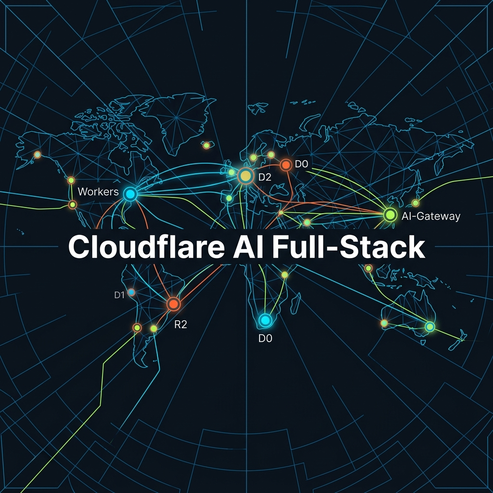
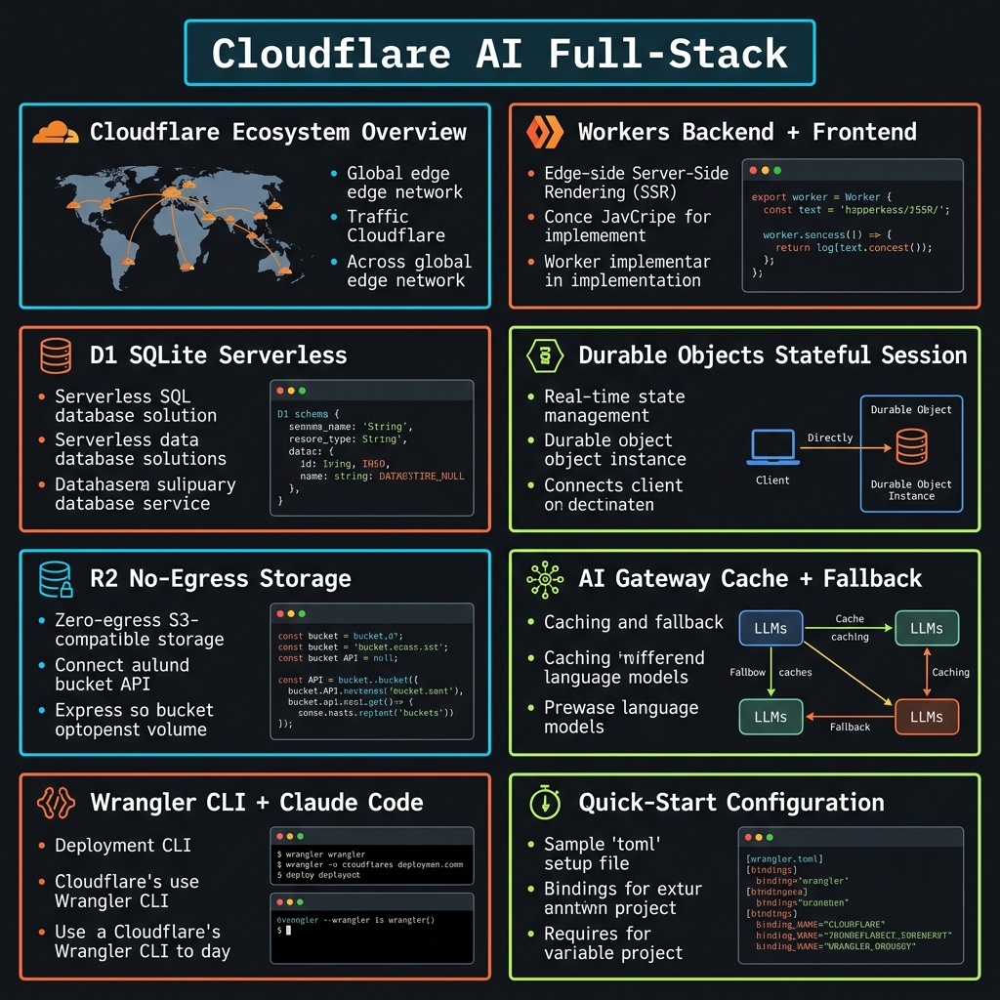
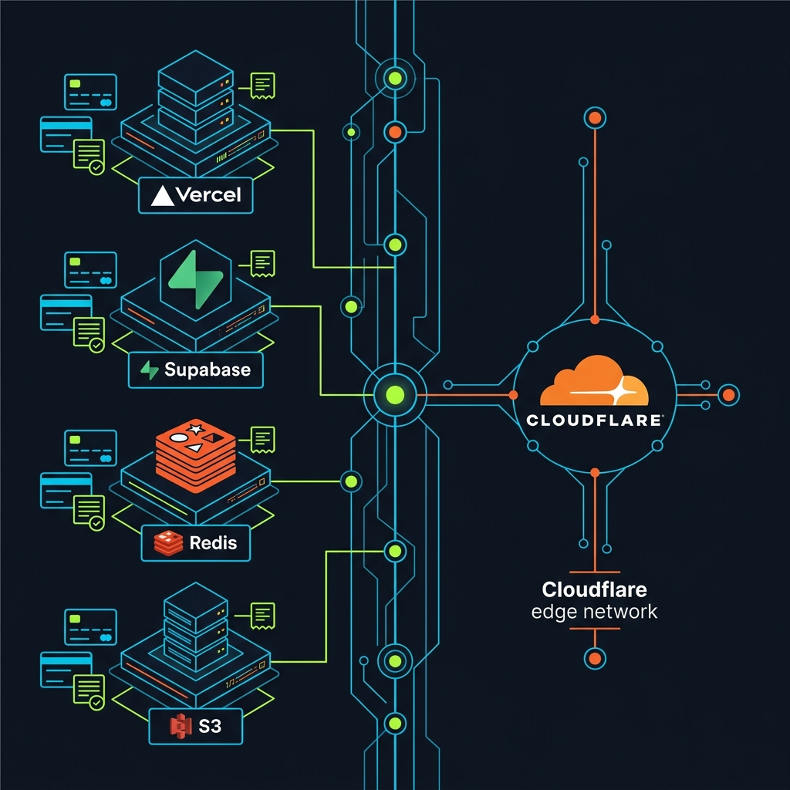
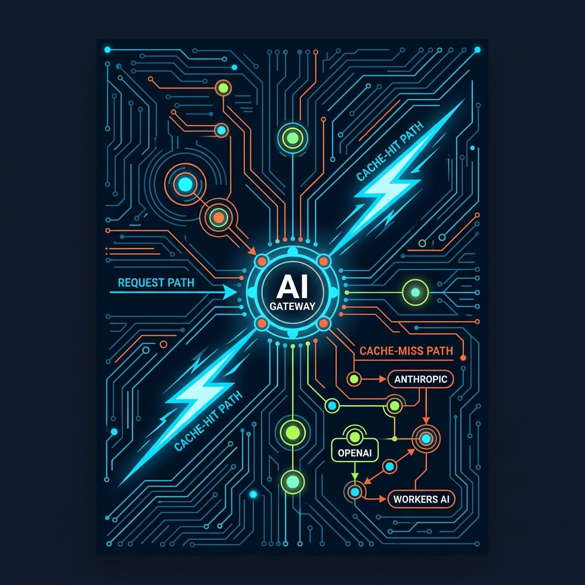

<!-- _class: title -->

# Cloudflare AI Full-Stack: ChatGPT Clone for 10M Users

Workers · D1 · Durable Objects · R2 · AI Gateway — one edge, zero servers

<!-- Speaker: Cloudflare offers a complete AI stack on a single edge network. No external DB, no Redis, no S3. We'll cover each component and wire them into a ChatGPT clone. -->

---

<!-- _class: cheatsheet -->
<!-- _backgroundColor: #0d1117 -->

<!-- Speaker: 60-second orientation. Top-left: ecosystem overview. Middle panels: each service and its role. Bottom-right: quick-start config. Keep this slide up as a reference throughout. -->

---

## TL;DR: One Edge Network, Full AI Stack

No more fragmented vendor billing — Workers, D1, Durable Objects, R2, AI Gateway live together.

<svg viewBox="0 0 1100 320" width="100%" xmlns="http://www.w3.org/2000/svg">
  <rect x="40" y="20" width="1020" height="280" rx="16" fill="var(--paper)" stroke="var(--soft-2)" stroke-width="1.5" style="filter:drop-shadow(0 4px 12px rgba(15,23,42,.08))"/>
  <rect x="40" y="20" width="8" height="280" rx="4" fill="var(--cf-orange)"/>
  <!-- Row 1 -->
  <rect x="120" y="50" width="180" height="60" rx="8" fill="var(--cf-blue)" opacity=".12"/>
  <text x="210" y="76" font-size="14" font-weight="700" fill="var(--cf-blue)" text-anchor="middle" font-family="system-ui">Workers</text>
  <text x="210" y="96" font-size="11" fill="var(--ink-dim)" text-anchor="middle" font-family="system-ui">Compute (JS/TS)</text>
  <rect x="330" y="50" width="180" height="60" rx="8" fill="var(--cf-orange)" opacity=".12"/>
  <text x="420" y="76" font-size="14" font-weight="700" fill="var(--cf-orange)" text-anchor="middle" font-family="system-ui">D1</text>
  <text x="420" y="96" font-size="11" fill="var(--ink-dim)" text-anchor="middle" font-family="system-ui">SQLite Serverless</text>
  <rect x="540" y="50" width="180" height="60" rx="8" fill="var(--success)" opacity=".10"/>
  <text x="630" y="76" font-size="14" font-weight="700" fill="var(--success)" text-anchor="middle" font-family="system-ui">Durable Objects</text>
  <text x="630" y="96" font-size="11" fill="var(--ink-dim)" text-anchor="middle" font-family="system-ui">Stateful Sessions</text>
  <rect x="750" y="50" width="140" height="60" rx="8" fill="var(--warning)" opacity=".12"/>
  <text x="820" y="76" font-size="14" font-weight="700" fill="var(--warning-ink)" text-anchor="middle" font-family="system-ui">R2</text>
  <text x="820" y="96" font-size="11" fill="var(--ink-dim)" text-anchor="middle" font-family="system-ui">Zero-Egress Storage</text>
  <rect x="920" y="50" width="120" height="60" rx="8" fill="var(--cf-orange)" opacity=".12"/>
  <text x="980" y="76" font-size="14" font-weight="700" fill="var(--cf-orange)" text-anchor="middle" font-family="system-ui">AI Gateway</text>
  <text x="980" y="96" font-size="11" fill="var(--ink-dim)" text-anchor="middle" font-family="system-ui">Cache + Fallback</text>
  <!-- Connecting line -->
  <line x1="300" y1="80" x2="330" y2="80" stroke="var(--muted)" stroke-width="1.5" stroke-dasharray="4,3"/>
  <line x1="510" y1="80" x2="540" y2="80" stroke="var(--muted)" stroke-width="1.5" stroke-dasharray="4,3"/>
  <line x1="720" y1="80" x2="750" y2="80" stroke="var(--muted)" stroke-width="1.5" stroke-dasharray="4,3"/>
  <line x1="890" y1="80" x2="920" y2="80" stroke="var(--muted)" stroke-width="1.5" stroke-dasharray="4,3"/>
  <!-- Bottom label -->
  <text x="560" y="200" font-size="20" font-weight="800" fill="var(--ink)" text-anchor="middle" font-family="system-ui">300+ Edge Locations — Same Network</text>
  <text x="560" y="230" font-size="14" fill="var(--ink-dim)" text-anchor="middle" font-family="system-ui">No cross-datacenter hops between compute and storage</text>
  <rect x="220" y="250" width="680" height="4" rx="2" fill="var(--soft-2)"/>
  <rect x="220" y="250" width="620" height="4" rx="2" fill="var(--cf-orange)" opacity=".5"/>
  <rect x="40" y="20" width="1" height="1" fill="none"/>
</svg>

<b>★ Takeaway:</b> ทุก component อยู่บน edge เดียวกัน ไม่มี cross-region hop — latency ต่ำกว่า multi-vendor stack อย่างมาก

<!-- Speaker: 5 services. 1 network. Billing consolidated. No connection pools, no egress surprises. -->

---

## Why Not Multi-Vendor? The Fragmentation Problem

Traditional AI app stack = 5 vendors, 5 bills, 5 latency hops.

  

    
Traditional Stack

    <h3>Fragmented (5 Vendors)</h3>
    <ul>
      <li>Vercel (compute)</li>
      <li>Supabase (Postgres)</li>
      <li>Upstash Redis (sessions)</li>
      <li>AWS S3 (storage + egress fees)</li>
      <li>OpenAI direct (no fallback)</li>
    </ul>
  

  

    
Cloudflare Stack

    <h3>Unified (1 Network)</h3>
    <ul>
      <li>Workers (compute)</li>
      <li>D1 (SQL metadata)</li>
      <li>Durable Objects (sessions)</li>
      <li>R2 (storage, zero egress)</li>
      <li>AI Gateway (LLM + cache + fallback)</li>
    </ul>
  

<b>★ Takeaway:</b> Cloudflare ลด vendor ของ ChatGPT clone จาก 5 เหลือ 1 — billing เดียว, latency เดียว, CLI เดียว

<!-- Speaker: Every service hop adds ~20-50ms. With Cloudflare they all share the same PoP. Plus free tier covers all services for development. -->

---

## Stack Architecture: Request Flow End-to-End

Access gates auth; Workers orchestrate; D1/DO/R2 store; AI Gateway calls LLMs.

<svg viewBox="0 0 1100 340" width="100%" xmlns="http://www.w3.org/2000/svg">
  <!-- User -->
  <circle cx="80" cy="170" r="36" fill="var(--soft-2)"/>
  <text x="80" y="166" font-size="11" font-weight="700" fill="var(--ink)" text-anchor="middle" font-family="system-ui">User</text>
  <text x="80" y="182" font-size="10" fill="var(--ink-dim)" text-anchor="middle" font-family="system-ui">Browser</text>
  <!-- Arrow 1 -->
  <line x1="116" y1="170" x2="168" y2="170" stroke="var(--muted)" stroke-width="2"/>
  <polygon points="168,164 180,170 168,176" fill="var(--muted)"/>
  <!-- Access -->
  <rect x="180" y="136" width="110" height="68" rx="10" fill="var(--cf-blue)" opacity=".1" stroke="var(--cf-blue)" stroke-width="1.5"/>
  <text x="235" y="166" font-size="13" font-weight="700" fill="var(--cf-blue)" text-anchor="middle" font-family="system-ui">CF Access</text>
  <text x="235" y="184" font-size="10" fill="var(--ink-dim)" text-anchor="middle" font-family="system-ui">Zero Trust Auth</text>
  <!-- Arrow 2 -->
  <line x1="290" y1="170" x2="342" y2="170" stroke="var(--muted)" stroke-width="2"/>
  <polygon points="342,164 354,170 342,176" fill="var(--muted)"/>
  <!-- Workers -->
  <rect x="354" y="136" width="120" height="68" rx="10" fill="var(--cf-orange)" opacity=".1" stroke="var(--cf-orange)" stroke-width="2"/>
  <text x="414" y="162" font-size="13" font-weight="700" fill="var(--cf-orange)" text-anchor="middle" font-family="system-ui">Workers</text>
  <text x="414" y="178" font-size="10" fill="var(--ink-dim)" text-anchor="middle" font-family="system-ui">JS/TS at Edge</text>
  <text x="414" y="194" font-size="10" fill="var(--muted)" text-anchor="middle" font-family="system-ui">No cold start</text>
  <!-- Workers → AI Gateway -->
  <line x1="474" y1="170" x2="526" y2="170" stroke="var(--muted)" stroke-width="2"/>
  <polygon points="526,164 538,170 526,176" fill="var(--muted)"/>
  <!-- AI Gateway -->
  <rect x="538" y="136" width="130" height="68" rx="10" fill="var(--cf-orange)" opacity=".15" stroke="var(--cf-orange)" stroke-width="2"/>
  <text x="603" y="162" font-size="13" font-weight="700" fill="var(--cf-orange)" text-anchor="middle" font-family="system-ui">AI Gateway</text>
  <text x="603" y="178" font-size="10" fill="var(--ink-dim)" text-anchor="middle" font-family="system-ui">Cache + Fallback</text>
  <text x="603" y="194" font-size="10" fill="var(--muted)" text-anchor="middle" font-family="system-ui">20+ providers</text>
  <!-- AI Gateway → LLM -->
  <line x1="668" y1="170" x2="720" y2="170" stroke="var(--muted)" stroke-width="2"/>
  <polygon points="720,164 732,170 720,176" fill="var(--muted)"/>
  <!-- LLM -->
  <rect x="732" y="136" width="110" height="68" rx="10" fill="var(--success)" opacity=".1" stroke="var(--success)" stroke-width="1.5"/>
  <text x="787" y="166" font-size="13" font-weight="700" fill="var(--success)" text-anchor="middle" font-family="system-ui">LLM API</text>
  <text x="787" y="184" font-size="10" fill="var(--ink-dim)" text-anchor="middle" font-family="system-ui">Anthropic/OpenAI</text>
  <!-- Workers → D1 (down) -->
  <line x1="414" y1="204" x2="414" y2="260" stroke="var(--muted)" stroke-width="1.5" stroke-dasharray="5,3"/>
  <polygon points="408,260 414,272 420,260" fill="var(--muted)"/>
  <rect x="354" y="272" width="120" height="50" rx="8" fill="var(--cf-blue)" opacity=".08" stroke="var(--cf-blue)" stroke-width="1.5"/>
  <text x="414" y="296" font-size="12" font-weight="700" fill="var(--cf-blue)" text-anchor="middle" font-family="system-ui">D1 SQLite</text>
  <text x="414" y="312" font-size="10" fill="var(--ink-dim)" text-anchor="middle" font-family="system-ui">Metadata / Users</text>
  <!-- Workers → DO (down-right) -->
  <line x1="474" y1="204" x2="574" y2="260" stroke="var(--muted)" stroke-width="1.5" stroke-dasharray="5,3"/>
  <polygon points="568,260 580,268 578,256" fill="var(--muted)"/>
  <rect x="520" y="268" width="140" height="50" rx="8" fill="var(--success)" opacity=".08" stroke="var(--success)" stroke-width="1.5"/>
  <text x="590" y="292" font-size="12" font-weight="700" fill="var(--success)" text-anchor="middle" font-family="system-ui">Durable Objects</text>
  <text x="590" y="308" font-size="10" fill="var(--ink-dim)" text-anchor="middle" font-family="system-ui">Chat Sessions</text>
  <!-- Workers → R2 (down further right) -->
  <line x1="474" y1="204" x2="724" y2="270" stroke="var(--muted)" stroke-width="1.5" stroke-dasharray="5,3"/>
  <polygon points="718,266 730,272 722,260" fill="var(--muted)"/>
  <rect x="720" y="272" width="100" height="50" rx="8" fill="var(--warning)" opacity=".08" stroke="var(--warning)" stroke-width="1.5"/>
  <text x="770" y="296" font-size="12" font-weight="700" fill="var(--warning-ink)" text-anchor="middle" font-family="system-ui">R2 Storage</text>
  <text x="770" y="312" font-size="10" fill="var(--ink-dim)" text-anchor="middle" font-family="system-ui">Files (no egress)</text>
  <rect x="0" y="0" width="1" height="1" fill="none"/>
</svg>

<b>★ Takeaway:</b> Access → Workers → AI Gateway → LLM เป็น main path; D1/DO/R2 เป็น storage layer ที่ Workers เรียกโดยตรงผ่าน binding

<!-- Speaker: Workers is the hub. All storage is accessed via bindings, not TCP connections. AI Gateway intercepts every LLM call automatically once configured. -->

---

## Workers + Cloudflare Access: Auth-First Compute

Access validates identity at edge before Worker receives any request.

  

    
Cloudflare Access

    <h3>Zero Trust Auth Layer</h3>
    
บล็อก request ก่อนถึง Worker — ผู้ใช้ต้อง auth ผ่าน IdP (Google, GitHub, SAML) ก่อน

    
Header: Cf-Access-Jwt-Assertion

  

  

    
Workers V8 Isolates

    <h3>Serverless, No Cold Start</h3>
    
รัน JS/TS ใน 300+ PoPs ทั่วโลก — isolates เบากว่า Lambda container; CPU 10ms (free) / 50ms (paid)

    
wrangler deploy → live globally

  

<b>★ Takeaway:</b> Workers ไม่ต้องเขียน auth middleware เอง — Access inject verified JWT ให้แล้ว; V8 isolates ให้ startup time &lt;1ms เทียบกับ Lambda ~100ms cold start

<!-- Speaker: The JWT from Access is cryptographically verifiable. Workers just reads it. No session store needed for auth. -->

---

## D1 vs Durable Objects: Same SQLite, Different Jobs

Both use SQLite under the hood — but solve completely different problems.

<svg viewBox="0 0 1100 300" width="100%" xmlns="http://www.w3.org/2000/svg">
  <!-- D1 Panel -->
  <rect x="40" y="20" width="480" height="260" rx="12" fill="var(--paper)" stroke="var(--soft-2)" stroke-width="1.5" style="filter:drop-shadow(var(--shadow-sm))"/>
  <rect x="40" y="20" width="480" height="52" rx="12" fill="var(--cf-blue)" opacity=".08"/>
  <text x="280" y="52" font-size="16" font-weight="700" fill="var(--cf-blue)" text-anchor="middle" font-family="system-ui">D1 — Shared Relational Data</text>
  <!-- D1 content -->
  <circle cx="90" cy="108" r="6" fill="var(--cf-blue)"/>
  <text x="110" y="113" font-size="13" fill="var(--ink)" font-family="system-ui">Global read replication</text>
  <circle cx="90" cy="140" r="6" fill="var(--cf-blue)"/>
  <text x="110" y="145" font-size="13" fill="var(--ink)" font-family="system-ui">5GB free / unlimited paid</text>
  <circle cx="90" cy="172" r="6" fill="var(--cf-blue)"/>
  <text x="110" y="177" font-size="13" fill="var(--ink)" font-family="system-ui">Time Travel: 30-day rollback</text>
  <circle cx="90" cy="204" r="6" fill="var(--cf-blue)"/>
  <text x="110" y="209" font-size="13" fill="var(--ink)" font-family="system-ui">Use: user profiles, conversation list</text>
  <!-- D1 tag -->
  <rect x="180" y="234" width="140" height="28" rx="6" fill="var(--cf-blue)" opacity=".1"/>
  <text x="250" y="252" font-size="12" fill="var(--cf-blue)" text-anchor="middle" font-family="system-ui">Shared · Multi-tenant</text>
  <!-- DO Panel -->
  <rect x="580" y="20" width="480" height="260" rx="12" fill="var(--paper)" stroke="var(--success)" stroke-width="2" style="filter:drop-shadow(var(--shadow-md))"/>
  <rect x="580" y="20" width="480" height="52" rx="12" fill="var(--success)" opacity=".08"/>
  <text x="820" y="52" font-size="16" font-weight="700" fill="var(--success)" text-anchor="middle" font-family="system-ui">Durable Objects — Per-Session State</text>
  <!-- DO content -->
  <circle cx="630" cy="108" r="6" fill="var(--success)"/>
  <text x="650" y="113" font-size="13" fill="var(--ink)" font-family="system-ui">1 instance = 1 conversation</text>
  <circle cx="630" cy="140" r="6" fill="var(--success)"/>
  <text x="650" y="145" font-size="13" fill="var(--ink)" font-family="system-ui">Strongly consistent SQLite</text>
  <circle cx="630" cy="172" r="6" fill="var(--success)"/>
  <text x="650" y="177" font-size="13" fill="var(--ink)" font-family="system-ui">10GB per instance (free)</text>
  <circle cx="630" cy="204" r="6" fill="var(--success)"/>
  <text x="650" y="209" font-size="13" fill="var(--ink)" font-family="system-ui">Use: chat history, real-time state</text>
  <!-- DO tag -->
  <rect x="720" y="234" width="160" height="28" rx="6" fill="var(--success)" opacity=".1"/>
  <text x="800" y="252" font-size="12" fill="var(--success)" text-anchor="middle" font-family="system-ui">Isolated · Per-entity</text>
  <!-- VS badge -->
  <circle cx="550" cy="150" r="30" fill="var(--cf-orange)"/>
  <text x="550" y="155" font-size="14" font-weight="700" fill="white" text-anchor="middle" font-family="system-ui">VS</text>
  <rect x="0" y="0" width="1" height="1" fill="none"/>
</svg>

<b>★ Takeaway:</b> D1 = ฐานข้อมูลกลางสำหรับ metadata ที่แชร์กัน; Durable Objects = คอมพิวเตอร์จิ๋วแยกต่างหากสำหรับแต่ละ session ที่ต้องการ strong consistency

<!-- Speaker: The confusion point is that both use SQLite. The difference is isolation and access pattern. D1 scales reads globally; DO isolates writes per entity. -->

---

## R2 + AI Gateway: Storage and Intelligence Layer

R2 kills egress costs; AI Gateway makes every LLM call smarter and more resilient.

  

    
R2 Object Storage

    <h3>S3-Compatible, Zero Egress</h3>
    
เก็บ files/assets ที่ผู้ใช้อัปโหลด (PDF, รูปภาพ) และ export ประวัติการสนทนา

    
AWS S3 คิด egress ทุกครั้ง — R2 ไม่มีค่า bandwidth เลย

    
Free: 10GB storage, 10M reads/mo

  

  

    
AI Gateway (Free)

    <h3>Proxy for All LLM Calls</h3>
    
One-line config ใน wrangler.jsonc — ทุก LLM call ผ่าน Gateway อัตโนมัติ

    <ul>
      <li>Response caching (ลด latency 90%)</li>
      <li>Auto model fallback</li>
      <li>Rate limiting + spend limits</li>
      <li>Analytics: tokens, cost, errors</li>
    </ul>
  

<b>★ Takeaway:</b> AI Gateway เป็น free insurance — เปิดด้วย config บรรทัดเดียว, ได้ caching + fallback + observability ทันที ไม่มีเหตุผลที่จะไม่ใช้

<!-- Speaker: R2 egress savings compound fast for file-heavy apps. AI Gateway is particularly valuable — zero code change, add `ai` binding, instant resilience. -->

---

## AI Gateway: Cache-Hit vs Fallback Flow

Cache-hit = ~8ms; fallback silently reroutes when primary model fails.

<svg viewBox="0 0 700 300" width="100%" xmlns="http://www.w3.org/2000/svg">
  <!-- Request in -->
  <rect x="20" y="125" width="100" height="50" rx="8" fill="var(--soft-2)" stroke="var(--muted)" stroke-width="1.5"/>
  <text x="70" y="147" font-size="11" font-weight="700" fill="var(--ink)" text-anchor="middle" font-family="system-ui">Worker</text>
  <text x="70" y="163" font-size="10" fill="var(--muted)" text-anchor="middle" font-family="system-ui">LLM request</text>
  <!-- Arrow to gateway -->
  <line x1="120" y1="150" x2="168" y2="150" stroke="var(--muted)" stroke-width="2"/>
  <polygon points="168,144 180,150 168,156" fill="var(--muted)"/>
  <!-- Gateway box -->
  <rect x="180" y="100" width="130" height="100" rx="10" fill="var(--cf-orange)" opacity=".15" stroke="var(--cf-orange)" stroke-width="2"/>
  <text x="245" y="142" font-size="12" font-weight="700" fill="var(--cf-orange)" text-anchor="middle" font-family="system-ui">AI Gateway</text>
  <text x="245" y="160" font-size="10" fill="var(--ink-dim)" text-anchor="middle" font-family="system-ui">Cache check</text>
  <text x="245" y="176" font-size="10" fill="var(--muted)" text-anchor="middle" font-family="system-ui">then route</text>
  <!-- Cache hit path (up) -->
  <line x1="310" y1="130" x2="400" y2="80" stroke="var(--success)" stroke-width="2"/>
  <polygon points="394,74 406,80 396,88" fill="var(--success)"/>
  <rect x="406" y="52" width="130" height="54" rx="8" fill="var(--success)" opacity=".1" stroke="var(--success)" stroke-width="1.5"/>
  <text x="471" y="75" font-size="11" font-weight="700" fill="var(--success)" text-anchor="middle" font-family="system-ui">Cache HIT</text>
  <text x="471" y="91" font-size="10" fill="var(--success-ink)" text-anchor="middle" font-family="system-ui">~8ms response</text>
  <text x="355" y="100" font-size="10" fill="var(--success)" font-family="system-ui">CACHE HIT</text>
  <!-- Cache miss path (primary) -->
  <line x1="310" y1="155" x2="400" y2="155" stroke="var(--muted)" stroke-width="2"/>
  <polygon points="400,149 412,155 400,161" fill="var(--muted)"/>
  <rect x="412" y="128" width="130" height="54" rx="8" fill="var(--cf-blue)" opacity=".1" stroke="var(--cf-blue)" stroke-width="1.5"/>
  <text x="477" y="151" font-size="11" font-weight="700" fill="var(--cf-blue)" text-anchor="middle" font-family="system-ui">Primary Model</text>
  <text x="477" y="167" font-size="10" fill="var(--ink-dim)" text-anchor="middle" font-family="system-ui">Anthropic / OpenAI</text>
  <!-- Fallback path (down) -->
  <line x1="310" y1="175" x2="400" y2="220" stroke="var(--danger)" stroke-width="2" stroke-dasharray="5,3"/>
  <polygon points="394,216 406,222 396,230" fill="var(--danger)"/>
  <rect x="406" y="194" width="130" height="54" rx="8" fill="var(--danger-wash)" stroke="var(--danger)" stroke-width="1.5"/>
  <text x="471" y="217" font-size="11" font-weight="700" fill="var(--danger-ink)" text-anchor="middle" font-family="system-ui">Fallback Model</text>
  <text x="471" y="233" font-size="10" fill="var(--danger-ink)" text-anchor="middle" font-family="system-ui">Workers AI (free)</text>
  <text x="355" y="215" font-size="10" fill="var(--danger)" font-family="system-ui">RATE LIMIT</text>
  <rect x="0" y="0" width="1" height="1" fill="none"/>
</svg>

<b>★ Takeaway:</b> Cache hit ลด latency ถึง 90% และ token cost; fallback chain ทำงานอัตโนมัติโดยไม่ต้องแก้ code — แค่ config providers array

<!-- Speaker: Common prompts get served from cache. Model outages or rate limits trigger automatic fallback. Worker code doesn't change — all routing logic lives in the gateway. -->

---

## Setup Guide: 5 Steps from Zero to Deployed

Wrangler CLI + Claude Code — no dashboard clicks required.

<svg viewBox="0 0 1100 290" width="100%" xmlns="http://www.w3.org/2000/svg">
  <!-- Step boxes -->
  <rect x="20" y="80" width="180" height="150" rx="10" fill="var(--paper)" stroke="var(--soft-2)" stroke-width="1.5" style="filter:drop-shadow(var(--shadow-sm))"/>
  <circle cx="60" cy="108" r="18" fill="var(--cf-orange)"/>
  <text x="60" y="114" font-size="14" font-weight="800" fill="white" text-anchor="middle" font-family="system-ui">1</text>
  <text x="110" y="108" font-size="12" font-weight="700" fill="var(--ink)" font-family="system-ui">Install</text>
  <text x="40" y="140" font-size="11" fill="var(--muted)" font-family="system-ui">npm i -g wrangler</text>
  <text x="40" y="158" font-size="11" fill="var(--muted)" font-family="system-ui">wrangler login</text>
  <!-- Arrow -->
  <line x1="200" y1="155" x2="222" y2="155" stroke="var(--cf-orange)" stroke-width="2"/>
  <polygon points="222,149 234,155 222,161" fill="var(--cf-orange)"/>
  <!-- Step 2 -->
  <rect x="234" y="80" width="180" height="150" rx="10" fill="var(--paper)" stroke="var(--soft-2)" stroke-width="1.5" style="filter:drop-shadow(var(--shadow-sm))"/>
  <circle cx="274" cy="108" r="18" fill="var(--cf-orange)"/>
  <text x="274" y="114" font-size="14" font-weight="800" fill="white" text-anchor="middle" font-family="system-ui">2</text>
  <text x="324" y="108" font-size="12" font-weight="700" fill="var(--ink)" font-family="system-ui">Scaffold</text>
  <text x="254" y="140" font-size="10" fill="var(--muted)" font-family="system-ui">create-cloudflare@latest</text>
  <text x="254" y="158" font-size="10" fill="var(--muted)" font-family="system-ui">--template worker-typescript</text>
  <!-- Arrow -->
  <line x1="414" y1="155" x2="436" y2="155" stroke="var(--cf-orange)" stroke-width="2"/>
  <polygon points="436,149 448,155 436,161" fill="var(--cf-orange)"/>
  <!-- Step 3 -->
  <rect x="448" y="80" width="180" height="150" rx="10" fill="var(--paper)" stroke="var(--soft-2)" stroke-width="1.5" style="filter:drop-shadow(var(--shadow-sm))"/>
  <circle cx="488" cy="108" r="18" fill="var(--cf-orange)"/>
  <text x="488" y="114" font-size="14" font-weight="800" fill="white" text-anchor="middle" font-family="system-ui">3</text>
  <text x="538" y="108" font-size="12" font-weight="700" fill="var(--ink)" font-family="system-ui">Resources</text>
  <text x="468" y="140" font-size="10" fill="var(--muted)" font-family="system-ui">wrangler d1 create chatdb</text>
  <text x="468" y="158" font-size="10" fill="var(--muted)" font-family="system-ui">wrangler r2 bucket create</text>
  <!-- Arrow -->
  <line x1="628" y1="155" x2="650" y2="155" stroke="var(--cf-orange)" stroke-width="2"/>
  <polygon points="650,149 662,155 650,161" fill="var(--cf-orange)"/>
  <!-- Step 4 -->
  <rect x="662" y="80" width="180" height="150" rx="10" fill="var(--paper)" stroke="var(--soft-2)" stroke-width="1.5" style="filter:drop-shadow(var(--shadow-sm))"/>
  <circle cx="702" cy="108" r="18" fill="var(--cf-orange)"/>
  <text x="702" y="114" font-size="14" font-weight="800" fill="white" text-anchor="middle" font-family="system-ui">4</text>
  <text x="752" y="108" font-size="12" font-weight="700" fill="var(--ink)" font-family="system-ui">Deploy</text>
  <text x="682" y="140" font-size="10" fill="var(--muted)" font-family="system-ui">wrangler deploy</text>
  <text x="682" y="158" font-size="10" fill="var(--muted)" font-family="system-ui">→ .workers.dev URL</text>
  <!-- Arrow -->
  <line x1="842" y1="155" x2="864" y2="155" stroke="var(--cf-orange)" stroke-width="2"/>
  <polygon points="864,149 876,155 864,161" fill="var(--cf-orange)"/>
  <!-- Step 5 -->
  <rect x="876" y="80" width="204" height="150" rx="10" fill="var(--success)" opacity=".06" stroke="var(--success)" stroke-width="2" style="filter:drop-shadow(var(--shadow-md))"/>
  <circle cx="916" cy="108" r="18" fill="var(--success)"/>
  <text x="916" y="114" font-size="14" font-weight="800" fill="white" text-anchor="middle" font-family="system-ui">5</text>
  <text x="966" y="108" font-size="12" font-weight="700" fill="var(--success)" font-family="system-ui">Monitor</text>
  <text x="896" y="140" font-size="10" fill="var(--muted)" font-family="system-ui">wrangler tail</text>
  <text x="896" y="158" font-size="10" fill="var(--muted)" font-family="system-ui">CF Dashboard analytics</text>
  <!-- Top label -->
  <text x="550" y="50" font-size="15" font-weight="700" fill="var(--ink)" text-anchor="middle" font-family="system-ui">Zero dashboard clicks needed</text>
  <rect x="0" y="0" width="1" height="1" fill="none"/>
</svg>

<b>★ Takeaway:</b> ทุก step ใช้ wrangler CLI — Claude Code อ่าน wrangler.jsonc ตรง แนะนำ config + debug errors ได้ใน conversation เดียว; infra กลายเป็น version-controlled code

<!-- Speaker: With Claude Code you can describe what you want in plain language and it writes the wrangler config. IaC without Terraform. -->

---

## Caveats: Know Before You Scale

Free tier covers all dev work — but understand limits before production.

  

    
Workers

    <h3>CPU Time Limit</h3>
    
10ms/req (free), 50ms (paid) — streaming LLM ต้องใช้ waitUntil() pattern

  

  

    
D1 Free Tier

    <h3>5M Reads/Day</h3>
    
5GB storage — เพียงพอ dev; production ต้อง Paid plan

  

  

    
Durable Objects

    <h3>10GB / Instance</h3>
    
Long sessions ต้อง archive ไปยัง D1 ก่อนครบ limit

  

  

    
AI Gateway Cache

    <h3>Temperature &gt; 0</h3>
    
Non-deterministic prompts = cache miss ทุกครั้ง — tune temperature สำหรับ cacheable use cases

  

  

    
R2 Free Tier

    <h3>10GB + 10M Reads</h3>
    
1M writes/mo; เกินต้อง Paid — แต่ยังไม่มี egress fee

  

  

    
Cloudflare Access

    <h3>No Self-Registration</h3>
    
Public app ที่ต้องการ sign-up ต้องใช้ Auth0/Clerk ร่วม

  

<b>★ Takeaway:</b> ทุก service มี free tier ที่ cover development ทั้งหมด — วางแผน archival flow สำหรับ Durable Objects และ tune temperature สำหรับ AI Gateway caching

<!-- Speaker: None of these limits are blockers at small scale. Plan the DO archival flow early — retrofitting it is harder than building it upfront. -->

---

## Key Takeaways: The Cloudflare AI Stack

One network, one CLI, zero servers — the definitive ChatGPT clone stack.

  

    
Architecture

    <h3>One Edge, All Services</h3>
    
Workers + D1 + DO + R2 + AI Gateway บน edge เดียวกัน — ไม่มี cross-region latency ระหว่าง compute และ storage

  

  

    
Storage Pattern

    <h3>D1 vs Durable Objects</h3>
    
D1 = shared relational metadata; Durable Objects = strongly-consistent per-session state — ทั้งคู่ใช้ SQLite

  

  

    
Cost

    <h3>R2 + AI Gateway = Zero Surprise</h3>
    
R2 ไม่มี egress fee; AI Gateway (free) = caching ลด token cost ถึง 90% + fallback ฟรี

  

  

    
Developer Experience

    <h3>Wrangler CLI + Claude Code</h3>
    
ตั้งค่า infra ทั้งหมดผ่าน terminal — reproducible, version-controlled, ไม่ต้องแตะ dashboard

  

<b>★ Takeaway:</b> AI Gateway เป็น free one-line win ที่ทุก Cloudflare app ควรเปิด — caching + fallback + observability ทันที; R2 + DO คือ cost moat ที่ทำให้ scaling ไม่ทำให้ bill พุ่ง

<!-- Speaker: Start with Workers + D1 + AI Gateway. Add Durable Objects when you need per-session state. R2 only when you have user-uploaded files. Build incrementally. -->
