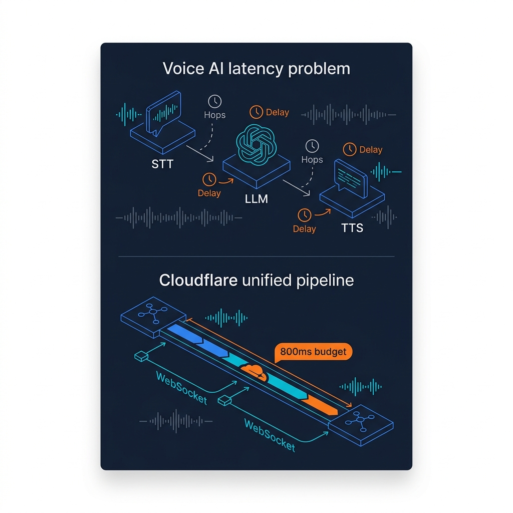
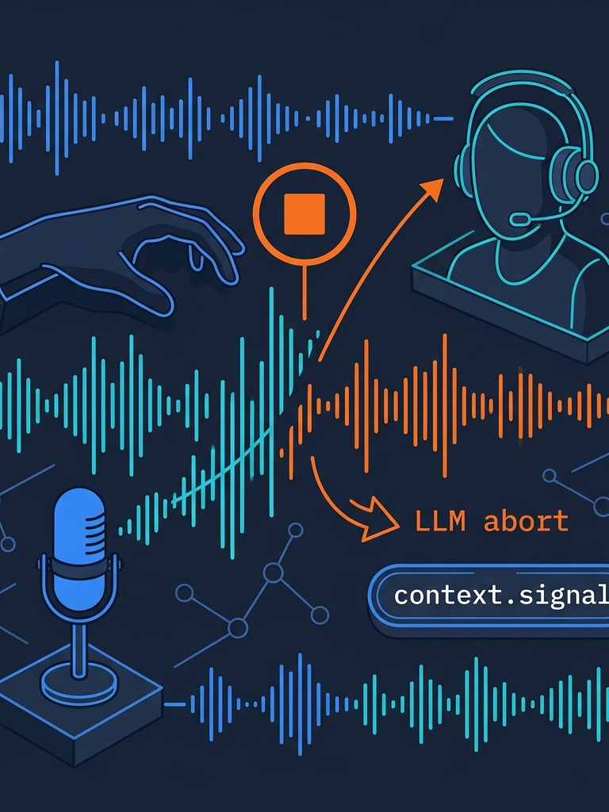

<!-- _class: title -->

# Cloudflare Voice SDK

สร้าง Voice AI Agent แบบ Real-time บน Workers — ไม่ต้องใช้ API key ภายนอก

<!-- Speaker: SDK ใหม่จาก Cloudflare เพิ่ม voice pipeline เข้า Agents SDK ที่มีอยู่แล้ว ไม่ต้องสร้าง architecture ใหม่ -->

---

<!-- _class: cheatsheet -->
<!-- _backgroundColor: #f8f7f4 -->

<!-- Speaker: ภาพรวมของ SDK ทั้งหมด — withVoice wrapper, audio pipeline, STT/TTS providers, context persistence, interruption handling, React hooks -->

---

## Voice AI ในอดีต: ปัญหา Latency จาก Multi-Service Hops

แต่ละ service hop เพิ่ม latency — budget สำหรับ "เป็นธรรมชาติ" คือต่ำกว่า 800ms

<svg viewBox="0 0 700 300" width="100%" xmlns="http://www.w3.org/2000/svg">
  <rect x="10" y="10" width="680" height="280" rx="12" fill="var(--soft)" stroke="var(--soft-2)" stroke-width="1.5"/>
  <text x="350" y="42" font-size="14" font-weight="700" fill="var(--ink)" text-anchor="middle" font-family="system-ui">Voice Latency Budget</text>
  <rect x="30" y="60" width="105" height="44" rx="8" fill="var(--accent)" opacity=".15" stroke="var(--accent)" stroke-width="1.5"/>
  <text x="82" y="80" font-size="12" font-weight="700" fill="var(--accent)" text-anchor="middle" font-family="system-ui">Mic Input</text>
  <text x="82" y="96" font-size="11" fill="var(--ink-dim)" text-anchor="middle" font-family="system-ui">~40ms</text>
  <line x1="135" y1="82" x2="175" y2="82" stroke="var(--muted)" stroke-width="1.5" stroke-dasharray="3,3"/>
  <text x="155" y="76" font-size="9" fill="var(--muted)" text-anchor="middle" font-family="system-ui">hop</text>
  <rect x="175" y="60" width="105" height="44" rx="8" fill="var(--cyan)" opacity=".15" stroke="var(--cyan)" stroke-width="1.5"/>
  <text x="227" y="80" font-size="12" font-weight="700" fill="var(--cyan)" text-anchor="middle" font-family="system-ui">STT</text>
  <text x="227" y="96" font-size="11" fill="var(--ink-dim)" text-anchor="middle" font-family="system-ui">~300ms</text>
  <line x1="280" y1="82" x2="320" y2="82" stroke="var(--muted)" stroke-width="1.5" stroke-dasharray="3,3"/>
  <text x="300" y="76" font-size="9" fill="var(--muted)" text-anchor="middle" font-family="system-ui">hop</text>
  <rect x="320" y="60" width="105" height="44" rx="8" fill="var(--warning)" opacity=".15" stroke="var(--warning)" stroke-width="1.5"/>
  <text x="372" y="80" font-size="12" font-weight="700" fill="var(--warning)" text-anchor="middle" font-family="system-ui">LLM</text>
  <text x="372" y="96" font-size="11" fill="var(--ink-dim)" text-anchor="middle" font-family="system-ui">~400ms</text>
  <line x1="425" y1="82" x2="465" y2="82" stroke="var(--muted)" stroke-width="1.5" stroke-dasharray="3,3"/>
  <text x="445" y="76" font-size="9" fill="var(--muted)" text-anchor="middle" font-family="system-ui">hop</text>
  <rect x="465" y="60" width="105" height="44" rx="8" fill="var(--success)" opacity=".15" stroke="var(--success)" stroke-width="1.5"/>
  <text x="517" y="80" font-size="12" font-weight="700" fill="var(--success)" text-anchor="middle" font-family="system-ui">TTS</text>
  <text x="517" y="96" font-size="11" fill="var(--ink-dim)" text-anchor="middle" font-family="system-ui">~150ms</text>
  <rect x="30" y="130" width="640" height="36" rx="6" fill="var(--danger)" opacity=".08" stroke="var(--danger)" stroke-width="1.5"/>
  <text x="350" y="153" font-size="13" font-weight="700" fill="var(--danger)" text-anchor="middle" font-family="system-ui">Total ~890ms — รู้สึก "ไม่เป็นธรรมชาติ" เกิน 800ms budget</text>
  <rect x="30" y="185" width="640" height="36" rx="6" fill="var(--success)" opacity=".08" stroke="var(--success)" stroke-width="1.5"/>
  <text x="350" y="208" font-size="13" font-weight="700" fill="var(--success)" text-anchor="middle" font-family="system-ui">Cloudflare: pipeline รันใน 1 datacenter — eliminates hop overhead</text>
  <rect x="30" y="240" width="50" height="20" rx="4" fill="var(--accent)"/>
  <text x="55" y="254" font-size="10" fill="white" text-anchor="middle" font-family="system-ui">CF SDK</text>
  <rect x="90" y="240" width="580" height="6" rx="3" fill="var(--soft-2)"/>
  <rect x="90" y="240" width="435" height="6" rx="3" fill="var(--accent)" opacity=".6"/>
  <text x="535" y="254" font-size="10" fill="var(--accent)" font-family="system-ui">~730ms</text>
  <rect x="0" y="0" width="1" height="1" fill="none"/>
</svg>

<b>★ Takeaway:</b> Cloudflare รัน STT+LLM+TTS ใน datacenter เดียว — ตัด network hop overhead ออกทั้งหมด

<!-- Speaker: ปัญหาหลักไม่ใช่โมเดลช้า แต่คือ network round trips ระหว่างบริการต่างๆ -->

---

## withVoice: Voice เป็นแค่ Wrapper บน Agent เดิม

Higher-order function pattern — ไม่ต้องสร้าง architecture ใหม่

<svg viewBox="0 0 1100 380" width="100%" xmlns="http://www.w3.org/2000/svg">
  <!-- Before: plain Agent -->
  <rect x="40" y="30" width="460" height="320" rx="12" fill="var(--paper)" stroke="var(--soft-2)" stroke-width="1.5" style="filter:drop-shadow(0 4px 12px rgba(15,23,42,.08))"/>
  <rect x="40" y="30" width="460" height="52" rx="12" fill="var(--soft)" opacity=".8"/>
  <text x="270" y="63" font-size="15" font-weight="700" fill="var(--ink-dim)" text-anchor="middle" font-family="system-ui">Agent (text only)</text>
  <rect x="70" y="108" width="400" height="38" rx="6" fill="var(--soft-2)"/>
  <text x="270" y="132" font-size="13" fill="var(--ink-dim)" text-anchor="middle" font-family="system-ui">class MyAgent extends Agent</text>
  <rect x="70" y="158" width="400" height="38" rx="6" fill="var(--soft-2)"/>
  <text x="270" y="182" font-size="13" fill="var(--ink-dim)" text-anchor="middle" font-family="system-ui">onMessage()</text>
  <rect x="70" y="208" width="400" height="38" rx="6" fill="var(--soft-2)"/>
  <text x="270" y="232" font-size="13" fill="var(--ink-dim)" text-anchor="middle" font-family="system-ui">SQLite history</text>
  <text x="270" y="300" font-size="12" fill="var(--muted)" text-anchor="middle" font-family="system-ui">text input only</text>
  <!-- Arrow -->
  <path d="M520 190 L580 190" stroke="var(--accent)" stroke-width="2.5" fill="none"/>
  <polygon points="580,185 592,190 580,195" fill="var(--accent)"/>
  <text x="556" y="180" font-size="12" font-weight="700" fill="var(--accent)" text-anchor="middle" font-family="system-ui">withVoice()</text>
  <!-- After: VoiceAgent -->
  <rect x="600" y="30" width="460" height="320" rx="12" fill="var(--paper)" stroke="var(--accent)" stroke-width="2" style="filter:drop-shadow(0 4px 12px rgba(59,130,246,.15))"/>
  <rect x="600" y="30" width="460" height="52" rx="12" fill="var(--accent)" opacity=".1"/>
  <text x="830" y="63" font-size="15" font-weight="700" fill="var(--accent)" text-anchor="middle" font-family="system-ui">VoiceAgent (text + voice)</text>
  <rect x="630" y="108" width="400" height="38" rx="6" fill="var(--accent-wash)"/>
  <text x="830" y="132" font-size="13" fill="var(--accent)" text-anchor="middle" font-family="system-ui">class MyAgent extends VoiceAgent</text>
  <rect x="630" y="158" width="400" height="38" rx="6" fill="var(--soft-2)"/>
  <text x="830" y="182" font-size="13" fill="var(--ink)" text-anchor="middle" font-family="system-ui">onTurn(transcript, context)</text>
  <rect x="630" y="208" width="400" height="38" rx="6" fill="var(--soft-2)"/>
  <text x="830" y="232" font-size="13" fill="var(--ink)" text-anchor="middle" font-family="system-ui">SQLite history (same)</text>
  <rect x="630" y="258" width="190" height="32" rx="6" fill="var(--cyan)" opacity=".15" stroke="var(--cyan)" stroke-width="1.5"/>
  <text x="725" y="278" font-size="12" fill="var(--cyan)" text-anchor="middle" font-family="system-ui">WorkersAIFluxSTT</text>
  <rect x="840" y="258" width="190" height="32" rx="6" fill="var(--success)" opacity=".15" stroke="var(--success)" stroke-width="1.5"/>
  <text x="935" y="278" font-size="12" fill="var(--success)" text-anchor="middle" font-family="system-ui">WorkersAITTS</text>
  <rect x="0" y="0" width="1" height="1" fill="none"/>
</svg>

<b>★ Takeaway:</b> <code>withVoice(Agent)</code> เพิ่ม voice ในบรรทัดเดียว — tools, history, scheduling ยังทำงานเหมือนเดิม

<!-- Speaker: ไม่มี new architecture, ไม่มี new infra — เพียง wrap class เดิมแล้วเพิ่ม onTurn() -->

---

## Package Overview: 5 ส่วนหลักของ @cloudflare/voice

แต่ละ export ออกแบบมาสำหรับ use case ที่ต่างกัน

  

    
Server — Full Voice

    <h3>withVoice</h3>
    
STT + LLM + TTS + SQLite persistence. onTurn() รับ transcript คืน stream/string

  

  

    
Server — STT Only

    <h3>withVoiceInput</h3>
    
Transcription เท่านั้น ไม่มี TTS response. เหมาะสำหรับ dictation / voice search

  

  

    
Client — React

    <h3>useVoiceAgent / useVoiceInput</h3>
    
React hooks — status, transcript, interimTranscript, startCall, endCall, toggleMute

  

<b>★ Takeaway:</b> เลือก <code>withVoice</code> สำหรับ full conversation, <code>withVoiceInput</code> สำหรับ transcription-only — hooks เดียวกันทั้งคู่

<!-- Speaker: VoiceClient ยังมีสำหรับ non-React frameworks ด้วย -->

---

## Audio Pipeline: Browser → Durable Object → LLM → Speaker

WebSocket เดียวรองรับทั้ง binary audio และ JSON transcript

<svg viewBox="0 0 1100 360" width="100%" xmlns="http://www.w3.org/2000/svg">
  <!-- Browser box -->
  <rect x="20" y="60" width="180" height="240" rx="12" fill="var(--paper)" stroke="var(--soft-2)" stroke-width="1.5" style="filter:drop-shadow(0 2px 8px rgba(15,23,42,.06))"/>
  <text x="110" y="90" font-size="13" font-weight="700" fill="var(--ink)" text-anchor="middle" font-family="system-ui">Browser</text>
  <rect x="40" y="105" width="140" height="28" rx="6" fill="var(--soft)"/>
  <text x="110" y="124" font-size="11" fill="var(--ink-dim)" text-anchor="middle" font-family="system-ui">Mic (16kHz PCM)</text>
  <rect x="40" y="200" width="140" height="28" rx="6" fill="var(--soft)"/>
  <text x="110" y="219" font-size="11" fill="var(--ink-dim)" text-anchor="middle" font-family="system-ui">Speaker output</text>
  <rect x="40" y="240" width="140" height="28" rx="6" fill="var(--soft)"/>
  <text x="110" y="259" font-size="11" fill="var(--ink-dim)" text-anchor="middle" font-family="system-ui">Live transcript UI</text>
  <!-- WebSocket line -->
  <line x1="200" y1="119" x2="290" y2="119" stroke="var(--accent)" stroke-width="2" stroke-dasharray="4,3"/>
  <polygon points="289,114 302,119 289,124" fill="var(--accent)"/>
  <text x="246" y="112" font-size="10" fill="var(--accent)" text-anchor="middle" font-family="system-ui">binary PCM</text>
  <line x1="200" y1="214" x2="290" y2="214" stroke="var(--success)" stroke-width="2" stroke-dasharray="4,3"/>
  <polygon points="201,209 188,214 201,219" fill="var(--success)"/>
  <text x="246" y="207" font-size="10" fill="var(--success)" text-anchor="middle" font-family="system-ui">binary audio</text>
  <line x1="200" y1="254" x2="290" y2="254" stroke="var(--cyan)" stroke-width="2" stroke-dasharray="4,3"/>
  <polygon points="201,249 188,254 201,259" fill="var(--cyan)"/>
  <text x="246" y="247" font-size="10" fill="var(--cyan)" text-anchor="middle" font-family="system-ui">JSON transcript</text>
  <!-- Durable Object box -->
  <rect x="300" y="40" width="500" height="280" rx="12" fill="var(--paper)" stroke="var(--accent)" stroke-width="2" style="filter:drop-shadow(0 4px 12px rgba(59,130,246,.12))"/>
  <text x="550" y="72" font-size="13" font-weight="700" fill="var(--accent)" text-anchor="middle" font-family="system-ui">Durable Object (withVoice)</text>
  <rect x="325" y="88" width="450" height="42" rx="8" fill="var(--cyan)" opacity=".1" stroke="var(--cyan)" stroke-width="1.5"/>
  <text x="550" y="107" font-size="12" font-weight="700" fill="var(--cyan)" text-anchor="middle" font-family="system-ui">Transcriber Session (per-call)</text>
  <text x="550" y="122" font-size="11" fill="var(--ink-dim)" text-anchor="middle" font-family="system-ui">Deepgram Flux — model-driven turn detection</text>
  <line x1="550" y1="130" x2="550" y2="150" stroke="var(--muted)" stroke-width="1.5"/>
  <polygon points="545,148 550,162 555,148" fill="var(--muted)"/>
  <rect x="325" y="162" width="450" height="42" rx="8" fill="var(--warning)" opacity=".1" stroke="var(--warning)" stroke-width="1.5"/>
  <text x="550" y="181" font-size="12" font-weight="700" fill="var(--warning)" text-anchor="middle" font-family="system-ui">onTurn(transcript, context)</text>
  <text x="550" y="196" font-size="11" fill="var(--ink-dim)" text-anchor="middle" font-family="system-ui">LLM call — context.messages + abortSignal</text>
  <line x1="550" y1="204" x2="550" y2="224" stroke="var(--muted)" stroke-width="1.5"/>
  <polygon points="545,222 550,236 555,222" fill="var(--muted)"/>
  <rect x="325" y="236" width="450" height="42" rx="8" fill="var(--success)" opacity=".1" stroke="var(--success)" stroke-width="1.5"/>
  <text x="550" y="255" font-size="12" font-weight="700" fill="var(--success)" text-anchor="middle" font-family="system-ui">TTS (sentence-chunked)</text>
  <text x="550" y="270" font-size="11" fill="var(--ink-dim)" text-anchor="middle" font-family="system-ui">Deepgram Aura — stream to client</text>
  <!-- SQLite box -->
  <rect x="830" y="100" width="230" height="120" rx="12" fill="var(--paper)" stroke="var(--gold)" stroke-width="2" style="filter:drop-shadow(0 2px 8px rgba(15,23,42,.06))"/>
  <text x="945" y="130" font-size="13" font-weight="700" fill="var(--gold)" text-anchor="middle" font-family="system-ui">SQLite</text>
  <text x="945" y="152" font-size="11" fill="var(--ink-dim)" text-anchor="middle" font-family="system-ui">conversation history</text>
  <text x="945" y="172" font-size="11" fill="var(--muted)" text-anchor="middle" font-family="system-ui">survives reconnect</text>
  <text x="945" y="192" font-size="11" fill="var(--muted)" text-anchor="middle" font-family="system-ui">+ deployment</text>
  <line x1="800" y1="180" x2="830" y2="160" stroke="var(--gold)" stroke-width="1.5" stroke-dasharray="3,3"/>
  <rect x="0" y="0" width="1" height="1" fill="none"/>
</svg>

<b>★ Takeaway:</b> Single WebSocket connection รับ/ส่ง binary audio + JSON transcript — STT model ตัดสิน end-of-utterance เอง

<!-- Speaker: ไม่ต้องการ VAD library, ไม่ต้อง button-to-talk — model-driven detection ลด false positive -->

---

## Context Persistence: SQLite ใน Durable Object รองรับทุก Mode

Voice, text, text+voice — ทั้งหมดอยู่ใน history เดียวกัน

  

    
Reconnection

    <h3>User ตัดต่อ → reconnect</h3>
    
History ใน SQLite ยังอยู่ — Agent จำบริบทได้เหมือนไม่มีอะไรเกิดขึ้น

  

  

    
Deployment

    <h3>Deploy version ใหม่</h3>
    
Durable Object persist ข้ามการ deploy — session ไม่ถูก reset

  

  

    
Mixed Input

    <h3>Text + Voice ใน history เดียว</h3>
    
context.messages รวมทั้ง text messages และ voice turns ไว้ด้วยกัน

  

<b>★ Takeaway:</b> <code>context.messages</code> ให้ SQLite-backed history ที่รอด reconnect, deploy, และ mixed-mode input

<!-- Speaker: นี่คือข้อได้เปรียบหลักของ Durable Objects — stateful instance ต่อ user session -->

---

## Interruption Handling: User พูดแทรก → Agent หยุดทันที

context.signal abort LLM + TTS cancel — ไม่เสีย compute

<svg viewBox="0 0 700 300" width="100%" xmlns="http://www.w3.org/2020/svg">
  <rect x="10" y="10" width="680" height="280" rx="12" fill="var(--soft)" stroke="var(--soft-2)" stroke-width="1.5"/>
  <!-- Timeline -->
  <line x1="40" y1="90" x2="660" y2="90" stroke="var(--muted)" stroke-width="1.5"/>
  <text x="40" y="75" font-size="11" fill="var(--muted)" font-family="system-ui">time</text>
  <!-- Agent speaking phase -->
  <rect x="60" y="60" width="200" height="34" rx="6" fill="var(--success)" opacity=".15" stroke="var(--success)" stroke-width="1.5"/>
  <text x="160" y="81" font-size="12" fill="var(--success)" text-anchor="middle" font-family="system-ui">Agent TTS playing...</text>
  <!-- User interrupts -->
  <line x1="270" y1="50" x2="270" y2="130" stroke="var(--danger)" stroke-width="2" stroke-dasharray="4,3"/>
  <text x="280" y="68" font-size="11" font-weight="700" fill="var(--danger)" font-family="system-ui">User speaks</text>
  <!-- TTS cancel -->
  <rect x="275" y="60" width="140" height="34" rx="6" fill="var(--danger)" opacity=".1" stroke="var(--danger)" stroke-width="1.5"/>
  <text x="345" y="81" font-size="12" fill="var(--danger)" text-anchor="middle" font-family="system-ui">TTS cancelled</text>
  <!-- context.signal badge -->
  <rect x="430" y="55" width="200" height="44" rx="8" fill="var(--warning)" opacity=".15" stroke="var(--warning)" stroke-width="1.5"/>
  <text x="530" y="74" font-size="12" font-weight="700" fill="var(--warning)" text-anchor="middle" font-family="system-ui">context.signal.abort()</text>
  <text x="530" y="91" font-size="11" fill="var(--ink-dim)" text-anchor="middle" font-family="system-ui">LLM request cancelled</text>
  <!-- New turn -->
  <rect x="60" y="130" width="580" height="40" rx="8" fill="var(--accent)" opacity=".08" stroke="var(--accent)" stroke-width="1.5"/>
  <text x="350" y="155" font-size="13" font-weight="700" fill="var(--accent)" text-anchor="middle" font-family="system-ui">New onTurn() fires with user's new transcript</text>
  <!-- Code hint -->
  <text x="40" y="210" font-size="11" fill="var(--muted)" font-family="system-ui">abortSignal: context.signal</text>
  <text x="40" y="230" font-size="11" fill="var(--muted)" font-family="system-ui">// ← pass to streamText(), fetch(), AI.run()</text>
  <text x="40" y="250" font-size="11" fill="var(--muted)" font-family="system-ui">// automatic: no manual listener needed</text>
  <rect x="0" y="0" width="1" height="1" fill="none"/>
</svg>

<b>★ Takeaway:</b> Pass <code>context.signal</code> ให้ทุก async call ใน <code>onTurn()</code> — interruption จัดการให้อัตโนมัติ

<!-- Speaker: นี่คือ UX ที่ทำให้ voice รู้สึกเป็นธรรมชาติ — user ไม่ต้องรอให้ Agent พูดจบ -->

---

## withVoiceInput + React Hooks: STT-Only และ UI Integration

ไม่ทุก use case ต้องการ audio response — dictation และ voice search ใช้ input เท่านั้น

  

    
STT-Only Server

    <h3>withVoiceInput</h3>
    
<code>onTranscript(text, connection)</code> — รับ text จาก STT, ไม่มี TTS response

    
Use cases: dictation, voice search, command recognition

  

  

    
React Client Hooks

    <h3>useVoiceAgent / useVoiceInput</h3>
    
<b>useVoiceAgent</b>: status, transcript, interimTranscript, startCall, endCall, toggleMute

    
<b>useVoiceInput</b>: transcript, isListening, start, stop, clear

  

<b>★ Takeaway:</b> <code>interimTranscript</code> ให้ partial results แบบ real-time ขณะ user ยังพูดอยู่ — แสดงใน UI ได้เลย

<!-- Speaker: VoiceClient (non-React) ก็มี — ใช้กับ Vue, Svelte, vanilla JS ได้ -->

---

## User Guide: 5 ขั้นตอนตั้งแต่ Zero ถึง Running

ตั้งค่าทั้งหมดไม่ถึง 50 บรรทัด ไม่ต้องสมัคร external API

<svg viewBox="0 0 1100 320" width="100%" xmlns="http://www.w3.org/2000/svg">
  <!-- Step boxes -->
  <rect x="20" y="80" width="180" height="160" rx="10" fill="var(--paper)" stroke="var(--accent)" stroke-width="2" style="filter:drop-shadow(0 2px 8px rgba(15,23,42,.06))"/>
  <circle cx="110" cy="50" r="22" fill="var(--accent)"/>
  <text x="110" y="56" font-size="16" font-weight="700" fill="white" text-anchor="middle" font-family="system-ui">1</text>
  <text x="110" y="112" font-size="13" font-weight="700" fill="var(--ink)" text-anchor="middle" font-family="system-ui">Install</text>
  <text x="110" y="134" font-size="11" fill="var(--ink-dim)" text-anchor="middle" font-family="system-ui">npm install</text>
  <text x="110" y="152" font-size="11" fill="var(--ink-dim)" text-anchor="middle" font-family="system-ui">@cloudflare/voice</text>
  <text x="110" y="170" font-size="11" fill="var(--muted)" text-anchor="middle" font-family="system-ui">agents</text>
  <line x1="200" y1="160" x2="225" y2="160" stroke="var(--accent)" stroke-width="2"/>
  <polygon points="223,155 236,160 223,165" fill="var(--accent)"/>
  <rect x="235" y="80" width="180" height="160" rx="10" fill="var(--paper)" stroke="var(--accent)" stroke-width="2" style="filter:drop-shadow(0 2px 8px rgba(15,23,42,.06))"/>
  <circle cx="325" cy="50" r="22" fill="var(--accent)"/>
  <text x="325" y="56" font-size="16" font-weight="700" fill="white" text-anchor="middle" font-family="system-ui">2</text>
  <text x="325" y="112" font-size="13" font-weight="700" fill="var(--ink)" text-anchor="middle" font-family="system-ui">wrangler.jsonc</text>
  <text x="325" y="134" font-size="11" fill="var(--ink-dim)" text-anchor="middle" font-family="system-ui">ai binding</text>
  <text x="325" y="152" font-size="11" fill="var(--ink-dim)" text-anchor="middle" font-family="system-ui">durable_objects</text>
  <text x="325" y="170" font-size="11" fill="var(--muted)" text-anchor="middle" font-family="system-ui">SQLite migrations</text>
  <line x1="415" y1="160" x2="440" y2="160" stroke="var(--accent)" stroke-width="2"/>
  <polygon points="438,155 451,160 438,165" fill="var(--accent)"/>
  <rect x="450" y="80" width="180" height="160" rx="10" fill="var(--paper)" stroke="var(--accent)" stroke-width="2" style="filter:drop-shadow(0 2px 8px rgba(15,23,42,.06))"/>
  <circle cx="540" cy="50" r="22" fill="var(--accent)"/>
  <text x="540" y="56" font-size="16" font-weight="700" fill="white" text-anchor="middle" font-family="system-ui">3</text>
  <text x="540" y="112" font-size="13" font-weight="700" fill="var(--ink)" text-anchor="middle" font-family="system-ui">Server Agent</text>
  <text x="540" y="134" font-size="11" fill="var(--ink-dim)" text-anchor="middle" font-family="system-ui">withVoice(Agent)</text>
  <text x="540" y="152" font-size="11" fill="var(--ink-dim)" text-anchor="middle" font-family="system-ui">transcriber + tts</text>
  <text x="540" y="170" font-size="11" fill="var(--muted)" text-anchor="middle" font-family="system-ui">onTurn() handler</text>
  <line x1="630" y1="160" x2="655" y2="160" stroke="var(--accent)" stroke-width="2"/>
  <polygon points="653,155 666,160 653,165" fill="var(--accent)"/>
  <rect x="665" y="80" width="180" height="160" rx="10" fill="var(--paper)" stroke="var(--accent)" stroke-width="2" style="filter:drop-shadow(0 2px 8px rgba(15,23,42,.06))"/>
  <circle cx="755" cy="50" r="22" fill="var(--accent)"/>
  <text x="755" y="56" font-size="16" font-weight="700" fill="white" text-anchor="middle" font-family="system-ui">4</text>
  <text x="755" y="112" font-size="13" font-weight="700" fill="var(--ink)" text-anchor="middle" font-family="system-ui">React UI</text>
  <text x="755" y="134" font-size="11" fill="var(--ink-dim)" text-anchor="middle" font-family="system-ui">useVoiceAgent()</text>
  <text x="755" y="152" font-size="11" fill="var(--ink-dim)" text-anchor="middle" font-family="system-ui">startCall / endCall</text>
  <text x="755" y="170" font-size="11" fill="var(--muted)" text-anchor="middle" font-family="system-ui">interimTranscript</text>
  <line x1="845" y1="160" x2="870" y2="160" stroke="var(--success)" stroke-width="2"/>
  <polygon points="868,155 881,160 868,165" fill="var(--success)"/>
  <rect x="880" y="80" width="200" height="160" rx="10" fill="var(--paper)" stroke="var(--success)" stroke-width="2" style="filter:drop-shadow(0 2px 8px rgba(22,163,74,.1))"/>
  <circle cx="980" cy="50" r="22" fill="var(--success)"/>
  <text x="980" y="56" font-size="16" font-weight="700" fill="white" text-anchor="middle" font-family="system-ui">5</text>
  <text x="980" y="112" font-size="13" font-weight="700" fill="var(--success)" text-anchor="middle" font-family="system-ui">Deploy</text>
  <text x="980" y="134" font-size="11" fill="var(--ink-dim)" text-anchor="middle" font-family="system-ui">wrangler deploy</text>
  <text x="980" y="152" font-size="12" font-weight="700" fill="var(--success)" text-anchor="middle" font-family="system-ui">Live!</text>
  <text x="980" y="170" font-size="11" fill="var(--muted)" text-anchor="middle" font-family="system-ui">no external API key</text>
  <rect x="0" y="0" width="1" height="1" fill="none"/>
</svg>

<b>★ Takeaway:</b> ตั้งแต่ install จนถึง deploy ทำได้ใน 5 ขั้นตอน ไม่ต้องสมัคร Deepgram หรือ OpenAI account

<!-- Speaker: Workers AI binding ทำให้ Deepgram models รันบน infrastructure ที่ Cloudflare manage ให้ -->

---

## Caveats: สิ่งที่ต้องรู้ก่อน Production

Experimental package — ใช้ได้ดีสำหรับ prototype และ early production

  

    
Status

    <h3>Experimental API</h3>
    
API อาจเปลี่ยนโดยไม่แจ้งล่วงหน้า ยังไม่ stable สำหรับ production-critical systems

  

  

    
Scope Limit

    <h3>WebSocket Only</h3>
    
ยังไม่รองรับ SIP/PSTN/telephony — เฉพาะ browser WebSocket transport เท่านั้น

  

  

    
Data Scope

    <h3>SQLite per Instance</h3>
    
History ไม่ sync ข้าม Durable Object instances — routing users ต่างกันทำให้ session แยก

  

<b>★ Takeaway:</b> ดีสำหรับ prototype/POC และ early production — monitor Workers AI quotas และทดสอบ mobile browsers ก่อน launch

<!-- Speaker: telephony support น่าจะมาใน version ถัดไป ตาม roadmap ของ Cloudflare Realtime -->

---

## Key Takeaways

สิ่งที่สำคัญที่สุดจาก Cloudflare Voice SDK

<svg viewBox="0 0 1100 320" width="100%" xmlns="http://www.w3.org/2000/svg">
  <circle cx="550" cy="160" r="150" fill="none" stroke="var(--soft-2)" stroke-width="1.5"/>
  <circle cx="550" cy="160" r="100" fill="none" stroke="var(--accent)" stroke-width="1.5" opacity=".4"/>
  <circle cx="550" cy="160" r="55" fill="var(--accent)" opacity=".1"/>
  <circle cx="550" cy="160" r="55" fill="none" stroke="var(--accent)" stroke-width="2"/>
  <text x="550" y="153" font-size="13" font-weight="700" fill="var(--accent)" text-anchor="middle" font-family="system-ui">withVoice</text>
  <text x="550" y="173" font-size="11" fill="var(--ink)" text-anchor="middle" font-family="system-ui">wrapper</text>
  <!-- Second ring labels -->
  <text x="380" y="95" font-size="12" font-weight="700" fill="var(--ink)" font-family="system-ui" text-anchor="middle">No API Key</text>
  <text x="380" y="113" font-size="11" fill="var(--muted)" font-family="system-ui" text-anchor="middle">Workers AI built-in</text>
  <text x="720" y="95" font-size="12" font-weight="700" fill="var(--ink)" font-family="system-ui" text-anchor="middle">context.signal</text>
  <text x="720" y="113" font-size="11" fill="var(--muted)" font-family="system-ui" text-anchor="middle">interruption abort</text>
  <text x="380" y="230" font-size="12" font-weight="700" fill="var(--ink)" font-family="system-ui" text-anchor="middle">SQLite History</text>
  <text x="380" y="248" font-size="11" fill="var(--muted)" font-family="system-ui" text-anchor="middle">survives reconnect</text>
  <text x="720" y="230" font-size="12" font-weight="700" fill="var(--ink)" font-family="system-ui" text-anchor="middle">Sentence TTS</text>
  <text x="720" y="248" font-size="11" fill="var(--muted)" font-family="system-ui" text-anchor="middle">first audio fast</text>
  <!-- Outer ring labels -->
  <text x="200" y="160" font-size="11" fill="var(--muted)" font-family="system-ui" text-anchor="middle">Deepgram</text>
  <text x="200" y="178" font-size="11" fill="var(--muted)" font-family="system-ui" text-anchor="middle">Flux STT</text>
  <text x="900" y="160" font-size="11" fill="var(--muted)" font-family="system-ui" text-anchor="middle">React</text>
  <text x="900" y="178" font-size="11" fill="var(--muted)" font-family="system-ui" text-anchor="middle">hooks</text>
  <rect x="0" y="0" width="1" height="1" fill="none"/>
</svg>

<b>★ Takeaway:</b> Voice เป็นแค่ input mode ใหม่ของ Agent เดิม — เพิ่ม <code>withVoice()</code> แล้วทุก feature ของ Agents SDK ยังใช้ได้

<!-- Speaker: เริ่มจาก withVoice + onTurn() + WorkersAIFluxSTT/TTS — iterate จากตรงนั้น -->
