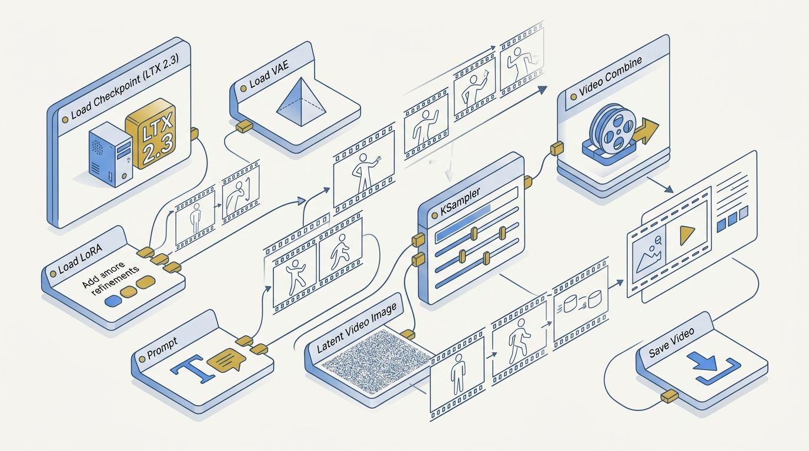
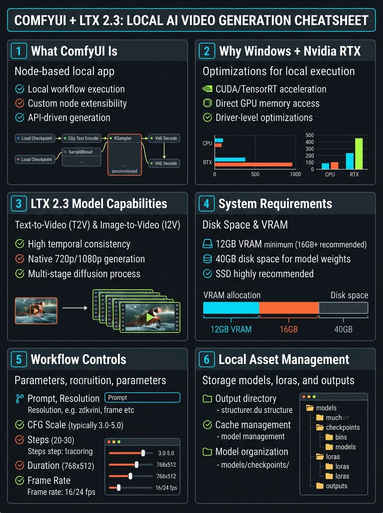
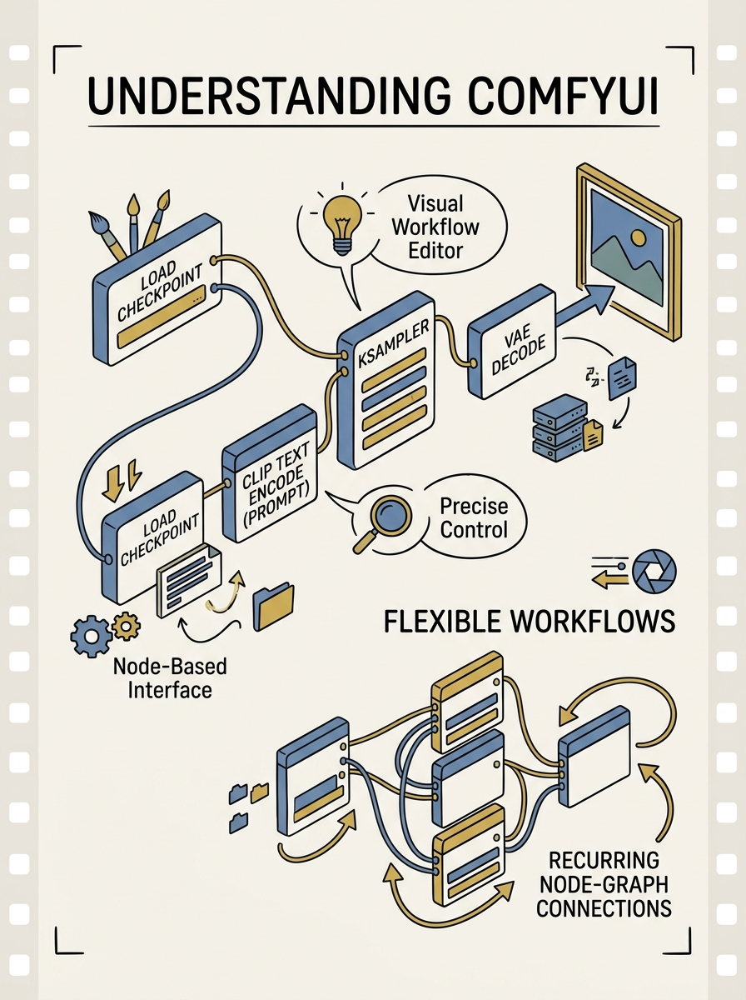

<!-- _class: title -->

# ComfyUI + LTX 2.3

Free, local AI video generation on Windows + Nvidia RTX — no API keys, no subscriptions

<!-- Speaker: 30-second intro — this is a node-based, local-first alternative to cloud video generators. -->

---

<!-- _class: cheatsheet -->
<!-- _backgroundColor: #f8f7f4 -->

<!-- Speaker: 60-second cheatsheet orientation — point at VRAM/disk panel and workflow controls panel before advancing. -->

---

## ComfyUI + LTX 2.3 in One Sentence

Local, node-based, ฟรีไม่มีค่า subscription — สร้าง AI video ได้ทั้ง Text-to-Video และ Image-to-Video

<svg viewBox="0 0 1100 300" width="100%" xmlns="http://www.w3.org/2000/svg">
  <rect x="60" y="20" width="980" height="260" rx="16" fill="var(--paper)" stroke="var(--soft-2)" stroke-width="1.5" style="filter:drop-shadow(0 4px 12px rgba(15,23,42,.08))"/>
  <rect x="60" y="20" width="8" height="260" rx="4" fill="var(--accent)"/>
  <circle cx="150" cy="150" r="42" fill="var(--accent)" opacity=".12"/>
  <circle cx="150" cy="150" r="30" fill="var(--accent)"/>
  <text x="150" y="157" font-size="20" fill="var(--paper)" text-anchor="middle" dominant-baseline="central" font-family="system-ui" font-weight="700">&#9733;</text>
  <text x="220" y="120" font-size="22" font-weight="700" fill="var(--ink)" font-family="system-ui">Open-source, runs 100% on your PC</text>
  <text x="220" y="160" font-size="16" fill="var(--ink-dim)" font-family="system-ui">No API key, no per-video subscription cost</text>
  <text x="220" y="190" font-size="16" fill="var(--muted)" font-family="system-ui">LTX 2.3 model: Text-to-Video + Image-to-Video in one workflow</text>
</svg>

<b>&#9733; Takeaway:</b> Install once, generate unlimited videos — the only real cost is electricity and GPU hardware.

<!-- Speaker: Set expectations — this is the value proposition before diving into how it works. -->

---

## Why Local AI Video Generation Matters

เครื่องมือ cloud-based (Runway, Pika, Sora) คิดค่า credit ต่อวิดีโอ — ยิ่งปรับ prompt บ่อย ยิ่งแพง

<svg viewBox="0 0 700 320" width="100%" xmlns="http://www.w3.org/2000/svg">
  <text x="20" y="40" font-size="16" font-weight="700" fill="var(--ink)" font-family="system-ui">Cloud vs Local Cost Model</text>
  <rect x="20" y="70" width="280" height="60" rx="8" fill="var(--danger-wash)"/>
  <text x="35" y="95" font-size="14" font-weight="700" fill="var(--danger-ink)" font-family="system-ui">Cloud</text>
  <text x="35" y="118" font-size="13" fill="var(--danger-ink)" font-family="system-ui">$ per video, scales with retries</text>
  <rect x="20" y="150" width="280" height="60" rx="8" fill="var(--success-wash)"/>
  <text x="35" y="175" font-size="14" font-weight="700" fill="var(--success-ink)" font-family="system-ui">ComfyUI Local</text>
  <text x="35" y="198" font-size="13" fill="var(--success-ink)" font-family="system-ui">$0 per video after setup</text>
  <line x1="20" y1="240" x2="300" y2="240" stroke="var(--muted)" stroke-width="1.5"/>
  <text x="20" y="265" font-size="12" fill="var(--muted)" font-family="system-ui">Trade-off: upfront GPU + disk investment</text>
</svg>

<b>&#9733; Takeaway:</b> Unlimited iteration on prompts is free once ComfyUI + LTX 2.3 are installed.

<!-- Speaker: Frame the cost problem before introducing the tool that solves it. -->

---

## What ComfyUI Actually Is

Visual, node-based workflow editor — ลาก-วาง-เชื่อมต่อ node โดยไม่ต้องเขียนโค้ด

<svg viewBox="0 0 700 320" width="100%" xmlns="http://www.w3.org/2000/svg">
  <rect x="20" y="40" width="140" height="50" rx="8" fill="var(--paper)" stroke="var(--accent)" stroke-width="2"/>
  <text x="90" y="70" font-size="12" fill="var(--ink)" text-anchor="middle" font-family="system-ui">Load Checkpoint</text>
  <line x1="160" y1="65" x2="220" y2="65" stroke="var(--muted)" stroke-width="2"/>
  <rect x="220" y="40" width="140" height="50" rx="8" fill="var(--paper)" stroke="var(--accent)" stroke-width="2"/>
  <text x="290" y="70" font-size="12" fill="var(--ink)" text-anchor="middle" font-family="system-ui">Encode Prompt</text>
  <line x1="360" y1="65" x2="420" y2="65" stroke="var(--muted)" stroke-width="2"/>
  <rect x="420" y="40" width="140" height="50" rx="8" fill="var(--accent)"/>
  <text x="490" y="70" font-size="12" fill="var(--paper)" text-anchor="middle" font-family="system-ui">Sample</text>
  <line x1="490" y1="90" x2="490" y2="140" stroke="var(--muted)" stroke-width="2"/>
  <rect x="330" y="140" width="140" height="50" rx="8" fill="var(--paper)" stroke="var(--accent)" stroke-width="2"/>
  <text x="400" y="170" font-size="12" fill="var(--ink)" text-anchor="middle" font-family="system-ui">Video Combine</text>
  <text x="20" y="240" font-size="13" fill="var(--muted)" font-family="system-ui">Also supports: images, audio, 3D, LLMs</text>
</svg>

<b>&#9733; Takeaway:</b> Every step of the pipeline is visible and swappable — community custom nodes extend it further.

<!-- Speaker: Node graph is the mental model for the whole rest of the deck. -->

---

## Hardware Requirements: Windows + Nvidia RTX

CUDA + PyTorch optimization ถูก tune มาสำหรับ RTX โดยเฉพาะ — official docs แนะนำ VRAM สูง แต่ consumer GPU ก็ใช้ได้จริง

| Component | Requirement | Notes |
|---|---|---|
| OS + GPU | Windows + Nvidia RTX | Most stable, CUDA-tuned configuration |
| VRAM (official) | 32GB+ | Full precision (bf16) |
| VRAM (practical) | 12GB–24GB | RTX 3060 (FP8/quantized) up to RTX 3090/4090 |
| Disk — LTX 2.3 only | ~40 GB | First-time model download |
| Disk — total | 100 GB+ | ComfyUI + dependencies + cache |

<b>&#9733; Takeaway:</b> Consumer RTX cards work via FP8 + low-VRAM loader nodes — 32GB is the ceiling, not the floor.

<!-- Speaker: Set realistic hardware expectations before the model capability slide. -->

---

## LTX 2.3: Text-to-Video vs Image-to-Video

โมเดล open-source เดียวรองรับทั้งสองโหมด — เลือกจุดเริ่มต้นตามที่มีอยู่ในมือ

<svg viewBox="0 0 1100 380" width="100%" xmlns="http://www.w3.org/2000/svg">
  <rect x="40" y="20" width="490" height="340" rx="12" fill="var(--paper)" stroke="var(--soft-2)" stroke-width="1.5" style="filter:drop-shadow(var(--shadow-sm))"/>
  <rect x="40" y="20" width="490" height="56" rx="12" fill="var(--soft)" opacity=".8"/>
  <text x="285" y="54" font-size="17" font-weight="700" fill="var(--ink-dim)" text-anchor="middle" font-family="system-ui">Text-to-Video</text>
  <text x="80" y="110" font-size="15" fill="var(--ink)" font-family="system-ui">Start from text prompt only</text>
  <text x="80" y="145" font-size="15" fill="var(--ink-dim)" font-family="system-ui">Single-stage distilled: fast</text>
  <text x="80" y="180" font-size="15" fill="var(--muted)" font-family="system-ui">Two-stage + upscale: max quality</text>
  <rect x="570" y="20" width="490" height="340" rx="12" fill="var(--paper)" stroke="var(--accent)" stroke-width="2" style="filter:drop-shadow(var(--shadow-md))"/>
  <rect x="570" y="20" width="490" height="56" rx="12" fill="var(--accent)" opacity=".08"/>
  <text x="815" y="54" font-size="17" font-weight="700" fill="var(--accent)" text-anchor="middle" font-family="system-ui">Image-to-Video</text>
  <text x="610" y="110" font-size="15" fill="var(--ink)" font-family="system-ui">Drag in a still image + motion prompt</text>
  <text x="610" y="145" font-size="15" fill="var(--ink)" font-family="system-ui">Model animates the existing image</text>
  <text x="610" y="180" font-size="15" fill="var(--ink)" font-family="system-ui">Plus: T2A audio, Lipdub, HDR output</text>
  <circle cx="550" cy="190" r="28" fill="var(--accent)"/>
  <text x="550" y="195" font-size="14" font-weight="700" fill="var(--paper)" text-anchor="middle" dominant-baseline="central" font-family="system-ui">VS</text>
</svg>

<b>&#9733; Takeaway:</b> No source image? Use Text-to-Video. Have one? Image-to-Video animates it directly.

<!-- Speaker: Both modes live in the same ComfyUI install — no separate download. -->

---

## Workflow Controls: What You Set Before Run

พารามิเตอร์หลัก 4 ตัว — บาง node มีข้อจำกัดทางคณิตศาสตร์ที่ต้องรู้ก่อน

<svg viewBox="0 0 1100 220" width="100%" xmlns="http://www.w3.org/2000/svg">
  <defs>
    <marker id="arr1" markerWidth="8" markerHeight="6" refX="7" refY="3" orient="auto">
      <path d="M0,0 7,3 0,6" stroke="none" fill="var(--muted)"/>
    </marker>
  </defs>
  <rect x="30" y="70" width="230" height="90" rx="8" fill="var(--accent)"/>
  <text x="145" y="105" font-size="16" font-weight="700" fill="var(--paper)" text-anchor="middle" font-family="system-ui">Prompt</text>
  <text x="145" y="128" font-size="12" fill="var(--paper)" text-anchor="middle" opacity=".85" font-family="system-ui">scene, action, lighting</text>
  <line x1="262" y1="115" x2="298" y2="115" stroke="var(--muted)" stroke-width="2" marker-end="url(#arr1)"/>
  <rect x="300" y="70" width="230" height="90" rx="8" fill="var(--paper)" stroke="var(--accent)" stroke-width="2"/>
  <text x="415" y="105" font-size="16" font-weight="700" fill="var(--ink)" text-anchor="middle" font-family="system-ui">Resolution</text>
  <text x="415" y="128" font-size="12" fill="var(--ink-dim)" text-anchor="middle" font-family="system-ui">must be multiple of 32</text>
  <line x1="532" y1="115" x2="568" y2="115" stroke="var(--muted)" stroke-width="2" marker-end="url(#arr1)"/>
  <rect x="570" y="70" width="230" height="90" rx="8" fill="var(--paper)" stroke="var(--accent)" stroke-width="2"/>
  <text x="685" y="105" font-size="16" font-weight="700" fill="var(--ink)" text-anchor="middle" font-family="system-ui">Duration</text>
  <text x="685" y="128" font-size="12" fill="var(--ink-dim)" text-anchor="middle" font-family="system-ui">frame count = 8n + 1</text>
  <line x1="802" y1="115" x2="838" y2="115" stroke="var(--muted)" stroke-width="2" marker-end="url(#arr1)"/>
  <rect x="840" y="70" width="230" height="90" rx="8" fill="var(--paper)" stroke="var(--accent)" stroke-width="2"/>
  <text x="955" y="105" font-size="16" font-weight="700" fill="var(--ink)" text-anchor="middle" font-family="system-ui">Frame Rate</text>
  <text x="955" y="128" font-size="12" fill="var(--ink-dim)" text-anchor="middle" font-family="system-ui">controls motion smoothness</text>
</svg>

<b>&#9733; Takeaway:</b> Resolution ÷32 and frame count = 8n+1 aren't suggestions — wrong values error or get auto-rounded.

<!-- Speaker: These four settings are the ones users get wrong most often — call out the math constraints. -->

---

## User Guide: Install & Setup

3 ขั้นตอนแรก — ทำครั้งเดียว ใช้ได้ตลอด

<svg viewBox="0 0 1100 200" width="100%" xmlns="http://www.w3.org/2000/svg">
  <defs>
    <marker id="arr2" markerWidth="8" markerHeight="6" refX="7" refY="3" orient="auto">
      <path d="M0,0 7,3 0,6" stroke="none" fill="var(--muted)"/>
    </marker>
  </defs>
  <rect x="30" y="60" width="320" height="90" rx="8" fill="var(--accent)"/>
  <text x="190" y="95" font-size="16" font-weight="700" fill="var(--paper)" text-anchor="middle" font-family="system-ui">1. Install ComfyUI Desktop</text>
  <text x="190" y="120" font-size="12" fill="var(--paper)" text-anchor="middle" opacity=".85" font-family="system-ui">Download Desktop, choose "local" mode</text>
  <line x1="352" y1="105" x2="388" y2="105" stroke="var(--muted)" stroke-width="2" marker-end="url(#arr2)"/>
  <rect x="390" y="60" width="320" height="90" rx="8" fill="var(--paper)" stroke="var(--accent)" stroke-width="2"/>
  <text x="550" y="95" font-size="16" font-weight="700" fill="var(--ink)" text-anchor="middle" font-family="system-ui">2. Install LTXVideo Node</text>
  <text x="550" y="120" font-size="12" fill="var(--ink-dim)" text-anchor="middle" font-family="system-ui">Ctrl+M -&gt; Manager -&gt; search "LTXVideo"</text>
  <line x1="712" y1="105" x2="748" y2="105" stroke="var(--muted)" stroke-width="2" marker-end="url(#arr2)"/>
  <rect x="750" y="60" width="320" height="90" rx="8" fill="var(--paper)" stroke="var(--accent)" stroke-width="2"/>
  <text x="910" y="95" font-size="16" font-weight="700" fill="var(--ink)" text-anchor="middle" font-family="system-ui">3. Load LTX-2.3 Template</text>
  <text x="910" y="120" font-size="12" fill="var(--ink-dim)" text-anchor="middle" font-family="system-ui">Templates -&gt; "Download all" models</text>
</svg>

<b>&#9733; Takeaway:</b> Setup is one-time — restart ComfyUI after node install, and the LTXVideo category appears in the node menu.

<!-- Speaker: Walk through the one-time setup; models download automatically on first template use. -->

---

## User Guide: Configure, Run & Manage

3 ขั้นตอนถัดมา — ทำทุกครั้งที่ generate

<svg viewBox="0 0 1100 200" width="100%" xmlns="http://www.w3.org/2000/svg">
  <defs>
    <marker id="arr3" markerWidth="8" markerHeight="6" refX="7" refY="3" orient="auto">
      <path d="M0,0 7,3 0,6" stroke="none" fill="var(--muted)"/>
    </marker>
  </defs>
  <rect x="30" y="60" width="320" height="90" rx="8" fill="var(--accent)"/>
  <text x="190" y="95" font-size="16" font-weight="700" fill="var(--paper)" text-anchor="middle" font-family="system-ui">4. Set Prompt + Params</text>
  <text x="190" y="120" font-size="12" fill="var(--paper)" text-anchor="middle" opacity=".85" font-family="system-ui">prompt, resolution, duration, fps</text>
  <line x1="352" y1="105" x2="388" y2="105" stroke="var(--muted)" stroke-width="2" marker-end="url(#arr3)"/>
  <rect x="390" y="60" width="320" height="90" rx="8" fill="var(--paper)" stroke="var(--accent)" stroke-width="2"/>
  <text x="550" y="95" font-size="16" font-weight="700" fill="var(--ink)" text-anchor="middle" font-family="system-ui">5. Run</text>
  <text x="550" y="120" font-size="12" fill="var(--ink-dim)" text-anchor="middle" font-family="system-ui">~20-40s per 5s clip on RTX 4090 (FP8)</text>
  <line x1="712" y1="105" x2="748" y2="105" stroke="var(--muted)" stroke-width="2" marker-end="url(#arr3)"/>
  <rect x="750" y="60" width="320" height="90" rx="8" fill="var(--paper)" stroke="var(--accent)" stroke-width="2"/>
  <text x="910" y="95" font-size="16" font-weight="700" fill="var(--ink)" text-anchor="middle" font-family="system-ui">6. Manage via Assets</text>
  <text x="910" y="120" font-size="12" fill="var(--ink-dim)" text-anchor="middle" font-family="system-ui">preview, save, delete — no File Explorer</text>
</svg>

<b>&#9733; Takeaway:</b> Out-of-memory? Switch to a low-VRAM loader node or lower resolution/frame count first.

<!-- Speaker: Assets tab is the most-missed feature — most people go hunting in File Explorer instead. -->

---

## Caveats & Limits

รู้ก่อนติดตั้ง จะประหยัดเวลาทั้ง disk และ VRAM

  

    
VRAM Gap

    <h3>Official vs Practical</h3>
    
Docs recommend 32GB+; consumer RTX (12-24GB) needs FP8/quantized models to run at all.

  

  

    
Math Constraints

    <h3>Resolution & Frame Count</h3>
    
Resolution must divide by 32; frame count must equal 8n+1. Wrong values error or auto-round.

  

  

    
Storage & Bandwidth

    <h3>~40GB First Download</h3>
    
Check free disk space and connection speed before starting the first model download.

  

<b>&#9733; Takeaway:</b> "Free" means no subscription — the real cost is electricity + a capable GPU.

<!-- Speaker: Set expectations before viewers install — these are the three most common blockers. -->

---

## Key Takeaways

สิ่งที่ต้องจำ ถ้าอ่านแค่สไลด์นี้สไลด์เดียว

<svg viewBox="0 0 1100 340" width="100%" xmlns="http://www.w3.org/2000/svg">
  <circle cx="550" cy="170" r="160" fill="none" stroke="var(--soft-2)" stroke-width="1.5"/>
  <circle cx="550" cy="170" r="110" fill="none" stroke="var(--accent)" stroke-width="1.5" opacity=".4"/>
  <circle cx="550" cy="170" r="60" fill="var(--accent)" opacity=".1"/>
  <circle cx="550" cy="170" r="60" fill="none" stroke="var(--accent)" stroke-width="2"/>
  <text x="550" y="164" font-size="15" font-weight="700" fill="var(--accent)" text-anchor="middle" font-family="system-ui">Local, free</text>
  <text x="550" y="184" font-size="13" fill="var(--ink)" text-anchor="middle" font-family="system-ui">AI video</text>
  <text x="380" y="100" font-size="13" fill="var(--ink)" font-family="system-ui" text-anchor="middle">LTX 2.3:</text>
  <text x="380" y="120" font-size="12" fill="var(--muted)" font-family="system-ui" text-anchor="middle">T2V + I2V</text>
  <text x="730" y="100" font-size="13" fill="var(--ink)" font-family="system-ui" text-anchor="middle">RTX GPU,</text>
  <text x="730" y="120" font-size="12" fill="var(--muted)" font-family="system-ui" text-anchor="middle">~40GB disk</text>
  <text x="220" y="170" font-size="13" fill="var(--muted)" font-family="system-ui" text-anchor="middle">Res ÷32,</text>
  <text x="220" y="190" font-size="13" fill="var(--muted)" font-family="system-ui" text-anchor="middle">frames 8n+1</text>
  <text x="880" y="170" font-size="13" fill="var(--muted)" font-family="system-ui" text-anchor="middle">Manage via</text>
  <text x="880" y="190" font-size="13" fill="var(--muted)" font-family="system-ui" text-anchor="middle">Assets tab</text>
</svg>

<b>&#9733; Takeaway:</b> Install ComfyUI + LTXVideo once, respect the resolution/frame-count math, and every video after that is free.

<!-- Speaker: Closing slide — reinforce the core value prop one more time. -->
