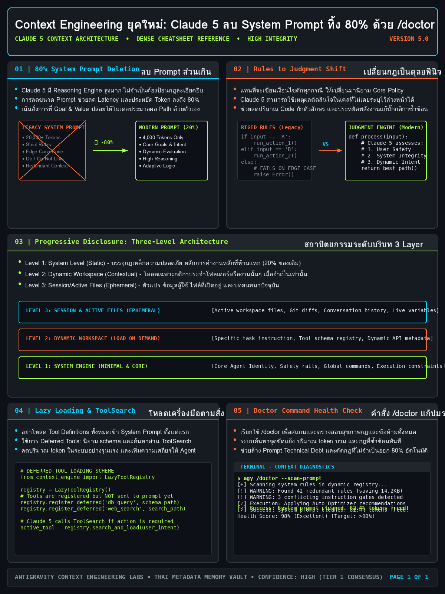

<!-- _class: title -->

# Context Engineering ยุคใหม่: Claude 5 ฉลาดพอให้ลบ System Prompt ทิ้ง 80% ด้วยคำสั่ง /doctor

Progressive Disclosure, Lazy Loading และการตรวจสุขภาพ context ของ Claude Code

<!-- Speaker: 30-second intro — Thariq Shihipar's official Anthropic blog post, July 24 2026, plus the /doctor command shipped in v2.1.205. -->

---

<!-- _class: cheatsheet -->
<!-- _backgroundColor: #0D1117 -->

<!-- Speaker: 60-second cheatsheet orientation — point at the 5 panels before advancing. -->

---

## TL;DR: ลบ 80% แล้วไม่มี Performance Loss

Anthropic ยืนยันอย่างเป็นทางการ 24 ก.ค. 2026 — Claude Opus 5 และ Fable 5 ฉลาดพอจะใช้ดุลพินิจแทนกฎตายตัว

<svg viewBox="0 0 1100 360" width="100%" xmlns="http://www.w3.org/2000/svg">
  <rect x="60" y="30" width="980" height="300" rx="16" fill="var(--paper)" stroke="var(--soft-2)" stroke-width="1.5" style="filter:drop-shadow(0 4px 12px rgba(15,23,42,.08))"/>
  <rect x="60" y="30" width="8" height="300" rx="4" fill="var(--accent)"/>
  <circle cx="220" cy="180" r="110" fill="var(--accent)" opacity=".08"/>
  <circle cx="220" cy="180" r="82" fill="var(--accent)"/>
  <text x="220" y="172" font-size="44" font-weight="800" fill="var(--paper)" text-anchor="middle" dominant-baseline="central" font-family="system-ui">80%</text>
  <text x="220" y="206" font-size="12" fill="var(--paper)" text-anchor="middle" font-family="system-ui">PROMPT DELETED</text>
  <text x="410" y="110" font-size="20" font-weight="700" fill="var(--ink)" font-family="system-ui">No measurable loss in coding evals</text>
  <text x="410" y="145" font-size="15" fill="var(--ink-dim)" font-family="system-ui">Models: Claude Opus 5, Claude Fable 5</text>
  <text x="410" y="175" font-size="15" fill="var(--ink-dim)" font-family="system-ui">3 shifts: rules to judgment, examples to interface,</text>
  <text x="410" y="200" font-size="15" fill="var(--ink-dim)" font-family="system-ui">upfront context to progressive disclosure</text>
  <text x="410" y="235" font-size="15" fill="var(--muted)" font-family="system-ui">Skills: up to 85% token reduction</text>
  <text x="410" y="275" font-size="14" fill="var(--gold)" font-family="system-ui" font-weight="700">/doctor (v2.1.205): finds unused skills eating context</text>
</svg>

<b>★ Takeaway:</b> โมเดลฉลาดขึ้น = context engineering เปลี่ยนจากการยัดกฎ ไปเป็นการโหลดเฉพาะสิ่งที่จำเป็นจริง

<!-- Speaker: Anchor the headline number, then preview the 3 shifts and the /doctor tool covered in this deck. -->

---

## ทำไม Context Engineering ถึงต้องเปลี่ยนใหม่

โมเดลรุ่นแรกต้องการราวกั้นละเอียดยิบ เพราะถ้าไม่มีกฎ โมเดลอาจทำเรื่องแย่ๆ โดยไม่ตั้งใจ

<svg viewBox="0 0 1100 320" width="100%" xmlns="http://www.w3.org/2000/svg">
  <rect x="60" y="60" width="320" height="90" rx="10" fill="var(--soft)" stroke="var(--soft-2)" stroke-width="1.5"/>
  <text x="220" y="98" font-size="15" font-weight="700" fill="var(--ink)" text-anchor="middle" font-family="system-ui">Skill A: "no comments"</text>
  <path d="M220 150 L220 180" stroke="var(--danger)" stroke-width="2" stroke-dasharray="4 3"/>
  <text x="220" y="172" font-size="12" fill="var(--danger)" text-anchor="middle" font-family="system-ui">CONFLICT</text>
  <rect x="60" y="180" width="320" height="90" rx="10" fill="var(--soft)" stroke="var(--soft-2)" stroke-width="1.5"/>
  <text x="220" y="218" font-size="15" font-weight="700" fill="var(--ink)" text-anchor="middle" font-family="system-ui">User: "add docs"</text>
  <path d="M420 175 L540 175" stroke="var(--muted)" stroke-width="2" marker-end="url(#bg1)"/>
  <circle cx="650" cy="175" r="90" fill="var(--warning)" opacity=".12"/>
  <text x="650" y="168" font-size="16" font-weight="700" fill="var(--warning)" text-anchor="middle" font-family="system-ui">Wasted</text>
  <text x="650" y="196" font-size="14" fill="var(--ink)" text-anchor="middle" font-family="system-ui">reasoning</text>
  <text x="800" y="130" font-size="14" font-weight="700" fill="var(--ink)" font-family="system-ui">Anthropic transcripts:</text>
  <text x="800" y="158" font-size="13" fill="var(--ink-dim)" font-family="system-ui">two competing instructions</text>
  <text x="800" y="182" font-size="13" fill="var(--ink-dim)" font-family="system-ui">force Claude to reconcile</text>
  <text x="800" y="206" font-size="13" fill="var(--ink-dim)" font-family="system-ui">before solving the real task</text>
  <defs><marker id="bg1" markerWidth="8" markerHeight="8" refX="6" refY="4" orient="auto"><path d="M0,0 L8,4 L0,8 Z" fill="var(--muted)"/></marker></defs>
</svg>

<b>★ Takeaway:</b> กฎที่สะสมมากขึ้นเริ่มขัดแย้งกันเอง — Claude ต้องเสีย reasoning ไปกับการประนีประนอมกฎ แทนที่จะแก้ปัญหาจริง

<!-- Speaker: Real example from Anthropic transcripts — one skill said "no docs," user asked about docs at the same time. -->

---

## ทำไมลบ System Prompt ทิ้ง 80% แล้วผลลัพธ์ไม่ตก

Thariq Shihipar (Anthropic): "We removed over 80% of Claude Code's system prompt... with no measurable loss"

<svg viewBox="0 0 1100 320" width="100%" xmlns="http://www.w3.org/2000/svg">
  <text x="60" y="50" font-size="14" font-weight="700" fill="var(--ink-dim)" font-family="system-ui">System prompt size</text>
  <rect x="60" y="70" width="420" height="50" rx="6" fill="var(--danger)" opacity=".7"/>
  <text x="270" y="102" font-size="15" font-weight="700" fill="var(--paper)" text-anchor="middle" font-family="system-ui">BEFORE — 100%</text>
  <rect x="60" y="150" width="80" height="50" rx="6" fill="var(--success)"/>
  <text x="180" y="182" font-size="15" font-weight="700" fill="var(--ink)" font-family="system-ui">AFTER — under 20%</text>
  <path d="M600 60 L600 260" stroke="var(--soft-2)" stroke-width="1.5"/>
  <text x="640" y="100" font-size="15" font-weight="700" fill="var(--ink)" font-family="system-ui">Rules → Judgment</text>
  <text x="640" y="130" font-size="13" fill="var(--ink-dim)" font-family="system-ui">let Claude reason instead</text>
  <text x="640" y="154" font-size="13" fill="var(--ink-dim)" font-family="system-ui">of following prescriptive rules</text>
  <text x="640" y="200" font-size="16" font-weight="700" fill="var(--accent)" font-family="system-ui">Result: no measurable eval loss</text>
  <text x="640" y="228" font-size="13" fill="var(--muted)" font-family="system-ui">Models: Claude Opus 5, Claude Fable 5</text>
</svg>

<b>★ Takeaway:</b> ใช้เฉพาะกับ Claude Opus 5 / Fable 5 — โมเดลรุ่นเก่ายังต้องการ guardrail แบบเดิมในระดับหนึ่ง

<!-- Speaker: Published same day Opus 5 launched — the 80% figure is the headline of the official Anthropic article. -->

---

## 3 การเปลี่ยนกระบวนทัศน์ของ Context Engineering

จากบทความทางการของ Thariq Shihipar — สรุปเป็น 3 แกนหลัก

  

    
Shift 1

    <h3>Rules → Judgment</h3>
    
จากกฎตายตัวที่รู้อยู่แล้วว่าจะผิดบ้าง เปลี่ยนเป็นให้ Claude ใช้ context ตัดสินใจเอง

  

  

    
Shift 2

    <h3>Examples → Interface Design</h3>
    
แทนที่จะสาธิตด้วยตัวอย่างจำนวนมาก ออกแบบ tool parameter ให้สื่อความหมายชัดในตัวเอง

  

  

    
Shift 3

    <h3>Upfront → Progressive Disclosure</h3>
    
ย้ายรายละเอียดจาก system prompt ที่โหลดทุกครั้ง ไปไว้ใน Skill ที่เรียกเฉพาะเมื่อจำเป็น

  

<b>★ Takeaway:</b> ทั้ง 3 shift ชี้ไปทางเดียวกัน — ให้น้อยลง แต่ให้ในเวลาที่ถูกต้อง

<!-- Speaker: Walk through each shift; shift 3 (progressive disclosure) is the deepest — next slide expands it. -->

---

## Progressive Disclosure: สถาปัตยกรรม 3 ระดับของ Agent Skills

Claude เข้าถึงข้อมูลทีละชั้นตามที่จำเป็นจริง เหมือนสารบัญ → เนื้อหา → ภาคผนวก

| ระดับ | เนื้อหา | Token cost | โหลดเมื่อไหร่ |
|---|---|---|---|
| **Level 1** | ชื่อ + description ของ skill | ~100 tokens/skill | ทุก session |
| **Level 2** | เนื้อหาเต็มใน `SKILL.md` | สูงสุด ~5,000 tokens | เมื่อ Claude เห็นว่าเกี่ยวข้อง |
| **Level 3** | ไฟล์อ้างอิงเพิ่มเติม | ไม่จำกัด | เมื่อต้องการรายละเอียดเฉพาะจุด |

<b>★ Takeaway:</b> ระบบที่เชื่อมต่อ tool นับร้อยลด token usage ได้ถึง 85% — จาก 25,000 tokens เหลือ 2,500 tokens ก่อนดึงคำสั่งเต็มเมื่อ request ตรงกับ skill

<!-- Speaker: This table is the technical core of the deck — spend the most time here. -->

---

## Lazy Loading ในทางปฏิบัติ: Deferred Tools + ToolSearch

หลักการเดียวกับ Skills ถูกใช้กับ tool definitions — โหลดชื่อก่อน ค้นหา definition เต็มเฉพาะที่ใช้จริง

<svg viewBox="0 0 1100 320" width="100%" xmlns="http://www.w3.org/2000/svg">
  <rect x="40" y="90" width="230" height="80" rx="10" fill="var(--soft)" stroke="var(--soft-2)" stroke-width="1.5"/>
  <text x="155" y="125" font-size="14" font-weight="700" fill="var(--ink)" text-anchor="middle" font-family="system-ui">Tool names</text>
  <text x="155" y="148" font-size="12" fill="var(--ink-dim)" text-anchor="middle" font-family="system-ui">+ short description</text>
  <path d="M270 130 L360 130" stroke="var(--muted)" stroke-width="2" marker-end="url(#ll1)"/>
  <rect x="360" y="90" width="230" height="80" rx="10" fill="var(--paper)" stroke="var(--accent)" stroke-width="2"/>
  <text x="475" y="125" font-size="14" font-weight="700" fill="var(--accent)" text-anchor="middle" font-family="system-ui">ToolSearch</text>
  <text x="475" y="148" font-size="12" fill="var(--ink-dim)" text-anchor="middle" font-family="system-ui">finds the right one</text>
  <path d="M590 130 L710 130" stroke="var(--muted)" stroke-width="2" marker-end="url(#ll1)"/>
  <circle cx="770" cy="130" r="55" fill="var(--success)" opacity=".12"/>
  <circle cx="770" cy="130" r="40" fill="var(--success)"/>
  <text x="770" y="136" font-size="14" font-weight="700" fill="var(--paper)" text-anchor="middle" font-family="system-ui">LOAD</text>
  <text x="900" y="105" font-size="13" font-weight="700" fill="var(--ink)" text-anchor="middle" font-family="system-ui">Deferred tools</text>
  <text x="900" y="128" font-size="12" fill="var(--ink-dim)" text-anchor="middle" font-family="system-ui">require ToolSearch</text>
  <text x="900" y="151" font-size="12" fill="var(--ink-dim)" text-anchor="middle" font-family="system-ui">before full definitions</text>
  <text x="900" y="174" font-size="12" fill="var(--ink-dim)" text-anchor="middle" font-family="system-ui">are loaded</text>
  <text x="40" y="240" font-size="14" font-weight="700" fill="var(--gold)" font-family="system-ui">Source: Anthropic official article</text>
  <text x="40" y="265" font-size="13" fill="var(--ink-dim)" font-family="system-ui">"deferred loading tools require ToolSearch before full definitions are loaded"</text>
  <defs><marker id="ll1" markerWidth="8" markerHeight="8" refX="6" refY="4" orient="auto"><path d="M0,0 L8,4 L0,8 Z" fill="var(--muted)"/></marker></defs>
</svg>

<b>★ Takeaway:</b> ป้องกัน token bloat จากการมี tool จำนวนมากที่ไม่ได้ใช้ในงานนั้นๆ

<!-- Speaker: This session's own environment uses this exact pattern — ToolSearch is a real deferred-tool mechanism. -->

---

## คำสั่ง /doctor: หมอตรวจสุขภาพ Context ของ Claude Code

v2.1.205 (8 ก.ค. 2026) — รายงานก่อน แล้วค่อยขอ confirmation ก่อนแก้ไขจริง

<svg viewBox="0 0 1100 360" width="100%" xmlns="http://www.w3.org/2000/svg">
  <rect x="60" y="30" width="980" height="300" rx="16" fill="var(--paper)" stroke="var(--soft-2)" stroke-width="1.5" style="filter:drop-shadow(0 4px 12px rgba(15,23,42,.08))"/>
  <rect x="60" y="30" width="8" height="300" rx="4" fill="var(--danger)"/>
  <circle cx="220" cy="180" r="110" fill="var(--danger)" opacity=".08"/>
  <circle cx="220" cy="180" r="82" fill="var(--danger)"/>
  <text x="220" y="172" font-size="40" font-weight="800" fill="var(--paper)" text-anchor="middle" dominant-baseline="central" font-family="system-ui">113</text>
  <text x="220" y="206" font-size="12" fill="var(--paper)" text-anchor="middle" font-family="system-ui">PERSONAL SKILLS</text>
  <text x="410" y="100" font-size="20" font-weight="700" fill="var(--ink)" font-family="system-ui">Real /doctor scan result</text>
  <text x="410" y="140" font-size="15" fill="var(--ink-dim)" font-family="system-ui">~10,000 tokens/session just to list 113 skills</text>
  <text x="410" y="170" font-size="15" fill="var(--danger)" font-weight="700" font-family="system-ui">25 skills never used at all</text>
  <text x="410" y="210" font-size="14" fill="var(--muted)" font-family="system-ui">Checks: install health, dead weight, CLAUDE.md</text>
  <text x="410" y="235" font-size="14" fill="var(--muted)" font-family="system-ui">dedup, trim proposals, slow hooks</text>
  <text x="410" y="275" font-size="14" fill="var(--gold)" font-weight="700" font-family="system-ui">Read-only report first — nothing changes without OK</text>
</svg>

<b>★ Takeaway:</b> /checkup คือ alias ของ /doctor — เรียกใช้ได้ทันทีในเซสชันปัจจุบัน ไม่ต้องติดตั้งเพิ่ม

<!-- Speaker: This 113-skill example is a real scan result from the source video — grounds the abstract "token bloat" concept in a concrete number. -->

---

## เริ่มต้นใช้งานจริง: 5 ขั้นตอน

จากรัน /doctor ไปจนถึงเขียน skill ใหม่ด้วย progressive disclosure

<svg viewBox="0 0 1100 300" width="100%" xmlns="http://www.w3.org/2000/svg">
  <rect x="20" y="110" width="196" height="90" rx="10" fill="var(--paper)" stroke="var(--accent)" stroke-width="2" style="filter:drop-shadow(var(--shadow-sm))"/>
  <text x="118" y="145" font-size="12" font-weight="700" fill="var(--accent)" text-anchor="middle" font-family="system-ui">1. Run /doctor</text>
  <text x="118" y="168" font-size="10" fill="var(--ink-dim)" text-anchor="middle" font-family="system-ui">Read-only scan report</text>
  <path d="M216 155 L242 155" stroke="var(--muted)" stroke-width="2" marker-end="url(#ug1)"/>
  <rect x="242" y="110" width="196" height="90" rx="10" fill="var(--paper)" stroke="var(--accent)" stroke-width="2" style="filter:drop-shadow(var(--shadow-sm))"/>
  <text x="340" y="145" font-size="12" font-weight="700" fill="var(--accent)" text-anchor="middle" font-family="system-ui">2. Review proposals</text>
  <text x="340" y="168" font-size="10" fill="var(--ink-dim)" text-anchor="middle" font-family="system-ui">Diff before commit</text>
  <path d="M438 155 L464 155" stroke="var(--muted)" stroke-width="2" marker-end="url(#ug1)"/>
  <rect x="464" y="110" width="196" height="90" rx="10" fill="var(--paper)" stroke="var(--accent)" stroke-width="2" style="filter:drop-shadow(var(--shadow-sm))"/>
  <text x="562" y="145" font-size="12" font-weight="700" fill="var(--accent)" text-anchor="middle" font-family="system-ui">3. Slim CLAUDE.md</text>
  <text x="562" y="168" font-size="10" fill="var(--ink-dim)" text-anchor="middle" font-family="system-ui">High-level index only</text>
  <path d="M660 155 L686 155" stroke="var(--muted)" stroke-width="2" marker-end="url(#ug1)"/>
  <rect x="686" y="110" width="196" height="90" rx="10" fill="var(--paper)" stroke="var(--accent)" stroke-width="2" style="filter:drop-shadow(var(--shadow-sm))"/>
  <text x="784" y="145" font-size="12" font-weight="700" fill="var(--accent)" text-anchor="middle" font-family="system-ui">4. New skills</text>
  <text x="784" y="168" font-size="10" fill="var(--ink-dim)" text-anchor="middle" font-family="system-ui">Progressive disclosure</text>
  <path d="M882 155 L908 155" stroke="var(--muted)" stroke-width="2" marker-end="url(#ug1)"/>
  <rect x="908" y="110" width="172" height="90" rx="10" fill="var(--paper)" stroke="var(--warning)" stroke-width="2" style="filter:drop-shadow(var(--shadow-sm))"/>
  <text x="994" y="145" font-size="12" font-weight="700" fill="var(--warning)" text-anchor="middle" font-family="system-ui">5. Check auto mode</text>
  <text x="994" y="168" font-size="10" fill="var(--ink-dim)" text-anchor="middle" font-family="system-ui">/doctor warns if off</text>
  <defs><marker id="ug1" markerWidth="7" markerHeight="7" refX="5" refY="3.5" orient="auto"><path d="M0,0 L7,3.5 L0,7 Z" fill="var(--muted)"/></marker></defs>
</svg>

<b>★ Takeaway:</b> เริ่มจากตรวจก่อนแก้ — /doctor รายงานให้ review เสมอ ไม่เปลี่ยนอะไรแบบเงียบๆ

<!-- Speaker: Walk through all 5 in order; step 2 is the safety net — always review the diff. -->

---

## Caveats: Heuristic ไม่ใช่ Certainty

/doctor ช่วยได้มาก แต่ผลลัพธ์ต้อง review ก่อนเชื่อทุกครั้ง

  

    
Heuristic

    <h3>วัดผลตามช่วงเวลา</h3>
    
Skill ที่ใช้ไตรมาสละครั้งอาจดูเหมือน "ไม่เคยใช้" ถ้าวัดแค่รายสัปดาห์

  

  

    
Scope

    <h3>เฉพาะ Opus 5 / Fable 5</h3>
    
โมเดลรุ่นเก่ายังต้องการ guardrail แบบเดิมในระดับหนึ่ง

  

  

    
Design

    <h3>Metadata ต้องชัด</h3>
    
ถ้า name/description ของ skill ไม่ชัด Claude อาจไม่เรียกใช้ตอนจำเป็น

  

  

    
Process

    <h3>Review ก่อน commit</h3>
    
CLAUDE.md edits ลงเป็น diff ให้ตรวจ ไม่ commit อัตโนมัติ

  

<b>★ Takeaway:</b> ตรวจสอบรายงานของ /doctor ก่อนลบหรือแก้ไขอะไรเสมอ — heuristic ผิดพลาดได้

<!-- Speaker: Don't let readers walk away thinking /doctor is a fire-and-forget automation — it always waits for review. -->

---

## Key Takeaways

สิ่งที่ต้องจำแม้อ่านแค่สไลด์นี้สไลด์เดียว

<svg viewBox="0 0 1100 340" width="100%" xmlns="http://www.w3.org/2000/svg">
  <circle cx="550" cy="170" r="160" fill="none" stroke="var(--soft-2)" stroke-width="1.5"/>
  <circle cx="550" cy="170" r="110" fill="none" stroke="var(--accent)" stroke-width="1.5" opacity=".4"/>
  <circle cx="550" cy="170" r="60" fill="var(--accent)" opacity=".1"/>
  <circle cx="550" cy="170" r="60" fill="none" stroke="var(--accent)" stroke-width="2"/>
  <text x="550" y="164" font-size="14" font-weight="700" fill="var(--accent)" text-anchor="middle" font-family="system-ui">Load only</text>
  <text x="550" y="184" font-size="13" fill="var(--ink)" text-anchor="middle" font-family="system-ui">what's needed</text>
  <text x="380" y="100" font-size="13" fill="var(--ink)" font-family="system-ui" text-anchor="middle">80% prompt</text>
  <text x="380" y="120" font-size="12" fill="var(--muted)" font-family="system-ui" text-anchor="middle">deleted</text>
  <text x="730" y="100" font-size="13" fill="var(--ink)" font-family="system-ui" text-anchor="middle">85% token</text>
  <text x="730" y="120" font-size="12" fill="var(--muted)" font-family="system-ui" text-anchor="middle">savings</text>
  <text x="220" y="170" font-size="13" fill="var(--muted)" font-family="system-ui" text-anchor="middle">/doctor</text>
  <text x="220" y="190" font-size="13" fill="var(--muted)" font-family="system-ui" text-anchor="middle">finds dead weight</text>
  <text x="880" y="170" font-size="13" fill="var(--muted)" font-family="system-ui" text-anchor="middle">ToolSearch</text>
  <text x="880" y="190" font-size="13" fill="var(--muted)" font-family="system-ui" text-anchor="middle">defers loading</text>
</svg>

<b>★ Takeaway:</b> Context engineering ยุคใหม่ = โหลดเฉพาะสิ่งที่จำเป็น เมื่อจำเป็นจริง — ไม่ใช่ยัดทุกอย่างไว้ล่วงหน้า

