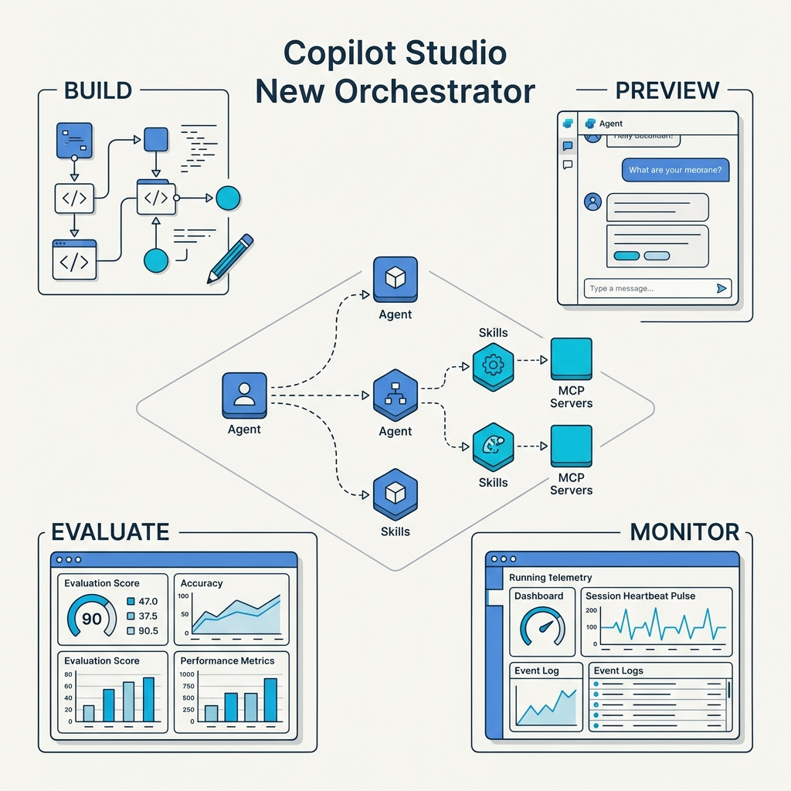
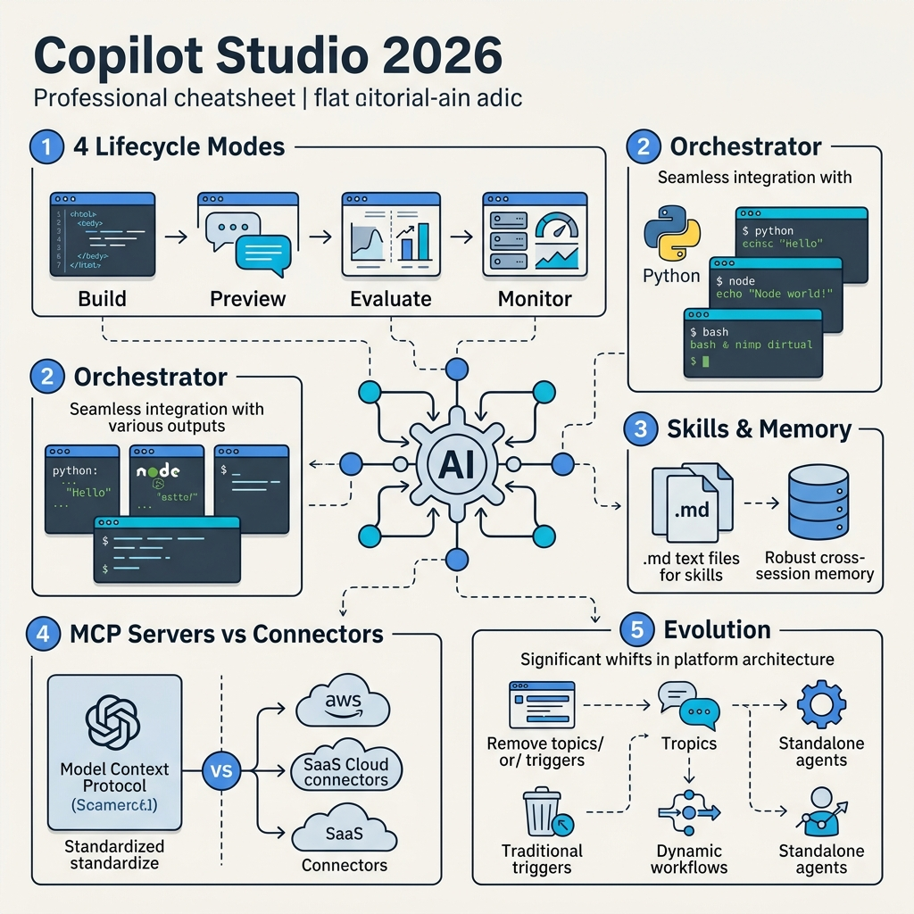
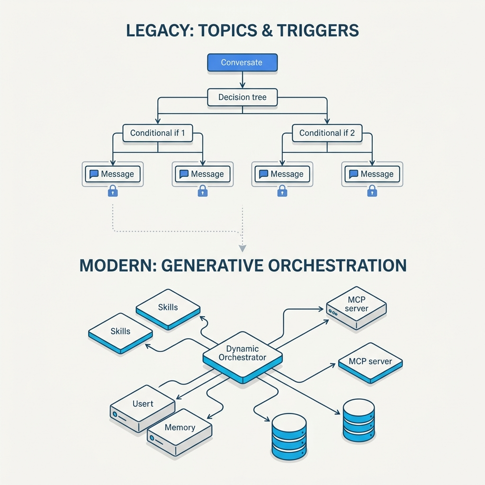
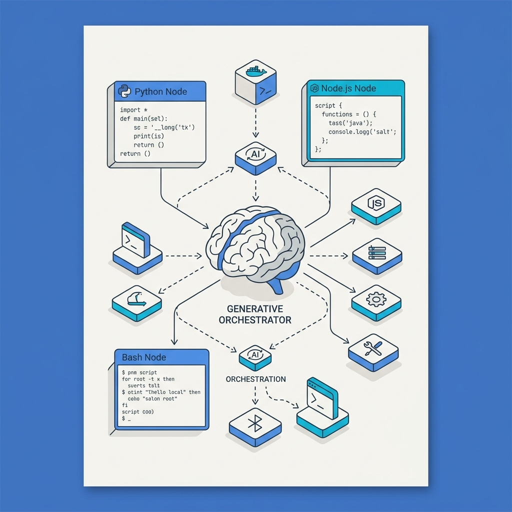
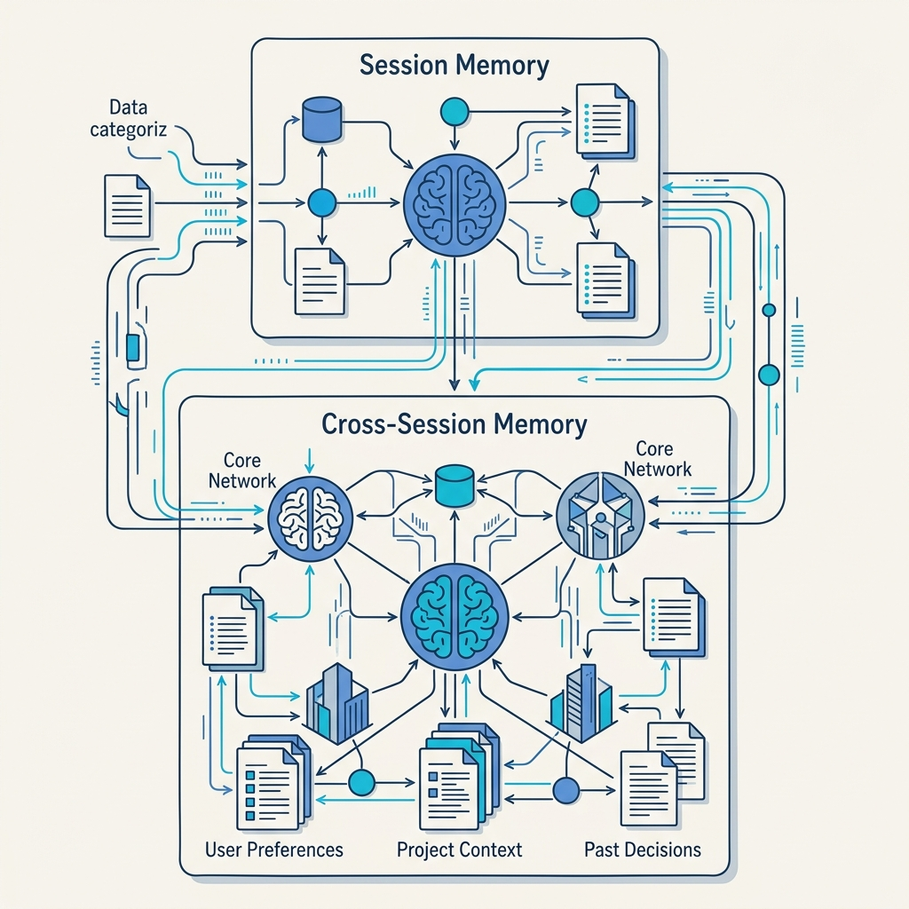

<!-- _class: title -->

# Copilot Studio ใหม่

Orchestrator · Skills · Memory · MCP Servers — สิ่งที่เปลี่ยนและสิ่งที่ถูกถอดออก

<!-- Speaker: Copilot Studio rebuild ครั้งใหญ่ — จาก chatbot builder → enterprise automation platform -->

---

<!-- _class: cheatsheet -->
<!-- _backgroundColor: #f8f7f4 -->

<!-- Speaker: ภาพรวมทั้ง deck ใน 60 วินาที — จดจุดสำคัญก่อนเข้า deep dive -->

---

## Copilot Studio 2026: ปรับใหญ่จาก Chatbot สู่ Agentic Platform

จาก Topics/Triggers → Generative Orchestrator — ทั้ง runtime และ UX เปลี่ยนหมด

<svg viewBox="0 0 1100 360" width="100%" xmlns="http://www.w3.org/2000/svg">
  <rect x="60" y="40" width="980" height="280" rx="16" fill="var(--paper)" stroke="var(--soft-2)" stroke-width="1.5" style="filter:drop-shadow(0 4px 12px rgba(15,23,42,.08))"/>
  <rect x="60" y="40" width="8" height="280" rx="4" fill="var(--accent)"/>
  <!-- Icon circle -->
  <circle cx="148" cy="180" r="44" fill="var(--accent)" opacity=".1"/>
  <circle cx="148" cy="180" r="30" fill="var(--accent)"/>
  <text x="148" y="186" font-size="16" fill="white" text-anchor="middle" dominant-baseline="central" font-family="system-ui" font-weight="700">NEW</text>
  <!-- Key message -->
  <text x="220" y="152" font-size="22" font-weight="700" fill="var(--ink)" font-family="system-ui">Rebuilt for complex, multi-step agentic work</text>
  <text x="220" y="185" font-size="15" fill="var(--ink-dim)" font-family="system-ui">Generative orchestrator · Python/Node/Bash · Skills (.md) · Memory · MCP</text>
  <text x="220" y="218" font-size="14" fill="var(--muted)" font-family="system-ui">Topics / Triggers / Inline child agents removed — replaced by Workflows + Standalone Agents</text>
  <!-- Perf badges -->
  <rect x="220" y="240" width="160" height="36" rx="8" fill="var(--success-wash)"/>
  <text x="300" y="263" font-size="13" font-weight="700" fill="var(--success-ink)" text-anchor="middle" font-family="system-ui">+20% eval perf</text>
  <rect x="396" y="240" width="160" height="36" rx="8" fill="var(--accent-wash)"/>
  <text x="476" y="263" font-size="13" font-weight="700" fill="var(--accent-deep)" text-anchor="middle" font-family="system-ui">-50% token usage</text>
  <rect x="572" y="240" width="160" height="36" rx="8" fill="var(--warning-wash)"/>
  <text x="652" y="263" font-size="13" font-weight="700" fill="var(--warning-ink)" text-anchor="middle" font-family="system-ui">4-tab workflow UI</text>
  <rect x="0" y="0" width="1" height="1" fill="none"/>
</svg>

<b>★ Takeaway:</b> Copilot Studio ไม่ใช่ chatbot builder อีกต่อไป — มันคือ agentic automation platform ที่ orchestrate งานซับซ้อนได้เอง

<!-- Speaker: นี่คือสรุปสั้นๆ ก่อนเข้า slide ต่อไป -->

---

## Why Rebuild: Deterministic Flow Hits a Wall

Topics/Triggers ทำงานได้ดีกับ FAQ bot — แต่พัง เมื่อ workload ซับซ้อนขึ้น

<svg viewBox="0 0 700 320" width="100%" xmlns="http://www.w3.org/2000/svg">
  <!-- Old model -->
  <rect x="20" y="20" width="300" height="280" rx="12" fill="var(--danger-wash)" stroke="var(--danger)" stroke-width="1.5" opacity=".6"/>
  <text x="170" y="50" font-size="14" font-weight="700" fill="var(--danger-ink)" text-anchor="middle" font-family="system-ui">Old: Topic Tree</text>
  <rect x="60" y="68" width="220" height="32" rx="6" fill="var(--danger)" opacity=".15"/>
  <text x="170" y="89" font-size="12" fill="var(--danger-ink)" text-anchor="middle" font-family="system-ui">keyword match → trigger</text>
  <rect x="60" y="112" width="220" height="32" rx="6" fill="var(--danger)" opacity=".15"/>
  <text x="170" y="133" font-size="12" fill="var(--danger-ink)" text-anchor="middle" font-family="system-ui">hardcoded topic flow</text>
  <rect x="60" y="156" width="220" height="32" rx="6" fill="var(--danger)" opacity=".15"/>
  <text x="170" y="177" font-size="12" fill="var(--danger-ink)" text-anchor="middle" font-family="system-ui">breaks if user goes off-script</text>
  <rect x="60" y="200" width="220" height="32" rx="6" fill="var(--danger)" opacity=".15"/>
  <text x="170" y="221" font-size="12" fill="var(--danger-ink)" text-anchor="middle" font-family="system-ui">no multi-step orchestration</text>
  <!-- Arrow -->
  <text x="340" y="168" font-size="22" fill="var(--accent)" text-anchor="middle" font-family="system-ui" font-weight="700">→</text>
  <!-- New model -->
  <rect x="370" y="20" width="300" height="280" rx="12" fill="var(--success-wash)" stroke="var(--success)" stroke-width="1.5" opacity=".6"/>
  <text x="520" y="50" font-size="14" font-weight="700" fill="var(--success-ink)" text-anchor="middle" font-family="system-ui">New: Generative Orchestrator</text>
  <rect x="410" y="68" width="220" height="32" rx="6" fill="var(--success)" opacity=".15"/>
  <text x="520" y="89" font-size="12" fill="var(--success-ink)" text-anchor="middle" font-family="system-ui">intent → dynamic routing</text>
  <rect x="410" y="112" width="220" height="32" rx="6" fill="var(--success)" opacity=".15"/>
  <text x="520" y="133" font-size="12" fill="var(--success-ink)" text-anchor="middle" font-family="system-ui">Skills + MCP + Memory</text>
  <rect x="410" y="156" width="220" height="32" rx="6" fill="var(--success)" opacity=".15"/>
  <text x="520" y="177" font-size="12" fill="var(--success-ink)" text-anchor="middle" font-family="system-ui">handles off-script gracefully</text>
  <rect x="410" y="200" width="220" height="32" rx="6" fill="var(--success)" opacity=".15"/>
  <text x="520" y="221" font-size="12" fill="var(--success-ink)" text-anchor="middle" font-family="system-ui">multi-step, multi-tool work</text>
  <rect x="0" y="0" width="1" height="1" fill="none"/>
</svg>

<b>★ Takeaway:</b> โมเดลเดิมพังเมื่อ user ไม่ทำตาม script — generative orchestrator ออกแบบมาเพื่อรับมือกับ unpredictability

<!-- Speaker: Root cause ของการ rebuild — Topics เป็น fragile glue code ไม่ใช่ real AI -->

---

## 4 Modes: Build → Preview → Evaluate → Monitor

UI ปรับเป็น 4-tab SDLC workflow — แต่ละ mode มีบทบาทชัดเจน

<svg viewBox="0 0 1100 340" width="100%" xmlns="http://www.w3.org/2000/svg">
  <!-- Step 1: Build -->
  <rect x="30" y="60" width="220" height="220" rx="12" fill="var(--paper)" stroke="var(--accent)" stroke-width="2" style="filter:drop-shadow(0 4px 12px rgba(15,23,42,.08))"/>
  <circle cx="140" cy="120" r="36" fill="var(--accent)" opacity=".12"/>
  <circle cx="140" cy="120" r="24" fill="var(--accent)"/>
  <text x="140" y="126" font-size="14" fill="white" text-anchor="middle" dominant-baseline="central" font-family="system-ui" font-weight="700">1</text>
  <text x="140" y="176" font-size="16" font-weight="700" fill="var(--accent)" text-anchor="middle" font-family="system-ui">BUILD</text>
  <text x="140" y="198" font-size="12" fill="var(--ink-dim)" text-anchor="middle" font-family="system-ui">Skills + MCP</text>
  <text x="140" y="216" font-size="12" fill="var(--ink-dim)" text-anchor="middle" font-family="system-ui">Memory + Instructions</text>
  <text x="140" y="254" font-size="11" fill="var(--muted)" text-anchor="middle" font-family="system-ui">Create agent</text>
  <!-- Arrow 1→2 -->
  <path d="M258 170 L290 170" stroke="var(--accent)" stroke-width="2.5" marker-end="url(#arr)"/>
  <defs><marker id="arr" markerWidth="8" markerHeight="8" refX="6" refY="3" orient="auto"><path d="M0,0 L0,6 L8,3 z" fill="var(--accent)"/></marker></defs>
  <!-- Step 2: Preview -->
  <rect x="298" y="60" width="220" height="220" rx="12" fill="var(--paper)" stroke="var(--gold)" stroke-width="2" style="filter:drop-shadow(0 4px 12px rgba(15,23,42,.08))"/>
  <circle cx="408" cy="120" r="36" fill="var(--gold)" opacity=".12"/>
  <circle cx="408" cy="120" r="24" fill="var(--gold)"/>
  <text x="408" y="126" font-size="14" fill="white" text-anchor="middle" dominant-baseline="central" font-family="system-ui" font-weight="700">2</text>
  <text x="408" y="176" font-size="16" font-weight="700" fill="var(--gold)" text-anchor="middle" font-family="system-ui">PREVIEW</text>
  <text x="408" y="198" font-size="12" fill="var(--ink-dim)" text-anchor="middle" font-family="system-ui">Interactive test</text>
  <text x="408" y="216" font-size="12" fill="var(--ink-dim)" text-anchor="middle" font-family="system-ui">Reasoning trace</text>
  <text x="408" y="254" font-size="11" fill="var(--muted)" text-anchor="middle" font-family="system-ui">Test before deploy</text>
  <!-- Arrow 2→3 -->
  <path d="M526 170 L558 170" stroke="var(--accent)" stroke-width="2.5" marker-end="url(#arr)"/>
  <!-- Step 3: Evaluate -->
  <rect x="566" y="60" width="220" height="220" rx="12" fill="var(--paper)" stroke="var(--success)" stroke-width="2" style="filter:drop-shadow(0 4px 12px rgba(15,23,42,.08))"/>
  <circle cx="676" cy="120" r="36" fill="var(--success)" opacity=".12"/>
  <circle cx="676" cy="120" r="24" fill="var(--success)"/>
  <text x="676" y="126" font-size="14" fill="white" text-anchor="middle" dominant-baseline="central" font-family="system-ui" font-weight="700">3</text>
  <text x="676" y="176" font-size="16" font-weight="700" fill="var(--success)" text-anchor="middle" font-family="system-ui">EVALUATE</text>
  <text x="676" y="198" font-size="12" fill="var(--ink-dim)" text-anchor="middle" font-family="system-ui">Custom metrics</text>
  <text x="676" y="216" font-size="12" fill="var(--ink-dim)" text-anchor="middle" font-family="system-ui">Resolution rate, accuracy</text>
  <text x="676" y="254" font-size="11" fill="var(--muted)" text-anchor="middle" font-family="system-ui">Measure outcomes</text>
  <!-- Arrow 3→4 -->
  <path d="M794 170 L826 170" stroke="var(--accent)" stroke-width="2.5" marker-end="url(#arr)"/>
  <!-- Step 4: Monitor -->
  <rect x="834" y="60" width="220" height="220" rx="12" fill="var(--paper)" stroke="var(--danger)" stroke-width="2" style="filter:drop-shadow(0 4px 12px rgba(15,23,42,.08))"/>
  <circle cx="944" cy="120" r="36" fill="var(--danger)" opacity=".12"/>
  <circle cx="944" cy="120" r="24" fill="var(--danger)"/>
  <text x="944" y="126" font-size="14" fill="white" text-anchor="middle" dominant-baseline="central" font-family="system-ui" font-weight="700">4</text>
  <text x="944" y="176" font-size="16" font-weight="700" fill="var(--danger)" text-anchor="middle" font-family="system-ui">MONITOR</text>
  <text x="944" y="198" font-size="12" fill="var(--ink-dim)" text-anchor="middle" font-family="system-ui">Prod logs + errors</text>
  <text x="944" y="216" font-size="12" fill="var(--ink-dim)" text-anchor="middle" font-family="system-ui">Token usage + health</text>
  <text x="944" y="254" font-size="11" fill="var(--muted)" text-anchor="middle" font-family="system-ui">Observe production</text>
  <rect x="0" y="0" width="1" height="1" fill="none"/>
</svg>

<b>★ Takeaway:</b> สี่ mode ครอบคลุม full SDLC ของ agent — ไม่ใช่แค่ build แล้วปล่อยให้วิ่งเอง

<!-- Speaker: Pattern นี้ทำให้ enterprise team มี governance process รอบ agent ได้ชัดเจน -->

---

## Orchestrator: Python, Node.js, Bash ใน Runtime

Generative orchestrator เลือก tool เองตาม intent — รันโค้ดได้โดยตรง

<svg viewBox="0 0 700 300" width="100%" xmlns="http://www.w3.org/2000/svg">
  <!-- Center node -->
  <circle cx="340" cy="150" r="50" fill="var(--accent)" opacity=".1"/>
  <circle cx="340" cy="150" r="34" fill="var(--accent)"/>
  <text x="340" y="145" font-size="12" fill="white" text-anchor="middle" font-family="system-ui" font-weight="700">Orchestrator</text>
  <text x="340" y="162" font-size="10" fill="rgba(255,255,255,.8)" text-anchor="middle" font-family="system-ui">generative</text>
  <!-- Python -->
  <rect x="20" y="40" width="160" height="56" rx="8" fill="var(--success-wash)" stroke="var(--success)" stroke-width="1.5"/>
  <text x="100" y="62" font-size="13" font-weight="700" fill="var(--success-ink)" text-anchor="middle" font-family="system-ui">Python</text>
  <text x="100" y="82" font-size="11" fill="var(--success-ink)" text-anchor="middle" font-family="system-ui">data analysis · Excel/PDF</text>
  <path d="M180 68 L290 130" stroke="var(--muted)" stroke-width="1.5" stroke-dasharray="4,3"/>
  <!-- Node.js -->
  <rect x="20" y="204" width="160" height="56" rx="8" fill="var(--accent-wash)" stroke="var(--accent)" stroke-width="1.5"/>
  <text x="100" y="226" font-size="13" font-weight="700" fill="var(--accent-deep)" text-anchor="middle" font-family="system-ui">Node.js</text>
  <text x="100" y="246" font-size="11" fill="var(--accent-deep)" text-anchor="middle" font-family="system-ui">API calls · transforms</text>
  <path d="M180 232 L290 170" stroke="var(--muted)" stroke-width="1.5" stroke-dasharray="4,3"/>
  <!-- Bash -->
  <rect x="540" y="122" width="150" height="56" rx="8" fill="var(--warning-wash)" stroke="var(--warning)" stroke-width="1.5"/>
  <text x="615" y="144" font-size="13" font-weight="700" fill="var(--warning-ink)" text-anchor="middle" font-family="system-ui">Bash</text>
  <text x="615" y="164" font-size="11" fill="var(--warning-ink)" text-anchor="middle" font-family="system-ui">shell · file ops</text>
  <path d="M390 150 L540 150" stroke="var(--muted)" stroke-width="1.5" stroke-dasharray="4,3"/>
  <!-- Perf -->
  <rect x="440" y="40" width="240" height="52" rx="8" fill="var(--soft)" stroke="var(--soft-2)" stroke-width="1"/>
  <text x="560" y="60" font-size="12" font-weight="700" fill="var(--ink)" text-anchor="middle" font-family="system-ui">+20% eval · -50% tokens</text>
  <text x="560" y="80" font-size="11" fill="var(--ink-dim)" text-anchor="middle" font-family="system-ui">vs. previous orchestrator</text>
  <rect x="0" y="0" width="1" height="1" fill="none"/>
</svg>

<b>★ Takeaway:</b> Agent รับ CSV → วิเคราะห์ Python → สร้าง Excel → ส่ง reply ได้ใน Copilot Studio ไม่ต้องออกไป Power Automate

<!-- Speaker: นี่คือ killer feature — รัน code ได้ใน runtime โดยตรง -->

---

## Skills: .md Files Generated from Prompts

แทน Topics ด้วย reusable instruction sets — เขียนเป็น Markdown สร้างจาก natural language ได้

<svg viewBox="0 0 1100 360" width="100%" xmlns="http://www.w3.org/2000/svg">
  <!-- Old: Topics -->
  <rect x="30" y="20" width="480" height="320" rx="12" fill="var(--danger-wash)" stroke="var(--danger)" stroke-width="1.5"/>
  <rect x="30" y="20" width="480" height="48" rx="12" fill="var(--danger)" opacity=".15"/>
  <text x="270" y="50" font-size="16" font-weight="700" fill="var(--danger-ink)" text-anchor="middle" font-family="system-ui">Topics (Old) — Keyword-Triggered</text>
  <rect x="60" y="82" width="420" height="32" rx="6" fill="white" stroke="var(--soft-2)" stroke-width="1"/>
  <text x="270" y="103" font-size="12" fill="var(--ink-dim)" text-anchor="middle" font-family="system-ui">trigger: "analyze" | "data" | "report"</text>
  <rect x="60" y="126" width="420" height="80" rx="6" fill="white" stroke="var(--soft-2)" stroke-width="1"/>
  <text x="270" y="150" font-size="12" fill="var(--ink-dim)" text-anchor="middle" font-family="system-ui">step 1: ask for file</text>
  <text x="270" y="170" font-size="12" fill="var(--ink-dim)" text-anchor="middle" font-family="system-ui">step 2: send to Power Automate</text>
  <text x="270" y="190" font-size="12" fill="var(--ink-dim)" text-anchor="middle" font-family="system-ui">step 3: return fixed message</text>
  <text x="270" y="242" font-size="12" fill="var(--danger-ink)" text-anchor="middle" font-family="system-ui">brittle · no reuse · hard to maintain</text>
  <rect x="60" y="260" width="420" height="60" rx="6" fill="var(--danger)" opacity=".07"/>
  <text x="270" y="285" font-size="11" fill="var(--danger-ink)" text-anchor="middle" font-family="system-ui">breaks when user goes off-script</text>
  <text x="270" y="305" font-size="11" fill="var(--danger-ink)" text-anchor="middle" font-family="system-ui">must maintain keyword lists manually</text>
  <!-- Arrow -->
  <text x="542" y="200" font-size="26" fill="var(--accent)" text-anchor="middle" font-family="system-ui" font-weight="700">→</text>
  <!-- New: Skills -->
  <rect x="590" y="20" width="480" height="320" rx="12" fill="var(--success-wash)" stroke="var(--success)" stroke-width="1.5"/>
  <rect x="590" y="20" width="480" height="48" rx="12" fill="var(--success)" opacity=".15"/>
  <text x="830" y="50" font-size="16" font-weight="700" fill="var(--success-ink)" text-anchor="middle" font-family="system-ui">Skills (.md) — Context-Aware</text>
  <rect x="620" y="82" width="420" height="128" rx="6" fill="white" stroke="var(--soft-2)" stroke-width="1"/>
  <text x="640" y="106" font-size="11" fill="var(--muted)" font-family="monospace">## Analyze Sales Data</text>
  <text x="640" y="126" font-size="11" fill="var(--ink-dim)" font-family="monospace">When user asks to analyze data:</text>
  <text x="640" y="146" font-size="11" fill="var(--ink-dim)" font-family="monospace">1. Request file or connection</text>
  <text x="640" y="166" font-size="11" fill="var(--ink-dim)" font-family="monospace">2. Run Python: totals, trends</text>
  <text x="640" y="186" font-size="11" fill="var(--ink-dim)" font-family="monospace">3. Offer Excel or PDF export</text>
  <text x="830" y="242" font-size="12" fill="var(--success-ink)" text-anchor="middle" font-family="system-ui">reusable · no keywords · context-driven</text>
  <rect x="620" y="260" width="420" height="60" rx="6" fill="var(--success)" opacity=".07"/>
  <text x="830" y="285" font-size="11" fill="var(--success-ink)" text-anchor="middle" font-family="system-ui">generate from prompt in Build mode</text>
  <text x="830" y="305" font-size="11" fill="var(--success-ink)" text-anchor="middle" font-family="system-ui">orchestrator selects by context, not keyword</text>
  <rect x="0" y="0" width="1" height="1" fill="none"/>
</svg>

<b>★ Takeaway:</b> Skills ไม่ต้องการ trigger keyword — orchestrator เลือกเรียกตาม intent ทำให้ agent เข้าใจ off-script requests ได้

<!-- Speaker: Non-developer สามารถสร้าง Skill โดยพิมพ์ describe what you want → Copilot Studio generates the .md -->

---

## Memory: Cross-Session Context Storage

Agent จำ user preferences และ project context ข้ามเซสชัน — ผ่าน Work IQ API

<svg viewBox="0 0 700 300" width="100%" xmlns="http://www.w3.org/2000/svg">
  <!-- Session memory -->
  <rect x="20" y="30" width="300" height="110" rx="12" fill="var(--paper)" stroke="var(--accent)" stroke-width="2" style="filter:drop-shadow(0 4px 8px rgba(15,23,42,.08))"/>
  <rect x="20" y="30" width="300" height="36" rx="12" fill="var(--accent)" opacity=".1"/>
  <text x="170" y="54" font-size="14" font-weight="700" fill="var(--accent-deep)" text-anchor="middle" font-family="system-ui">Session Memory</text>
  <text x="50" y="88" font-size="12" fill="var(--ink-dim)" font-family="system-ui">Context window — current convo</text>
  <text x="50" y="110" font-size="12" fill="var(--muted)" font-family="system-ui">Cleared on session end</text>
  <!-- Persistent memory -->
  <rect x="20" y="158" width="300" height="110" rx="12" fill="var(--paper)" stroke="var(--gold)" stroke-width="2" style="filter:drop-shadow(0 4px 8px rgba(15,23,42,.08))"/>
  <rect x="20" y="158" width="300" height="36" rx="12" fill="var(--gold)" opacity=".1"/>
  <text x="170" y="182" font-size="14" font-weight="700" fill="var(--warning-ink)" text-anchor="middle" font-family="system-ui">Persistent Memory</text>
  <text x="50" y="216" font-size="12" fill="var(--ink-dim)" font-family="system-ui">User prefs · project context</text>
  <text x="50" y="238" font-size="12" fill="var(--muted)" font-family="system-ui">Work IQ API — public preview</text>
  <!-- Arrow to API -->
  <path d="M330 150 L430 150" stroke="var(--accent)" stroke-width="2" marker-end="url(#a2)"/>
  <defs><marker id="a2" markerWidth="8" markerHeight="8" refX="6" refY="3" orient="auto"><path d="M0,0 L0,6 L8,3 z" fill="var(--accent)"/></marker></defs>
  <rect x="438" y="110" width="230" height="80" rx="10" fill="var(--accent-wash)" stroke="var(--accent)" stroke-width="1.5"/>
  <text x="553" y="140" font-size="14" font-weight="700" fill="var(--accent-deep)" text-anchor="middle" font-family="system-ui">Work IQ API</text>
  <text x="553" y="162" font-size="12" fill="var(--ink-dim)" text-anchor="middle" font-family="system-ui">public preview · REST</text>
  <rect x="0" y="0" width="1" height="1" fill="none"/>
</svg>

<b>★ Takeaway:</b> Agent จำได้ว่า user ชอบ format Excel ไม่ใช่ PDF — ไม่ต้องถามซ้ำทุก session

<!-- Speaker: Work IQ API ยังอยู่ใน public preview — schema อาจเปลี่ยน ควร monitor -->

---

## MCP Servers vs Traditional Connectors

Open standard แทน Microsoft-specific connectors — dynamic, cross-platform, no certification required

<svg viewBox="0 0 1100 360" width="100%" xmlns="http://www.w3.org/2000/svg">
  <!-- Traditional Connector -->
  <rect x="30" y="20" width="470" height="320" rx="12" fill="var(--paper)" stroke="var(--soft-2)" stroke-width="1.5" style="filter:drop-shadow(var(--shadow-sm))"/>
  <rect x="30" y="20" width="470" height="52" rx="12" fill="var(--soft)" opacity=".8"/>
  <text x="265" y="52" font-size="16" font-weight="700" fill="var(--ink-dim)" text-anchor="middle" font-family="system-ui">Traditional Connector</text>
  <text x="60" y="100" font-size="13" fill="var(--ink)" font-family="system-ui">Microsoft-specific format</text>
  <text x="60" y="130" font-size="13" fill="var(--ink-dim)" font-family="system-ui">Manual publish / certification</text>
  <text x="60" y="160" font-size="13" fill="var(--ink-dim)" font-family="system-ui">Actions only (no Resources/Prompts)</text>
  <text x="60" y="190" font-size="13" fill="var(--muted)" font-family="system-ui">Update requires republish cycle</text>
  <text x="60" y="220" font-size="13" fill="var(--muted)" font-family="system-ui">Locked to Power Platform ecosystem</text>
  <rect x="60" y="250" width="400" height="64" rx="8" fill="var(--danger-wash)"/>
  <text x="260" y="276" font-size="12" fill="var(--danger-ink)" text-anchor="middle" font-family="system-ui">fragile when external API changes</text>
  <text x="260" y="298" font-size="12" fill="var(--danger-ink)" text-anchor="middle" font-family="system-ui">can't reuse across platforms</text>
  <!-- VS badge -->
  <circle cx="550" cy="190" r="30" fill="var(--accent)"/>
  <text x="550" y="196" font-size="14" font-weight="700" fill="white" text-anchor="middle" dominant-baseline="central" font-family="system-ui">VS</text>
  <!-- MCP Server -->
  <rect x="600" y="20" width="470" height="320" rx="12" fill="var(--paper)" stroke="var(--accent)" stroke-width="2" style="filter:drop-shadow(var(--shadow-md))"/>
  <rect x="600" y="20" width="470" height="52" rx="12" fill="var(--accent)" opacity=".08"/>
  <text x="835" y="52" font-size="16" font-weight="700" fill="var(--accent)" text-anchor="middle" font-family="system-ui">MCP Server</text>
  <text x="630" y="100" font-size="13" fill="var(--ink)" font-family="system-ui">Open standard (cross-platform)</text>
  <text x="630" y="130" font-size="13" fill="var(--ink)" font-family="system-ui">No certification needed</text>
  <text x="630" y="160" font-size="13" fill="var(--ink)" font-family="system-ui">Resources + Tools + Prompts</text>
  <text x="630" y="190" font-size="13" fill="var(--ink)" font-family="system-ui">Dynamic — agent reflects changes auto</text>
  <text x="630" y="220" font-size="13" fill="var(--ink)" font-family="system-ui">Reuse across any MCP-compatible platform</text>
  <rect x="630" y="250" width="400" height="64" rx="8" fill="var(--success-wash)"/>
  <text x="830" y="276" font-size="12" fill="var(--success-ink)" text-anchor="middle" font-family="system-ui">requires Generative Orchestration ON</text>
  <text x="830" y="298" font-size="12" fill="var(--success-ink)" text-anchor="middle" font-family="system-ui">one server → multiple tools + resources</text>
  <rect x="0" y="0" width="1" height="1" fill="none"/>
</svg>

<b>★ Takeaway:</b> MCP เป็น open standard — ลงทุนสร้าง MCP server ครั้งเดียว ใช้ได้ข้าม platform ไม่ต้อง vendor lock-in

<!-- Speaker: ต้องเปิด Generative Orchestration ก่อนถึงจะใช้ MCP ได้ -->

---

## สิ่งที่ถูกถอดออก: Topics, Triggers, Inline Child Agents

Deterministic features ถูกแทนที่ด้วย generative equivalents — ไม่มี auto-migration

  

    
Removed

    <h3>Topics</h3>
    
Deterministic conversation flow ที่ต้องกำหนด keyword triggers และ step ทุกอย่างล่วงหน้า

    
แทนด้วย: <b>Skills (.md)</b> + Generative Orchestrator

  

  

    
Removed

    <h3>Triggers</h3>
    
Keyword matching rules ที่ brittle และต้อง maintain รายการ keywords ด้วยมือตลอดเวลา

    
แทนด้วย: <b>Orchestrator</b> เข้าใจ intent เอง

  

  

    
Removed

    <h3>Inline Child Agents</h3>
    
Sub-agents แบบ tightly coupled ที่ reuse ข้าม project ไม่ได้ และยาก maintain

    
แทนด้วย: <b>Standalone Agents</b> + Workflows

  

<b>★ Takeaway:</b> Bot เดิมที่ใช้ Topics ต้อง rewrite เป็น Skills — ไม่มี auto-migration tool ณ ปัจจุบัน นี่คือ migration cost ที่ต้องวางแผน

<!-- Speaker: สำหรับ team ที่มี bot เดิม นี่คือ breaking change ที่ใหญ่ที่สุด -->

---

## Workflows & Standalone Agents

Visual designer ใหม่ + decoupled agents ที่ reuse ข้าม project ได้ผ่าน A2A protocol

<svg viewBox="0 0 1100 340" width="100%" xmlns="http://www.w3.org/2000/svg">
  <!-- Workflow box -->
  <rect x="30" y="30" width="500" height="280" rx="14" fill="var(--paper)" stroke="var(--accent)" stroke-width="2" style="filter:drop-shadow(var(--shadow-md))"/>
  <rect x="30" y="30" width="500" height="48" rx="14" fill="var(--accent)" opacity=".08"/>
  <text x="280" y="60" font-size="16" font-weight="700" fill="var(--accent)" text-anchor="middle" font-family="system-ui">Workflows</text>
  <!-- Flow items -->
  <rect x="60" y="96" width="380" height="32" rx="6" fill="var(--soft)"/>
  <text x="250" y="117" font-size="12" fill="var(--ink)" text-anchor="middle" font-family="system-ui">Agent node (user request)</text>
  <path d="M250 128 L250 142" stroke="var(--muted)" stroke-width="1.5"/>
  <rect x="60" y="142" width="380" height="32" rx="6" fill="var(--soft)"/>
  <text x="250" y="163" font-size="12" fill="var(--ink)" text-anchor="middle" font-family="system-ui">API call + business logic</text>
  <path d="M250 174 L250 188" stroke="var(--muted)" stroke-width="1.5"/>
  <rect x="60" y="188" width="380" height="32" rx="6" fill="var(--soft)"/>
  <text x="250" y="209" font-size="12" fill="var(--ink)" text-anchor="middle" font-family="system-ui">Approval gate</text>
  <path d="M250 220 L250 234" stroke="var(--muted)" stroke-width="1.5"/>
  <rect x="60" y="234" width="380" height="32" rx="6" fill="var(--accent-wash)"/>
  <text x="250" y="255" font-size="12" fill="var(--accent-deep)" text-anchor="middle" font-family="system-ui">Output (standalone or agent-triggered)</text>
  <!-- A2A bridge -->
  <path d="M550 170 L590 170" stroke="var(--accent)" stroke-width="2.5" marker-end="url(#a3)"/>
  <defs><marker id="a3" markerWidth="8" markerHeight="8" refX="6" refY="3" orient="auto"><path d="M0,0 L0,6 L8,3 z" fill="var(--accent)"/></marker></defs>
  <text x="570" y="158" font-size="10" fill="var(--muted)" text-anchor="middle" font-family="system-ui">A2A (GA)</text>
  <!-- Standalone agents -->
  <rect x="598" y="30" width="470" height="280" rx="14" fill="var(--paper)" stroke="var(--gold)" stroke-width="2" style="filter:drop-shadow(var(--shadow-md))"/>
  <rect x="598" y="30" width="470" height="48" rx="14" fill="var(--gold)" opacity=".1"/>
  <text x="833" y="60" font-size="16" font-weight="700" fill="var(--warning-ink)" text-anchor="middle" font-family="system-ui">Standalone Agents</text>
  <rect x="628" y="96" width="410" height="60" rx="8" fill="var(--soft)"/>
  <text x="833" y="120" font-size="12" fill="var(--ink)" text-anchor="middle" font-family="system-ui">Agent A: Data Analyzer</text>
  <text x="833" y="140" font-size="11" fill="var(--muted)" text-anchor="middle" font-family="system-ui">deployed independently, reusable</text>
  <rect x="628" y="170" width="410" height="60" rx="8" fill="var(--soft)"/>
  <text x="833" y="194" font-size="12" fill="var(--ink)" text-anchor="middle" font-family="system-ui">Agent B: Report Generator</text>
  <text x="833" y="214" font-size="11" fill="var(--muted)" text-anchor="middle" font-family="system-ui">reuse across multiple workflows</text>
  <rect x="628" y="244" width="410" height="44" rx="8" fill="var(--gold)" opacity=".1"/>
  <text x="833" y="271" font-size="12" fill="var(--warning-ink)" text-anchor="middle" font-family="system-ui">called via Agent-to-Agent (A2A) — GA</text>
  <rect x="0" y="0" width="1" height="1" fill="none"/>
</svg>

<b>★ Takeaway:</b> Standalone agents deploy ครั้งเดียว reuse ได้หลาย workflow — A2A protocol ที่ GA แล้วทำให้ agent คุยกันได้โดยตรง

<!-- Speaker: แทน inline child agents ที่ tightly coupled ด้วย standalone ที่ modular และ reusable -->

---

## User Guide: สร้าง Agent ใหม่ใน Copilot Studio

6 ขั้นตอนจาก Build mode ไปถึง production monitoring

<svg viewBox="0 0 1100 320" width="100%" xmlns="http://www.w3.org/2000/svg">
  <defs><marker id="a4" markerWidth="7" markerHeight="7" refX="5" refY="3" orient="auto"><path d="M0,0 L0,6 L7,3 z" fill="var(--muted)"/></marker></defs>
  <!-- Step boxes: 3 top row, 3 bottom row -->
  <!-- Row 1 -->
  <rect x="20" y="20" width="300" height="120" rx="10" fill="var(--paper)" stroke="var(--accent)" stroke-width="1.5" style="filter:drop-shadow(var(--shadow-sm))"/>
  <circle cx="70" cy="60" r="20" fill="var(--accent)"/>
  <text x="70" y="66" font-size="13" fill="white" text-anchor="middle" dominant-baseline="central" font-family="system-ui" font-weight="700">1</text>
  <text x="110" y="52" font-size="13" font-weight="700" fill="var(--ink)" font-family="system-ui">New Agent (Build)</text>
  <text x="40" y="96" font-size="11" fill="var(--ink-dim)" font-family="system-ui">Name + model + turn on</text>
  <text x="40" y="112" font-size="11" fill="var(--ink-dim)" font-family="system-ui">Generative Orchestration</text>
  <path d="M322 80 L368 80" stroke="var(--muted)" stroke-width="1.5" marker-end="url(#a4)"/>
  <rect x="376" y="20" width="300" height="120" rx="10" fill="var(--paper)" stroke="var(--gold)" stroke-width="1.5" style="filter:drop-shadow(var(--shadow-sm))"/>
  <circle cx="426" cy="60" r="20" fill="var(--gold)"/>
  <text x="426" y="66" font-size="13" fill="white" text-anchor="middle" dominant-baseline="central" font-family="system-ui" font-weight="700">2</text>
  <text x="466" y="52" font-size="13" font-weight="700" fill="var(--ink)" font-family="system-ui">Add Skills</text>
  <text x="396" y="96" font-size="11" fill="var(--ink-dim)" font-family="system-ui">Describe → Copilot generates</text>
  <text x="396" y="112" font-size="11" fill="var(--ink-dim)" font-family="system-ui">.md file → review + save</text>
  <path d="M678 80 L724 80" stroke="var(--muted)" stroke-width="1.5" marker-end="url(#a4)"/>
  <rect x="732" y="20" width="340" height="120" rx="10" fill="var(--paper)" stroke="var(--success)" stroke-width="1.5" style="filter:drop-shadow(var(--shadow-sm))"/>
  <circle cx="784" cy="60" r="20" fill="var(--success)"/>
  <text x="784" y="66" font-size="13" fill="white" text-anchor="middle" dominant-baseline="central" font-family="system-ui" font-weight="700">3</text>
  <text x="820" y="52" font-size="13" font-weight="700" fill="var(--ink)" font-family="system-ui">Connect MCP Server</text>
  <text x="752" y="96" font-size="11" fill="var(--ink-dim)" font-family="system-ui">Tools → Add MCP → endpoint URL</text>
  <text x="752" y="112" font-size="11" fill="var(--ink-dim)" font-family="system-ui">select Tools + Resources</text>
  <!-- Row 2 -->
  <path d="M570 142 L570 174" stroke="var(--muted)" stroke-width="1.5" marker-end="url(#a4)"/>
  <rect x="732" y="182" width="340" height="120" rx="10" fill="var(--paper)" stroke="var(--accent)" stroke-width="1.5" style="filter:drop-shadow(var(--shadow-sm))"/>
  <circle cx="784" cy="222" r="20" fill="var(--accent)" opacity=".7"/>
  <text x="784" y="228" font-size="13" fill="white" text-anchor="middle" dominant-baseline="central" font-family="system-ui" font-weight="700">4</text>
  <text x="820" y="214" font-size="13" font-weight="700" fill="var(--ink)" font-family="system-ui">Set Memory</text>
  <text x="752" y="258" font-size="11" fill="var(--ink-dim)" font-family="system-ui">Memory panel → Persistent/Session</text>
  <text x="752" y="274" font-size="11" fill="var(--ink-dim)" font-family="system-ui">define memory keys to retain</text>
  <path d="M730 242 L686 242" stroke="var(--muted)" stroke-width="1.5" marker-end="url(#a4)"/>
  <rect x="376" y="182" width="300" height="120" rx="10" fill="var(--paper)" stroke="var(--warning)" stroke-width="1.5" style="filter:drop-shadow(var(--shadow-sm))"/>
  <circle cx="426" cy="222" r="20" fill="var(--warning)"/>
  <text x="426" y="228" font-size="13" fill="white" text-anchor="middle" dominant-baseline="central" font-family="system-ui" font-weight="700">5</text>
  <text x="466" y="214" font-size="13" font-weight="700" fill="var(--ink)" font-family="system-ui">Test in Preview</text>
  <text x="396" y="258" font-size="11" fill="var(--ink-dim)" font-family="system-ui">type prompt → reasoning trace</text>
  <text x="396" y="274" font-size="11" fill="var(--ink-dim)" font-family="system-ui">verify memory read/write</text>
  <path d="M374 242 L330 242" stroke="var(--muted)" stroke-width="1.5" marker-end="url(#a4)"/>
  <rect x="20" y="182" width="300" height="120" rx="10" fill="var(--paper)" stroke="var(--danger)" stroke-width="1.5" style="filter:drop-shadow(var(--shadow-sm))"/>
  <circle cx="70" cy="222" r="20" fill="var(--danger)"/>
  <text x="70" y="228" font-size="13" fill="white" text-anchor="middle" dominant-baseline="central" font-family="system-ui" font-weight="700">6</text>
  <text x="110" y="214" font-size="13" font-weight="700" fill="var(--ink)" font-family="system-ui">Deploy + Monitor</text>
  <text x="40" y="258" font-size="11" fill="var(--ink-dim)" font-family="system-ui">Publish → Monitor tab</text>
  <text x="40" y="274" font-size="11" fill="var(--ink-dim)" font-family="system-ui">set alerts on error rate + tokens</text>
  <rect x="0" y="0" width="1" height="1" fill="none"/>
</svg>

<b>★ Takeaway:</b> Enable Generative Orchestration ตั้งแต่ step 1 — ถ้าปิดไว้ MCP และ Skills จะไม่ทำงาน

<!-- Speaker: Step 1 มี prerequisite ที่คนมักลืม — Generative Orchestration ต้องเปิดก่อน -->

---

## Caveats & Limits

สิ่งที่ต้องรู้ก่อน migrate หรือ deploy ไปยัง production

  

    
Migration

    <h3>No Auto-Migration</h3>
    
Bot เดิมที่ใช้ Topics ต้อง rewrite เป็น Skills ด้วยมือ — ไม่มี automated migration tool ณ ปัจจุบัน

  

  

    
Preview Features

    <h3>Work IQ API (Preview)</h3>
    
Persistent memory ยังอยู่ใน public preview — schema อาจเปลี่ยน และ Python/Node/Bash execution มี sandbox limits

  

  

    
Cost Watch

    <h3>Token Usage Shift</h3>
    
Generative orchestrator อาจใช้ token มากกว่า deterministic Topics สำหรับ simple tasks — ต้องตั้ง Monitor alerts

  

<b>★ Takeaway:</b> Platform ใหม่ทรงพลังกว่าเดิม แต่ migration cost สูงและ preview features ยังไม่ stable — วางแผน gradual rollout

<!-- Speaker: Computer-using agents GA แล้วบาง region แต่ไม่ครบทุกประเทศ — ตรวจสอบ region availability ก่อน deploy -->

---

## Key Takeaways

สิ่งที่ต้องจำจาก Copilot Studio ใหม่

<svg viewBox="0 0 1100 320" width="100%" xmlns="http://www.w3.org/2000/svg">
  <!-- Concentric rings -->
  <circle cx="240" cy="160" r="150" fill="none" stroke="var(--soft-2)" stroke-width="1.5"/>
  <circle cx="240" cy="160" r="100" fill="none" stroke="var(--accent)" stroke-width="1.5" opacity=".35"/>
  <circle cx="240" cy="160" r="52" fill="var(--accent)" opacity=".1"/>
  <circle cx="240" cy="160" r="52" fill="none" stroke="var(--accent)" stroke-width="2"/>
  <text x="240" y="154" font-size="13" font-weight="700" fill="var(--accent)" text-anchor="middle" font-family="system-ui">Generative</text>
  <text x="240" y="172" font-size="12" fill="var(--ink)" text-anchor="middle" font-family="system-ui">Orchestrator</text>
  <text x="110" y="88" font-size="12" fill="var(--ink)" font-family="system-ui" text-anchor="middle">Skills</text>
  <text x="110" y="105" font-size="11" fill="var(--muted)" font-family="system-ui" text-anchor="middle">.md files</text>
  <text x="380" y="88" font-size="12" fill="var(--ink)" font-family="system-ui" text-anchor="middle">Memory</text>
  <text x="380" y="105" font-size="11" fill="var(--muted)" font-family="system-ui" text-anchor="middle">cross-session</text>
  <text x="100" y="240" font-size="11" fill="var(--muted)" font-family="system-ui" text-anchor="middle">MCP</text>
  <text x="390" y="240" font-size="11" fill="var(--muted)" font-family="system-ui" text-anchor="middle">Workflows</text>
  <!-- Takeaway bullets -->
  <rect x="430" y="20" width="640" height="280" rx="12" fill="var(--soft)" stroke="var(--soft-2)" stroke-width="1"/>
  <text x="460" y="56" font-size="14" font-weight="700" fill="var(--accent)" font-family="system-ui">4 Modes</text>
  <text x="600" y="56" font-size="13" fill="var(--ink-dim)" font-family="system-ui">Build → Preview → Evaluate → Monitor</text>
  <text x="460" y="90" font-size="14" font-weight="700" fill="var(--success)" font-family="system-ui">Skills</text>
  <text x="600" y="90" font-size="13" fill="var(--ink-dim)" font-family="system-ui">.md · no keywords · context-driven</text>
  <text x="460" y="124" font-size="14" font-weight="700" fill="var(--gold)" font-family="system-ui">Memory</text>
  <text x="600" y="124" font-size="13" fill="var(--ink-dim)" font-family="system-ui">cross-session · Work IQ API (preview)</text>
  <text x="460" y="158" font-size="14" font-weight="700" fill="var(--warning)" font-family="system-ui">MCP</text>
  <text x="600" y="158" font-size="13" fill="var(--ink-dim)" font-family="system-ui">open standard · dynamic · no certification</text>
  <text x="460" y="192" font-size="14" font-weight="700" fill="var(--danger)" font-family="system-ui">Removed</text>
  <text x="600" y="192" font-size="13" fill="var(--ink-dim)" font-family="system-ui">Topics · Triggers · Inline Child Agents</text>
  <text x="460" y="226" font-size="14" font-weight="700" fill="var(--accent-deep)" font-family="system-ui">Python/Node</text>
  <text x="600" y="226" font-size="13" fill="var(--ink-dim)" font-family="system-ui">run code in orchestrator · Excel/PDF direct</text>
  <text x="460" y="260" font-size="14" font-weight="700" fill="var(--muted)" font-family="system-ui">Migrate</text>
  <text x="600" y="260" font-size="13" fill="var(--ink-dim)" font-family="system-ui">no auto-migration · plan Skills rewrite</text>
  <rect x="0" y="0" width="1" height="1" fill="none"/>
</svg>

<b>★ Takeaway:</b> Copilot Studio 2026 = agentic runtime ไม่ใช่ chatbot builder — generative orchestrator คือ core ที่ทุก feature อื่นพึ่งพา

<!-- Speaker: จบด้วยการเน้น migration — ทีมที่มี bot เดิมต้องวางแผน rewrite Topics → Skills ก่อน adopt -->
