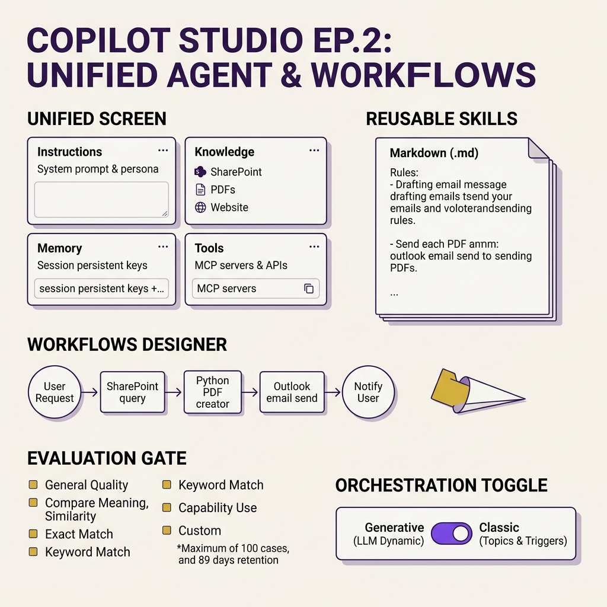
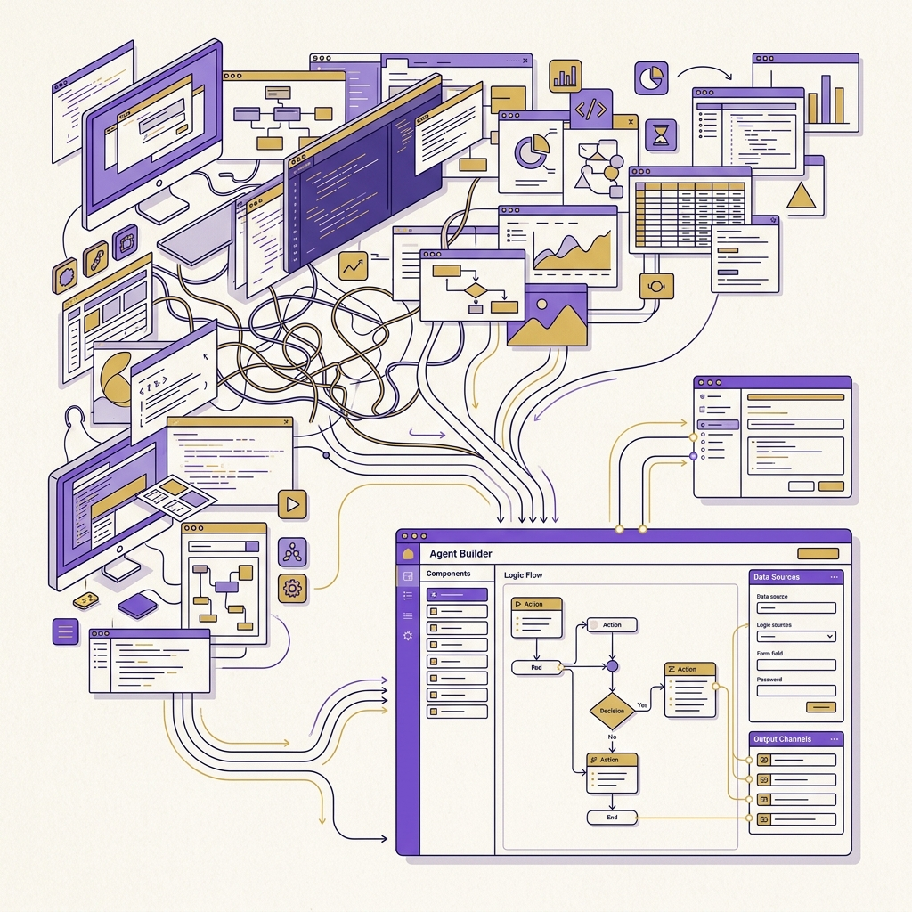
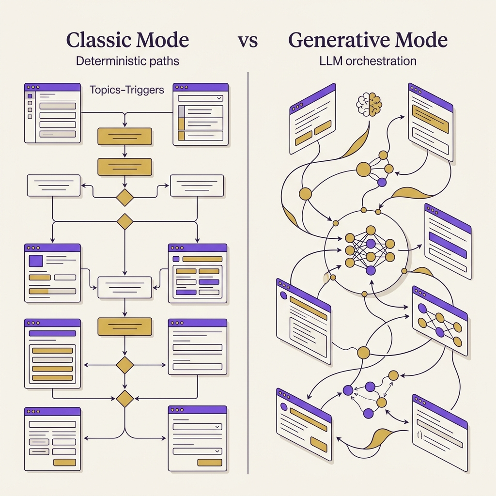

<!-- _class: title -->

# Copilot Studio EP.2

Unified Screen · Skills .md · Workflows Designer · Eval Tab · Classic Toggle

<!-- Speaker: EP.2 focuses on the practitioner UI — what you see and do in the new Copilot Studio day-to-day. Companion to EP.1 (architecture rebuild). -->

---

<!-- _class: cheatsheet -->
<!-- _backgroundColor: #f8f7f4 -->

<!-- Speaker: Full-deck reference — four zones: Unified Screen, Skills, Workflows, Eval + Classic toggle. Point at each before advancing. -->

---

## TL;DR: 5 Changes in the New Builder UI

EP.1 = platform rebuild; EP.2 = what practitioners see and do in the new UI

  

    
Unified Screen

    <h3>Instructions + Knowledge + Memory + Tools</h3>
    
Canvas เดียว — เห็น full capability ของ agent ทันที ไม่ต้องเปิดหลาย tab

  

  

    
Skills

    <h3>.md files — shareable across agents</h3>
    
สร้างจาก prompt; แทน Topics; orchestrator เรียกตาม context ไม่ใช่ keyword

  

  

    
Workflows Designer

    <h3>SharePoint → Python PDF → Outlook</h3>
    
Visual canvas ต่อ API end-to-end — ไม่ต้องออกไป Power Automate

  

  

    
Eval Tab (GA March 2026)

    <h3>7 methods · 100 cases · 89-day retention</h3>
    
AI-generate test cases หรือ import CSV; set-level grading

  

<b>★ Takeaway:</b> Unified Screen + Skills + Workflows + Eval = toolkit ครบสำหรับ enterprise agent ที่ซับซ้อน

<!-- Speaker: Fifth change is Classic toggle — covered in its own slide. These four are the daily UI changes practitioners will feel immediately. -->

---

## One Screen Replaces Many Menus

Before: scattered tabs. Now: single canvas with full agent visibility.

<svg viewBox="0 0 700 280" width="100%" xmlns="http://www.w3.org/2000/svg">
  <text x="145" y="22" font-size="13" font-weight="700" fill="var(--muted)" text-anchor="middle" font-family="system-ui">Classic: Scattered</text>
  <rect x="20" y="38" width="118" height="48" rx="8" fill="var(--soft-2)" stroke="var(--muted)" stroke-width="1.5"/>
  <text x="79" y="67" font-size="12" fill="var(--ink-dim)" text-anchor="middle" font-family="system-ui">Topics menu</text>
  <rect x="20" y="100" width="118" height="48" rx="8" fill="var(--soft-2)" stroke="var(--muted)" stroke-width="1.5"/>
  <text x="79" y="129" font-size="12" fill="var(--ink-dim)" text-anchor="middle" font-family="system-ui">Variables tab</text>
  <rect x="20" y="162" width="118" height="48" rx="8" fill="var(--soft-2)" stroke="var(--muted)" stroke-width="1.5"/>
  <text x="79" y="191" font-size="12" fill="var(--ink-dim)" text-anchor="middle" font-family="system-ui">Actions panel</text>
  <rect x="154" y="38" width="118" height="48" rx="8" fill="var(--soft-2)" stroke="var(--muted)" stroke-width="1.5"/>
  <text x="213" y="67" font-size="12" fill="var(--ink-dim)" text-anchor="middle" font-family="system-ui">Knowledge src</text>
  <defs><marker id="bga" markerWidth="8" markerHeight="8" refX="8" refY="4" orient="auto"><path d="M0,0 L8,4 L0,8 Z" fill="var(--accent)"/></marker></defs>
  <path d="M 300 130 L 360 130" stroke="var(--accent)" stroke-width="2.5" marker-end="url(#bga)"/>
  <rect x="378" y="28" width="298" height="224" rx="12" fill="var(--paper)" stroke="var(--accent)" stroke-width="2" style="filter:drop-shadow(0 4px 12px rgba(124,58,237,.12))"/>
  <rect x="378" y="28" width="298" height="36" rx="12" fill="var(--accent)" opacity=".08"/>
  <text x="527" y="52" font-size="12" font-weight="700" fill="var(--accent)" text-anchor="middle" font-family="system-ui">Unified Canvas</text>
  <rect x="394" y="76" width="120" height="36" rx="6" fill="var(--soft)" stroke="var(--soft-2)" stroke-width="1"/>
  <text x="454" y="99" font-size="11" fill="var(--ink)" text-anchor="middle" font-family="system-ui">Instructions</text>
  <rect x="542" y="76" width="120" height="36" rx="6" fill="var(--soft)" stroke="var(--soft-2)" stroke-width="1"/>
  <text x="602" y="99" font-size="11" fill="var(--ink)" text-anchor="middle" font-family="system-ui">Knowledge</text>
  <rect x="394" y="124" width="120" height="36" rx="6" fill="var(--soft)" stroke="var(--soft-2)" stroke-width="1"/>
  <text x="454" y="147" font-size="11" fill="var(--ink)" text-anchor="middle" font-family="system-ui">Memory</text>
  <rect x="542" y="124" width="120" height="36" rx="6" fill="var(--soft)" stroke="var(--soft-2)" stroke-width="1"/>
  <text x="602" y="147" font-size="11" fill="var(--ink)" text-anchor="middle" font-family="system-ui">Tools</text>
  <text x="527" y="216" font-size="11" fill="var(--ink-dim)" text-anchor="middle" font-family="system-ui">All visible, one canvas</text>
  <rect x="0" y="0" width="1" height="1" fill="none"/>
</svg>

<b>★ Takeaway:</b> Canvas เดียวทำให้ debug agent ได้เร็วขึ้น — เห็น Instructions, Knowledge, Memory, Tools พร้อมกันทันที

<!-- Speaker: Classic Copilot Studio spread agent config across many separate menus. The unified canvas shows everything at once — dramatically faster iteration. -->

---

## Unified Screen: 4 Panels That Define Every Agent

Every agent starts from the same four-panel canvas — Instructions, Knowledge, Memory, Tools

  

    
Panel 1 — Instructions

    <h3>System Prompt + Skills</h3>
    
เขียน system prompt หรือ load Skill .md — บอก agent ว่าต้องประพฤติตัวอย่างไร ใช้ภาษาอะไร ขอบเขต task

  

  

    
Panel 2 — Knowledge

    <h3>SharePoint · PDF · Website · Dataverse</h3>
    
เชื่อม knowledge base — agent ใช้ answer คำถามและดึงข้อมูลก่อนตอบ

  

  

    
Panel 3 — Memory

    <h3>Persistent + Session Keys</h3>
    
ตั้ง memory keys — agent จำ user preferences, project context ข้ามเซสชัน ไม่ต้องถามซ้ำ

  

  

    
Panel 4 — Tools

    <h3>MCP Servers · Connectors · Flows</h3>
    
ทุก action ที่ agent ทำได้นอกเหนือจากการตอบ — call API, write data, trigger automation

  

<b>★ Takeaway:</b> Instructions = "คิด", Knowledge = "รู้", Memory = "จำ", Tools = "ทำ" — 4 panel ครอบ agent lifecycle ทั้งหมด

<!-- Speaker: The four panels map directly to the four things any agent needs: how to behave, what it knows, what it remembers, and what it can do. -->

---

## Skills Replace Topics: Prompt-Generated Markdown

สร้างครั้งเดียว แชร์ข้าม agents ได้ — orchestrator เรียกตาม context ไม่ใช่ keyword

<svg viewBox="0 0 1100 340" width="100%" xmlns="http://www.w3.org/2000/svg">
  <rect x="40" y="20" width="460" height="300" rx="12" fill="var(--paper)" stroke="var(--soft-2)" stroke-width="1.5" style="filter:drop-shadow(var(--shadow-sm))"/>
  <rect x="40" y="20" width="460" height="50" rx="12" fill="var(--soft)" opacity=".8"/>
  <text x="270" y="51" font-size="15" font-weight="700" fill="var(--ink-dim)" text-anchor="middle" font-family="system-ui">Classic: Topics + Triggers</text>
  <rect x="68" y="88" width="168" height="40" rx="8" fill="var(--soft-2)" stroke="var(--muted)" stroke-width="1"/>
  <text x="152" y="113" font-size="12" fill="var(--ink-dim)" text-anchor="middle" font-family="system-ui">keyword: "report"</text>
  <path d="M 236 108 L 276 136" stroke="var(--muted)" stroke-width="1.5" stroke-dasharray="4,3"/>
  <rect x="68" y="144" width="168" height="40" rx="8" fill="var(--soft-2)" stroke="var(--muted)" stroke-width="1"/>
  <text x="152" y="169" font-size="12" fill="var(--ink-dim)" text-anchor="middle" font-family="system-ui">keyword: "email"</text>
  <rect x="284" y="116" width="188" height="40" rx="8" fill="var(--soft-2)" stroke="var(--muted)" stroke-width="1"/>
  <text x="378" y="141" font-size="12" fill="var(--ink-dim)" text-anchor="middle" font-family="system-ui">Topic tree (fixed flow)</text>
  <text x="270" y="226" font-size="12" fill="var(--muted)" text-anchor="middle" font-family="system-ui">Fragile if user deviates from script</text>
  <text x="270" y="252" font-size="12" fill="var(--muted)" text-anchor="middle" font-family="system-ui">Cannot share across agents</text>
  <text x="270" y="278" font-size="12" fill="var(--muted)" text-anchor="middle" font-family="system-ui">Must maintain keyword list manually</text>
  <rect x="600" y="20" width="460" height="300" rx="12" fill="var(--paper)" stroke="var(--accent)" stroke-width="2" style="filter:drop-shadow(0 4px 12px rgba(124,58,237,.12))"/>
  <rect x="600" y="20" width="460" height="50" rx="12" fill="var(--accent)" opacity=".08"/>
  <text x="830" y="51" font-size="15" font-weight="700" fill="var(--accent)" text-anchor="middle" font-family="system-ui">New: Skills (.md files)</text>
  <rect x="620" y="84" width="420" height="84" rx="8" fill="var(--soft)" stroke="var(--soft-2)" stroke-width="1"/>
  <text x="640" y="108" font-size="11" fill="var(--ink-dim)" font-family="monospace">## Draft Email</text>
  <text x="640" y="128" font-size="11" fill="var(--ink-dim)" font-family="monospace">1. Ask: recipient, purpose, tone</text>
  <text x="640" y="148" font-size="11" fill="var(--ink-dim)" font-family="monospace">2. Draft in preferred language</text>
  <text x="830" y="208" font-size="12" fill="var(--ink)" text-anchor="middle" font-family="system-ui">Intent-based — no keyword trigger</text>
  <text x="830" y="234" font-size="12" fill="var(--ink)" text-anchor="middle" font-family="system-ui">Shareable across agents</text>
  <text x="830" y="260" font-size="12" fill="var(--ink)" text-anchor="middle" font-family="system-ui">Describe → Copilot Studio generates .md</text>
  <circle cx="550" cy="170" r="28" fill="var(--accent)"/>
  <text x="550" y="175" font-size="14" font-weight="700" fill="var(--paper)" text-anchor="middle" dominant-baseline="central" font-family="system-ui">VS</text>
  <rect x="0" y="0" width="1" height="1" fill="none"/>
</svg>

<b>★ Takeaway:</b> Skills เป็น .md ธรรมดา — สร้างจาก prompt ได้เลย ไม่มี lock-in กับ keyword หรือ topic tree ที่ต้อง maintain

<!-- Speaker: The key mental shift: Skills have no trigger keywords. The orchestrator decides when to invoke them based on user intent — far more robust. -->

---

## Workflows Designer: End-to-End Automation in One Canvas

Agent → SharePoint → Python PDF → Outlook → Notify — ทั้งหมดใน Copilot Studio เลย

<svg viewBox="0 0 1100 310" width="100%" xmlns="http://www.w3.org/2000/svg">
  <defs>
    <marker id="wa" markerWidth="8" markerHeight="8" refX="8" refY="4" orient="auto"><path d="M0,0 L8,4 L0,8 Z" fill="var(--accent)"/></marker>
  </defs>
  <text x="115" y="100" font-size="10" font-weight="700" fill="var(--accent)" text-anchor="middle" font-family="system-ui">STEP 1</text>
  <rect x="30" y="112" width="168" height="88" rx="12" fill="var(--paper)" stroke="var(--accent)" stroke-width="2" style="filter:drop-shadow(var(--shadow-md))"/>
  <rect x="30" y="112" width="168" height="8" rx="6" fill="var(--accent)"/>
  <text x="114" y="152" font-size="13" font-weight="700" fill="var(--ink)" text-anchor="middle" font-family="system-ui">Agent Node</text>
  <text x="114" y="172" font-size="11" fill="var(--ink-dim)" text-anchor="middle" font-family="system-ui">Receive request</text>
  <text x="114" y="190" font-size="11" fill="var(--ink-dim)" text-anchor="middle" font-family="system-ui">+ reason</text>
  <path d="M 198 156 L 228 156" stroke="var(--accent)" stroke-width="2" marker-end="url(#wa)"/>
  <text x="330" y="100" font-size="10" font-weight="700" fill="var(--success)" text-anchor="middle" font-family="system-ui">STEP 2</text>
  <rect x="238" y="112" width="184" height="88" rx="12" fill="var(--paper)" stroke="var(--success)" stroke-width="2" style="filter:drop-shadow(var(--shadow-md))"/>
  <rect x="238" y="112" width="184" height="8" rx="6" fill="var(--success)"/>
  <text x="330" y="152" font-size="13" font-weight="700" fill="var(--ink)" text-anchor="middle" font-family="system-ui">Logic Node</text>
  <text x="330" y="172" font-size="11" fill="var(--ink-dim)" text-anchor="middle" font-family="system-ui">Fetch SharePoint</text>
  <text x="330" y="190" font-size="11" fill="var(--ink-dim)" text-anchor="middle" font-family="system-ui">list / document</text>
  <path d="M 422 156 L 452 156" stroke="var(--accent)" stroke-width="2" marker-end="url(#wa)"/>
  <text x="554" y="100" font-size="10" font-weight="700" fill="var(--gold)" text-anchor="middle" font-family="system-ui">STEP 3</text>
  <rect x="462" y="112" width="184" height="88" rx="12" fill="var(--paper)" stroke="var(--gold)" stroke-width="2" style="filter:drop-shadow(var(--shadow-md))"/>
  <rect x="462" y="112" width="184" height="8" rx="6" fill="var(--gold)"/>
  <text x="554" y="152" font-size="13" font-weight="700" fill="var(--ink)" text-anchor="middle" font-family="system-ui">Code Node</text>
  <text x="554" y="172" font-size="11" fill="var(--ink-dim)" text-anchor="middle" font-family="system-ui">Python: generate</text>
  <text x="554" y="190" font-size="11" fill="var(--ink-dim)" text-anchor="middle" font-family="system-ui">PDF report</text>
  <path d="M 646 156 L 676 156" stroke="var(--accent)" stroke-width="2" marker-end="url(#wa)"/>
  <text x="778" y="100" font-size="10" font-weight="700" fill="var(--warning)" text-anchor="middle" font-family="system-ui">STEP 4</text>
  <rect x="686" y="112" width="184" height="88" rx="12" fill="var(--paper)" stroke="var(--warning)" stroke-width="2" style="filter:drop-shadow(var(--shadow-md))"/>
  <rect x="686" y="112" width="184" height="8" rx="6" fill="var(--warning)"/>
  <text x="778" y="152" font-size="13" font-weight="700" fill="var(--ink)" text-anchor="middle" font-family="system-ui">Connector</text>
  <text x="778" y="172" font-size="11" fill="var(--ink-dim)" text-anchor="middle" font-family="system-ui">Outlook: attach PDF</text>
  <text x="778" y="190" font-size="11" fill="var(--ink-dim)" text-anchor="middle" font-family="system-ui">+ send email</text>
  <path d="M 870 156 L 900 156" stroke="var(--accent)" stroke-width="2" marker-end="url(#wa)"/>
  <text x="1002" y="100" font-size="10" font-weight="700" fill="var(--accent)" text-anchor="middle" font-family="system-ui">STEP 5</text>
  <rect x="910" y="112" width="168" height="88" rx="12" fill="var(--paper)" stroke="var(--accent)" stroke-width="2" style="filter:drop-shadow(var(--shadow-md))"/>
  <rect x="910" y="112" width="168" height="8" rx="6" fill="var(--accent)"/>
  <text x="994" y="152" font-size="13" font-weight="700" fill="var(--ink)" text-anchor="middle" font-family="system-ui">Agent Node</text>
  <text x="994" y="172" font-size="11" fill="var(--ink-dim)" text-anchor="middle" font-family="system-ui">Confirm to user:</text>
  <text x="994" y="190" font-size="11" fill="var(--ink-dim)" text-anchor="middle" font-family="system-ui">"Report sent!"</text>
  <text x="550" y="272" font-size="12" fill="var(--ink-dim)" text-anchor="middle" font-family="system-ui">Each node testable independently with sample input before wiring full workflow</text>
  <rect x="0" y="0" width="1" height="1" fill="none"/>
</svg>

<b>★ Takeaway:</b> Node-level testing (test แต่ละ step ก่อน deploy ทั้ง workflow) ช่วยลด debug time ลงมาก

<!-- Speaker: The key innovation is per-node testing. You don't need to run the full workflow to verify each step — dramatically faster iteration. -->

---

## Eval Tab: 7 Methods for Measuring Agent Quality

Built-in quality gate — GA March 2026; no external tooling needed

| Method | Measures | Output |
|--------|----------|--------|
| **General quality** | Overall response quality | Score 0–100% |
| **Compare meaning** | Semantic match to expected | Score 0–100% |
| **Text similarity** | Textual similarity | Score 0–100% |
| **Exact match** | Character-exact match | Pass / Fail |
| **Keyword match** | Required keywords present | Pass / Fail |
| **Capability use** | Correct tool / knowledge invoked | Pass / Fail |
| **Custom** | User-defined criteria | Pass / Fail |

<b>★ Takeaway:</b> Score methods (0–100%) track quality trends across versions; Pass/Fail methods act as regression gates — ใช้ร่วมกันเพื่อ coverage ที่ครอบคลุม

Source: Microsoft Learn — Run evaluations and view results · 2026

<!-- Speaker: Combine score and pass/fail methods. Score for trending, pass/fail for regressions. You can mix methods in a single test set. -->

---

## Eval: 5 Ways to Create Test Cases

จาก AI-generated ไปจนถึง real-user conversations — เลือก source ที่เร็วและ representative ที่สุด

  

    
Fastest start

    <h3>Quick question set</h3>
    
AI generate 10 คำถามจาก agent description — ใช้ได้ทันที; ดีสำหรับ initial baseline

  

  

    
Most thorough

    <h3>Full question set</h3>
    
Generate จาก Knowledge source หรือ Topics — ครอบคลุมกว่า; เลือกจำนวนได้

  

  

    
Most realistic

    <h3>From test chat</h3>
    
ใช้ conversations ที่เพิ่ง test มาเป็น test cases — ground truth จากการใช้งานจริง

  

  

    
Existing data

    <h3>Import CSV / Excel</h3>
    
นำเข้า test cases ที่เตรียมไว้ — สูงสุด 100 cases per test set

  

  

    
Production signal

    <h3>From real analytics</h3>
    
ดึงจาก Themes ใน Analytics tab — test cases reflect actual user pain points

  

<b>★ Takeaway:</b> เริ่มจาก Quick question set เพื่อ baseline เร็ว; เพิ่ม analytics-based cases เมื่อ production data มีพอ

<!-- Speaker: "From real analytics" is the most valuable but requires production traffic. Start quick, graduate to analytics-driven as usage grows. -->

---

## Classic vs Generative: Build in Parallel, Not Big-Bang

Toggle ให้ทีม migrate แบบ incremental — ไม่ต้อง rewrite ทุกอย่างพร้อมกัน

<svg viewBox="0 0 700 260" width="100%" xmlns="http://www.w3.org/2000/svg">
  <rect x="20" y="30" width="290" height="200" rx="12" fill="var(--paper)" stroke="var(--muted)" stroke-width="1.5"/>
  <rect x="20" y="30" width="290" height="46" rx="12" fill="var(--soft)" opacity=".8"/>
  <text x="165" y="59" font-size="14" font-weight="700" fill="var(--ink-dim)" text-anchor="middle" font-family="system-ui">Classic Mode</text>
  <text x="165" y="104" font-size="12" fill="var(--ink-dim)" text-anchor="middle" font-family="system-ui">Topics + Triggers</text>
  <text x="165" y="128" font-size="12" fill="var(--muted)" text-anchor="middle" font-family="system-ui">Deterministic flow</text>
  <text x="165" y="152" font-size="12" fill="var(--muted)" text-anchor="middle" font-family="system-ui">Existing production bots</text>
  <text x="165" y="210" font-size="11" fill="var(--muted)" text-anchor="middle" font-family="system-ui">Settings: Generative AI → No</text>
  <line x1="354" y1="30" x2="354" y2="230" stroke="var(--soft-2)" stroke-width="1.5" stroke-dasharray="6,3"/>
  <rect x="390" y="30" width="290" height="200" rx="12" fill="var(--paper)" stroke="var(--accent)" stroke-width="2" style="filter:drop-shadow(0 4px 12px rgba(124,58,237,.1))"/>
  <rect x="390" y="30" width="290" height="46" rx="12" fill="var(--accent)" opacity=".08"/>
  <text x="535" y="59" font-size="14" font-weight="700" fill="var(--accent)" text-anchor="middle" font-family="system-ui">Generative Mode</text>
  <text x="535" y="104" font-size="12" fill="var(--ink)" text-anchor="middle" font-family="system-ui">LLM orchestrator</text>
  <text x="535" y="128" font-size="12" fill="var(--ink)" text-anchor="middle" font-family="system-ui">Intent-based tool selection</text>
  <text x="535" y="152" font-size="12" fill="var(--ink)" text-anchor="middle" font-family="system-ui">Skills + MCP + Memory</text>
  <text x="535" y="210" font-size="11" fill="var(--accent)" text-anchor="middle" font-family="system-ui">Settings: Generative AI → Yes</text>
  <rect x="0" y="0" width="1" height="1" fill="none"/>
</svg>

<b>★ Takeaway:</b> Toggle = ไม่มี big-bang migration — build Generative agents ใหม่ขณะที่ production bot เดิมยัง Classic อยู่ได้เลย

<!-- Speaker: The toggle is per-agent. Your existing bot keeps Classic; new agents use Generative. No forced migration deadline. -->

---

## User Guide: 5 Steps from New Agent to Deploy

ผ่าน Unified Screen, Skill, Workflow, Eval ครบ — สร้าง agent ที่ส่ง PDF report ทางอีเมล

<svg viewBox="0 0 1100 300" width="100%" xmlns="http://www.w3.org/2000/svg">
  <defs><marker id="ua" markerWidth="8" markerHeight="8" refX="8" refY="4" orient="auto"><path d="M0,0 L8,4 L0,8 Z" fill="var(--soft-2)"/></marker></defs>
  <circle cx="100" cy="140" r="36" fill="var(--accent)" opacity=".12"/>
  <circle cx="100" cy="140" r="28" fill="var(--accent)"/>
  <text x="100" y="145" font-size="16" font-weight="700" fill="var(--paper)" text-anchor="middle" dominant-baseline="central" font-family="system-ui">1</text>
  <text x="100" y="192" font-size="11" font-weight="700" fill="var(--accent)" text-anchor="middle" font-family="system-ui">Unified</text>
  <text x="100" y="208" font-size="11" fill="var(--ink-dim)" text-anchor="middle" font-family="system-ui">Screen</text>
  <path d="M 128 140 L 190 140" stroke="var(--soft-2)" stroke-width="2" marker-end="url(#ua)"/>
  <circle cx="238" cy="140" r="36" fill="var(--gold)" opacity=".12"/>
  <circle cx="238" cy="140" r="28" fill="var(--gold)"/>
  <text x="238" y="145" font-size="16" font-weight="700" fill="var(--paper)" text-anchor="middle" dominant-baseline="central" font-family="system-ui">2</text>
  <text x="238" y="192" font-size="11" font-weight="700" fill="var(--gold)" text-anchor="middle" font-family="system-ui">Create</text>
  <text x="238" y="208" font-size="11" fill="var(--ink-dim)" text-anchor="middle" font-family="system-ui">Skill .md</text>
  <path d="M 266 140 L 328 140" stroke="var(--soft-2)" stroke-width="2" marker-end="url(#ua)"/>
  <circle cx="376" cy="140" r="36" fill="var(--success)" opacity=".12"/>
  <circle cx="376" cy="140" r="28" fill="var(--success)"/>
  <text x="376" y="145" font-size="16" font-weight="700" fill="var(--paper)" text-anchor="middle" dominant-baseline="central" font-family="system-ui">3</text>
  <text x="376" y="192" font-size="11" font-weight="700" fill="var(--success)" text-anchor="middle" font-family="system-ui">Build</text>
  <text x="376" y="208" font-size="11" fill="var(--ink-dim)" text-anchor="middle" font-family="system-ui">Workflow</text>
  <path d="M 404 140 L 466 140" stroke="var(--soft-2)" stroke-width="2" marker-end="url(#ua)"/>
  <circle cx="514" cy="140" r="36" fill="var(--warning)" opacity=".12"/>
  <circle cx="514" cy="140" r="28" fill="var(--warning)"/>
  <text x="514" y="145" font-size="16" font-weight="700" fill="var(--paper)" text-anchor="middle" dominant-baseline="central" font-family="system-ui">4</text>
  <text x="514" y="192" font-size="11" font-weight="700" fill="var(--warning)" text-anchor="middle" font-family="system-ui">Run</text>
  <text x="514" y="208" font-size="11" fill="var(--ink-dim)" text-anchor="middle" font-family="system-ui">Eval</text>
  <path d="M 542 140 L 604 140" stroke="var(--soft-2)" stroke-width="2" marker-end="url(#ua)"/>
  <circle cx="652" cy="140" r="36" fill="var(--success)" opacity=".12"/>
  <circle cx="652" cy="140" r="28" fill="var(--success)"/>
  <text x="652" y="145" font-size="16" font-weight="700" fill="var(--paper)" text-anchor="middle" dominant-baseline="central" font-family="system-ui">5</text>
  <text x="652" y="192" font-size="11" font-weight="700" fill="var(--success)" text-anchor="middle" font-family="system-ui">Deploy</text>
  <text x="652" y="208" font-size="11" fill="var(--ink-dim)" text-anchor="middle" font-family="system-ui">+ Monitor</text>
  <rect x="730" y="56" width="344" height="188" rx="10" fill="var(--paper)" stroke="var(--soft-2)" stroke-width="1"/>
  <text x="748" y="84" font-size="12" font-weight="700" fill="var(--ink)" font-family="system-ui">Quick steps:</text>
  <text x="748" y="108" font-size="11" fill="var(--ink-dim)" font-family="system-ui">1. New Agent + Instructions, Knowledge,</text>
  <text x="748" y="126" font-size="11" fill="var(--ink-dim)" font-family="system-ui">   Outlook connector</text>
  <text x="748" y="148" font-size="11" fill="var(--ink-dim)" font-family="system-ui">2. Describe → Copilot writes .md Skill</text>
  <text x="748" y="170" font-size="11" fill="var(--ink-dim)" font-family="system-ui">3. Nodes: SharePoint, Python, Outlook</text>
  <text x="748" y="192" font-size="11" fill="var(--ink-dim)" font-family="system-ui">4. Quick question set → score → check</text>
  <text x="748" y="214" font-size="11" fill="var(--ink-dim)" font-family="system-ui">5. Preview → Publish → Monitor tab</text>
  <rect x="0" y="0" width="1" height="1" fill="none"/>
</svg>

<b>★ Takeaway:</b> Step 4 (Eval) คือขั้นตอนที่ทีม enterprise มักข้ามแต่สำคัญที่สุด — ตรวจคุณภาพก่อน deploy ทุกครั้ง

<!-- Speaker: The most commonly skipped step is evaluation. Running even 10 AI-generated test cases before deploy catches obvious regressions early. -->

---

## Caveats: Know These Before You Build

เรื่องที่ต้องรู้ก่อนเริ่ม — หลีกเลี่ยง rewrite ที่ไม่จำเป็น

  

    
No auto-migration

    <h3>Classic → Skills: rewrite required</h3>
    
Toggle ไม่แปลง Topics → Skills อัตโนมัติ — วางแผน phased migration ก่อนเริ่มสลับ production bot

  

  

    
Eval retention

    <h3>100 cases · 89-day limit</h3>
    
Test results หมดอายุ 89 วัน; max 100 cases per set — export CSV ถ้าต้องการ audit history ยาวกว่านั้น

  

  

    
Security

    <h3>AI test cases may leak sensitive data</h3>
    
Generate จาก knowledge source อาจมี sensitive data — review ก่อนแชร์ test set กับทีมทุกครั้ง

  

<b>★ Takeaway:</b> สองความเสี่ยงสูงสุด: sensitive data ใน AI-generated test cases + ไม่มี auto-migration จาก Classic — วางแผนทั้งสองก่อนเริ่ม

<!-- Speaker: The sensitive-data risk is the easiest to overlook. AI generates test cases from your knowledge source — which may contain PII or confidential data. Always review. -->

---

## Key Takeaways

5 สิ่งที่ practitioner ต้องจำจาก Copilot Studio EP.2

  

    
Unified Screen

    <h3>One canvas, full agent visibility</h3>
    
Instructions + Knowledge + Memory + Tools ใน canvas เดียว — เห็นและแก้ไข capability ทั้งหมดได้ทันที

  

  

    
Skills

    <h3>.md, prompt-generated, shareable</h3>
    
สร้างจาก natural language; แชร์ข้าม agents; แทน Topics+Triggers ที่ fragile

  

  

    
Workflows

    <h3>No Power Automate needed</h3>
    
ต่อ SharePoint, Outlook, PDF ใน visual canvas ของ Copilot Studio; test node-by-node ก่อน deploy

  

  

    
Eval + Classic

    <h3>Quality gate + safe migration path</h3>
    
Eval GA มีนาคม 2026; Classic toggle ให้ build Generative ใหม่โดยไม่ต้อง migrate production bot เดิม

  

<b>★ Takeaway:</b> Classic toggle เปิดทางให้ทุกทีมเริ่ม build Generative agent ได้เลยวันนี้ — ไม่มีเหตุผลต้องรอ migrate ทั้ง org

<!-- Speaker: Classic toggle removes the last adoption blocker. Start building new Generative agents today without touching your existing production bots. -->
