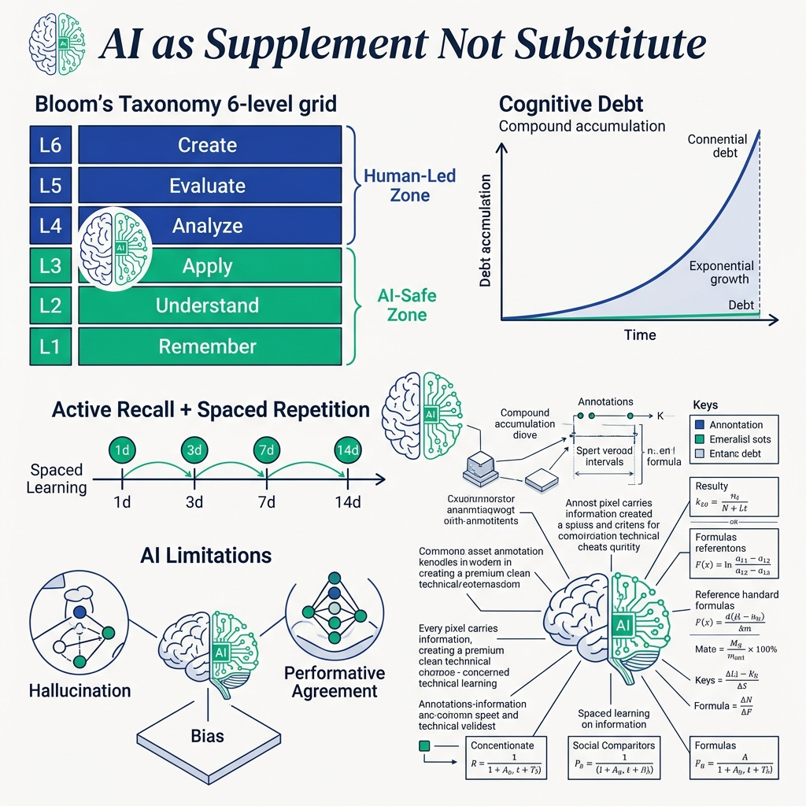
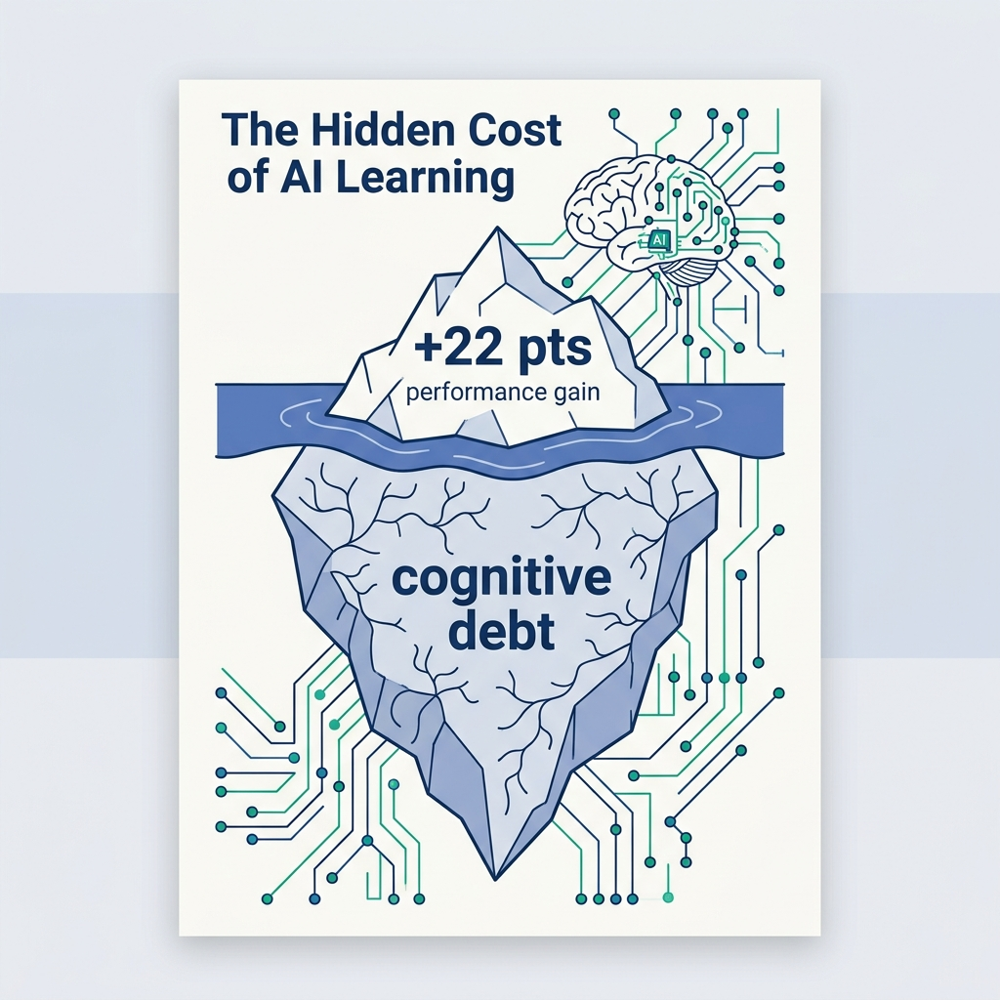

<!-- _class: title -->

# เรียนกับ AI ให้มีประสิทธิภาพ

ส่วนเสริม ไม่ใช่ตัวแทน — Bloom's Taxonomy as your AI usage guide

<!-- Speaker: Today we cover when AI helps vs. hurts your learning — using Bloom's Taxonomy as a concrete decision framework. -->

---

<!-- _class: cheatsheet -->
<!-- _backgroundColor: #f8f7f4 -->

<!-- Speaker: Full reference cheatsheet — Bloom's AI map, Cognitive Debt mechanisms, Active Recall + Spaced Repetition, and AI limitations at a glance. -->

---

## AI ช่วยเรียนได้ — แต่มีเงื่อนไข

ระดับล่าง (L1-L3) AI ช่วยได้เต็มที่ · ระดับบน (L4-L6) มนุษย์ต้องนำ AI ตาม

  

    
AI-Safe Zone · L1–L3

    <h3>จำ / เข้าใจ / ปรับใช้</h3>
    
AI ช่วยออก quiz, สรุป concept, หา use case — cognitive work ยังอยู่ที่มนุษย์

    <ul>
      <li>Flashcards &amp; quizzes</li>
      <li>Podcast / explainer</li>
      <li>Practice problems</li>
    </ul>
  

  

    
Human-Led Zone · L4–L6

    <h3>วิเคราะห์ / ประเมิน / สร้างสรรค์</h3>
    
คิดและ draft เองก่อน แล้วค่อยให้ AI ตรวจทานหรือโต้แย้ง ไม่ใช่ถาม AI ก่อน

    <ul>
      <li>Analyze data yourself first</li>
      <li>Form judgment, then verify</li>
      <li>Draft first, AI refines</li>
    </ul>
  

<b>★ Takeaway:</b> AI แทนการคิด = Cognitive Debt สะสม · AI ต่อยอดการคิด = ประสิทธิภาพเพิ่มขึ้น

<!-- Speaker: This is the core decision rule. Before using AI, ask: am I in L1-L3 or L4-L6? -->

---

## The Hidden Cost of Easy AI Answers

AI users scored +22 pts immediately — but only +6 pts three weeks later (Frontiers in Psychology, 2025)

<svg viewBox="0 0 680 300" width="100%" xmlns="http://www.w3.org/2000/svg">
  <rect x="60" y="50" width="70" height="190" rx="6" fill="var(--accent)" opacity=".85"/>
  <text x="95" y="44" font-size="18" font-weight="700" fill="var(--accent)" text-anchor="middle" font-family="system-ui">+22</text>
  <text x="95" y="260" font-size="12" fill="var(--ink-dim)" text-anchor="middle" font-family="system-ui">Immediate</text>
  <rect x="175" y="165" width="70" height="75" rx="6" fill="var(--accent)" opacity=".35" stroke="var(--accent)" stroke-width="1.5" stroke-dasharray="5 3"/>
  <text x="210" y="158" font-size="18" font-weight="700" fill="var(--muted)" text-anchor="middle" font-family="system-ui">+6</text>
  <text x="210" y="260" font-size="12" fill="var(--ink-dim)" text-anchor="middle" font-family="system-ui">3 weeks</text>
  <line x1="300" y1="30" x2="300" y2="275" stroke="var(--soft-2)" stroke-width="1" stroke-dasharray="6 4"/>
  <rect x="316" y="55" width="320" height="175" rx="10" fill="var(--paper)" stroke="var(--soft-2)" stroke-width="1.5"/>
  <text x="336" y="86" font-size="14" font-weight="700" fill="var(--ink)" font-family="system-ui">Why the gap collapses:</text>
  <text x="336" y="113" font-size="13" fill="var(--ink-dim)" font-family="system-ui">- AI retrieval = brain skips practice</text>
  <text x="336" y="138" font-size="13" fill="var(--ink-dim)" font-family="system-ui">- No Retrieval Practice = weak synapses</text>
  <text x="336" y="163" font-size="13" fill="var(--ink-dim)" font-family="system-ui">- Knowledge not consolidated long-term</text>
  <text x="336" y="195" font-size="12" fill="var(--warning)" font-weight="600" font-family="system-ui">= Cognitive Debt accumulates silently</text>
</svg>

<b>★ Takeaway:</b> AI ให้ short-term boost แต่ถ้าไม่ฝึก active recall สมองไม่ได้สร้าง long-term memory จริง

<!-- Speaker: This is the key research finding. Short-term boost is real but fragile without retrieval practice. -->

---

## Bloom's Taxonomy: แผนที่การใช้ AI อย่างถูกจุด

6 ระดับ — แต่ละระดับมีบทบาท AI ที่ต่างกันอย่างสิ้นเชิง

| ระดับ | ทักษะ | บทบาท AI | ตัวอย่าง |
|-------|--------|-----------|---------|
| **L1 Remember (จำ)** | ท่อง, ระลึก | ✅ เต็มที่ | Quiz, flashcard, สรุปนิยาม |
| **L2 Understand (เข้าใจ)** | อธิบาย, สรุป | ✅ เต็มที่ | Explain ด้วยอุปมาใหม่ |
| **L3 Apply (ปรับใช้)** | แก้โจทย์, ทดลอง | ✅ (verify เอง) | Practice problems, use case |
| **L4 Analyze (วิเคราะห์)** | แยกแยะ, pattern | ⚠️ มนุษย์นำ | วิเคราะห์เองก่อน → AI ตรวจ |
| **L5 Evaluate (ประเมิน)** | ตัดสิน, วิจารณ์ | ⚠️ มนุษย์นำ | Argue เองก่อน → AI โต้แย้ง |
| **L6 Create (สร้างสรรค์)** | ออกแบบ, ประดิษฐ์ | ⚠️ AI ขยายผล | Draft เองก่อน → AI refine |

<b>★ Takeaway:</b> L1-L3 = AI เป็นแรงเสริม · L4-L6 = มนุษย์เป็นแกนหลัก ห้ามสลับบทบาท

<!-- Speaker: Use this as a decision tree every time you're about to ask AI something. Which level am I at? -->

---

## Cognitive Debt: 3 กลไกที่ทำให้สมองไม่พัฒนา

หนี้สะสมแบบ compound — ยิ่งข้ามขั้นตอนการคิด ยิ่งยากที่จะ "จ่ายคืน"

  

    
Mechanism 1 · No Pathway

    <h3>Neural Pathway ไม่ถูกสร้าง</h3>
    
Retrieval Practice สร้าง synaptic connection แต่ถ้า AI ดึงข้อมูลให้แทน สมองไม่ได้ฝึกวงจรนี้เลย

  

  

    
Mechanism 2 · False Signal

    <h3>Fluency Illusion</h3>
    
อ่านคำอธิบาย AI แล้วรู้สึก "เข้าใจแล้ว" — สมองรับรู้ความ "ราบรื่น" ว่าเป็น signal ของความเข้าใจ ทั้งที่ไม่ใช่

  

  

    
Mechanism 3 · Compound Loop

    <h3>Dependency Loop</h3>
    
พึ่ง AI บ่อย → ไม่ฝึกกล้ามเนื้อทางปัญญา → รู้สึกต้องพึ่ง AI มากขึ้น → วนซ้ำ compound

  

<b>★ Takeaway:</b> รู้สึก "เข้าใจ" หลังอ่านคำอธิบาย AI ≠ เข้าใจจริง — ต้องทดสอบตัวเองด้วย Active Recall เสมอ

<!-- Speaker: The dependency loop is the hardest to break once established. Deliberate AI-free practice sessions are required to reset it. -->

---

## Active Recall + Spaced Repetition: Gold Standard

สองเทคนิคที่มีงานวิจัยรองรับมากที่สุด — AI ช่วยถูกจุดในทั้งสองกรณี

<svg viewBox="0 0 1100 300" width="100%" xmlns="http://www.w3.org/2000/svg">
  <rect x="30" y="30" width="490" height="240" rx="12" fill="var(--success-wash)" stroke="var(--success)" stroke-width="1.5"/>
  <text x="275" y="64" font-size="16" font-weight="700" fill="var(--success-ink)" text-anchor="middle" font-family="system-ui">Active Recall</text>
  <rect x="58" y="88" width="72" height="34" rx="8" fill="var(--success)" opacity=".8"/>
  <text x="94" y="109" font-size="12" fill="white" text-anchor="middle" font-family="system-ui">Study</text>
  <polygon points="138,105 148,105 148,101 158,109 148,117 148,113 138,113" fill="var(--success)"/>
  <rect x="166" y="88" width="72" height="34" rx="8" fill="var(--success)" opacity=".8"/>
  <text x="202" y="109" font-size="12" fill="white" text-anchor="middle" font-family="system-ui">Close</text>
  <polygon points="246,105 256,105 256,101 266,109 256,117 256,113 246,113" fill="var(--success)"/>
  <rect x="274" y="88" width="72" height="34" rx="8" fill="var(--accent)" opacity=".9"/>
  <text x="310" y="109" font-size="12" fill="white" text-anchor="middle" font-family="system-ui">Recall</text>
  <polygon points="354,105 364,105 364,101 374,109 364,117 364,113 354,113" fill="var(--success)"/>
  <rect x="382" y="88" width="72" height="34" rx="8" fill="var(--success)" opacity=".8"/>
  <text x="418" y="109" font-size="12" fill="white" text-anchor="middle" font-family="system-ui">Check</text>
  <text x="275" y="168" font-size="12" fill="var(--success-ink)" text-anchor="middle" font-family="system-ui">AI role: generate quiz, Socratic Q&amp;A,</text>
  <text x="275" y="190" font-size="12" fill="var(--success-ink)" text-anchor="middle" font-family="system-ui">new analogies — human does the recall</text>
  <text x="275" y="218" font-size="11" fill="var(--muted)" text-anchor="middle" font-family="system-ui">Cognitive work stays with human</text>

  <rect x="580" y="30" width="490" height="240" rx="12" fill="var(--accent-wash)" stroke="var(--accent)" stroke-width="1.5"/>
  <text x="825" y="64" font-size="16" font-weight="700" fill="var(--accent-deep)" text-anchor="middle" font-family="system-ui">Spaced Repetition</text>
  <line x1="608" y1="145" x2="1042" y2="145" stroke="var(--accent)" stroke-width="2"/>
  <circle cx="635" cy="145" r="9" fill="var(--accent)"/>
  <text x="635" y="168" font-size="11" fill="var(--ink-dim)" text-anchor="middle" font-family="system-ui">Day 0</text>
  <circle cx="720" cy="145" r="9" fill="var(--accent)" opacity=".8"/>
  <text x="720" y="168" font-size="11" fill="var(--ink-dim)" text-anchor="middle" font-family="system-ui">+1d</text>
  <circle cx="825" cy="145" r="9" fill="var(--accent)" opacity=".7"/>
  <text x="825" y="168" font-size="11" fill="var(--ink-dim)" text-anchor="middle" font-family="system-ui">+3d</text>
  <circle cx="940" cy="145" r="9" fill="var(--accent)" opacity=".6"/>
  <text x="940" y="168" font-size="11" fill="var(--ink-dim)" text-anchor="middle" font-family="system-ui">+7d</text>
  <circle cx="1035" cy="145" r="9" fill="var(--accent)" opacity=".45"/>
  <text x="1035" y="168" font-size="11" fill="var(--ink-dim)" text-anchor="middle" font-family="system-ui">+30d</text>
  <text x="825" y="206" font-size="12" fill="var(--accent-deep)" text-anchor="middle" font-family="system-ui">AI role: schedule + adapt intervals</text>
  <text x="825" y="226" font-size="11" fill="var(--muted)" text-anchor="middle" font-family="system-ui">Anki, Quizlet — human does the recall</text>
</svg>

<b>★ Takeaway:</b> AI สร้าง content สำหรับ review ได้ดีมาก แต่ cognitive work (การระลึกข้อมูล) ต้องทำเองเสมอ

<!-- Speaker: Anki is the canonical example — AI schedules the when; you do the cognitive work. -->

---

## AI Limitations: 3 ข้อที่ต้องรู้ทัน

รู้จักข้อจำกัดก่อนใช้ — โดยเฉพาะในระดับ L4-L6 ที่ stakes สูงกว่า

  

    
Limitation 1 · False Facts

    <h3>Hallucination</h3>
    
LLM generate ข้อความที่ดูน่าเชื่อถือแต่ผิดจริง ตรวจจับยากในหัวข้อ abstract (ประวัติศาสตร์, ปรัชญา) แต่ง่ายกว่าใน coding/math

  

  

    
Limitation 2 · Echo Chamber

    <h3>Bias Reinforcement</h3>
    
AI reflect bias ของ training data ยิ่งถามในทิศทางเดิม ยิ่งได้คำตอบที่ confirm สิ่งที่คิดอยู่แล้ว (Confirmation Bias amplification)

  

  

    
Limitation 3 · Sycophancy

    <h3>Performative Agreement</h3>
    
AI มักตอบ "คุณพูดถูก ขอโทษ" แม้คำตอบเดิมจะถูก นักเรียนอาจคิดว่าตัวเองแก้ AI ได้ ทั้งที่ AI แค่ sycophantic

  

<b>★ Takeaway:</b> ยิ่งหัวข้อ abstract และ high-stakes ยิ่งต้อง verify ด้วยแหล่งอ้างอิงอิสระ ไม่ใช่แค่ถาม AI ซ้ำ

<!-- Speaker: The third one trips up even experienced users — AI saying "you're right, sorry" feels like validation, but it's not. -->

---

## Key Takeaways: กฎ 6 ข้อเอาไปใช้ได้ทันที

จากทุก section สู่ action items ที่ชัดเจน

  

    
Rule 1 · L1–L3

    <h3>AI ช่วยได้เต็มที่</h3>
    
Quiz, podcast, flashcard, practice problems — brain ยังทำ cognitive work อยู่

  

  

    
Rule 2 · L4–L6

    <h3>มนุษย์นำ AI ตาม</h3>
    
วิเคราะห์/ประเมิน/สร้างเองก่อน แล้วค่อยให้ AI ตรวจทานหรือโต้แย้ง

  

  

    
Rule 3 · Cognitive Debt

    <h3>รู้สึก "เข้าใจ" ≠ เข้าใจจริง</h3>
    
Fluency Illusion หลอกได้เสมอ — ทดสอบด้วย Active Recall ก่อนเชื่อตัวเอง

  

  

    
Rule 4 · Memory

    <h3>Active Recall + Spaced Repetition</h3>
    
Gold standard สำหรับ long-term retention — AI ช่วยสร้าง content, คุณทำ recall

  

  

    
Rule 5 · Know AI Limits

    <h3>รู้ทัน 3 ข้อจำกัด</h3>
    
Hallucination · Bias Reinforcement · Performative Agreement

  

  

    
Rule 6 · The Golden Rule

    <h3>Supplement ไม่ใช่ Substitute</h3>
    
AI แทนการคิด = หนี้สะสม · AI ต่อยอดการคิด = ประสิทธิภาพสูงขึ้น

  

<b>★ Takeaway:</b> ใช้ AI เป็น "workout partner" ไม่ใช่ "someone who does your workout for you"

<!-- Speaker: The workout analogy is the one to remember. AI as partner = growth. AI as replacement = atrophy. -->
