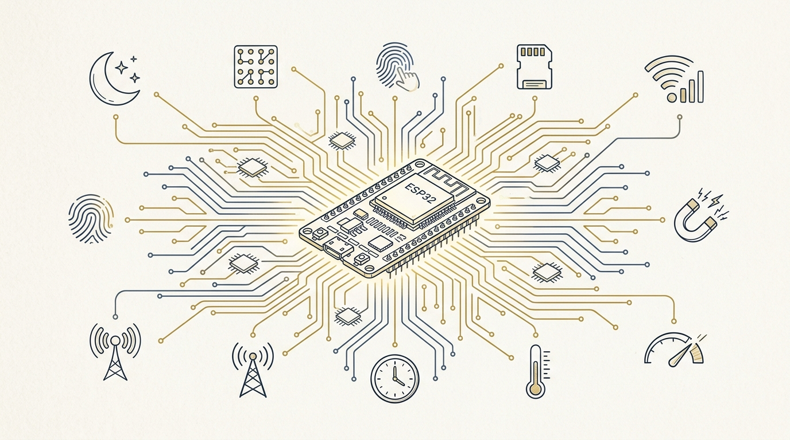
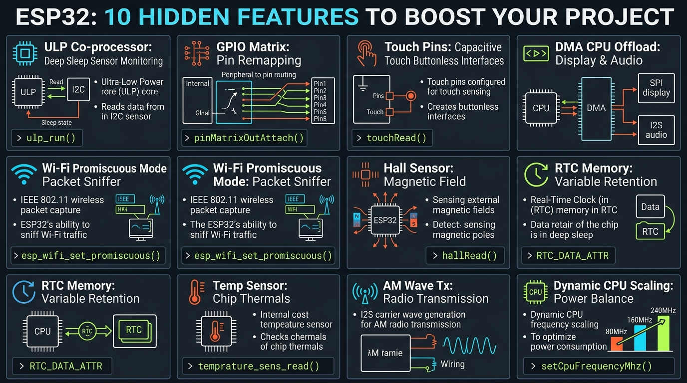
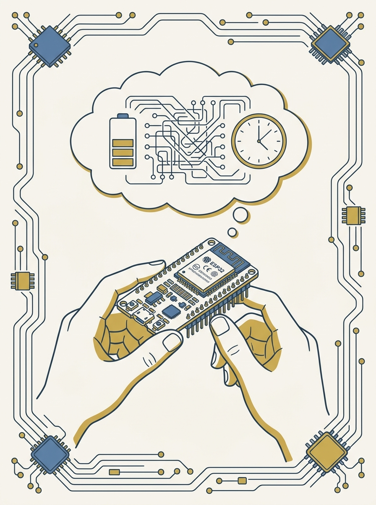

<!-- _class: title -->

# ESP32 ซ่อน 10 ฟีเจอร์ลับ

Peripheral ระดับฮาร์ดแวร์ที่ Espressif ใส่มาให้ แต่ทิวทอเรียลเริ่มต้นไม่เคยพูดถึง

<!-- Speaker: เปิดด้วยคำถาม — ใครเคยใช้ ESP32 แค่ Wi-Fi/BLE/GPIO ธรรมดา? วันนี้จะโชว์ 10 อย่างที่ชิปตัวนี้ทำได้มากกว่านั้น -->

---

<!-- _class: cheatsheet -->
<!-- _backgroundColor: #f8f7f4 -->

<!-- Speaker: ภาพรวมทั้ง 10 ฟีเจอร์ในหน้าเดียว ก่อนเจาะลึกทีละอย่าง -->

---

## TL;DR

10 peripheral ที่ซ่อนอยู่ใน ESP32 — ประหยัดแบต ลดปัญหา PCB routing ตัดปุ่มกด และทำให้จอ/เสียงลื่นขึ้น

<svg viewBox="0 0 1100 340" width="100%" xmlns="http://www.w3.org/2000/svg">
  <rect x="60" y="30" width="980" height="280" rx="16" fill="var(--paper)" stroke="var(--soft-2)" stroke-width="1.5" style="filter:drop-shadow(0 4px 12px rgba(15,23,42,.08))"/>
  <rect x="60" y="30" width="8" height="280" rx="4" fill="var(--accent)"/>
  <circle cx="150" cy="170" r="46" fill="var(--accent)" opacity=".12"/>
  <circle cx="150" cy="170" r="32" fill="var(--accent)"/>
  <text x="150" y="178" font-size="26" fill="var(--paper)" text-anchor="middle" dominant-baseline="central" font-family="system-ui" font-weight="800">10</text>
  <text x="230" y="130" font-size="19" font-weight="700" fill="var(--ink)" font-family="system-ui">ESP32 hidden peripherals</text>
  <text x="230" y="160" font-size="14" fill="var(--ink-dim)" font-family="system-ui">ULP · GPIO Matrix · Touch · DMA · Wi-Fi promiscuous</text>
  <text x="230" y="184" font-size="14" fill="var(--ink-dim)" font-family="system-ui">Hall sensor · RTC memory · Temp sensor · AM wave · DFS</text>
  <text x="230" y="220" font-size="13" fill="var(--muted)" font-family="system-ui">Zero extra hardware — all built into the chip you already have</text>
</svg>

<b>★ Takeaway:</b> ทั้ง 10 ฟีเจอร์นี้ใช้ฮาร์ดแวร์ที่มีอยู่แล้วในชิป ไม่ต้องเพิ่มชิ้นส่วนภายนอกแม้แต่ตัวเดียว

<!-- Speaker: ย้ำว่านี่ไม่ใช่ของแปลกใหม่ แต่เป็นของที่มีอยู่แล้วในชิปทุกตัว แค่ไม่มีใครสอน -->

---

## ทำไมเรื่องนี้ถึงสำคัญ

นักพัฒนาส่วนใหญ่ใช้ ESP32 แค่ผิวเผิน — Wi-Fi, sensor, ส่งค่าขึ้น cloud จบ

<svg viewBox="0 0 700 320" width="100%" xmlns="http://www.w3.org/2000/svg">
  <rect x="40" y="30" width="620" height="70" rx="10" fill="var(--soft)"/>
  <text x="60" y="72" font-size="15" fill="var(--ink)" font-family="system-ui" font-weight="700">Surface-level usage</text>
  <text x="60" y="92" font-size="12" fill="var(--ink-dim)" font-family="system-ui">Wi-Fi + BLE + sensor + cloud upload</text>
  <path d="M350 115 L350 155" stroke="var(--muted)" stroke-width="2" marker-end="url(#arrow)"/>
  <defs><marker id="arrow" markerWidth="8" markerHeight="8" refX="4" refY="4" orient="auto"><path d="M0,0 L8,4 L0,8 Z" fill="var(--muted)"/></marker></defs>
  <rect x="40" y="165" width="620" height="130" rx="10" fill="var(--accent)" opacity=".08"/>
  <text x="60" y="198" font-size="15" font-weight="700" fill="var(--accent)" font-family="system-ui">Hidden hardware peripherals</text>
  <text x="60" y="222" font-size="12" fill="var(--ink)" font-family="system-ui">ULP · GPIO Matrix · DMA · RTC memory</text>
  <text x="60" y="244" font-size="12" fill="var(--ink)" font-family="system-ui">ไม่ต้องใช้ hardware เพิ่ม แต่ต้องเข้าใจสถาปัตยกรรมชิป</text>
  <text x="60" y="270" font-size="12" fill="var(--ink-dim)" font-family="system-ui">→ แบตอยู่ได้นานขึ้น, PCB สะอาดขึ้น, จอ/เสียงลื่นขึ้น</text>
</svg>

<b>★ Takeaway:</b> ฟีเจอร์เหล่านี้ไม่ใช่ความลับ — แค่ต้องเข้าใจสถาปัตยกรรมชิปลึกกว่าทิวทอเรียลเริ่มต้น

<!-- Speaker: อธิบายว่า deep sleep ตัดโค้ดหลักทั้งหมด แต่ ULP ยังทำงานได้ - เป็นสะพานไปฟีเจอร์แรก -->

---

## ฟีเจอร์ 1-2: ประหยัดแบตและจัดการพิน

ULP co-processor เฝ้า sensor ตอนหลับ · GPIO Matrix ย้ายพินด้วยซอฟต์แวร์

  

    
Feature 1 · Power

    <h3>ULP Co-processor</h3>
    
Core เล็กแยกต่างหากใน RTC domain — ตรวจ ADC/GPIO ระหว่าง deep sleep แล้วปลุก CPU หลักเมื่อค่าถึงเกณฑ์ เหมาะกับ sensor ใช้แบต

    <code>esp_sleep_enable_ulp_wakeup()</code>
  

  

    
Feature 2 · Routing

    <h3>GPIO Matrix</h3>
    
Software wire router ภายในชิป — remap SDA/SCL/UART/PWM ไปพินไหนก็ได้ผ่านโค้ด แก้ปัญหา PCB routing โดยไม่ respin บอร์ด

    <code>Wire.begin(sda, scl)</code>
  

<b>★ Takeaway:</b> เช็ค pinout ก่อนเสมอ — พินที่ผูกกับ flash ภายในห้าม route peripheral อื่นทับ ไม่งั้นชิปบูตไม่ขึ้น

<!-- Speaker: ULP เหมาะกับ battery project; GPIO matrix แก้ routing แต่มีข้อจำกัดเรื่อง flash pins -->

---

## ฟีเจอร์ 3-4: ปุ่มสัมผัสและ DMA

Touch pins แทนปุ่มกดจริง · DMA ลดภาระ CPU สำหรับจอและเสียง

  

    
Feature 3 · Input

    <h3>Built-in Touch Pins</h3>
    
Capacitive touch ในตัวชิป วัดคาบ sawtooth wave ที่เปลี่ยนเมื่อนิ้วเข้าใกล้ — ต้อง calibrate baseline/touched เอง เพราะค่าเปลี่ยนตามวัสดุเคส

    <code>touchAttachInterrupt(T0, cb, thr)</code>
  

  

    
Feature 4 · Throughput

    <h3>DMA (Direct Memory Access)</h3>
    
ฮาร์ดแวร์ย้ายข้อมูลเองผ่าน SPI (จอ) หรือ I2S (เสียง) โดย CPU ไม่ต้องยุ่ง — ลดหน่วงบนจอ TFT/LED matrix และเสียงต่อเนื่อง

    <code>I2S_OUT_EOF interrupt</code>
  

<b>★ Takeaway:</b> ถ้าจอ/เสียงยังหน่วงหลังใช้ DMA แล้ว ให้เพิ่ม "ขนาด" buffer ไม่ใช่ "จำนวน" buffer

<!-- Speaker: touch pin ต้องวัด baseline เอง ไม่มีค่าตายตัว; DMA tip จาก Espressif forum -->

---

## ฟีเจอร์ 5-6: วิเคราะห์สัญญาณและแม่เหล็ก

Wi-Fi promiscuous mode ดูสัญญาณรอบตัว · Hall sensor วัดสนามแม่เหล็ก (เฉพาะรุ่นดั้งเดิม)

  

    
Feature 5 · RF

    <h3>Wi-Fi Promiscuous Mode</h3>
    
รับทุก 802.11 data/management frame ในช่องสัญญาณปัจจุบัน — อ่านรหัสผ่าน/ข้อความส่วนตัวไม่ได้ แต่ทำ Wi-Fi analyzer หรือ signal map ได้ดี

    <code>esp_wifi_set_promiscuous()</code>
  

  

    
Feature 6 · Legacy

    <h3>Internal Hall Sensor</h3>
    
ESP32 ดั้งเดิมมี Hall sensor ในตัว — noisy และไม่ calibrate ใช้เป็น zero-component trick ตรวจฝากล่องเปิด/ปิดได้ แต่ Espressif ถอดจากเอกสารทางการแล้ว

    <code>hallRead() — deprecated</code>
  

<b>★ Takeaway:</b> Hall sensor ใช้ได้เฉพาะ ESP32 ดั้งเดิม ไม่มีใน S2/S3/C3/H2 — ห้ามพึ่งพาความแม่นยำ

<!-- Speaker: promiscuous mode ไม่ใช่การแฮก แค่ดู metadata; hall sensor เตือนเรื่อง deprecation -->

---

## ฟีเจอร์ 7-8: จำตัวแปรและวัดความร้อน

RTC memory เก็บตัวแปรข้ามรอบ sleep · Internal temp sensor วัดความร้อนชิป

  

    
Feature 7 · Persistence

    <h3>RTC Memory</h3>
    
RTC fast memory (8kB) ไม่ถูกลบเมื่อตื่นจาก deep sleep — ลบเฉพาะตอนกด EN/reset เติม attribute เดียวก็เก็บ boot count หรือ state ข้ามรอบ sleep ได้

    <code>RTC_DATA_ATTR int bootCount;</code>
  

  

    
Feature 8 · Diagnostic

    <h3>Internal Temperature Sensor</h3>
    
ชิปดั้งเดิม: ฟังก์ชันไม่มีเอกสารทางการ ค่า offset ต่างกันทุกชิป วัด delta ได้ไม่ใช่ค่าจริง ส่วน S2/S3/C3 มี official driver ให้ใช้แทน

    <code>temperature_sensor_get_celsius()</code>
  

<b>★ Takeaway:</b> RTC_DATA_ATTR ทำให้โปรเจกต์แบตนานขึ้นแบบไม่ต้องเขียน flash ทุกรอบ — ป้องกัน flash wear ด้วย

<!-- Speaker: RTC memory แยกจาก flash ชัดเจน; temp sensor ต้องระวังเรื่อง documented vs undocumented -->

---

## ฟีเจอร์ 9-10: ทดลองวิทยุและจัดการพลังงาน

AM wave transmission ทดลองระยะสั้น · Dynamic CPU frequency scaling ปรับสมดุลพลังงาน

  

    
Feature 9 · Experiment

    <h3>AM Wave Transmission</h3>
    
ส่ง square wave carrier ผ่าน I2S ออก GPIO ตรง — วิทยุ AM/MW เก่ารับสัญญาณได้ในระยะไม่กี่เมตร ใช้เพื่อการศึกษาเท่านั้น ห้ามต่อเสาอากาศยาว

    <code>APLL sigma-delta carrier</code>
  

  

    
Feature 10 · Power

    <h3>Dynamic CPU Frequency Scaling</h3>
    
ลดความถี่ CPU ตอน idle แล้วเร่งกลับสูงสุดเมื่อมีงานหนัก — แลกกับ interrupt latency เพิ่มขึ้น 0.2-40 µs ต้อง benchmark งาน real-time ก่อนเปิดใช้

    <code>esp_pm_configure(&config)</code>
  

<b>★ Takeaway:</b> AM wave = การทดลองสอนทฤษฎีในห้องเรียน ไม่ใช่โซลูชันสื่อสารจริง — กำลังส่งระดับ microwatt เท่านั้น

<!-- Speaker: เน้นข้อจำกัดทางกฎหมายของ AM wave; DFS trade-off กับ latency -->

---

## เริ่มใช้งานจริง: 4 ขั้นตอน

จากปัญหาจริงสู่การเลือกฟีเจอร์ที่ใช่ ไม่ต้องเปิดทุกอย่างพร้อมกัน

  

    
Step 1

    <h3>ระบุ pain point</h3>
    
แบตหมดเร็ว? PCB routing ยุ่ง? เลือกฟีเจอร์ตามปัญหาจริง ไม่เปิดทุกอย่างพร้อมกัน

  

  

    
Step 2

    <h3>เช็ครุ่นชิป</h3>
    
Hall sensor และ temp sensor แบบ undocumented มีเฉพาะ ESP32 ดั้งเดิมเท่านั้น

  

  

    
Step 3

    <h3>Calibrate ค่าเอง</h3>
    
Touch pin วัด baseline/touched เอง — ไม่มีค่าตายตัวที่ใช้ได้ทุกบอร์ด

  

  

    
Step 4

    <h3>วัดผลจริง</h3>
    
ใช้ esp_timer_get_time() วัด CPU usage ก่อน/หลัง แทนการเดาว่าดีขึ้น

  

<b>★ Takeaway:</b> ถ้า GPIO Matrix remap แล้วบูตไม่ขึ้น เช็คว่าพินนั้นผูกกับ flash/PSRAM หรือไม่ก่อนอื่นใด

<!-- Speaker: ย้ำ workflow ทดลอง — ไม่ใช่ copy-paste โค้ดจากคลิปตรงๆ ต้อง calibrate ตามบอร์ดจริง -->

---

## ข้อควรระวังที่สำคัญที่สุด

3 จุดที่พลาดบ่อยที่สุดเวลาเอาฟีเจอร์เหล่านี้ไปใช้จริง

  

    
Deprecated

    <h3>Hall Sensor</h3>
    
Espressif ถอดออกจากเอกสารทางการตั้งแต่ปลายปี 2022 — ไม่มีใน ESP32-S2/S3/C3/H2 เลย

  

  

    
Legal Limit

    <h3>AM Wave Transmission</h3>
    
เสาอากาศยาวหรือส่งระยะไกลอาจผิดกฎหมายคลื่นความถี่ที่มีการควบคุม — ใช้เพื่อการศึกษาเท่านั้น

  

  

    
Boot Risk

    <h3>GPIO Matrix + Flash Pins</h3>
    
Route peripheral ไปทับพินที่ผูกกับ flash/PSRAM ภายใน ทำให้ชิปบูตไม่ขึ้นทันที

  

<b>★ Takeaway:</b> Internal temp sensor บนชิปดั้งเดิมไม่มีเอกสารรองรับ — วัด delta ได้ ไม่ใช่ค่าจริง อย่าเชื่อค่า absolute

<!-- Speaker: เหล่านี้คือจุดที่มือใหม่เจอปัญหาบ่อยที่สุดจากประสบการณ์ community forum -->

---

## Key Takeaways

สิ่งที่ต้องจำแม้อ่านแค่สไลด์นี้สไลด์เดียว

<svg viewBox="0 0 1100 340" width="100%" xmlns="http://www.w3.org/2000/svg">
  <circle cx="550" cy="170" r="160" fill="none" stroke="var(--soft-2)" stroke-width="1.5"/>
  <circle cx="550" cy="170" r="110" fill="none" stroke="var(--accent)" stroke-width="1.5" opacity=".4"/>
  <circle cx="550" cy="170" r="60" fill="var(--accent)" opacity=".1"/>
  <circle cx="550" cy="170" r="60" fill="none" stroke="var(--accent)" stroke-width="2"/>
  <text x="550" y="164" font-size="15" font-weight="700" fill="var(--accent)" text-anchor="middle" font-family="system-ui">Zero</text>
  <text x="550" y="184" font-size="13" fill="var(--ink)" text-anchor="middle" font-family="system-ui">extra parts</text>
  <text x="380" y="100" font-size="13" fill="var(--ink)" font-family="system-ui" text-anchor="middle">Power</text>
  <text x="380" y="120" font-size="12" fill="var(--muted)" font-family="system-ui" text-anchor="middle">ULP · RTC · DFS</text>
  <text x="730" y="100" font-size="13" fill="var(--ink)" font-family="system-ui" text-anchor="middle">Routing</text>
  <text x="730" y="120" font-size="12" fill="var(--muted)" font-family="system-ui" text-anchor="middle">GPIO Matrix · Touch</text>
  <text x="220" y="170" font-size="13" fill="var(--muted)" font-family="system-ui" text-anchor="middle">Throughput</text>
  <text x="220" y="190" font-size="13" fill="var(--muted)" font-family="system-ui" text-anchor="middle">DMA</text>
  <text x="880" y="170" font-size="13" fill="var(--muted)" font-family="system-ui" text-anchor="middle">Signal</text>
  <text x="880" y="190" font-size="13" fill="var(--muted)" font-family="system-ui" text-anchor="middle">Wi-Fi · Hall · AM</text>
</svg>

<b>★ Takeaway:</b> ทั้ง 10 ฟีเจอร์ใช้ฮาร์ดแวร์ที่มีอยู่แล้วในชิป — ตรวจรุ่นชิปก่อนใช้ และ calibrate ค่าด้วยตัวเองเสมอ อย่า copy ค่าจาก tutorial อื่น

<!-- Speaker: ปิดท้ายด้วยการย้ำว่าทุกฟีเจอร์ต้อง verify กับ pinout/รุ่นชิปจริงก่อนใช้ production -->
