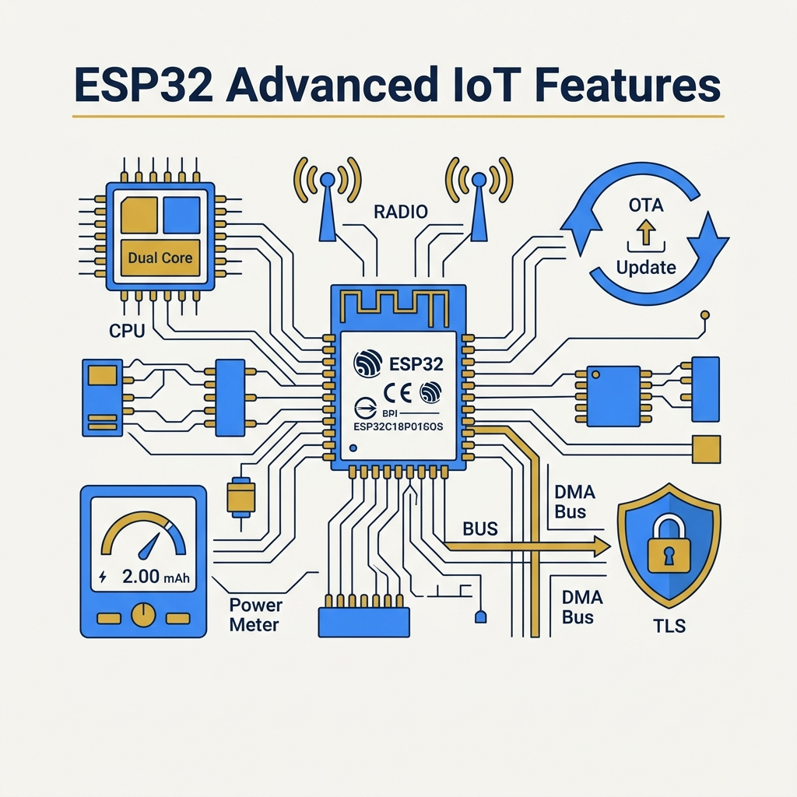
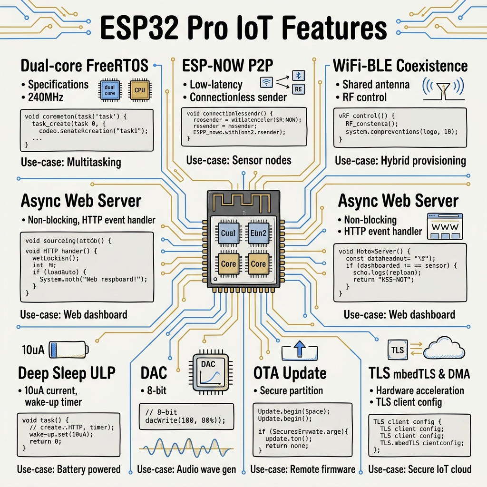
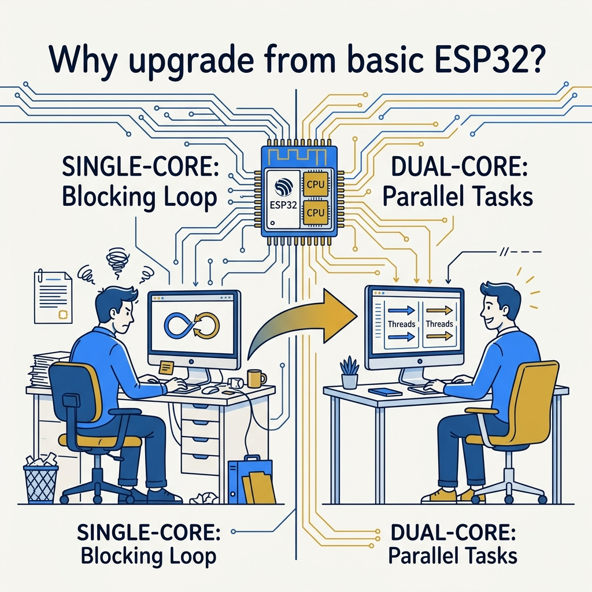

<!-- _class: title -->

# ESP32 Advanced IoT

Dual-core · ESP-NOW · Deep Sleep · OTA · TLS · DMA — production-grade features

<!-- Speaker: 9 pro features that separate hobbyist ESP32 from production IoT. Each solves a real constraint. -->

---

<!-- _class: cheatsheet -->
<!-- _backgroundColor: #f8f7f4 -->

<!-- Speaker: Full-deck cheatsheet — all 8 pro features at a glance: specs, code snippets, use cases. -->

---

## 8 Features That Make ESP32 Production-Ready

From multitasking to security — each feature addresses a real production constraint.

  

    
Concurrency

    <h3>Dual-core + FreeRTOS</h3>
    
True parallel tasks — pin WiFi to Core 0, app to Core 1

  

  

    
Wireless P2P

    <h3>ESP-NOW</h3>
    
250B payload, 400m range, no router needed

  

  

    
Radio Sharing

    <h3>WiFi + BLE Coexist</h3>
    
TDM multiplexing — both protocols on one antenna

  

  

    
Real-time Web

    <h3>Async Web Server</h3>
    
SSE + WebSocket, non-blocking, multi-connection

  

  

    
Power

    <h3>Deep Sleep + ULP</h3>
    
&lt;10 µA main CPU off; ULP reads sensors at 150 µA

  

  

    
Analog Out

    <h3>DAC</h3>
    
2× 8-bit true analog output — GPIO 25 &amp; 26

  

  

    
Maintenance

    <h3>OTA Update</h3>
    
Dual-partition, rollback-safe, wireless firmware

  

  

    
Security + Speed

    <h3>TLS + DMA</h3>
    
mbedTLS HTTPS; DMA frees CPU during I/O transfer

  

<b>★ Takeaway:</b> All 8 features are built-in — no external chips required. Pick what your project needs.

<!-- Speaker: Quick orientation. Every card = one pro feature. We'll deep-dive each in order. -->

---

## Upgrade Path: From Blocking to Parallel

Single-loop Arduino code blocks everything — Dual-core FreeRTOS runs WiFi and app logic independently.

<svg viewBox="0 0 680 280" width="100%" xmlns="http://www.w3.org/2000/svg">
  <defs>
    <marker id="a" markerWidth="7" markerHeight="7" refX="5" refY="3.5" orient="auto">
      <path d="M0,0 L7,3.5 L0,7 Z" fill="var(--accent)"/>
    </marker>
    <marker id="d" markerWidth="7" markerHeight="7" refX="5" refY="3.5" orient="auto">
      <path d="M0,0 L7,3.5 L0,7 Z" fill="var(--danger)"/>
    </marker>
  </defs>
  <!-- Single-core (top, muted) -->
  <text x="20" y="28" font-size="12" font-weight="700" fill="var(--danger)" font-family="system-ui">Single-core (blocking)</text>
  <rect x="20" y="38" width="100" height="36" rx="6" fill="var(--danger-wash)" stroke="var(--danger)" stroke-width="1.5"/>
  <text x="70" y="61" font-size="11" font-weight="700" fill="var(--danger-ink)" text-anchor="middle" font-family="system-ui">WiFi Task</text>
  <path d="M122 56 L148 56" stroke="var(--danger)" stroke-width="1.5" marker-end="url(#d)"/>
  <rect x="150" y="38" width="100" height="36" rx="6" fill="var(--danger-wash)" stroke="var(--danger)" stroke-width="1.5"/>
  <text x="200" y="61" font-size="11" font-weight="700" fill="var(--danger-ink)" text-anchor="middle" font-family="system-ui">Sensor Read</text>
  <path d="M252 56 L278 56" stroke="var(--danger)" stroke-width="1.5" marker-end="url(#d)"/>
  <rect x="280" y="38" width="100" height="36" rx="6" fill="var(--danger-wash)" stroke="var(--danger)" stroke-width="1.5"/>
  <text x="330" y="61" font-size="11" font-weight="700" fill="var(--danger-ink)" text-anchor="middle" font-family="system-ui">Display Update</text>
  <text x="400" y="61" font-size="20" fill="var(--danger)" font-family="system-ui">...</text>
  <!-- Dual-core (bottom, bright) -->
  <text x="20" y="148" font-size="12" font-weight="700" fill="var(--success-ink)" font-family="system-ui">Dual-core (parallel)</text>
  <rect x="20" y="158" width="90" height="28" rx="6" fill="var(--accent-wash)" stroke="var(--accent)" stroke-width="1.5"/>
  <text x="65" y="177" font-size="10" font-weight="700" fill="var(--accent-deep)" text-anchor="middle" font-family="system-ui">Core 0</text>
  <rect x="120" y="158" width="200" height="28" rx="6" fill="var(--accent)" opacity=".12" stroke="var(--accent)" stroke-width="1.5"/>
  <text x="220" y="177" font-size="11" font-weight="700" fill="var(--accent-deep)" text-anchor="middle" font-family="system-ui">WiFi + Network Stack</text>
  <rect x="20" y="200" width="90" height="28" rx="6" fill="var(--success-wash)" stroke="var(--success)" stroke-width="1.5"/>
  <text x="65" y="219" font-size="10" font-weight="700" fill="var(--success-ink)" text-anchor="middle" font-family="system-ui">Core 1</text>
  <rect x="120" y="200" width="200" height="28" rx="6" fill="var(--success-wash)" stroke="var(--success)" stroke-width="1.5"/>
  <text x="220" y="219" font-size="11" font-weight="700" fill="var(--success-ink)" text-anchor="middle" font-family="system-ui">App: Sensors + Display</text>
  <!-- Simultaneous arrow -->
  <path d="M335 172 L360 172" stroke="var(--accent)" stroke-width="1.5" marker-end="url(#a)"/>
  <path d="M335 214 L360 214" stroke="var(--success)" stroke-width="1.5" marker-end="url(#a)"/>
  <rect x="362" y="158" width="110" height="72" rx="8" fill="var(--paper)" stroke="var(--gold)" stroke-width="2"/>
  <text x="417" y="188" font-size="13" font-weight="800" fill="var(--gold)" text-anchor="middle" font-family="system-ui">Parallel</text>
  <text x="417" y="208" font-size="11" fill="var(--ink)" text-anchor="middle" font-family="system-ui">No blocking</text>
  <rect x="0" y="0" width="1" height="1" fill="none"/>
</svg>

<b>★ Takeaway:</b> Pin WiFi to Core 0, app logic to Core 1 — network latency never blocks sensor reading again.

<!-- Speaker: The portrait shows the developer experience improvement. SVG shows the architectural difference. -->

---

## ESP-NOW: Direct P2P — No Router Required

250-byte packets sent directly at MAC layer — 400m outdoor range, 1 Mbps, no IP stack overhead.

<svg viewBox="0 0 1100 340" width="100%" xmlns="http://www.w3.org/2000/svg">
  <defs>
    <marker id="arr" markerWidth="8" markerHeight="8" refX="6" refY="4" orient="auto">
      <path d="M0,0 L8,4 L0,8 Z" fill="var(--accent)"/>
    </marker>
    <marker id="arrM" markerWidth="8" markerHeight="8" refX="6" refY="4" orient="auto">
      <path d="M0,0 L8,4 L0,8 Z" fill="var(--muted)"/>
    </marker>
  </defs>
  <!-- ESP-NOW direct path (top) -->
  <rect x="40" y="30" width="130" height="70" rx="10" fill="var(--accent)" opacity=".12" stroke="var(--accent)" stroke-width="2"/>
  <text x="105" y="60" font-size="14" font-weight="700" fill="var(--accent-deep)" text-anchor="middle" font-family="system-ui">ESP32 A</text>
  <text x="105" y="80" font-size="11" fill="var(--muted)" text-anchor="middle" font-family="system-ui">Sender</text>
  <path d="M172 65 L340 65" stroke="var(--accent)" stroke-width="2.5" marker-end="url(#arr)" stroke-dasharray="none"/>
  <text x="256" y="54" font-size="11" font-weight="700" fill="var(--accent)" text-anchor="middle" font-family="system-ui">250 bytes · 1 Mbps</text>
  <text x="256" y="88" font-size="10" fill="var(--muted)" text-anchor="middle" font-family="system-ui">MAC layer — no IP, no broker</text>
  <rect x="342" y="30" width="130" height="70" rx="10" fill="var(--success-wash)" stroke="var(--success)" stroke-width="2"/>
  <text x="407" y="60" font-size="14" font-weight="700" fill="var(--success-ink)" text-anchor="middle" font-family="system-ui">ESP32 B</text>
  <text x="407" y="80" font-size="11" fill="var(--muted)" text-anchor="middle" font-family="system-ui">Receiver</text>
  <!-- Range indicators -->
  <rect x="520" y="20" width="540" height="140" rx="10" fill="var(--soft)" stroke="var(--soft-2)" stroke-width="1.5"/>
  <text x="790" y="48" font-size="13" font-weight="700" fill="var(--ink)" text-anchor="middle" font-family="system-ui">Range Guide</text>
  <rect x="540" y="60" width="160" height="40" rx="6" fill="var(--success-wash)" stroke="var(--success)" stroke-width="1.5"/>
  <text x="620" y="85" font-size="12" font-weight="700" fill="var(--success-ink)" text-anchor="middle" font-family="system-ui">Outdoor LOS: 400m</text>
  <rect x="720" y="60" width="160" height="40" rx="6" fill="var(--accent-wash)" stroke="var(--accent)" stroke-width="1.5"/>
  <text x="800" y="85" font-size="12" font-weight="700" fill="var(--accent-deep)" text-anchor="middle" font-family="system-ui">Through walls: 40-100m</text>
  <rect x="900" y="60" width="140" height="40" rx="6" fill="var(--warning-wash)" stroke="var(--warning)" stroke-width="1.5"/>
  <text x="970" y="85" font-size="12" font-weight="700" fill="var(--warning-ink)" text-anchor="middle" font-family="system-ui">Max peers: 20</text>
  <!-- Use cases row -->
  <text x="550" y="128" font-size="11" fill="var(--ink)" font-family="system-ui">Use: sensor mesh · remote control · local automation · no-internet zones</text>
  <!-- vs MQTT path (bottom, muted) -->
  <rect x="40" y="200" width="130" height="60" rx="10" fill="var(--soft)" stroke="var(--soft-2)" stroke-width="1.5"/>
  <text x="105" y="235" font-size="13" fill="var(--muted)" text-anchor="middle" font-family="system-ui">Device A</text>
  <path d="M172 230 L250 230" stroke="var(--muted)" stroke-width="1.5" marker-end="url(#arrM)"/>
  <rect x="252" y="200" width="130" height="60" rx="10" fill="var(--soft)" stroke="var(--soft-2)" stroke-width="1.5"/>
  <text x="317" y="228" font-size="12" fill="var(--muted)" text-anchor="middle" font-family="system-ui">Router +</text>
  <text x="317" y="248" font-size="12" fill="var(--muted)" text-anchor="middle" font-family="system-ui">MQTT Broker</text>
  <path d="M384 230 L460 230" stroke="var(--muted)" stroke-width="1.5" marker-end="url(#arrM)"/>
  <rect x="462" y="200" width="130" height="60" rx="10" fill="var(--soft)" stroke="var(--soft-2)" stroke-width="1.5"/>
  <text x="527" y="235" font-size="13" fill="var(--muted)" text-anchor="middle" font-family="system-ui">Device B</text>
  <text x="300" y="290" font-size="11" fill="var(--muted)" text-anchor="middle" font-family="system-ui">Traditional MQTT: needs router + broker + internet (3 hops)</text>
  <text x="105" y="290" font-size="11" font-weight="700" fill="var(--accent)" text-anchor="middle" font-family="system-ui">ESP-NOW: 1 hop</text>
  <rect x="0" y="0" width="1" height="1" fill="none"/>
</svg>

<b>★ Takeaway:</b> ESP-NOW cuts 3-hop MQTT to 1-hop direct MAC — works without internet, router, or cloud.

<!-- Speaker: ESP-NOW payload is limited to 250 bytes. Add encryption manually before sending if security is needed. -->

---

## WiFi + BLE Coexistence via Time-Division

ESP32 shares one 2.4GHz antenna between WiFi and BLE using microsecond-level time-slot multiplexing.

<svg viewBox="0 0 1100 320" width="100%" xmlns="http://www.w3.org/2000/svg">
  <!-- Timeline bar -->
  <text x="60" y="40" font-size="13" font-weight="700" fill="var(--ink)" font-family="system-ui">Antenna time slots (TDM)</text>
  <!-- WiFi slots -->
  <rect x="60" y="56" width="160" height="44" rx="6" fill="var(--accent)" opacity=".85"/>
  <text x="140" y="83" font-size="13" font-weight="700" fill="white" text-anchor="middle" font-family="system-ui">WiFi</text>
  <rect x="280" y="56" width="80" height="44" rx="6" fill="var(--success)" opacity=".85"/>
  <text x="320" y="83" font-size="12" font-weight="700" fill="white" text-anchor="middle" font-family="system-ui">BLE</text>
  <rect x="420" y="56" width="160" height="44" rx="6" fill="var(--accent)" opacity=".85"/>
  <text x="500" y="83" font-size="13" font-weight="700" fill="white" text-anchor="middle" font-family="system-ui">WiFi</text>
  <rect x="640" y="56" width="80" height="44" rx="6" fill="var(--success)" opacity=".85"/>
  <text x="680" y="83" font-size="12" font-weight="700" fill="white" text-anchor="middle" font-family="system-ui">BLE</text>
  <rect x="780" y="56" width="160" height="44" rx="6" fill="var(--accent)" opacity=".85"/>
  <text x="860" y="83" font-size="13" font-weight="700" fill="white" text-anchor="middle" font-family="system-ui">WiFi</text>
  <text x="970" y="83" font-size="16" fill="var(--muted)" font-family="system-ui">...</text>
  <!-- Arrow line -->
  <line x1="60" y1="115" x2="1040" y2="115" stroke="var(--muted)" stroke-width="1.5"/>
  <text x="60" y="132" font-size="11" fill="var(--muted)" font-family="system-ui">time</text>
  <!-- Coexistence modes -->
  <text x="60" y="168" font-size="13" font-weight="700" fill="var(--ink)" font-family="system-ui">Coexistence priority modes</text>
  <rect x="60" y="180" width="280" height="60" rx="8" fill="var(--accent-wash)" stroke="var(--accent)" stroke-width="1.5"/>
  <text x="200" y="207" font-size="13" font-weight="700" fill="var(--accent-deep)" text-anchor="middle" font-family="system-ui">PREFER_WIFI</text>
  <text x="200" y="228" font-size="11" fill="var(--ink-dim)" text-anchor="middle" font-family="system-ui">WiFi priority; BLE may lag</text>
  <rect x="380" y="180" width="280" height="60" rx="8" fill="var(--soft)" stroke="var(--gold)" stroke-width="2"/>
  <text x="520" y="207" font-size="13" font-weight="700" fill="var(--gold)" text-anchor="middle" font-family="system-ui">PREFER_BALANCE (default)</text>
  <text x="520" y="228" font-size="11" fill="var(--ink-dim)" text-anchor="middle" font-family="system-ui">Equal share; both work well</text>
  <rect x="700" y="180" width="280" height="60" rx="8" fill="var(--success-wash)" stroke="var(--success)" stroke-width="1.5"/>
  <text x="840" y="207" font-size="13" font-weight="700" fill="var(--success-ink)" text-anchor="middle" font-family="system-ui">PREFER_BT</text>
  <text x="840" y="228" font-size="11" fill="var(--ink-dim)" text-anchor="middle" font-family="system-ui">BLE priority; WiFi reduced</text>
  <!-- ESP-NOW note -->
  <text x="60" y="278" font-size="11" fill="var(--muted)" font-family="system-ui">ESP-NOW coexists with WiFi by using the same channel — set ESP-NOW peers to the same channel as connected AP.</text>
  <rect x="0" y="0" width="1" height="1" fill="none"/>
</svg>

<b>★ Takeaway:</b> Use PREFER_BALANCE for most projects — switch to PREFER_WIFI only when throughput matters more than BLE latency.

<!-- Speaker: Coexistence uses hardware TDM at microsecond scale — invisible to application code. Just set the preference flag once at init. -->

---

## ESPAsyncWebServer: Non-blocking Real-time Data

Handles multiple connections simultaneously — SSE pushes sensor data to browsers without polling.

<svg viewBox="0 0 1100 320" width="100%" xmlns="http://www.w3.org/2000/svg">
  <defs>
    <marker id="a2" markerWidth="7" markerHeight="7" refX="5" refY="3.5" orient="auto">
      <path d="M0,0 L7,3.5 L0,7 Z" fill="var(--accent)"/>
    </marker>
    <marker id="g2" markerWidth="7" markerHeight="7" refX="5" refY="3.5" orient="auto">
      <path d="M0,0 L7,3.5 L0,7 Z" fill="var(--success)"/>
    </marker>
    <marker id="g2r" markerWidth="7" markerHeight="7" refX="2" refY="3.5" orient="auto">
      <path d="M7,0 L0,3.5 L7,7 Z" fill="var(--success)"/>
    </marker>
  </defs>
  <!-- ESP32 server box -->
  <rect x="80" y="100" width="200" height="120" rx="12" fill="var(--accent)" opacity=".1" stroke="var(--accent)" stroke-width="2"/>
  <text x="180" y="135" font-size="14" font-weight="700" fill="var(--accent-deep)" text-anchor="middle" font-family="system-ui">ESP32</text>
  <text x="180" y="155" font-size="12" fill="var(--ink)" text-anchor="middle" font-family="system-ui">AsyncWebServer</text>
  <text x="180" y="175" font-size="11" fill="var(--muted)" text-anchor="middle" font-family="system-ui">port 80</text>
  <text x="180" y="200" font-size="11" fill="var(--accent)" text-anchor="middle" font-family="system-ui">/events (SSE)</text>
  <!-- SSE arrow to browsers -->
  <path d="M282 145 L420 100" stroke="var(--accent)" stroke-width="2" marker-end="url(#a2)"/>
  <path d="M282 160 L420 160" stroke="var(--accent)" stroke-width="2" marker-end="url(#a2)"/>
  <path d="M282 175 L420 220" stroke="var(--accent)" stroke-width="2" marker-end="url(#a2)"/>
  <text x="350" y="148" font-size="10" fill="var(--accent)" font-family="system-ui">SSE push</text>
  <!-- Browser boxes -->
  <rect x="422" y="70" width="120" height="60" rx="8" fill="var(--paper)" stroke="var(--soft-2)" stroke-width="1.5"/>
  <text x="482" y="105" font-size="12" font-weight="700" fill="var(--ink)" text-anchor="middle" font-family="system-ui">Browser 1</text>
  <rect x="422" y="130" width="120" height="60" rx="8" fill="var(--paper)" stroke="var(--soft-2)" stroke-width="1.5"/>
  <text x="482" y="165" font-size="12" font-weight="700" fill="var(--ink)" text-anchor="middle" font-family="system-ui">Browser 2</text>
  <rect x="422" y="190" width="120" height="60" rx="8" fill="var(--paper)" stroke="var(--soft-2)" stroke-width="1.5"/>
  <text x="482" y="225" font-size="12" font-weight="700" fill="var(--ink)" text-anchor="middle" font-family="system-ui">Browser 3</text>
  <!-- SSE vs WS comparison -->
  <rect x="600" y="70" width="220" height="80" rx="8" fill="var(--accent-wash)" stroke="var(--accent)" stroke-width="1.5"/>
  <text x="710" y="96" font-size="13" font-weight="700" fill="var(--accent-deep)" text-anchor="middle" font-family="system-ui">SSE (Server-Sent Events)</text>
  <text x="710" y="116" font-size="11" fill="var(--ink)" text-anchor="middle" font-family="system-ui">Server → Client only</text>
  <text x="710" y="136" font-size="11" fill="var(--muted)" text-anchor="middle" font-family="system-ui">Sensor dashboards, live feeds</text>
  <rect x="600" y="170" width="220" height="80" rx="8" fill="var(--success-wash)" stroke="var(--success)" stroke-width="1.5"/>
  <text x="710" y="196" font-size="13" font-weight="700" fill="var(--success-ink)" text-anchor="middle" font-family="system-ui">WebSocket</text>
  <path d="M680 218 L680 226" stroke="var(--success)" stroke-width="1.5" marker-end="url(#g2)"/>
  <path d="M740 224 L740 216" stroke="var(--success)" stroke-width="1.5" marker-end="url(#g2r)"/>
  <text x="710" y="244" font-size="11" fill="var(--muted)" text-anchor="middle" font-family="system-ui">Bi-directional control</text>
  <!-- CPU free note -->
  <rect x="860" y="100" width="200" height="100" rx="10" fill="var(--soft)" stroke="var(--soft-2)" stroke-width="1.5"/>
  <text x="960" y="130" font-size="13" font-weight="700" fill="var(--ink)" text-anchor="middle" font-family="system-ui">Main loop</text>
  <text x="960" y="152" font-size="12" fill="var(--success-ink)" text-anchor="middle" font-family="system-ui">still free</text>
  <text x="960" y="172" font-size="11" fill="var(--muted)" text-anchor="middle" font-family="system-ui">Async = never blocks</text>
  <rect x="0" y="0" width="1" height="1" fill="none"/>
</svg>

<b>★ Takeaway:</b> SSE for sensor dashboards (server→client); WebSocket for interactive control (bidirectional) — both non-blocking.

<!-- Speaker: The key insight: async means the server handles responses in the background while loop() continues running sensors. -->

---

## Deep Sleep + ULP: Battery Life in Years

Cut current from 240 mA to under 10 µA — ULP reads sensors while main CPU is fully off.

| Mode | Current | Wake Latency | Active Hardware |
|---|---|---|---|
| Active | 160–240 mA | — | All peripherals + CPU |
| Modem sleep | 3–20 mA | Instant | CPU on, radio off |
| Light sleep | ~0.8 mA | ~1 ms | RTC + ULP; CPU suspended |
| **Deep sleep** | **10–150 µA** | **~1–2 s** | **RTC + ULP only** |
| Hibernation | ~5 µA | ~1–2 s | RTC timer only |

**ULP Co-processor**: reads ADC, monitors GPIO, wakes main CPU when threshold met — draws ~150 µA while active.

**Practical result**: temperature monitor on 2× 18650 cells (6,000 mAh), reading every hour → estimated **~12 years** battery life.

<b>★ Takeaway:</b> Deep sleep drops to 10 µA; ULP wakes only when needed — battery-powered sensors can run years on a single charge.

<!-- Speaker: GPIO state is NOT preserved across deep sleep by default. Use RTC GPIOs if you need pin state to survive sleep cycles. -->

---

## DAC, OTA, and TLS: Three Features, One Slide

Analog output, wireless updates, and encrypted connections — all hardware-native on ESP32.

  

    
Analog Output

    <h3>DAC — GPIO 25 &amp; 26</h3>
    
2× 8-bit true analog output (0–3.3V, 256 steps). No PWM filtering needed. Use for audio tones, waveform generation, analog reference signals.

    
<strong>Caveat:</strong> ESP32 classic only — S2, S3, C3 don't have DAC hardware.

  

  

    
Wireless Firmware

    <h3>OTA Update</h3>
    
Dual-partition design: OTA_0 ↔ OTA_1. New firmware writes to inactive partition; bootloader switches on reboot. Auto-rollback if update fails.

    
<strong>Security:</strong> Sign firmware + enable anti-rollback to prevent downgrade attacks.

  

  

    
HTTPS Security

    <h3>TLS + mbedTLS</h3>
    
TLS 1.2 + 1.3 via mbedTLS. Hardware AES accelerator handles encryption without burning CPU cycles. Always verify server certificate in production.

    
<strong>mTLS:</strong> setCertificate() + setPrivateKey() for device authentication.

  

<b>★ Takeaway:</b> DAC = genuine analog; OTA = rollback-safe remote updates; TLS = hardware-accelerated HTTPS — all zero external chips.

<!-- Speaker: DAC caveat is the one most people hit — check your exact ESP32 variant before relying on DAC. S3 has no DAC. -->

---

## DMA: Peripheral to RAM Without Touching the CPU

SPI, I2S, ADC transfer data directly into memory — CPU runs other code the entire time.

<svg viewBox="0 0 1100 300" width="100%" xmlns="http://www.w3.org/2000/svg">
  <defs>
    <marker id="ad" markerWidth="8" markerHeight="8" refX="6" refY="4" orient="auto">
      <path d="M0,0 L8,4 L0,8 Z" fill="var(--accent)"/>
    </marker>
    <marker id="gd" markerWidth="8" markerHeight="8" refX="6" refY="4" orient="auto">
      <path d="M0,0 L8,4 L0,8 Z" fill="var(--success)"/>
    </marker>
  </defs>
  <!-- Peripherals column -->
  <text x="60" y="32" font-size="12" font-weight="700" fill="var(--muted)" font-family="system-ui">Peripherals</text>
  <rect x="60" y="44" width="130" height="38" rx="8" fill="var(--soft)" stroke="var(--soft-2)" stroke-width="1.5"/>
  <text x="125" y="68" font-size="12" font-weight="700" fill="var(--ink)" text-anchor="middle" font-family="system-ui">SPI (TFT display)</text>
  <rect x="60" y="96" width="130" height="38" rx="8" fill="var(--soft)" stroke="var(--soft-2)" stroke-width="1.5"/>
  <text x="125" y="120" font-size="12" font-weight="700" fill="var(--ink)" text-anchor="middle" font-family="system-ui">I2S (audio)</text>
  <rect x="60" y="148" width="130" height="38" rx="8" fill="var(--soft)" stroke="var(--soft-2)" stroke-width="1.5"/>
  <text x="125" y="172" font-size="12" font-weight="700" fill="var(--ink)" text-anchor="middle" font-family="system-ui">ADC (sampling)</text>
  <!-- DMA channel -->
  <text x="340" y="32" font-size="12" font-weight="700" fill="var(--accent)" font-family="system-ui">DMA Channel</text>
  <rect x="310" y="44" width="160" height="142" rx="10" fill="var(--accent-wash)" stroke="var(--accent)" stroke-width="2"/>
  <text x="390" y="120" font-size="13" font-weight="700" fill="var(--accent-deep)" text-anchor="middle" font-family="system-ui">DMA</text>
  <text x="390" y="140" font-size="11" fill="var(--accent)" text-anchor="middle" font-family="system-ui">Hardware engine</text>
  <text x="390" y="158" font-size="11" fill="var(--muted)" text-anchor="middle" font-family="system-ui">max 4094 B/tx</text>
  <!-- Arrows from peripherals to DMA -->
  <path d="M192 63 L308 100" stroke="var(--accent)" stroke-width="1.5" marker-end="url(#ad)"/>
  <path d="M192 115 L308 115" stroke="var(--accent)" stroke-width="1.5" marker-end="url(#ad)"/>
  <path d="M192 167 L308 130" stroke="var(--accent)" stroke-width="1.5" marker-end="url(#ad)"/>
  <!-- Arrow from DMA to RAM -->
  <path d="M472 115 L570 115" stroke="var(--success)" stroke-width="2.5" marker-end="url(#gd)"/>
  <text x="520" y="104" font-size="11" font-weight="700" fill="var(--success)" text-anchor="middle" font-family="system-ui">direct write</text>
  <!-- RAM box -->
  <rect x="572" y="60" width="160" height="110" rx="10" fill="var(--success-wash)" stroke="var(--success)" stroke-width="2"/>
  <text x="652" y="100" font-size="14" font-weight="700" fill="var(--success-ink)" text-anchor="middle" font-family="system-ui">RAM</text>
  <text x="652" y="120" font-size="11" fill="var(--ink)" text-anchor="middle" font-family="system-ui">DMA buffer</text>
  <text x="652" y="140" font-size="11" fill="var(--muted)" text-anchor="middle" font-family="system-ui">ready to read</text>
  <!-- CPU free box -->
  <rect x="800" y="44" width="240" height="142" rx="10" fill="var(--paper)" stroke="var(--gold)" stroke-width="2"/>
  <text x="920" y="88" font-size="14" font-weight="700" fill="var(--gold)" text-anchor="middle" font-family="system-ui">CPU</text>
  <text x="920" y="112" font-size="13" fill="var(--success-ink)" text-anchor="middle" font-family="system-ui">free during transfer</text>
  <text x="920" y="134" font-size="11" fill="var(--ink)" text-anchor="middle" font-family="system-ui">Runs other tasks while</text>
  <text x="920" y="152" font-size="11" fill="var(--ink)" text-anchor="middle" font-family="system-ui">DMA fills the buffer</text>
  <text x="390" y="218" font-size="12" fill="var(--ink)" text-anchor="middle" font-family="system-ui">SPI DMA boosts display refresh 5-10x vs CPU-driven transfer</text>
  <rect x="0" y="0" width="1" height="1" fill="none"/>
</svg>

<b>★ Takeaway:</b> DMA handles I/O autonomously — CPU runs full speed on other tasks during SPI, I2S, or ADC transfers.

<!-- Speaker: Max single DMA transfer is 4094 bytes on ESP32. Larger payloads need to be split into chunks. -->

---

## Putting It Together: Which Feature Solves What

Match the production constraint to the ESP32 feature that addresses it directly.

  

    
Production constraint

    <h3>Network stack blocks sensor timing</h3>
    
Dual-core FreeRTOS — pin WiFi to Core 0, app to Core 1. No more blocking.

  

  

    
Production constraint

    <h3>No router available on-site</h3>
    
ESP-NOW — direct P2P at MAC layer. 400m range, no broker, no internet required.

  

  

    
Production constraint

    <h3>Battery must last months/years</h3>
    
Deep Sleep + ULP — under 10 µA main off; ULP polls conditions and wakes only on trigger.

  

  

    
Production constraint

    <h3>Firmware needs remote updates</h3>
    
OTA dual-partition — writes to inactive slot, auto-rollback on failure. Sign + verify always.

  

  

    
Production constraint

    <h3>API calls need HTTPS security</h3>
    
TLS + mbedTLS — hardware AES; always set server certificate, never skip in production.

  

  

    
Production constraint

    <h3>SPI/I2S transfer eats CPU cycles</h3>
    
DMA — peripheral writes directly to RAM. CPU stays free. Max 4094 B per transfer chunk.

  

<b>★ Takeaway:</b> ESP32 has a built-in answer to every common IoT production constraint — pick the right feature, not a workaround.

<!-- Speaker: This constraint-to-feature mapping is the practical takeaway. Each row is a real problem + its ESP32 native solution. -->
