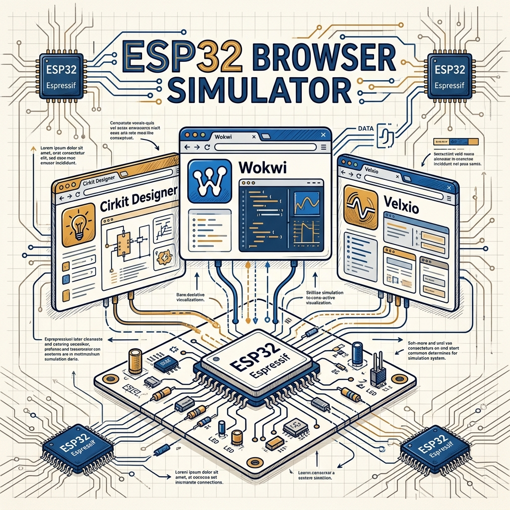
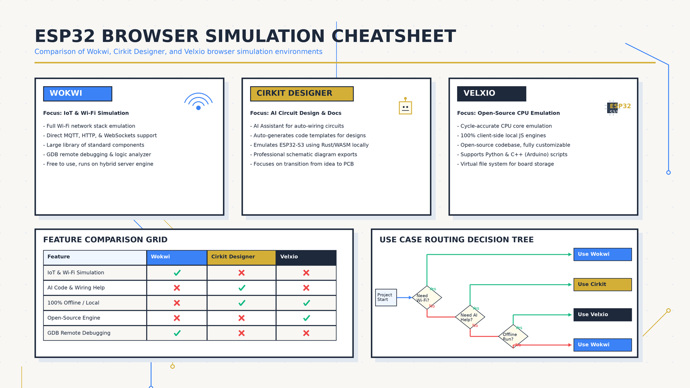
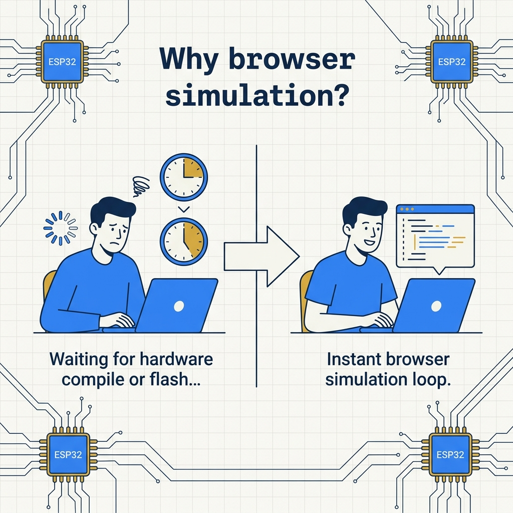

<!-- _class: title -->

# ESP32 Browser Simulation

Wokwi · Cirkit Designer · Velxio — simulate before you solder

<!-- Speaker: 3 platforms, 3 use cases. Each solves a different constraint — IoT fidelity, beginner onramp, and hardware accuracy. -->

---

<!-- _class: cheatsheet -->
<!-- _backgroundColor: #f8f7f4 -->

<!-- Speaker: Full-deck cheatsheet — 3 platforms, trade-offs, use-case routing. 60-second orientation. -->

---

## No Hardware? No Problem.

3 browser platforms cover every ESP32 dev use case — IoT, learning, and hardware accuracy.

  

    
IoT Workflow

    <h3>Wokwi</h3>
    
Full WiFi/MQTT stack simulation. VS Code integration. Production-grade IoT testing — no code changes needed.

  

  

    
AI-Assisted

    <h3>Cirkit Designer</h3>
    
AI co-pilot wires circuits and writes code from plain-language descriptions. Visual-first IDE for beginners.

  

  

    
Hardware Accurate

    <h3>Velxio</h3>
    
QEMU CPU emulation via WASM. SPICE analog solver. Open-source and offline-capable via Docker.

  

<b>★ Takeaway:</b> All three are free, browser-based, zero-install — choose by what you need to test, not by price.

<!-- Speaker: Quick orientation. Each card = one platform = one primary use case. -->

---

## From Hours to Seconds: Why Simulate?

Traditional embedded dev burns time, money, and hardware — simulation collapses the iteration loop.

<svg viewBox="0 0 700 300" width="100%" xmlns="http://www.w3.org/2000/svg">
  <defs>
    <marker id="arrowR" markerWidth="8" markerHeight="8" refX="6" refY="4" orient="auto">
      <path d="M0,0 L8,4 L0,8 Z" fill="var(--danger)"/>
    </marker>
    <marker id="arrowG" markerWidth="8" markerHeight="8" refX="6" refY="4" orient="auto">
      <path d="M0,0 L8,4 L0,8 Z" fill="var(--success)"/>
    </marker>
  </defs>
  <text x="10" y="22" font-size="12" fill="var(--danger)" font-family="system-ui" font-weight="700">Traditional loop</text>
  <rect x="10" y="30" width="120" height="44" rx="8" fill="var(--danger-wash)" stroke="var(--danger)" stroke-width="1.5"/>
  <text x="70" y="53" font-size="12" font-weight="700" fill="var(--danger-ink)" text-anchor="middle" font-family="system-ui">Order HW</text>
  <text x="70" y="68" font-size="10" fill="var(--danger)" text-anchor="middle" font-family="system-ui">days</text>
  <path d="M132 52 L150 52" stroke="var(--danger)" stroke-width="2" marker-end="url(#arrowR)"/>
  <rect x="152" y="30" width="120" height="44" rx="8" fill="var(--danger-wash)" stroke="var(--danger)" stroke-width="1.5"/>
  <text x="212" y="53" font-size="12" font-weight="700" fill="var(--danger-ink)" text-anchor="middle" font-family="system-ui">Flash + Wire</text>
  <text x="212" y="68" font-size="10" fill="var(--danger)" text-anchor="middle" font-family="system-ui">30 min</text>
  <path d="M274 52 L292 52" stroke="var(--danger)" stroke-width="2" marker-end="url(#arrowR)"/>
  <rect x="294" y="30" width="120" height="44" rx="8" fill="var(--danger-wash)" stroke="var(--danger)" stroke-width="1.5"/>
  <text x="354" y="53" font-size="12" font-weight="700" fill="var(--danger-ink)" text-anchor="middle" font-family="system-ui">Debug</text>
  <text x="354" y="68" font-size="10" fill="var(--danger)" text-anchor="middle" font-family="system-ui">hours</text>
  <text x="10" y="115" font-size="12" fill="var(--success)" font-family="system-ui" font-weight="700">Browser simulation</text>
  <rect x="10" y="122" width="120" height="44" rx="8" fill="var(--success-wash)" stroke="var(--success)" stroke-width="1.5"/>
  <text x="70" y="145" font-size="12" font-weight="700" fill="var(--success-ink)" text-anchor="middle" font-family="system-ui">Write Code</text>
  <text x="70" y="160" font-size="10" fill="var(--success)" text-anchor="middle" font-family="system-ui">instant</text>
  <path d="M132 144 L150 144" stroke="var(--success)" stroke-width="2" marker-end="url(#arrowG)"/>
  <rect x="152" y="122" width="120" height="44" rx="8" fill="var(--success-wash)" stroke="var(--success)" stroke-width="1.5"/>
  <text x="212" y="145" font-size="12" font-weight="700" fill="var(--success-ink)" text-anchor="middle" font-family="system-ui">Simulate</text>
  <text x="212" y="160" font-size="10" fill="var(--success)" text-anchor="middle" font-family="system-ui">instant</text>
  <path d="M274 144 L292 144" stroke="var(--success)" stroke-width="2" marker-end="url(#arrowG)"/>
  <rect x="294" y="122" width="120" height="44" rx="8" fill="var(--success-wash)" stroke="var(--success)" stroke-width="1.5"/>
  <text x="354" y="145" font-size="12" font-weight="700" fill="var(--success-ink)" text-anchor="middle" font-family="system-ui">Fix + Iterate</text>
  <text x="354" y="160" font-size="10" fill="var(--success)" text-anchor="middle" font-family="system-ui">seconds</text>
  <rect x="460" y="50" width="200" height="130" rx="12" fill="var(--accent-wash)" stroke="var(--accent)" stroke-width="2"/>
  <text x="560" y="98" font-size="32" font-weight="800" fill="var(--accent)" text-anchor="middle" font-family="system-ui">~100x</text>
  <text x="560" y="126" font-size="13" fill="var(--ink)" text-anchor="middle" font-family="system-ui">faster iteration</text>
  <text x="560" y="148" font-size="11" fill="var(--muted)" text-anchor="middle" font-family="system-ui">hours vs seconds</text>
  <rect x="0" y="0" width="1" height="1" fill="none"/>
</svg>

<b>★ Takeaway:</b> Browser simulation turns a multi-hour hardware debug cycle into a seconds-long code-test loop.

<!-- Speaker: Portrait image shows the emotional contrast. SVG shows the time delta numerically. -->

---

## Wokwi: Full TCP/IP Stack in the Browser

Simulates 802.11 MAC through IP/TCP/UDP to MQTT — broker code runs unchanged inside the browser.

<svg viewBox="0 0 1100 320" width="100%" xmlns="http://www.w3.org/2000/svg">
  <defs>
    <marker id="arr" markerWidth="8" markerHeight="8" refX="6" refY="4" orient="auto">
      <path d="M0,0 L8,4 L0,8 Z" fill="var(--accent)"/>
    </marker>
    <marker id="arrG" markerWidth="8" markerHeight="8" refX="6" refY="4" orient="auto">
      <path d="M0,0 L8,4 L0,8 Z" fill="var(--gold)"/>
    </marker>
  </defs>
  <rect x="30" y="60" width="155" height="200" rx="12" fill="var(--soft)" stroke="var(--soft-2)" stroke-width="1.5"/>
  <rect x="30" y="60" width="155" height="44" rx="12" fill="var(--accent)" opacity=".15"/>
  <text x="107" y="88" font-size="13" font-weight="700" fill="var(--accent)" text-anchor="middle" font-family="system-ui">802.11 MAC</text>
  <text x="107" y="130" font-size="12" fill="var(--ink)" text-anchor="middle" font-family="system-ui">Wireless sim</text>
  <text x="107" y="152" font-size="11" fill="var(--muted)" text-anchor="middle" font-family="system-ui">Layer 1-2</text>
  <path d="M187 160 L208 160" stroke="var(--accent)" stroke-width="2" marker-end="url(#arr)"/>
  <rect x="210" y="60" width="155" height="200" rx="12" fill="var(--soft)" stroke="var(--soft-2)" stroke-width="1.5"/>
  <rect x="210" y="60" width="155" height="44" rx="12" fill="var(--accent)" opacity=".15"/>
  <text x="287" y="88" font-size="13" font-weight="700" fill="var(--accent)" text-anchor="middle" font-family="system-ui">IP / TCP / UDP</text>
  <text x="287" y="130" font-size="12" fill="var(--ink)" text-anchor="middle" font-family="system-ui">Transport stack</text>
  <text x="287" y="152" font-size="11" fill="var(--muted)" text-anchor="middle" font-family="system-ui">Layer 3-4</text>
  <path d="M367 160 L388 160" stroke="var(--accent)" stroke-width="2" marker-end="url(#arr)"/>
  <rect x="390" y="60" width="155" height="200" rx="12" fill="var(--soft)" stroke="var(--soft-2)" stroke-width="1.5"/>
  <rect x="390" y="60" width="155" height="44" rx="12" fill="var(--accent)" opacity=".15"/>
  <text x="467" y="88" font-size="13" font-weight="700" fill="var(--accent)" text-anchor="middle" font-family="system-ui">DNS / HTTP</text>
  <text x="467" y="130" font-size="12" fill="var(--ink)" text-anchor="middle" font-family="system-ui">App protocols</text>
  <text x="467" y="152" font-size="11" fill="var(--muted)" text-anchor="middle" font-family="system-ui">Layer 7</text>
  <path d="M547 160 L568 160" stroke="var(--accent)" stroke-width="2" marker-end="url(#arr)"/>
  <rect x="570" y="60" width="155" height="200" rx="12" fill="var(--paper)" stroke="var(--accent)" stroke-width="2"/>
  <rect x="570" y="60" width="155" height="44" rx="12" fill="var(--accent)" opacity=".25"/>
  <text x="647" y="88" font-size="13" font-weight="700" fill="var(--accent-deep)" text-anchor="middle" font-family="system-ui">MQTT / CoAP</text>
  <text x="647" y="130" font-size="12" fill="var(--ink)" text-anchor="middle" font-family="system-ui">IoT protocols</text>
  <text x="647" y="152" font-size="11" fill="var(--accent)" text-anchor="middle" font-family="system-ui">broker-ready</text>
  <path d="M727 160 L748 160" stroke="var(--gold)" stroke-width="2" marker-end="url(#arrG)"/>
  <rect x="750" y="80" width="310" height="160" rx="12" fill="var(--paper)" stroke="var(--gold)" stroke-width="2" style="filter:drop-shadow(0 4px 12px rgba(15,23,42,.08))"/>
  <text x="905" y="130" font-size="15" font-weight="700" fill="var(--ink)" text-anchor="middle" font-family="system-ui">Private Gateway</text>
  <text x="905" y="154" font-size="12" fill="var(--muted)" text-anchor="middle" font-family="system-ui">Simulator to local network</text>
  <text x="905" y="174" font-size="12" fill="var(--muted)" text-anchor="middle" font-family="system-ui">No cloud relay</text>
  <text x="905" y="108" font-size="13" fill="var(--gold)" text-anchor="middle" font-family="system-ui">wokwi.com</text>
  <rect x="0" y="0" width="1" height="1" fill="none"/>
</svg>

<b>★ Takeaway:</b> Wokwi simulates the entire network stack — ESP32 MQTT code connects to real brokers with zero modification.

<!-- Speaker: Private Gateway routes simulator traffic directly through your machine's network — great for testing against local servers or real cloud APIs. -->

---

## Wokwi: ESP32 Peripheral Coverage

Most production IoT peripherals are fully supported. Bluetooth and ULP are the gaps to plan around.

| Peripheral | Status | Notes |
|---|---|---|
| GPIO + interrupts | Full | Edge-triggered, pull-up/down |
| UART, I2C (master), SPI | Full | Standard comm protocols |
| LEDC PWM, timers, watchdog | Full | LED control, timing |
| ADC, RNG, DMA | Full | Analog reads work |
| AES / SHA / RSA | Full | Security accelerators |
| I2S, RMT (WS2812), TWAI | Partial | Transmit-only modes |
| Bluetooth, ULP Processor | Not supported | Test on real hardware |

<b>★ Takeaway:</b> GPIO, WiFi, and standard peripherals are all covered — Bluetooth requires real hardware testing.

<!-- Speaker: The "Full" list covers ~90% of hobbyist and production IoT projects. The gaps are niche but worth knowing. -->

---

## Cirkit Designer: AI Wires Your Circuit

Describe your project in plain language — AI handles pinout, wiring, and code generation.

  

    
AI Assistant

    <h3>Cirkit AI</h3>
    
Describe your circuit in plain language. AI suggests wiring, generates Arduino/ESP32 code, and troubleshoots errors — no pinout memorization required.

  

  

    
Visual-First IDE

    <h3>Drag-Drop</h3>
    
Component library covers sensors, displays, motors, LEDs. ESP32-S3 simulation runs code with live peripheral responses in the same workspace.

  

  

    
Export & Share

    <h3>Diagram Out</h3>
    
Export circuit diagrams for documentation or presentations. WiFi workflow support: HTTP, MQTT, and IoT-style projects all in browser.

  

<b>★ Takeaway:</b> Cirkit Designer is the fastest onramp for beginners — AI eliminates the pinout lookup loop entirely.

<!-- Speaker: Cirkit AI is the unique differentiator. No other simulator offers inline code generation + circuit guidance in the same workspace. -->

---

## Velxio: Real CPU Emulation via QEMU + WASM

Each chip uses a dedicated engine — instruction-level hardware fidelity, SPICE analog co-simulation.

| Chip | Emulation Engine | Frequency |
|---|---|---|
| Arduino Uno / Nano / Mega | avr8js — cycle-accurate AVR8 | 16 MHz |
| Raspberry Pi Pico (RP2040) | rp2040js — ARM Cortex-M0+ | 133 MHz |
| ESP32 / ESP32-S3 (Xtensa) | QEMU lcgamboa via WASM | 240 MHz |
| ESP32-C3 (RISC-V RV32IMC) | QEMU libqemu-riscv32 | — |

<b>★ Takeaway:</b> QEMU compiled to WASM + SPICE analog solver — GPIO pins drive real SPICE nets; <code>analogRead()</code> reads solved node voltages, not approximations.

<!-- Speaker: avr8js and rp2040js are pure-browser. ESP32 uses QEMU inside a Docker container, so offline mode needs Docker installed. -->

---

## Platform at a Glance: Which to Pick?

Match your primary constraint to the right tool — no single platform wins every row.

| Feature | Wokwi | Cirkit Designer | Velxio |
|---|---|---|---|
| WiFi / MQTT simulation | Full stack | HTTP + MQTT | None |
| AI circuit assistance | None | Cirkit AI | None |
| CPU emulation accuracy | Simulator | Simulator | QEMU / avr8js |
| SPICE analog solver | No | No | Yes |
| Offline / self-host | No | No | Docker |
| Open source | No | No | Yes |
| VS Code extension | Yes | No | No |

<b>★ Takeaway:</b> Network testing → Wokwi. Learning + prototyping → Cirkit Designer. Analog + timing accuracy → Velxio.

<!-- Speaker: Every row maps to a real developer need. The three empty cells in the Velxio "network" column are not bugs — they're a design choice. -->

---

## Know the Limits Before You Ship

No simulator replaces hardware for RF, timing-critical paths, or real analog edge behavior.

  

    
Wokwi

    <h3>Network gaps</h3>
    
Bluetooth + ULP not supported. Free tier has simulation speed cap. Private Gateway and CI integration are paid features.

  

  

    
Cirkit Designer

    <h3>Verify AI code</h3>
    
AI-generated code needs human review before flashing real hardware. ESP32-S3 only — not all ESP32 variants. Pricing not publicly disclosed.

  

  

    
Velxio

    <h3>No network stack</h3>
    
ESP32 emulation requires Docker for offline use. No WiFi or MQTT simulation at all — not a Wokwi substitute for IoT testing.

  

<b>★ Takeaway:</b> Simulate for iteration speed — validate timing-sensitive and RF code on real hardware before production.

<!-- Speaker: The Velxio danger card is the most common misconception: "best emulation" does not mean "best for IoT." Use Wokwi for that. -->

---

## Choose by Use Case — All Three Are Free

Three tools, three strengths — browser-based and zero-install, all of them.

<svg viewBox="0 0 1100 290" width="100%" xmlns="http://www.w3.org/2000/svg">
  <rect x="30" y="20" width="310" height="250" rx="14" fill="var(--paper)" stroke="var(--accent)" stroke-width="2" style="filter:drop-shadow(0 4px 12px rgba(15,23,42,.08))"/>
  <rect x="30" y="20" width="310" height="52" rx="14" fill="var(--accent)"/>
  <text x="185" y="52" font-size="20" font-weight="800" fill="white" text-anchor="middle" font-family="system-ui">Wokwi</text>
  <text x="185" y="105" font-size="13" fill="var(--ink)" text-anchor="middle" font-family="system-ui">WiFi / MQTT / HTTP</text>
  <text x="185" y="130" font-size="13" fill="var(--muted)" text-anchor="middle" font-family="system-ui">VS Code extension</text>
  <text x="185" y="155" font-size="13" fill="var(--muted)" text-anchor="middle" font-family="system-ui">CI integration</text>
  <text x="185" y="210" font-size="13" font-weight="700" fill="var(--accent)" text-anchor="middle" font-family="system-ui">IoT workflow testing</text>
  <rect x="395" y="20" width="310" height="250" rx="14" fill="var(--paper)" stroke="var(--gold)" stroke-width="2" style="filter:drop-shadow(0 4px 12px rgba(15,23,42,.08))"/>
  <rect x="395" y="20" width="310" height="52" rx="14" fill="var(--gold)"/>
  <text x="550" y="52" font-size="20" font-weight="800" fill="white" text-anchor="middle" font-family="system-ui">Cirkit Designer</text>
  <text x="550" y="105" font-size="13" fill="var(--ink)" text-anchor="middle" font-family="system-ui">AI circuit assistant</text>
  <text x="550" y="130" font-size="13" fill="var(--muted)" text-anchor="middle" font-family="system-ui">Drag-drop visual IDE</text>
  <text x="550" y="155" font-size="13" fill="var(--muted)" text-anchor="middle" font-family="system-ui">Beginner-friendly</text>
  <text x="550" y="210" font-size="13" font-weight="700" fill="var(--warning-ink)" text-anchor="middle" font-family="system-ui">Learning + rapid prototyping</text>
  <rect x="760" y="20" width="310" height="250" rx="14" fill="var(--paper)" stroke="var(--success)" stroke-width="2" style="filter:drop-shadow(0 4px 12px rgba(15,23,42,.08))"/>
  <rect x="760" y="20" width="310" height="52" rx="14" fill="var(--success)"/>
  <text x="915" y="52" font-size="20" font-weight="800" fill="white" text-anchor="middle" font-family="system-ui">Velxio</text>
  <text x="915" y="105" font-size="13" fill="var(--ink)" text-anchor="middle" font-family="system-ui">QEMU CPU emulation</text>
  <text x="915" y="130" font-size="13" fill="var(--muted)" text-anchor="middle" font-family="system-ui">SPICE analog solver</text>
  <text x="915" y="155" font-size="13" fill="var(--muted)" text-anchor="middle" font-family="system-ui">Open-source + offline</text>
  <text x="915" y="210" font-size="13" font-weight="700" fill="var(--success-ink)" text-anchor="middle" font-family="system-ui">Analog + timing accuracy</text>
  <rect x="0" y="0" width="1" height="1" fill="none"/>
</svg>

<b>★ Takeaway:</b> Pick Wokwi for IoT, Cirkit for learning, Velxio for analog accuracy — none replaces real hardware for RF and timing edge cases.

<!-- Speaker: The routing is the takeaway. Use case determines the tool. Don't mix them up or you'll hit the limits table from the previous slide. -->
