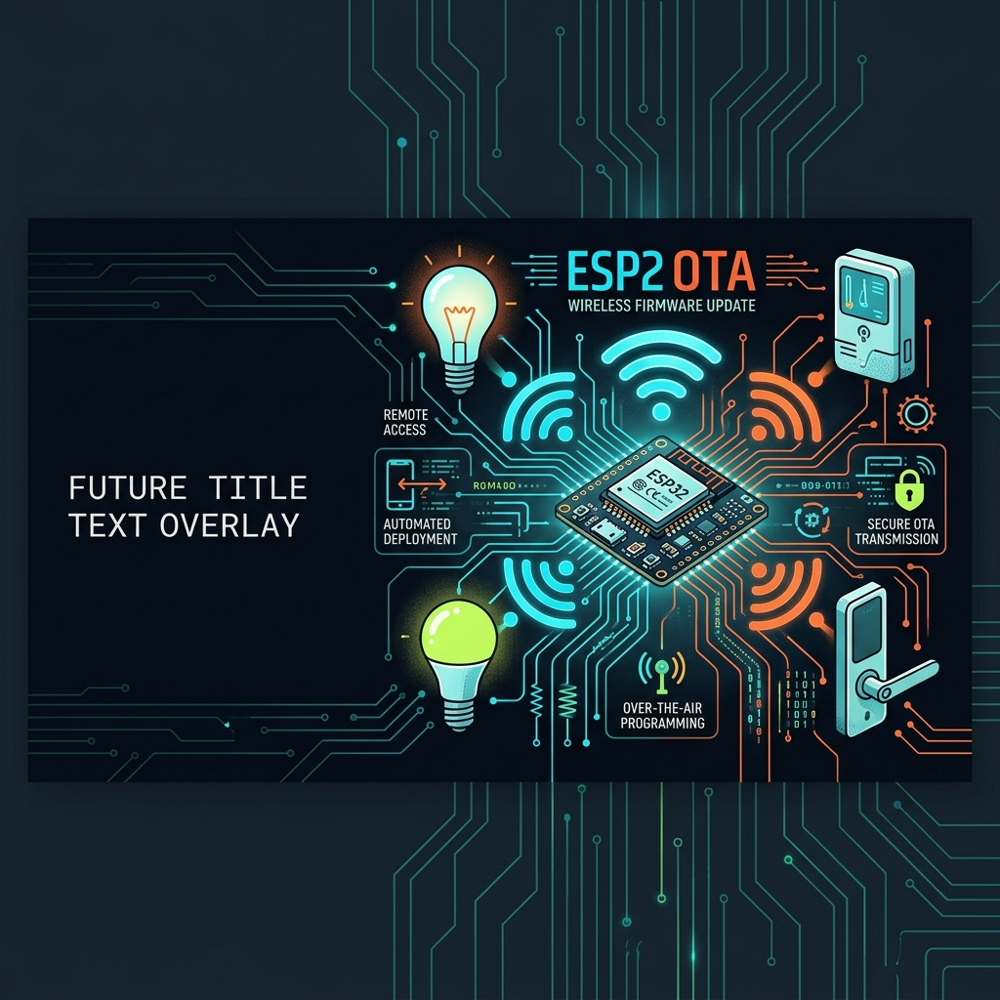
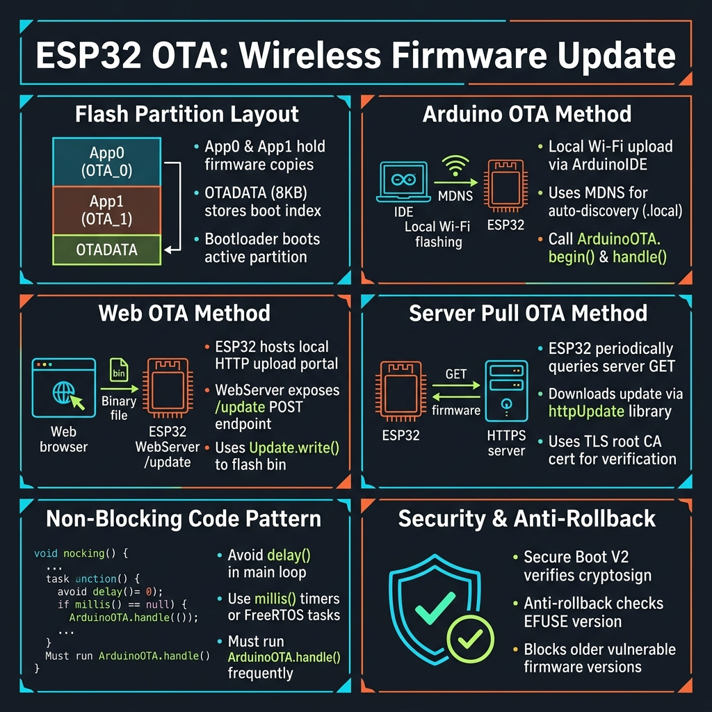
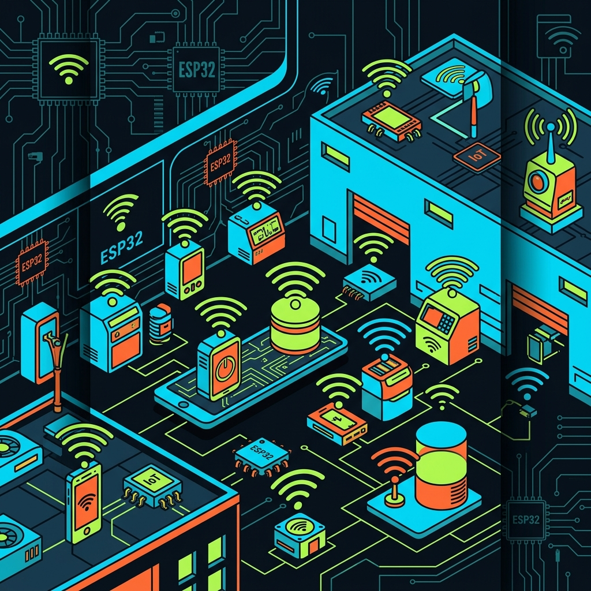

<!-- _class: title -->

# ESP32 OTA: Wireless Firmware Update

3 Methods: Arduino OTA · Web OTA · Server Pull — No USB Required

<!-- Speaker: OTA lets you update ESP32 firmware over Wi-Fi. Today: partition layout internals + 3 practical methods ranked by use case. -->

---

<!-- _class: cheatsheet -->
<!-- _backgroundColor: #f8f7f4 -->

<!-- Speaker: One-page overview — 6 panels covering partitions, all 3 methods, non-blocking pattern, and security. Use this as your reference card. -->

---

## 3 Ways to Update ESP32 Without a USB Cable

Same A/B partition engine underneath — just different delivery mechanisms.

  

    
Method 1 — Developer

    <h3>Arduino OTA</h3>
    
Upload from Arduino IDE over Wi-Fi. Board appears as a network port. First flash via USB; all subsequent via Wi-Fi.

    
Best for: dev phase iteration

  

  

    
Method 2 — Field

    <h3>Web OTA</h3>
    
ESP32 hosts a webpage. User navigates to board IP, uploads <code>.bin</code> file via browser. No IDE needed.

    
Best for: deployed devices, field updates

  

  

    
Method 3 — Fleet

    <h3>Server Pull OTA</h3>
    
Board checks server for newer version, downloads and applies automatically. Scales to hundreds of devices.

    
Best for: production IoT fleet

  

<b>★ Takeaway:</b> Choose by audience — Arduino OTA for devs, Web OTA for field, Server Pull for fleet.

<!-- Speaker: All three methods share the same flash partition mechanism. The difference is who initiates the update and how the .bin gets to the board. -->

---

## OTA Frees IoT From Physical Access

Remote bug fix and security patches after deployment — essential for production IoT.

<svg viewBox="0 0 700 300" width="100%" xmlns="http://www.w3.org/2000/svg">
  <!-- Without OTA -->
  <rect x="20" y="20" width="300" height="260" rx="12" fill="var(--danger-wash)" stroke="var(--danger)" stroke-width="1.5"/>
  <rect x="20" y="20" width="300" height="44" rx="12" fill="var(--danger)" opacity=".15"/>
  <text x="170" y="48" font-size="14" font-weight="700" fill="var(--danger-ink)" text-anchor="middle" font-family="system-ui">Without OTA</text>
  <rect x="80" y="90" width="60" height="40" rx="6" fill="var(--soft-2)" stroke="var(--muted)" stroke-width="1.5"/>
  <text x="110" y="115" font-size="11" fill="var(--ink-dim)" text-anchor="middle" font-family="system-ui">ESP32</text>
  <line x1="140" y1="110" x2="210" y2="110" stroke="var(--danger)" stroke-width="2" stroke-dasharray="none"/>
  <rect x="210" y="90" width="60" height="40" rx="6" fill="var(--soft-2)" stroke="var(--muted)" stroke-width="1.5"/>
  <text x="240" y="115" font-size="11" fill="var(--ink-dim)" text-anchor="middle" font-family="system-ui">Laptop</text>
  <text x="170" y="148" font-size="10" fill="var(--muted)" text-anchor="middle" font-family="system-ui">USB cable required</text>
  <text x="170" y="175" font-size="12" fill="var(--danger-ink)" text-anchor="middle" font-family="system-ui">Travel to each device</text>
  <text x="170" y="198" font-size="12" fill="var(--danger-ink)" text-anchor="middle" font-family="system-ui">Manual flash one-by-one</text>
  <text x="170" y="221" font-size="12" fill="var(--danger-ink)" text-anchor="middle" font-family="system-ui">No remote patch possible</text>
  <!-- With OTA -->
  <rect x="380" y="20" width="300" height="260" rx="12" fill="var(--success-wash)" stroke="var(--success)" stroke-width="1.5"/>
  <rect x="380" y="20" width="300" height="44" rx="12" fill="var(--success)" opacity=".15"/>
  <text x="530" y="48" font-size="14" font-weight="700" fill="var(--success-ink)" text-anchor="middle" font-family="system-ui">With OTA</text>
  <rect x="420" y="90" width="60" height="40" rx="6" fill="var(--soft-2)" stroke="var(--muted)" stroke-width="1.5"/>
  <text x="450" y="115" font-size="11" fill="var(--ink-dim)" text-anchor="middle" font-family="system-ui">ESP32</text>
  <path d="M480 110 Q530 80 580 110" fill="none" stroke="var(--success)" stroke-width="2"/>
  <text x="530" y="86" font-size="9" fill="var(--success-ink)" text-anchor="middle" font-family="system-ui">Wi-Fi</text>
  <rect x="570" y="90" width="60" height="40" rx="6" fill="var(--soft-2)" stroke="var(--muted)" stroke-width="1.5"/>
  <text x="600" y="115" font-size="11" fill="var(--ink-dim)" text-anchor="middle" font-family="system-ui">Server</text>
  <text x="530" y="175" font-size="12" fill="var(--success-ink)" text-anchor="middle" font-family="system-ui">Update from anywhere</text>
  <text x="530" y="198" font-size="12" fill="var(--success-ink)" text-anchor="middle" font-family="system-ui">All devices simultaneously</text>
  <text x="530" y="221" font-size="12" fill="var(--success-ink)" text-anchor="middle" font-family="system-ui">Zero downtime swap</text>
  <rect x="20" y="0" width="1" height="1" fill="none"/>
</svg>

<b>★ Takeaway:</b> OTA enables remote security patches and bug fixes — impossible without it in deployed IoT fleets.

<!-- Speaker: The core value proposition: once a device is deployed, physical access costs money. OTA eliminates that cost. -->

---

## Flash Partitions Enable Safe A/B Swap

Write new firmware to the inactive slot, then atomically flip the pointer — power-fail safe.

<svg viewBox="0 0 1100 360" width="100%" xmlns="http://www.w3.org/2000/svg">
  <!-- Flash memory bar -->
  <rect x="60" y="30" width="980" height="60" rx="8" fill="var(--soft-2)" stroke="var(--muted)" stroke-width="1.5"/>
  <rect x="60" y="30" width="200" height="60" rx="0" fill="var(--accent)" opacity=".3" stroke="var(--accent)" stroke-width="1"/>
  <text x="160" y="65" font-size="13" font-weight="700" fill="var(--accent-deep)" text-anchor="middle" font-family="system-ui">Bootloader</text>
  <rect x="260" y="30" width="260" height="60" fill="var(--success)" opacity=".2" stroke="var(--success)" stroke-width="1"/>
  <text x="390" y="58" font-size="13" font-weight="700" fill="var(--success-ink)" text-anchor="middle" font-family="system-ui">OTA0 (app0)</text>
  <text x="390" y="76" font-size="11" fill="var(--success-ink)" text-anchor="middle" font-family="system-ui">RUNNING firmware</text>
  <rect x="520" y="30" width="260" height="60" fill="var(--warning)" opacity=".2" stroke="var(--warning)" stroke-width="1"/>
  <text x="650" y="58" font-size="13" font-weight="700" fill="var(--warning-ink)" text-anchor="middle" font-family="system-ui">OTA1 (app1)</text>
  <text x="650" y="76" font-size="11" fill="var(--warning-ink)" text-anchor="middle" font-family="system-ui">INACTIVE slot</text>
  <rect x="780" y="30" width="200" height="60" fill="var(--accent)" opacity=".15" stroke="var(--accent)" stroke-width="1"/>
  <text x="880" y="58" font-size="13" font-weight="700" fill="var(--accent-deep)" text-anchor="middle" font-family="system-ui">otadata</text>
  <text x="880" y="76" font-size="11" fill="var(--accent-deep)" text-anchor="middle" font-family="system-ui">boot pointer</text>
  <rect x="980" y="30" width="60" height="60" fill="var(--soft)" stroke="var(--muted)" stroke-width="1"/>
  <text x="1010" y="65" font-size="11" fill="var(--muted)" text-anchor="middle" font-family="system-ui">NVS</text>
  <!-- Step flow -->
  <!-- Step 1 -->
  <rect x="60" y="140" width="220" height="80" rx="8" fill="var(--paper)" stroke="var(--success)" stroke-width="2" style="filter:drop-shadow(0 2px 6px rgba(15,23,42,.08))"/>
  <text x="80" y="164" font-size="11" font-weight="700" fill="var(--success-ink)" font-family="system-ui">1. RUNNING</text>
  <text x="80" y="182" font-size="11" fill="var(--ink)" font-family="system-ui">ESP32 runs OTA0</text>
  <text x="80" y="200" font-size="11" fill="var(--muted)" font-family="system-ui">otadata → OTA0</text>
  <!-- Arrow 1→2 -->
  <line x1="280" y1="180" x2="340" y2="180" stroke="var(--accent)" stroke-width="2"/>
  <polygon points="340,174 352,180 340,186" fill="var(--accent)"/>
  <!-- Step 2 -->
  <rect x="352" y="140" width="220" height="80" rx="8" fill="var(--paper)" stroke="var(--warning)" stroke-width="2" style="filter:drop-shadow(0 2px 6px rgba(15,23,42,.08))"/>
  <text x="372" y="164" font-size="11" font-weight="700" fill="var(--warning-ink)" font-family="system-ui">2. DOWNLOAD</text>
  <text x="372" y="182" font-size="11" fill="var(--ink)" font-family="system-ui">Write new .bin → OTA1</text>
  <text x="372" y="200" font-size="11" fill="var(--muted)" font-family="system-ui">OTA0 still running</text>
  <!-- Arrow 2→3 -->
  <line x1="572" y1="180" x2="632" y2="180" stroke="var(--accent)" stroke-width="2"/>
  <polygon points="632,174 644,180 632,186" fill="var(--accent)"/>
  <!-- Step 3 -->
  <rect x="644" y="140" width="220" height="80" rx="8" fill="var(--paper)" stroke="var(--accent)" stroke-width="2" style="filter:drop-shadow(0 2px 6px rgba(15,23,42,.08))"/>
  <text x="664" y="164" font-size="11" font-weight="700" fill="var(--accent-deep)" font-family="system-ui">3. FLIP POINTER</text>
  <text x="664" y="182" font-size="11" fill="var(--ink)" font-family="system-ui">otadata → OTA1</text>
  <text x="664" y="200" font-size="11" fill="var(--muted)" font-family="system-ui">Reboot + run OTA1</text>
  <!-- Arrow 3→4 -->
  <line x1="864" y1="180" x2="924" y2="180" stroke="var(--accent)" stroke-width="2"/>
  <polygon points="924,174 936,180 924,186" fill="var(--accent)"/>
  <!-- Step 4 -->
  <rect x="936" y="140" width="164" height="80" rx="8" fill="var(--success-wash)" stroke="var(--success)" stroke-width="2" style="filter:drop-shadow(0 2px 6px rgba(15,23,42,.08))"/>
  <text x="1018" y="164" font-size="11" font-weight="700" fill="var(--success-ink)" text-anchor="middle" font-family="system-ui">4. DONE</text>
  <text x="1018" y="182" font-size="11" fill="var(--success-ink)" text-anchor="middle" font-family="system-ui">New firmware live</text>
  <text x="1018" y="200" font-size="11" fill="var(--muted)" text-anchor="middle" font-family="system-ui">OTA0 is now inactive</text>
  <!-- Power fail callout -->
  <rect x="60" y="262" width="980" height="48" rx="8" fill="var(--accent-wash)" stroke="var(--accent)" stroke-width="1"/>
  <text x="550" y="281" font-size="12" font-weight="700" fill="var(--accent-deep)" text-anchor="middle" font-family="system-ui">Power-fail safe: if power cuts during step 2 (writing OTA1), otadata still points to OTA0 — board boots normally</text>
  <text x="550" y="299" font-size="11" fill="var(--ink-dim)" text-anchor="middle" font-family="system-ui">otadata uses 2 flash sectors (0x2000 bytes) for atomic write resilience</text>
  <rect x="0" y="0" width="1" height="1" fill="none"/>
</svg>

<b>★ Takeaway:</b> otadata pointer flips only after full write — incomplete OTA leaves original firmware intact.

<!-- Speaker: The A/B scheme is the key safety property. You're never overwriting the running firmware, so a power cut mid-update doesn't brick the device. -->

---

## Method 1: Arduino OTA — IDE Over Wi-Fi

Library-level OTA using ArduinoOTA — board advertises itself as a network port in Arduino IDE.

  

    
How it Works

    <h3>Network Port Discovery</h3>
    
Board calls <code>ArduinoOTA.begin()</code> → advertises via mDNS on local Wi-Fi. Arduino IDE finds it under Tools → Port as an IP address.

    
First flash via USB. All subsequent flashes via Wi-Fi.

  

  

    
Key Code Pattern

    <h3>handle() in Every Loop</h3>
    
<code>ArduinoOTA.handle()</code> must be called every iteration of <code>loop()</code> — this is where OTA packets are received and processed.

    
Never skip with delay() between calls.

  

  

    
Best Use Case

    <h3>Development Phase</h3>
    
Fastest iteration loop: compile → upload over Wi-Fi → test. Same Arduino IDE workflow, just no USB cable after first flash.

    
Set password via <code>ArduinoOTA.setPassword()</code>

  

<b>★ Takeaway:</b> Arduino OTA = USB replaced by Wi-Fi in Arduino IDE — minimal setup, zero new tools, ideal for dev iteration.

<!-- Speaker: The trade-off: no wireless serial monitor. You still need USB to debug via Serial Monitor; OTA only replaces the firmware upload step. -->

---

## Method 2: Web OTA — Browser Upload

ESP32 becomes a web server — any browser can upload a .bin file to it. No IDE required.

<svg viewBox="0 0 1100 340" width="100%" xmlns="http://www.w3.org/2000/svg">
  <!-- Developer side -->
  <rect x="40" y="40" width="200" height="260" rx="12" fill="var(--paper)" stroke="var(--soft-2)" stroke-width="1.5" style="filter:drop-shadow(var(--shadow-sm))"/>
  <rect x="40" y="40" width="200" height="48" rx="12" fill="var(--soft)" opacity=".8"/>
  <text x="140" y="70" font-size="14" font-weight="700" fill="var(--ink)" text-anchor="middle" font-family="system-ui">Developer</text>
  <text x="140" y="116" font-size="12" fill="var(--ink)" text-anchor="middle" font-family="system-ui">Arduino IDE</text>
  <text x="140" y="134" font-size="11" fill="var(--muted)" text-anchor="middle" font-family="system-ui">Sketch → Export</text>
  <text x="140" y="150" font-size="11" fill="var(--muted)" text-anchor="middle" font-family="system-ui">Compiled Binary</text>
  <rect x="90" y="170" width="100" height="28" rx="6" fill="var(--accent)" opacity=".15" stroke="var(--accent)" stroke-width="1"/>
  <text x="140" y="189" font-size="12" font-weight="700" fill="var(--accent-deep)" text-anchor="middle" font-family="system-ui">firmware.bin</text>
  <text x="140" y="230" font-size="11" fill="var(--muted)" text-anchor="middle" font-family="system-ui">Distribute .bin</text>
  <text x="140" y="248" font-size="11" fill="var(--muted)" text-anchor="middle" font-family="system-ui">to field tech</text>
  <!-- Arrow 1 -->
  <line x1="240" y1="190" x2="310" y2="190" stroke="var(--muted)" stroke-width="1.5" stroke-dasharray="6,3"/>
  <polygon points="310,184 322,190 310,196" fill="var(--muted)"/>
  <!-- Field tech side -->
  <rect x="322" y="40" width="200" height="260" rx="12" fill="var(--paper)" stroke="var(--soft-2)" stroke-width="1.5" style="filter:drop-shadow(var(--shadow-sm))"/>
  <rect x="322" y="40" width="200" height="48" rx="12" fill="var(--soft)" opacity=".8"/>
  <text x="422" y="70" font-size="14" font-weight="700" fill="var(--ink)" text-anchor="middle" font-family="system-ui">Field Tech</text>
  <text x="422" y="116" font-size="12" fill="var(--ink)" text-anchor="middle" font-family="system-ui">Open Browser</text>
  <text x="422" y="134" font-size="11" fill="var(--muted)" text-anchor="middle" font-family="system-ui">http://192.168.x.x</text>
  <rect x="362" y="155" width="120" height="28" rx="6" fill="var(--warning-wash)" stroke="var(--warning)" stroke-width="1"/>
  <text x="422" y="174" font-size="11" font-weight="700" fill="var(--warning-ink)" text-anchor="middle" font-family="system-ui">Choose File</text>
  <rect x="362" y="195" width="120" height="28" rx="6" fill="var(--success)" opacity=".8"/>
  <text x="422" y="214" font-size="11" font-weight="700" fill="white" text-anchor="middle" font-family="system-ui">Upload</text>
  <text x="422" y="258" font-size="11" fill="var(--muted)" text-anchor="middle" font-family="system-ui">No IDE needed</text>
  <!-- Arrow 2 -->
  <line x1="522" y1="190" x2="592" y2="190" stroke="var(--accent)" stroke-width="2"/>
  <polygon points="592,184 604,190 592,196" fill="var(--accent)"/>
  <!-- ESP32 -->
  <rect x="604" y="40" width="200" height="260" rx="12" fill="var(--paper)" stroke="var(--accent)" stroke-width="2" style="filter:drop-shadow(var(--shadow-md))"/>
  <rect x="604" y="40" width="200" height="48" rx="12" fill="var(--accent)" opacity=".12"/>
  <text x="704" y="70" font-size="14" font-weight="700" fill="var(--accent-deep)" text-anchor="middle" font-family="system-ui">ESP32</text>
  <text x="704" y="116" font-size="12" fill="var(--ink)" text-anchor="middle" font-family="system-ui">WebServer on :80</text>
  <text x="704" y="134" font-size="11" fill="var(--muted)" text-anchor="middle" font-family="system-ui">POST /update handler</text>
  <text x="704" y="170" font-size="11" fill="var(--ink)" text-anchor="middle" font-family="system-ui">Receive .bin stream</text>
  <text x="704" y="188" font-size="11" fill="var(--muted)" text-anchor="middle" font-family="system-ui">Update.write() chunks</text>
  <text x="704" y="220" font-size="11" fill="var(--success-ink)" text-anchor="middle" font-family="system-ui">Update.end() → reboot</text>
  <!-- Arrow 3 -->
  <line x1="804" y1="190" x2="874" y2="190" stroke="var(--success)" stroke-width="2"/>
  <polygon points="874,184 886,190 874,196" fill="var(--success)"/>
  <!-- Result -->
  <rect x="886" y="40" width="174" height="260" rx="12" fill="var(--success-wash)" stroke="var(--success)" stroke-width="2" style="filter:drop-shadow(var(--shadow-sm))"/>
  <rect x="886" y="40" width="174" height="48" rx="12" fill="var(--success)" opacity=".2"/>
  <text x="973" y="70" font-size="14" font-weight="700" fill="var(--success-ink)" text-anchor="middle" font-family="system-ui">Updated!</text>
  <text x="973" y="130" font-size="12" fill="var(--success-ink)" text-anchor="middle" font-family="system-ui">New firmware</text>
  <text x="973" y="148" font-size="12" fill="var(--success-ink)" text-anchor="middle" font-family="system-ui">running on OTA1</text>
  <text x="973" y="200" font-size="11" fill="var(--muted)" text-anchor="middle" font-family="system-ui">No laptop tether</text>
  <text x="973" y="218" font-size="11" fill="var(--muted)" text-anchor="middle" font-family="system-ui">Works on-site</text>
  <rect x="0" y="0" width="1" height="1" fill="none"/>
</svg>

<b>★ Takeaway:</b> Web OTA = ESP32 is the server — field techs need only a phone browser and a .bin file to update deployed devices.

<!-- Speaker: The limitation is .bin distribution — you still need to get the binary to the field tech. Server Pull OTA automates that. -->

---

## Method 3: Server Pull OTA — Autonomous Fleet Update

Board checks a server for newer firmware version, downloads and applies automatically — scales to any fleet size.

<svg viewBox="0 0 1100 320" width="100%" xmlns="http://www.w3.org/2000/svg">
  <!-- Server -->
  <rect x="40" y="60" width="180" height="200" rx="12" fill="var(--paper)" stroke="var(--soft-2)" stroke-width="1.5" style="filter:drop-shadow(var(--shadow-sm))"/>
  <rect x="40" y="60" width="180" height="44" rx="12" fill="var(--soft)" opacity=".8"/>
  <text x="130" y="88" font-size="13" font-weight="700" fill="var(--ink)" text-anchor="middle" font-family="system-ui">HTTP Server</text>
  <text x="130" y="132" font-size="11" fill="var(--ink)" text-anchor="middle" font-family="system-ui">version.txt</text>
  <text x="130" y="150" font-size="10" fill="var(--muted)" text-anchor="middle" font-family="system-ui">"1.2.0"</text>
  <text x="130" y="180" font-size="11" fill="var(--ink)" text-anchor="middle" font-family="system-ui">firmware.bin</text>
  <text x="130" y="198" font-size="10" fill="var(--muted)" text-anchor="middle" font-family="system-ui">New .bin file</text>
  <text x="130" y="230" font-size="10" fill="var(--muted)" text-anchor="middle" font-family="system-ui">python3 -m http.server</text>
  <!-- Step 1: fetch version -->
  <path d="M220 140 L380 140" fill="none" stroke="var(--accent)" stroke-width="2"/>
  <polygon points="380,134 392,140 380,146" fill="var(--accent)"/>
  <rect x="230" y="118" width="140" height="20" rx="4" fill="white"/>
  <text x="300" y="132" font-size="10" font-weight="700" fill="var(--accent-deep)" text-anchor="middle" font-family="system-ui">1. GET /version.txt</text>
  <!-- ESP32 center -->
  <rect x="392" y="60" width="200" height="200" rx="12" fill="var(--paper)" stroke="var(--accent)" stroke-width="2" style="filter:drop-shadow(var(--shadow-md))"/>
  <rect x="392" y="60" width="200" height="44" rx="12" fill="var(--accent)" opacity=".12"/>
  <text x="492" y="88" font-size="13" font-weight="700" fill="var(--accent-deep)" text-anchor="middle" font-family="system-ui">ESP32</text>
  <text x="492" y="130" font-size="11" fill="var(--ink)" text-anchor="middle" font-family="system-ui">running v1.1.0</text>
  <!-- Decision diamond -->
  <polygon points="492,155 522,175 492,195 462,175" fill="var(--warning-wash)" stroke="var(--warning)" stroke-width="1.5"/>
  <text x="492" y="172" font-size="9" font-weight="700" fill="var(--warning-ink)" text-anchor="middle" font-family="system-ui">1.2.0</text>
  <text x="492" y="183" font-size="9" fill="var(--warning-ink)" text-anchor="middle" font-family="system-ui">&gt; 1.1.0?</text>
  <text x="492" y="220" font-size="10" fill="var(--success-ink)" text-anchor="middle" font-family="system-ui">YES → download</text>
  <text x="492" y="240" font-size="10" fill="var(--muted)" text-anchor="middle" font-family="system-ui">NO → skip</text>
  <!-- Step 2: fetch binary -->
  <path d="M592 175 L720 175" fill="none" stroke="var(--success)" stroke-width="2"/>
  <polygon points="720,169 732,175 720,181" fill="var(--success)"/>
  <rect x="600" y="153" width="120" height="20" rx="4" fill="white"/>
  <text x="660" y="167" font-size="10" font-weight="700" fill="var(--success-ink)" text-anchor="middle" font-family="system-ui">2. GET /firmware.bin</text>
  <!-- OTA flash box -->
  <rect x="732" y="60" width="200" height="200" rx="12" fill="var(--paper)" stroke="var(--success)" stroke-width="2" style="filter:drop-shadow(var(--shadow-sm))"/>
  <rect x="732" y="60" width="200" height="44" rx="12" fill="var(--success)" opacity=".15"/>
  <text x="832" y="88" font-size="13" font-weight="700" fill="var(--success-ink)" text-anchor="middle" font-family="system-ui">OTA Flash</text>
  <text x="832" y="132" font-size="11" fill="var(--ink)" text-anchor="middle" font-family="system-ui">Update.begin(size)</text>
  <text x="832" y="150" font-size="11" fill="var(--ink)" text-anchor="middle" font-family="system-ui">writeStream(stream)</text>
  <text x="832" y="168" font-size="11" fill="var(--ink)" text-anchor="middle" font-family="system-ui">Update.end()</text>
  <text x="832" y="200" font-size="11" fill="var(--success-ink)" text-anchor="middle" font-family="system-ui">ESP.restart()</text>
  <text x="832" y="230" font-size="10" fill="var(--muted)" text-anchor="middle" font-family="system-ui">now running v1.2.0</text>
  <!-- Trigger options box -->
  <rect x="392" y="275" width="540" height="36" rx="8" fill="var(--accent-wash)" stroke="var(--accent)" stroke-width="1"/>
  <text x="662" y="298" font-size="11" fill="var(--accent-deep)" text-anchor="middle" font-family="system-ui">Trigger options: timer (millis), button, MQTT, HTTP endpoint on ESP32</text>
  <rect x="0" y="0" width="1" height="1" fill="none"/>
</svg>

<b>★ Takeaway:</b> Server Pull OTA scales to unlimited devices — each board checks for updates autonomously; no human intervention per device.

<!-- Speaker: This is the production pattern. Push firmware.bin + update version.txt on your server, and every device in the field picks it up on its next check cycle. -->

---

## 3 Methods: Choose by Deployment Stage

Same OTA engine, different delivery — pick based on who initiates the update.

  

    
Dev Phase

    <h3>Arduino OTA</h3>
    <ul>
      <li>Initiator: Developer in Arduino IDE</li>
      <li>Setup: ArduinoOTA library + 5 lines</li>
      <li>Scales to: 1 device at a time</li>
      <li>Needs: IDE on same network</li>
      <li>Security: set password via <code>setPassword()</code></li>
    </ul>
  

  

    
Field Deployment

    <h3>Web OTA</h3>
    <ul>
      <li>Initiator: Field tech via browser</li>
      <li>Setup: WebServer + Update library</li>
      <li>Scales to: 1 device per visit</li>
      <li>Needs: .bin file distributed ahead</li>
      <li>Security: add HTTP auth to upload route</li>
    </ul>
  

  

    
Production Fleet

    <h3>Server Pull OTA</h3>
    <ul>
      <li>Initiator: ESP32 checks autonomously</li>
      <li>Setup: HTTPClient + version compare logic</li>
      <li>Scales to: unlimited devices</li>
      <li>Needs: HTTP server (Python/Nginx/S3)</li>
      <li>Security: use HTTPS + firmware signing</li>
    </ul>
  

<b>★ Takeaway:</b> Start with Arduino OTA in dev, graduate to Server Pull for production — Web OTA fills the gap for field-service scenarios.

<!-- Speaker: The progression mirrors product lifecycle: dev → field support → production fleet. You'll likely use all three at different stages. -->

---

## Never Block the Loop — delay() Kills OTA

OTA packets arrive asynchronously — a blocked CPU misses them; TCP buffers overflow; update fails silently.

<svg viewBox="0 0 1100 300" width="100%" xmlns="http://www.w3.org/2000/svg">
  <!-- Wrong pattern -->
  <rect x="40" y="20" width="490" height="260" rx="12" fill="var(--danger-wash)" stroke="var(--danger)" stroke-width="2"/>
  <rect x="40" y="20" width="490" height="44" rx="12" fill="var(--danger)" opacity=".2"/>
  <text x="285" y="48" font-size="14" font-weight="700" fill="var(--danger-ink)" text-anchor="middle" font-family="system-ui">WRONG — delay() blocks OTA</text>
  <rect x="70" y="80" width="430" height="168" rx="6" fill="#1e293b"/>
  <text x="90" y="102" font-size="11" fill="#94a3b8" font-family="monospace">void loop() {</text>
  <text x="110" y="122" font-size="11" fill="#e2e8f0" font-family="monospace">doSomething();</text>
  <rect x="110" y="130" width="370" height="22" rx="3" fill="var(--danger)" opacity=".3"/>
  <text x="110" y="145" font-size="11" fill="#ff6b6b" font-family="monospace">delay(5000);  // blocks 5 sec</text>
  <text x="110" y="165" font-size="11" fill="#94a3b8" font-family="monospace">ArduinoOTA.handle(); // too late</text>
  <text x="90" y="185" font-size="11" fill="#e2e8f0" font-family="monospace">}</text>
  <text x="90" y="215" font-size="10" fill="var(--danger-ink)" font-family="system-ui">OTA request during delay() → LOST</text>
  <text x="90" y="232" font-size="10" fill="var(--danger-ink)" font-family="system-ui">TCP buffer fills → memory error</text>
  <!-- VS circle -->
  <circle cx="550" cy="150" r="28" fill="var(--accent)"/>
  <text x="550" y="155" font-size="13" font-weight="700" fill="white" text-anchor="middle" font-family="system-ui">VS</text>
  <!-- Right pattern -->
  <rect x="570" y="20" width="490" height="260" rx="12" fill="var(--success-wash)" stroke="var(--success)" stroke-width="2"/>
  <rect x="570" y="20" width="490" height="44" rx="12" fill="var(--success)" opacity=".2"/>
  <text x="815" y="48" font-size="14" font-weight="700" fill="var(--success-ink)" text-anchor="middle" font-family="system-ui">CORRECT — millis() non-blocking</text>
  <rect x="600" y="80" width="430" height="168" rx="6" fill="#1e293b"/>
  <text x="620" y="102" font-size="11" fill="#94a3b8" font-family="monospace">unsigned long lastRun = 0;</text>
  <text x="620" y="122" font-size="11" fill="#94a3b8" font-family="monospace">void loop() {</text>
  <rect x="640" y="128" width="368" height="22" rx="3" fill="var(--success)" opacity=".25"/>
  <text x="640" y="143" font-size="11" fill="#a8ff3e" font-family="monospace">ArduinoOTA.handle(); // first!</text>
  <text x="640" y="163" font-size="11" fill="#e2e8f0" font-family="monospace">if(millis()-lastRun &gt;= 5000){</text>
  <text x="660" y="183" font-size="11" fill="#e2e8f0" font-family="monospace">lastRun = millis();</text>
  <text x="660" y="200" font-size="11" fill="#e2e8f0" font-family="monospace">doSomething();</text>
  <text x="640" y="218" font-size="11" fill="#e2e8f0" font-family="monospace">} }</text>
  <text x="0" y="0" width="1" height="1" fill="none"/>
</svg>

<b>★ Takeaway:</b> <code>ArduinoOTA.handle()</code> / <code>server.handleClient()</code> must be first in every loop — replace all <code>delay()</code> with <code>millis()</code>-based timing.

<!-- Speaker: Also watch out for: long blocking HTTP requests, while(true) without yield, and any task that takes more than a few hundred milliseconds. -->

---

## Quick-Start: Arduino OTA in 5 Steps

From zero to wireless firmware upload — all you need is an ESP32 and your local Wi-Fi network.

<svg viewBox="0 0 1100 300" width="100%" xmlns="http://www.w3.org/2000/svg">
  <!-- Step 1 -->
  <rect x="30" y="60" width="180" height="180" rx="10" fill="var(--paper)" stroke="var(--soft-2)" stroke-width="1.5" style="filter:drop-shadow(var(--shadow-sm))"/>
  <circle cx="120" cy="86" r="16" fill="var(--accent)"/>
  <text x="120" y="91" font-size="14" font-weight="700" fill="white" text-anchor="middle" font-family="system-ui">1</text>
  <text x="120" y="118" font-size="12" font-weight="700" fill="var(--ink)" text-anchor="middle" font-family="system-ui">Install Board</text>
  <text x="120" y="136" font-size="11" fill="var(--ink-dim)" text-anchor="middle" font-family="system-ui">Arduino IDE:</text>
  <text x="120" y="152" font-size="10" fill="var(--muted)" text-anchor="middle" font-family="monospace">Boards Manager</text>
  <text x="120" y="168" font-size="10" fill="var(--muted)" text-anchor="middle" font-family="monospace">search "esp32"</text>
  <text x="120" y="184" font-size="10" fill="var(--muted)" text-anchor="middle" font-family="system-ui">Install Espressif pkg</text>
  <!-- Arrow 1→2 -->
  <line x1="210" y1="150" x2="250" y2="150" stroke="var(--accent)" stroke-width="2"/>
  <polygon points="250,144 262,150 250,156" fill="var(--accent)"/>
  <!-- Step 2 -->
  <rect x="262" y="60" width="180" height="180" rx="10" fill="var(--paper)" stroke="var(--soft-2)" stroke-width="1.5" style="filter:drop-shadow(var(--shadow-sm))"/>
  <circle cx="352" cy="86" r="16" fill="var(--accent)"/>
  <text x="352" y="91" font-size="14" font-weight="700" fill="white" text-anchor="middle" font-family="system-ui">2</text>
  <text x="352" y="118" font-size="12" font-weight="700" fill="var(--ink)" text-anchor="middle" font-family="system-ui">Pick Partition</text>
  <text x="352" y="136" font-size="11" fill="var(--ink-dim)" text-anchor="middle" font-family="system-ui">Tools → Partition:</text>
  <text x="352" y="154" font-size="10" fill="var(--muted)" text-anchor="middle" font-family="monospace">"Default 4MB</text>
  <text x="352" y="170" font-size="10" fill="var(--muted)" text-anchor="middle" font-family="monospace">with spiffs"</text>
  <text x="352" y="188" font-size="10" fill="var(--danger-ink)" text-anchor="middle" font-family="system-ui">Must have 2 OTA slots</text>
  <!-- Arrow 2→3 -->
  <line x1="442" y1="150" x2="482" y2="150" stroke="var(--accent)" stroke-width="2"/>
  <polygon points="482,144 494,150 482,156" fill="var(--accent)"/>
  <!-- Step 3 -->
  <rect x="494" y="60" width="180" height="180" rx="10" fill="var(--paper)" stroke="var(--soft-2)" stroke-width="1.5" style="filter:drop-shadow(var(--shadow-sm))"/>
  <circle cx="584" cy="86" r="16" fill="var(--accent)"/>
  <text x="584" y="91" font-size="14" font-weight="700" fill="white" text-anchor="middle" font-family="system-ui">3</text>
  <text x="584" y="118" font-size="12" font-weight="700" fill="var(--ink)" text-anchor="middle" font-family="system-ui">First USB Flash</text>
  <text x="584" y="136" font-size="11" fill="var(--ink-dim)" text-anchor="middle" font-family="system-ui">Upload sketch with</text>
  <text x="584" y="152" font-size="10" fill="var(--muted)" text-anchor="middle" font-family="monospace">ArduinoOTA.begin()</text>
  <text x="584" y="170" font-size="10" fill="var(--muted)" text-anchor="middle" font-family="system-ui">via USB cable</text>
  <text x="584" y="188" font-size="10" fill="var(--muted)" text-anchor="middle" font-family="system-ui">Note board IP address</text>
  <!-- Arrow 3→4 -->
  <line x1="674" y1="150" x2="714" y2="150" stroke="var(--accent)" stroke-width="2"/>
  <polygon points="714,144 726,150 714,156" fill="var(--accent)"/>
  <!-- Step 4 -->
  <rect x="726" y="60" width="180" height="180" rx="10" fill="var(--paper)" stroke="var(--soft-2)" stroke-width="1.5" style="filter:drop-shadow(var(--shadow-sm))"/>
  <circle cx="816" cy="86" r="16" fill="var(--accent)"/>
  <text x="816" y="91" font-size="14" font-weight="700" fill="white" text-anchor="middle" font-family="system-ui">4</text>
  <text x="816" y="118" font-size="12" font-weight="700" fill="var(--ink)" text-anchor="middle" font-family="system-ui">Select Wi-Fi Port</text>
  <text x="816" y="136" font-size="11" fill="var(--ink-dim)" text-anchor="middle" font-family="system-ui">Tools → Port:</text>
  <text x="816" y="154" font-size="10" fill="var(--muted)" text-anchor="middle" font-family="monospace">192.168.x.x</text>
  <text x="816" y="170" font-size="10" fill="var(--muted)" text-anchor="middle" font-family="system-ui">at my-esp32</text>
  <text x="816" y="188" font-size="10" fill="var(--muted)" text-anchor="middle" font-family="system-ui">(not COM/tty port)</text>
  <!-- Arrow 4→5 -->
  <line x1="906" y1="150" x2="946" y2="150" stroke="var(--success)" stroke-width="2"/>
  <polygon points="946,144 958,150 946,156" fill="var(--success)"/>
  <!-- Step 5 -->
  <rect x="958" y="60" width="112" height="180" rx="10" fill="var(--success-wash)" stroke="var(--success)" stroke-width="2" style="filter:drop-shadow(var(--shadow-sm))"/>
  <circle cx="1014" cy="86" r="16" fill="var(--success)"/>
  <text x="1014" y="91" font-size="14" font-weight="700" fill="white" text-anchor="middle" font-family="system-ui">5</text>
  <text x="1014" y="120" font-size="12" font-weight="700" fill="var(--success-ink)" text-anchor="middle" font-family="system-ui">Upload!</text>
  <text x="1014" y="140" font-size="10" fill="var(--success-ink)" text-anchor="middle" font-family="system-ui">Click Upload</text>
  <text x="1014" y="158" font-size="10" fill="var(--success-ink)" text-anchor="middle" font-family="system-ui">in Arduino IDE</text>
  <text x="1014" y="180" font-size="9" fill="var(--muted)" text-anchor="middle" font-family="system-ui">No USB needed</text>
  <text x="1014" y="196" font-size="9" fill="var(--muted)" text-anchor="middle" font-family="system-ui">from here on</text>
  <rect x="0" y="0" width="1" height="1" fill="none"/>
</svg>

<b>★ Takeaway:</b> Step 2 (partition scheme) and Step 3 (first USB flash) are one-time — after that, all updates are wireless forever.

<!-- Speaker: Steps 1-3 are one-time setup. Step 4-5 repeat for every subsequent update. The USB cable literally goes in a drawer. -->

---

## Key Takeaways

What you need to remember from this deck — architecture, method selection, and the one rule.

  

    
Core Architecture

    <h3>A/B Partition Swap</h3>
    
OTA0 + OTA1 + otadata pointer. Write to inactive slot → atomic flip. Power-fail safe because otadata only changes after full write.

  

  

    
The One Rule

    <h3>Never Use delay()</h3>
    
Replace all <code>delay()</code> with <code>millis()</code> timing. Call <code>ArduinoOTA.handle()</code> / <code>server.handleClient()</code> first in every loop iteration.

  

  

    
Method Selection

    <h3>Match to Stage</h3>
    
<b>Arduino OTA</b> = dev iteration (IDE). <b>Web OTA</b> = field deployment (browser). <b>Server Pull</b> = production fleet (autonomous).

  

  

    
Production Checklist

    <h3>Before Deploying</h3>
    
Use HTTPS (WiFiClientSecure). Set OTA password. Check <code>ESP.getFreeSketchSpace()</code> before update. Select OTA partition scheme before first flash — cannot change later without full reflash.

  

<b>★ Takeaway:</b> OTA = A/B swap under the hood; match the delivery method to who updates, and never block the loop.

<!-- Speaker: The partition architecture is the foundation — understanding it explains why all three methods work and why power cuts mid-update don't brick the device. -->
