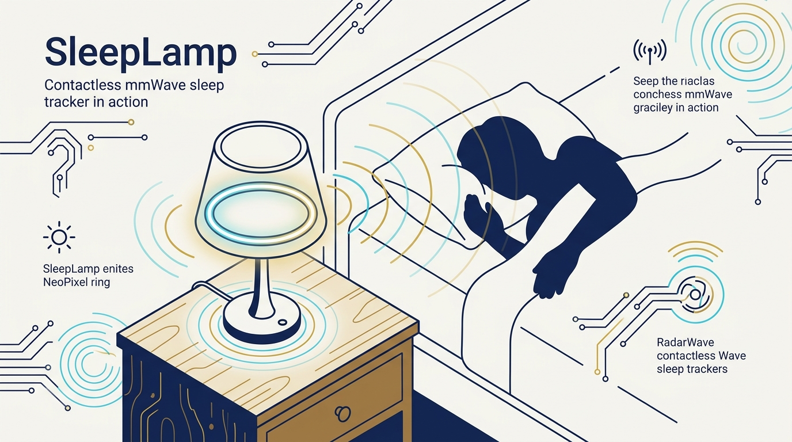
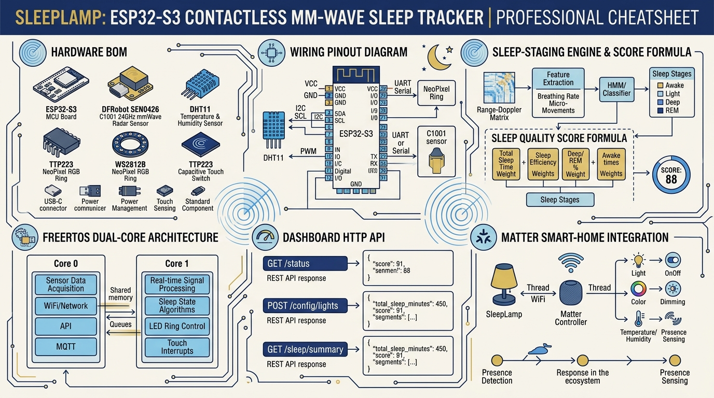
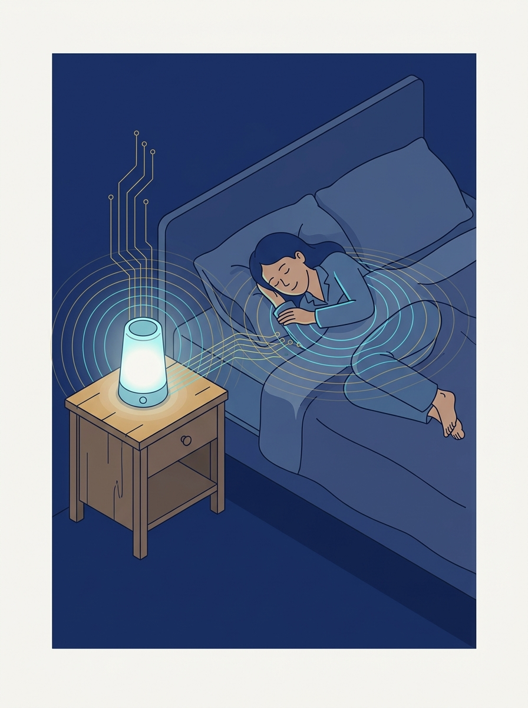
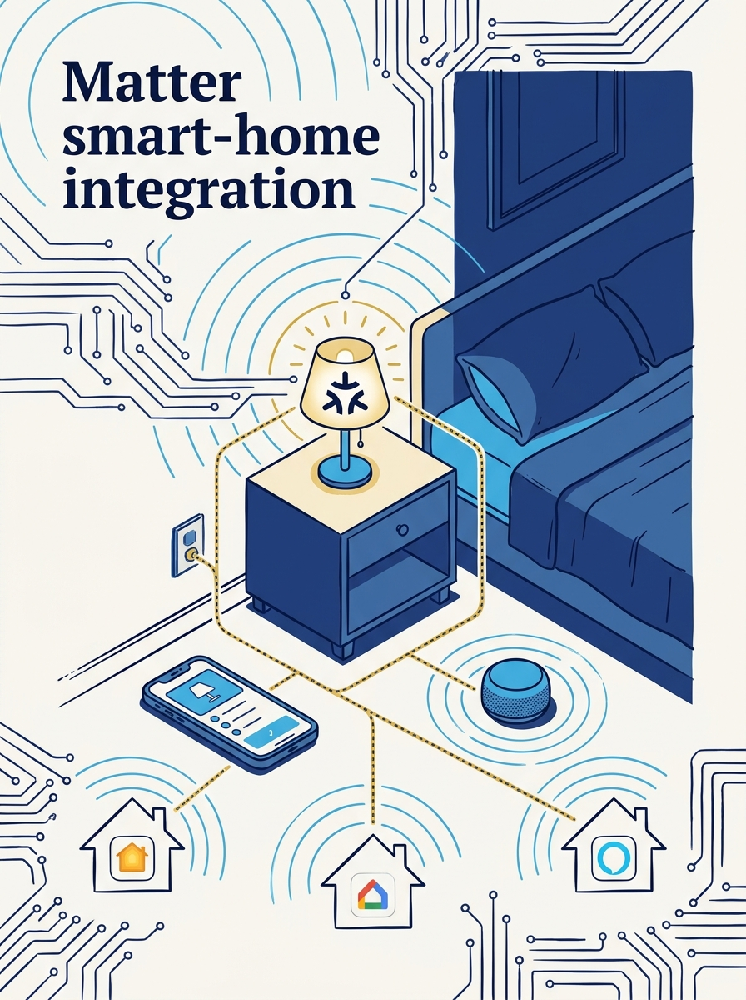

<!-- _class: title -->

# SleepLamp: Contactless Sleep Tracking with ESP32-S3 + mmWave

60 GHz radar reads your heartbeat and breathing — no wearable, no camera, no cloud

<!-- Speaker: Open-source bedside lamp project by techiesms (Shubh Jaiswal). One board, one radar, zero wearables. -->

---

<!-- _class: cheatsheet -->
<!-- _backgroundColor: #f8f7f4 -->

<!-- Speaker: 60-second orientation — BOM, wiring, staging engine, dual-core split, API, Matter. Point at each zone before advancing. -->

---

## SleepLamp Tracks Sleep Without Touching You

A 60 GHz mmWave radar bounces off your chest to read heart rate and breathing from up to 1.5 m away.

<svg viewBox="0 0 1100 380" width="100%" xmlns="http://www.w3.org/2000/svg">
  <rect x="60" y="40" width="980" height="300" rx="16" fill="var(--paper)" stroke="var(--soft-2)" stroke-width="1.5" style="filter:drop-shadow(0 4px 12px rgba(15,23,42,.08))"/>
  <rect x="60" y="40" width="8" height="300" rx="4" fill="var(--accent)"/>
  <circle cx="148" cy="190" r="40" fill="var(--accent)" opacity=".12"/>
  <circle cx="148" cy="190" r="28" fill="var(--accent)"/>
  <text x="148" y="196" font-size="18" fill="var(--paper)" text-anchor="middle" dominant-baseline="central" font-family="system-ui" font-weight="700">i</text>
  <text x="220" y="170" font-size="20" font-weight="700" fill="var(--ink)" font-family="system-ui">DFRobot C1001 radar does the DSP on-board</text>
  <text x="220" y="202" font-size="15" fill="var(--ink-dim)" font-family="system-ui">ESP32-S3's whole job: read one UART, drive LEDs, host a web page</text>
  <text x="220" y="232" font-size="15" fill="var(--muted)" font-family="system-ui">No cloud, no app — dashboard served straight from the chip</text>
</svg>

<b>★ Takeaway:</b> Because the radar pre-processes signal itself, the MCU stays simple — no heavy DSP on the ESP32.

<!-- Speaker: Contrast with wearables — nothing to charge, nothing to remember to put on. -->

---

## Why Contactless Sleep Tracking Matters

Wearables need charging and remembering to wear them — a bedside radar just watches you breathe.

<svg viewBox="0 0 700 320" width="100%" xmlns="http://www.w3.org/2000/svg">
  <rect x="30" y="30" width="640" height="70" rx="10" fill="var(--soft)"/>
  <text x="50" y="72" font-size="16" font-weight="700" fill="var(--ink)" font-family="system-ui">Truly contactless — nothing to wear or charge</text>
  <rect x="30" y="115" width="640" height="70" rx="10" fill="var(--soft)"/>
  <text x="50" y="157" font-size="16" font-weight="700" fill="var(--ink)" font-family="system-ui">Real biometrics — HR (bpm) &amp; breathing (rpm), not estimates</text>
  <rect x="30" y="200" width="640" height="70" rx="10" fill="var(--soft)"/>
  <text x="50" y="242" font-size="16" font-weight="700" fill="var(--ink)" font-family="system-ui">100% local — dashboard served from the ESP32 itself</text>
</svg>

<b>★ Takeaway:</b> Inspired by the commercial Sleepal AI Lamp — SleepLamp is an independent, open-source build of the same idea.

<!-- Speaker: Benchmark against Sleepal AI Lamp Kickstarter; this is unaffiliated and open. -->

---

## Hardware: Five Parts, One Job Each

The shipped BOM is lean — no mic, no RTC, no extra env sensors from the early research notes.

  

    
MCU

    <h3>ESP32-S3-WROOM-1 N16R8</h3>
    
16 MB flash, 8 MB PSRAM, dual-core — reads radar, drives LEDs, hosts dashboard.

  

  

    
Radar

    <h3>DFRobot C1001 / SEN0623</h3>
    
60 GHz mmWave — contactless HR + breathing over UART.

  

  

    
Climate

    <h3>DHT11</h3>
    
Bit-banged GPIO, no external library needed.

  

  

    
Lamp

    <h3>12× WS2812/SK6812 ring</h3>
    
Adaptive circadian lighting, ~0.7 A at full brightness.

  

  

    
Input

    <h3>TTP223 touch module</h3>
    
Tap to toggle lamp, tap to dismiss alarm.

  

  

    
Power

    <h3>External 5V ≥1.5A</h3>
    
Required — board's USB rail is too noisy for the radar.

  

<b>★ Takeaway:</b> Every part earns its place — this is a minimal BOM, not a kitchen-sink build.

<!-- Speaker: Emphasize the external 5V requirement — it's the #1 support issue. -->

---

## Wiring & The One Gotcha That Breaks Everything

Five wires total — but the radar's power source decides whether HR/breathing lock at all.

<svg viewBox="0 0 1100 380" width="100%" xmlns="http://www.w3.org/2000/svg">
  <rect x="40" y="30" width="500" height="320" rx="12" fill="var(--paper)" stroke="var(--soft-2)" stroke-width="1.5" style="filter:drop-shadow(var(--shadow-sm))"/>
  <text x="290" y="65" font-size="16" font-weight="700" fill="var(--ink)" text-anchor="middle" font-family="system-ui">Pinout</text>
  <text x="65" y="105" font-size="14" fill="var(--ink-dim)" font-family="monospace">GPIO18  ← C1001 TX</text>
  <text x="65" y="140" font-size="14" fill="var(--ink-dim)" font-family="monospace">GPIO17  → C1001 RX</text>
  <text x="65" y="175" font-size="14" fill="var(--ink-dim)" font-family="monospace">GPIO4   ↔ DHT11 DATA</text>
  <text x="65" y="210" font-size="14" fill="var(--ink-dim)" font-family="monospace">GPIO5   → NeoPixel DIN</text>
  <text x="65" y="245" font-size="14" fill="var(--ink-dim)" font-family="monospace">GPIO6   ← TTP223 OUT</text>
  <text x="65" y="300" font-size="13" fill="var(--muted)" font-family="system-ui">All pins are #define in config.h</text>
  <rect x="570" y="30" width="490" height="320" rx="12" fill="var(--danger-wash)" stroke="var(--danger)" stroke-width="2"/>
  <text x="815" y="70" font-size="16" font-weight="700" fill="var(--danger-ink)" text-anchor="middle" font-family="system-ui">Critical Gotcha</text>
  <text x="600" y="115" font-size="14" fill="var(--danger-ink)" font-family="system-ui">Radar MUST use external 5V —</text>
  <text x="600" y="140" font-size="14" fill="var(--danger-ink)" font-family="system-ui">USB rail is too noisy</text>
  <text x="600" y="180" font-size="14" fill="var(--ink)" font-family="system-ui">Symptoms if wrong:</text>
  <text x="620" y="210" font-size="13" fill="var(--ink-dim)" font-family="system-ui">• No HR lock</text>
  <text x="620" y="235" font-size="13" fill="var(--ink-dim)" font-family="system-ui">• Corrupt UART frames</text>
  <text x="620" y="260" font-size="13" fill="var(--ink-dim)" font-family="system-ui">• Brownout reboots</text>
  <text x="600" y="310" font-size="13" fill="var(--muted)" font-family="system-ui">"init error, retrying" for 10-15s = normal boot</text>
</svg>

<b>★ Takeaway:</b> One shared ground, but radar power must be electrically clean and separate from USB.

<!-- Speaker: This single wiring detail solves 90% of "my HR won't read" support questions. -->

---

## A Custom Staging Engine Beats the Radar's Built-In One

The C1001's native staging needs 15-20 minutes and can't handle naps — so SleepLamp stages sleep itself, minute by minute.

<svg viewBox="0 0 1100 380" width="100%" xmlns="http://www.w3.org/2000/svg">
  <rect x="40" y="140" width="220" height="90" rx="12" fill="var(--soft)" stroke="var(--soft-2)" stroke-width="1.5"/>
  <text x="150" y="192" font-size="16" font-weight="700" fill="var(--ink)" text-anchor="middle" font-family="system-ui">Awake</text>
  <path d="M260 185 L360 185" stroke="var(--muted)" stroke-width="2" marker-end="url(#arrowhead1)"/>
  <text x="310" y="170" font-size="11" fill="var(--muted)" text-anchor="middle" font-family="system-ui">3 quiet min</text>
  <rect x="360" y="140" width="220" height="90" rx="12" fill="var(--accent-wash)" stroke="var(--accent)" stroke-width="1.5"/>
  <text x="470" y="192" font-size="16" font-weight="700" fill="var(--accent-deep)" text-anchor="middle" font-family="system-ui">Light</text>
  <path d="M580 185 L680 185" stroke="var(--muted)" stroke-width="2" marker-end="url(#arrowhead1)"/>
  <text x="630" y="170" font-size="11" fill="var(--muted)" text-anchor="middle" font-family="system-ui">10 min + HR drop</text>
  <rect x="680" y="140" width="220" height="90" rx="12" fill="var(--accent)" opacity=".9"/>
  <text x="790" y="192" font-size="16" font-weight="700" fill="white" text-anchor="middle" font-family="system-ui">Deep</text>
  <path d="M790 230 Q790 280 470 280 Q260 280 260 230" stroke="var(--danger)" stroke-width="2" fill="none" marker-end="url(#arrowhead2)"/>
  <text x="525" y="300" font-size="12" fill="var(--danger-ink)" text-anchor="middle" font-family="system-ui">sustained movement → back to Awake</text>
  <defs>
    <marker id="arrowhead1" markerWidth="8" markerHeight="8" refX="6" refY="3" orient="auto"><polygon points="0 0, 6 3, 0 6" fill="var(--muted)"/></marker>
    <marker id="arrowhead2" markerWidth="8" markerHeight="8" refX="6" refY="3" orient="auto"><polygon points="0 0, 6 3, 0 6" fill="var(--danger)"/></marker>
  </defs>
  <text x="550" y="60" font-size="13" fill="var(--muted)" text-anchor="middle" font-family="system-ui">Session ends: 8 min out-of-bed, or manual "End session"</text>
</svg>

<b>★ Takeaway:</b> Reports from minute 1 (vs. 15-20 min native), nap-compatible, and immune to junk radar frames.

<!-- Speaker: Contrast table in the post — native staging vs. custom engine, 4 dimensions. -->

---

## Sleep Score: Four Weighted Factors, 1-99

Sessions are only written to history at session end — never from raw frames — which is why junk data disappeared for good.

  

    
45%

    <h3>Sleep Efficiency</h3>
    
Asleep time ÷ in-bed time

  

  

    
25%

    <h3>Deep-Sleep Share</h3>
    
Target ~25% of night

  

  

    
15%

    <h3>Total Duration</h3>
    
Target ~7 hours

  

  

    
15%

    <h3>Awakening Frequency</h3>
    
Fewer wake-ups score higher

  

<b>★ Takeaway:</b> Efficiency dominates the score — a long night with poor efficiency scores worse than a shorter, solid one.

<!-- Speaker: Rule-based coach also adds one plain-English insight per report. -->

---

## Dual-Core FreeRTOS: Sensor Reads Never Block the Web UI

A slow or rebooting radar can never freeze the dashboard — the two jobs live on separate cores.

<svg viewBox="0 0 1100 380" width="100%" xmlns="http://www.w3.org/2000/svg">
  <rect x="60" y="40" width="480" height="300" rx="12" fill="var(--accent-wash)" stroke="var(--accent)" stroke-width="1.5"/>
  <text x="300" y="75" font-size="16" font-weight="700" fill="var(--accent-deep)" text-anchor="middle" font-family="system-ui">Core 0 — sensorTask</text>
  <text x="90" y="120" font-size="14" fill="var(--ink)" font-family="system-ui">Owns radar UART exclusively</text>
  <text x="90" y="155" font-size="14" fill="var(--ink)" font-family="system-ui">Read → validate → smooth</text>
  <text x="90" y="190" font-size="14" fill="var(--ink)" font-family="system-ui">Runs staging engine (1-min epochs)</text>
  <text x="90" y="225" font-size="14" fill="var(--ink)" font-family="system-ui">Session ring buffer</text>
  <rect x="560" y="40" width="480" height="300" rx="12" fill="var(--soft)" stroke="var(--soft-2)" stroke-width="1.5"/>
  <text x="800" y="75" font-size="16" font-weight="700" fill="var(--ink)" text-anchor="middle" font-family="system-ui">Core 1 — loop()</text>
  <text x="590" y="120" font-size="14" fill="var(--ink)" font-family="system-ui">WebServer + dashboard</text>
  <text x="590" y="155" font-size="14" fill="var(--ink)" font-family="system-ui">Lamp + alarm control</text>
  <text x="590" y="190" font-size="14" fill="var(--ink)" font-family="system-ui">DHT11 environment poll</text>
  <path d="M540 190 L560 190" stroke="var(--gold)" stroke-width="3" marker-end="url(#arrowhead3)"/>
  <text x="550" y="255" font-size="12" fill="var(--muted)" text-anchor="middle" font-family="system-ui">mutex-guarded</text>
  <text x="550" y="272" font-size="12" fill="var(--muted)" text-anchor="middle" font-family="system-ui">globals</text>
  <defs><marker id="arrowhead3" markerWidth="8" markerHeight="8" refX="6" refY="3" orient="auto"><polygon points="0 0, 6 3, 0 6" fill="var(--gold)"/></marker></defs>
</svg>

<b>★ Takeaway:</b> Shared state lives in mutex-guarded globals — the web layer always reads a consistent snapshot.

<!-- Speaker: This is the architectural reason HTTP requests never stutter even during a radar reboot. -->

---

## One Web Page, Eight API Endpoints, No App Required

Served entirely from the ESP32 at http://sleeplamp.local — installable as a PWA, works offline.

  
<h3><code>GET /api/data</code></h3>
Live JSON snapshot — vitals, state, current session

  
<h3><code>GET /api/session</code></h3>
Per-minute stage/HR/breathing arrays (hypnogram)

  
<h3><code>GET /api/history</code></h3>
Saved sessions; <code>?del=N</code> or <code>?clear=1</code>

  
<h3><code>GET /api/export</code></h3>
CSV download

  
<h3><code>GET /api/report?end=1</code></h3>
Force session end + save report

  
<h3><code>GET /api/light?...</code></h3>
Lamp color/brightness

  
<h3><code>GET /api/alarm?...</code></h3>
Smart-wake configuration

  
<h3><code>GET /api/sensor?reset=1</code></h3>
Radar recalibration

<b>★ Takeaway:</b> No account, no cloud round-trip — every control surface is a plain HTTP GET to the lamp itself.

<!-- Speaker: Highlight /api/history's delete-one vs clear-all — useful for a bad night's data. -->

---

## Matter Turns the Lamp Into a Standard Smart-Home Light

Scan the QR code from the serial monitor to pair with Apple Home, Google Home, or Alexa — state syncs both ways.

<svg viewBox="0 0 700 320" width="100%" xmlns="http://www.w3.org/2000/svg">
  <rect x="30" y="40" width="640" height="60" rx="10" fill="var(--soft)"/>
  <text x="50" y="76" font-size="15" font-weight="700" fill="var(--ink)" font-family="system-ui">Exposed as a Matter Color Light</text>
  <rect x="30" y="115" width="640" height="60" rx="10" fill="var(--soft)"/>
  <text x="50" y="151" font-size="15" font-weight="700" fill="var(--ink)" font-family="system-ui">Requires esp32 board pkg &#8805;3.1.0</text>
  <rect x="30" y="190" width="640" height="60" rx="10" fill="var(--soft)"/>
  <text x="50" y="226" font-size="15" font-weight="700" fill="var(--ink)" font-family="system-ui">Touch or dashboard change updates app too</text>
</svg>

<b>★ Takeaway:</b> No native Matter "sleep tracker" type exists yet — the project exposes sleep data via occupancy + light instead.

<!-- Speaker: Voice control ("turn off the lamp") works out of the box once paired. -->

---

## Build It: Five Steps From Toolchain to First Night

<svg viewBox="0 0 1100 380" width="100%" xmlns="http://www.w3.org/2000/svg">
  <g font-family="system-ui">
    <rect x="20" y="150" width="190" height="90" rx="10" fill="var(--accent)" opacity=".1" stroke="var(--accent)" stroke-width="1.5"/>
    <text x="115" y="185" font-size="14" font-weight="700" fill="var(--accent-deep)" text-anchor="middle">1. Toolchain</text>
    <text x="115" y="208" font-size="11" fill="var(--ink-dim)" text-anchor="middle">Arduino IDE 2.x</text>
    <text x="115" y="224" font-size="11" fill="var(--ink-dim)" text-anchor="middle">esp32 pkg &#8805;3.1.0</text>
    <path d="M215 195 L245 195" stroke="var(--muted)" stroke-width="2" marker-end="url(#af)"/>
    <rect x="250" y="150" width="190" height="90" rx="10" fill="var(--accent)" opacity=".1" stroke="var(--accent)" stroke-width="1.5"/>
    <text x="345" y="185" font-size="14" font-weight="700" fill="var(--accent-deep)" text-anchor="middle">2. WiFi Secrets</text>
    <text x="345" y="208" font-size="11" fill="var(--ink-dim)" text-anchor="middle">secrets.example.h</text>
    <text x="345" y="224" font-size="11" fill="var(--ink-dim)" text-anchor="middle">→ secrets.h</text>
    <path d="M445 195 L475 195" stroke="var(--muted)" stroke-width="2" marker-end="url(#af)"/>
    <rect x="480" y="150" width="190" height="90" rx="10" fill="var(--accent)" opacity=".1" stroke="var(--accent)" stroke-width="1.5"/>
    <text x="575" y="185" font-size="14" font-weight="700" fill="var(--accent-deep)" text-anchor="middle">3. Board Settings</text>
    <text x="575" y="208" font-size="11" fill="var(--ink-dim)" text-anchor="middle">Huge APP partition</text>
    <text x="575" y="224" font-size="11" fill="var(--ink-dim)" text-anchor="middle">Erase All (1st flash)</text>
    <path d="M675 195 L705 195" stroke="var(--muted)" stroke-width="2" marker-end="url(#af)"/>
    <rect x="710" y="150" width="190" height="90" rx="10" fill="var(--accent)" opacity=".1" stroke="var(--accent)" stroke-width="1.5"/>
    <text x="805" y="185" font-size="14" font-weight="700" fill="var(--accent-deep)" text-anchor="middle">4. Flash</text>
    <text x="805" y="208" font-size="11" fill="var(--ink-dim)" text-anchor="middle">sleeplamp.ino</text>
    <text x="805" y="224" font-size="11" fill="var(--ink-dim)" text-anchor="middle">R-G-B boot test</text>
    <path d="M905 195 L935 195" stroke="var(--muted)" stroke-width="2" marker-end="url(#af)"/>
    <rect x="940" y="150" width="150" height="90" rx="10" fill="var(--success)" opacity=".15" stroke="var(--success)" stroke-width="1.5"/>
    <text x="1015" y="185" font-size="14" font-weight="700" fill="var(--success-ink)" text-anchor="middle">5. First Night</text>
    <text x="1015" y="208" font-size="11" fill="var(--ink-dim)" text-anchor="middle">Placement check</text>
    <text x="1015" y="224" font-size="11" fill="var(--ink-dim)" text-anchor="middle">sleeplamp.local</text>
  </g>
  <defs><marker id="af" markerWidth="8" markerHeight="8" refX="6" refY="3" orient="auto"><polygon points="0 0, 6 3, 0 6" fill="var(--muted)"/></marker></defs>
</svg>

<b>★ Takeaway:</b> "init error, retrying" for the first 10-15s is normal radar boot time, not a fault.

<!-- Speaker: If HR never locks, hit "Recalibrate sensor" or power-cycle the radar's 5V rail. -->

---

## Caveat: No Custom PCB or 3D-Printed Case Yet

The repo's own Roadmap lists the enclosure as unfinished — this is a wired-module build, not a designed product.

  

    
Verified via repo file tree

    <h3>No PCB / Gerber / KiCad files</h3>
    
Build wires discrete modules on perfboard/dupont — no custom board design in the repository.

  

  

    
Verified via README Roadmap

    <h3>3D-printed enclosure: unchecked</h3>
    
Listed as future work, alongside snore detection and an ambient light sensor.

  

<b>★ Takeaway:</b> Code and wiring are fully open-source and working today — hardware design files are not (yet) part of this project.

<!-- Speaker: Important correction vs. common assumption — check before citing "custom PCB" for this specific project. -->

---

## Key Takeaways

What a reader who skips the body still needs to know.

<svg viewBox="0 0 1100 340" width="100%" xmlns="http://www.w3.org/2000/svg">
  <circle cx="550" cy="170" r="160" fill="none" stroke="var(--soft-2)" stroke-width="1.5"/>
  <circle cx="550" cy="170" r="110" fill="none" stroke="var(--accent)" stroke-width="1.5" opacity=".4"/>
  <circle cx="550" cy="170" r="60" fill="var(--accent)" opacity=".1"/>
  <circle cx="550" cy="170" r="60" fill="none" stroke="var(--accent)" stroke-width="2"/>
  <text x="550" y="164" font-size="14" font-weight="700" fill="var(--accent)" text-anchor="middle" font-family="system-ui">Contactless</text>
  <text x="550" y="184" font-size="13" fill="var(--ink)" text-anchor="middle" font-family="system-ui">mmWave sleep</text>
  <text x="380" y="100" font-size="13" fill="var(--ink)" font-family="system-ui" text-anchor="middle">Custom</text>
  <text x="380" y="120" font-size="12" fill="var(--muted)" font-family="system-ui" text-anchor="middle">staging engine</text>
  <text x="730" y="100" font-size="13" fill="var(--ink)" font-family="system-ui" text-anchor="middle">Dual-core</text>
  <text x="730" y="120" font-size="12" fill="var(--muted)" font-family="system-ui" text-anchor="middle">FreeRTOS</text>
  <text x="220" y="170" font-size="13" fill="var(--muted)" font-family="system-ui" text-anchor="middle">Local</text>
  <text x="220" y="190" font-size="13" fill="var(--muted)" font-family="system-ui" text-anchor="middle">dashboard</text>
  <text x="880" y="170" font-size="13" fill="var(--muted)" font-family="system-ui" text-anchor="middle">Matter</text>
  <text x="880" y="190" font-size="13" fill="var(--muted)" font-family="system-ui" text-anchor="middle">smart-home</text>
</svg>

<b>★ Takeaway:</b> Open-source, working code today — no cloud, no wearable — but hardware design files (PCB, enclosure) are still on the roadmap.

<!-- Speaker: Close by pointing back to the GitHub repo link for anyone who wants to build one. -->
