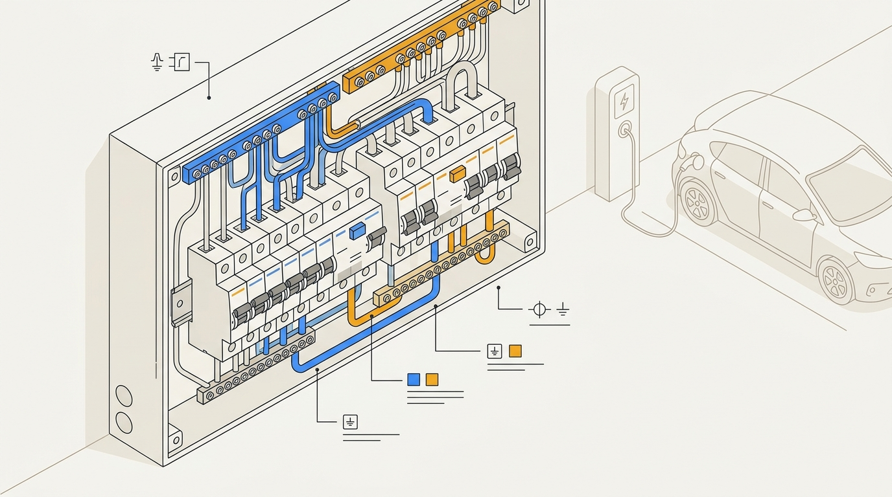
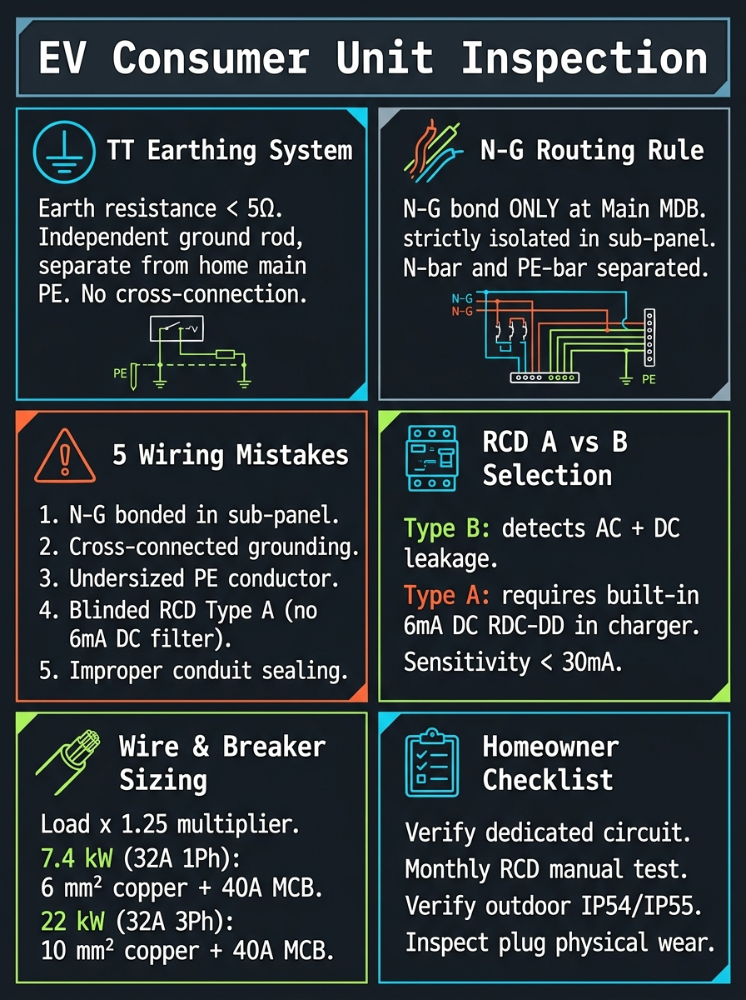
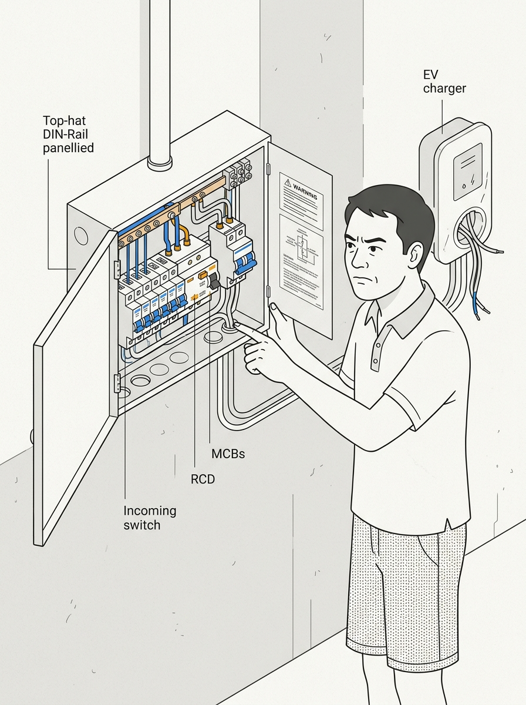

<!-- _class: title -->

# ตรวจรับงานตู้ไฟ Consumer Unit Din Rail

สำหรับชาร์จ EV: ข้อผิดพลาดที่ช่างมักทำ และมาตรฐานการไฟฟ้าที่ต้องรู้

<!-- Speaker: ดูเรื่องนี้ก่อนจ่ายเงินให้ช่าง — ตรวจรับงาน Consumer Unit Din Rail ให้ถูกต้อง -->

---

<!-- _class: cheatsheet -->
<!-- _backgroundColor: #f8f7f4 -->

<!-- Speaker: ภาพรวมหัวข้อทั้งหมด: TT System, เส้นทาง Neutral ที่ถูกต้อง, ข้อผิดพลาด 5 ข้อ, RCD Type, ขนาดสาย, checklist ตรวจรับ -->

---

## กฎเหล็ก: Neutral ต้องผ่าน Ground Bar เสมอ

สาย N จากมิเตอร์ → Ground Bar ก่อน → แล้วค่อยจ่ายเข้า RCD/RCBO — ข้ามขั้นตอนนี้ทำให้ระบบป้องกันล้มเหลว

<svg viewBox="0 0 1100 340" width="100%" xmlns="http://www.w3.org/2000/svg">
  <!-- Correct path callout box -->
  <rect x="40" y="30" width="1020" height="140" rx="14" fill="var(--success-wash)" stroke="var(--success)" stroke-width="2"/>
  <rect x="40" y="30" width="8" height="140" rx="4" fill="var(--success)"/>
  <text x="80" y="72" font-size="13" font-weight="700" fill="var(--success-ink)" font-family="system-ui">CORRECT PATH</text>
  <text x="80" y="100" font-size="16" font-weight="700" fill="var(--ink)" font-family="system-ui">Meter</text>
  <text x="220" y="100" font-size="16" fill="var(--ink)" font-family="system-ui">Main Switch</text>
  <text x="430" y="100" font-size="16" font-weight="700" fill="var(--success-ink)" font-family="system-ui">Ground Bar</text>
  <text x="630" y="100" font-size="16" fill="var(--ink)" font-family="system-ui">Neutral Bar</text>
  <text x="830" y="100" font-size="16" fill="var(--ink)" font-family="system-ui">RCD/RCBO</text>
  <!-- arrows -->
  <path d="M168 98 L205 98" stroke="var(--muted)" stroke-width="2" fill="none" marker-end="url(#ar)"/>
  <path d="M368 98 L415 98" stroke="var(--success)" stroke-width="2.5" fill="none" marker-end="url(#arg)"/>
  <path d="M570 98 L615 98" stroke="var(--muted)" stroke-width="2" fill="none" marker-end="url(#ar)"/>
  <path d="M760 98 L815 98" stroke="var(--muted)" stroke-width="2" fill="none" marker-end="url(#ar)"/>
  <text x="80" y="148" font-size="13" fill="var(--success-ink)" font-family="system-ui">Ground Rod connected at Ground Bar — RCD sees accurate current balance</text>
  <!-- Wrong path -->
  <rect x="40" y="195" width="1020" height="120" rx="14" fill="var(--danger-wash)" stroke="var(--danger)" stroke-width="2"/>
  <rect x="40" y="195" width="8" height="120" rx="4" fill="var(--danger)"/>
  <text x="80" y="232" font-size="13" font-weight="700" fill="var(--danger-ink)" font-family="system-ui">WRONG PATH — Hidden N-PE Bridge</text>
  <text x="80" y="258" font-size="16" fill="var(--ink)" font-family="system-ui">Meter</text>
  <text x="220" y="258" font-size="16" fill="var(--ink)" font-family="system-ui">Main Switch</text>
  <text x="430" y="258" font-size="16" font-weight="700" fill="var(--danger-ink)" font-family="system-ui">RCD/RCBO</text>
  <path d="M168 256 L205 256" stroke="var(--muted)" stroke-width="2" fill="none" marker-end="url(#ar)"/>
  <path d="M368 256 L415 256" stroke="var(--danger)" stroke-width="2.5" fill="none" marker-end="url(#ard)"/>
  <text x="80" y="296" font-size="13" fill="var(--danger-ink)" font-family="system-ui">Ground Bar bypassed — N leaks through PE path; RCD blind to fault current</text>
  <defs>
    <marker id="ar" markerWidth="8" markerHeight="8" refX="6" refY="3" orient="auto">
      <path d="M0,0 L0,6 L8,3 z" fill="var(--muted)"/>
    </marker>
    <marker id="arg" markerWidth="8" markerHeight="8" refX="6" refY="3" orient="auto">
      <path d="M0,0 L0,6 L8,3 z" fill="var(--success)"/>
    </marker>
    <marker id="ard" markerWidth="8" markerHeight="8" refX="6" refY="3" orient="auto">
      <path d="M0,0 L0,6 L8,3 z" fill="var(--danger)"/>
    </marker>
  </defs>
</svg>

<b>★ Takeaway:</b> Neutral ข้าม Ground Bar = RCD ทำงานผิด อาจไม่ตัดไฟเมื่อเกิด fault จริง

<!-- Speaker: นี่คือหัวใจของ post ทั้งหมด — ลำดับการต่อสายนี้บังคับตาม IEC 60364 -->

---

## ทำไม EV Charger ถึงเป็นจุดเสี่ยงในบ้านไทย

ระบบ TT Earthing ที่ไทยใช้พึ่งพา RCD เป็นหลัก — ถ้า RCD ถูกหลอก ไม่มีตาข่ายนิรภัยใดเหลือ

<svg viewBox="0 0 700 300" width="100%" xmlns="http://www.w3.org/2000/svg">
  <!-- TT System simplified diagram -->
  <!-- Utility source -->
  <rect x="20" y="80" width="110" height="60" rx="8" fill="var(--soft)" stroke="var(--soft-2)" stroke-width="1.5"/>
  <text x="75" y="107" font-size="12" font-weight="700" fill="var(--ink)" text-anchor="middle" font-family="system-ui">MEA/PEA</text>
  <text x="75" y="124" font-size="11" fill="var(--muted)" text-anchor="middle" font-family="system-ui">Utility</text>
  <!-- Ground at source -->
  <line x1="75" y1="140" x2="75" y2="185" stroke="var(--muted)" stroke-width="1.5" stroke-dasharray="4,3"/>
  <line x1="55" y1="185" x2="95" y2="185" stroke="var(--muted)" stroke-width="2"/>
  <line x1="60" y1="192" x2="90" y2="192" stroke="var(--muted)" stroke-width="1.5"/>
  <line x1="66" y1="199" x2="84" y2="199" stroke="var(--muted)" stroke-width="1"/>
  <text x="75" y="218" font-size="10" fill="var(--muted)" text-anchor="middle" font-family="system-ui">Utility Earth</text>
  <!-- Wire to meter -->
  <line x1="130" y1="110" x2="200" y2="110" stroke="var(--ink)" stroke-width="2"/>
  <!-- Meter -->
  <rect x="200" y="85" width="70" height="60" rx="8" fill="var(--soft)" stroke="var(--accent)" stroke-width="1.5"/>
  <text x="235" y="116" font-size="11" font-weight="700" fill="var(--accent)" text-anchor="middle" font-family="system-ui">Meter</text>
  <!-- Consumer unit -->
  <line x1="270" y1="110" x2="340" y2="110" stroke="var(--ink)" stroke-width="2"/>
  <rect x="340" y="60" width="120" height="120" rx="8" fill="var(--soft)" stroke="var(--accent-deep)" stroke-width="2"/>
  <text x="400" y="100" font-size="11" font-weight="700" fill="var(--accent-deep)" text-anchor="middle" font-family="system-ui">Consumer</text>
  <text x="400" y="116" font-size="11" font-weight="700" fill="var(--accent-deep)" text-anchor="middle" font-family="system-ui">Unit</text>
  <rect x="360" y="128" width="80" height="22" rx="4" fill="var(--accent)" opacity=".8"/>
  <text x="400" y="143" font-size="10" fill="white" text-anchor="middle" font-family="system-ui">RCD/RCBO</text>
  <!-- Ground rod at house - SEPARATE from utility -->
  <line x1="400" y1="180" x2="400" y2="230" stroke="var(--success)" stroke-width="2"/>
  <line x1="380" y1="230" x2="420" y2="230" stroke="var(--success)" stroke-width="2.5"/>
  <line x1="385" y1="238" x2="415" y2="238" stroke="var(--success)" stroke-width="2"/>
  <line x1="391" y1="246" x2="409" y2="246" stroke="var(--success)" stroke-width="1.5"/>
  <text x="400" y="265" font-size="10" fill="var(--success-ink)" text-anchor="middle" font-family="system-ui">House Ground Rod</text>
  <!-- TT label - INDEPENDENT earths -->
  <rect x="490" y="80" width="190" height="130" rx="8" fill="var(--warning-wash)" stroke="var(--warning)" stroke-width="1.5"/>
  <text x="585" y="108" font-size="12" font-weight="700" fill="var(--warning-ink)" text-anchor="middle" font-family="system-ui">TT System</text>
  <text x="585" y="128" font-size="11" fill="var(--warning-ink)" text-anchor="middle" font-family="system-ui">2 independent</text>
  <text x="585" y="145" font-size="11" fill="var(--warning-ink)" text-anchor="middle" font-family="system-ui">earth electrodes</text>
  <text x="585" y="168" font-size="11" fill="var(--ink-dim)" text-anchor="middle" font-family="system-ui">RCD = primary</text>
  <text x="585" y="185" font-size="11" fill="var(--ink-dim)" text-anchor="middle" font-family="system-ui">protection</text>
  <rect x="10" y="10" width="1" height="1" fill="none"/>
</svg>

<b>★ Takeaway:</b> ในระบบ TT ไม่มีตาข่ายนิรภัยสำรอง — RCD คือการป้องกันเดียวจากไฟดูด หาก RCD ถูกหลอก = อันตราย

<!-- Speaker: ไทยใช้ TT ตาม IEC 60364 — แต่ละบ้านมี ground electrode ของตัวเอง แยกอิสระจากการไฟฟ้า -->

---

## TT vs TN-S: ทำไมไทยต้อง RCD เป็นหลัก

ความแตกต่างของ earthing system กำหนดว่าระบบใดป้องกันคน — ในไทยคือ RCD เท่านั้น

  

    
TT System — Thailand Standard

    <h3>ระบบที่บ้านไทยใช้</h3>
    <ul>
      <li>แต่ละบ้านมี Ground Rod ของตัวเอง แยกอิสระจากการไฟฟ้า</li>
      <li>สาย N กับ PE ต้องแยกตลอดเส้นทางใน installation</li>
      <li><strong>RCD เป็นตัวป้องกันหลัก</strong> — loop impedance สูงเกินไปสำหรับเบรกเกอร์ธรรมดา</li>
      <li>ถ้า RCD พัง / ถูกหลอก → ไม่มีการป้องกันจากไฟดูด</li>
    </ul>
  

  

    
TN-S System — Some EU Countries

    <h3>ระบบยุโรปบางประเทศ</h3>
    <ul>
      <li>PE conductor วิ่งมาจากแหล่งจ่ายของการไฟฟ้าโดยตรง</li>
      <li>Loop impedance ต่ำ — เบรกเกอร์ธรรมดาตัดได้เร็วพอ</li>
      <li>RCD ใช้เป็น "ตัวเสริม" ไม่ใช่ตัวหลัก</li>
      <li>ความเสี่ยง: สาย Neutral หัก → PE มีกระแสไหลได้</li>
    </ul>
  

<b>★ Takeaway:</b> เพราะไทยใช้ TT ทุกจุดในการเดินสาย Consumer Unit จึงต้องไม่ทำให้ RCD ทำงานผิดพลาด

<!-- Speaker: นี่คือเหตุผลที่ข้อผิดพลาดด้านการเดินสายในไทยอันตรายกว่าในยุโรป -->

---

## How RCD Detects Faults — and How Wiring Mistakes Blind It

RCD วัด imbalance ระหว่าง Phase กับ Neutral — hidden current path ทำให้คำตอบผิด

<svg viewBox="0 0 1100 330" width="100%" xmlns="http://www.w3.org/2000/svg">
  <!-- RCD working correctly scenario -->
  <rect x="20" y="20" width="490" height="290" rx="12" fill="var(--success-wash)" stroke="var(--success)" stroke-width="1.5"/>
  <text x="265" y="52" font-size="14" font-weight="700" fill="var(--success-ink)" text-anchor="middle" font-family="system-ui">CORRECT WIRING</text>
  <!-- toroidal RCD -->
  <ellipse cx="265" cy="145" rx="55" ry="55" fill="none" stroke="var(--success)" stroke-width="3"/>
  <ellipse cx="265" cy="145" rx="35" ry="35" fill="var(--paper)" stroke="var(--success)" stroke-width="1.5"/>
  <text x="265" y="141" font-size="11" font-weight="700" fill="var(--success-ink)" text-anchor="middle" font-family="system-ui">RCD</text>
  <text x="265" y="156" font-size="10" fill="var(--success-ink)" text-anchor="middle" font-family="system-ui">Toroid</text>
  <!-- Phase in -->
  <line x1="50" y1="120" x2="208" y2="120" stroke="var(--danger)" stroke-width="3"/>
  <text x="50" y="110" font-size="11" fill="var(--danger)" font-family="system-ui" font-weight="700">L</text>
  <text x="120" y="110" font-size="10" fill="var(--ink-dim)" font-family="system-ui">10A out</text>
  <!-- Phase out -->
  <line x1="322" y1="120" x2="450" y2="120" stroke="var(--danger)" stroke-width="3"/>
  <!-- Neutral return -->
  <line x1="450" y1="170" x2="322" y2="170" stroke="var(--accent)" stroke-width="3"/>
  <text x="360" y="190" font-size="10" fill="var(--ink-dim)" font-family="system-ui">10A return</text>
  <line x1="208" y1="170" x2="50" y2="170" stroke="var(--accent)" stroke-width="3"/>
  <text x="50" y="185" font-size="11" fill="var(--accent)" font-family="system-ui" font-weight="700">N</text>
  <!-- Balance label -->
  <text x="265" y="255" font-size="13" fill="var(--success-ink)" text-anchor="middle" font-family="system-ui">10A - 10A = 0</text>
  <text x="265" y="275" font-size="12" fill="var(--success-ink)" text-anchor="middle" font-family="system-ui">No trip</text>
  <!-- Wrong wiring scenario -->
  <rect x="590" y="20" width="490" height="290" rx="12" fill="var(--danger-wash)" stroke="var(--danger)" stroke-width="1.5"/>
  <text x="835" y="52" font-size="14" font-weight="700" fill="var(--danger-ink)" text-anchor="middle" font-family="system-ui">WRONG WIRING — N Bypasses Ground Bar</text>
  <!-- toroidal RCD -->
  <ellipse cx="835" cy="145" rx="55" ry="55" fill="none" stroke="var(--danger)" stroke-width="3"/>
  <ellipse cx="835" cy="145" rx="35" ry="35" fill="var(--paper)" stroke="var(--danger)" stroke-width="1.5"/>
  <text x="835" y="141" font-size="11" font-weight="700" fill="var(--danger-ink)" text-anchor="middle" font-family="system-ui">RCD</text>
  <text x="835" y="156" font-size="10" fill="var(--danger-ink)" text-anchor="middle" font-family="system-ui">Toroid</text>
  <!-- Phase in -->
  <line x1="620" y1="120" x2="778" y2="120" stroke="var(--danger)" stroke-width="3"/>
  <text x="620" y="110" font-size="11" fill="var(--danger)" font-family="system-ui" font-weight="700">L</text>
  <text x="690" y="110" font-size="10" fill="var(--ink-dim)" font-family="system-ui">10A out</text>
  <line x1="892" y1="120" x2="1050" y2="120" stroke="var(--danger)" stroke-width="3"/>
  <!-- N partial return -->
  <line x1="1050" y1="170" x2="892" y2="170" stroke="var(--accent)" stroke-width="3"/>
  <text x="960" y="190" font-size="10" fill="var(--ink-dim)" font-family="system-ui">8A via N</text>
  <line x1="778" y1="170" x2="620" y2="170" stroke="var(--accent)" stroke-width="3"/>
  <text x="620" y="185" font-size="11" fill="var(--accent)" font-family="system-ui" font-weight="700">N</text>
  <!-- Earth leakage path -->
  <line x1="1050" y1="145" x2="1075" y2="145" stroke="var(--warning)" stroke-width="2.5" stroke-dasharray="5,3"/>
  <text x="1040" y="218" font-size="10" fill="var(--warning-ink)" text-anchor="middle" font-family="system-ui">2A via PE</text>
  <!-- Imbalance label -->
  <text x="835" y="255" font-size="13" fill="var(--danger-ink)" text-anchor="middle" font-family="system-ui">10A - 8A = 2A apparent</text>
  <text x="835" y="275" font-size="12" fill="var(--danger-ink)" text-anchor="middle" font-family="system-ui">Nuisance trip OR missed real fault</text>
  <rect x="0" y="0" width="1" height="1" fill="none"/>
</svg>

<b>★ Takeaway:</b> RCD วัดกระแสผ่าน toroid — hidden current path ทำให้ math ผิด: อาจ trip โดยไม่มีเหตุ หรือไม่ trip เมื่อมี fault จริง

<!-- Speaker: อธิบาย toroidal transformer หลักการ: flux sum = 0 เมื่อสมดุล; ถ้าไม่สมดุล → trip -->

---

## 5 ข้อผิดพลาดที่พบบ่อย: ข้อ 1–3

ข้อผิดพลาดที่ช่างนอกระบบทำบ่อย — ตรวจสอบได้ก่อนรับงาน

  

    
Mistake 1 — อันตรายมาก

    <h3>Neutral ข้าม Ground Bar</h3>
    
ต่อสาย N จากมิเตอร์ตรงไป RCD โดยไม่ผ่าน Ground Bar ก่อน ผิด IEC 60364 ทำให้ RCD ทำงานผิดพลาด

    
<strong>ตรวจ:</strong> ดูสาย N จาก Main Switch วิ่งไปที่ Ground Bar ก่อนหรือเปล่า

  

  

    
Mistake 2 — ไฟไหม้

    <h3>ขันสกรู Terminal ไม่แน่น</h3>
    
Contact resistance สูง → P = I²R ความร้อนสะสม → ไฟไหม้ busbar และ terminal โดยเฉพาะวงจร 32A EV

    
<strong>ตรวจ:</strong> ขอให้ช่างขันสกรูซ้ำต่อหน้าด้วย torque screwdriver (2–4 N·m)

  

  

    
Mistake 3 — ไฟตก/ไหม้

    <h3>ขนาดสายไฟเล็กเกินไป</h3>
    
32A charger ต้องใช้สาย 6 mm² (Cu) ถ้าใช้ 4 mm² สายร้อน แรงดันตก ชาร์จช้า และอาจไหม้

    
<strong>ตรวจ:</strong> ดูฉลากบนสายไฟ — ต้องระบุ 6 mm² และมีตรา มอก.

  

<b>★ Takeaway:</b> ข้อ 1 อันตรายถึงชีวิต; ข้อ 2 และ 3 คือต้นเหตุไฟไหม้ในบ้านที่ติดชาร์จ EV

<!-- Speaker: ข้อ 1 คือปัญหาที่พบใน YouTube video ต้นฉบับ — เป็นกรณีตัวอย่างที่พบจริงในสนาม -->

---

## 5 ข้อผิดพลาดที่พบบ่อย: ข้อ 4–5

การเลือกอุปกรณ์ผิดประเภทหรือไม่ได้มาตรฐาน ซ่อนอยู่ในกล่องอุปกรณ์ที่ดูเหมือนถูกต้อง

  

    
Mistake 4 — ป้องกันไม่ครบ

    <h3>เลือก RCD ผิดประเภท (Type AC)</h3>
    
EV Charger ปล่อย DC Leakage Current — Type AC RCBO ตรวจไม่พบ DC leakage เลย

    <ul>
      <li>Type AC: ตรวจ AC fault เท่านั้น — <strong>ห้ามใช้กับ EV</strong></li>
      <li>Type A: ตรวจ AC + DC ถึง 6mA — ใช้ได้ถ้าชาร์จมี RDC-DD</li>
      <li>Type B: ตรวจ AC + DC ถึง 60mA — <strong>ปลอดภัยสูงสุด</strong></li>
    </ul>
    
<strong>ตรวจ:</strong> หาตัวอักษร A หรือ B บนตัว RCBO — ถ้าไม่มี = Type AC = ผิด

  

  

    
Mistake 5 — สายไม่ได้มาตรฐาน

    <h3>สายไฟไม่ผ่าน มอก. TISI</h3>
    
สายเกรดต่ำมีฉนวนและตัวนำบางกว่า spec ทนกระแสได้น้อยกว่าที่ระบุ อาจร้อนเกินและไหม้แม้ขนาดสายดูถูก

    <ul>
      <li>ตรวจฉลากสายไฟ: ต้องมี <strong>มอก.11-2553</strong> หรือ TISI 11</li>
      <li>สายทองแดงเท่านั้น (ไม่ใช้สายอะลูมิเนียมในที่อยู่อาศัย)</li>
      <li>ขอใบเสร็จซื้อสายพร้อมระบุ spec</li>
    </ul>
    
<strong>ตรวจ:</strong> ดูฉลากบนสาย — ถ้าไม่มีตรา มอก. ขอให้เปลี่ยน

  

<b>★ Takeaway:</b> Type AC RCBO กับ EV Charger = อุปกรณ์ที่ดูเหมือน "ถูกต้อง" แต่ไม่ป้องกัน — ตรวจตัวอักษรบนกล่องก่อนรับงาน

<!-- Speaker: Type B RCBO แพงกว่า Type A 3-5 เท่า แต่จำเป็นถ้าชาร์จไม่มี built-in DC protection -->

---

## Wire Sizing + RCBO Rating: กฎ 125%

EV Charger เป็น continuous load — กฎ 125% กำหนดขนาดเบรกเกอร์ให้ใหญ่กว่ากระแสชาร์จ

| Charger Power | Max Current | Min Wire (Cu) | Breaker Size | RCBO Type |
|---|---|---|---|---|
| 3.7 kW (16A) | 16A | 2.5 mm² | 20A | Type A or B, 30mA |
| 5.5 kW (25A) | 25A | 4 mm² | 32A | Type A or B, 30mA |
| **7.4 kW (32A)** | **32A** | **6 mm²** | **40A** | **Type A or B, 30mA** |
| 11 kW (3-phase) | 16A×3 | 6 mm² | 3×20A | Type B, 30mA |

  <h3>กฎ 125% Continuous Load</h3>
  
Breaker ต้องรองรับกระแสได้อย่างน้อย 125% ของกระแสชาร์จ — 32A × 1.25 = 40A → ใช้ <strong>40A breaker</strong> ไม่ใช่ 32A

<b>★ Takeaway:</b> สาย 6 mm² + เบรกเกอร์ 40A + RCBO Type A/B 30mA คือ minimum spec สำหรับ 32A EV Charger

<!-- Speaker: ค่า derating สำหรับอุณหภูมิไทย 30-35°C อาจต้องเพิ่มขนาดสายเป็น 10 mm² ถ้าเดินในท่อ -->

---

## ตรวจรับงาน 4 ขั้นตอน สำหรับเจ้าของบ้าน

ทำได้เองก่อนจ่ายเงิน — ไม่ต้องแตะสาย ดูและทดสอบเท่านั้น

<svg viewBox="0 0 1100 320" width="100%" xmlns="http://www.w3.org/2000/svg">
  <!-- 4-step arrow flow -->
  <!-- Step 1 -->
  <rect x="20" y="60" width="220" height="200" rx="12" fill="var(--paper)" stroke="var(--soft-2)" stroke-width="1.5" style="filter:drop-shadow(0 4px 12px rgba(15,23,42,.08))"/>
  <rect x="20" y="60" width="220" height="44" rx="12" fill="var(--accent)" opacity=".12"/>
  <circle cx="58" cy="82" r="16" fill="var(--accent)"/>
  <text x="58" y="87" font-size="14" font-weight="700" fill="white" text-anchor="middle" font-family="system-ui">1</text>
  <text x="110" y="87" font-size="13" font-weight="700" fill="var(--accent)" font-family="system-ui">Visual Check</text>
  <text x="36" y="126" font-size="12" fill="var(--ink-dim)" font-family="system-ui">- No burn marks</text>
  <text x="36" y="146" font-size="12" fill="var(--ink-dim)" font-family="system-ui">- No rust / water</text>
  <text x="36" y="166" font-size="12" fill="var(--ink-dim)" font-family="system-ui">- Labels readable</text>
  <text x="36" y="186" font-size="12" fill="var(--ink-dim)" font-family="system-ui">- Conduit in place</text>
  <text x="36" y="236" font-size="11" fill="var(--muted)" font-family="system-ui">(ดูจากภายนอก ไม่ต้องเปิดฝา)</text>
  <!-- Arrow 1→2 -->
  <path d="M242 160 L278 160" stroke="var(--accent)" stroke-width="3" fill="none" marker-end="url(#arb)"/>
  <!-- Step 2 -->
  <rect x="280" y="60" width="220" height="200" rx="12" fill="var(--paper)" stroke="var(--soft-2)" stroke-width="1.5" style="filter:drop-shadow(0 4px 12px rgba(15,23,42,.08))"/>
  <rect x="280" y="60" width="220" height="44" rx="12" fill="var(--accent)" opacity=".12"/>
  <circle cx="318" cy="82" r="16" fill="var(--accent)"/>
  <text x="318" y="87" font-size="14" font-weight="700" fill="white" text-anchor="middle" font-family="system-ui">2</text>
  <text x="368" y="87" font-size="13" font-weight="700" fill="var(--accent)" font-family="system-ui">Open Panel</text>
  <text x="296" y="126" font-size="12" fill="var(--ink-dim)" font-family="system-ui">- N path via Ground Bar</text>
  <text x="296" y="146" font-size="12" fill="var(--ink-dim)" font-family="system-ui">- Ground Rod connected</text>
  <text x="296" y="166" font-size="12" fill="var(--ink-dim)" font-family="system-ui">- RCBO Type A or B</text>
  <text x="296" y="186" font-size="12" fill="var(--ink-dim)" font-family="system-ui">- 6 mm² wire to EV</text>
  <text x="296" y="220" font-size="12" fill="var(--ink-dim)" font-family="system-ui">- Re-torque all screws</text>
  <text x="296" y="236" font-size="11" fill="var(--muted)" font-family="system-ui">(ช่างเปิดฝา ไฟดับก่อน)</text>
  <!-- Arrow 2→3 -->
  <path d="M502 160 L538 160" stroke="var(--accent)" stroke-width="3" fill="none" marker-end="url(#arb)"/>
  <!-- Step 3 -->
  <rect x="540" y="60" width="220" height="200" rx="12" fill="var(--paper)" stroke="var(--soft-2)" stroke-width="1.5" style="filter:drop-shadow(0 4px 12px rgba(15,23,42,.08))"/>
  <rect x="540" y="60" width="220" height="44" rx="12" fill="var(--success)" opacity=".12"/>
  <circle cx="578" cy="82" r="16" fill="var(--success)"/>
  <text x="578" y="87" font-size="14" font-weight="700" fill="white" text-anchor="middle" font-family="system-ui">3</text>
  <text x="628" y="87" font-size="13" font-weight="700" fill="var(--success-ink)" font-family="system-ui">TEST Button</text>
  <text x="556" y="126" font-size="12" fill="var(--ink-dim)" font-family="system-ui">- Power ON, press TEST</text>
  <text x="556" y="146" font-size="12" fill="var(--ink-dim)" font-family="system-ui">- RCD must trip</text>
  <text x="556" y="166" font-size="12" fill="var(--ink-dim)" font-family="system-ui">  within 300ms</text>
  <text x="556" y="186" font-size="12" fill="var(--danger)" font-family="system-ui">- No trip = RCD failed</text>
  <text x="556" y="206" font-size="12" fill="var(--ink-dim)" font-family="system-ui">  → reject work</text>
  <text x="556" y="236" font-size="11" fill="var(--muted)" font-family="system-ui">(IΔn = 30mA, &lt; 300ms)</text>
  <!-- Arrow 3→4 -->
  <path d="M762 160 L798 160" stroke="var(--accent)" stroke-width="3" fill="none" marker-end="url(#arb)"/>
  <!-- Step 4 -->
  <rect x="800" y="60" width="280" height="200" rx="12" fill="var(--paper)" stroke="var(--soft-2)" stroke-width="1.5" style="filter:drop-shadow(0 4px 12px rgba(15,23,42,.08))"/>
  <rect x="800" y="60" width="280" height="44" rx="12" fill="var(--gold)" opacity=".18"/>
  <circle cx="838" cy="82" r="16" fill="var(--gold)"/>
  <text x="838" y="87" font-size="14" font-weight="700" fill="white" text-anchor="middle" font-family="system-ui">4</text>
  <text x="888" y="87" font-size="13" font-weight="700" fill="var(--warning-ink)" font-family="system-ui">Documents</text>
  <text x="816" y="126" font-size="12" fill="var(--ink-dim)" font-family="system-ui">- 1yr warranty document</text>
  <text x="816" y="146" font-size="12" fill="var(--ink-dim)" font-family="system-ui">- Parts list (brand/model)</text>
  <text x="816" y="166" font-size="12" fill="var(--ink-dim)" font-family="system-ui">- Photo of open panel</text>
  <text x="816" y="186" font-size="12" fill="var(--ink-dim)" font-family="system-ui">- TISI cert for wire</text>
  <text x="816" y="236" font-size="11" fill="var(--muted)" font-family="system-ui">(ก่อนปิดฝา ถ่ายรูปไว้)</text>
  <defs>
    <marker id="arb" markerWidth="8" markerHeight="8" refX="6" refY="3" orient="auto">
      <path d="M0,0 L0,6 L8,3 z" fill="var(--accent)"/>
    </marker>
  </defs>
</svg>

<b>★ Takeaway:</b> 4 ขั้นตอนนี้ใช้เวลาไม่ถึง 15 นาที แต่ป้องกันปัญหาที่แก้ยากในภายหลัง — ทำก่อนจ่ายเงิน

<!-- Speaker: กดปุ่ม TEST ง่ายที่สุด แต่หลายคนลืมทำ — ทำขั้นตอน 3 ให้ครบทุกครั้ง -->

---

## Key Takeaways

สิ่งที่เจ้าของบ้านต้องจำ ก่อนรับงาน Consumer Unit สำหรับ EV Charger

  

    
กฎสำคัญที่สุด

    <h3>Neutral ต้องผ่าน Ground Bar เสมอ</h3>
    
ข้ามขั้นตอนนี้ = RCD ทำงานผิดพลาด อาจไม่ตัดไฟเมื่อเกิด fault จริง — ปฏิเสธงานและให้ช่างแก้ไขก่อน

  

  

    
อุปกรณ์ที่ถูกต้อง

    <h3>RCBO Type A หรือ B, 30mA เท่านั้น</h3>
    
Type AC ตรวจ DC Leakage ไม่ได้ — หาตัวอักษร A หรือ B บนตัวอุปกรณ์ก่อนรับงาน

  

  

    
ขนาดที่ถูกต้อง

    <h3>32A charger → สาย 6 mm² + เบรกเกอร์ 40A</h3>
    
กฎ 125% continuous load: เบรกเกอร์ต้องใหญ่กว่ากระแสชาร์จ สาย มอก. เท่านั้น

  

  

    
วิธีตรวจรับ

    <h3>กดปุ่ม TEST + ขอรูปถ่าย</h3>
    
ทดสอบ RCD ด้วย TEST button (ต้องตัดทันที) + ขอรูปถ่ายภายในตู้ก่อนปิดฝา — หลักฐานตรวจรับงาน

  

<b>★ Takeaway:</b> ตรวจ 3 จุด: ลำดับสาย N | ประเภท RCBO | ขนาดสาย — ใช้เวลา 10 นาที แต่ป้องกันไฟไหม้และไฟดูด

<!-- Speaker: ส่งลิงค์ post นี้ให้เพื่อน/ครอบครัวก่อนติด EV Charger — ข้อมูลนี้ช่วยชีวิตได้ -->
