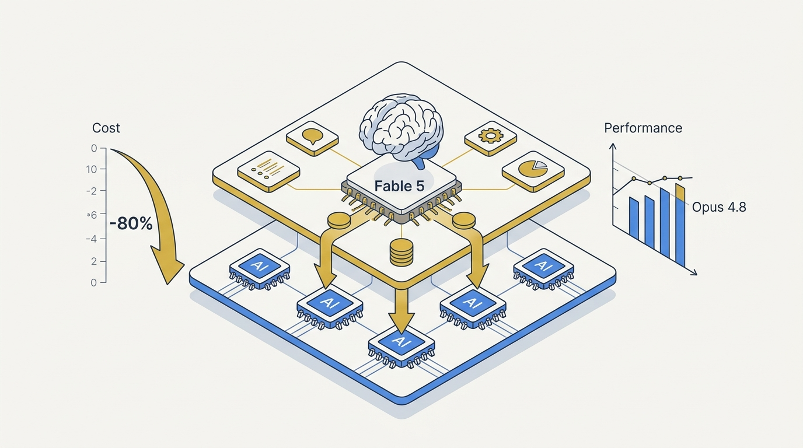
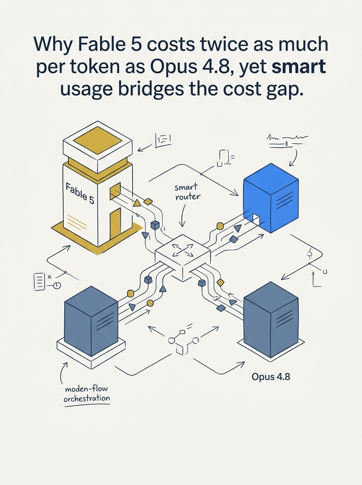
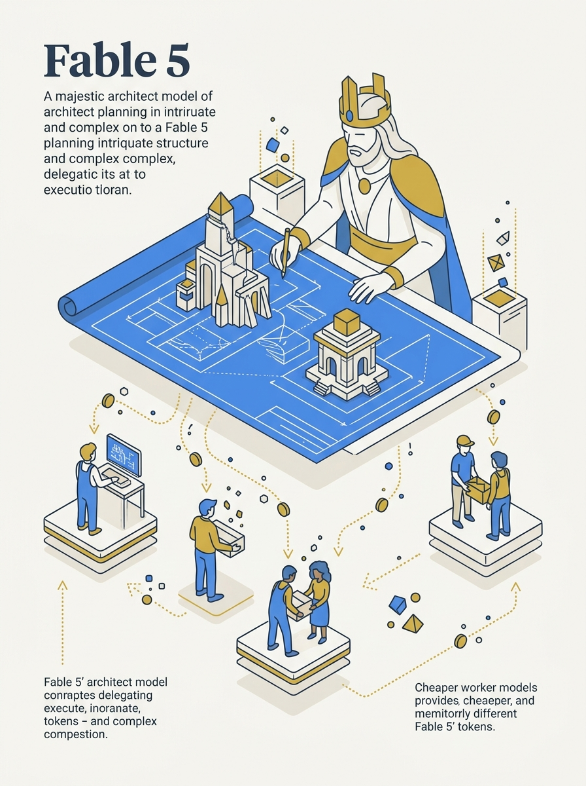

<!-- _class: title -->

# Cut Fable 5 Token Cost 80%

5 techniques that keep performance above Opus 4.8 while spending less

<!-- Speaker: Fable 5 is 2x the price of Opus 4.8 per token. This deck covers 5 concrete levers to close that gap without giving up quality. -->

---

## Cheatsheet: 5 Ways to Cut Fable 5 Cost

One panel per technique — the whole deck at a glance.

  

    
1

    <h3>/effort low/med</h3>
    
$3.76/task, 60% pass vs Opus max $13/59%

  

  

    
2

    <h3>Architect</h3>
    
Fable plans; Opus/Sonnet/GPT-5.5 execute

  

  

    
3

    <h3>Ponytail</h3>
    
−22% cost this test; 47–77% broader reports

  

  

    
4

    <h3>Cheap research</h3>
    
109 sub-agents on cheap model → Fable synthesizes

  

  

    
5

    <h3>/advisor + cap</h3>
    
max_tokens 2048 → ~7x fewer output tokens

  

<b>★ Takeaway:</b> Same figures as the rest of the deck — this panel is the dense recap, not a separate source.

<!-- Speaker: 60-second orientation — five panels, one per technique. Point at each before diving in. -->

---

## Fable 5 Costs 2x Opus 4.8 — Per Token

$10/$50 per million tokens vs $5/$25 — the gap five techniques close.

<svg viewBox="0 0 700 320" width="100%" xmlns="http://www.w3.org/2000/svg">
  <text x="20" y="40" font-size="15" font-weight="700" fill="var(--ink)" font-family="system-ui">Cost per million tokens (input / output)</text>
  <rect x="20" y="80" width="280" height="36" rx="6" fill="var(--accent)" opacity=".15"/>
  <rect x="20" y="80" width="140" height="36" rx="6" fill="var(--accent)"/>
  <text x="30" y="103" font-size="14" font-weight="700" fill="var(--paper)" font-family="system-ui">Fable 5: $10</text>
  <text x="170" y="103" font-size="14" fill="var(--ink)" font-family="system-ui">/ $50</text>
  <rect x="20" y="140" width="280" height="36" rx="6" fill="var(--muted)" opacity=".15"/>
  <rect x="20" y="140" width="70" height="36" rx="6" fill="var(--muted)"/>
  <text x="30" y="163" font-size="14" font-weight="700" fill="var(--paper)" font-family="system-ui">Opus: $5</text>
  <text x="100" y="163" font-size="14" fill="var(--ink)" font-family="system-ui">/ $25</text>
  <text x="20" y="230" font-size="15" font-weight="700" fill="var(--accent)" font-family="system-ui">2.0x</text>
  <text x="60" y="230" font-size="14" fill="var(--ink-dim)" font-family="system-ui">the raw per-token price of Opus 4.8</text>
  <text x="20" y="270" font-size="13" fill="var(--muted)" font-family="system-ui">Same rate applies whether the task needs Fable-level reasoning or not —</text>
  <text x="20" y="292" font-size="13" fill="var(--muted)" font-family="system-ui">the 5 techniques route spend to where it actually pays off.</text>
</svg>

<b>★ Takeaway:</b> Fable 5's premium is per-token, not per-task — smart routing spends it only where it earns its keep.

<!-- Speaker: Set up the problem before the 5 fixes. Cost gap is fixed by pricing; usage pattern is the lever. -->

---

## 1. Drop `/effort` to Low or Medium

Deep Suite benchmark: Fable 5 at low effort beats Opus 4.8 at max effort — cheaper and more accurate.

<svg viewBox="0 0 1100 380" width="100%" xmlns="http://www.w3.org/2000/svg">
  <rect x="40" y="20" width="490" height="340" rx="12" fill="var(--paper)" stroke="var(--accent)" stroke-width="2" style="filter:drop-shadow(var(--shadow-md))"/>
  <rect x="40" y="20" width="490" height="56" rx="12" fill="var(--accent)" opacity=".08"/>
  <text x="285" y="54" font-size="17" font-weight="700" fill="var(--accent)" text-anchor="middle" font-family="system-ui">Fable 5 — effort: low</text>
  <text x="80" y="130" font-size="34" font-weight="800" fill="var(--ink)" font-family="system-ui">$3.76</text>
  <text x="80" y="158" font-size="14" fill="var(--ink-dim)" font-family="system-ui">avg cost per task</text>
  <text x="80" y="220" font-size="34" font-weight="800" fill="var(--success)" font-family="system-ui">60%</text>
  <text x="80" y="248" font-size="14" fill="var(--ink-dim)" font-family="system-ui">pass rate</text>
  <rect x="570" y="20" width="490" height="340" rx="12" fill="var(--paper)" stroke="var(--soft-2)" stroke-width="1.5" style="filter:drop-shadow(var(--shadow-sm))"/>
  <rect x="570" y="20" width="490" height="56" rx="12" fill="var(--soft)" opacity=".8"/>
  <text x="815" y="54" font-size="17" font-weight="700" fill="var(--ink-dim)" text-anchor="middle" font-family="system-ui">Opus 4.8 — effort: max</text>
  <text x="610" y="130" font-size="34" font-weight="800" fill="var(--ink)" font-family="system-ui">$13</text>
  <text x="610" y="158" font-size="14" fill="var(--ink-dim)" font-family="system-ui">avg cost per task</text>
  <text x="610" y="220" font-size="34" font-weight="800" fill="var(--muted)" font-family="system-ui">59%</text>
  <text x="610" y="248" font-size="14" fill="var(--ink-dim)" font-family="system-ui">pass rate</text>
  <circle cx="550" cy="190" r="30" fill="var(--accent)"/>
  <text x="550" y="196" font-size="13" font-weight="700" fill="var(--paper)" text-anchor="middle" dominant-baseline="central" font-family="system-ui">&gt;80%</text>
  <text x="550" y="234" font-size="11" fill="var(--muted)" text-anchor="middle" font-family="system-ui">cheaper</text>
</svg>

<b>★ Takeaway:</b> Effort is not a price multiplier — it's less thinking/tool-call token volume, so low effort can outperform another model's max.

<!-- Speaker: Same pattern holds on Frontier Code — Fable low (~$5) matches Opus max (~$11) score. Start low, escalate only when quality demands it. -->

---

## 2. Fable 5 as Architect, Not Executor

Keep Fable 5 on decisions; hand implementation to cheaper worker models.

<svg viewBox="0 0 700 320" width="100%" xmlns="http://www.w3.org/2000/svg">
  <rect x="20" y="30" width="360" height="60" rx="10" fill="var(--accent)"/>
  <text x="40" y="55" font-size="13" font-weight="700" fill="var(--paper)" font-family="system-ui">Fable 5</text>
  <text x="40" y="76" font-size="12" fill="rgba(255,255,255,.85)" font-family="system-ui">plan / decompose / judge</text>
  <line x1="160" y1="90" x2="160" y2="130" stroke="var(--muted)" stroke-width="2"/>
  <polygon points="160,138 152,124 168,124" fill="var(--muted)"/>
  <rect x="20" y="150" width="80" height="50" rx="8" fill="var(--soft)" stroke="var(--soft-2)"/>
  <text x="60" y="180" font-size="12" fill="var(--ink)" text-anchor="middle" font-family="system-ui">Opus</text>
  <rect x="140" y="150" width="80" height="50" rx="8" fill="var(--soft)" stroke="var(--soft-2)"/>
  <text x="180" y="180" font-size="12" fill="var(--ink)" text-anchor="middle" font-family="system-ui">Sonnet</text>
  <rect x="260" y="150" width="80" height="50" rx="8" fill="var(--soft)" stroke="var(--soft-2)"/>
  <text x="300" y="180" font-size="12" fill="var(--ink)" text-anchor="middle" font-family="system-ui">GPT-5.5</text>
  <text x="20" y="250" font-size="13" fill="var(--ink-dim)" font-family="system-ui">Fable 5 stays on judgment. Boilerplate,</text>
  <text x="20" y="272" font-size="13" fill="var(--ink-dim)" font-family="system-ui">tests, chores go to cheaper workers.</text>
</svg>

<b>★ Takeaway:</b> Every boilerplate line Fable 5 writes itself burns budget at 2x the rate a delegate would.

<!-- Speaker: Do not fix Fable 5 into an "architect" role config — keep it flexibly on decisions, delegate execution ad hoc. -->

---

## 3. Ponytail Cuts Verbose, Redundant Code

Ruleset plugin: check for existing library/function before writing new code. Tested with Fable 5 at medium effort.

  

    
This test (video)

    <h3>22% cheaper</h3>
    
Ponytail + Fable 5 at effort medium, measured across the board.

  

  

    
Broader reports

    <h3>47–77% cost cut</h3>
    
Execution cost reduction reported outside this specific test.

  

  

    
Broader reports

    <h3>80–94% less code</h3>
    
Generated code volume reduction — fewer tokens to pay for.

  

<b>★ Takeaway:</b> Gains peak when the model over-builds; a codebase that's already minimal sees little benefit.

<!-- Speaker: Ponytail's "if it already exists, use it" rule stops the model from recreating library functionality from scratch. -->

---

## 4. Delegate Deep Research, Synthesize with Fable 5

A single deep-research task can spawn 109 sub-agents — run those on a cheaper model, not Fable 5.

<svg viewBox="0 0 1100 380" width="100%" xmlns="http://www.w3.org/2000/svg">
  <rect x="40" y="140" width="260" height="100" rx="10" fill="var(--soft)" stroke="var(--soft-2)"/>
  <text x="170" y="178" font-size="15" font-weight="700" fill="var(--ink)" text-anchor="middle" font-family="system-ui">Opus / Sonnet</text>
  <text x="170" y="202" font-size="13" fill="var(--ink-dim)" text-anchor="middle" font-family="system-ui">web search +</text>
  <text x="170" y="222" font-size="13" fill="var(--ink-dim)" text-anchor="middle" font-family="system-ui">context gathering</text>
  <line x1="300" y1="190" x2="420" y2="190" stroke="var(--muted)" stroke-width="2"/>
  <polygon points="428,190 414,182 414,198" fill="var(--muted)"/>
  <rect x="440" y="150" width="200" height="80" rx="10" fill="var(--paper)" stroke="var(--soft-2)" style="filter:drop-shadow(var(--shadow-sm))"/>
  <text x="540" y="185" font-size="14" font-weight="700" fill="var(--ink)" text-anchor="middle" font-family="system-ui">raw context</text>
  <text x="540" y="208" font-size="12" fill="var(--muted)" text-anchor="middle" font-family="system-ui">up to 109 sub-agents</text>
  <line x1="640" y1="190" x2="760" y2="190" stroke="var(--accent)" stroke-width="2"/>
  <polygon points="768,190 754,182 754,198" fill="var(--accent)"/>
  <rect x="780" y="140" width="280" height="100" rx="10" fill="var(--accent)"/>
  <text x="920" y="178" font-size="15" font-weight="700" fill="var(--paper)" text-anchor="middle" font-family="system-ui">Fable 5</text>
  <text x="920" y="202" font-size="13" fill="rgba(255,255,255,.85)" text-anchor="middle" font-family="system-ui">synthesize final</text>
  <text x="920" y="222" font-size="13" fill="rgba(255,255,255,.85)" text-anchor="middle" font-family="system-ui">plan / summary</text>
</svg>

<b>★ Takeaway:</b> Running 109 sub-agents on Fable 5 drains usage limits instantly — data gathering is mechanical work, not judgment.

<!-- Speaker: /deep-research fans out aggressively. Route the fan-out to cheap models; give Fable 5 only the distilled context. -->

---

## 5. `/advisor` Mode — Consult, Don't Execute

Executive model runs tools and writes; it consults Fable 5 only at key decision points.

<svg viewBox="0 0 1100 380" width="100%" xmlns="http://www.w3.org/2000/svg">
  <rect x="60" y="60" width="440" height="260" rx="12" fill="var(--paper)" stroke="var(--soft-2)" stroke-width="1.5" style="filter:drop-shadow(var(--shadow-sm))"/>
  <text x="280" y="100" font-size="16" font-weight="700" fill="var(--ink)" text-anchor="middle" font-family="system-ui">Opus / Sonnet (executive)</text>
  <text x="280" y="140" font-size="13" fill="var(--ink-dim)" text-anchor="middle" font-family="system-ui">runs tools, writes code,</text>
  <text x="280" y="162" font-size="13" fill="var(--ink-dim)" text-anchor="middle" font-family="system-ui">handles the full task</text>
  <text x="280" y="220" font-size="12" fill="var(--muted)" text-anchor="middle" font-family="system-ui">consults advisor before:</text>
  <text x="280" y="244" font-size="12" fill="var(--muted)" text-anchor="middle" font-family="system-ui">committing to an approach ·</text>
  <text x="280" y="264" font-size="12" fill="var(--muted)" text-anchor="middle" font-family="system-ui">recurring errors · declaring done</text>
  <line x1="500" y1="190" x2="600" y2="190" stroke="var(--accent)" stroke-width="2"/>
  <polygon points="608,190 594,182 594,198" fill="var(--accent)"/>
  <rect x="620" y="90" width="420" height="200" rx="12" fill="var(--accent)"/>
  <text x="830" y="130" font-size="16" font-weight="700" fill="var(--paper)" text-anchor="middle" font-family="system-ui">Fable 5 (advisor)</text>
  <text x="830" y="170" font-size="30" font-weight="800" fill="var(--paper)" text-anchor="middle" font-family="system-ui">~7x fewer</text>
  <text x="830" y="196" font-size="13" fill="rgba(255,255,255,.85)" text-anchor="middle" font-family="system-ui">output tokens with max_tokens: 2048</text>
  <text x="830" y="222" font-size="12" fill="rgba(255,255,255,.7)" text-anchor="middle" font-family="system-ui">(~4,200–5,900 → ~630–840 tokens)</text>
  <text x="830" y="252" font-size="11" fill="rgba(255,255,255,.6)" text-anchor="middle" font-family="system-ui">near-zero truncation</text>
</svg>

<b>★ Takeaway:</b> A capped advisor gets Fable-level judgment at key moments without paying Fable-level rates for the whole task.

<!-- Speaker: Advisor timing is model-driven, not rule-based — Claude decides when it's stuck enough to ask. Requires Claude Code v2.1.170+. -->

---

## Caveats: Numbers Are Test-Specific, Not Universal

Every figure in this deck came from one benchmark or one test run — treat as a ceiling, not a guarantee.

  

    
Benchmark-bound

    <h3>80% / 22% figures</h3>
    
From Deep Suite, Frontier Code, and one Ponytail test — real workloads will vary.

  

  

    
Needs the trap

    <h3>Ponytail gain ≈ 0</h3>
    
If the codebase is already minimal, there's nothing to cut.

  

  

    
Version-gated

    <h3>Advisor needs v2.1.170+</h3>
    
And org access to Fable 5 to use it as the advisor model.

  

<b>★ Takeaway:</b> Pilot each technique on your own workload before assuming the published percentage transfers.

<!-- Speaker: Set expectations before the close — these are levers, not guaranteed multipliers. -->

---

## Key Takeaways

What a reader who skips the body still needs to know.

<svg viewBox="0 0 1100 340" width="100%" xmlns="http://www.w3.org/2000/svg">
  <circle cx="550" cy="170" r="160" fill="none" stroke="var(--soft-2)" stroke-width="1.5"/>
  <circle cx="550" cy="170" r="110" fill="none" stroke="var(--accent)" stroke-width="1.5" opacity=".4"/>
  <circle cx="550" cy="170" r="60" fill="var(--accent)" opacity=".1"/>
  <circle cx="550" cy="170" r="60" fill="none" stroke="var(--accent)" stroke-width="2"/>
  <text x="550" y="164" font-size="14" font-weight="700" fill="var(--accent)" text-anchor="middle" font-family="system-ui">route spend</text>
  <text x="550" y="184" font-size="13" fill="var(--ink)" text-anchor="middle" font-family="system-ui">to where it earns</text>
  <text x="370" y="95" font-size="13" fill="var(--ink)" font-family="system-ui" text-anchor="middle">/effort low/medium</text>
  <text x="370" y="115" font-size="12" fill="var(--muted)" font-family="system-ui" text-anchor="middle">beats other models' max</text>
  <text x="740" y="95" font-size="13" fill="var(--ink)" font-family="system-ui" text-anchor="middle">Architect, not executor</text>
  <text x="740" y="115" font-size="12" fill="var(--muted)" font-family="system-ui" text-anchor="middle">delegate boilerplate</text>
  <text x="210" y="185" font-size="13" fill="var(--muted)" font-family="system-ui" text-anchor="middle">Ponytail</text>
  <text x="210" y="205" font-size="13" fill="var(--muted)" font-family="system-ui" text-anchor="middle">−22% cost</text>
  <text x="890" y="185" font-size="13" fill="var(--muted)" font-family="system-ui" text-anchor="middle">Cheap-model</text>
  <text x="890" y="205" font-size="13" fill="var(--muted)" font-family="system-ui" text-anchor="middle">deep research</text>
  <text x="550" y="290" font-size="13" fill="var(--muted)" font-family="system-ui" text-anchor="middle">/advisor mode + max_tokens cap — judgment on demand, not by default</text>
</svg>

<b>★ Takeaway:</b> None of these require dropping Fable 5 — they change when and how much of it you pay for.

