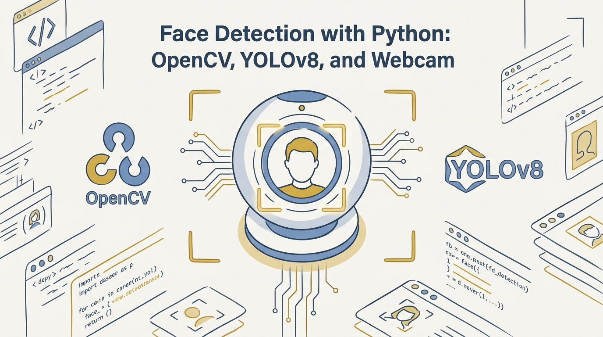
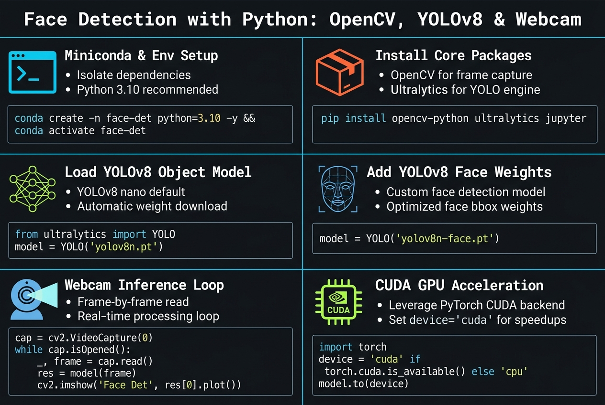

<!-- _class: title -->

# สร้างระบบ Face Detection ด้วย Python
# OpenCV, YOLOv8 และ Webcam

Miniconda → YOLOv8 object model → YOLOv8-face model → live webcam loop → GPU/CUDA speedup

<!-- Speaker: 30-second intro — this deck walks through building a real-time face detector from a blank environment to a GPU-accelerated webcam feed, based on the source YouTube tutorial + official docs. -->

---

<!-- _class: cheatsheet -->
<!-- _backgroundColor: #f8f7f4 -->

<!-- Speaker: 60-second cheatsheet orientation — point at the 6 panels (env setup, deps, object model, face model, webcam loop, CUDA) before diving into detail slides. -->

---

## TL;DR

ระบบ face detection real-time จากศูนย์ ด้วย 2 โมเดล YOLO พร้อมกันบน webcam

<svg viewBox="0 0 1100 380" width="100%" xmlns="http://www.w3.org/2000/svg">
  <rect x="60" y="40" width="980" height="300" rx="16" fill="var(--paper)" stroke="var(--soft-2)" stroke-width="1.5" style="filter:drop-shadow(0 4px 12px rgba(15,23,42,.08))"/>
  <rect x="60" y="40" width="8" height="300" rx="4" fill="var(--accent)"/>
  <circle cx="148" cy="190" r="40" fill="var(--accent)" opacity=".12"/>
  <circle cx="148" cy="190" r="28" fill="var(--accent)"/>
  <text x="148" y="196" font-size="18" fill="var(--paper)" text-anchor="middle" dominant-baseline="central" font-family="system-ui" font-weight="700">i</text>
  <text x="220" y="150" font-size="20" font-weight="700" fill="var(--ink)" font-family="system-ui">Miniconda env + opencv-python + ultralytics + jupyter</text>
  <text x="220" y="190" font-size="15" fill="var(--ink-dim)" font-family="system-ui">yolov8n.pt detects 80 COCO classes — but no "face" class</text>
  <text x="220" y="225" font-size="15" fill="var(--ink-dim)" font-family="system-ui">yolov8-face weight (akanametov/yolo-face) adds face-only detection</text>
  <text x="220" y="260" font-size="15" fill="var(--muted)" font-family="system-ui">Both models run per-frame in a while loop on the live webcam</text>
  <text x="220" y="295" font-size="15" fill="var(--muted)" font-family="system-ui">.to("cuda") on both models removes CPU bottleneck</text>
</svg>

<b>★ Takeaway:</b> Two YOLO models, one webcam loop, GPU makes it real-time.

<!-- Speaker: Frame the whole deck in one sentence before going section by section. -->

---

## ทำไม General Object Model ถึงจับหน้าไม่ได้

"person" บอกแค่มีคนในเฟรม — ไม่ใช่ตำแหน่งใบหน้า

<svg viewBox="0 0 1100 380" width="100%" xmlns="http://www.w3.org/2000/svg">
  <rect x="40" y="20" width="490" height="340" rx="12" fill="var(--paper)" stroke="var(--soft-2)" stroke-width="1.5" style="filter:drop-shadow(var(--shadow-sm))"/>
  <rect x="40" y="20" width="490" height="56" rx="12" fill="var(--soft)" opacity=".8"/>
  <text x="285" y="54" font-size="17" font-weight="700" fill="var(--ink-dim)" text-anchor="middle" font-family="system-ui">yolov8n.pt (COCO)</text>
  <rect x="150" y="110" width="180" height="220" rx="8" fill="none" stroke="var(--muted)" stroke-width="3" stroke-dasharray="6 5"/>
  <text x="240" y="102" font-size="13" fill="var(--ink-dim)" text-anchor="middle" font-family="system-ui" font-weight="700">"person" box</text>
  <circle cx="240" cy="165" r="30" fill="var(--soft-2)"/>
  <rect x="210" y="205" width="60" height="110" rx="10" fill="var(--soft-2)"/>
  <text x="285" y="300" font-size="13" fill="var(--muted)" font-family="system-ui" text-anchor="middle">whole figure, coarse</text>

  <rect x="570" y="20" width="490" height="340" rx="12" fill="var(--paper)" stroke="var(--accent)" stroke-width="2" style="filter:drop-shadow(var(--shadow-md))"/>
  <rect x="570" y="20" width="490" height="56" rx="12" fill="var(--accent)" opacity=".08"/>
  <text x="815" y="54" font-size="17" font-weight="700" fill="var(--accent)" text-anchor="middle" font-family="system-ui">yolov8-face (WIDERFACE)</text>
  <rect x="745" y="130" width="140" height="140" rx="8" fill="none" stroke="var(--accent)" stroke-width="3"/>
  <text x="815" y="122" font-size="13" fill="var(--accent)" text-anchor="middle" font-family="system-ui" font-weight="700">"face" box</text>
  <circle cx="815" cy="200" r="45" fill="var(--accent)" opacity=".12"/>
  <circle cx="815" cy="200" r="30" fill="var(--paper)" stroke="var(--accent)" stroke-width="2"/>
  <text x="815" y="300" font-size="13" fill="var(--ink)" font-family="system-ui" text-anchor="middle" font-weight="700">tight, face-only</text>
  <circle cx="550" cy="190" r="28" fill="var(--accent)"/>
  <text x="550" y="195" font-size="13" font-weight="700" fill="var(--paper)" text-anchor="middle" dominant-baseline="central" font-family="system-ui">+</text>
</svg>

<b>★ Takeaway:</b> ต้องรัน 2 โมเดลพร้อมกัน — general model + face-specific model — เพื่อได้ทั้ง context และตำแหน่งใบหน้าที่แม่นยำ

<!-- Speaker: This is the "why" slide — sets up the two-model architecture used for the rest of the deck. -->

---

## Environment Setup: Miniconda → Dependencies

Isolated env ป้องกัน dependency conflict ระหว่างโปรเจกต์

<svg viewBox="0 0 1100 320" width="100%" xmlns="http://www.w3.org/2000/svg">
  <rect x="20" y="120" width="190" height="90" rx="10" fill="var(--paper)" stroke="var(--soft-2)" stroke-width="1.5"/>
  <text x="115" y="155" font-size="13" font-weight="700" fill="var(--ink)" text-anchor="middle" font-family="system-ui">install</text>
  <text x="115" y="175" font-size="12" fill="var(--ink-dim)" text-anchor="middle" font-family="monospace">Miniconda</text>
  <path d="M215 165 L275 165" stroke="var(--muted)" stroke-width="2" marker-end="url(#arrow1)"/>

  <rect x="280" y="120" width="220" height="90" rx="10" fill="var(--paper)" stroke="var(--soft-2)" stroke-width="1.5"/>
  <text x="390" y="150" font-size="13" font-weight="700" fill="var(--ink)" text-anchor="middle" font-family="system-ui">create + activate</text>
  <text x="390" y="172" font-size="11" fill="var(--ink-dim)" text-anchor="middle" font-family="monospace">conda create -n detection_env</text>
  <text x="390" y="188" font-size="11" fill="var(--ink-dim)" text-anchor="middle" font-family="monospace">python=3.12</text>
  <path d="M505 165 L565 165" stroke="var(--muted)" stroke-width="2" marker-end="url(#arrow1)"/>

  <rect x="570" y="90" width="240" height="150" rx="10" fill="var(--accent)" opacity=".08" stroke="var(--accent)" stroke-width="2"/>
  <text x="690" y="118" font-size="13" font-weight="700" fill="var(--accent)" text-anchor="middle" font-family="system-ui">pip install</text>
  <text x="690" y="145" font-size="12" fill="var(--ink)" text-anchor="middle" font-family="monospace">opencv-python</text>
  <text x="690" y="170" font-size="12" fill="var(--ink)" text-anchor="middle" font-family="monospace">ultralytics</text>
  <text x="690" y="195" font-size="12" fill="var(--ink)" text-anchor="middle" font-family="monospace">jupyter</text>
  <path d="M815 165 L875 165" stroke="var(--muted)" stroke-width="2" marker-end="url(#arrow1)"/>

  <rect x="880" y="120" width="190" height="90" rx="10" fill="var(--success-wash)" stroke="var(--success)" stroke-width="1.5"/>
  <text x="975" y="155" font-size="13" font-weight="700" fill="var(--success-ink)" text-anchor="middle" font-family="system-ui">ready</text>
  <text x="975" y="175" font-size="11" fill="var(--success-ink)" text-anchor="middle" font-family="system-ui">Jupyter Lab open</text>

  <defs>
    <marker id="arrow1" markerWidth="8" markerHeight="8" refX="6" refY="4" orient="auto">
      <path d="M0 0 L8 4 L0 8 Z" fill="var(--muted)"/>
    </marker>
  </defs>
</svg>

<b>★ Takeaway:</b> Miniconda env แยก + pip install 3 package ก็พร้อมเขียนโค้ดตรวจจับหน้าได้แล้ว

<!-- Speaker: Quick walkthrough of the 4-step setup — most viewers already know conda, don't over-explain. -->

---

## Load YOLOv8: Object Detection ก่อน

yolov8n.pt = COCO pretrained, 80 classes, ไม่มี class "face"

<svg viewBox="0 0 1100 360" width="100%" xmlns="http://www.w3.org/2000/svg">
  <rect x="60" y="30" width="500" height="300" rx="12" fill="#0f172a" stroke="var(--soft-2)" stroke-width="1"/>
  <text x="90" y="70" font-size="14" fill="#93c5fd" font-family="monospace">from ultralytics import YOLO</text>
  <text x="90" y="100" font-size="14" fill="#e2e8f0" font-family="monospace"></text>
  <text x="90" y="130" font-size="14" fill="#a8ff3e" font-family="monospace">model = YOLO("yolov8n.pt")</text>
  <text x="90" y="160" font-size="14" fill="#a8ff3e" font-family="monospace">results = model("image.jpg")</text>
  <text x="90" y="210" font-size="12" fill="#94a3b8" font-family="monospace"># auto-downloads weights</text>
  <text x="90" y="235" font-size="12" fill="#94a3b8" font-family="monospace"># if not present locally</text>

  <rect x="610" y="30" width="430" height="300" rx="12" fill="var(--paper)" stroke="var(--soft-2)" stroke-width="1.5"/>
  <text x="825" y="65" font-size="16" font-weight="700" fill="var(--ink)" text-anchor="middle" font-family="system-ui">5 size variants</text>
  <text x="700" y="105" font-size="14" fill="var(--ink-dim)" font-family="monospace">n  — nano, fastest</text>
  <text x="700" y="135" font-size="14" fill="var(--ink-dim)" font-family="monospace">s  — small</text>
  <text x="700" y="165" font-size="14" fill="var(--ink-dim)" font-family="monospace">m  — medium</text>
  <text x="700" y="195" font-size="14" fill="var(--ink-dim)" font-family="monospace">l  — large</text>
  <text x="700" y="225" font-size="14" fill="var(--ink-dim)" font-family="monospace">x  — extra-large, most accurate</text>
  <rect x="700" y="255" width="270" height="50" rx="8" fill="var(--warning-wash)"/>
  <text x="835" y="286" font-size="13" fill="var(--warning-ink)" text-anchor="middle" font-family="system-ui" font-weight="700">80 COCO classes — no "face"</text>
</svg>

<b>★ Takeaway:</b> YOLOv8 มาตรฐานเก่งเรื่อง object ทั่วไป แต่ต้องเสริมโมเดลแยกสำหรับ "face" โดยเฉพาะ

<!-- Speaker: Establish the baseline model before introducing the face-specific weight in the next slide. -->

---

## เพิ่ม YOLOv8-Face Model จาก GitHub

akanametov/yolo-face — train เฉพาะบน WIDERFACE dataset

<svg viewBox="0 0 1100 360" width="100%" xmlns="http://www.w3.org/2000/svg">
  <rect x="60" y="30" width="480" height="300" rx="12" fill="var(--paper)" stroke="var(--accent)" stroke-width="2"/>
  <text x="300" y="65" font-size="16" font-weight="700" fill="var(--accent)" text-anchor="middle" font-family="system-ui">akanametov/yolo-face</text>
  <text x="90" y="105" font-size="13" fill="var(--ink-dim)" font-family="system-ui">Face-only weights, multi-version:</text>
  <text x="90" y="140" font-size="13" fill="var(--ink)" font-family="monospace">yolov8n-face.pt</text>
  <text x="90" y="165" font-size="13" fill="var(--ink)" font-family="monospace">yolov8m-face.pt</text>
  <text x="90" y="190" font-size="13" fill="var(--ink)" font-family="monospace">yolov8l-face.pt</text>
  <text x="90" y="225" font-size="12" fill="var(--muted)" font-family="system-ui">also: v6 / v10 / v11 / v12 variants</text>
  <rect x="90" y="250" width="400" height="60" rx="8" fill="var(--warning-wash)"/>
  <text x="290" y="278" font-size="12" fill="var(--warning-ink)" text-anchor="middle" font-family="system-ui" font-weight="700">GPL-3.0 License</text>
  <text x="290" y="298" font-size="11" fill="var(--warning-ink)" text-anchor="middle" font-family="system-ui">Enterprise License for commercial use</text>

  <rect x="590" y="30" width="450" height="300" rx="12" fill="#0f172a" stroke="var(--soft-2)" stroke-width="1"/>
  <text x="620" y="70" font-size="14" fill="#a8ff3e" font-family="monospace">face_model = YOLO(</text>
  <text x="640" y="95" font-size="14" fill="#a8ff3e" font-family="monospace">  "yolov8m-face.pt")</text>
  <text x="620" y="140" font-size="12" fill="#94a3b8" font-family="monospace"># run both models, same frame</text>
  <text x="620" y="170" font-size="14" fill="#93c5fd" font-family="monospace">obj = model(frame)</text>
  <text x="620" y="195" font-size="14" fill="#93c5fd" font-family="monospace">face = face_model(frame)</text>
  <text x="620" y="230" font-size="12" fill="#94a3b8" font-family="monospace"># overlay both bounding-box sets</text>
  <text x="620" y="255" font-size="12" fill="#94a3b8" font-family="monospace"># on the same annotated frame</text>
</svg>

<b>★ Takeaway:</b> โมเดลจาก community repo ไม่ใช่ Ultralytics official — เช็ก license (GPL-3.0) ก่อนใช้เชิงพาณิชย์

<!-- Speaker: Point out the two side-by-side model calls — this dual-model pattern is the core trick of the whole tutorial. -->

---

## Live Webcam Inference: While Loop

cv2.VideoCapture → cap.read() → predict → imshow → waitKey

<svg viewBox="0 0 1100 340" width="100%" xmlns="http://www.w3.org/2000/svg">
  <rect x="10" y="130" width="190" height="80" rx="10" fill="var(--paper)" stroke="var(--soft-2)" stroke-width="1.5"/>
  <text x="105" y="165" font-size="12" font-weight="700" fill="var(--ink)" text-anchor="middle" font-family="system-ui">open camera</text>
  <text x="105" y="185" font-size="11" fill="var(--ink-dim)" text-anchor="middle" font-family="monospace">VideoCapture(0)</text>
  <path d="M205 170 L255 170" stroke="var(--muted)" stroke-width="2" marker-end="url(#arrow2)"/>

  <rect x="260" y="90" width="190" height="160" rx="10" fill="var(--accent)" opacity=".08" stroke="var(--accent)" stroke-width="2"/>
  <text x="355" y="115" font-size="12" font-weight="700" fill="var(--accent)" text-anchor="middle" font-family="system-ui">while True:</text>
  <text x="355" y="145" font-size="11" fill="var(--ink)" text-anchor="middle" font-family="monospace">ret, frame</text>
  <text x="355" y="163" font-size="11" fill="var(--ink)" text-anchor="middle" font-family="monospace">= cap.read()</text>
  <path d="M355 250 L355 280 L305 280" stroke="var(--accent)" stroke-width="1.5" fill="none" marker-end="url(#arrow3)" stroke-dasharray="4 3"/>
  <text x="330" y="300" font-size="10" fill="var(--accent)" text-anchor="middle" font-family="system-ui">loop</text>
  <path d="M450 170 L500 170" stroke="var(--muted)" stroke-width="2" marker-end="url(#arrow2)"/>

  <rect x="505" y="130" width="190" height="80" rx="10" fill="var(--paper)" stroke="var(--soft-2)" stroke-width="1.5"/>
  <text x="600" y="160" font-size="12" font-weight="700" fill="var(--ink)" text-anchor="middle" font-family="system-ui">predict</text>
  <text x="600" y="180" font-size="11" fill="var(--ink-dim)" text-anchor="middle" font-family="system-ui">model + face_model</text>
  <path d="M700 170 L750 170" stroke="var(--muted)" stroke-width="2" marker-end="url(#arrow2)"/>

  <rect x="755" y="130" width="170" height="80" rx="10" fill="var(--paper)" stroke="var(--soft-2)" stroke-width="1.5"/>
  <text x="840" y="160" font-size="12" font-weight="700" fill="var(--ink)" text-anchor="middle" font-family="system-ui">imshow()</text>
  <text x="840" y="180" font-size="11" fill="var(--ink-dim)" text-anchor="middle" font-family="system-ui">annotated frame</text>
  <path d="M930 170 L980 170" stroke="var(--muted)" stroke-width="2" marker-end="url(#arrow2)"/>

  <rect x="985" y="130" width="105" height="80" rx="10" fill="var(--danger-wash)" stroke="var(--danger)" stroke-width="1.5"/>
  <text x="1037" y="160" font-size="11" font-weight="700" fill="var(--danger-ink)" text-anchor="middle" font-family="system-ui">waitKey</text>
  <text x="1037" y="178" font-size="10" fill="var(--danger-ink)" text-anchor="middle" font-family="system-ui">"q" → break</text>

  <defs>
    <marker id="arrow2" markerWidth="8" markerHeight="8" refX="6" refY="4" orient="auto"><path d="M0 0 L8 4 L0 8 Z" fill="var(--muted)"/></marker>
    <marker id="arrow3" markerWidth="8" markerHeight="8" refX="6" refY="4" orient="auto"><path d="M0 0 L8 4 L0 8 Z" fill="var(--accent)"/></marker>
  </defs>
</svg>

<b>★ Takeaway:</b> loop วนอ่านทีละเฟรม → ประมวลผล 2 โมเดล → แสดงผล → เช็คปุ่ม "q" เพื่อปิดกล้องอย่างถูกต้อง

<!-- Speaker: This is the runtime loop — emphasize that both models run inside the same loop iteration, per frame. -->

---

## ลดความหน่วง: GPU/CUDA ผ่าน PyTorch

รัน 2 โมเดลพร้อมกันบน CPU หนักมาก — .to("cuda") คือทางออก

<svg viewBox="0 0 1100 380" width="100%" xmlns="http://www.w3.org/2000/svg">
  <rect x="40" y="20" width="490" height="340" rx="12" fill="var(--paper)" stroke="var(--soft-2)" stroke-width="1.5" style="filter:drop-shadow(var(--shadow-sm))"/>
  <rect x="40" y="20" width="490" height="56" rx="12" fill="var(--danger-wash)" opacity=".6"/>
  <text x="285" y="54" font-size="17" font-weight="700" fill="var(--danger-ink)" text-anchor="middle" font-family="system-ui">CPU only</text>
  <text x="80" y="120" font-size="14" fill="var(--ink)" font-family="system-ui">2 YOLO models per frame</text>
  <text x="80" y="150" font-size="14" fill="var(--ink-dim)" font-family="system-ui">Frame rate drops sharply</text>
  <text x="80" y="180" font-size="14" fill="var(--muted)" font-family="system-ui">Choppy, laggy video feed</text>

  <rect x="570" y="20" width="490" height="340" rx="12" fill="var(--paper)" stroke="var(--accent)" stroke-width="2" style="filter:drop-shadow(var(--shadow-md))"/>
  <rect x="570" y="20" width="490" height="56" rx="12" fill="var(--success-wash)"/>
  <text x="815" y="54" font-size="17" font-weight="700" fill="var(--success-ink)" text-anchor="middle" font-family="system-ui">NVIDIA GPU + CUDA</text>
  <text x="610" y="115" font-size="13" fill="var(--ink)" font-family="monospace">1. nvidia-smi   # check CUDA ver</text>
  <text x="610" y="150" font-size="13" fill="var(--ink)" font-family="monospace">2. install PyTorch CUDA build</text>
  <text x="610" y="165" font-size="11" fill="var(--muted)" font-family="system-ui">   pytorch.org/get-started/locally</text>
  <text x="610" y="205" font-size="13" fill="var(--ink)" font-family="monospace">3. model.to("cuda")</text>
  <text x="610" y="230" font-size="13" fill="var(--ink)" font-family="monospace">   face_model.to("cuda")</text>
  <rect x="610" y="255" width="410" height="45" rx="8" fill="var(--success-wash)"/>
  <text x="815" y="283" font-size="13" fill="var(--success-ink)" text-anchor="middle" font-family="system-ui" font-weight="700">smooth, real-time video feed</text>
  <circle cx="550" cy="190" r="28" fill="var(--accent)"/>
  <text x="550" y="195" font-size="13" font-weight="700" fill="var(--paper)" text-anchor="middle" dominant-baseline="central" font-family="system-ui">VS</text>
</svg>

<b>★ Takeaway:</b> ถ้า frame rate ตก ให้เช็ก nvidia-smi → ติดตั้ง PyTorch CUDA build → .to("cuda") ทั้งสองโมเดล

<!-- Speaker: This is the payoff slide — the whole reason multi-model inference becomes practical for real-time use. -->

---

## Quick Start: 5 ขั้นตอนหลัก

จาก environment เปล่า ถึง real-time face detection บน GPU

  

    
Step 1

    <h3>Setup env</h3>
    
Miniconda + conda env + pip install 3 packages

  

  

    
Step 2

    <h3>Test base model</h3>
    
yolov8n.pt บนภาพนิ่งก่อน ยืนยัน detect วัตถุได้

  

  

    
Step 3

    <h3>Add face model</h3>
    
ดาวน์โหลด yolov8-face จาก GitHub, รันคู่กับ obj model

  

  

    
Step 4

    <h3>Webcam loop</h3>
    
VideoCapture + while + imshow + waitKey("q")

  

  

    
Step 5

    <h3>GPU speedup</h3>
    
ติดตั้ง PyTorch CUDA, .to("cuda") ทั้งสองโมเดล

  

<b>★ Takeaway:</b> ทดสอบทีละ step บนภาพนิ่งก่อนต่อ webcam — debug ง่ายกว่าไล่จับ bug บน live loop

<!-- Speaker: Recommend testing static-image inference before wiring up the webcam loop — saves debugging time. -->

---

## Caveats / Limits

สิ่งที่ต้องระวังก่อนเอาไปใช้จริง

  

    
License

    <h3>Community model</h3>
    
yolov8-face เป็น GPL-3.0 — เช็กเงื่อนไขก่อนใช้เชิงพาณิชย์ หรือใช้ Enterprise License

  

  

    
Performance

    <h3>CPU bottleneck</h3>
    
รัน 2 โมเดลพร้อมกันบน CPU กิน resource สูง ไม่มี GPU จะเจอ latency สูง

  

  

    
Scope

    <h3>Detection ≠ Recognition</h3>
    
โมเดลนี้บอกแค่ "มีใบหน้าตรงนี้" ไม่ identify ว่าใบหน้าเป็นใคร

  

<b>★ Takeaway:</b> ก่อน deploy จริง เช็ก license, benchmark บน hardware จริง, และอย่าสับสน detection กับ recognition

<!-- Speaker: These are the three things most likely to bite someone shipping this to production. -->

---

## Key Takeaways

สิ่งที่ต้องจำแม้ข้ามเนื้อหาทั้งหมด

<svg viewBox="0 0 1100 340" width="100%" xmlns="http://www.w3.org/2000/svg">
  <circle cx="550" cy="170" r="160" fill="none" stroke="var(--soft-2)" stroke-width="1.5"/>
  <circle cx="550" cy="170" r="110" fill="none" stroke="var(--accent)" stroke-width="1.5" opacity=".4"/>
  <circle cx="550" cy="170" r="60" fill="var(--accent)" opacity=".1"/>
  <circle cx="550" cy="170" r="60" fill="none" stroke="var(--accent)" stroke-width="2"/>
  <text x="550" y="164" font-size="14" font-weight="700" fill="var(--accent)" text-anchor="middle" font-family="system-ui">2 models</text>
  <text x="550" y="184" font-size="12" fill="var(--ink)" text-anchor="middle" font-family="system-ui">one loop</text>
  <text x="380" y="95" font-size="13" fill="var(--ink)" font-family="system-ui" text-anchor="middle">COCO ≠ face</text>
  <text x="380" y="115" font-size="12" fill="var(--muted)" font-family="system-ui" text-anchor="middle">need face weight</text>
  <text x="730" y="95" font-size="13" fill="var(--ink)" font-family="system-ui" text-anchor="middle">VideoCapture</text>
  <text x="730" y="115" font-size="12" fill="var(--muted)" font-family="system-ui" text-anchor="middle">+ while + imshow</text>
  <text x="220" y="175" font-size="13" fill="var(--muted)" font-family="system-ui" text-anchor="middle">Miniconda</text>
  <text x="220" y="195" font-size="13" fill="var(--muted)" font-family="system-ui" text-anchor="middle">isolated env</text>
  <text x="880" y="175" font-size="13" fill="var(--muted)" font-family="system-ui" text-anchor="middle">CUDA</text>
  <text x="880" y="195" font-size="13" fill="var(--muted)" font-family="system-ui" text-anchor="middle">.to("cuda")</text>
</svg>

<b>★ Takeaway:</b> Face detection ≠ recognition — และ community model มักมี license เข้มกว่า official ต้องเช็กก่อนใช้เชิงพาณิชย์

