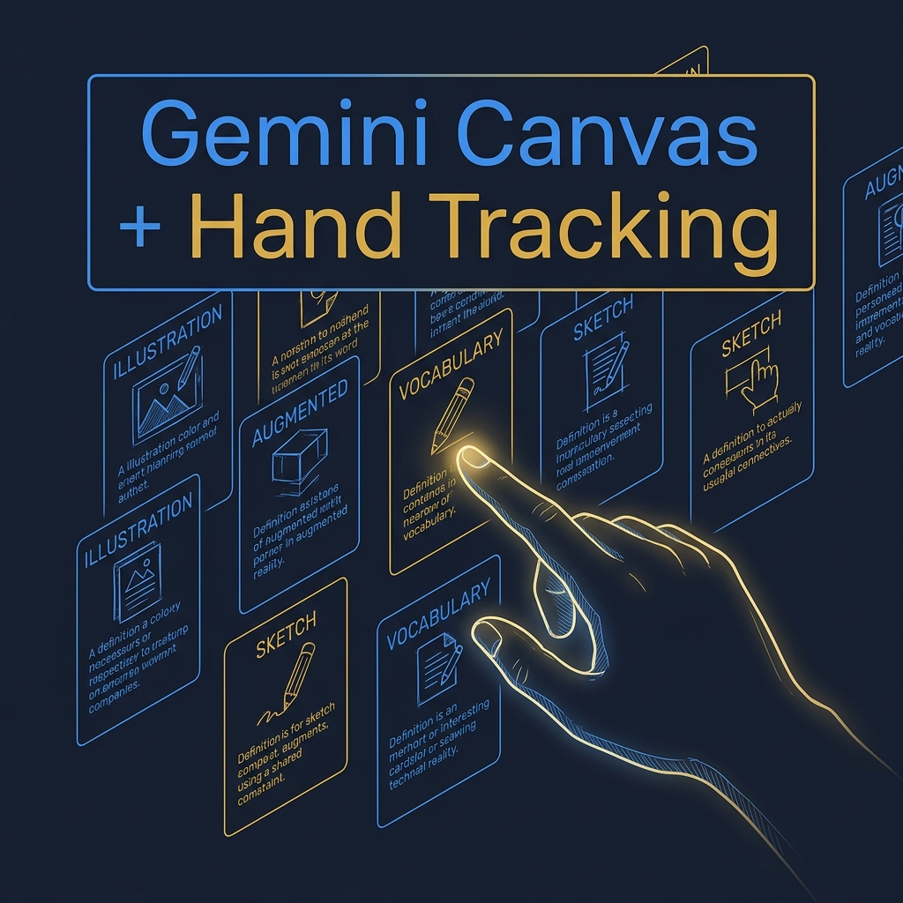
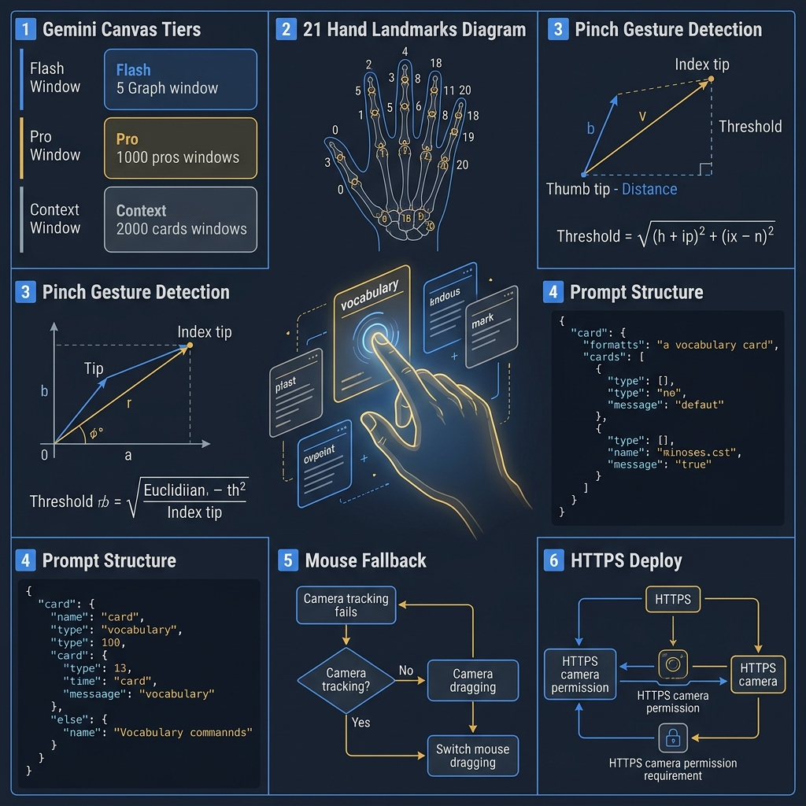
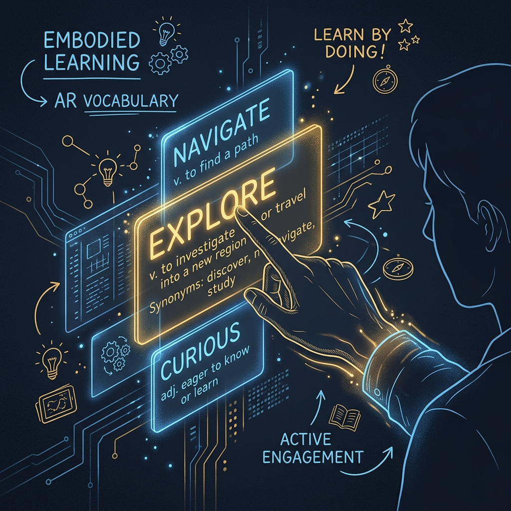
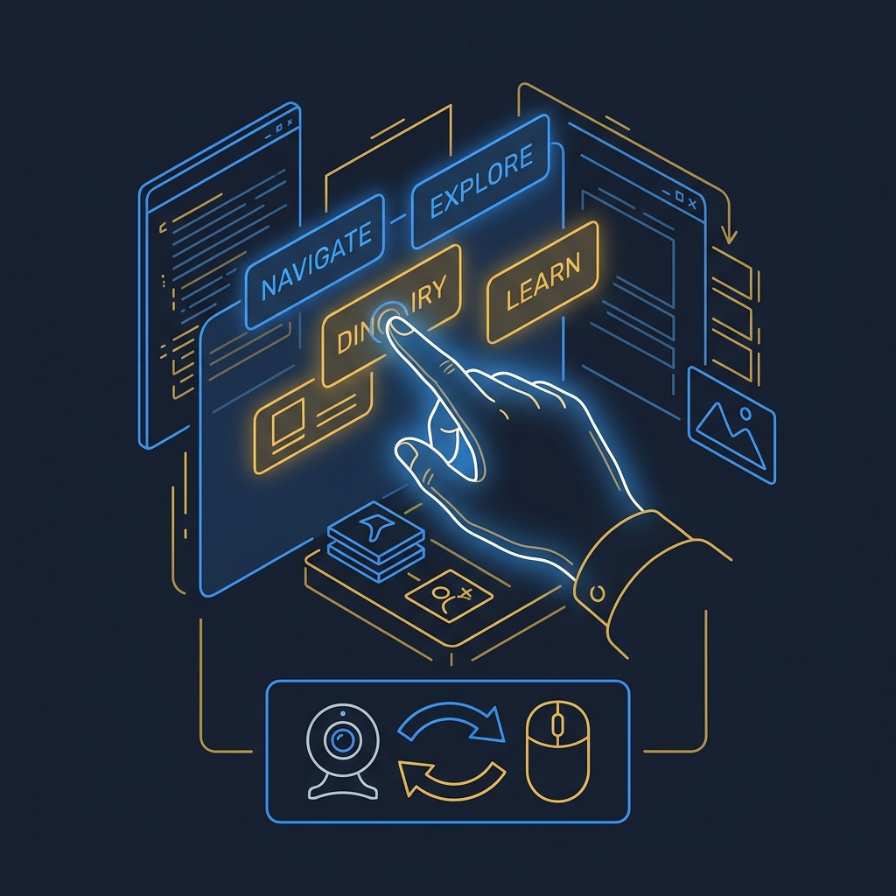

<!-- _class: title -->

# สร้างเกม AR WebApp
# ลากวางการ์ดคำศัพท์
# ด้วย Gemini Canvas + Hand Tracking

Prompt → HTML → เล่นด้วยมือจริง ไม่ต้องเขียน WebRTC หรือ MediaPipe API เอง

<!-- Speaker: เกม AR ที่ควบคุมด้วยมือเคยต้องใช้ทักษะ Computer Vision เฉพาะ — วันนี้ Gemini Canvas + MediaPipe ทำให้ทุกคนสร้างได้จาก prompt -->

---

<!-- _class: cheatsheet -->
<!-- _backgroundColor: #f8f7f4 -->

<!-- Speaker: ภาพรวมทั้ง deck — Canvas tiers, 21 landmarks, pinch detection, prompt structure, mouse fallback, HTTPS deploy -->

---

## TL;DR: Prompt → AR Game ใน 5 นาที

ไม่ต้องรู้ MediaPipe API — แค่ describe ให้ถูกและใส่ fallback ตั้งแต่ต้น

<svg viewBox="0 0 1100 320" width="100%" xmlns="http://www.w3.org/2000/svg">
  <rect x="40" y="40" width="980" height="240" rx="16" fill="var(--paper)" stroke="var(--soft-2)" stroke-width="1.5" style="filter:drop-shadow(0 4px 12px rgba(15,23,42,.08))"/>
  <rect x="40" y="40" width="8" height="240" rx="4" fill="var(--accent)"/>
  <!-- Row 1 -->
  <circle cx="128" cy="110" r="28" fill="var(--accent)" opacity=".12"/>
  <circle cx="128" cy="110" r="20" fill="var(--accent)"/>
  <text x="128" y="116" font-size="14" fill="var(--paper)" text-anchor="middle" font-family="system-ui" font-weight="700">1</text>
  <text x="175" y="104" font-size="17" font-weight="700" fill="var(--ink)" font-family="system-ui">Gemini Canvas + Pro model</text>
  <text x="175" y="126" font-size="14" fill="var(--ink-dim)" font-family="system-ui">gemini.google.com → Canvas → describe your game</text>
  <!-- Row 2 -->
  <circle cx="128" cy="190" r="28" fill="var(--gold)" opacity=".15"/>
  <circle cx="128" cy="190" r="20" fill="var(--gold)"/>
  <text x="128" y="196" font-size="14" fill="var(--paper)" text-anchor="middle" font-family="system-ui" font-weight="700">2</text>
  <text x="175" y="184" font-size="17" font-weight="700" fill="var(--ink)" font-family="system-ui">MediaPipe Hand Tracking on-device</text>
  <text x="175" y="206" font-size="14" fill="var(--ink-dim)" font-family="system-ui">21 landmarks per hand — landmark #8 (index tip) drives drag</text>
  <!-- Row 3 -->
  <circle cx="128" cy="270" r="28" fill="var(--success)" opacity=".12"/>
  <circle cx="128" cy="270" r="20" fill="var(--success)"/>
  <text x="128" y="276" font-size="14" fill="var(--paper)" text-anchor="middle" font-family="system-ui" font-weight="700">3</text>
  <text x="175" y="264" font-size="17" font-weight="700" fill="var(--ink)" font-family="system-ui">Copy code — share links are not permanent</text>
  <text x="175" y="286" font-size="14" fill="var(--ink-dim)" font-family="system-ui">Canvas &lt;/&gt; view → Select All → save as .html</text>
</svg>

<b>★ Takeaway:</b> Gemini writes the WebRTC + MediaPipe glue; you write the game idea in plain language.

<!-- Speaker: 3 core moves — Canvas+Pro, hand landmarks, save locally -->

---

## AR Game ไม่ใช่ของ dev เฉพาะทางอีกต่อไป

Gemini Canvas เปลี่ยนกติกา — WebRTC + Canvas API กลายเป็น generated output ไม่ใช่ prerequisite

<svg viewBox="0 0 700 280" width="100%" xmlns="http://www.w3.org/2000/svg">
  <!-- Before column -->
  <rect x="20" y="20" width="300" height="240" rx="12" fill="var(--soft)" stroke="var(--soft-2)" stroke-width="1.5"/>
  <text x="170" y="52" font-size="15" font-weight="700" fill="var(--ink-dim)" text-anchor="middle" font-family="system-ui">Before Gemini Canvas</text>
  <text x="40" y="90" font-size="13" fill="var(--ink-dim)" font-family="system-ui">WebRTC camera init</text>
  <text x="40" y="116" font-size="13" fill="var(--ink-dim)" font-family="system-ui">MediaPipe WASM load</text>
  <text x="40" y="142" font-size="13" fill="var(--ink-dim)" font-family="system-ui">Landmark normalization</text>
  <text x="40" y="168" font-size="13" fill="var(--ink-dim)" font-family="system-ui">Canvas 2D collision logic</text>
  <text x="40" y="194" font-size="13" fill="var(--ink-dim)" font-family="system-ui">Game loop + requestAnimationFrame</text>
  <text x="40" y="230" font-size="12" fill="var(--muted)" font-family="system-ui">Hours of boilerplate</text>
  <!-- Arrow -->
  <text x="350" y="155" font-size="28" fill="var(--accent)" text-anchor="middle" font-family="system-ui">→</text>
  <!-- After column -->
  <rect x="380" y="20" width="300" height="240" rx="12" fill="var(--accent-wash)" stroke="var(--accent)" stroke-width="2"/>
  <text x="530" y="52" font-size="15" font-weight="700" fill="var(--accent-deep)" text-anchor="middle" font-family="system-ui">With Gemini Canvas</text>
  <text x="400" y="100" font-size="13" fill="var(--ink)" font-family="system-ui">Describe game in plain language</text>
  <text x="400" y="135" font-size="13" fill="var(--ink)" font-family="system-ui">Gemini generates all the above</text>
  <text x="400" y="170" font-size="13" fill="var(--ink)" font-family="system-ui">Preview in browser immediately</text>
  <text x="400" y="215" font-size="12" fill="var(--success)" font-weight="700" font-family="system-ui">Under 5 minutes</text>
</svg>

<b>★ Takeaway:</b> Embodied learning games — เด็กเรียนคำศัพท์ดีขึ้นเมื่อร่างกายมีส่วนร่วม — ตอนนี้ prototype ได้เร็วพอจะทดสอบในห้องเรียนจริง

<!-- Speaker: shift from writing infrastructure to writing intent -->

---

## Gemini Canvas: เลือก Tier ให้ถูกก่อนเริ่ม

Complex HTML game ต้องการ context ขนาดใหญ่และโมเดลที่แรงพอ — Free tier อาจ timeout

  

    
Free Tier

    <h3>Gemini Standard</h3>
    
Context จำกัด — เหมาะ landing page หรือ simple widget แต่ game loop + MediaPipe init อาจ generate ไม่ครบ หรือ truncate กลางโค้ด

  

  

    
Google AI Pro / Ultra — Recommended

    <h3>Gemini 3.1 Pro</h3>
    
Context สูงสุด 1 ล้าน token — generate HTML ซับซ้อนได้ครบในรอบเดียว ไม่ต้อง iterate เพื่อแก้ truncation

  

<b>★ Takeaway:</b> ลงทุน Pro subscription คุ้มค่าสำหรับ MediaPipe app — context 1M token คือความต่างระหว่างโค้ดครบกับโค้ดขาดกลาง

<!-- Speaker: gemini.google.com → Canvas → settings icon → select Gemini 3.1 Pro -->

---

## MediaPipe Hands: 21 Landmarks On-Device

ML ทั้งหมดทำงานบนเครื่อง — ไม่มี server roundtrip ทำให้ game feel instant

<svg viewBox="0 0 1100 360" width="100%" xmlns="http://www.w3.org/2000/svg">
  <!-- Hand palm base -->
  <ellipse cx="420" cy="270" rx="120" ry="70" fill="var(--soft)" stroke="var(--soft-2)" stroke-width="2"/>
  <!-- Wrist -->
  <circle cx="420" cy="320" r="10" fill="var(--muted)"/>
  <text x="445" y="325" font-size="12" fill="var(--muted)" font-family="system-ui">0 WRIST</text>
  <!-- Thumb -->
  <line x1="310" y1="260" x2="270" y2="230" stroke="var(--muted)" stroke-width="2"/>
  <line x1="270" y1="230" x2="240" y2="195" stroke="var(--muted)" stroke-width="2"/>
  <line x1="240" y1="195" x2="220" y2="160" stroke="var(--muted)" stroke-width="2"/>
  <circle cx="310" cy="260" r="7" fill="var(--muted)"/>
  <circle cx="270" cy="230" r="7" fill="var(--muted)"/>
  <circle cx="240" cy="195" r="7" fill="var(--muted)"/>
  <circle cx="220" cy="160" r="9" fill="var(--muted)" stroke="var(--paper)" stroke-width="2"/>
  <text x="195" y="148" font-size="11" fill="var(--muted)" font-family="system-ui" text-anchor="middle">4 tip</text>
  <!-- Index finger -->
  <line x1="360" y1="220" x2="340" y2="160" stroke="var(--accent)" stroke-width="2.5"/>
  <line x1="340" y1="160" x2="330" y2="110" stroke="var(--accent)" stroke-width="2.5"/>
  <line x1="330" y1="110" x2="325" y2="65" stroke="var(--accent)" stroke-width="2.5"/>
  <circle cx="360" cy="220" r="7" fill="var(--accent)" opacity=".6"/>
  <circle cx="340" cy="160" r="7" fill="var(--accent)" opacity=".6"/>
  <circle cx="330" cy="110" r="7" fill="var(--accent)" opacity=".6"/>
  <circle cx="325" cy="65" r="11" fill="var(--accent)" stroke="var(--paper)" stroke-width="2"/>
  <text x="325" y="70" font-size="10" fill="var(--paper)" text-anchor="middle" font-family="system-ui" font-weight="700">8</text>
  <text x="360" y="48" font-size="13" font-weight="700" fill="var(--accent)" font-family="system-ui">INDEX TIP #8</text>
  <text x="360" y="64" font-size="11" fill="var(--ink-dim)" font-family="system-ui">drag cursor</text>
  <!-- Middle finger -->
  <line x1="415" y1="210" x2="415" y2="145" stroke="var(--muted)" stroke-width="2"/>
  <line x1="415" y1="145" x2="415" y2="90" stroke="var(--muted)" stroke-width="2"/>
  <line x1="415" y1="90" x2="415" y2="45" stroke="var(--muted)" stroke-width="2"/>
  <circle cx="415" cy="210" r="7" fill="var(--muted)"/>
  <circle cx="415" cy="145" r="7" fill="var(--muted)"/>
  <circle cx="415" cy="90" r="7" fill="var(--muted)"/>
  <circle cx="415" cy="45" r="9" fill="var(--muted)" stroke="var(--paper)" stroke-width="2"/>
  <text x="430" y="40" font-size="11" fill="var(--muted)" font-family="system-ui">12</text>
  <!-- Ring finger -->
  <line x1="470" y1="215" x2="480" y2="155" stroke="var(--muted)" stroke-width="2"/>
  <line x1="480" y1="155" x2="488" y2="105" stroke="var(--muted)" stroke-width="2"/>
  <line x1="488" y1="105" x2="492" y2="60" stroke="var(--muted)" stroke-width="2"/>
  <circle cx="470" cy="215" r="7" fill="var(--muted)"/>
  <circle cx="480" cy="155" r="7" fill="var(--muted)"/>
  <circle cx="488" cy="105" r="7" fill="var(--muted)"/>
  <circle cx="492" cy="60" r="9" fill="var(--muted)" stroke="var(--paper)" stroke-width="2"/>
  <text x="506" y="55" font-size="11" fill="var(--muted)" font-family="system-ui">16</text>
  <!-- Pinky -->
  <line x1="520" y1="235" x2="540" y2="185" stroke="var(--muted)" stroke-width="2"/>
  <line x1="540" y1="185" x2="555" y2="150" stroke="var(--muted)" stroke-width="2"/>
  <line x1="555" y1="150" x2="565" y2="120" stroke="var(--muted)" stroke-width="2"/>
  <circle cx="520" cy="235" r="7" fill="var(--muted)"/>
  <circle cx="540" cy="185" r="7" fill="var(--muted)"/>
  <circle cx="555" cy="150" r="7" fill="var(--muted)"/>
  <circle cx="565" cy="120" r="9" fill="var(--muted)" stroke="var(--paper)" stroke-width="2"/>
  <text x="578" y="115" font-size="11" fill="var(--muted)" font-family="system-ui">20</text>
  <!-- Info panel right -->
  <rect x="660" y="40" width="400" height="280" rx="12" fill="var(--soft)" stroke="var(--soft-2)" stroke-width="1.5"/>
  <rect x="660" y="40" width="400" height="48" rx="12" fill="var(--accent)" opacity=".08"/>
  <text x="860" y="70" font-size="15" font-weight="700" fill="var(--accent-deep)" text-anchor="middle" font-family="system-ui">Pinch Drag Detection</text>
  <text x="680" y="115" font-size="13" fill="var(--ink)" font-family="system-ui">Thumb tip: landmark #4</text>
  <text x="680" y="138" font-size="13" fill="var(--ink)" font-family="system-ui">Index tip: landmark #8</text>
  <text x="680" y="175" font-size="13" fill="var(--ink-dim)" font-family="system-ui">distance(4, 8) &lt; 40px</text>
  <text x="680" y="198" font-size="13" fill="var(--success)" font-weight="700" font-family="system-ui">= PINCH (grab card)</text>
  <text x="680" y="238" font-size="13" fill="var(--ink-dim)" font-family="system-ui">coordinates: normalized</text>
  <text x="680" y="258" font-size="13" fill="var(--ink-dim)" font-family="system-ui">0.0 – 1.0 per axis</text>
  <text x="680" y="296" font-size="12" fill="var(--muted)" font-family="system-ui">On-device — zero server latency</text>
  <rect x="660" y="318" width="0" height="0"/>
</svg>

<b>★ Takeaway:</b> Specify landmark indices explicitly in your prompt — #8 + #4 for pinch; Gemini guesses wrong without them.

<!-- Speaker: 21 points per hand, all processed locally; pinch = distance between thumb and index tip -->

---

## Game Loop: Webcam → Pinch → Drop

4 ขั้นตอนที่ Gemini generate ให้ทั้งหมด — คุณแค่ describe ผ่าน prompt

<svg viewBox="0 0 1100 300" width="100%" xmlns="http://www.w3.org/2000/svg">
  <!-- Step boxes -->
  <rect x="30" y="80" width="200" height="140" rx="12" fill="var(--paper)" stroke="var(--soft-2)" stroke-width="1.5" style="filter:drop-shadow(0 4px 8px rgba(15,23,42,.08))"/>
  <rect x="30" y="80" width="200" height="44" rx="12" fill="var(--accent)" opacity=".1"/>
  <text x="130" y="108" font-size="13" font-weight="700" fill="var(--accent)" text-anchor="middle" font-family="system-ui">1. Camera Feed</text>
  <text x="130" y="142" font-size="12" fill="var(--ink-dim)" text-anchor="middle" font-family="system-ui">Webcam video</text>
  <text x="130" y="162" font-size="12" fill="var(--ink-dim)" text-anchor="middle" font-family="system-ui">as AR background</text>
  <text x="130" y="188" font-size="12" fill="var(--muted)" text-anchor="middle" font-family="system-ui">getUserMedia()</text>
  <!-- Arrow 1→2 -->
  <line x1="234" y1="150" x2="270" y2="150" stroke="var(--accent)" stroke-width="2.5" marker-end="url(#arr)"/>
  <defs><marker id="arr" markerWidth="8" markerHeight="8" refX="4" refY="3" orient="auto"><path d="M0,0 L0,6 L8,3 z" fill="var(--accent)"/></marker></defs>
  <rect x="275" y="80" width="200" height="140" rx="12" fill="var(--paper)" stroke="var(--soft-2)" stroke-width="1.5" style="filter:drop-shadow(0 4px 8px rgba(15,23,42,.08))"/>
  <rect x="275" y="80" width="200" height="44" rx="12" fill="var(--gold)" opacity=".12"/>
  <text x="375" y="108" font-size="13" font-weight="700" fill="var(--gold)" text-anchor="middle" font-family="system-ui">2. MediaPipe</text>
  <text x="375" y="142" font-size="12" fill="var(--ink-dim)" text-anchor="middle" font-family="system-ui">21 landmarks</text>
  <text x="375" y="162" font-size="12" fill="var(--ink-dim)" text-anchor="middle" font-family="system-ui">detected per frame</text>
  <text x="375" y="188" font-size="12" fill="var(--muted)" text-anchor="middle" font-family="system-ui">on-device ML</text>
  <!-- Arrow 2→3 -->
  <line x1="479" y1="150" x2="515" y2="150" stroke="var(--accent)" stroke-width="2.5" marker-end="url(#arr)"/>
  <rect x="520" y="80" width="200" height="140" rx="12" fill="var(--paper)" stroke="var(--soft-2)" stroke-width="1.5" style="filter:drop-shadow(0 4px 8px rgba(15,23,42,.08))"/>
  <rect x="520" y="80" width="200" height="44" rx="12" fill="var(--accent)" opacity=".1"/>
  <text x="620" y="108" font-size="13" font-weight="700" fill="var(--accent)" text-anchor="middle" font-family="system-ui">3. Pinch Detect</text>
  <text x="620" y="142" font-size="12" fill="var(--ink-dim)" text-anchor="middle" font-family="system-ui">dist(#4,#8) &lt; 40px</text>
  <text x="620" y="162" font-size="12" fill="var(--ink-dim)" text-anchor="middle" font-family="system-ui">= grab card</text>
  <text x="620" y="188" font-size="12" fill="var(--muted)" text-anchor="middle" font-family="system-ui">Euclidean distance</text>
  <!-- Arrow 3→4 -->
  <line x1="724" y1="150" x2="760" y2="150" stroke="var(--accent)" stroke-width="2.5" marker-end="url(#arr)"/>
  <rect x="765" y="80" width="305" height="140" rx="12" fill="var(--paper)" stroke="var(--success)" stroke-width="2" style="filter:drop-shadow(0 4px 8px rgba(15,23,42,.08))"/>
  <rect x="765" y="80" width="305" height="44" rx="12" fill="var(--success)" opacity=".08"/>
  <text x="917" y="108" font-size="13" font-weight="700" fill="var(--success)" text-anchor="middle" font-family="system-ui">4. Collision Check</text>
  <text x="917" y="142" font-size="12" fill="var(--ink-dim)" text-anchor="middle" font-family="system-ui">card dropped on target?</text>
  <text x="917" y="162" font-size="12" fill="var(--success)" text-anchor="middle" font-family="system-ui">correct → green glow + score</text>
  <text x="917" y="188" font-size="12" fill="var(--danger)" text-anchor="middle" font-family="system-ui">wrong → shake + reset card</text>
  <rect x="0" y="0" width="1" height="1" fill="none"/>
</svg>

<b>★ Takeaway:</b> Describe all 4 steps in your prompt — Gemini writes the requestAnimationFrame loop, the overlay canvas, and the collision math.

<!-- Speaker: 4-stage pipeline; all generated; each step maps to ~20-50 lines of JS -->

---

## Prompt Engineering: ระบุให้ครบ ได้โค้ดที่ work

ความต่างระหว่าง working demo กับ broken code อยู่ที่ specificity ของ prompt

  

    
Vague Prompt — ไม่ work

    <h3>"Build an AR vocabulary game"</h3>
    
Gemini เดา landmark index เอง — อาจผิด. ไม่มี fallback — ถ้ากล้องเจ๊งก็ demo ไม่ได้. ไม่มี threshold — pinch sensitivity random.

  

  

    
Specific Prompt — works first try

    <h3>"...landmark #8 (index tip) + #4 (thumb tip), pinch threshold 40px, mouse fallback if camera fails..."</h3>
    
Landmark explicit → ไม่เดา. Threshold ตัวเลข → test ได้ทันที. Fallback → demo ได้ทุก scenario.

  

<b>★ Takeaway:</b> ใส่ landmark index (#8, #4) + threshold (px) + fallback mode ใน prompt แรก — 3 อย่างนี้เป็นความต่างระหว่าง working demo กับ broken demo

<!-- Speaker: ตัวอย่าง prompt แบบ full structure อยู่ในโพสต์ -->

---

## Mouse Fallback: บังคับใส่ตั้งแต่ Prompt แรก

กล้องมีปัญหาได้เสมอ — fallback ใน prompt แรกดีกว่า patch ทีหลัง

  

    
Camera fails when...

    <h3>3 Failure Modes</h3>
    <ul>
      <li>Browser blocks webcam permission</li>
      <li>Low light — MediaPipe loses tracking</li>
      <li>Device has no camera at all</li>
    </ul>
  

  

    
Fallback snippet for prompt

    <h3>Add to your prompt:</h3>
    
If navigator.mediaDevices unavailable → auto-switch to mouse drag. Show mode label: camera icon or mouse icon.

  

<b>★ Takeaway:</b> Gemini designs dual-mode event handlers from scratch when told upfront — adding mouse fallback after the fact requires patching JS logic that was never architected for it.

<!-- Speaker: ใส่ใน original prompt เพราะ Gemini จะออกแบบ architecture รองรับ 2 mode ตั้งแต่ต้น -->

---

## Save Code Now: Share Links Are Not Permanent

Google Canvas / AI Studio share links ไม่มี SLA — copy ออกมาก่อน share เสมอ

<svg viewBox="0 0 1100 300" width="100%" xmlns="http://www.w3.org/2000/svg">
  <!-- Steps -->
  <rect x="30" y="60" width="190" height="180" rx="12" fill="var(--paper)" stroke="var(--soft-2)" stroke-width="1.5" style="filter:drop-shadow(0 4px 8px rgba(15,23,42,.06))"/>
  <circle cx="125" cy="95" r="20" fill="var(--accent)"/>
  <text x="125" y="101" font-size="14" fill="var(--paper)" text-anchor="middle" font-family="system-ui" font-weight="700">1</text>
  <text x="125" y="138" font-size="13" font-weight="700" fill="var(--ink)" text-anchor="middle" font-family="system-ui">Canvas Code View</text>
  <text x="125" y="162" font-size="12" fill="var(--ink-dim)" text-anchor="middle" font-family="system-ui">click &lt;/&gt; icon</text>
  <text x="125" y="218" font-size="11" fill="var(--muted)" text-anchor="middle" font-family="system-ui">in Canvas editor</text>
  <line x1="224" y1="150" x2="260" y2="150" stroke="var(--accent)" stroke-width="2" marker-end="url(#arr2)"/>
  <defs><marker id="arr2" markerWidth="8" markerHeight="8" refX="4" refY="3" orient="auto"><path d="M0,0 L0,6 L8,3 z" fill="var(--accent)"/></marker></defs>
  <rect x="265" y="60" width="190" height="180" rx="12" fill="var(--paper)" stroke="var(--soft-2)" stroke-width="1.5" style="filter:drop-shadow(0 4px 8px rgba(15,23,42,.06))"/>
  <circle cx="360" cy="95" r="20" fill="var(--accent)"/>
  <text x="360" y="101" font-size="14" fill="var(--paper)" text-anchor="middle" font-family="system-ui" font-weight="700">2</text>
  <text x="360" y="138" font-size="13" font-weight="700" fill="var(--ink)" text-anchor="middle" font-family="system-ui">Select All + Copy</text>
  <text x="360" y="162" font-size="12" fill="var(--ink-dim)" text-anchor="middle" font-family="system-ui">Ctrl+A, Ctrl+C</text>
  <text x="360" y="218" font-size="11" fill="var(--muted)" text-anchor="middle" font-family="system-ui">full HTML in clipboard</text>
  <line x1="459" y1="150" x2="495" y2="150" stroke="var(--accent)" stroke-width="2" marker-end="url(#arr2)"/>
  <rect x="500" y="60" width="190" height="180" rx="12" fill="var(--paper)" stroke="var(--soft-2)" stroke-width="1.5" style="filter:drop-shadow(0 4px 8px rgba(15,23,42,.06))"/>
  <circle cx="595" cy="95" r="20" fill="var(--accent)"/>
  <text x="595" y="101" font-size="14" fill="var(--paper)" text-anchor="middle" font-family="system-ui" font-weight="700">3</text>
  <text x="595" y="138" font-size="13" font-weight="700" fill="var(--ink)" text-anchor="middle" font-family="system-ui">Save as .html</text>
  <text x="595" y="162" font-size="12" fill="var(--ink-dim)" text-anchor="middle" font-family="system-ui">vocabulary-game.html</text>
  <text x="595" y="218" font-size="11" fill="var(--muted)" text-anchor="middle" font-family="system-ui">runs offline in browser</text>
  <line x1="694" y1="150" x2="730" y2="150" stroke="var(--success)" stroke-width="2" marker-end="url(#arr3)"/>
  <defs><marker id="arr3" markerWidth="8" markerHeight="8" refX="4" refY="3" orient="auto"><path d="M0,0 L0,6 L8,3 z" fill="var(--success)"/></marker></defs>
  <rect x="735" y="60" width="325" height="180" rx="12" fill="var(--success-wash)" stroke="var(--success)" stroke-width="2"/>
  <circle cx="897" cy="95" r="20" fill="var(--success)"/>
  <text x="897" y="101" font-size="14" fill="var(--paper)" text-anchor="middle" font-family="system-ui" font-weight="700">4</text>
  <text x="897" y="135" font-size="13" font-weight="700" fill="var(--success-ink)" text-anchor="middle" font-family="system-ui">Deploy for HTTPS</text>
  <text x="897" y="158" font-size="12" fill="var(--success-ink)" text-anchor="middle" font-family="system-ui">Netlify Drop or GitHub Pages</text>
  <text x="897" y="180" font-size="12" fill="var(--success-ink)" text-anchor="middle" font-family="system-ui">Required for webcam on mobile</text>
  <text x="897" y="218" font-size="11" fill="var(--success)" text-anchor="middle" font-family="system-ui">MediaPipe needs secure context</text>
  <rect x="0" y="0" width="1" height="1" fill="none"/>
</svg>

<b>★ Takeaway:</b> Never rely on a Canvas share link for a demo — save the HTML first, then share the Netlify URL instead.

<!-- Speaker: ลาก .html ไปที่ app.netlify.com/drop ได้ HTTPS URL ทันที -->

---

## Caveats: รู้ไว้ก่อน Deploy

ข้อจำกัดจริง — รู้ก่อนสอน หรือ demo ต่อหน้าคน

  

    
Security

    <h3>HTTPS-only</h3>
    
MediaPipe webcam ต้องการ secure context — <code>file://</code> ไม่ได้; <code>localhost</code> ได้; Netlify/GitHub Pages ได้

  

  

    
Accuracy

    <h3>Light matters</h3>
    
แสงน้อย / พื้นหลังซับซ้อน → tracking แม่นน้อยลง — แนะนำพื้นหลังสว่างสม่ำเสมอก่อน demo

  

  

    
Subscription

    <h3>Pro required</h3>
    
Free tier อาจ truncate HTML กลางโค้ด — game loop ที่ขาดหายทำให้โค้ดรันไม่ได้

  

<b>★ Takeaway:</b> Test HTTPS + good lighting ก่อน demo เสมอ — กล้องที่ fail ต่อหน้านักเรียนเป็น avoidable failure ที่ mouse fallback แก้ได้

<!-- Speaker: 3 gotchas ที่เจอบ่อย: HTTPS, แสง, tier -->

---

## Key Takeaways

7 สิ่งที่นำกลับไปใช้ได้ทันที

  

    
Core Pattern

    <h3>Gemini Canvas + Pro</h3>
    
Prompt → working AR game HTML ใน 5 นาที ไม่ต้องรู้ MediaPipe API

  

  

    
Key Landmarks

    <h3>#8 + #4 = Pinch</h3>
    
Index tip + thumb tip; dist &lt; 40px = grab; normalized 0.0–1.0 coordinates

  

  

    
Prompt Rule

    <h3>Mouse fallback first</h3>
    
ใส่ใน original prompt — Gemini architects dual-mode from scratch, not as a patch

  

  

    
Data Safety

    <h3>Copy before sharing</h3>
    
Canvas share links have no SLA — save .html locally → deploy on Netlify for HTTPS

  

<b>★ Remember:</b> Landmark index + threshold + fallback = 3 things in the prompt that decide whether your demo works or fails on stage.

<!-- Speaker: ถ้าจำได้อย่างเดียว: landmark #8, pinch threshold, mouse fallback ใน prompt แรก -->
