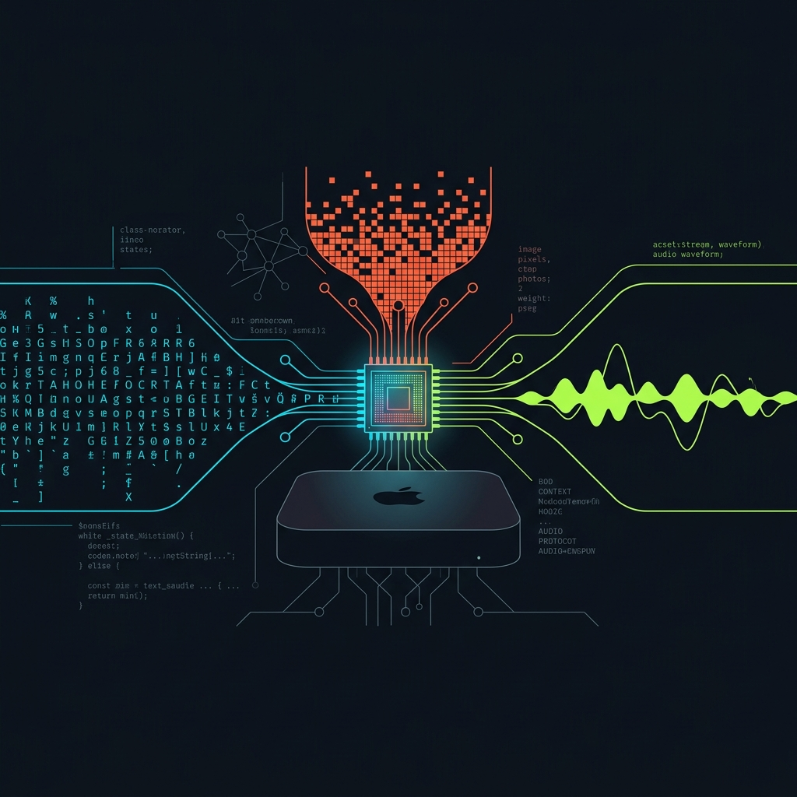
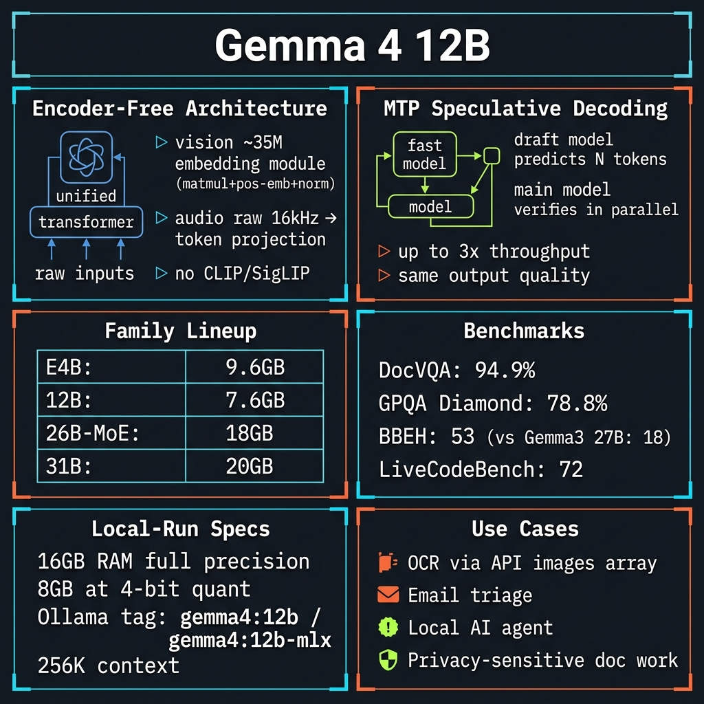
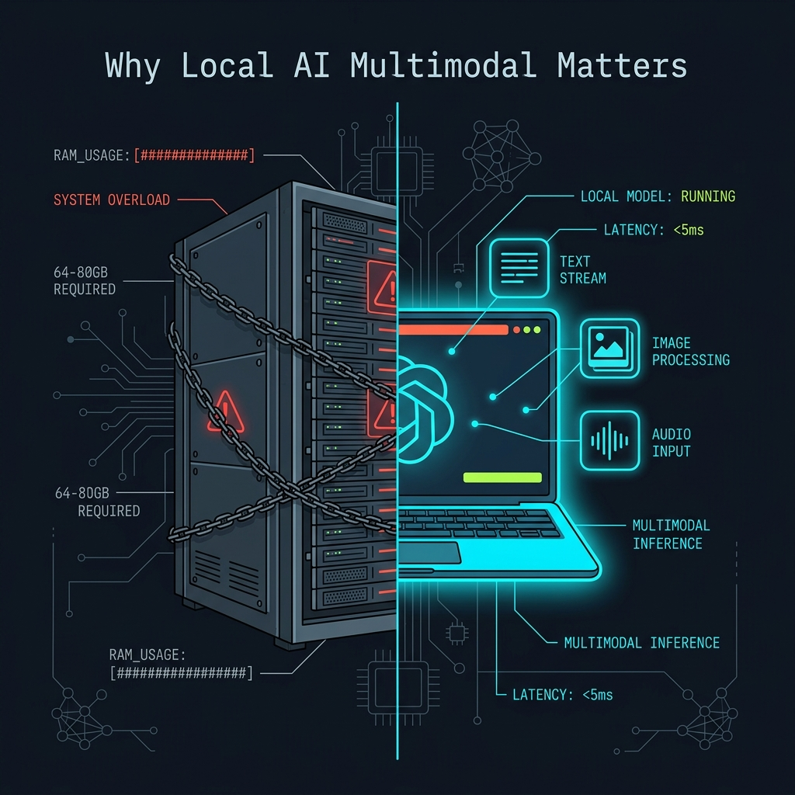
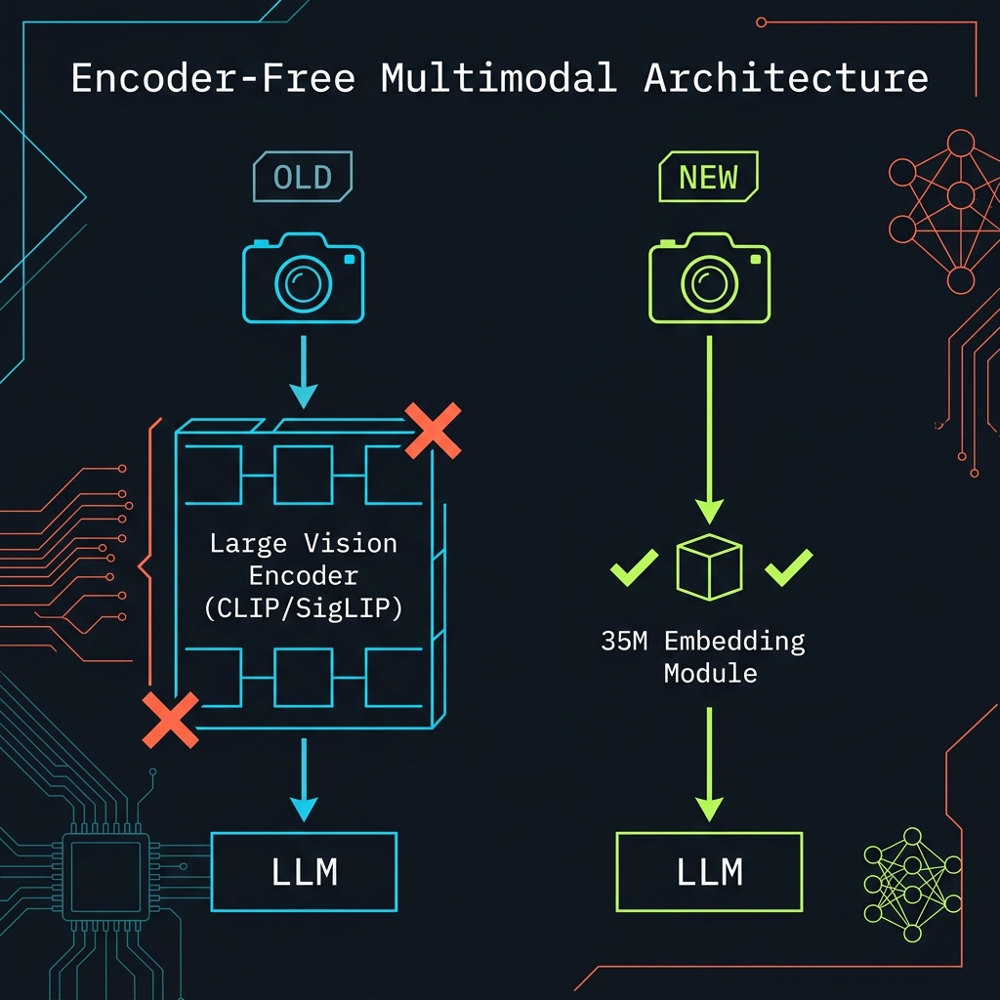

<!-- _class: title -->

# Gemma 4 12B

Open-weight multimodal AI · 16 GB RAM · 3× faster decoding

<!-- Speaker: Google launched Gemma 4 12B on June 3 2026 — the first mid-sized open model with native text+image+audio and MTP speculative decoding. This deck: what it is, how it works, how to run it today. -->

---

<!-- _class: cheatsheet -->
<!-- _backgroundColor: #f8f7f4 -->

<!-- Speaker: 60-second overview — top row covers the architecture panels, middle shows family lineup and benchmarks, bottom row covers practical use cases and quick-start. Refer back to this during Q&A. -->

---

## TL;DR: Three Claims That Matter

Open-weight · encoder-free · MTP-accelerated — all three in one 7.6 GB model.

<svg viewBox="0 0 1100 300" width="100%" xmlns="http://www.w3.org/2000/svg">
  <defs>
    <filter id="sh" x="-5%" y="-5%" width="110%" height="110%">
      <feDropShadow dx="0" dy="4" stdDeviation="6" flood-color="rgba(15,23,42,.08)"/>
    </filter>
  </defs>
  <!-- Card 1: 16GB -->
  <rect x="30" y="20" width="320" height="260" rx="12" fill="var(--paper)" stroke="var(--soft-2)" stroke-width="1.5" filter="url(#sh)"/>
  <rect x="30" y="20" width="8" height="260" rx="4" fill="var(--accent)"/>
  <circle cx="130" cy="105" r="32" fill="var(--accent)" opacity=".12"/>
  <circle cx="130" cy="105" r="22" fill="var(--accent)"/>
  <text x="130" y="112" font-size="16" fill="var(--paper)" text-anchor="middle" dominant-baseline="central" font-family="system-ui" font-weight="700">16GB</text>
  <text x="185" y="90" font-size="17" font-weight="700" fill="var(--ink)" font-family="system-ui">Runs Locally</text>
  <text x="55" y="150" font-size="13" fill="var(--ink-dim)" font-family="system-ui">Full precision: 16 GB RAM</text>
  <text x="55" y="173" font-size="13" fill="var(--muted)" font-family="system-ui">4-bit quant: ~8 GB</text>
  <text x="55" y="205" font-size="12" fill="var(--muted)" font-family="system-ui">Mac Mini, gaming laptop,</text>
  <text x="55" y="223" font-size="12" fill="var(--muted)" font-family="system-ui">any 16 GB workstation</text>
  <!-- Card 2: Encoder-free -->
  <rect x="390" y="20" width="320" height="260" rx="12" fill="var(--paper)" stroke="var(--soft-2)" stroke-width="1.5" filter="url(#sh)"/>
  <rect x="390" y="20" width="8" height="260" rx="4" fill="var(--success)"/>
  <circle cx="447" cy="105" r="32" fill="var(--success)" opacity=".12"/>
  <circle cx="447" cy="105" r="22" fill="var(--success)"/>
  <text x="447" y="112" font-size="11" fill="var(--paper)" text-anchor="middle" dominant-baseline="central" font-family="system-ui" font-weight="700">ENC</text>
  <text x="500" y="90" font-size="17" font-weight="700" fill="var(--ink)" font-family="system-ui">Encoder-Free</text>
  <text x="415" y="150" font-size="13" fill="var(--ink-dim)" font-family="system-ui">No CLIP / SigLIP overhead</text>
  <text x="415" y="173" font-size="13" fill="var(--muted)" font-family="system-ui">Vision: 35M embed module</text>
  <text x="415" y="205" font-size="12" fill="var(--muted)" font-family="system-ui">Audio: raw 16 kHz tokens</text>
  <text x="415" y="223" font-size="12" fill="var(--muted)" font-family="system-ui">One forward pass</text>
  <!-- Card 3: MTP -->
  <rect x="750" y="20" width="320" height="260" rx="12" fill="var(--paper)" stroke="var(--soft-2)" stroke-width="1.5" filter="url(#sh)"/>
  <rect x="750" y="20" width="8" height="260" rx="4" fill="var(--gold)"/>
  <circle cx="807" cy="105" r="32" fill="var(--gold)" opacity=".12"/>
  <circle cx="807" cy="105" r="22" fill="var(--gold)"/>
  <text x="807" y="112" font-size="14" fill="var(--paper)" text-anchor="middle" dominant-baseline="central" font-family="system-ui" font-weight="700">3x</text>
  <text x="850" y="90" font-size="17" font-weight="700" fill="var(--ink)" font-family="system-ui">MTP Drafters</text>
  <text x="775" y="150" font-size="13" fill="var(--ink-dim)" font-family="system-ui">Speculative decoding</text>
  <text x="775" y="173" font-size="13" fill="var(--muted)" font-family="system-ui">Up to 3x throughput</text>
  <text x="775" y="205" font-size="12" fill="var(--muted)" font-family="system-ui">Same output quality</text>
  <text x="775" y="223" font-size="12" fill="var(--muted)" font-family="system-ui">Ollama / HF / vLLM</text>
  <rect x="0" y="0" width="1" height="1" fill="none"/>
</svg>

<b>★ Takeaway:</b> Gemma 4 12B คือ open-weight model แรกที่ทำ multimodal ได้จริงบน 16GB และยังเร็วกว่าเดิมถึง 3 เท่าด้วย MTP

<!-- Speaker: Three claims — each gets a dedicated slide. 16 GB accessibility, encoder-free architecture, MTP speed. All three together in one 7.6 GB model. -->

---

## Why Local Multimodal AI Was Stuck at the RAM Wall

Models powerful enough for images needed 64–80 GB. Gemma 4 12B breaks that ceiling.

<svg viewBox="0 0 700 260" width="100%" xmlns="http://www.w3.org/2000/svg">
  <!-- Before column -->
  <rect x="20" y="15" width="290" height="230" rx="10" fill="var(--danger-wash)" stroke="var(--danger)" stroke-width="1.5" opacity=".8"/>
  <text x="165" y="50" font-size="14" font-weight="700" fill="var(--danger-ink)" text-anchor="middle" font-family="system-ui">Before</text>
  <text x="165" y="85" font-size="32" font-weight="800" fill="var(--danger)" text-anchor="middle" font-family="system-ui">64-80 GB</text>
  <text x="165" y="115" font-size="13" fill="var(--danger-ink)" text-anchor="middle" font-family="system-ui">GPU/RAM required</text>
  <text x="165" y="145" font-size="12" fill="var(--ink-dim)" text-anchor="middle" font-family="system-ui">Workstation only</text>
  <text x="165" y="167" font-size="12" fill="var(--ink-dim)" text-anchor="middle" font-family="system-ui">Separate vision encoder</text>
  <text x="165" y="189" font-size="12" fill="var(--ink-dim)" text-anchor="middle" font-family="system-ui">Text OR image — not both</text>
  <!-- VS badge -->
  <circle cx="355" cy="130" r="24" fill="var(--accent)"/>
  <text x="355" y="135" font-size="12" font-weight="700" fill="var(--paper)" text-anchor="middle" dominant-baseline="central" font-family="system-ui">VS</text>
  <!-- After column -->
  <rect x="390" y="15" width="290" height="230" rx="10" fill="var(--success-wash)" stroke="var(--success)" stroke-width="2"/>
  <text x="535" y="50" font-size="14" font-weight="700" fill="var(--success-ink)" text-anchor="middle" font-family="system-ui">Gemma 4 12B</text>
  <text x="535" y="85" font-size="32" font-weight="800" fill="var(--success)" text-anchor="middle" font-family="system-ui">16 GB</text>
  <text x="535" y="115" font-size="13" fill="var(--success-ink)" text-anchor="middle" font-family="system-ui">laptop / Mac Mini</text>
  <text x="535" y="145" font-size="12" fill="var(--ink-dim)" text-anchor="middle" font-family="system-ui">or ~8 GB at 4-bit quant</text>
  <text x="535" y="167" font-size="12" fill="var(--ink-dim)" text-anchor="middle" font-family="system-ui">No separate encoder</text>
  <text x="535" y="189" font-size="12" fill="var(--ink-dim)" text-anchor="middle" font-family="system-ui">Text + Image + Audio</text>
  <rect x="0" y="0" width="1" height="1" fill="none"/>
</svg>

<b>★ Takeaway:</b> เป้าหมายใหม่คือ 8–16GB — ทุกคนที่มี Mac Mini หรือ gaming laptop สามารถรัน AI multimodal ได้แล้ว

<!-- Speaker: The RAM wall was the single biggest barrier to local multimodal AI. 64-80 GB meant you needed a workstation. Gemma 4 12B changes the access calculus. -->

---

## Gemma 4 Family: Five Models, One Sweet Spot

The 12B sits at the crossover point — near-26B-MoE quality at under half the RAM cost.

| Model | Params | Type | Ollama RAM | Best For |
|-------|--------|------|-----------|----------|
| E2B | 2B | Dense | 7.2 GB | Raspberry Pi, edge MCU |
| E4B | 4B | Dense | 9.6 GB | ≤8 GB VRAM laptop (default) |
| **12B** | **12B** | **Dense, encoder-free** | **7.6 GB (4-bit)** | **Mac Mini 16GB, gaming laptop** |
| 26B | 26B / 3.8B active | MoE | 18 GB | Workstation, M3 Pro 36GB+ |
| 31B | 31B | Dense | 20 GB | High-end workstation |

<b>★ Takeaway:</b> 12B ได้คะแนน benchmark ใกล้เคียง 26B MoE โดยใช้ RAM น้อยกว่า 2.5 เท่า — sweet spot สำหรับ personal hardware

<!-- Speaker: E4B is the safe default at 9.6 GB. If you have 16 GB available, the 12B gives near-26B quality. The 26B MoE is impressive but needs a workstation. -->

---

## Encoder-Free Design: One LLM Handles Everything

Removing the separate encoder cuts latency and model weight without sacrificing capability.

<svg viewBox="0 0 700 260" width="100%" xmlns="http://www.w3.org/2000/svg">
  <defs>
    <marker id="ma" markerWidth="8" markerHeight="8" refX="6" refY="3" orient="auto">
      <path d="M0,0 L0,6 L8,3 z" fill="var(--muted)"/>
    </marker>
    <marker id="mb" markerWidth="8" markerHeight="8" refX="6" refY="3" orient="auto">
      <path d="M0,0 L0,6 L8,3 z" fill="var(--accent)"/>
    </marker>
  </defs>
  <!-- OLD label -->
  <rect x="15" y="15" width="52" height="24" rx="6" fill="var(--danger)" opacity=".85"/>
  <text x="41" y="31" font-size="12" font-weight="700" fill="var(--paper)" text-anchor="middle" font-family="system-ui">OLD</text>
  <!-- OLD: Input -> Encoder -> LLM -->
  <rect x="82" y="12" width="110" height="32" rx="8" fill="var(--soft)" stroke="var(--soft-2)" stroke-width="1.5"/>
  <text x="137" y="32" font-size="12" fill="var(--ink-dim)" text-anchor="middle" font-family="system-ui">Input</text>
  <path d="M192 28 L228 28" stroke="var(--muted)" stroke-width="2" marker-end="url(#ma)"/>
  <rect x="228" y="6" width="138" height="44" rx="8" fill="var(--danger-wash)" stroke="var(--danger)" stroke-width="1.5"/>
  <text x="297" y="24" font-size="12" font-weight="700" fill="var(--danger-ink)" text-anchor="middle" font-family="system-ui">CLIP / SigLIP</text>
  <text x="297" y="42" font-size="11" fill="var(--danger-ink)" text-anchor="middle" font-family="system-ui">Encoder — heavy</text>
  <path d="M366 28 L402 28" stroke="var(--muted)" stroke-width="2" marker-end="url(#ma)"/>
  <rect x="402" y="12" width="80" height="32" rx="8" fill="var(--soft)" stroke="var(--soft-2)" stroke-width="1.5"/>
  <text x="442" y="32" font-size="12" fill="var(--ink-dim)" text-anchor="middle" font-family="system-ui">LLM</text>
  <text x="520" y="28" font-size="13" fill="var(--danger)" font-family="system-ui">+RAM +ms</text>
  <!-- divider -->
  <line x1="15" y1="78" x2="685" y2="78" stroke="var(--soft-2)" stroke-width="1" stroke-dasharray="6,4"/>
  <!-- NEW label -->
  <rect x="15" y="90" width="52" height="24" rx="6" fill="var(--success)" opacity=".9"/>
  <text x="41" y="106" font-size="12" font-weight="700" fill="var(--paper)" text-anchor="middle" font-family="system-ui">NEW</text>
  <!-- NEW: Input -> 35M module -> LLM -->
  <rect x="82" y="88" width="110" height="32" rx="8" fill="var(--soft)" stroke="var(--soft-2)" stroke-width="1.5"/>
  <text x="137" y="108" font-size="12" fill="var(--ink-dim)" text-anchor="middle" font-family="system-ui">Input</text>
  <path d="M192 104 L228 104" stroke="var(--accent)" stroke-width="2" marker-end="url(#mb)"/>
  <rect x="228" y="82" width="138" height="44" rx="8" fill="var(--accent-wash)" stroke="var(--accent)" stroke-width="1.5"/>
  <text x="297" y="100" font-size="12" font-weight="700" fill="var(--accent-deep)" text-anchor="middle" font-family="system-ui">35M Embed</text>
  <text x="297" y="118" font-size="11" fill="var(--accent-deep)" text-anchor="middle" font-family="system-ui">lightweight module</text>
  <path d="M366 104 L402 104" stroke="var(--accent)" stroke-width="2" marker-end="url(#mb)"/>
  <rect x="402" y="88" width="80" height="32" rx="8" fill="var(--success-wash)" stroke="var(--success)" stroke-width="2"/>
  <text x="442" y="108" font-size="12" font-weight="700" fill="var(--success-ink)" text-anchor="middle" font-family="system-ui">LLM</text>
  <text x="516" y="104" font-size="13" fill="var(--success)" font-family="system-ui" font-weight="700">-RAM -ms</text>
  <!-- Audio note -->
  <rect x="82" y="155" width="460" height="72" rx="10" fill="var(--soft)" stroke="var(--soft-2)" stroke-width="1.5"/>
  <text x="312" y="178" font-size="13" font-weight="700" fill="var(--ink)" text-anchor="middle" font-family="system-ui">Audio: No encoder at all</text>
  <text x="312" y="198" font-size="12" fill="var(--ink-dim)" text-anchor="middle" font-family="system-ui">Raw 16 kHz waveform projected directly into token space</text>
  <rect x="0" y="0" width="1" height="1" fill="none"/>
</svg>

<b>★ Takeaway:</b> Encoder-free = เบาและเร็วกว่า — vision ใช้แค่ 35M module, audio ตัด encoder ออกทั้งหมด → one forward pass

<!-- Speaker: Traditional multimodal models bolt a separate 400M-1B parameter vision encoder onto the LLM. Gemma 4 12B replaces this with a 35M lightweight module. Audio goes even further — raw waveform directly into token space. -->

---

## MTP Cuts Decode Latency by 3×

Draft-and-verify speculative decoding: a lightweight model guesses ahead; the main model confirms in one parallel pass.

<svg viewBox="0 0 1100 300" width="100%" xmlns="http://www.w3.org/2000/svg">
  <defs>
    <marker id="ac" markerWidth="8" markerHeight="8" refX="6" refY="3" orient="auto">
      <path d="M0,0 L0,6 L8,3 z" fill="var(--accent)"/>
    </marker>
    <marker id="as" markerWidth="8" markerHeight="8" refX="6" refY="3" orient="auto">
      <path d="M0,0 L0,6 L8,3 z" fill="var(--success)"/>
    </marker>
    <marker id="aw" markerWidth="8" markerHeight="8" refX="6" refY="3" orient="auto">
      <path d="M0,0 L0,6 L8,3 z" fill="var(--warning)"/>
    </marker>
  </defs>
  <!-- Step 1: Token N -->
  <rect x="20" y="110" width="130" height="80" rx="12" fill="var(--soft)" stroke="var(--soft-2)" stroke-width="1.5"/>
  <text x="85" y="148" font-size="20" font-weight="800" fill="var(--accent)" text-anchor="middle" font-family="system-ui">Token N</text>
  <text x="85" y="170" font-size="11" fill="var(--muted)" text-anchor="middle" font-family="system-ui">current output</text>
  <path d="M150 150 L188 150" stroke="var(--accent)" stroke-width="2.5" marker-end="url(#ac)"/>
  <!-- Step 2: Draft model -->
  <rect x="188" y="90" width="155" height="120" rx="12" fill="var(--accent-wash)" stroke="var(--accent)" stroke-width="2"/>
  <text x="265" y="132" font-size="14" font-weight="700" fill="var(--accent-deep)" text-anchor="middle" font-family="system-ui">Draft Model</text>
  <text x="265" y="152" font-size="12" fill="var(--accent)" text-anchor="middle" font-family="system-ui">lightweight</text>
  <text x="265" y="172" font-size="11" fill="var(--ink-dim)" text-anchor="middle" font-family="system-ui">predicts N+1, N+2, N+3</text>
  <text x="265" y="192" font-size="11" fill="var(--ink-dim)" text-anchor="middle" font-family="system-ui">in parallel</text>
  <path d="M343 150 L381 150" stroke="var(--accent)" stroke-width="2.5" marker-end="url(#ac)"/>
  <!-- Step 3: Main model -->
  <rect x="381" y="90" width="170" height="120" rx="12" fill="var(--paper)" stroke="var(--soft-2)" stroke-width="1.5" style="filter:drop-shadow(0 4px 12px rgba(15,23,42,.08))"/>
  <text x="466" y="132" font-size="14" font-weight="700" fill="var(--ink)" text-anchor="middle" font-family="system-ui">Main Model</text>
  <text x="466" y="152" font-size="12" fill="var(--ink-dim)" text-anchor="middle" font-family="system-ui">verifies all drafts</text>
  <text x="466" y="172" font-size="12" fill="var(--ink-dim)" text-anchor="middle" font-family="system-ui">in one parallel pass</text>
  <!-- Accept branch (top) -->
  <path d="M551 130 L610 90" stroke="var(--success)" stroke-width="2" marker-end="url(#as)"/>
  <rect x="610" y="55" width="200" height="70" rx="10" fill="var(--success-wash)" stroke="var(--success)" stroke-width="1.5"/>
  <text x="710" y="82" font-size="13" font-weight="700" fill="var(--success-ink)" text-anchor="middle" font-family="system-ui">Accept batch</text>
  <text x="710" y="102" font-size="11" fill="var(--success-ink)" text-anchor="middle" font-family="system-ui">N+1, N+2, N+3 confirmed</text>
  <path d="M810 90 L882 130" stroke="var(--success)" stroke-width="2" marker-end="url(#as)"/>
  <!-- Reject branch (bottom) -->
  <path d="M551 170 L610 200" stroke="var(--warning)" stroke-width="1.5" stroke-dasharray="5,3" marker-end="url(#aw)"/>
  <rect x="610" y="190" width="200" height="55" rx="10" fill="var(--warning-wash)" stroke="var(--warning)" stroke-width="1.5"/>
  <text x="710" y="212" font-size="13" font-weight="700" fill="var(--warning-ink)" text-anchor="middle" font-family="system-ui">Reject: fallback token</text>
  <text x="710" y="230" font-size="11" fill="var(--warning-ink)" text-anchor="middle" font-family="system-ui">no quality loss</text>
  <!-- Output -->
  <rect x="882" y="110" width="190" height="80" rx="12" fill="var(--success-wash)" stroke="var(--success)" stroke-width="2"/>
  <text x="977" y="148" font-size="22" font-weight="800" fill="var(--success-ink)" text-anchor="middle" font-family="system-ui">Up to 3x</text>
  <text x="977" y="170" font-size="12" fill="var(--success-ink)" text-anchor="middle" font-family="system-ui">same quality</text>
  <rect x="0" y="0" width="1" height="1" fill="none"/>
</svg>

<b>★ Takeaway:</b> MTP ไม่ใช่ approximation — output quality เหมือนเดิมทุกบิต แต่ throughput เพิ่ม 3× เหมาะมากสำหรับ agentic loop ที่มีหลาย tool-call

<!-- Speaker: The draft model guesses several tokens ahead cheaply. The main model verifies all guesses in one parallel pass. When guesses are correct — most of the time — throughput triples. Quality is guaranteed bit-identical to sequential generation. -->

---

## Benchmarks Show a Step-Change at 12B Scale

BBEH nearly triples vs Gemma 3 27B — reasoning gains are disproportionate to parameter count.

| Benchmark | Gemma 4 12B | Gemma 3 27B | What it measures |
|-----------|-------------|-------------|-----------------|
| **DocVQA** | **~94.9%** | — | Document text understanding / OCR |
| **GPQA Diamond** | **~78.8%** | — | Graduate-level reasoning |
| **BBEH** | **53** | ~18 | Broad hard reasoning (step-change) |
| **LiveCodeBench** | **72** | — | Competitive coding |

<b>★ Takeaway:</b> BBEH 53 vs ~18 คือสัญญาณที่ชัดเจน — reasoning ดีขึ้นอย่างไม่ proportional กับขนาด; DocVQA 94.9% รองรับ OCR งานทั่วไปได้ดี

<!-- Speaker: BBEH is the standout — nearly 3x the Gemma 3 27B score despite smaller parameters. DocVQA at 94.9% makes typical document OCR reliable. GPQA Diamond at 78.8% is strong for an edge model. -->

---

## Setup: Two Commands to Local Multimodal AI

Ollama handles model download, serving, and quantization automatically.

  

    
Mac M-series (Apple Silicon)

    <h3>MLX-optimized build — 10 GB</h3>
    <pre style="background:var(--soft);padding:12px;border-radius:8px;font-size:11px;margin:8px 0 0;line-height:1.7;overflow:auto"><code>brew install ollama

ollama pull gemma4:12b-mlx
# 10 GB — Neural Engine accelerated

ollama run gemma4:12b-mlx "Hello"</code></pre>
  

  

    
Linux / Mac Intel / Windows (CUDA or Metal)

    <h3>Standard 4-bit build — 7.6 GB</h3>
    <pre style="background:var(--soft);padding:12px;border-radius:8px;font-size:11px;margin:8px 0 0;line-height:1.7;overflow:auto"><code>brew install ollama
# or: curl -fsSL https://ollama.com/install.sh | sh

ollama pull gemma4:12b
# 7.6 GB — 4-bit quantized

ollama run gemma4:12b "Hello"</code></pre>
  

<b>★ Takeaway:</b> ผล text generation ได้ภายใน 5–10 วินาทีบน Mac Mini M2 16GB — ไม่ต้องใช้ GPU แยก

<!-- Speaker: Two variants. M-series users: gemma4:12b-mlx uses the Neural Engine. Everyone else: gemma4:12b at 7.6 GB with 4-bit quant. Both work with ollama serve for the REST API. -->

---

## OCR via the Ollama REST API

Multimodal input requires the REST API — images are passed as base64 in the JSON body.

<pre style="background:var(--soft);padding:14px;border-radius:8px;font-size:11px;line-height:1.8;overflow:auto"><code># Start server (if not already running)
ollama serve &amp;

# Base64-encode the image
IMAGE_B64=$(base64 -i /path/to/receipt.jpg)

# Send to Ollama REST API
curl http://localhost:11434/api/generate \
  -d "{
    \"model\": \"gemma4:12b\",
    \"prompt\": \"Read all text in this image. Output exactly what you see.\",
    \"images\": [\"$IMAGE_B64\"],
    \"stream\": false
  }"

# Response JSON: { "response": "Invoice #1234 ..." }</code></pre>

<b>★ Takeaway:</b> ส่งภาพผ่าน `images[]` array ใน REST API — รองรับ receipt, document, screenshot; ความแม่นยำสูงบนเอกสารทั่วไป (DocVQA ~94.9%)

<!-- Speaker: The Ollama CLI doesn't expose --image for multimodal. Use localhost:11434 REST API instead. Base64-encode the image, drop it in the images array. Response JSON has the OCR text in the response field. -->

---

## Four Caveats Before Deploying

Strong at general OCR — less reliable for structured extraction and frontier reasoning tasks.

  

    
Structured Docs

    <h3>Invoice parsing not reliable</h3>
    
DocVQA 94.9% is a general benchmark. Extracting line items, VAT codes, vendor IDs from specialized invoices still errors. Use fine-tuned model or LayoutLMv3 alongside.

  

  

    
Quantization

    <h3>4-bit trades quality for RAM</h3>
    
7.6 GB (4-bit) is faster and lighter but may lose nuance on deep reasoning. 8-bit (~13 GB) is better balance if VRAM allows. 16-bit = full precision, 16 GB.

  

  

    
Model Class

    <h3>Not a frontier reasoning model</h3>
    
GPQA Diamond 78.8% is strong for its size, still below frontier cloud models. For PhD-level or complex multi-step reasoning, pair with a cloud model.

  

  

    
License

    <h3>Apache 2.0 + Use Policy</h3>
    
Free for commercial use, fine-tuning, redistribution. Gemma Prohibited Use Policy (separate doc) bans harmful content generation — review before deploying.

  

<b>★ Takeaway:</b> 12B เป็น great general-purpose local model — แต่งาน structured extraction หรือ frontier reasoning ยังต้องใช้ specialist model ควบคู่

<!-- Speaker: Four production caveats. Most important: don't use 12B alone for invoice line-item extraction — pair with a specialist doc model. Quantization tradeoff matters for reasoning-heavy tasks. -->

---

## Key Takeaways

Six things to remember about Gemma 4 12B.

  

    
Local AI

    <h3>16 GB runs it</h3>
    
Text + image + audio in one model. Mac Mini, gaming laptop, 16 GB workstation. Apache 2.0.

  

  

    
Architecture

    <h3>Encoder-free</h3>
    
35M vision embed replaces CLIP/SigLIP. Raw audio→tokens. One forward pass for all modalities.

  

  

    
Speed

    <h3>MTP = 3x decode</h3>
    
Draft-and-verify speculative decoding. Same quality. Critical for agentic loops.

  

  

    
Performance

    <h3>Near-26B MoE quality</h3>
    
BBEH 53 (vs 18 for Gemma 3 27B). DocVQA 94.9%. Half the RAM of 26B MoE.

  

  

    
Caveat

    <h3>Weak structured extraction</h3>
    
General OCR is reliable. Invoice line items still error — pair with LayoutLMv3 for structured output.

  

  

    
Run It

    <h3>ollama pull gemma4:12b</h3>
    
7.6 GB standard. gemma4:12b-mlx for Apple Silicon. REST API at localhost:11434.

  

<!-- Speaker: If you take one action today — ollama pull gemma4:12b on any machine with 16 GB RAM. It's live in two minutes. For production OCR work, don't skip the structured-doc caveat. -->
