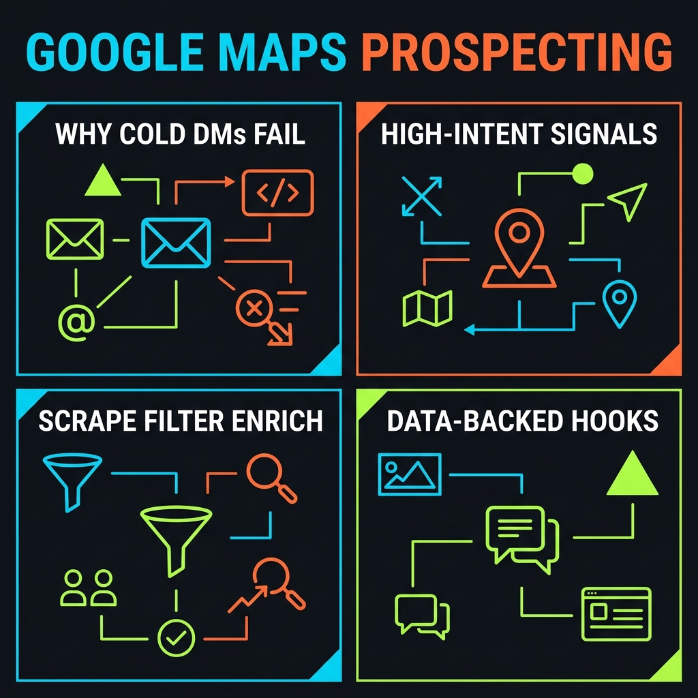
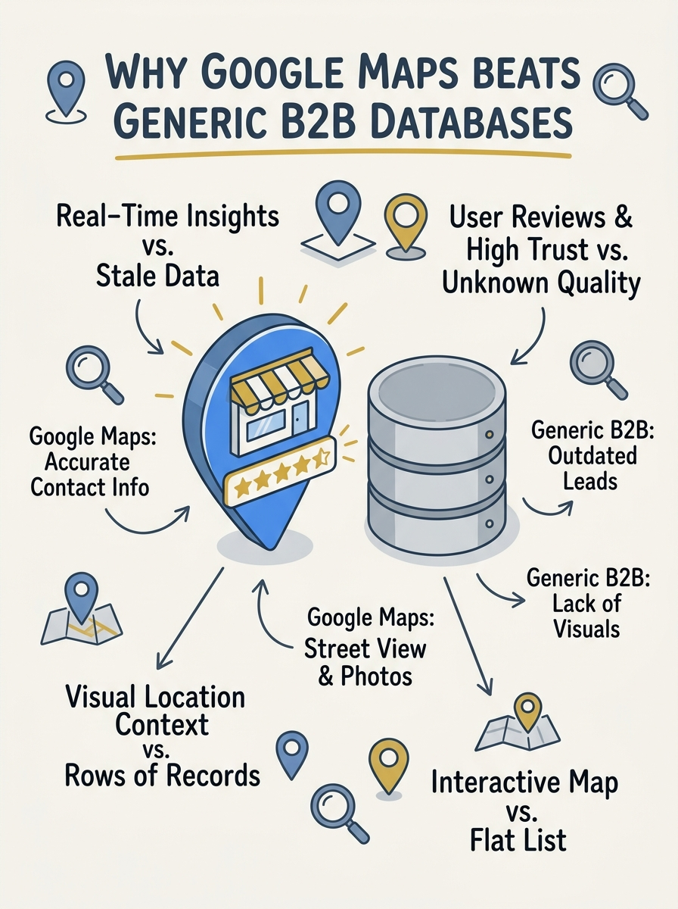
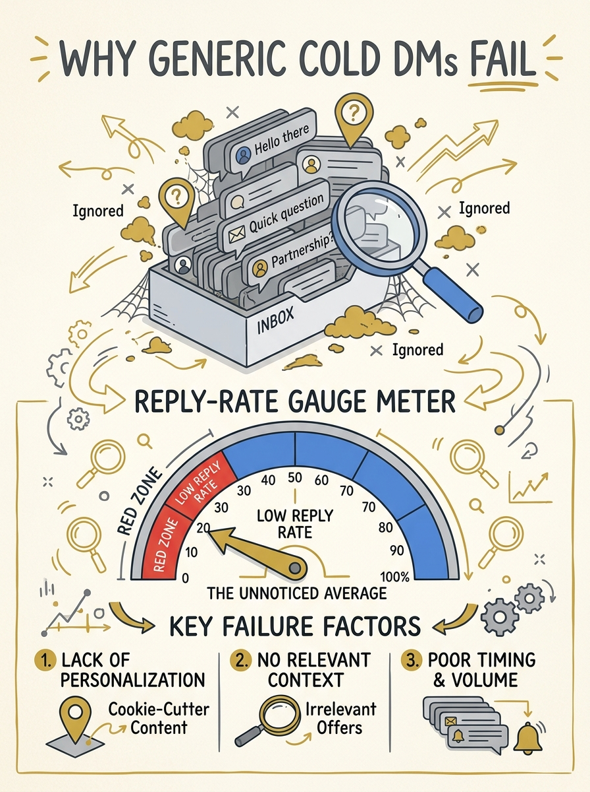

<!-- _class: title -->

# หาลูกค้าผ่าน Google Maps ทำไมได้ผลกว่า Cold DM

เจาะกลุ่มเว็บไซต์พัง รีวิวลบ ด้วย Prospecting Tools

<!-- Speaker: 30-second intro — cold DM ตายเพราะ generic, Google Maps ให้สัญญาณจริงที่ B2B database มองข้าม. -->

---

<!-- _class: cheatsheet -->
<!-- _backgroundColor: #f8f7f4 -->

<!-- Speaker: 60-second cheatsheet orientation — ชี้ 4 panel หลักก่อนเข้าเนื้อหา. -->

---

## TL;DR

Cold DM แบบ generic ตาย — Google Maps + prospecting tools คือทางออก

<svg viewBox="0 0 1100 380" width="100%" xmlns="http://www.w3.org/2000/svg">
  <rect x="60" y="40" width="980" height="300" rx="16" fill="var(--paper)" stroke="var(--soft-2)" stroke-width="1.5" style="filter:drop-shadow(0 4px 12px rgba(15,23,42,.08))"/>
  <rect x="60" y="40" width="8" height="300" rx="4" fill="var(--accent)"/>
  <circle cx="148" cy="190" r="40" fill="var(--accent)" opacity=".12"/>
  <circle cx="148" cy="190" r="28" fill="var(--accent)"/>
  <text x="148" y="196" font-size="18" fill="var(--paper)" text-anchor="middle" dominant-baseline="central" font-family="system-ui" font-weight="700">i</text>
  <text x="220" y="150" font-size="20" font-weight="700" fill="var(--ink)" font-family="system-ui">Avg cold email reply rate: ~4.1%</text>
  <text x="220" y="182" font-size="15" fill="var(--ink-dim)" font-family="system-ui">Range 1-8.5%; declined 5.1% (2024) to 3.43% (2026)</text>
  <text x="220" y="214" font-size="15" fill="var(--ink-dim)" font-family="system-ui">Google Maps = database of every real storefront</text>
  <text x="220" y="246" font-size="15" fill="var(--muted)" font-family="system-ui">Target: no website / broken site / negative reviews</text>
  <text x="220" y="278" font-size="15" fill="var(--muted)" font-family="system-ui">Filter with prospecting tools, outreach with real data</text>
</svg>

<b>★ Takeaway:</b> เจาะกลุ่มที่มีสัญญาณอ่อนแอจริง แล้วอ้างอิงข้อมูลจริงตอนทัก — ไม่ใช่ยิงแบบสุ่ม

<!-- Speaker: ตั้งกรอบทั้ง deck — ทำไมต้องเปลี่ยนจาก volume-based เป็น signal-based. -->

---

## ทำไม B2B Database มาตรฐานมองข้ามธุรกิจท้องถิ่น

ZoomInfo, Apollo ถูกออกแบบมาสำหรับบริษัท digital-first ที่มี funding — ธุรกิจท้องถิ่นไม่มีข้อมูลอยู่ในนั้นเลย

<svg viewBox="0 0 700 320" width="100%" xmlns="http://www.w3.org/2000/svg">
  <rect x="30" y="40" width="280" height="240" rx="12" fill="var(--soft)" stroke="var(--soft-2)" stroke-width="1.5"/>
  <text x="170" y="80" font-size="15" font-weight="700" fill="var(--muted)" text-anchor="middle" font-family="system-ui">B2B DB</text>
  <ellipse cx="170" cy="150" rx="60" ry="18" fill="none" stroke="var(--muted)" stroke-width="2" opacity=".5"/>
  <text x="170" y="220" font-size="12" fill="var(--muted)" text-anchor="middle" font-family="system-ui">no local-biz data</text>
  <rect x="360" y="40" width="280" height="240" rx="12" fill="var(--accent-wash)" stroke="var(--accent)" stroke-width="2"/>
  <text x="500" y="80" font-size="15" font-weight="700" fill="var(--accent-deep)" text-anchor="middle" font-family="system-ui">Google Maps</text>
  <circle cx="500" cy="160" r="10" fill="var(--accent)"/>
  <path d="M500 145 L500 175 M485 160 L515 160" stroke="var(--paper)" stroke-width="2"/>
  <text x="500" y="220" font-size="12" fill="var(--accent-deep)" text-anchor="middle" font-family="system-ui">every real storefront</text>
</svg>

<b>★ Takeaway:</b> Google Maps ให้สัญญาณที่มองเห็นได้จริง (rating, review count, website) แทน intent data ที่ไม่มีอยู่

<!-- Speaker: อธิบาย gap ของ traditional prospecting database ก่อนเข้าสู่ signal เฉพาะ. -->

---

## ทำไม Cold DM แบบ Generic ถึงได้ผลต่ำ

Personalization คือตัวแปรตัดสินผล — ไม่ใช่จำนวนข้อความที่ยิงออกไป

<svg viewBox="0 0 700 320" width="100%" xmlns="http://www.w3.org/2000/svg">
  <rect x="40" y="40" width="620" height="50" rx="8" fill="var(--soft)"/>
  <rect x="40" y="40" width="80" height="50" rx="8" fill="var(--muted)" opacity=".3"/>
  <text x="150" y="70" font-size="14" fill="var(--ink-dim)" font-family="system-ui">Generic template: ~4.1% avg reply</text>
  <rect x="40" y="110" width="620" height="50" rx="8" fill="var(--soft)"/>
  <rect x="40" y="110" width="280" height="50" rx="8" fill="var(--accent)" opacity=".3"/>
  <text x="150" y="140" font-size="14" fill="var(--ink)" font-family="system-ui">Personalized: up to ~18% reply</text>
  <rect x="40" y="180" width="620" height="50" rx="8" fill="var(--soft)"/>
  <rect x="40" y="180" width="580" height="50" rx="8" fill="var(--accent)"/>
  <text x="150" y="210" font-size="14" fill="var(--paper)" font-family="system-ui" font-weight="700">Top campaigns: 40-50% reply</text>
  <text x="40" y="260" font-size="13" fill="var(--muted)" font-family="system-ui">81% of decision-makers engage only when message is tailored</text>
</svg>

<b>★ Takeaway:</b> Personalized email เพิ่ม response rate ~32% เทียบ generic template

<!-- Speaker: อ้างอิงตัวเลขจาก cold-email benchmark 2026 — ชี้ให้เห็น gap ชัดเจน. -->

---

## สัญญาณ High-Intent Lead บน Google Maps

มองหาความเปราะบางที่มองเห็นได้ตรงๆ ก่อนติดต่อ

  

    
Signal 1

    <h3>ไม่มีเว็บไซต์</h3>
    
พึ่งพา offline traffic หรือ directory ล้วนๆ — เสนอสร้างเว็บ = แก้ lead loss ตรงจุด

  

  

    
Signal 2

    <h3>เว็บพัง / ล้าสมัย</h3>
    
มีเว็บแต่ใช้งานไม่ได้จริง — mobile ไม่รองรับ หรือไม่มี contact form

  

  

    
Signal 3

    <h3>รีวิวลบ + volume สูง</h3>
    
250 รีวิว 3.6 ดาว = demand จริง + pain point ชัดเจน เหมาะกับ reputation/SEO

  

<b>★ Takeaway:</b> รีวิวเยอะ + คะแนนต่ำ พิสูจน์ demand จริง ไม่ใช่แค่ธุรกิจแย่

<!-- Speaker: 3 สัญญาณหลักที่ mine ได้ตรงจาก listing โดยไม่ต้องใช้ intent data. -->

---

## Prospecting Tools: Scrape → Filter → Enrich

ข้อมูลดิบจาก Maps มีแค่ชื่อกับเบอร์ — ต้องผ่าน 3 ขั้นก่อน outreach

<svg viewBox="0 0 1100 320" width="100%" xmlns="http://www.w3.org/2000/svg">
  <rect x="40" y="110" width="280" height="100" rx="12" fill="var(--paper)" stroke="var(--soft-2)" stroke-width="1.5" style="filter:drop-shadow(var(--shadow-sm))"/>
  <text x="180" y="145" font-size="16" font-weight="700" fill="var(--ink)" text-anchor="middle" font-family="system-ui">1. Scrape</text>
  <text x="180" y="170" font-size="12" fill="var(--ink-dim)" text-anchor="middle" font-family="system-ui">Outscraper / Clay / Apify</text>
  <text x="180" y="190" font-size="12" fill="var(--muted)" text-anchor="middle" font-family="system-ui">by niche + geography</text>
  <path d="M330 160 L400 160" stroke="var(--muted)" stroke-width="2" marker-end="url(#arr)"/>
  <rect x="410" y="110" width="280" height="100" rx="12" fill="var(--paper)" stroke="var(--soft-2)" stroke-width="1.5" style="filter:drop-shadow(var(--shadow-sm))"/>
  <text x="550" y="145" font-size="16" font-weight="700" fill="var(--ink)" text-anchor="middle" font-family="system-ui">2. Filter</text>
  <text x="550" y="170" font-size="12" fill="var(--ink-dim)" text-anchor="middle" font-family="system-ui">No-website / low-rating</text>
  <text x="550" y="190" font-size="12" fill="var(--muted)" text-anchor="middle" font-family="system-ui">isolate vulnerability signal</text>
  <path d="M700 160 L770 160" stroke="var(--muted)" stroke-width="2" marker-end="url(#arr)"/>
  <rect x="780" y="110" width="280" height="100" rx="12" fill="var(--accent-wash)" stroke="var(--accent)" stroke-width="2" style="filter:drop-shadow(var(--shadow-md))"/>
  <text x="920" y="145" font-size="16" font-weight="700" fill="var(--accent-deep)" text-anchor="middle" font-family="system-ui">3. Enrich</text>
  <text x="920" y="170" font-size="12" fill="var(--accent-deep)" text-anchor="middle" font-family="system-ui">find owner + verified email</text>
  <text x="920" y="190" font-size="12" fill="var(--accent-deep)" text-anchor="middle" font-family="system-ui">contactable lead</text>
  <defs><marker id="arr" markerWidth="8" markerHeight="8" refX="4" refY="4" orient="auto"><path d="M0 0 L8 4 L0 8 Z" fill="var(--muted)"/></marker></defs>
</svg>

<b>★ Takeaway:</b> Pin บนแผนที่ยังไม่ใช่ lead — ต้อง enrich หา owner + verified contact ก่อนทัก

<!-- Speaker: ชี้ cost-effective pipeline — scraper ตัวหนึ่ง + enrichment อีกตัวสำหรับ agency ต่ำกว่า 50K lead/เดือน. -->

---

## Outreach: Generic Pitch vs Data-Backed Hook

Hook ที่อ้าง signal เฉพาะเจาะจง ลด rejection ได้ชัดเจนกว่า

<svg viewBox="0 0 1100 380" width="100%" xmlns="http://www.w3.org/2000/svg">
  <rect x="40" y="20" width="490" height="340" rx="12" fill="var(--paper)" stroke="var(--soft-2)" stroke-width="1.5" style="filter:drop-shadow(var(--shadow-sm))"/>
  <rect x="40" y="20" width="490" height="56" rx="12" fill="var(--soft)" opacity=".8"/>
  <text x="285" y="54" font-size="17" font-weight="700" fill="var(--ink-dim)" text-anchor="middle" font-family="system-ui">Generic Pitch</text>
  <text x="80" y="120" font-size="14" fill="var(--ink-dim)" font-family="system-ui">"Hi, I help businesses</text>
  <text x="80" y="145" font-size="14" fill="var(--ink-dim)" font-family="system-ui">like yours grow online..."</text>
  <text x="80" y="200" font-size="13" fill="var(--muted)" font-family="system-ui">No evidence of research</text>
  <text x="80" y="230" font-size="13" fill="var(--muted)" font-family="system-ui">Reads as spam / ignored</text>
  <rect x="570" y="20" width="490" height="340" rx="12" fill="var(--paper)" stroke="var(--accent)" stroke-width="2" style="filter:drop-shadow(var(--shadow-md))"/>
  <rect x="570" y="20" width="490" height="56" rx="12" fill="var(--accent)" opacity=".08"/>
  <text x="815" y="54" font-size="17" font-weight="700" fill="var(--accent)" text-anchor="middle" font-family="system-ui">Data-Backed Hook</text>
  <text x="610" y="120" font-size="14" fill="var(--ink)" font-family="system-ui">"Noticed on Google Maps</text>
  <text x="610" y="145" font-size="14" fill="var(--ink)" font-family="system-ui">you don't have a website —</text>
  <text x="610" y="170" font-size="14" fill="var(--ink)" font-family="system-ui">any plans to build one?"</text>
  <text x="610" y="225" font-size="13" fill="var(--accent-deep)" font-family="system-ui">Proves real research done</text>
  <text x="610" y="255" font-size="13" fill="var(--accent-deep)" font-family="system-ui">Feels like local consultation</text>
  <circle cx="550" cy="190" r="28" fill="var(--accent)"/>
  <text x="550" y="195" font-size="14" font-weight="700" fill="var(--paper)" text-anchor="middle" dominant-baseline="central" font-family="system-ui">VS</text>
</svg>

<b>★ Takeaway:</b> รีวิวลบ — เข้าหาด้วยความเข้าใจ ไม่ตำหนิ แล้วเสนอช่วยจัดการ reputation

<!-- Speaker: ยกตัวอย่าง script จริงจากวิดีโอต้นฉบับ — no-website hook + negative-review hook. -->

---

## User Guide: 7 Steps จาก Lead สู่ Outreach

Workflow เต็มตั้งแต่กำหนด niche จนถึง foot-in-the-door offer

  

    
1

    <h3>Niche + Geo</h3>
    
กำหนดหมวดธุรกิจ + พื้นที่

  

  

    
2

    <h3>Scrape</h3>
    
ดึง CSV: name, website, rating

  

  

    
3

    <h3>Filter</h3>
    
no-website หรือ rating&lt;4.0 + 20+ review

  

  

    
4

    <h3>Enrich</h3>
    
หาชื่อเจ้าของ + verified contact

  

  

    
5

    <h3>อ่านรีวิว</h3>
    
ดึง signal เฉพาะเจาะจง 1 อย่าง

  

  

    
6

    <h3>ส่ง Hook</h3>
    
1-liner อ้าง signal ตรงๆ

  

  

    
7

    <h3>Foot-in-Door</h3>
    
เสนอ commitment ต่ำก่อน upsell

  

<b>★ Takeaway:</b> ทุก step ต้องมี evidence เจาะจงต่อธุรกิจนั้น — ไม่ใช่ template เดียวยิงทุกคน

<!-- Speaker: เดินผ่านทั้ง 7 step แบบเร็ว เน้น step 5-7 ที่เป็นจุดต่างจาก cold DM ทั่วไป. -->

---

## Caveats / Limits

ข้อควรระวังก่อนใช้จริง

  

    
Compliance

    <h3>Scraping ToS + Privacy Law</h3>
    
ตรวจสอบ Google ToS และกฎหมาย data privacy ก่อนใช้ข้อมูลติดต่อเชิงพาณิชย์

  

  

    
Freshness

    <h3>ข้อมูลเปลี่ยนตลอดเวลา</h3>
    
Rating/review count เปลี่ยนได้ — lead list เก่าอาจไม่ตรงสถานะปัจจุบัน

  

  

    
Tone

    <h3>ระวังฟังดูเหมือนตำหนิ</h3>
    
เข้าหารีวิวลบด้วยน้ำเสียงช่วยเหลือ ไม่ใช่ negative-selling

  

  

    
Unverified

    <h3>ตัวเลข Conversion เฉพาะ</h3>
    
ยังไม่มี source ที่ verify ได้สำหรับ % conversion ของ Maps prospecting โดยตรง

  

<b>★ Takeaway:</b> Compliance และ tone สำคัญพอๆ กับเทคนิค prospecting เอง

<!-- Speaker: เน้นย้ำว่า scraping ต้องถูกกฎหมาย และ tone ต้องไม่ negative-selling. -->

---

## Key Takeaways

สิ่งที่ต้องจำแม้ข้ามเนื้อหาทั้งหมด

<svg viewBox="0 0 1100 340" width="100%" xmlns="http://www.w3.org/2000/svg">
  <circle cx="550" cy="170" r="160" fill="none" stroke="var(--soft-2)" stroke-width="1.5"/>
  <circle cx="550" cy="170" r="110" fill="none" stroke="var(--accent)" stroke-width="1.5" opacity=".4"/>
  <circle cx="550" cy="170" r="60" fill="var(--accent)" opacity=".1"/>
  <circle cx="550" cy="170" r="60" fill="none" stroke="var(--accent)" stroke-width="2"/>
  <text x="550" y="164" font-size="14" font-weight="700" fill="var(--accent)" text-anchor="middle" font-family="system-ui">Signal</text>
  <text x="550" y="184" font-size="13" fill="var(--ink)" text-anchor="middle" font-family="system-ui">over volume</text>
  <text x="380" y="100" font-size="13" fill="var(--ink)" font-family="system-ui" text-anchor="middle">No website /</text>
  <text x="380" y="120" font-size="12" fill="var(--muted)" font-family="system-ui" text-anchor="middle">negative reviews</text>
  <text x="730" y="100" font-size="13" fill="var(--ink)" font-family="system-ui" text-anchor="middle">Scrape → Filter</text>
  <text x="730" y="120" font-size="12" fill="var(--muted)" font-family="system-ui" text-anchor="middle">→ Enrich</text>
  <text x="220" y="170" font-size="13" fill="var(--muted)" font-family="system-ui" text-anchor="middle">Data-backed</text>
  <text x="220" y="190" font-size="13" fill="var(--muted)" font-family="system-ui" text-anchor="middle">hook</text>
  <text x="880" y="170" font-size="13" fill="var(--muted)" font-family="system-ui" text-anchor="middle">Foot-in-door</text>
  <text x="880" y="190" font-size="13" fill="var(--muted)" font-family="system-ui" text-anchor="middle">offer first</text>
</svg>

<b>★ Takeaway:</b> เจาะกลุ่มที่มี signal อ่อนแอจริง อ้างอิงข้อมูลจริงตอนทัก — ผลลัพธ์ดีกว่ายิง cold DM แบบสุ่มเสมอ

