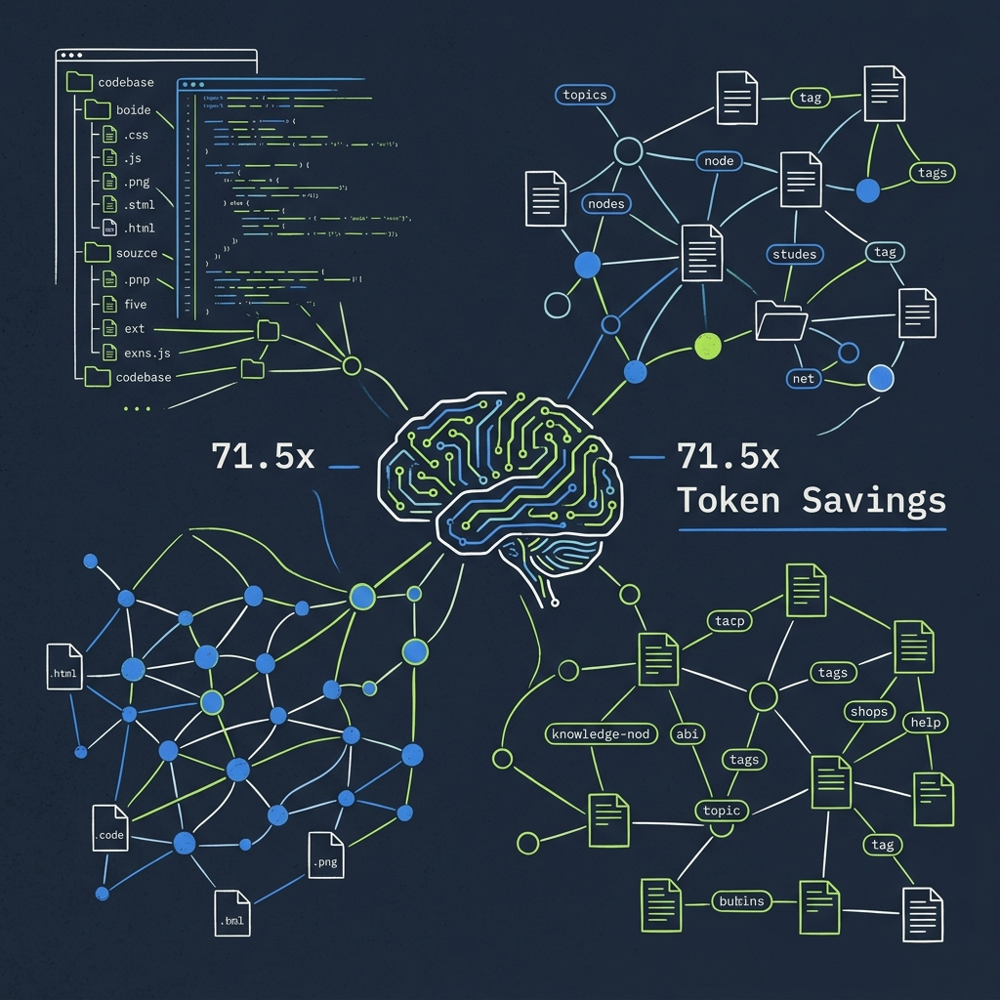
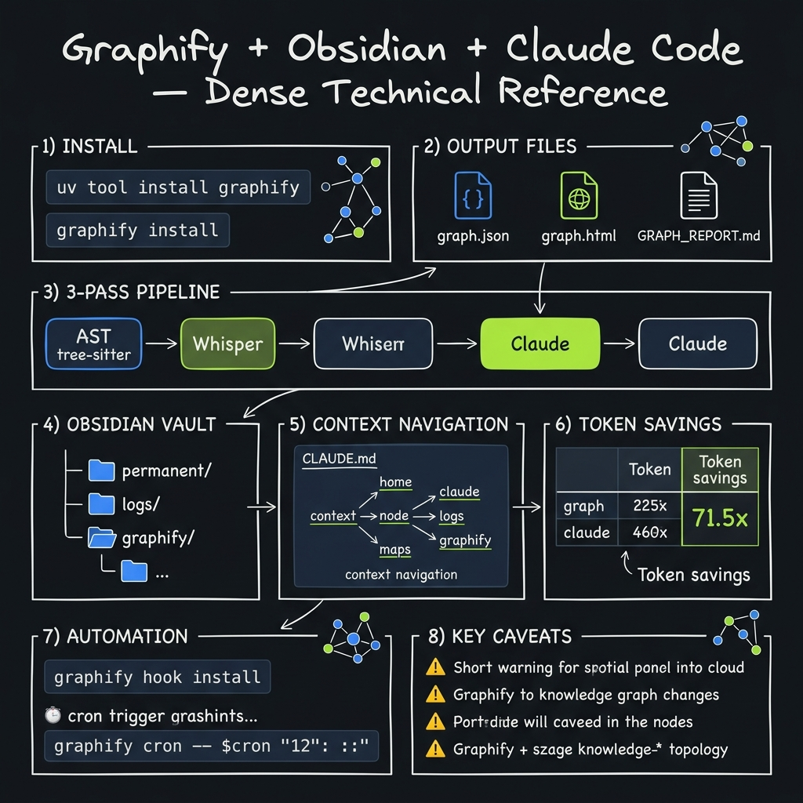
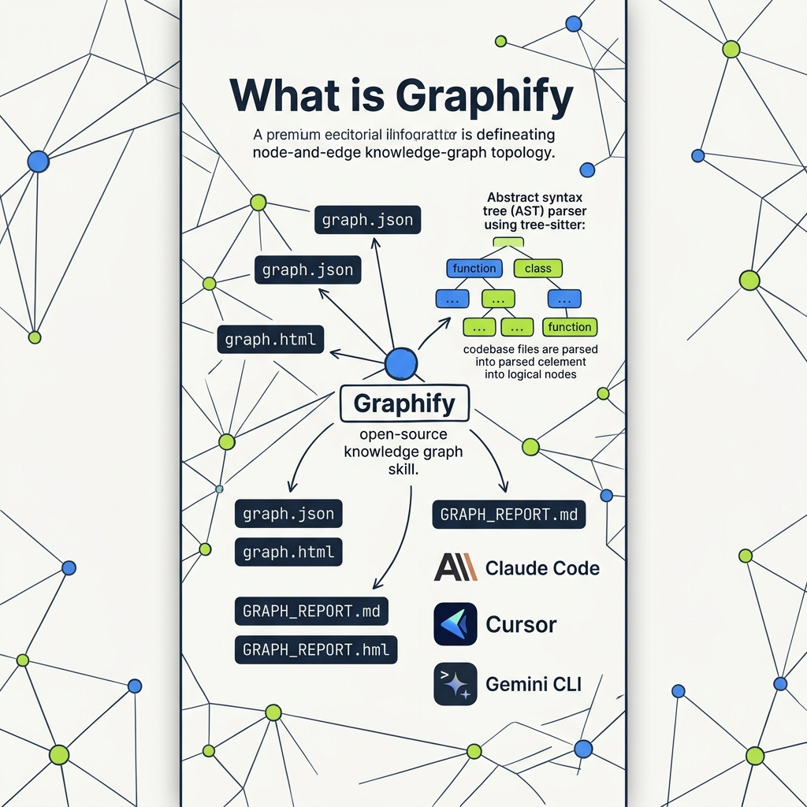
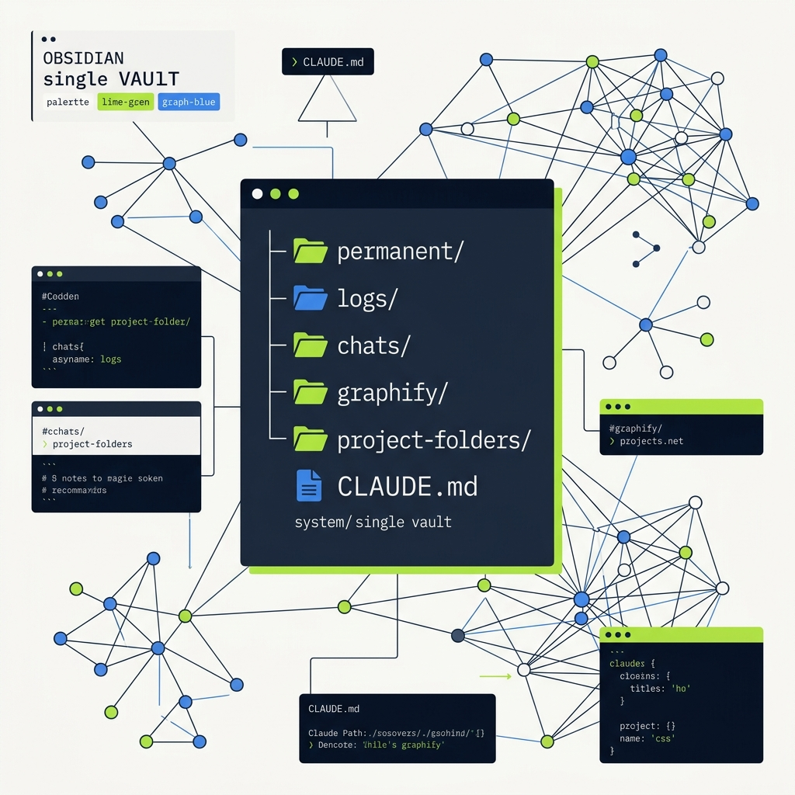
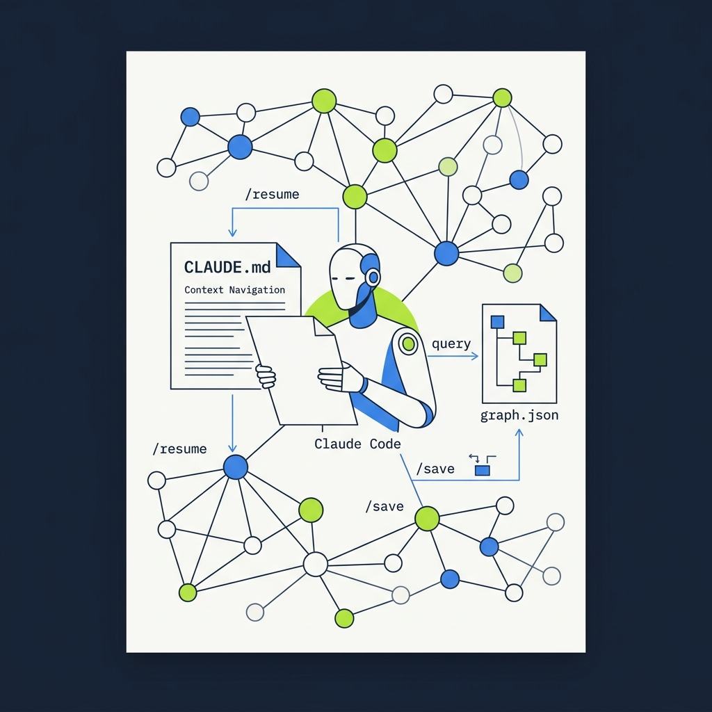

<!-- _class: title -->

# Graphify + Obsidian + Claude Code

Second Brain สำหรับ AI — ประหยัด Token ถึง 71.5 เท่า

<!-- Speaker: AI coding assistants waste 20,000 tokens/session re-reading the same files. This deck shows how Graphify + Obsidian eliminates that waste. -->

---

<!-- _class: cheatsheet -->
<!-- _backgroundColor: #f8f7f4 -->

<!-- Speaker: Full-deck reference. Key zones: install commands top-left, 3-pass pipeline center, Obsidian vault structure right, token savings table bottom. -->

---

## AI Sessions Waste Tokens on Amnesia

ทุก session ใหม่ AI ต้องอ่านโค้ดเบสซ้ำ — ~20,000 tokens เพื่ออ่าน 40 ไฟล์

<svg viewBox="0 0 1100 360" width="100%" xmlns="http://www.w3.org/2000/svg">
  <!-- Problem: session amnesia cycle -->
  <rect x="40" y="60" width="300" height="240" rx="14" fill="var(--paper)" stroke="var(--soft-2)" stroke-width="1.5" style="filter:drop-shadow(var(--shadow-sm))"/>
  <rect x="40" y="60" width="300" height="44" rx="14" fill="var(--danger-wash)"/>
  <rect x="40" y="90" width="300" height="14" rx="0" fill="var(--danger-wash)"/>
  <text x="190" y="88" font-size="14" font-weight="700" fill="var(--danger)" text-anchor="middle" font-family="system-ui">Session A</text>
  <text x="80" y="130" font-size="13" fill="var(--ink)" font-family="system-ui">Read all 40 files...</text>
  <text x="80" y="158" font-size="13" fill="var(--ink-dim)" font-family="system-ui">~20,000 tokens used</text>
  <text x="80" y="186" font-size="13" fill="var(--ink-dim)" font-family="system-ui">Work done. Session ends.</text>
  <text x="80" y="240" font-size="22" font-weight="800" fill="var(--danger)" font-family="system-ui">Memory: GONE</text>
  <!-- Arrow -->
  <path d="M380 180 L480 180" stroke="var(--danger)" stroke-width="2.5" stroke-dasharray="6,4" marker-end="url(#arr)"/>
  <defs><marker id="arr" markerWidth="8" markerHeight="8" refX="6" refY="3" orient="auto"><path d="M0,0 L0,6 L8,3 z" fill="var(--danger)"/></marker></defs>
  <rect x="480" y="60" width="300" height="240" rx="14" fill="var(--paper)" stroke="var(--soft-2)" stroke-width="1.5" style="filter:drop-shadow(var(--shadow-sm))"/>
  <rect x="480" y="60" width="300" height="44" rx="14" fill="var(--danger-wash)"/>
  <rect x="480" y="90" width="300" height="14" rx="0" fill="var(--danger-wash)"/>
  <text x="630" y="88" font-size="14" font-weight="700" fill="var(--danger)" text-anchor="middle" font-family="system-ui">Session B</text>
  <text x="520" y="130" font-size="13" fill="var(--ink)" font-family="system-ui">Read all 40 files AGAIN...</text>
  <text x="520" y="158" font-size="13" fill="var(--ink-dim)" font-family="system-ui">~20,000 tokens wasted</text>
  <text x="520" y="186" font-size="13" fill="var(--ink-dim)" font-family="system-ui">Same work. Every time.</text>
  <text x="520" y="240" font-size="22" font-weight="800" fill="var(--danger)" font-family="system-ui">Cost: quadratic</text>
  <!-- Fix arrow -->
  <path d="M820 180 L920 180" stroke="var(--success)" stroke-width="2.5" marker-end="url(#arr2)"/>
  <defs><marker id="arr2" markerWidth="8" markerHeight="8" refX="6" refY="3" orient="auto"><path d="M0,0 L0,6 L8,3 z" fill="var(--success)"/></marker></defs>
  <rect x="920" y="100" width="150" height="160" rx="14" fill="var(--success-wash)" stroke="var(--success)" stroke-width="2"/>
  <text x="995" y="148" font-size="13" font-weight="700" fill="var(--success-ink)" text-anchor="middle" font-family="system-ui">Graphify</text>
  <text x="995" y="170" font-size="12" fill="var(--success-ink)" text-anchor="middle" font-family="system-ui">+Obsidian</text>
  <text x="995" y="210" font-size="20" font-weight="800" fill="var(--success)" text-anchor="middle" font-family="system-ui">71.5x</text>
  <text x="995" y="232" font-size="11" fill="var(--success-ink)" text-anchor="middle" font-family="system-ui">less tokens</text>
  <rect x="920" y="100" width="150" height="4" rx="2" fill="var(--success)"/>
</svg>

<b>★ Takeaway:</b> AI amnesia costs ~20,000 tokens per session — Graphify + Obsidian cuts this by 71.5x through persistent graph memory.

<!-- Speaker: The token waste is quadratic — bigger project = exponentially worse. This is the core problem Graphify solves. -->

---

## What is Graphify: One-Time Build, Infinite Reuse

Open-source knowledge graph skill — แปลงโค้ดเบสเป็น queryable graph ที่ AI ใช้ซ้ำได้ไม่จำกัด

<svg viewBox="0 0 700 300" width="100%" xmlns="http://www.w3.org/2000/svg">
  <!-- 3 output files -->
  <rect x="20" y="40" width="200" height="220" rx="12" fill="var(--paper)" stroke="var(--soft-2)" stroke-width="1.5" style="filter:drop-shadow(var(--shadow-sm))"/>
  <rect x="20" y="40" width="200" height="4" rx="2" fill="var(--accent)"/>
  <text x="120" y="70" font-size="13" font-weight="700" fill="var(--accent)" text-anchor="middle" font-family="system-ui">graph.json</text>
  <text x="120" y="94" font-size="11" fill="var(--ink-dim)" text-anchor="middle" font-family="system-ui">Structured graph data</text>
  <text x="120" y="112" font-size="11" fill="var(--muted)" text-anchor="middle" font-family="system-ui">Query without re-read</text>
  <line x1="30" y1="130" x2="210" y2="130" stroke="var(--soft-2)" stroke-width="1"/>
  <text x="120" y="155" font-size="13" font-weight="700" fill="var(--ink)" text-anchor="middle" font-family="system-ui">graph.html</text>
  <text x="120" y="175" font-size="11" fill="var(--ink-dim)" text-anchor="middle" font-family="system-ui">Interactive viz</text>
  <line x1="30" y1="195" x2="210" y2="195" stroke="var(--soft-2)" stroke-width="1"/>
  <text x="120" y="218" font-size="12" font-weight="700" fill="var(--ink)" text-anchor="middle" font-family="system-ui">GRAPH_REPORT.md</text>
  <text x="120" y="238" font-size="11" fill="var(--muted)" text-anchor="middle" font-family="system-ui">High-centrality summary</text>
  <!-- Command -->
  <rect x="250" y="120" width="220" height="60" rx="8" fill="var(--accent-deep)" stroke="var(--accent)" stroke-width="1.5"/>
  <text x="360" y="145" font-size="14" font-weight="700" fill="white" text-anchor="middle" font-family="monospace">graphify .</text>
  <text x="360" y="167" font-size="11" fill="rgba(255,255,255,.7)" text-anchor="middle" font-family="system-ui">run in project root</text>
  <!-- Arrow from command to output -->
  <path d="M250 150 L230 150" stroke="var(--accent)" stroke-width="2" marker-end="url(#arr3)"/>
  <defs><marker id="arr3" markerWidth="8" markerHeight="8" refX="6" refY="3" orient="auto"><path d="M0,0 L0,6 L8,3 z" fill="var(--accent)"/></marker></defs>
  <!-- Platforms label -->
  <rect x="480" y="60" width="200" height="180" rx="12" fill="var(--soft)" stroke="var(--soft-2)" stroke-width="1.5"/>
  <text x="580" y="88" font-size="12" font-weight="700" fill="var(--ink-dim)" text-anchor="middle" font-family="system-ui">Supported Platforms</text>
  <text x="500" y="114" font-size="11" fill="var(--ink)" font-family="system-ui">Claude Code</text>
  <text x="500" y="134" font-size="11" fill="var(--ink)" font-family="system-ui">Cursor</text>
  <text x="500" y="154" font-size="11" fill="var(--ink)" font-family="system-ui">Gemini CLI</text>
  <text x="500" y="174" font-size="11" fill="var(--ink)" font-family="system-ui">GitHub Copilot CLI</text>
  <text x="500" y="194" font-size="11" fill="var(--ink)" font-family="system-ui">Aider + Codex</text>
  <text x="500" y="214" font-size="11" fill="var(--muted)" font-family="system-ui">...and more</text>
</svg>

<b>★ Takeaway:</b> PyPI package = <code>graphifyy</code> (double-y); CLI command = <code>graphify</code>; run once, query forever.

<!-- Speaker: The double-y in graphifyy is the most common gotcha. The CLI is graphify singular. One command builds the graph; AI queries it every session after. -->

---

## 3-Pass Pipeline: 100% Local Code Extraction

tree-sitter ทำงาน local ไม่ส่งโค้ดออก — tokens ใช้จริงแค่ Pass 3

<svg viewBox="0 0 1100 340" width="100%" xmlns="http://www.w3.org/2000/svg">
  <!-- Pass 1 -->
  <rect x="40" y="60" width="290" height="220" rx="14" fill="var(--success-wash)" stroke="var(--success)" stroke-width="2"/>
  <rect x="40" y="60" width="290" height="5" rx="2" fill="var(--success)"/>
  <text x="185" y="92" font-size="13" font-weight="700" fill="var(--success-ink)" text-anchor="middle" font-family="system-ui">Pass 1: AST Parsing</text>
  <text x="185" y="114" font-size="20" font-weight="800" fill="var(--success)" text-anchor="middle" font-family="system-ui">0 tokens</text>
  <text x="185" y="136" font-size="11" fill="var(--success-ink)" text-anchor="middle" font-family="system-ui">100% local</text>
  <text x="60" y="162" font-size="12" fill="var(--ink)" font-family="system-ui">tree-sitter (28 languages)</text>
  <text x="60" y="184" font-size="12" fill="var(--ink-dim)" font-family="system-ui">functions, classes, imports</text>
  <text x="60" y="206" font-size="12" fill="var(--ink-dim)" font-family="system-ui">call chains, dependencies</text>
  <text x="60" y="234" font-size="11" fill="var(--success-ink)" font-family="system-ui">exact structural edges</text>
  <!-- Arrow 1→2 -->
  <path d="M340 170 L400 170" stroke="var(--accent)" stroke-width="2.5" marker-end="url(#arr4)"/>
  <defs><marker id="arr4" markerWidth="8" markerHeight="8" refX="6" refY="3" orient="auto"><path d="M0,0 L0,6 L8,3 z" fill="var(--accent)"/></marker></defs>
  <!-- Pass 2 -->
  <rect x="400" y="60" width="290" height="220" rx="14" fill="var(--warning-wash)" stroke="var(--warning)" stroke-width="2"/>
  <rect x="400" y="60" width="290" height="5" rx="2" fill="var(--warning)"/>
  <text x="545" y="92" font-size="13" font-weight="700" fill="var(--warning-ink)" text-anchor="middle" font-family="system-ui">Pass 2: Whisper</text>
  <text x="545" y="114" font-size="14" font-weight="700" fill="var(--warning-ink)" text-anchor="middle" font-family="system-ui">Audio/Video</text>
  <text x="420" y="148" font-size="12" fill="var(--ink)" font-family="system-ui">Meeting recordings</text>
  <text x="420" y="170" font-size="12" fill="var(--ink-dim)" font-family="system-ui">Video docs</text>
  <text x="420" y="192" font-size="12" fill="var(--muted)" font-family="system-ui">Optional if no media files</text>
  <!-- Arrow 2→3 -->
  <path d="M700 170 L760 170" stroke="var(--accent)" stroke-width="2.5" marker-end="url(#arr4)"/>
  <!-- Pass 3 -->
  <rect x="760" y="60" width="290" height="220" rx="14" fill="var(--accent-wash)" stroke="var(--accent)" stroke-width="2"/>
  <rect x="760" y="60" width="290" height="5" rx="2" fill="var(--accent)"/>
  <text x="905" y="92" font-size="13" font-weight="700" fill="var(--accent)" text-anchor="middle" font-family="system-ui">Pass 3: Semantic</text>
  <text x="905" y="114" font-size="14" font-weight="700" fill="var(--accent-deep)" text-anchor="middle" font-family="system-ui">Claude API</text>
  <text x="780" y="148" font-size="12" fill="var(--ink)" font-family="system-ui">Docs, PDFs, images</text>
  <text x="780" y="170" font-size="12" fill="var(--ink-dim)" font-family="system-ui">Design rationale</text>
  <text x="780" y="192" font-size="12" fill="var(--muted)" font-family="system-ui">--backend ollama = local</text>
  <text x="780" y="240" font-size="11" fill="var(--accent)" font-family="system-ui">Leiden clustering</text>
</svg>

<b>★ Takeaway:</b> Code never leaves your machine — tree-sitter is 100% local. Only docs/images use the Claude API (or swap to Ollama for full-local).

<!-- Speaker: Pass 1 is why Graphify is cheap — 28 languages parsed without any API call. The AST gives exact structural edges unlike RAG embeddings which are probabilistic. -->

---

## Obsidian Vault: Single Brain for All Projects

Vault เดี่ยวข้ามทุกโปรเจกต์ดีกว่า 1 vault ต่อ 1 โปรเจกต์ — ความรู้ compound ได้

  

    
Vault Structure

    <h3>~/vault/</h3>
    <ul>
      <li>CLAUDE.md — global instructions</li>
      <li>permanent/ — Zettelkasten notes</li>
      <li>logs/ — session records</li>
      <li>chats/ code/ + web/</li>
      <li>graphify/ project-name/</li>
      <li>project-folders/</li>
    </ul>
  

  

    
Why Single Vault

    <h3>Cross-Project Links</h3>
    
Note "Supabase Auth" in Project A [[wikilinks]] directly to Project B — knowledge compounds across repos automatically.

    
One CLAUDE.md = global AI instructions read by every session.

  

<b>★ Takeaway:</b> One vault to rule them all — wikilinks make knowledge compound across all projects without manual cross-referencing.

<!-- Speaker: The single vault insight is counterintuitive. Most devs create one vault per project but that fragments knowledge. One vault lets insights from project A inform project B. -->

---

## Claude Code Integration: Query Graph, Skip File Re-read

CLAUDE.md "Context Navigation" บอก AI ให้ query graph แทนอ่าน source files ตรงๆ

<svg viewBox="0 0 700 290" width="100%" xmlns="http://www.w3.org/2000/svg">
  <!-- CLAUDE.md box -->
  <rect x="20" y="30" width="250" height="230" rx="12" fill="var(--accent-deep)" stroke="var(--accent)" stroke-width="1.5"/>
  <text x="145" y="58" font-size="13" font-weight="700" fill="white" text-anchor="middle" font-family="monospace">CLAUDE.md</text>
  <rect x="30" y="68" width="230" height="180" rx="8" fill="rgba(255,255,255,.08)"/>
  <text x="42" y="92" font-size="10" fill="rgba(255,255,255,.9)" font-family="monospace">## Context Navigation</text>
  <text x="42" y="112" font-size="10" fill="rgba(255,255,255,.7)" font-family="monospace">Query graph.json first</text>
  <text x="42" y="130" font-size="10" fill="rgba(255,255,255,.5)" font-family="monospace">- graphify/project/</text>
  <text x="42" y="148" font-size="10" fill="rgba(255,255,255,.5)" font-family="monospace">  GRAPH_REPORT.md</text>
  <text x="42" y="170" font-size="10" fill="rgba(255,255,255,.7)" font-family="monospace">Session commands:</text>
  <text x="42" y="188" font-size="10" fill="rgba(255,255,255,.5)" font-family="monospace">/resume → load context</text>
  <text x="42" y="206" font-size="10" fill="rgba(255,255,255,.5)" font-family="monospace">/save → log session</text>
  <!-- Arrow -->
  <path d="M280 145 L340 145" stroke="var(--accent)" stroke-width="2.5" marker-end="url(#arr5)"/>
  <defs><marker id="arr5" markerWidth="8" markerHeight="8" refX="6" refY="3" orient="auto"><path d="M0,0 L0,6 L8,3 z" fill="var(--accent)"/></marker></defs>
  <!-- Access methods -->
  <rect x="340" y="30" width="340" height="100" rx="10" fill="var(--paper)" stroke="var(--soft-2)" stroke-width="1.5"/>
  <text x="510" y="58" font-size="12" font-weight="700" fill="var(--ink)" text-anchor="middle" font-family="system-ui">Direct File Read</text>
  <text x="360" y="80" font-size="11" fill="var(--ink-dim)" font-family="system-ui">CLAUDE.md ref path → Read tool</text>
  <text x="360" y="100" font-size="11" fill="var(--muted)" font-family="system-ui">Works without extra config</text>
  <rect x="340" y="160" width="340" height="100" rx="10" fill="var(--paper)" stroke="var(--accent)" stroke-width="1.5"/>
  <rect x="340" y="160" width="340" height="4" rx="2" fill="var(--accent)"/>
  <text x="510" y="188" font-size="12" font-weight="700" fill="var(--accent)" text-anchor="middle" font-family="system-ui">MCP Bridge (recommended)</text>
  <text x="360" y="210" font-size="11" fill="var(--ink-dim)" font-family="system-ui">obsidian-claude-code-mcp plugin</text>
  <text x="360" y="230" font-size="11" fill="var(--muted)" font-family="system-ui">Query vault as external source</text>
</svg>

<b>★ Takeaway:</b> Add "Context Navigation" to CLAUDE.md — AI reads graph summary instead of 40 raw files, cutting session startup tokens by 499x per query.

<!-- Speaker: The MCP bridge keeps the vault separate from the codebase. But direct file read works fine too — just add the paths to CLAUDE.md and Claude Code's Read tool handles the rest. -->

---

## Token Savings: 3-Layer Architecture

ประหยัด token จาก 3 layer ที่ทำงานร่วมกัน — ผลลัพธ์แบบ multiplicative ไม่ใช่ additive

<svg viewBox="0 0 1100 320" width="100%" xmlns="http://www.w3.org/2000/svg">
  <!-- Layer 1 -->
  <rect x="40" y="40" width="300" height="240" rx="14" fill="var(--paper)" stroke="var(--soft-2)" stroke-width="1.5" style="filter:drop-shadow(var(--shadow-sm))"/>
  <rect x="40" y="40" width="300" height="5" rx="2" fill="var(--success)"/>
  <text x="190" y="72" font-size="12" fill="var(--muted)" text-anchor="middle" font-family="system-ui">LAYER 1</text>
  <text x="190" y="96" font-size="15" font-weight="700" fill="var(--ink)" text-anchor="middle" font-family="system-ui">Obsidian Zettelkasten</text>
  <text x="190" y="118" font-size="13" fill="var(--success)" text-anchor="middle" font-family="system-ui">Eliminates re-explanation</text>
  <text x="60" y="150" font-size="12" fill="var(--ink-dim)" font-family="system-ui">Session logs, arch decisions</text>
  <text x="60" y="172" font-size="12" fill="var(--ink-dim)" font-family="system-ui">AI reads context, not re-asks</text>
  <text x="190" y="240" font-size="26" font-weight="800" fill="var(--success)" text-anchor="middle" font-family="system-ui">-100%</text>
  <text x="190" y="262" font-size="11" fill="var(--muted)" text-anchor="middle" font-family="system-ui">re-explanation tokens</text>
  <!-- Plus -->
  <text x="380" y="175" font-size="28" font-weight="800" fill="var(--accent)" text-anchor="middle" font-family="system-ui">+</text>
  <!-- Layer 2 -->
  <rect x="400" y="40" width="300" height="240" rx="14" fill="var(--paper)" stroke="var(--soft-2)" stroke-width="1.5" style="filter:drop-shadow(var(--shadow-sm))"/>
  <rect x="400" y="40" width="300" height="5" rx="2" fill="var(--accent)"/>
  <text x="550" y="72" font-size="12" fill="var(--muted)" text-anchor="middle" font-family="system-ui">LAYER 2</text>
  <text x="550" y="96" font-size="15" font-weight="700" fill="var(--ink)" text-anchor="middle" font-family="system-ui">Graphify Graph Queries</text>
  <text x="550" y="118" font-size="13" fill="var(--accent)" text-anchor="middle" font-family="system-ui">Code structure on demand</text>
  <text x="420" y="150" font-size="12" fill="var(--ink-dim)" font-family="system-ui">Query graph.json subgraph</text>
  <text x="420" y="172" font-size="12" fill="var(--ink-dim)" font-family="system-ui">Not full codebase re-read</text>
  <text x="550" y="240" font-size="26" font-weight="800" fill="var(--accent)" text-anchor="middle" font-family="system-ui">499x</text>
  <text x="550" y="262" font-size="11" fill="var(--muted)" text-anchor="middle" font-family="system-ui">reduction per query</text>
  <!-- Plus -->
  <text x="740" y="175" font-size="28" font-weight="800" fill="var(--accent)" text-anchor="middle" font-family="system-ui">+</text>
  <!-- Layer 3 -->
  <rect x="760" y="40" width="300" height="240" rx="14" fill="var(--paper)" stroke="var(--soft-2)" stroke-width="1.5" style="filter:drop-shadow(var(--shadow-sm))"/>
  <rect x="760" y="40" width="300" height="5" rx="2" fill="var(--gold)"/>
  <text x="910" y="72" font-size="12" fill="var(--muted)" text-anchor="middle" font-family="system-ui">LAYER 3</text>
  <text x="910" y="96" font-size="15" font-weight="700" fill="var(--ink)" text-anchor="middle" font-family="system-ui">Chat Import Pipeline</text>
  <text x="910" y="118" font-size="13" fill="var(--warning-ink)" text-anchor="middle" font-family="system-ui">No insight loss</text>
  <text x="780" y="150" font-size="12" fill="var(--ink-dim)" font-family="system-ui">Daily cron sync to vault</text>
  <text x="780" y="172" font-size="12" fill="var(--ink-dim)" font-family="system-ui">Auto tags + wikilinks</text>
  <text x="910" y="240" font-size="26" font-weight="800" fill="var(--gold)" text-anchor="middle" font-family="system-ui">Combined</text>
  <text x="910" y="262" font-size="13" font-weight="700" fill="var(--gold)" text-anchor="middle" font-family="system-ui">71.5x per session</text>
</svg>

<b>★ Takeaway:</b> 3 layers work multiplicatively — each layer cuts a different source of token waste; combined result is 71.5x reduction per session.

<!-- Speaker: The key insight is multiplicative not additive. Layer 1 cuts re-explanation, layer 2 cuts codebase re-reads, layer 3 prevents insight loss. Stack all three for maximum effect. -->

---

## Automation: Graph Stays Fresh Without Manual Rebuilds

Git hook + cron job = zero-maintenance memory system ที่อัพเดตตัวเองอัตโนมัติ

  

    
Git Hook

    <h3>Auto-Rebuild on Commit</h3>
    
<code>graphify hook install</code>

    
Post-commit → <code>graphify update .</code> — rebuilds only changed files. Zero manual steps.

  

  

    
Cron Job

    <h3>Daily Chat Sync</h3>
    
<code>0 22 * * * sync_claude_obsidian.sh</code>

    
Exports Claude conversations → vault with frontmatter, tags, wikilinks auto-generated.

  

  

    
Session Commands

    <h3>/resume &amp; /save</h3>
    
<code>/resume</code> — reads recent logs + arch decisions to restore full context on session start.

    
<code>/save</code> — timestamped log + wikilinks + git commit.

  

<b>★ Takeaway:</b> Install once (<code>graphify hook install</code>) — graph rebuilds on every commit automatically; chat sync runs nightly via cron.

<!-- Speaker: The git hook is the most important automation. Once installed, every commit triggers an incremental graph update — only changed files are re-processed. -->

---

## Install in 4 Steps

uv tool install จัดการ PATH ให้อัตโนมัติ — แนะนำกว่า pip install

<svg viewBox="0 0 1100 300" width="100%" xmlns="http://www.w3.org/2000/svg">
  <!-- Step boxes connected by arrows -->
  <!-- Step 1 -->
  <rect x="20" y="80" width="220" height="140" rx="12" fill="var(--paper)" stroke="var(--accent)" stroke-width="2"/>
  <rect x="20" y="80" width="220" height="4" rx="2" fill="var(--accent)"/>
  <circle cx="58" cy="56" r="22" fill="var(--accent)"/>
  <text x="58" y="62" font-size="15" font-weight="800" fill="white" text-anchor="middle" font-family="system-ui">1</text>
  <text x="130" y="112" font-size="12" font-weight="700" fill="var(--ink)" text-anchor="middle" font-family="system-ui">Install</text>
  <text x="36" y="138" font-size="10" fill="var(--ink-dim)" font-family="monospace">uv tool install graphifyy</text>
  <text x="36" y="158" font-size="10" fill="var(--muted)" font-family="monospace">graphify install</text>
  <text x="36" y="196" font-size="10" fill="var(--muted)" font-family="system-ui">double-y in PyPI</text>
  <!-- Arrow 1→2 -->
  <path d="M250 150 L290 150" stroke="var(--muted)" stroke-width="2" marker-end="url(#arr6)"/>
  <defs><marker id="arr6" markerWidth="8" markerHeight="8" refX="6" refY="3" orient="auto"><path d="M0,0 L0,6 L8,3 z" fill="var(--muted)"/></marker></defs>
  <!-- Step 2 -->
  <rect x="290" y="80" width="220" height="140" rx="12" fill="var(--paper)" stroke="var(--accent)" stroke-width="2"/>
  <rect x="290" y="80" width="220" height="4" rx="2" fill="var(--accent)"/>
  <circle cx="328" cy="56" r="22" fill="var(--accent)"/>
  <text x="328" y="62" font-size="15" font-weight="800" fill="white" text-anchor="middle" font-family="system-ui">2</text>
  <text x="400" y="112" font-size="12" font-weight="700" fill="var(--ink)" text-anchor="middle" font-family="system-ui">Build Graph</text>
  <text x="306" y="138" font-size="10" fill="var(--ink-dim)" font-family="monospace">graphify .</text>
  <text x="306" y="158" font-size="10" fill="var(--muted)" font-family="monospace">graphify . --no-viz</text>
  <text x="306" y="196" font-size="10" fill="var(--muted)" font-family="system-ui">--no-viz for &gt;5000 nodes</text>
  <!-- Arrow 2→3 -->
  <path d="M520 150 L560 150" stroke="var(--muted)" stroke-width="2" marker-end="url(#arr6)"/>
  <!-- Step 3 -->
  <rect x="560" y="80" width="220" height="140" rx="12" fill="var(--paper)" stroke="var(--accent)" stroke-width="2"/>
  <rect x="560" y="80" width="220" height="4" rx="2" fill="var(--accent)"/>
  <circle cx="598" cy="56" r="22" fill="var(--accent)"/>
  <text x="598" y="62" font-size="15" font-weight="800" fill="white" text-anchor="middle" font-family="system-ui">3</text>
  <text x="670" y="112" font-size="12" font-weight="700" fill="var(--ink)" text-anchor="middle" font-family="system-ui">Export to Obsidian</text>
  <text x="576" y="136" font-size="9" fill="var(--ink-dim)" font-family="monospace">graphify . --obsidian \</text>
  <text x="576" y="154" font-size="9" fill="var(--ink-dim)" font-family="monospace">  --obsidian-dir ~/vault/</text>
  <text x="576" y="174" font-size="9" fill="var(--muted)" font-family="monospace">  graphify/project</text>
  <text x="576" y="196" font-size="10" fill="var(--muted)" font-family="system-ui">Markdown + wikilinks</text>
  <!-- Arrow 3→4 -->
  <path d="M790 150 L830 150" stroke="var(--muted)" stroke-width="2" marker-end="url(#arr6)"/>
  <!-- Step 4 -->
  <rect x="830" y="80" width="240" height="140" rx="12" fill="var(--success-wash)" stroke="var(--success)" stroke-width="2"/>
  <rect x="830" y="80" width="240" height="4" rx="2" fill="var(--success)"/>
  <circle cx="868" cy="56" r="22" fill="var(--success)"/>
  <text x="868" y="62" font-size="15" font-weight="800" fill="white" text-anchor="middle" font-family="system-ui">4</text>
  <text x="950" y="112" font-size="12" font-weight="700" fill="var(--success-ink)" text-anchor="middle" font-family="system-ui">Connect Claude Code</text>
  <text x="848" y="138" font-size="10" fill="var(--ink)" font-family="monospace">Add to CLAUDE.md:</text>
  <text x="848" y="158" font-size="10" fill="var(--ink-dim)" font-family="monospace">## Context Navigation</text>
  <text x="848" y="176" font-size="10" fill="var(--muted)" font-family="monospace">query graph.json first</text>
  <text x="848" y="196" font-size="10" fill="var(--success-ink)" font-family="system-ui">+ graphify hook install</text>
</svg>

<b>★ Takeaway:</b> 4 commands to full setup — install, build, export, connect. Add <code>graphify hook install</code> for automatic incremental updates.

<!-- Speaker: Steps 1-3 are one-time. Step 4 is ongoing — CLAUDE.md persists across all sessions. The hook means you never need to manually rebuild. -->

---

## Caveats: What to Know Before You Deploy

ข้อจำกัดที่ต้องรู้ก่อนใช้งาน production

  

    
Privacy

    <h3>Code = Local, Docs = API</h3>
    
tree-sitter code extraction: 100% local, no data sent. Docs/PDFs/images: route through Claude API. Use <code>--backend ollama</code> for full-local mode.

  

  

    
Precision vs Semantics

    <h3>AST ≠ Embeddings</h3>
    
Exact structural relationships (what calls what). No semantic similarity — "concepts that are related" may be missed if not linked in code.

  

  

    
Sync Timing

    <h3>Not Real-Time</h3>
    
Git hook rebuilds on commit only. Uncommitted changes do NOT appear in graph. Vault reflects last committed state.

  

  

    
Scale

    <h3>Token Savings Vary</h3>
    
71.5x is peak for large codebases. Small projects (&lt;10 files) see less benefit. merge-graphs is still experimental — cross-project edges may be incomplete.

  

<b>★ Takeaway:</b> Use <code>--backend ollama</code> for full-local privacy; expect 71.5x only on large codebases; graph reflects committed state only.

<!-- Speaker: The privacy point is most commonly overlooked. Code is safe, but if your docs contain secrets they'll go to Claude API. Ollama backend eliminates this entirely. -->

---

## Key Takeaways

สิ่งที่ต้องจำจาก deck นี้

<svg viewBox="0 0 1100 300" width="100%" xmlns="http://www.w3.org/2000/svg">
  <!-- Concentric rings representing layered system -->
  <circle cx="200" cy="150" r="140" fill="none" stroke="var(--soft-2)" stroke-width="1.5"/>
  <circle cx="200" cy="150" r="95" fill="none" stroke="var(--accent)" stroke-width="1.5" opacity=".4"/>
  <circle cx="200" cy="150" r="52" fill="var(--accent)" opacity=".1"/>
  <circle cx="200" cy="150" r="52" fill="none" stroke="var(--accent)" stroke-width="2"/>
  <text x="200" y="145" font-size="13" font-weight="700" fill="var(--accent)" text-anchor="middle" font-family="system-ui">71.5x</text>
  <text x="200" y="163" font-size="11" fill="var(--ink)" text-anchor="middle" font-family="system-ui">token savings</text>
  <text x="60" y="72" font-size="11" fill="var(--ink)" font-family="system-ui" text-anchor="middle">graph</text>
  <text x="60" y="88" font-size="11" fill="var(--muted)" font-family="system-ui" text-anchor="middle">queries</text>
  <text x="340" y="72" font-size="11" fill="var(--ink)" font-family="system-ui" text-anchor="middle">obsidian</text>
  <text x="340" y="88" font-size="11" fill="var(--muted)" font-family="system-ui" text-anchor="middle">memory</text>
  <text x="60" y="230" font-size="11" fill="var(--muted)" font-family="system-ui" text-anchor="middle">local</text>
  <text x="60" y="246" font-size="11" fill="var(--muted)" font-family="system-ui" text-anchor="middle">AST</text>
  <text x="340" y="230" font-size="11" fill="var(--muted)" font-family="system-ui" text-anchor="middle">auto</text>
  <text x="340" y="246" font-size="11" fill="var(--muted)" font-family="system-ui" text-anchor="middle">hooks</text>
  <!-- Takeaway bullets right side -->
  <rect x="440" y="20" width="640" height="260" rx="12" fill="var(--soft)" stroke="var(--soft-2)" stroke-width="1.5"/>
  <rect x="440" y="20" width="640" height="4" rx="2" fill="var(--accent)"/>
  <text x="460" y="52" font-size="13" fill="var(--accent)" font-weight="700" font-family="system-ui">graphifyy</text>
  <text x="540" y="52" font-size="13" fill="var(--ink)" font-family="system-ui"> (PyPI) →</text>
  <text x="620" y="52" font-size="13" fill="var(--ink-dim)" font-family="monospace"> graphify .</text>
  <text x="460" y="82" font-size="13" fill="var(--ink)" font-family="system-ui">3-pass: AST (0 tokens) + Whisper + Claude</text>
  <text x="460" y="112" font-size="13" fill="var(--ink)" font-family="system-ui">Export Obsidian:</text>
  <text x="460" y="130" font-size="11" fill="var(--muted)" font-family="monospace">--obsidian --obsidian-dir ~/vault/</text>
  <text x="460" y="160" font-size="13" fill="var(--ink)" font-family="system-ui">CLAUDE.md Context Navigation = key</text>
  <text x="460" y="190" font-size="13" fill="var(--ink)" font-family="system-ui">Single vault &gt; 1 vault per project</text>
  <text x="460" y="220" font-size="13" fill="var(--ink)" font-family="system-ui">graphify hook install = zero-maintenance</text>
  <text x="460" y="254" font-size="12" fill="var(--muted)" font-family="system-ui">Code local · Docs via API · Ollama for full-local</text>
</svg>

<b>★ Takeaway:</b> Build graph once, query forever — Graphify + Obsidian + Claude Code is the highest-ROI memory setup for AI coding assistants today.

<!-- Speaker: The core insight: one-time investment (build graph, set up vault, write CLAUDE.md) pays compound returns every session. The bigger the codebase, the bigger the payoff. -->
