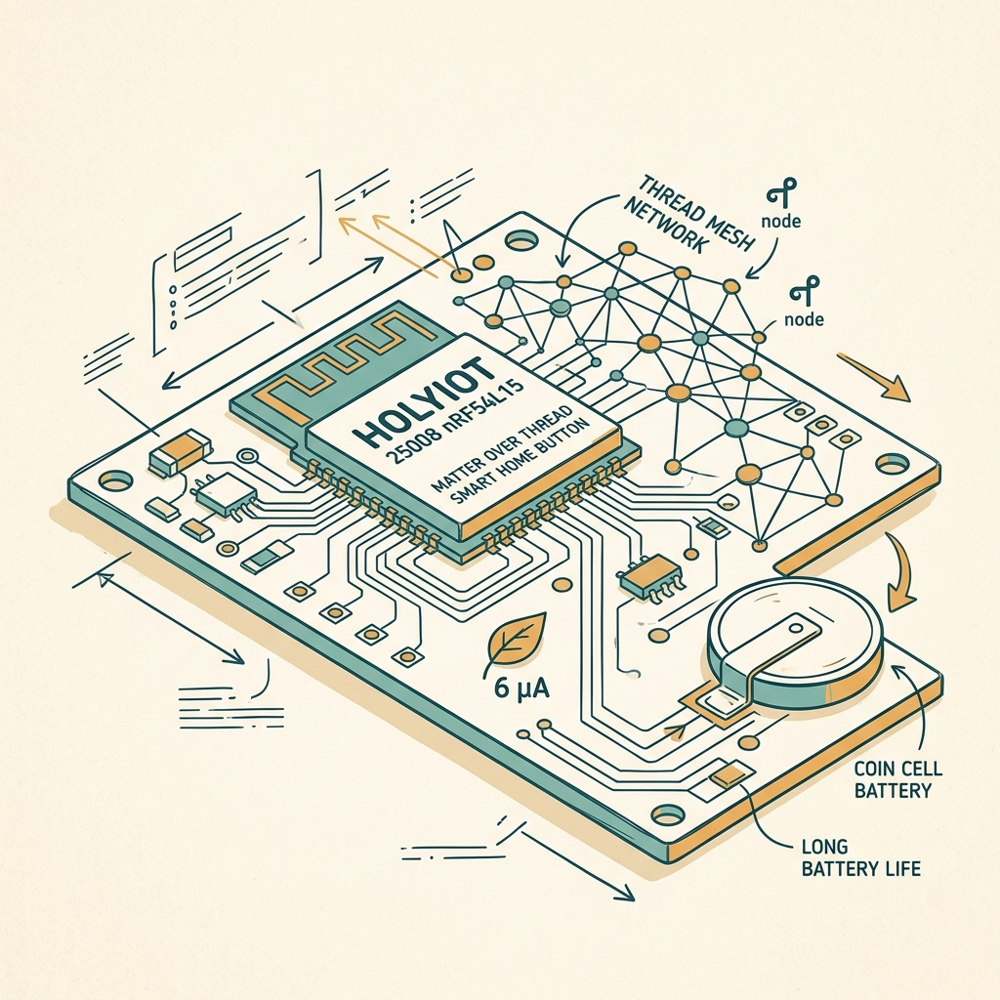
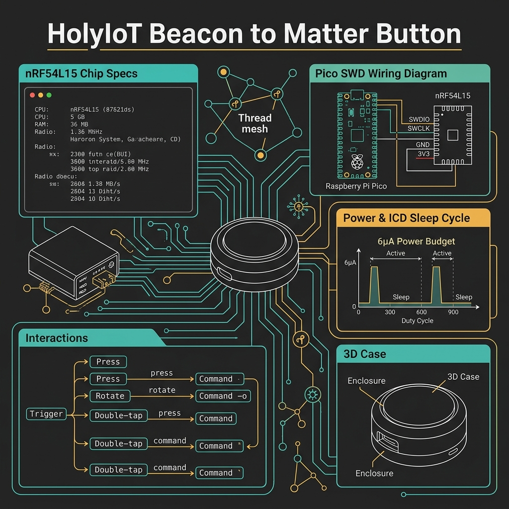
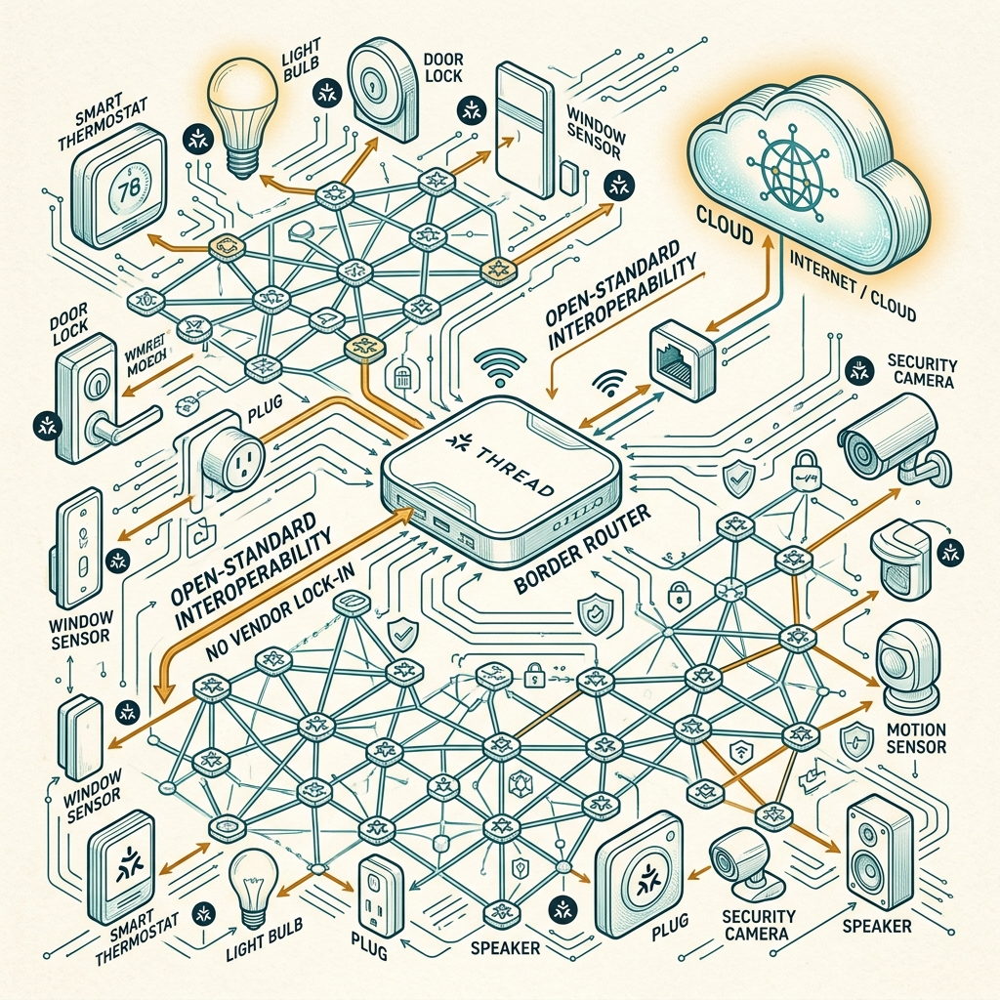

<!-- _class: title -->

# HolyIoT Beacon → Matter Button

ดัดแปลง Bluetooth Beacon $5 เป็นปุ่ม Smart Home กินไฟ 6 µA — ไม่บัดกรี ใช้แบตเตอรี่กระดุม 2+ ปี

<!-- Speaker: $5 AliExpress beacon → fully functional Matter over Thread smart home button. No soldering, just firmware flash. Two-year battery life from a CR2032. -->

---

<!-- _class: cheatsheet -->
<!-- _backgroundColor: #f8f7f4 -->

<!-- Speaker: One-page reference — nRF54L15 specs, SWD wiring, power budget, interaction model. -->

---

## TL;DR: Beacon ราคาถูก → Smart Home Button

HolyIoT 25008 contains an nRF54L15 SoC — the same chip used in Nordic's $99 dev kit.

<svg viewBox="0 0 1100 340" width="100%" xmlns="http://www.w3.org/2000/svg">
  <rect x="40" y="30" width="1020" height="280" rx="16" fill="var(--paper)" stroke="var(--soft-2)" stroke-width="1.5" style="filter:drop-shadow(0 4px 12px rgba(15,23,42,.08))"/>
  <rect x="40" y="30" width="8" height="280" rx="4" fill="var(--accent)"/>
  <!-- Step boxes -->
  <rect x="100" y="70" width="180" height="80" rx="10" fill="var(--accent-wash)" stroke="var(--accent)" stroke-width="1.5"/>
  <text x="190" y="102" font-size="14" font-weight="700" fill="var(--accent-deep)" text-anchor="middle" font-family="system-ui">HolyIoT 25008</text>
  <text x="190" y="122" font-size="12" fill="var(--ink-dim)" text-anchor="middle" font-family="system-ui">nRF54L15 inside</text>
  <text x="190" y="139" font-size="11" fill="var(--muted)" text-anchor="middle" font-family="system-ui">$5-10 on AliExpress</text>
  <!-- arrow -->
  <line x1="282" y1="110" x2="340" y2="110" stroke="var(--accent)" stroke-width="2" marker-end="url(#arr)"/>
  <defs><marker id="arr" markerWidth="8" markerHeight="6" refX="6" refY="3" orient="auto"><polygon points="0 0,8 3,0 6" fill="var(--accent)"/></marker></defs>
  <rect x="342" y="70" width="180" height="80" rx="10" fill="var(--success-wash)" stroke="var(--success)" stroke-width="1.5"/>
  <text x="432" y="102" font-size="14" font-weight="700" fill="var(--success-ink)" text-anchor="middle" font-family="system-ui">Pico Probe Flash</text>
  <text x="432" y="122" font-size="12" fill="var(--ink-dim)" text-anchor="middle" font-family="system-ui">SWD - no soldering</text>
  <text x="432" y="139" font-size="11" fill="var(--muted)" text-anchor="middle" font-family="system-ui">Zephyr + Matter ICD</text>
  <!-- arrow -->
  <line x1="524" y1="110" x2="582" y2="110" stroke="var(--accent)" stroke-width="2" marker-end="url(#arr)"/>
  <rect x="584" y="70" width="180" height="80" rx="10" fill="var(--warning-wash)" stroke="var(--warning)" stroke-width="1.5"/>
  <text x="674" y="102" font-size="14" font-weight="700" fill="var(--warning-ink)" text-anchor="middle" font-family="system-ui">6 µA Sleep</text>
  <text x="674" y="122" font-size="12" fill="var(--ink-dim)" text-anchor="middle" font-family="system-ui">ICD mode optimized</text>
  <text x="674" y="139" font-size="11" fill="var(--muted)" text-anchor="middle" font-family="system-ui">CR2032 lasts 2+ years</text>
  <!-- arrow -->
  <line x1="766" y1="110" x2="824" y2="110" stroke="var(--accent)" stroke-width="2" marker-end="url(#arr)"/>
  <rect x="826" y="70" width="200" height="80" rx="10" fill="var(--soft)" stroke="var(--accent)" stroke-width="2"/>
  <text x="926" y="102" font-size="14" font-weight="700" fill="var(--ink)" text-anchor="middle" font-family="system-ui">Matter Button</text>
  <text x="926" y="122" font-size="12" fill="var(--ink-dim)" text-anchor="middle" font-family="system-ui">Press / Rotate / Tap</text>
  <text x="926" y="139" font-size="11" fill="var(--muted)" text-anchor="middle" font-family="system-ui">Works w/ Apple/Google/HA</text>
  <!-- bottom label -->
  <text x="550" y="270" font-size="13" fill="var(--muted)" text-anchor="middle" font-family="system-ui">No vendor lock-in · Thread mesh · 32 mm form factor · 3D-printed case</text>
  <rect x="0" y="0" width="1" height="1" fill="none"/>
</svg>

<b>★ Takeaway:</b> Flash new firmware via SWD — no hardware modification needed. The chip is already capable.

<!-- Speaker: The entire hack is a firmware flash. Nordic's nRF54L15 supports Matter over Thread natively. -->

---

## Why Matter over Thread?

Open standard — devices from different brands talk directly without cloud dependency.

<svg viewBox="0 0 680 300" width="100%" xmlns="http://www.w3.org/2000/svg">
  <!-- Before: proprietary silos -->
  <rect x="20" y="20" width="280" height="260" rx="12" fill="var(--danger-wash)" stroke="var(--danger)" stroke-width="1.5" opacity=".7"/>
  <text x="160" y="52" font-size="14" font-weight="700" fill="var(--danger-ink)" text-anchor="middle" font-family="system-ui">Proprietary</text>
  <rect x="50" y="70" width="80" height="40" rx="6" fill="var(--paper)" stroke="var(--muted)" stroke-width="1"/>
  <text x="90" y="95" font-size="11" fill="var(--ink-dim)" text-anchor="middle" font-family="system-ui">Brand A</text>
  <rect x="160" y="70" width="80" height="40" rx="6" fill="var(--paper)" stroke="var(--muted)" stroke-width="1"/>
  <text x="200" y="95" font-size="11" fill="var(--ink-dim)" text-anchor="middle" font-family="system-ui">Brand B</text>
  <line x1="90" y1="110" x2="90" y2="145" stroke="var(--muted)" stroke-width="1" stroke-dasharray="4,3"/>
  <line x1="200" y1="110" x2="200" y2="145" stroke="var(--muted)" stroke-width="1" stroke-dasharray="4,3"/>
  <rect x="60" y="145" width="180" height="36" rx="6" fill="var(--danger-wash)" stroke="var(--danger)" stroke-width="1"/>
  <text x="150" y="168" font-size="11" fill="var(--danger-ink)" text-anchor="middle" font-family="system-ui">Cloud Required</text>
  <text x="150" y="230" font-size="11" fill="var(--danger)" text-anchor="middle" font-family="system-ui">Brands cannot talk</text>
  <!-- VS -->
  <text x="340" y="165" font-size="16" font-weight="700" fill="var(--accent)" text-anchor="middle" font-family="system-ui">VS</text>
  <!-- After: Matter -->
  <rect x="380" y="20" width="280" height="260" rx="12" fill="var(--success-wash)" stroke="var(--success)" stroke-width="2"/>
  <text x="520" y="52" font-size="14" font-weight="700" fill="var(--success-ink)" text-anchor="middle" font-family="system-ui">Matter over Thread</text>
  <circle cx="520" cy="145" r="38" fill="var(--success-wash)" stroke="var(--success)" stroke-width="2"/>
  <text x="520" y="150" font-size="12" font-weight="700" fill="var(--success-ink)" text-anchor="middle" font-family="system-ui">Thread</text>
  <circle cx="440" cy="100" r="22" fill="var(--paper)" stroke="var(--success)" stroke-width="1.5"/>
  <text x="440" y="104" font-size="10" fill="var(--ink)" text-anchor="middle" font-family="system-ui">Apple</text>
  <circle cx="600" cy="100" r="22" fill="var(--paper)" stroke="var(--success)" stroke-width="1.5"/>
  <text x="600" y="104" font-size="10" fill="var(--ink)" text-anchor="middle" font-family="system-ui">Google</text>
  <circle cx="440" cy="195" r="22" fill="var(--paper)" stroke="var(--success)" stroke-width="1.5"/>
  <text x="440" y="199" font-size="9" fill="var(--ink)" text-anchor="middle" font-family="system-ui">SmartThings</text>
  <circle cx="600" cy="195" r="22" fill="var(--paper)" stroke="var(--success)" stroke-width="1.5"/>
  <text x="600" y="199" font-size="10" fill="var(--ink)" text-anchor="middle" font-family="system-ui">HA</text>
  <line x1="462" y1="108" x2="498" y2="126" stroke="var(--success)" stroke-width="1.5"/>
  <line x1="578" y1="108" x2="542" y2="126" stroke="var(--success)" stroke-width="1.5"/>
  <line x1="462" y1="185" x2="498" y2="167" stroke="var(--success)" stroke-width="1.5"/>
  <line x1="578" y1="185" x2="542" y2="167" stroke="var(--success)" stroke-width="1.5"/>
  <text x="520" y="248" font-size="11" fill="var(--success-ink)" text-anchor="middle" font-family="system-ui">Local mesh, no cloud</text>
  <rect x="0" y="0" width="1" height="1" fill="none"/>
</svg>

<b>★ Takeaway:</b> Matter over Thread = open interoperability + local control + no cloud dependency.

<!-- Speaker: HolyIoT 25008 costs $5-10; same nRF54L15 chip as $99 Nordic dev kit. Matter open standard supported natively. -->

---

## nRF54L15: Power Budget @ ICD Mode

ICD (Intermittently Connected Device) is Matter's battery-device standard — sleep almost always, wake on events.

| Parameter | Value |
|---|---|
| System ON sleep + 256 KB RAM retention | ~3.0 µA |
| Thread TX peak (radio active) | ~4–7 mA |
| Average current — ICD button mode | **~6 µA** |
| CR2032 capacity | 225 mAh |
| **Estimated battery life** | **> 2 years** |

<b>★ Takeaway:</b> 6 µA average = CR2032 lasting 2+ years. ICD mode is the critical enabler — disable UART, LOG, SHELL; set slow poll 30 s.

<!-- Speaker: nRF54L15 in System ON with RAM retention draws only 3 µA baseline. The remaining 3 µA budget accounts for periodic Thread check-in pulses every 30 seconds. -->

---

## HolyIoT 25008: What's on the Board

32 mm module, nRF54L15 SoC, all peripherals needed for a smart button — no extra components required.

  

    
Compute

    <h3>ARM Cortex-M33</h3>
    
128 MHz · 256 KiB RAM · 1.5 MB Flash · nRF54L15 SoC

    
BLE 6.0 · Thread · Zigbee · Matter

  

  

    
Onboard Peripherals

    <h3>Ready to Use</h3>
    
RGB LED · Push button · LIS2DH12 accelerometer (double-tap interrupt)

    
32 MHz HFXO + 32.768 kHz LFXO crystals

  

  

    
Debug Access

    <h3>SWD Pads</h3>
    
SWDCLK + SWDIO exposed on board edge — no special hardware needed beyond a Pico + 4 wires

  

<b>★ Takeaway:</b> Everything needed is on the board. The LIS2DH12 accelerometer provides double-tap interrupt — no extra GPIO polling required.

<!-- Speaker: Two board variants exist: button-only, and a T&H variant adding temp/humidity sensor at same 6 µA average. -->

---

## Flash Firmware: Pico as SWD Probe

No J-Link needed — Raspberry Pi Pico + Picoprobe firmware + OpenOCD. Four wires, no soldering.

<svg viewBox="0 0 1100 320" width="100%" xmlns="http://www.w3.org/2000/svg">
  <!-- Step 1 -->
  <rect x="30" y="60" width="200" height="200" rx="12" fill="var(--paper)" stroke="var(--soft-2)" stroke-width="1.5" style="filter:drop-shadow(0 2px 6px rgba(15,23,42,.06))"/>
  <circle cx="130" cy="100" r="20" fill="var(--accent)"/>
  <text x="130" y="105" font-size="14" font-weight="700" fill="white" text-anchor="middle" font-family="system-ui">1</text>
  <text x="130" y="138" font-size="13" font-weight="700" fill="var(--ink)" text-anchor="middle" font-family="system-ui">Flash Picoprobe</text>
  <text x="130" y="158" font-size="11" fill="var(--ink-dim)" text-anchor="middle" font-family="system-ui">Hold BOOTSEL</text>
  <text x="130" y="176" font-size="11" fill="var(--ink-dim)" text-anchor="middle" font-family="system-ui">Drag .uf2 to RPI-RP2</text>
  <text x="130" y="194" font-size="10" fill="var(--muted)" text-anchor="middle" font-family="system-ui">github.com/raspberrypi</text>
  <text x="130" y="210" font-size="10" fill="var(--muted)" text-anchor="middle" font-family="system-ui">/picoprobe/releases</text>
  <!-- arrow -->
  <line x1="232" y1="160" x2="290" y2="160" stroke="var(--accent)" stroke-width="2" marker-end="url(#a2)"/>
  <defs><marker id="a2" markerWidth="8" markerHeight="6" refX="6" refY="3" orient="auto"><polygon points="0 0,8 3,0 6" fill="var(--accent)"/></marker></defs>
  <!-- Step 2 -->
  <rect x="292" y="60" width="200" height="200" rx="12" fill="var(--paper)" stroke="var(--soft-2)" stroke-width="1.5" style="filter:drop-shadow(0 2px 6px rgba(15,23,42,.06))"/>
  <circle cx="392" cy="100" r="20" fill="var(--accent)"/>
  <text x="392" y="105" font-size="14" font-weight="700" fill="white" text-anchor="middle" font-family="system-ui">2</text>
  <text x="392" y="138" font-size="13" font-weight="700" fill="var(--ink)" text-anchor="middle" font-family="system-ui">Wire SWD</text>
  <text x="392" y="158" font-size="11" fill="var(--ink-dim)" text-anchor="middle" font-family="system-ui">GP2 → SWDCLK</text>
  <text x="392" y="176" font-size="11" fill="var(--ink-dim)" text-anchor="middle" font-family="system-ui">GP3 → SWDIO</text>
  <text x="392" y="194" font-size="11" fill="var(--muted)" text-anchor="middle" font-family="system-ui">GND → GND</text>
  <text x="392" y="212" font-size="11" fill="var(--muted)" text-anchor="middle" font-family="system-ui">3V3 → VDD</text>
  <!-- arrow -->
  <line x1="494" y1="160" x2="552" y2="160" stroke="var(--accent)" stroke-width="2" marker-end="url(#a2)"/>
  <!-- Step 3 -->
  <rect x="554" y="60" width="200" height="200" rx="12" fill="var(--paper)" stroke="var(--soft-2)" stroke-width="1.5" style="filter:drop-shadow(0 2px 6px rgba(15,23,42,.06))"/>
  <circle cx="654" cy="100" r="20" fill="var(--accent)"/>
  <text x="654" y="105" font-size="14" font-weight="700" fill="white" text-anchor="middle" font-family="system-ui">3</text>
  <text x="654" y="138" font-size="13" font-weight="700" fill="var(--ink)" text-anchor="middle" font-family="system-ui">Build Firmware</text>
  <text x="654" y="158" font-size="11" fill="var(--ink-dim)" text-anchor="middle" font-family="system-ui">west build</text>
  <text x="654" y="176" font-size="11" fill="var(--muted)" text-anchor="middle" font-family="system-ui">-b holyiot_25008</text>
  <text x="654" y="194" font-size="11" fill="var(--muted)" text-anchor="middle" font-family="system-ui">/nrf54l15/cpuapp</text>
  <text x="654" y="212" font-size="10" fill="var(--muted)" text-anchor="middle" font-family="system-ui">nRF Connect SDK v2.9</text>
  <!-- arrow -->
  <line x1="756" y1="160" x2="814" y2="160" stroke="var(--accent)" stroke-width="2" marker-end="url(#a2)"/>
  <!-- Step 4 -->
  <rect x="816" y="60" width="250" height="200" rx="12" fill="var(--success-wash)" stroke="var(--success)" stroke-width="2" style="filter:drop-shadow(0 4px 12px rgba(15,23,42,.08))"/>
  <circle cx="941" cy="100" r="20" fill="var(--success)"/>
  <text x="941" y="105" font-size="14" font-weight="700" fill="white" text-anchor="middle" font-family="system-ui">4</text>
  <text x="941" y="138" font-size="13" font-weight="700" fill="var(--success-ink)" text-anchor="middle" font-family="system-ui">Flash + Commission</text>
  <text x="941" y="158" font-size="11" fill="var(--ink-dim)" text-anchor="middle" font-family="system-ui">west flash --runner openocd</text>
  <text x="941" y="178" font-size="11" fill="var(--ink-dim)" text-anchor="middle" font-family="system-ui">RGB blinks = commissioning</text>
  <text x="941" y="196" font-size="11" fill="var(--success-ink)" text-anchor="middle" font-family="system-ui">Scan QR in Home / HA</text>
  <text x="941" y="214" font-size="11" fill="var(--success-ink)" text-anchor="middle" font-family="system-ui">Joins Thread via border router</text>
  <rect x="0" y="0" width="1" height="1" fill="none"/>
</svg>

<b>★ Takeaway:</b> Raspberry Pi Pico replaces a $400 J-Link. Picoprobe firmware turns it into a CMSIS-DAP SWD probe OpenOCD can drive.

<!-- Speaker: The SWD pads are small — 0.8 mm pitch on some revisions. Use pogo pins or temporarily tack wires. -->

---

## Interaction Model: 3 Gestures

Press, rotate, double-tap — all on a 32 mm button. LIS2DH12 accelerometer handles double-tap via interrupt, not polling.

| Gesture | Function | Hardware |
|---|---|---|
| Single press | Toggle ON / OFF | Push button interrupt |
| Rotate (encoder) | Dim ± 10% per step | External rotary encoder |
| Double-tap | Activate sensor mode for 60 s | LIS2DH12 double-tap interrupt |

<b>★ Takeaway:</b> Double-tap uses the LIS2DH12 interrupt line — CPU stays in deep sleep until the accelerometer fires. Zero polling cost.

<!-- Speaker: The double-tap interrupt wakes the nRF54L15 from sleep. It then fires a Thread packet and sleeps again. The whole wake window is under 10 ms. -->

---

## Power Optimization: Config Knobs

Six Kconfig lines take the board from beacon defaults to 6 µA Matter button mode.

<svg viewBox="0 0 1100 340" width="100%" xmlns="http://www.w3.org/2000/svg">
  <!-- Left: what to disable -->
  <rect x="30" y="20" width="480" height="300" rx="12" fill="var(--danger-wash)" stroke="var(--danger)" stroke-width="1.5"/>
  <rect x="30" y="20" width="480" height="48" rx="12" fill="var(--danger)" opacity=".12"/>
  <text x="270" y="50" font-size="15" font-weight="700" fill="var(--danger-ink)" text-anchor="middle" font-family="system-ui">Disable (saves ~2-3 µA each)</text>
  <text x="70" y="96" font-size="13" font-family="monospace" fill="var(--ink)">CONFIG_UART_CONSOLE=n</text>
  <text x="70" y="124" font-size="13" font-family="monospace" fill="var(--ink)">CONFIG_LOG=n</text>
  <text x="70" y="152" font-size="13" font-family="monospace" fill="var(--ink)">CONFIG_SHELL=n</text>
  <text x="70" y="190" font-size="11" fill="var(--danger-ink)" font-family="system-ui">Each active peripheral holds wakelock</text>
  <text x="70" y="210" font-size="11" fill="var(--danger-ink)" font-family="system-ui">and prevents deep sleep entry.</text>
  <!-- Right: what to tune -->
  <rect x="590" y="20" width="480" height="300" rx="12" fill="var(--success-wash)" stroke="var(--success)" stroke-width="2"/>
  <rect x="590" y="20" width="480" height="48" rx="12" fill="var(--success)" opacity=".12"/>
  <text x="830" y="50" font-size="15" font-weight="700" fill="var(--success-ink)" text-anchor="middle" font-family="system-ui">Tune (ICD timers + clock source)</text>
  <text x="630" y="96" font-size="12" font-family="monospace" fill="var(--ink)">CONFIG_CHIP_ICD_SLOW_POLL</text>
  <text x="630" y="116" font-size="12" font-family="monospace" fill="var(--ink)">  _INTERVAL=30000</text>
  <text x="630" y="148" font-size="12" font-family="monospace" fill="var(--ink)">CONFIG_CHIP_ICD_FAST_POLLING</text>
  <text x="630" y="168" font-size="12" font-family="monospace" fill="var(--ink)">  _INTERVAL=200</text>
  <text x="630" y="200" font-size="12" font-family="monospace" fill="var(--ink)">CONFIG_CLOCK_CONTROL_NRF</text>
  <text x="630" y="220" font-size="12" font-family="monospace" fill="var(--ink)">  _K32SRC_XTAL=y</text>
  <text x="630" y="258" font-size="11" fill="var(--success-ink)" font-family="system-ui">LFXO crystal = lower drift = fewer</text>
  <text x="630" y="278" font-size="11" fill="var(--success-ink)" font-family="system-ui">wakeup corrections = lower avg µA.</text>
  <rect x="0" y="0" width="1" height="1" fill="none"/>
</svg>

<b>★ Takeaway:</b> Disable UART/LOG/SHELL first — they're the biggest offenders. Then tune ICD slow-poll to 30 s and switch to LFXO crystal.

<!-- Speaker: LFXO crystal vs RC oscillator: crystal is more accurate so needs fewer recalibration wakeups, saving ~0.5 µA on average. -->

---

## Build Your Own: 6 Steps

From AliExpress order to commissioned Matter button — everything you need.

<svg viewBox="0 0 1100 300" width="100%" xmlns="http://www.w3.org/2000/svg">
  <!-- 6 steps in 2 rows of 3 -->
  <!-- Row 1 -->
  <rect x="30" y="20" width="300" height="110" rx="10" fill="var(--paper)" stroke="var(--soft-2)" stroke-width="1.5" style="filter:drop-shadow(0 2px 6px rgba(15,23,42,.06))"/>
  <circle cx="68" cy="55" r="18" fill="var(--accent)"/>
  <text x="68" y="60" font-size="13" font-weight="700" fill="white" text-anchor="middle" font-family="system-ui">1</text>
  <text x="200" y="52" font-size="13" font-weight="700" fill="var(--ink)" text-anchor="middle" font-family="system-ui">Order HolyIoT 25008</text>
  <text x="200" y="72" font-size="11" fill="var(--ink-dim)" text-anchor="middle" font-family="system-ui">AliExpress ~$5-10</text>
  <text x="200" y="100" font-size="10" fill="var(--muted)" text-anchor="middle" font-family="system-ui">+ Pico + 4x Dupont wires</text>

  <rect x="400" y="20" width="300" height="110" rx="10" fill="var(--paper)" stroke="var(--soft-2)" stroke-width="1.5" style="filter:drop-shadow(0 2px 6px rgba(15,23,42,.06))"/>
  <circle cx="438" cy="55" r="18" fill="var(--accent)"/>
  <text x="438" y="60" font-size="13" font-weight="700" fill="white" text-anchor="middle" font-family="system-ui">2</text>
  <text x="570" y="52" font-size="13" font-weight="700" fill="var(--ink)" text-anchor="middle" font-family="system-ui">Setup nRF Connect SDK</text>
  <text x="570" y="72" font-size="11" fill="var(--ink-dim)" text-anchor="middle" font-family="system-ui">west init + west update</text>
  <text x="570" y="100" font-size="10" fill="var(--muted)" text-anchor="middle" font-family="system-ui">nRF Connect for VS Code</text>

  <rect x="770" y="20" width="300" height="110" rx="10" fill="var(--paper)" stroke="var(--soft-2)" stroke-width="1.5" style="filter:drop-shadow(0 2px 6px rgba(15,23,42,.06))"/>
  <circle cx="808" cy="55" r="18" fill="var(--accent)"/>
  <text x="808" y="60" font-size="13" font-weight="700" fill="white" text-anchor="middle" font-family="system-ui">3</text>
  <text x="940" y="52" font-size="13" font-weight="700" fill="var(--ink)" text-anchor="middle" font-family="system-ui">Flash Picoprobe</text>
  <text x="940" y="72" font-size="11" fill="var(--ink-dim)" text-anchor="middle" font-family="system-ui">Hold BOOTSEL, drag .uf2</text>
  <text x="940" y="100" font-size="10" fill="var(--muted)" text-anchor="middle" font-family="system-ui">Pi Pico → SWD probe</text>

  <!-- Row 2 -->
  <rect x="30" y="170" width="300" height="110" rx="10" fill="var(--paper)" stroke="var(--soft-2)" stroke-width="1.5" style="filter:drop-shadow(0 2px 6px rgba(15,23,42,.06))"/>
  <circle cx="68" cy="205" r="18" fill="var(--gold)"/>
  <text x="68" y="210" font-size="13" font-weight="700" fill="white" text-anchor="middle" font-family="system-ui">4</text>
  <text x="200" y="202" font-size="13" font-weight="700" fill="var(--ink)" text-anchor="middle" font-family="system-ui">Wire + Build + Flash</text>
  <text x="200" y="222" font-size="11" fill="var(--ink-dim)" text-anchor="middle" font-family="system-ui">4 wires · west build · west flash</text>
  <text x="200" y="250" font-size="10" fill="var(--muted)" text-anchor="middle" font-family="system-ui">LED blinks = ready</text>

  <rect x="400" y="170" width="300" height="110" rx="10" fill="var(--paper)" stroke="var(--soft-2)" stroke-width="1.5" style="filter:drop-shadow(0 2px 6px rgba(15,23,42,.06))"/>
  <circle cx="438" cy="205" r="18" fill="var(--gold)"/>
  <text x="438" y="210" font-size="13" font-weight="700" fill="white" text-anchor="middle" font-family="system-ui">5</text>
  <text x="570" y="202" font-size="13" font-weight="700" fill="var(--ink)" text-anchor="middle" font-family="system-ui">Commission</text>
  <text x="570" y="222" font-size="11" fill="var(--ink-dim)" text-anchor="middle" font-family="system-ui">Home / Google / Home Asst.</text>
  <text x="570" y="250" font-size="10" fill="var(--muted)" text-anchor="middle" font-family="system-ui">Scan QR · joins Thread mesh</text>

  <rect x="770" y="170" width="300" height="110" rx="10" fill="var(--success-wash)" stroke="var(--success)" stroke-width="2" style="filter:drop-shadow(0 4px 12px rgba(15,23,42,.08))"/>
  <circle cx="808" cy="205" r="18" fill="var(--success)"/>
  <text x="808" y="210" font-size="13" font-weight="700" fill="white" text-anchor="middle" font-family="system-ui">6</text>
  <text x="940" y="202" font-size="13" font-weight="700" fill="var(--success-ink)" text-anchor="middle" font-family="system-ui">3D Print + Install</text>
  <text x="940" y="222" font-size="11" fill="var(--ink-dim)" text-anchor="middle" font-family="system-ui">CR2032 inside · wall-mount</text>
  <text x="940" y="250" font-size="10" fill="var(--success-ink)" text-anchor="middle" font-family="system-ui">2+ year battery life</text>
  <rect x="0" y="0" width="1" height="1" fill="none"/>
</svg>

<b>★ Takeaway:</b> Total BOM: HolyIoT 25008 + Raspberry Pi Pico + 4 Dupont wires + CR2032 + 3D printed case. Under $20.

<!-- Speaker: Need a Thread Border Router in your home already. Apple HomePod mini, Google Nest Hub gen 2, or Raspberry Pi + OpenThread Border Router all work. -->

---

## Caveats & Gotchas

Know before you build — six real-world limits from the project.

  

    
Zephyr Board Status

    <h3>holyiot_25008 — Not Actively Maintained</h3>
    
Works today but may need DTS fixes if Zephyr API changes. Pin to a known-good SDK version.

  

  

    
SWD Pad Size

    <h3>0.8 mm pitch pads</h3>
    
Very small — use pogo pins or temporarily tack thin wires. A steady hand or a 3D-printed jig helps.

  

  

    
Thread Requirement

    <h3>Border Router Needed</h3>
    
Matter over Thread requires a Thread Border Router. Apple HomePod mini, Google Nest Hub gen 2, or Raspberry Pi + OTBR work.

  

  

    
Rotary Dimmer

    <h3>Encoder Not Included</h3>
    
The rotate-to-dim feature needs an external rotary encoder wired to GPIO. The bare 25008 board ships without one.

  

  

    
OTA Updates

    <h3>CONFIG_CHIP_OTA_REQUESTOR</h3>
    
Enabling OTA adds periodic polling overhead. Adds ~0.5 µA average — still well under 10 µA.

  

  

    
Battery Life

    <h3>6 µA is Average, Not Idle</h3>
    
Heavy button use raises peak draw (4–7 mA during Thread TX). Actual life depends on press frequency.

  

<b>★ Takeaway:</b> Pin your SDK version, prep a flashing jig, and verify your border router is already running before starting.

<!-- Speaker: The Zephyr board status "not actively maintained" is not a blocker — it just means you need to test after SDK updates. -->

---

## Key Takeaways

What matters most — from beacon to Matter button.

<svg viewBox="0 0 1100 320" width="100%" xmlns="http://www.w3.org/2000/svg">
  <!-- concentric rings: core = ICD 6µA, middle = hardware, outer = ecosystem -->
  <circle cx="200" cy="160" r="140" fill="none" stroke="var(--soft-2)" stroke-width="1.5"/>
  <circle cx="200" cy="160" r="95" fill="none" stroke="var(--accent)" stroke-width="1.5" opacity=".4"/>
  <circle cx="200" cy="160" r="52" fill="var(--accent)" opacity=".12"/>
  <circle cx="200" cy="160" r="52" fill="none" stroke="var(--accent)" stroke-width="2"/>
  <text x="200" y="155" font-size="13" font-weight="700" fill="var(--accent)" text-anchor="middle" font-family="system-ui">ICD</text>
  <text x="200" y="172" font-size="11" fill="var(--ink)" text-anchor="middle" font-family="system-ui">6 µA avg</text>
  <text x="200" y="80" font-size="12" fill="var(--ink)" text-anchor="middle" font-family="system-ui">nRF54L15</text>
  <text x="200" y="97" font-size="11" fill="var(--muted)" text-anchor="middle" font-family="system-ui">Matter-native SoC</text>
  <text x="60" y="210" font-size="12" fill="var(--muted)" text-anchor="middle" font-family="system-ui">HolyIoT</text>
  <text x="60" y="228" font-size="11" fill="var(--muted)" text-anchor="middle" font-family="system-ui">25008 ~$5</text>
  <text x="340" y="210" font-size="12" fill="var(--muted)" text-anchor="middle" font-family="system-ui">Thread</text>
  <text x="340" y="228" font-size="11" fill="var(--muted)" text-anchor="middle" font-family="system-ui">mesh local</text>
  <!-- right: takeaway list -->
  <rect x="420" y="20" width="660" height="280" rx="12" fill="var(--soft)" stroke="var(--soft-2)" stroke-width="1"/>
  <!-- items as simple rows, ASCII text only -->
  <circle cx="460" cy="65" r="12" fill="var(--accent)"/>
  <text x="460" y="70" font-size="10" font-weight="700" fill="white" text-anchor="middle" font-family="system-ui">1</text>
  <text x="490" y="60" font-size="13" font-weight="700" fill="var(--ink)" font-family="system-ui">$5-10 beacon = full Matter over Thread SoC</text>
  <text x="490" y="78" font-size="11" fill="var(--muted)" font-family="system-ui">nRF54L15 inside holyiot_25008</text>
  <circle cx="460" cy="120" r="12" fill="var(--accent)"/>
  <text x="460" y="125" font-size="10" font-weight="700" fill="white" text-anchor="middle" font-family="system-ui">2</text>
  <text x="490" y="115" font-size="13" font-weight="700" fill="var(--ink)" font-family="system-ui">Pico + Picoprobe replaces $400 J-Link</text>
  <text x="490" y="133" font-size="11" fill="var(--muted)" font-family="system-ui">4 wires, OpenOCD, no soldering</text>
  <circle cx="460" cy="175" r="12" fill="var(--gold)"/>
  <text x="460" y="180" font-size="10" font-weight="700" fill="white" text-anchor="middle" font-family="system-ui">3</text>
  <text x="490" y="170" font-size="13" font-weight="700" fill="var(--ink)" font-family="system-ui">6 µA average → CR2032 lasts 2+ years</text>
  <text x="490" y="188" font-size="11" fill="var(--muted)" font-family="system-ui">Disable UART/LOG/SHELL + tune ICD slow-poll</text>
  <circle cx="460" cy="230" r="12" fill="var(--success)"/>
  <text x="460" y="235" font-size="10" font-weight="700" fill="white" text-anchor="middle" font-family="system-ui">4</text>
  <text x="490" y="225" font-size="13" font-weight="700" fill="var(--ink)" font-family="system-ui">Press / Rotate / Double-tap via onboard HW</text>
  <text x="490" y="243" font-size="11" fill="var(--muted)" font-family="system-ui">LIS2DH12 double-tap interrupt — zero polling cost</text>
  <rect x="0" y="0" width="1" height="1" fill="none"/>
</svg>

<b>★ Takeaway:</b> The whole hack is a firmware flash. The hardware is already capable — buy beacon, flash, commission, done.

<!-- Speaker: Matter over Thread requires a border router but once it's there, any compatible hub works. No vendor lock-in. -->
