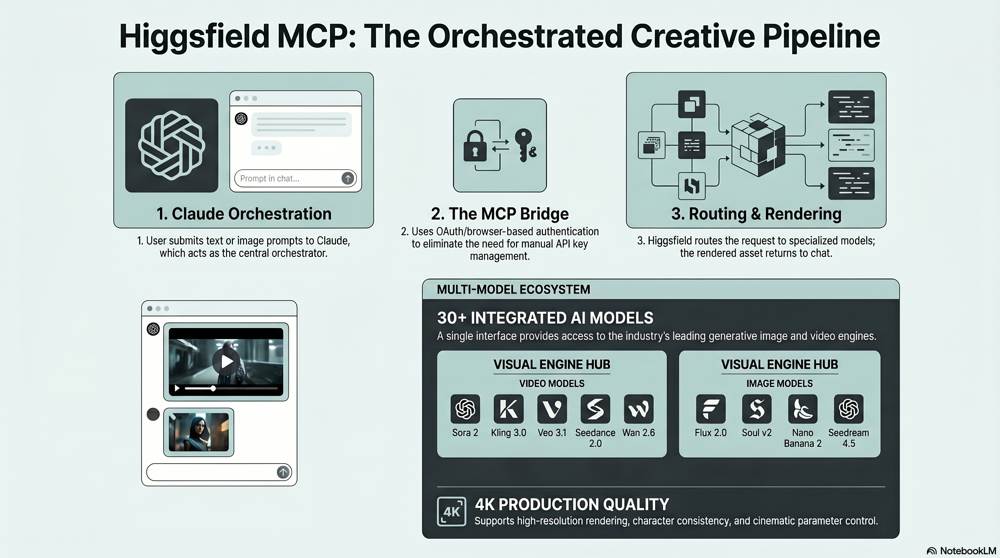

<!-- _class: title -->

# ติดตั้ง Higgsfield MCP Server ใน Claude

สร้าง AI Images & Videos แบบ Agentic — 30+ โมเดลในตัวเดียว ไม่ต้องสลับ Platform

<!-- Speaker: Higgsfield MCP เปลี่ยน Claude จาก text chat เป็น full media production studio — ติดตั้งครั้งเดียว ทำงานได้ทุกโปรเจกต์ -->

---

## Problem: หลาย API = งานหนัก ไม่ Agentic

ก่อน Higgsfield MCP ทุก generation ต้องเปิดแท็บใหม่และเปลี่ยน API key เอง

<svg viewBox="0 0 1100 360" width="100%" xmlns="http://www.w3.org/2000/svg">
  <!-- Before panel -->
  <rect x="40" y="20" width="460" height="320" rx="12" fill="var(--paper)" stroke="var(--soft-2)" stroke-width="1.5" style="filter:drop-shadow(var(--shadow-sm))"/>
  <rect x="40" y="20" width="460" height="52" rx="12" fill="var(--soft)" opacity=".9"/>
  <text x="270" y="51" font-size="16" font-weight="700" fill="var(--ink-dim)" text-anchor="middle" font-family="system-ui">Before: Manual Multi-Tab</text>
  <!-- 4 API boxes -->
  <rect x="76" y="96" width="180" height="46" rx="8" fill="var(--danger-wash)" stroke="var(--danger)" stroke-width="1.5"/>
  <text x="166" y="124" font-size="13" fill="var(--danger-ink)" text-anchor="middle" font-family="system-ui" font-weight="600">Runway API</text>
  <rect x="276" y="96" width="180" height="46" rx="8" fill="var(--danger-wash)" stroke="var(--danger)" stroke-width="1.5"/>
  <text x="366" y="124" font-size="13" fill="var(--danger-ink)" text-anchor="middle" font-family="system-ui" font-weight="600">Kling API</text>
  <rect x="76" y="162" width="180" height="46" rx="8" fill="var(--danger-wash)" stroke="var(--danger)" stroke-width="1.5"/>
  <text x="166" y="190" font-size="13" fill="var(--danger-ink)" text-anchor="middle" font-family="system-ui" font-weight="600">Midjourney</text>
  <rect x="276" y="162" width="180" height="46" rx="8" fill="var(--danger-wash)" stroke="var(--danger)" stroke-width="1.5"/>
  <text x="366" y="190" font-size="13" fill="var(--danger-ink)" text-anchor="middle" font-family="system-ui" font-weight="600">Flux API</text>
  <!-- labels -->
  <text x="166" y="240" font-size="12" fill="var(--muted)" text-anchor="middle" font-family="system-ui">4 separate tabs</text>
  <text x="366" y="240" font-size="12" fill="var(--muted)" text-anchor="middle" font-family="system-ui">4 API keys</text>
  <text x="270" y="268" font-size="12" fill="var(--danger)" text-anchor="middle" font-family="system-ui">No Agentic chain possible</text>
  <!-- VS badge -->
  <circle cx="550" cy="190" r="28" fill="var(--accent)"/>
  <text x="550" y="196" font-size="13" font-weight="700" fill="var(--paper)" text-anchor="middle" dominant-baseline="central" font-family="system-ui">VS</text>
  <!-- After panel -->
  <rect x="600" y="20" width="460" height="320" rx="12" fill="var(--paper)" stroke="var(--accent)" stroke-width="2" style="filter:drop-shadow(var(--shadow-md))"/>
  <rect x="600" y="20" width="460" height="52" rx="12" fill="var(--accent)" opacity=".08"/>
  <text x="830" y="51" font-size="16" font-weight="700" fill="var(--accent)" text-anchor="middle" font-family="system-ui">After: Single MCP Connector</text>
  <!-- Claude box -->
  <rect x="630" y="88" width="400" height="46" rx="8" fill="var(--accent-wash)" stroke="var(--accent)" stroke-width="2"/>
  <text x="830" y="116" font-size="14" fill="var(--accent-deep)" text-anchor="middle" font-family="system-ui" font-weight="700">Claude (orchestrator)</text>
  <!-- Arrow down -->
  <line x1="830" y1="134" x2="830" y2="162" stroke="var(--accent)" stroke-width="2" marker-end="url(#arr)"/>
  <defs><marker id="arr" markerWidth="8" markerHeight="8" refX="4" refY="4" orient="auto"><path d="M1,1 L7,4 L1,7 Z" fill="var(--accent)"/></marker></defs>
  <!-- Higgsfield MCP box -->
  <rect x="680" y="162" width="300" height="46" rx="8" fill="var(--success-wash)" stroke="var(--success)" stroke-width="2"/>
  <text x="830" y="190" font-size="14" fill="var(--success-ink)" text-anchor="middle" font-family="system-ui" font-weight="700">Higgsfield MCP</text>
  <!-- Arrow down -->
  <line x1="830" y1="208" x2="830" y2="236" stroke="var(--success)" stroke-width="2" marker-end="url(#arr2)"/>
  <defs><marker id="arr2" markerWidth="8" markerHeight="8" refX="4" refY="4" orient="auto"><path d="M1,1 L7,4 L1,7 Z" fill="var(--success)"/></marker></defs>
  <!-- 30+ models label -->
  <rect x="680" y="236" width="300" height="46" rx="8" fill="var(--soft)" stroke="var(--soft-2)" stroke-width="1.5"/>
  <text x="830" y="262" font-size="13" fill="var(--ink-dim)" text-anchor="middle" font-family="system-ui">30+ models (1 OAuth login)</text>
  <rect x="600" y="294" width="460" height="3" rx="2" fill="none"/>
</svg>

<b>★ Takeaway:</b> MCP เปลี่ยน workflow จาก manual multi-tab เป็น agentic pipeline ในช่อง chat เดียว

<!-- Speaker: เน้นว่า "agentic" หมายถึง Claude ทำงานแบบ chain ได้เอง — generate → evaluate → refine — โดยไม่ต้องกลับมาถาม -->

---

## Architecture: Claude Orchestrates via MCP Bridge

3-layer handoff: intent translation → secure bridging → render & deliver — no API key exposed to Claude

<figure class="img-card">

<figcaption>Source: NotebookLM · MCP pipeline — Claude orchestration, secure bridge, 30+ model routing, 4K production output</figcaption>
</figure>

<b>★ Takeaway:</b> Credentials stay on Higgsfield's side — Claude never sees your API key, only gets back the finished asset

<!-- Speaker: 3 layers: (1) Claude translates plain-language prompt to structured params, (2) MCP proxies securely with OAuth, (3) Higgsfield renders + returns. -->

---

## 30+ Models: Video Generation

Top video models available via Higgsfield MCP — each optimized for different creative needs

| Model | Strength |
|-------|----------|
| **Veo 3 / 3.1** (Google) | High-fidelity cinematic quality |
| **Sora 2** (OpenAI) | Long-form narrative coherence |
| **Kling 3.0 / 2.6 Turbo** | High speed generation |
| **Seedance 2.0** | Best-in-class motion quality |
| **Wan 2.5 / 2.6** | Open-weight, cost-efficient |
| **MiniMax Hailuo** | Lip-sync + multilingual audio |
| **Soul / Soul Cinema** | Higgsfield proprietary models |

<b>★ Takeaway:</b> สั่ง Claude รัน Veo vs Kling vs Seedance พร้อมกันแล้วเลือกผลลัพธ์ที่ดีที่สุดได้ในคำสั่งเดียว

<!-- Speaker: ไม่ต้องเลือกโมเดลเองก่อนเริ่ม — Claude เลือกให้ หรือรันหลายตัวพร้อมกัน (multi-model showdown) -->

---

## Image Models + MCP Tools Available

16+ image models and 5 core tools for fully agentic media pipelines

  

    
Image Models (16+)

    <h3>AI Image Generation</h3>
    <ul>
      <li><b>Soul 2.0</b> — character consistency</li>
      <li><b>Nano Banana Pro</b> — credit-efficient</li>
      <li><b>Flux 2.0</b> — photorealism</li>
      <li><b>Seedream 4.5 / 5.0</b> — stylized art</li>
      <li><b>GPT Image 2</b> — OpenAI Hazel</li>
    </ul>
  

  

    
MCP Tools Claude Can Call

    <h3>Agentic Capabilities</h3>
    <ul>
      <li><b>generate_image</b> — text-to-image</li>
      <li><b>generate_video</b> — image/text-to-video</li>
      <li><b>create_character</b> — reusable character ref</li>
      <li><b>get_generation_status</b> — async polling</li>
      <li><b>list_characters</b> — manage library</li>
    </ul>
  

<b>★ Takeaway:</b> <code>get_generation_status</code> คือกุญแจ agentic — Claude รอ job เสร็จแล้วทำต่อได้เองโดยอัตโนมัติ

<!-- Speaker: async polling คือสิ่งที่ทำให้ multi-step chain ทำงานได้ — Claude poll status แล้ว chain งานถัดไปต่อเองโดยไม่ต้องกลับมาถาม -->

---

## Install: Claude Desktop / claude.ai

One-time OAuth setup — no API keys, no config files, no restarts

<svg viewBox="0 0 1100 300" width="100%" xmlns="http://www.w3.org/2000/svg">
  <defs>
    <marker id="a1" markerWidth="8" markerHeight="8" refX="4" refY="4" orient="auto">
      <path d="M1,1 L7,4 L1,7 Z" fill="var(--accent)"/>
    </marker>
  </defs>
  <!-- Step boxes -->
  <!-- 1 -->
  <rect x="30" y="110" width="130" height="70" rx="10" fill="var(--accent-wash)" stroke="var(--accent)" stroke-width="1.5"/>
  <circle cx="95" cy="96" r="14" fill="var(--accent)"/>
  <text x="95" y="101" font-size="13" fill="var(--paper)" text-anchor="middle" dominant-baseline="central" font-family="system-ui" font-weight="700">1</text>
  <text x="95" y="140" font-size="12" fill="var(--accent-deep)" text-anchor="middle" font-family="system-ui" font-weight="600">Settings</text>
  <text x="95" y="158" font-size="11" fill="var(--ink-dim)" text-anchor="middle" font-family="system-ui">Connectors</text>
  <!-- arrow -->
  <line x1="160" y1="145" x2="195" y2="145" stroke="var(--accent)" stroke-width="2" marker-end="url(#a1)"/>
  <!-- 2 -->
  <rect x="197" y="110" width="130" height="70" rx="10" fill="var(--accent-wash)" stroke="var(--accent)" stroke-width="1.5"/>
  <circle cx="262" cy="96" r="14" fill="var(--accent)"/>
  <text x="262" y="101" font-size="13" fill="var(--paper)" text-anchor="middle" dominant-baseline="central" font-family="system-ui" font-weight="700">2</text>
  <text x="262" y="140" font-size="12" fill="var(--accent-deep)" text-anchor="middle" font-family="system-ui" font-weight="600">Add Custom</text>
  <text x="262" y="158" font-size="11" fill="var(--ink-dim)" text-anchor="middle" font-family="system-ui">Connector</text>
  <!-- arrow -->
  <line x1="327" y1="145" x2="362" y2="145" stroke="var(--accent)" stroke-width="2" marker-end="url(#a1)"/>
  <!-- 3 -->
  <rect x="364" y="110" width="130" height="70" rx="10" fill="var(--accent-wash)" stroke="var(--accent)" stroke-width="1.5"/>
  <circle cx="429" cy="96" r="14" fill="var(--accent)"/>
  <text x="429" y="101" font-size="13" fill="var(--paper)" text-anchor="middle" dominant-baseline="central" font-family="system-ui" font-weight="700">3</text>
  <text x="429" y="135" font-size="12" fill="var(--accent-deep)" text-anchor="middle" font-family="system-ui" font-weight="600">Name +</text>
  <text x="429" y="152" font-size="11" fill="var(--ink-dim)" text-anchor="middle" font-family="system-ui">Paste MCP URL</text>
  <text x="429" y="170" font-size="10" fill="var(--muted)" text-anchor="middle" font-family="system-ui">mcp.higgsfield.ai/mcp</text>
  <!-- arrow -->
  <line x1="494" y1="145" x2="529" y2="145" stroke="var(--accent)" stroke-width="2" marker-end="url(#a1)"/>
  <!-- 4 -->
  <rect x="531" y="110" width="130" height="70" rx="10" fill="var(--soft)" stroke="var(--soft-2)" stroke-width="1.5"/>
  <circle cx="596" cy="96" r="14" fill="var(--ink-dim)"/>
  <text x="596" y="101" font-size="13" fill="var(--paper)" text-anchor="middle" dominant-baseline="central" font-family="system-ui" font-weight="700">4</text>
  <text x="596" y="140" font-size="12" fill="var(--ink)" text-anchor="middle" font-family="system-ui" font-weight="600">Click Connect</text>
  <text x="596" y="158" font-size="11" fill="var(--ink-dim)" text-anchor="middle" font-family="system-ui">Redirects to OAuth</text>
  <!-- arrow -->
  <line x1="661" y1="145" x2="696" y2="145" stroke="var(--accent)" stroke-width="2" marker-end="url(#a1)"/>
  <!-- 5 -->
  <rect x="698" y="110" width="130" height="70" rx="10" fill="var(--soft)" stroke="var(--soft-2)" stroke-width="1.5"/>
  <circle cx="763" cy="96" r="14" fill="var(--ink-dim)"/>
  <text x="763" y="101" font-size="13" fill="var(--paper)" text-anchor="middle" dominant-baseline="central" font-family="system-ui" font-weight="700">5</text>
  <text x="763" y="140" font-size="12" fill="var(--ink)" text-anchor="middle" font-family="system-ui" font-weight="600">Sign In</text>
  <text x="763" y="158" font-size="11" fill="var(--ink-dim)" text-anchor="middle" font-family="system-ui">Higgsfield account</text>
  <!-- arrow -->
  <line x1="828" y1="145" x2="863" y2="145" stroke="var(--success)" stroke-width="2" marker-end="url(#a2)"/>
  <defs><marker id="a2" markerWidth="8" markerHeight="8" refX="4" refY="4" orient="auto"><path d="M1,1 L7,4 L1,7 Z" fill="var(--success)"/></marker></defs>
  <!-- 6 - READY -->
  <rect x="865" y="96" width="200" height="90" rx="12" fill="var(--success-wash)" stroke="var(--success)" stroke-width="2"/>
  <text x="965" y="135" font-size="15" fill="var(--success-ink)" text-anchor="middle" font-family="system-ui" font-weight="700">Connected!</text>
  <text x="965" y="158" font-size="12" fill="var(--success-ink)" text-anchor="middle" font-family="system-ui">One-time setup</text>
  <text x="965" y="175" font-size="11" fill="var(--muted)" text-anchor="middle" font-family="system-ui">Token stays active</text>
  <rect x="0" y="0" width="1" height="1" fill="none"/>
</svg>

<b>★ Takeaway:</b> Settings → Connectors → URL: <code>https://mcp.higgsfield.ai/mcp</code> → OAuth login → เสร็จ ใช้ครั้งเดียวตลอด

<!-- Speaker: ทั้ง claude.ai web และ Claude Desktop ใช้ขั้นตอนเดียวกัน — เพิ่ม Always Allow เพื่อข้าม approval prompt ทุกครั้ง -->

---

## Install: Claude Code (1 Command)

HTTP-transport MCP — ไม่ต้อง install dependencies; OAuth เปิด browser ครั้งแรกครั้งเดียว

  

    
Terminal Command

    <h3 style="font-family:monospace; font-size:14px; word-break:break-all;">claude mcp add --transport http --scope user higgsfield https://mcp.higgsfield.ai/mcp</h3>
  

  

    

      
--scope user

      <h3>Global (Recommended)</h3>
      
เขียนไปที่ <code>~/.claude/mcp.json</code> — ใช้ได้ทุก project

    

    

      
Verify

      <h3>claude mcp list</h3>
      
ควรเห็น <code>higgsfield  https://mcp.higgsfield.ai/mcp</code>

    

  

<b>★ Takeaway:</b> ใช้ <code>--scope project</code> แทนเพื่อ share config ใน <code>.mcp.json</code> กับทีม — แต่ OAuth ต้อง login แยกคนละคน

<!-- Speaker: ไม่ต้องรัน npm install / pip install อะไร — transport http หมายความว่า Higgsfield รัน server ฝั่งตัวเอง เราแค่ point ไปหา -->

---

## Agentic Workflows: Claude Does Everything

From brief to finished deliverable — Claude calls, waits, evaluates, and re-generates without leaving the chat

<figure class="img-card">

<figcaption>Source: NotebookLM · Agentic pipeline — multi-model showdown, autonomous selection, full production output</figcaption>
</figure>

<b>★ Takeaway:</b> "รัน Veo vs Kling vs Seedance แล้วเลือกตัวที่ดีที่สุด" — Claude ทำ 3 steps นี้ให้เองโดยอัตโนมัติ

<!-- Speaker: real example จาก demo: train character → 6-shot TikTok reel → caption + hashtag — ทำเสร็จในหนึ่งหน้าจอ -->

---

## Free Tier & Pricing Guide

150 credits/month free — ใช้ Nano Banana Pro / Soul V2 เพื่อยืดงบ

<figure class="img-card">

<figcaption>Source: NotebookLM · Credit plans — May 2026 pricing; check higgsfield.ai for current rates</figcaption>
</figure>

<b>★ Takeaway:</b> Free tier มี watermark + selected models เท่านั้น — Nano Banana Pro & Soul V2 มักรวมอยู่ใน free ใช้ได้ทันที

<!-- Speaker: $1 = 16 credits เมื่อซื้อเพิ่ม; credits expire เมื่อยกเลิก account; refund ได้ภายใน 7 วัน (ยังไม่ได้ใช้เท่านั้น) -->

---

## Caveats: OAuth, Credits & Headless Limits

ข้อจำกัดที่ต้องรู้ก่อน deploy ใน production

  

    
OAuth Token

    <h3>Expires Periodically</h3>
    
ต้อง re-auth ผ่าน <code>/mcp</code> panel ใน Claude Code เป็นระยะ

    
ใช้ใน CI / headless ไม่ได้

  

  

    
Credit System

    <h3>Credits = Non-refundable</h3>
    
หมดอายุเมื่อยกเลิก account; refund ได้เฉพาะภายใน 7 วันและยังไม่ได้ใช้เท่านั้น

  

  

    
Headless / CI

    <h3>Use Higgsfield CLI</h3>
    
สำหรับ automation ที่ไม่มี browser — ใช้ CLI แทน MCP (รองรับ non-interactive auth)

  

<b>★ Takeaway:</b> MCP เหมาะ interactive use; CI pipeline ใช้ Higgsfield CLI ที่ <a href="https://higgsfield.ai/cli">higgsfield.ai/cli</a>

<!-- Speaker: model lineup เปลี่ยนได้ตลอด — Sora 2, Veo 3.1 อาจต้องการ Plus plan ตรวจสอบ higgsfield.ai/mcp เสมอ -->

---

## Key Takeaways: Higgsfield MCP in Claude

สิ่งที่ต้องจำหลังปิด slide นี้

  

    
What it does

    <h3>Full Media Orchestration</h3>
    
Claude กลายเป็น production studio — สร้าง ประเมิน แก้ไข ส่งมอบในช่อง chat เดียว

  

  

    
Security

    <h3>Zero API Key Exposure</h3>
    
OAuth ทำให้ credentials อยู่ฝั่ง Higgsfield เสมอ — Claude ไม่เห็น key ของคุณ

  

  

    
Scale

    <h3>30+ Models, 1 Setup</h3>
    
Veo, Sora, Kling, Seedance, Flux, Soul รวมใน MCP เดียว เปลี่ยนโมเดลแค่เปลี่ยน prompt

  

  

    
Free Tier Tip

    <h3>Start with 150 Credits</h3>
    
ใช้ Nano Banana Pro / Soul V2 เพื่อยืดงบ; upgrade เมื่อต้องการ parallel jobs

  

<b>★ Takeaway:</b> ติดตั้ง 1 คำสั่ง — <code>claude mcp add --transport http --scope user higgsfield https://mcp.higgsfield.ai/mcp</code> — แล้วเริ่ม Agentic media workflow ได้เลย

<!-- Speaker: จาก 4 แท็บ 4 API key เหลือ 1 MCP connector — ความ agentic มาจาก get_generation_status ที่ Claude poll เองและ chain งานถัดไปต่อ -->
