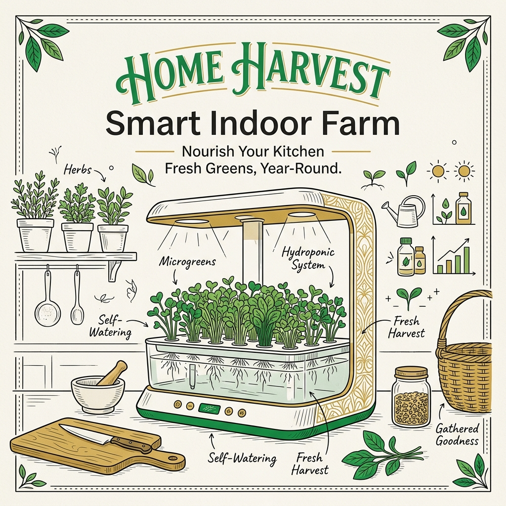
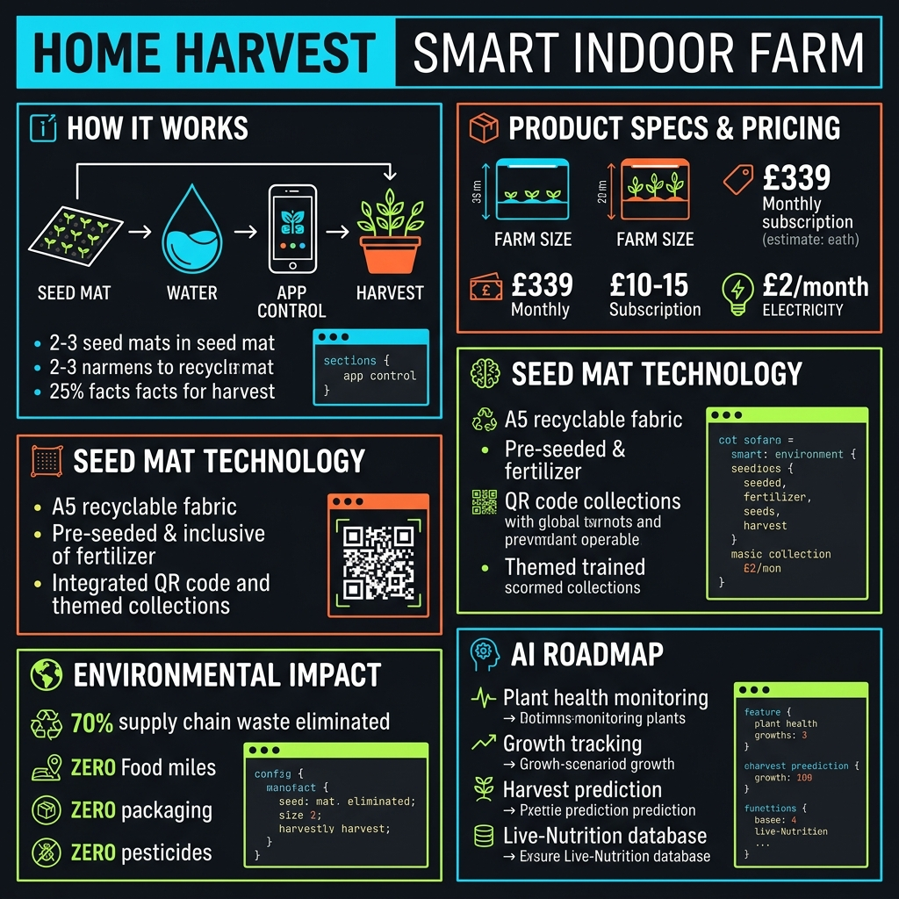
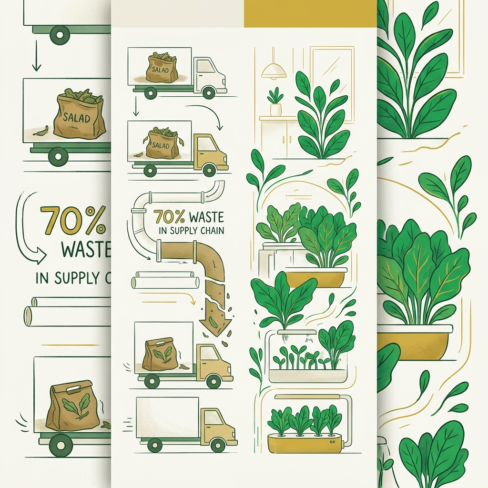
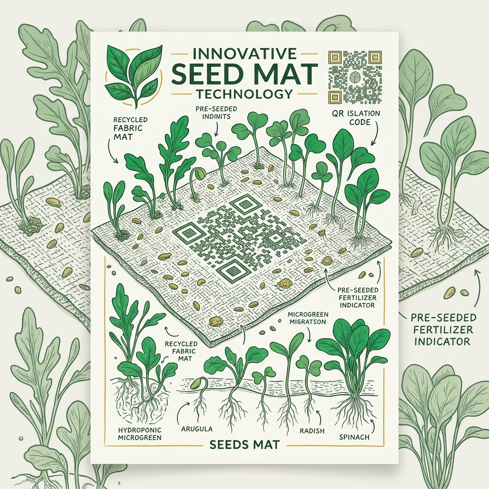
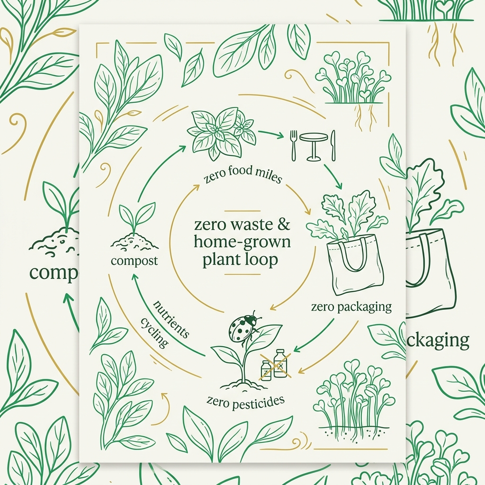
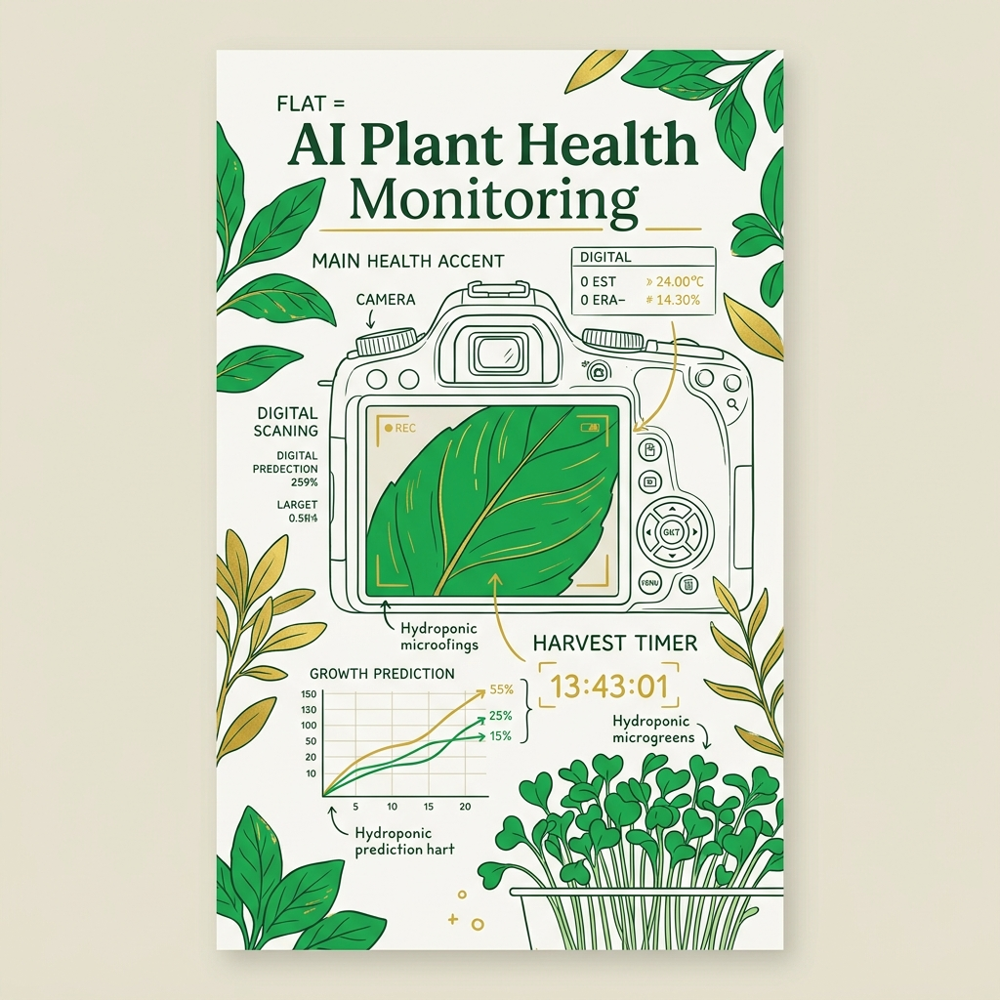

<!-- _class: title -->

# Home Harvest
# Smart Indoor Farm

ปลูกสลัดสดได้ใน 8 วัน — seed mat + full automation

<!-- Speaker: UK agri-tech startup solving the 70% supply chain waste problem with a countertop hydroponic farm. -->

---

<!-- _class: cheatsheet -->
<!-- _backgroundColor: #f8f7f4 -->

<!-- Speaker: Full deck at a glance — 5 zones: how it works, specs, seed mat, env impact, AI roadmap. -->

---

## What is Home Harvest?

A soil-free smart farm that fits on your kitchen counter and delivers fresh greens in 8 days.

  

    
สิ่งที่มันทำ

    <h3>Smart Indoor Farm</h3>
    
เครื่องปลูกผักไร้ดิน (hydroponics) ควบคุมแสง น้ำ อุณหภูมิ และความชื้นอัตโนมัติผ่านแอปฯ ไม่ต้องมีความรู้เรื่องการปลูกพืช

  

  

    
ทำไมมันสำคัญ

    <h3>70% Less Food Waste</h3>
    
ผักสลัดในซูเปอร์มาร์เก็ต 70% สูญเสียก่อนถึงมือผู้บริโภค — Home Harvest ย้ายการปลูกมาในครัวตรงๆ ไม่มีขนส่ง ไม่มีของเหลือ

  

<b>★ Takeaway:</b> Drop in a seed mat, add water, open the app — harvest fresh salad in 8 days, no gardening skill needed.

<!-- Speaker: The pitch in two cards. Left: what the machine does. Right: why it matters now. -->

---

## Supply Chain Broken: 70% of Salad Never Reaches You

UK imports ~1,000 salad trucks/week from Southern Europe and Africa — 400 trucks' worth is discarded.

<svg viewBox="0 0 700 300" width="100%" xmlns="http://www.w3.org/2000/svg">
  <!-- comparison: traditional supply chain vs home harvest -->
  <rect x="20" y="20" width="300" height="260" rx="12" fill="var(--paper)" stroke="var(--soft-2)" stroke-width="1.5" style="filter:drop-shadow(var(--shadow-sm))"/>
  <rect x="20" y="20" width="300" height="48" rx="12" fill="#fee2e2"/>
  <text x="170" y="50" font-size="14" font-weight="700" fill="var(--danger)" text-anchor="middle" font-family="system-ui">Traditional Chain</text>
  <text x="50" y="100" font-size="12" fill="var(--ink)" font-family="system-ui">Farm (Spain/Morocco)</text>
  <text x="50" y="125" font-size="12" fill="var(--ink-dim)" font-family="system-ui">Pack + Refrigerate</text>
  <text x="50" y="150" font-size="12" fill="var(--ink-dim)" font-family="system-ui">Long-haul Transport</text>
  <text x="50" y="175" font-size="12" fill="var(--ink-dim)" font-family="system-ui">Warehouse + Distribution</text>
  <text x="50" y="200" font-size="12" fill="var(--ink-dim)" font-family="system-ui">Supermarket Shelf</text>
  <text x="50" y="240" font-size="13" font-weight="700" fill="var(--danger)" font-family="system-ui">70% wasted along the way</text>
  <rect x="380" y="20" width="300" height="260" rx="12" fill="var(--paper)" stroke="var(--accent)" stroke-width="2" style="filter:drop-shadow(var(--shadow-md))"/>
  <rect x="380" y="20" width="300" height="48" rx="12" fill="var(--success-wash)"/>
  <text x="530" y="50" font-size="14" font-weight="700" fill="var(--accent)" text-anchor="middle" font-family="system-ui">Home Harvest</text>
  <text x="410" y="105" font-size="12" fill="var(--ink)" font-family="system-ui">Seed Mat (A5, pre-seeded)</text>
  <text x="410" y="135" font-size="12" fill="var(--ink)" font-family="system-ui">Insert + Add Water</text>
  <text x="410" y="165" font-size="12" fill="var(--ink)" font-family="system-ui">App Auto-controls</text>
  <text x="410" y="195" font-size="12" fill="var(--ink)" font-family="system-ui">Harvest in 8 days</text>
  <text x="410" y="240" font-size="13" font-weight="700" fill="var(--accent)" font-family="system-ui">0% wasted — pick what you eat</text>
  <circle cx="350" cy="150" r="22" fill="var(--ink)"/>
  <text x="350" y="155" font-size="11" font-weight="700" fill="white" text-anchor="middle" dominant-baseline="central" font-family="system-ui">VS</text>
  <rect x="0" y="0" width="1" height="1" fill="none"/>
</svg>

<b>★ Takeaway:</b> Every salad you grow at home eliminates an entire supply chain that wastes 70% of what it moves.

<!-- Speaker: The problem is systemic, not a UK edge case. 1,000 trucks/week, 400 discarded. -->

---

## How It Works: 4 Steps, No Expertise Needed

Soil-free, mess-free. The system manages light, water, temperature, and humidity automatically.

<svg viewBox="0 0 1100 320" width="100%" xmlns="http://www.w3.org/2000/svg">
  <!-- arrow-flow: 4 steps -->
  <!-- Step boxes -->
  <rect x="40" y="80" width="200" height="160" rx="12" fill="var(--paper)" stroke="var(--soft-2)" stroke-width="1.5" style="filter:drop-shadow(var(--shadow-sm))"/>
  <rect x="40" y="80" width="200" height="6" rx="3" fill="var(--accent)"/>
  <circle cx="140" cy="138" r="24" fill="var(--accent)" opacity=".12"/>
  <circle cx="140" cy="138" r="18" fill="var(--accent)"/>
  <text x="140" y="143" font-size="14" font-weight="700" fill="white" text-anchor="middle" dominant-baseline="central" font-family="system-ui">1</text>
  <text x="140" y="180" font-size="13" font-weight="700" fill="var(--ink)" text-anchor="middle" font-family="system-ui">Insert Seed Mat</text>
  <text x="140" y="200" font-size="11" fill="var(--muted)" text-anchor="middle" font-family="system-ui">A5 fabric, pre-seeded</text>
  <text x="140" y="218" font-size="11" fill="var(--muted)" text-anchor="middle" font-family="system-ui">+ fertilizer built in</text>
  <!-- Arrow 1 -->
  <polygon points="272,155 295,145 295,165" fill="var(--accent)" opacity=".6"/>
  <rect x="252" y="152" width="43" height="6" rx="3" fill="var(--accent)" opacity=".4"/>
  <!-- Step 2 -->
  <rect x="307" y="80" width="200" height="160" rx="12" fill="var(--paper)" stroke="var(--soft-2)" stroke-width="1.5" style="filter:drop-shadow(var(--shadow-sm))"/>
  <rect x="307" y="80" width="200" height="6" rx="3" fill="var(--accent)"/>
  <circle cx="407" cy="138" r="24" fill="var(--accent)" opacity=".12"/>
  <circle cx="407" cy="138" r="18" fill="var(--accent)"/>
  <text x="407" y="143" font-size="14" font-weight="700" fill="white" text-anchor="middle" dominant-baseline="central" font-family="system-ui">2</text>
  <text x="407" y="180" font-size="13" font-weight="700" fill="var(--ink)" text-anchor="middle" font-family="system-ui">Add Water</text>
  <text x="407" y="200" font-size="11" fill="var(--muted)" text-anchor="middle" font-family="system-ui">System auto-doses</text>
  <text x="407" y="218" font-size="11" fill="var(--muted)" text-anchor="middle" font-family="system-ui">nutrients + timing</text>
  <!-- Arrow 2 -->
  <polygon points="539,155 562,145 562,165" fill="var(--accent)" opacity=".6"/>
  <rect x="519" y="152" width="43" height="6" rx="3" fill="var(--accent)" opacity=".4"/>
  <!-- Step 3 -->
  <rect x="574" y="80" width="200" height="160" rx="12" fill="var(--paper)" stroke="var(--soft-2)" stroke-width="1.5" style="filter:drop-shadow(var(--shadow-sm))"/>
  <rect x="574" y="80" width="200" height="6" rx="3" fill="var(--accent)"/>
  <circle cx="674" cy="138" r="24" fill="var(--accent)" opacity=".12"/>
  <circle cx="674" cy="138" r="18" fill="var(--accent)"/>
  <text x="674" y="143" font-size="14" font-weight="700" fill="white" text-anchor="middle" dominant-baseline="central" font-family="system-ui">3</text>
  <text x="674" y="180" font-size="13" font-weight="700" fill="var(--ink)" text-anchor="middle" font-family="system-ui">Select in App</text>
  <text x="674" y="200" font-size="11" fill="var(--muted)" text-anchor="middle" font-family="system-ui">Machine auto-sets light</text>
  <text x="674" y="218" font-size="11" fill="var(--muted)" text-anchor="middle" font-family="system-ui">temp + humidity</text>
  <!-- Arrow 3 -->
  <polygon points="806,155 829,145 829,165" fill="var(--accent)" opacity=".6"/>
  <rect x="786" y="152" width="43" height="6" rx="3" fill="var(--accent)" opacity=".4"/>
  <!-- Step 4 -->
  <rect x="841" y="80" width="220" height="160" rx="12" fill="var(--accent)" style="filter:drop-shadow(var(--shadow-md))"/>
  <circle cx="951" cy="138" r="24" fill="white" opacity=".2"/>
  <circle cx="951" cy="138" r="18" fill="white"/>
  <text x="951" y="143" font-size="14" font-weight="700" fill="var(--accent)" text-anchor="middle" dominant-baseline="central" font-family="system-ui">4</text>
  <text x="951" y="180" font-size="13" font-weight="700" fill="white" text-anchor="middle" font-family="system-ui">Harvest in 8 Days</text>
  <text x="951" y="200" font-size="11" fill="rgba(255,255,255,.8)" text-anchor="middle" font-family="system-ui">Microgreens fastest</text>
  <text x="951" y="218" font-size="11" fill="rgba(255,255,255,.8)" text-anchor="middle" font-family="system-ui">App notifies when ready</text>
  <rect x="0" y="0" width="1" height="1" fill="none"/>
</svg>

<b>★ Takeaway:</b> The app + machine handle every variable — you just insert, add water, and pick what you want to eat.

<!-- Speaker: Step 4 (harvest) is highlighted because that's the payoff that justifies all 3 prior steps. -->

---

## Specs & Pricing

Two sizes to match household needs — running cost is ~£2/month in electricity.

| รายการ | Large (3-tray) | Small (1-tray) |
|--------|---------------|---------------|
| ขนาด | Mini fridge (slim) | Large microwave |
| จำนวน tray | 3 (ปลูกพร้อมกัน 3 ชนิด) | 1 |
| ราคาเครื่อง | ~£339 | ~£339 |
| Subscription seed mat | £10–15/เดือน | £10–15/เดือน |
| ค่าไฟ/เดือน | ~£2 | ~£2 |
| วางแบบ | Freestanding / Integrated | Freestanding / Integrated |

<b>★ Takeaway:</b> Same price for both sizes — buy large if you cook for a family; small for couples. Running cost is negligible at £2/month.

<!-- Speaker: £339 upfront + £10-15/month subscription. Break-even depends on how much bagged salad you currently buy and waste. -->

---

## Seed Mat: The Heart of the System

A5 recyclable fabric with seeds and fertilizer pre-embedded — QR code links directly to grow profile.

  

    
ธีมที่มีจำหน่าย

    <h3>Themed Collections</h3>
    <ul>
      <li>Italian Herbs — โหระพา, ออริกาโน</li>
      <li>Prenatal Health — โฟเลต + ธาตุเหล็ก</li>
      <li>Gut Health — ไฟเบอร์สูง</li>
      <li>Vitamin-focused sets</li>
    </ul>
  

  

    
เทคโนโลยี

    <h3>How It's Built</h3>
    <ul>
      <li>Recyclable fabric substrate</li>
      <li>Pre-seeded + fertilizer integrated</li>
      <li>QR code → auto-sets grow profile</li>
      <li>Radish, chervil, fenugreek, salads</li>
    </ul>
  

<b>★ Takeaway:</b> The subscription model keeps you supplied — seed mats are the razor blades to this razor handle.

<!-- Speaker: Subscription lock-in is both the business model and the key dependency risk. QR code is the smart glue between mat and machine. -->

---

## Zero Food Miles, Zero Packaging, Zero Pesticides

Growing at home eliminates the entire cold-chain logistics footprint of bagged supermarket salad.

  

    
Zero Food Miles

    <h3>ปลูกในบ้าน</h3>
    
ไม่มีการขนส่งข้ามประเทศ ไม่มีการแช่เย็นระหว่างทาง ผักถึงมือตรงๆ จากตัวเครื่อง

  

  

    
Zero Packaging

    <h3>ไม่มีถุงพลาสติก</h3>
    
เก็บเกี่ยวเท่าที่ต้องการ ใส่จาน ไม่มีบรรจุภัณฑ์พลาสติกที่ต้องทิ้ง

  

  

    
Zero Pesticides

    <h3>ควบคุมสภาพแวดล้อม</h3>
    
ระบบปิดสมบูรณ์ ไม่มีแมลงรบกวน ไม่ต้องใช้สารเคมีใดๆ

  

  

    
ลดขยะอาหาร

    <h3>Harvest on Demand</h3>
    
ตัดเท่าที่กินวันนี้ ที่เหลือโตต่อในเครื่อง ผักไม่เน่าเสียในตู้เย็น

  

<b>★ Takeaway:</b> The environmental case isn't just marketing — removing cold-chain transport eliminates a real measurable footprint per household.

<!-- Speaker: UK imports 1,000 trucks/week of salad; 400 are discarded. Home Harvest attacks the demand side of that equation. -->

---

## AI Roadmap: From Automation to Intelligence

Today: automated environment control. Tomorrow: AI that watches your crop and predicts the perfect harvest moment.

<svg viewBox="0 0 700 280" width="100%" xmlns="http://www.w3.org/2000/svg">
  <!-- timeline: 2 phases -->
  <line x1="60" y1="140" x2="650" y2="140" stroke="var(--soft-2)" stroke-width="2"/>
  <!-- Phase 1: Now -->
  <circle cx="160" cy="140" r="18" fill="var(--accent)"/>
  <text x="160" y="145" font-size="11" font-weight="700" fill="white" text-anchor="middle" dominant-baseline="central" font-family="system-ui">NOW</text>
  <rect x="80" y="30" width="160" height="80" rx="10" fill="var(--success-wash)" stroke="var(--accent)" stroke-width="1.5"/>
  <text x="160" y="58" font-size="12" font-weight="700" fill="var(--accent-deep)" text-anchor="middle" font-family="system-ui">Automation</text>
  <text x="160" y="78" font-size="10" fill="var(--ink-dim)" text-anchor="middle" font-family="system-ui">Light / Water / Temp</text>
  <text x="160" y="96" font-size="10" fill="var(--ink-dim)" text-anchor="middle" font-family="system-ui">Humidity auto-control</text>
  <line x1="160" y1="110" x2="160" y2="122" stroke="var(--accent)" stroke-width="1.5" stroke-dasharray="3,2"/>
  <!-- Phase 2: Near term -->
  <circle cx="380" cy="140" r="18" fill="var(--warning)" opacity=".8"/>
  <text x="380" y="145" font-size="9" font-weight="700" fill="white" text-anchor="middle" dominant-baseline="central" font-family="system-ui">SOON</text>
  <rect x="300" y="170" width="160" height="80" rx="10" fill="var(--warning-wash)" stroke="var(--warning)" stroke-width="1.5"/>
  <text x="380" y="198" font-size="12" font-weight="700" fill="var(--warning-ink)" text-anchor="middle" font-family="system-ui">AI Vision</text>
  <text x="380" y="218" font-size="10" fill="var(--ink-dim)" text-anchor="middle" font-family="system-ui">Plant health scan</text>
  <text x="380" y="236" font-size="10" fill="var(--ink-dim)" text-anchor="middle" font-family="system-ui">Harvest time prediction</text>
  <line x1="380" y1="158" x2="380" y2="170" stroke="var(--warning)" stroke-width="1.5" stroke-dasharray="3,2"/>
  <!-- Phase 3: Future -->
  <circle cx="590" cy="140" r="18" fill="var(--muted)"/>
  <text x="590" y="145" font-size="9" font-weight="700" fill="white" text-anchor="middle" dominant-baseline="central" font-family="system-ui">FUTURE</text>
  <rect x="510" y="30" width="160" height="80" rx="10" fill="var(--soft-2)" stroke="var(--muted)" stroke-width="1.5" stroke-dasharray="5,3"/>
  <text x="590" y="58" font-size="12" font-weight="700" fill="var(--muted)" text-anchor="middle" font-family="system-ui">Live-Nutrition DB</text>
  <text x="590" y="78" font-size="10" fill="var(--muted)" text-anchor="middle" font-family="system-ui">Personalized diet advice</text>
  <text x="590" y="96" font-size="10" fill="var(--muted)" text-anchor="middle" font-family="system-ui">Biometrics + crop data</text>
  <line x1="590" y1="110" x2="590" y2="122" stroke="var(--muted)" stroke-width="1.5" stroke-dasharray="3,2"/>
  <rect x="0" y="0" width="1" height="1" fill="none"/>
</svg>

<b>★ Takeaway:</b> AI health monitoring and harvest prediction are roadmap — not shipping yet. Buy now for automation; the AI ambition is aspirational.

<!-- Speaker: The Live-Nutrition database is the long-game: a dataset linking crop growth data to biometric outcomes. Ambitious, but no timeline. -->

---

## Caveats: What to Watch Before Buying

Pre-order product with real dependency and cost considerations — not right for everyone.

  

    
ราคา

    <h3>Cost Break-even</h3>
    
£339 + £10-15/mo subscription. ถูกกว่าผักซูเปอร์มาร์เก็ตก็ต่อเมื่อลดขยะอาหารได้จริง ไม่ใช่ทุกคนที่ซื้อผักแล้วทิ้งมาก

  

  

    
Dependency

    <h3>Seed Mat Lock-in</h3>
    
ถ้าบริษัทหยุดให้บริการหรือขึ้นราคา subscription ตัวเครื่องจะใช้งานยาก — hardware มีค่าก็ต่อเมื่อ seed supply chain ทำงาน

  

  

    
Scope

    <h3>Greens Only</h3>
    
เหมาะสำหรับ microgreens, สลัด, และสมุนไพรเท่านั้น ผักหัว ผลไม้ หรือพืชขนาดใหญ่ ปลูกในเครื่องนี้ไม่ได้

  

<b>★ Takeaway:</b> The AI features are still roadmap; you're buying today's automation — strong for salad lovers, risky if you're not already a heavy salad buyer.

<!-- Speaker: Pre-order risk is real. 4 years of development is promising but product is unproven at consumer scale. -->

---

## Key Takeaways

Home Harvest bets that convenience + sustainability convert salad buyers into home growers.

  

    
The Case For

    <h3>Why It Could Win</h3>
    <ul>
      <li>8-day harvest — genuinely fast</li>
      <li>Zero skills, zero mess, zero waste</li>
      <li>£2/mo electricity — negligible OpEx</li>
      <li>AI roadmap adds long-term value</li>
      <li>Summer 2026 — real launch window</li>
    </ul>
  

  

    
The Case Against

    <h3>Why It Might Struggle</h3>
    <ul>
      <li>£339 + £10-15/mo is a premium bet</li>
      <li>Seed mat subscription = vendor lock-in</li>
      <li>Greens only — limited crop variety</li>
      <li>AI features still unshipped roadmap</li>
      <li>Pre-order: unproven at consumer scale</li>
    </ul>
  

<b>★ Takeaway:</b> ถ้าคุณซื้อผักสลัดสัปดาห์ละครั้งแล้วทิ้งครึ่ง — Home Harvest คือ hardware ที่แก้ปัญหานั้นได้จริง ถ้าไม่ใช่ — ราคายังสูงเกินไป

<!-- Speaker: The sustainability narrative is compelling. The subscription model and pre-order status are the two risk flags to watch. -->
