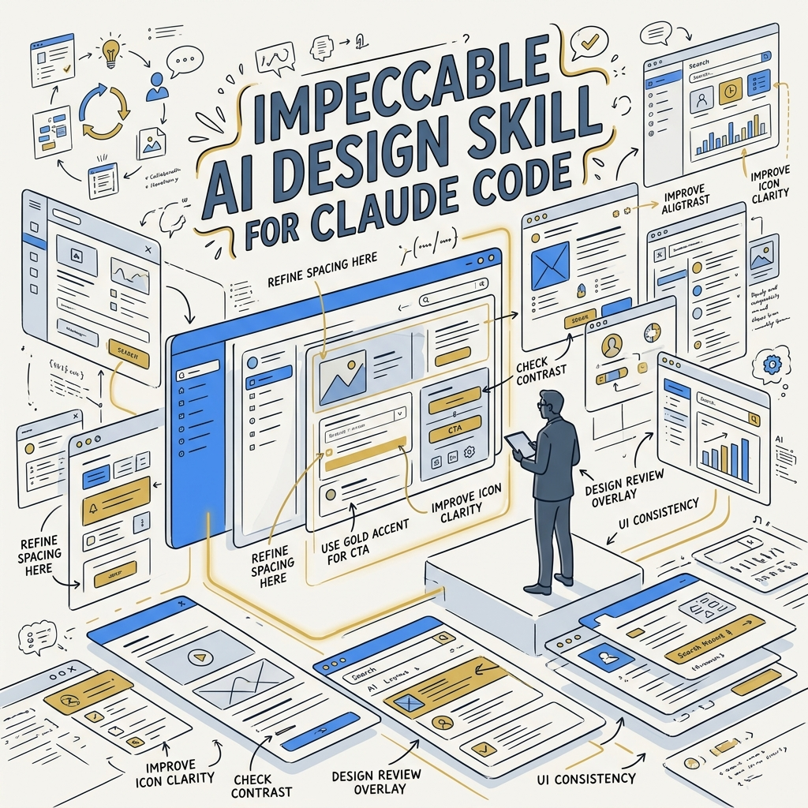
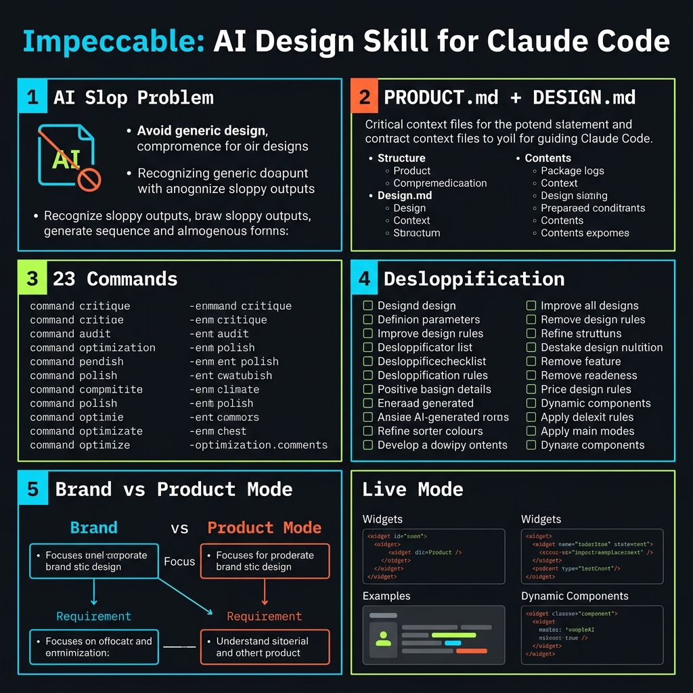
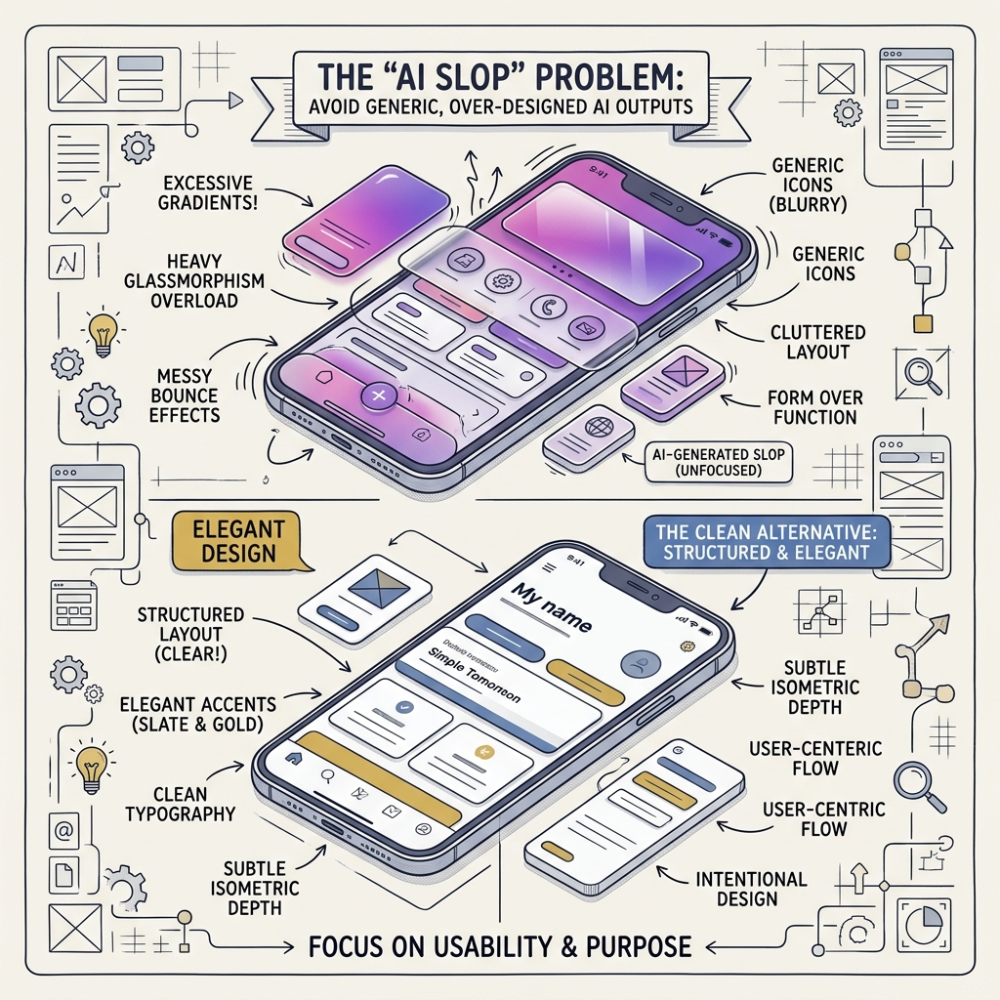
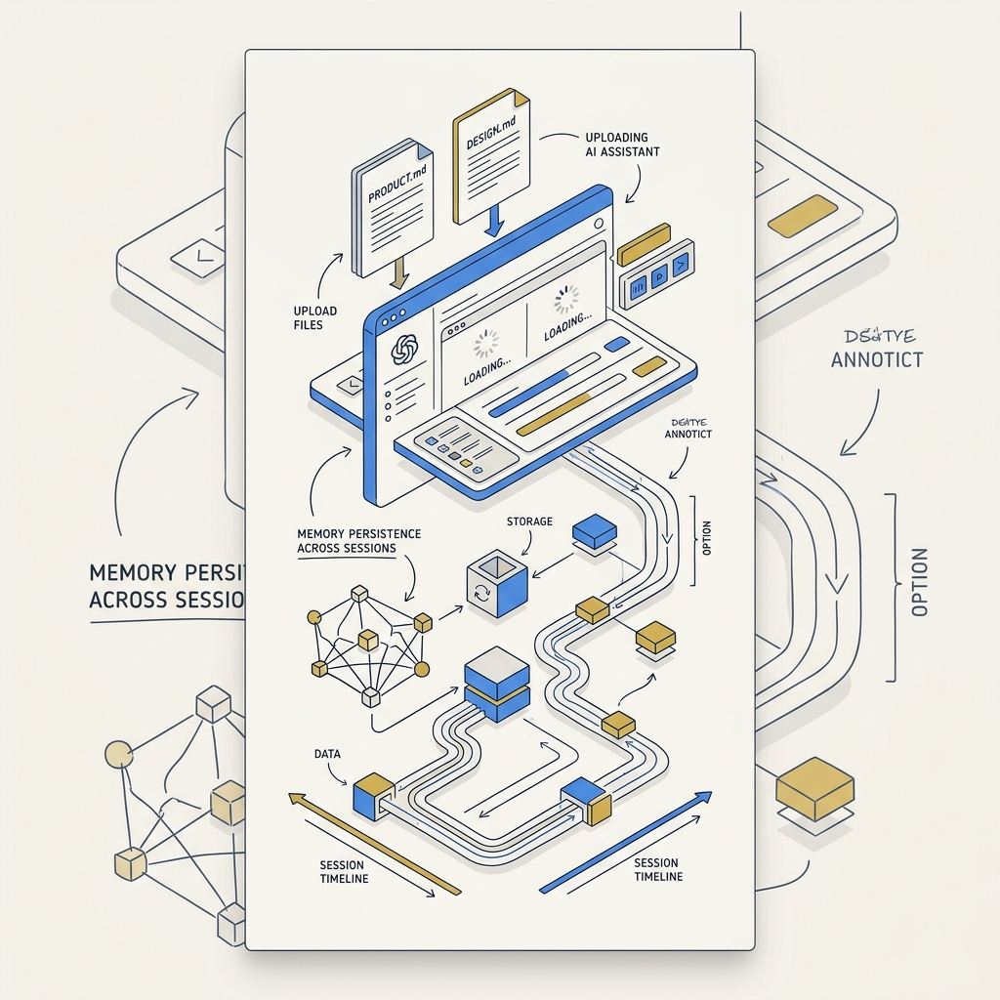
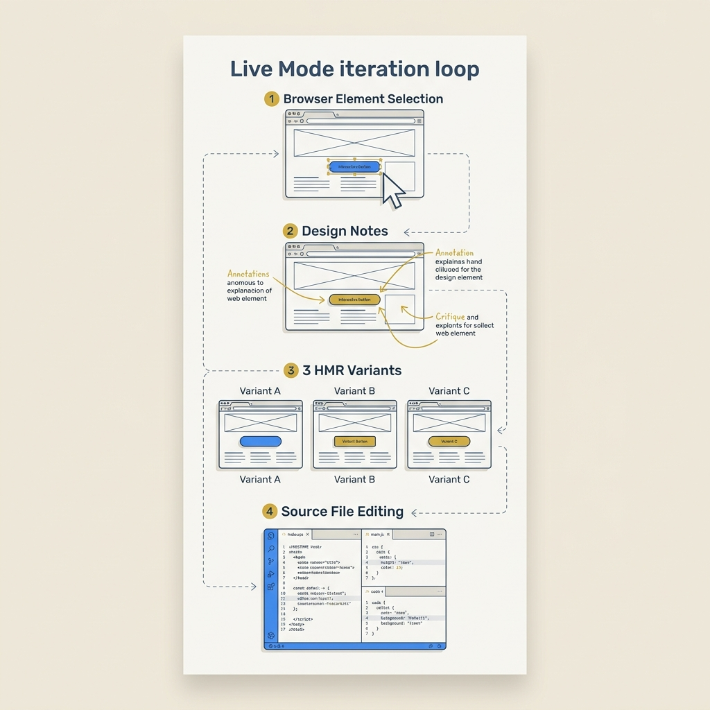

<!-- _class: title -->

# Impeccable: Agent Skill ยกระดับ Frontend จาก AI Slop

23 commands · 41 anti-pattern rules · open-source Apache 2.0

<!-- Speaker: Impeccable คือ design skill สำหรับ AI coding agents ที่แก้ปัญหา "AI Slop" — UI ที่ดูสำเร็จรูปและจืดชืด — ด้วยการให้ AI มี shared design vocabulary และ project context ที่ถาวร -->

---

<!-- _class: cheatsheet -->
<!-- _backgroundColor: #f8f7f4 -->

<!-- Speaker: Cheatsheet overview — 6 core concepts: AI Slop problem, Context System, 23 Commands, Desloppification rules, Brand/Product mode, Live Mode. -->

---

## TL;DR: Design Director สำหรับ AI ของคุณ

Impeccable ให้ AI มี design vocabulary ที่ชัดเจนและ project context ที่คงอยู่ข้ามเซสชัน

<svg viewBox="0 0 1100 340" width="100%" xmlns="http://www.w3.org/2000/svg">
  <rect x="60" y="30" width="980" height="280" rx="16" fill="var(--paper)" stroke="var(--soft-2)" stroke-width="1.5" style="filter:drop-shadow(0 4px 12px rgba(15,23,42,.08))"/>
  <rect x="60" y="30" width="8" height="280" rx="4" fill="var(--accent)"/>
  <circle cx="160" cy="170" r="50" fill="var(--accent)" opacity=".10"/>
  <circle cx="160" cy="170" r="36" fill="var(--accent)" opacity=".20"/>
  <circle cx="160" cy="170" r="22" fill="var(--accent)"/>
  <text x="160" y="176" font-size="14" fill="var(--paper)" text-anchor="middle" dominant-baseline="central" font-family="system-ui" font-weight="700">AI</text>
  <text x="260" y="135" font-size="22" font-weight="700" fill="var(--ink)" font-family="system-ui">No more "AI Slop" — get Design Director quality</text>
  <text x="260" y="172" font-size="15" fill="var(--ink-dim)" font-family="system-ui">23 commands · PRODUCT.md + DESIGN.md context · 41 deterministic anti-pattern rules</text>
  <text x="260" y="205" font-size="15" fill="var(--muted)" font-family="system-ui">Works with Claude Code, Cursor, Gemini CLI, Codex CLI — free, Apache 2.0</text>
</svg>

<b>★ Takeaway:</b> ติดตั้ง Impeccable ครั้งเดียว, run <code>/impeccable init</code> ครั้งเดียว, ทุก AI session จาก นั้นรู้จัก design language ของโปรเจกต์คุณ

<!-- Speaker: Core pitch — Impeccable solves the problem by giving AI persistent design memory and a shared vocabulary. One-time setup, permanent benefit. -->

---

## AI Slop: ปัญหาที่ทุก AI Frontend Developer เจอ

AI ไม่ได้โง่ — แค่ขาด design vocabulary และ project context

<svg viewBox="0 0 700 300" width="100%" xmlns="http://www.w3.org/2000/svg">
  <rect x="20" y="20" width="310" height="260" rx="12" fill="var(--danger-wash)" stroke="var(--danger)" stroke-width="1.5"/>
  <text x="175" y="52" font-size="14" font-weight="700" fill="var(--danger-ink)" text-anchor="middle" font-family="system-ui">AI Slop Signatures</text>
  <text x="40" y="85" font-size="13" fill="var(--danger-ink)" font-family="system-ui">Purple/teal gradients (no brand reason)</text>
  <text x="40" y="110" font-size="13" fill="var(--danger-ink)" font-family="system-ui">Glassmorphism overuse</text>
  <text x="40" y="135" font-size="13" fill="var(--danger-ink)" font-family="system-ui">Side-stripe borders (AI default)</text>
  <text x="40" y="160" font-size="13" fill="var(--danger-ink)" font-family="system-ui">Bounce easing on serious UI</text>
  <text x="40" y="185" font-size="13" fill="var(--danger-ink)" font-family="system-ui">Padding &lt; 8px on interactive elements</text>
  <text x="40" y="210" font-size="13" fill="var(--danger-ink)" font-family="system-ui">Skipped heading levels h1 → h3</text>
  <text x="40" y="238" font-size="12" fill="var(--muted)" font-family="system-ui">+ 35 more deterministic rules...</text>
  <rect x="370" y="20" width="310" height="260" rx="12" fill="var(--success-wash)" stroke="var(--success)" stroke-width="1.5"/>
  <text x="525" y="52" font-size="14" font-weight="700" fill="var(--success-ink)" text-anchor="middle" font-family="system-ui">Impeccable Fix</text>
  <text x="390" y="85" font-size="13" fill="var(--success-ink)" font-family="system-ui">Shared design vocabulary</text>
  <text x="390" y="110" font-size="13" fill="var(--success-ink)" font-family="system-ui">Project context via PRODUCT.md</text>
  <text x="390" y="135" font-size="13" fill="var(--success-ink)" font-family="system-ui">Design tokens from DESIGN.md</text>
  <text x="390" y="160" font-size="13" fill="var(--success-ink)" font-family="system-ui">41 deterministic anti-pattern rules</text>
  <text x="390" y="185" font-size="13" fill="var(--success-ink)" font-family="system-ui">12-rule LLM semantic critique</text>
  <text x="390" y="210" font-size="13" fill="var(--success-ink)" font-family="system-ui">CI pipeline integration (no API key)</text>
  <text x="390" y="238" font-size="12" fill="var(--success-ink)" font-family="system-ui">32k+ GitHub stars</text>
</svg>

<b>★ Takeaway:</b> AI ทำตามที่สั่ง — ปัญหาคือ "ทำให้สวย" แปลว่า gradient สำหรับ AI; Impeccable ให้ AI รู้ว่า "สวย" ของโปรเจกต์คุณหมายถึงอะไร

<!-- Speaker: Root cause is missing context, not AI stupidity. Impeccable provides that context systematically. -->

---

## Context System: PRODUCT.md + DESIGN.md

ไฟล์ 2 ไฟล์ที่ทำให้ AI "จำ" design language ของโปรเจกต์ข้ามเซสชัน

<svg viewBox="0 0 700 300" width="100%" xmlns="http://www.w3.org/2000/svg">
  <rect x="20" y="20" width="300" height="200" rx="12" fill="var(--paper)" stroke="var(--accent)" stroke-width="2" style="filter:drop-shadow(var(--shadow-md))"/>
  <rect x="20" y="20" width="300" height="44" rx="12" fill="var(--accent)" opacity=".12"/>
  <text x="170" y="48" font-size="15" font-weight="700" fill="var(--accent)" text-anchor="middle" font-family="system-ui">PRODUCT.md</text>
  <text x="40" y="84" font-size="13" fill="var(--ink)" font-family="system-ui">Product brief + goals</text>
  <text x="40" y="107" font-size="13" fill="var(--ink-dim)" font-family="system-ui">Target user profile</text>
  <text x="40" y="130" font-size="13" fill="var(--ink-dim)" font-family="system-ui">Brand tone + direction</text>
  <text x="40" y="153" font-size="13" fill="var(--muted)" font-family="system-ui">Generated by: /impeccable init</text>
  <rect x="360" y="20" width="300" height="200" rx="12" fill="var(--paper)" stroke="var(--gold)" stroke-width="2" style="filter:drop-shadow(var(--shadow-md))"/>
  <rect x="360" y="20" width="300" height="44" rx="12" fill="var(--gold)" opacity=".15"/>
  <text x="510" y="48" font-size="15" font-weight="700" fill="var(--ink)" text-anchor="middle" font-family="system-ui">DESIGN.md</text>
  <text x="380" y="84" font-size="13" fill="var(--ink)" font-family="system-ui">Color tokens + palette</text>
  <text x="380" y="107" font-size="13" fill="var(--ink-dim)" font-family="system-ui">Typography scale</text>
  <text x="380" y="130" font-size="13" fill="var(--ink-dim)" font-family="system-ui">Component patterns</text>
  <text x="380" y="153" font-size="13" fill="var(--muted)" font-family="system-ui">Generated by: /impeccable document</text>
  <rect x="200" y="240" width="280" height="44" rx="10" fill="var(--accent)" opacity=".08" stroke="var(--accent)" stroke-width="1.5"/>
  <text x="340" y="257" font-size="12" fill="var(--ink-dim)" text-anchor="middle" font-family="system-ui">Dual Mode:</text>
  <text x="340" y="275" font-size="12" fill="var(--accent)" text-anchor="middle" font-family="system-ui">Brand Register (landing) · Product Register (SaaS)</text>
</svg>

<b>★ Takeaway:</b> Commit ทั้งสองไฟล์เข้า repo — ทำให้ทีมทั้งหมดและทุก AI session ใช้ design context เดียวกัน

<!-- Speaker: These two files are the secret weapon. They externalize design memory that AI normally loses between sessions. Commit them so the team inherits the same context. -->

---

## 23 Commands: ครอบคลุมทุก Design Phase

แต่ละ command แก้ failure mode เฉพาะของ AI-generated frontend

  

    
Setup

    <h3>init · document · extract</h3>
    
สร้าง PRODUCT.md + DESIGN.md, extract tokens จาก codebase

  

  

    
Review

    <h3>critique · audit · harden</h3>
    
UX review, accessibility/performance check, defensive hardening

  

  

    
Polish

    <h3>polish · distill · clarify</h3>
    
Final pass ก่อน ship, ลด visual noise, ปรับ clarity

  

  

    
Design

    <h3>typeset · colorize · layout · animate</h3>
    
ปรับ typography, color system, spacing, motion

  

  

    
Creative

    <h3>bolder · quieter · delight · overdrive</h3>
    
เพิ่ม/ลด visual intensity, delight moments

  

  

    
Workflow

    <h3>onboard · shape · adapt · live</h3>
    
Context onboarding, component shaping, responsive, live iteration

  

<b>★ Takeaway:</b> 23 commands = shared vocabulary — "polish" บน Impeccable หมายถึงสิ่งที่กำหนดไว้ใน PRODUCT.md ของโปรเจกต์คุณ ไม่ใช่ AI default

<!-- Speaker: The vocabulary is the product. Each command name is precise — /critique != /polish != /audit. AI knows the difference because Impeccable defines each one. -->

---

## สามคำสั่งหลัก: Critique · Audit · Polish

เปรียบเหมือนมี Design Director, QA Engineer, และ Senior Developer ตรวจงานพร้อมกัน

  

    
Design Director

    <h3>/impeccable critique</h3>
    
อ่าน PRODUCT.md + DESIGN.md แล้ว comment structured:

    <ul>
      <li>อะไรผิดพลาด</li>
      <li>ทำไมถึงผิด</li>
      <li>ควรแก้อย่างไร</li>
      <li>อ้างอิง design rule</li>
    </ul>
  

  

    
QA + Accessibility

    <h3>/impeccable audit</h3>
    
ตรวจทั้ง deterministic + LLM pass:

    <ul>
      <li>WCAG contrast ratios</li>
      <li>Heading hierarchy</li>
      <li>Focus states</li>
      <li>Render-blocking resources</li>
    </ul>
  

  

    
Final Review

    <h3>/impeccable polish</h3>
    
Pre-ship sweep ครอบคลุม:

    <ul>
      <li>Spacing consistency</li>
      <li>Micro-copy quality</li>
      <li>Animation timing</li>
      <li>Responsive breakpoints</li>
    </ul>
  

<b>★ Takeaway:</b> Run <code>critique → audit → polish</code> ก่อน merge ทุก UI PR — ใช้เวลาน้อยกว่า design review แบบ manual และ catch ปัญหาเดียวกัน

<!-- Speaker: These three commands map to three distinct review passes. Critique is subjective/design, audit is objective/measurable, polish is holistic finishing. -->

---

## Desloppification: 41 Rules ตรวจ AI Slop โดยไม่ต้อง LLM

Deterministic + semantic — สองระดับสำหรับสองประเภทของปัญหา

<svg viewBox="0 0 1100 340" width="100%" xmlns="http://www.w3.org/2000/svg">
  <!-- Left: Deterministic -->
  <rect x="40" y="20" width="480" height="300" rx="14" fill="var(--paper)" stroke="var(--accent)" stroke-width="2" style="filter:drop-shadow(var(--shadow-md))"/>
  <rect x="40" y="20" width="480" height="52" rx="14" fill="var(--accent)" opacity=".10"/>
  <text x="280" y="52" font-size="16" font-weight="700" fill="var(--accent)" text-anchor="middle" font-family="system-ui">41 Deterministic Rules</text>
  <text x="70" y="92" font-size="13" fill="var(--ink-dim)" font-family="system-ui">No LLM · No API key · Runs in CI</text>
  <text x="70" y="120" font-size="13" fill="var(--ink)" font-family="system-ui">Purple/teal gradients (no brand rationale)</text>
  <text x="70" y="145" font-size="13" fill="var(--ink)" font-family="system-ui">Glassmorphism overuse</text>
  <text x="70" y="170" font-size="13" fill="var(--ink)" font-family="system-ui">Side-stripe borders (AI default)</text>
  <text x="70" y="195" font-size="13" fill="var(--ink)" font-family="system-ui">Bounce easing on non-playful UI</text>
  <text x="70" y="220" font-size="13" fill="var(--ink)" font-family="system-ui">Padding &lt; 8px on interactive elements</text>
  <text x="70" y="245" font-size="13" fill="var(--ink)" font-family="system-ui">AI color palettes (too recognizable)</text>
  <text x="70" y="273" font-size="12" fill="var(--muted)" font-family="system-ui">npx impeccable detect src/ --fail-on-violations</text>
  <!-- Right: LLM critique -->
  <rect x="580" y="20" width="480" height="300" rx="14" fill="var(--paper)" stroke="var(--gold)" stroke-width="2" style="filter:drop-shadow(var(--shadow-md))"/>
  <rect x="580" y="20" width="480" height="52" rx="14" fill="var(--gold)" opacity=".12"/>
  <text x="820" y="52" font-size="16" font-weight="700" fill="var(--ink)" text-anchor="middle" font-family="system-ui">12-Rule LLM Critique Pass</text>
  <text x="610" y="92" font-size="13" fill="var(--ink-dim)" font-family="system-ui">Semantic judgment · Requires LLM</text>
  <text x="610" y="120" font-size="13" fill="var(--ink)" font-family="system-ui">Visual hierarchy vs content importance</text>
  <text x="610" y="145" font-size="13" fill="var(--ink)" font-family="system-ui">Tone consistency (copy + visual)</text>
  <text x="610" y="170" font-size="13" fill="var(--ink)" font-family="system-ui">Animation adds meaning vs distraction</text>
  <text x="610" y="195" font-size="13" fill="var(--ink)" font-family="system-ui">Brand register alignment</text>
  <text x="610" y="220" font-size="13" fill="var(--ink)" font-family="system-ui">Component pattern consistency</text>
  <text x="610" y="245" font-size="13" fill="var(--ink)" font-family="system-ui">UX writing quality</text>
  <text x="610" y="273" font-size="12" fill="var(--muted)" font-family="system-ui">Scope with: /audit src/components/checkout/</text>
</svg>

<b>★ Takeaway:</b> 41 deterministic rules = ใส่ใน CI pipeline ฟรี; 12 LLM rules = ใช้เมื่อต้องการ design judgment — เลือก scope ให้แคบเพื่อประหยัด token

<!-- Speaker: Two-tier system mirrors how human design review works. Linter catches obvious violations cheaply. Director handles judgment calls that need semantic understanding. -->

---

## Live Mode: Design Iteration บน Running App จริง

ไม่ใช่ static mockup — แก้ไขตรงใน source file ผ่าน HMR (Beta)

<svg viewBox="0 0 700 280" width="100%" xmlns="http://www.w3.org/2000/svg">
  <!-- arrow flow: 5 steps -->
  <rect x="20" y="110" width="100" height="60" rx="10" fill="var(--accent)" opacity=".15" stroke="var(--accent)" stroke-width="1.5"/>
  <text x="70" y="136" font-size="11" font-weight="700" fill="var(--accent)" text-anchor="middle" font-family="system-ui">1. Start</text>
  <text x="70" y="153" font-size="11" fill="var(--ink-dim)" text-anchor="middle" font-family="system-ui">dev server</text>
  <polygon points="128,140 142,133 142,147" fill="var(--muted)"/>
  <rect x="148" y="110" width="100" height="60" rx="10" fill="var(--paper)" stroke="var(--soft-2)" stroke-width="1.5"/>
  <text x="198" y="136" font-size="11" font-weight="700" fill="var(--ink)" text-anchor="middle" font-family="system-ui">2. Select</text>
  <text x="198" y="153" font-size="11" fill="var(--ink-dim)" text-anchor="middle" font-family="system-ui">element</text>
  <polygon points="256,140 270,133 270,147" fill="var(--muted)"/>
  <rect x="276" y="110" width="100" height="60" rx="10" fill="var(--paper)" stroke="var(--soft-2)" stroke-width="1.5"/>
  <text x="326" y="136" font-size="11" font-weight="700" fill="var(--ink)" text-anchor="middle" font-family="system-ui">3. Add</text>
  <text x="326" y="153" font-size="11" fill="var(--ink-dim)" text-anchor="middle" font-family="system-ui">design note</text>
  <polygon points="384,140 398,133 398,147" fill="var(--muted)"/>
  <rect x="404" y="110" width="100" height="60" rx="10" fill="var(--paper)" stroke="var(--soft-2)" stroke-width="1.5"/>
  <text x="454" y="136" font-size="11" font-weight="700" fill="var(--ink)" text-anchor="middle" font-family="system-ui">4. Pick</text>
  <text x="454" y="153" font-size="11" fill="var(--ink-dim)" text-anchor="middle" font-family="system-ui">1 of 3 variants</text>
  <polygon points="512,140 526,133 526,147" fill="var(--muted)"/>
  <rect x="532" y="110" width="130" height="60" rx="10" fill="var(--success-wash)" stroke="var(--success)" stroke-width="1.5"/>
  <text x="597" y="136" font-size="11" font-weight="700" fill="var(--success-ink)" text-anchor="middle" font-family="system-ui">5. Accept</text>
  <text x="597" y="153" font-size="11" fill="var(--success-ink)" text-anchor="middle" font-family="system-ui">source updated</text>
  <text x="350" y="50" font-size="13" fill="var(--muted)" text-anchor="middle" font-family="system-ui">HMR swaps variants in real-time — no static mockup</text>
  <rect x="140" y="220" width="400" height="36" rx="8" fill="var(--warning-wash)" stroke="var(--warning)" stroke-width="1"/>
  <text x="340" y="243" font-size="12" fill="var(--warning-ink)" text-anchor="middle" font-family="system-ui">Beta — HMR integration may vary by project setup</text>
</svg>

<b>★ Takeaway:</b> Live Mode ปิด feedback loop ของ design iteration — เห็นผลใน context จริง ไม่ใช่ mockup ที่อาจ render ต่างจาก production

<!-- Speaker: Live Mode is the most ambitious feature. The key insight: design decisions should be made in the context of real running code, not static comps. Currently Beta. -->

---

## Installation: 3 วิธีใน 1 คำสั่ง

เลือกตาม tooling ที่ใช้อยู่ — ทุกวิธีได้ครบทุก 23 commands

<svg viewBox="0 0 1100 340" width="100%" xmlns="http://www.w3.org/2000/svg">
  <!-- Method 1 -->
  <rect x="40" y="20" width="300" height="200" rx="12" fill="var(--paper)" stroke="var(--accent)" stroke-width="2" style="filter:drop-shadow(var(--shadow-md))"/>
  <rect x="40" y="20" width="300" height="48" rx="12" fill="var(--accent)" opacity=".12"/>
  <text x="190" y="50" font-size="14" font-weight="700" fill="var(--accent)" text-anchor="middle" font-family="system-ui">Claude Code Plugin</text>
  <text x="60" y="85" font-size="12" fill="var(--ink-dim)" font-family="system-ui">/plugin marketplace</text>
  <text x="60" y="103" font-size="12" fill="var(--ink-dim)" font-family="system-ui">  add pbakaus/impeccable</text>
  <text x="60" y="135" font-size="12" fill="var(--muted)" font-family="system-ui">Best for: Claude Code users</text>
  <!-- Method 2 -->
  <rect x="400" y="20" width="300" height="200" rx="12" fill="var(--paper)" stroke="var(--soft-2)" stroke-width="1.5" style="filter:drop-shadow(var(--shadow-sm))"/>
  <rect x="400" y="20" width="300" height="48" rx="12" fill="var(--soft)" opacity=".8"/>
  <text x="550" y="50" font-size="14" font-weight="700" fill="var(--ink-dim)" text-anchor="middle" font-family="system-ui">CLI Installer</text>
  <text x="420" y="85" font-size="12" fill="var(--ink-dim)" font-family="system-ui">npx impeccable</text>
  <text x="420" y="103" font-size="12" fill="var(--ink-dim)" font-family="system-ui">  skills install</text>
  <text x="420" y="135" font-size="12" fill="var(--muted)" font-family="system-ui">Best for: Cursor, Gemini CLI,</text>
  <text x="420" y="153" font-size="12" fill="var(--muted)" font-family="system-ui">Codex CLI, VS Code, Kiro</text>
  <!-- Method 3 -->
  <rect x="760" y="20" width="300" height="200" rx="12" fill="var(--paper)" stroke="var(--soft-2)" stroke-width="1.5" style="filter:drop-shadow(var(--shadow-sm))"/>
  <rect x="760" y="20" width="300" height="48" rx="12" fill="var(--soft)" opacity=".8"/>
  <text x="910" y="50" font-size="14" font-weight="700" fill="var(--ink-dim)" text-anchor="middle" font-family="system-ui">Chrome Extension</text>
  <text x="780" y="85" font-size="12" fill="var(--ink-dim)" font-family="system-ui">Chrome Web Store</text>
  <text x="780" y="103" font-size="12" fill="var(--muted)" font-family="system-ui">Visual overlay detection</text>
  <text x="780" y="135" font-size="12" fill="var(--muted)" font-family="system-ui">Best for: visual anti-pattern</text>
  <text x="780" y="153" font-size="12" fill="var(--muted)" font-family="system-ui">overlay in any browser</text>
  <!-- Then: init -->
  <rect x="200" y="250" width="700" height="70" rx="12" fill="var(--accent-wash)" stroke="var(--accent)" stroke-width="1.5"/>
  <text x="550" y="278" font-size="14" font-weight="700" fill="var(--accent-deep)" text-anchor="middle" font-family="system-ui">Then: /impeccable init</text>
  <text x="550" y="302" font-size="13" fill="var(--ink-dim)" text-anchor="middle" font-family="system-ui">Generates PRODUCT.md + DESIGN.md → commit both to repo</text>
</svg>

<b>★ Takeaway:</b> หลัง <code>init</code> ทำงานครั้งเดียว — commit PRODUCT.md + DESIGN.md และทุก session จาก นั้นจะมี design context พร้อมใช้งาน

<!-- Speaker: Three installation paths but one onboarding: /impeccable init. The output files are the investment that pays off every subsequent session. -->

---

## Caveats: สิ่งที่ต้องรู้ก่อนใช้จริง

Impeccable ดีมาก แต่มีขอบเขตที่ต้องเข้าใจ

  

    
Context Maintenance

    <h3>PRODUCT.md ต้องอัปเดต</h3>
    
ถ้า design direction เปลี่ยน ต้อง update ไฟล์ด้วย critiques ที่ได้จาก stale context จะ off-target

  

  

    
Live Mode

    <h3>Beta — ยังไม่ stable</h3>
    
HMR integration อาจมีปัญหากับบาง project setup โดยเฉพาะ custom build configs

  

  

    
LLM Cost

    <h3>12-rule pass ใช้ token</h3>
    
Scope ให้แคบใน codebase ขนาดใหญ่: <code>/audit src/components/checkout/</code> ไม่ใช่ทั้ง repo

  

  

    
Design Subjectivity

    <h3>Direction ≠ Final Decision</h3>
    
Impeccable ให้ direction แต่ creative decisions ยังเป็นของ developer — /overdrive อาจเกินสำหรับบาง brand

  

<b>★ Takeaway:</b> Framework coverage ดีสำหรับ React/Vue/Svelte TypeScript-first; ตรวจสอบ framework ก่อนใช้งานจริงใน production pipeline

<!-- Speaker: These caveats are manageable. The biggest one is context staleness — treat PRODUCT.md/DESIGN.md like a living document, update it when product direction changes. -->

---

## Key Takeaways

สิ่งที่ต้องจำถ้าไม่ได้อ่านส่วนอื่น

  

    
Core Insight

    <h3>Context เป็น solution</h3>
    
AI Slop เกิดจากการขาด context ไม่ใช่ AI โง่ PRODUCT.md + DESIGN.md ให้ persistent design memory ที่ AI ขาดอยู่

  

  

    
Daily Habit

    <h3>critique → audit → polish</h3>
    
3 คำสั่งก่อน merge ทุก UI PR = Design Director, Accessibility QA, Final Reviewer ใน pipeline ทุกครั้ง

  

  

    
Free CI Integration

    <h3>41 rules, zero API cost</h3>
    
<code>npx impeccable detect src/</code> ใน CI รัน deterministic rules ทั้งหมดโดยไม่ต้อง LLM หรือ API key

  

  

    
Installation

    <h3>1 คำสั่ง, ทุก AI agent</h3>
    
Claude Code, Cursor, Gemini CLI, Codex CLI — open-source Apache 2.0, ฟรี 32k+ GitHub stars

  

<b>★ Takeaway:</b> ติดตั้ง Impeccable + commit PRODUCT.md + DESIGN.md วันนี้ — ทุก UI session หลังจาก นั้น AI จะรู้ว่า "สวย" หมายถึงอะไรสำหรับโปรเจกต์คุณ

<!-- Speaker: The setup cost is one /impeccable init. The payoff is every single AI session from that point forward gets project-aware design feedback. -->
