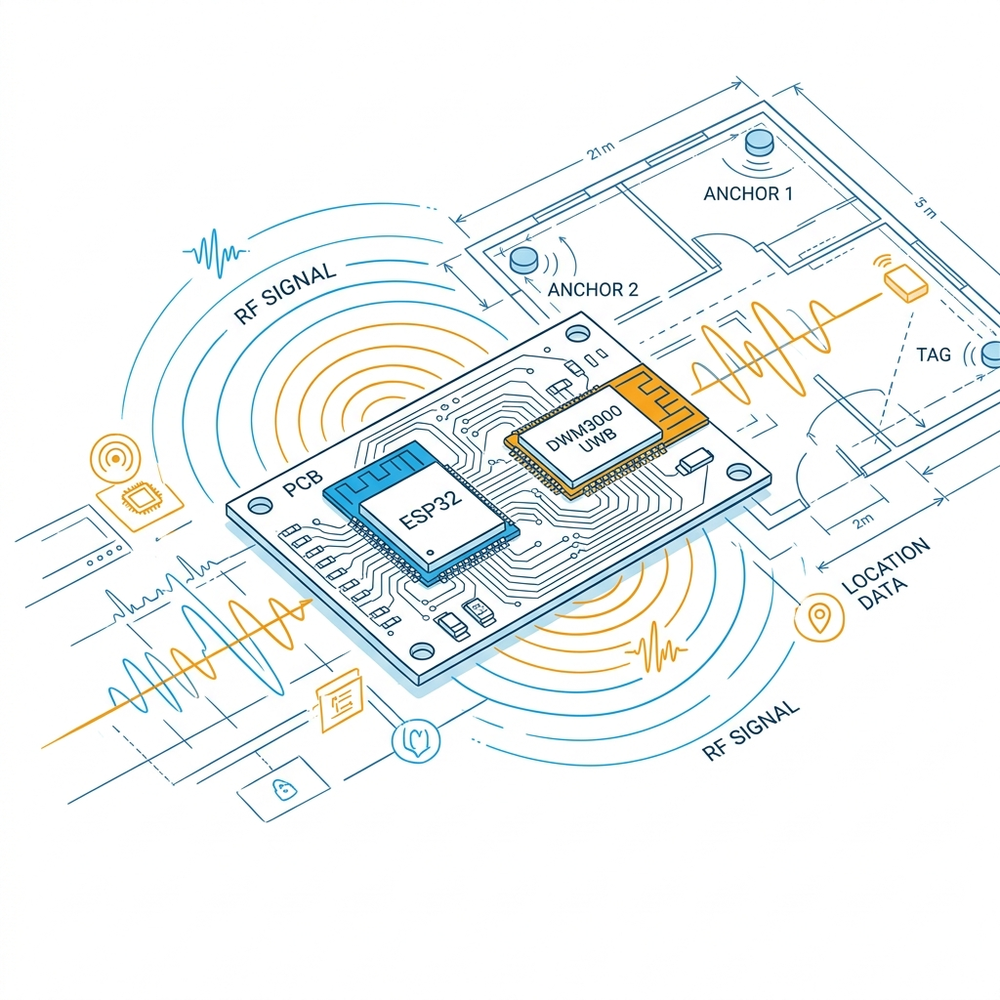
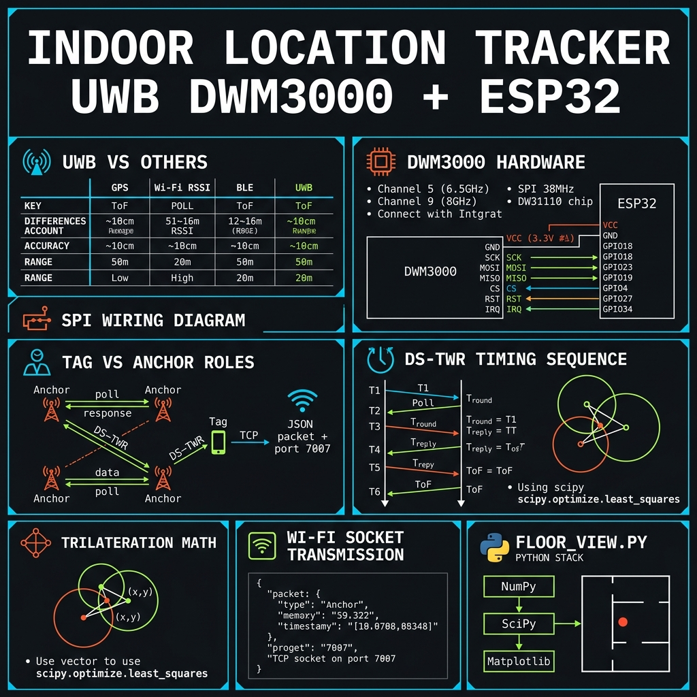
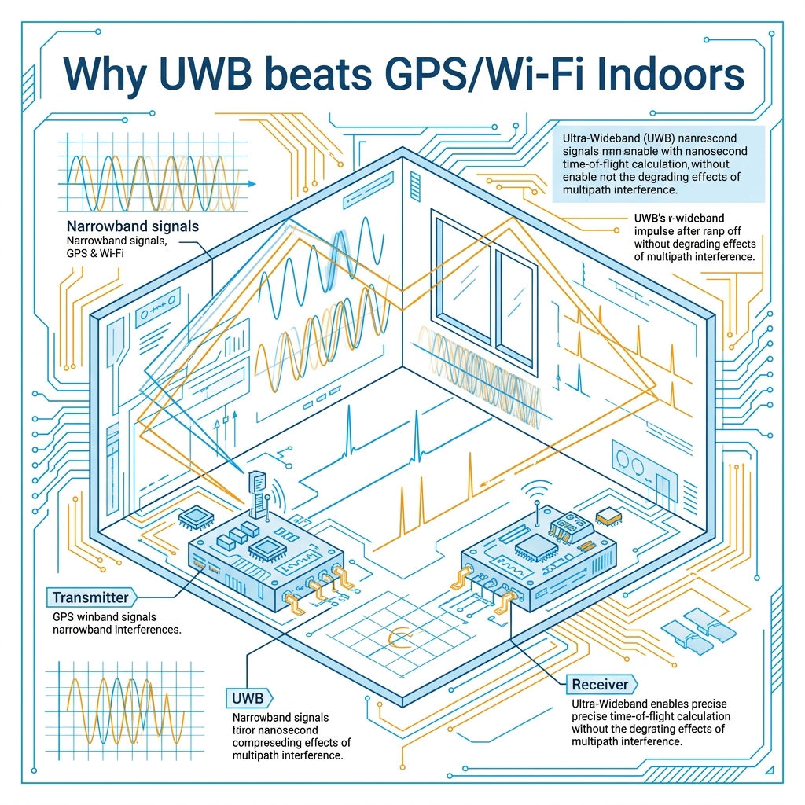
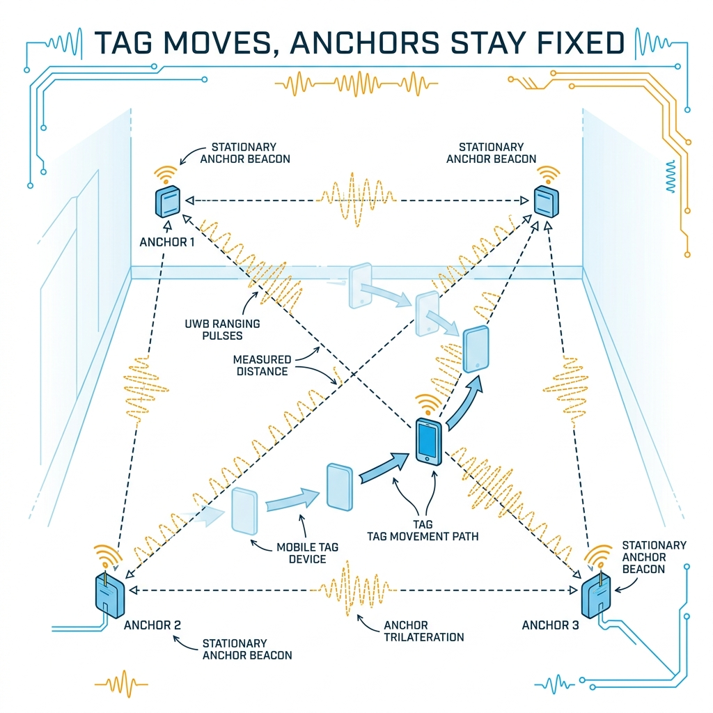

<!-- _class: title -->

# Indoor Location Tracker
# UWB DWM3000 + ESP32

ติดตามตำแหน่งในอาคารระดับ 10 ซม. ด้วย DS-TWR + Trilateration

<!-- Speaker: UWB = Ultra-Wideband. ระบบนี้ทำงานแม่นยำกว่า GPS 30x ด้วย hardware ราคาประหยัด 4 ชุด. -->

---

<!-- _class: cheatsheet -->
<!-- _backgroundColor: #f8f7f4 -->

<!-- Speaker: Cheatsheet overview — 8 panels: UWB comparison, DWM3000 specs, SPI pinout, Tag/Anchor roles, DS-TWR timing, trilateration math, Wi-Fi socket, Python stack. -->

---

## TL;DR: 4 Modules, 10 cm Accuracy

Qorvo DWM3000 + ESP32 — ranging via DS-TWR, position via trilateration on floor plan.

<svg viewBox="0 0 1100 340" width="100%" xmlns="http://www.w3.org/2000/svg">
  <!-- 4-step flow: Hardware → Firmware → Ranging → Position -->
  <defs>
    <marker id="arr" markerWidth="8" markerHeight="6" refX="8" refY="3" orient="auto">
      <path d="M0,0 L8,3 L0,6 Z" fill="var(--accent)"/>
    </marker>
  </defs>
  <!-- Step boxes -->
  <rect x="30" y="100" width="200" height="140" rx="12" fill="var(--paper)" stroke="var(--accent)" stroke-width="2" style="filter:drop-shadow(0 4px 12px rgba(15,23,42,.08))"/>
  <rect x="30" y="100" width="200" height="8" rx="4" fill="var(--accent)"/>
  <text x="130" y="152" font-size="16" font-weight="700" fill="var(--ink)" text-anchor="middle" font-family="system-ui">Hardware</text>
  <text x="130" y="175" font-size="13" fill="var(--ink-dim)" text-anchor="middle" font-family="system-ui">DWM3000 shield</text>
  <text x="130" y="196" font-size="13" fill="var(--ink-dim)" text-anchor="middle" font-family="system-ui">+ ESP32 x4</text>
  <text x="130" y="217" font-size="12" fill="var(--muted)" text-anchor="middle" font-family="system-ui">SPI @ 38 MHz</text>
  <line x1="230" y1="170" x2="280" y2="170" stroke="var(--accent)" stroke-width="2" marker-end="url(#arr)"/>
  <rect x="280" y="100" width="200" height="140" rx="12" fill="var(--paper)" stroke="var(--accent)" stroke-width="2" style="filter:drop-shadow(0 4px 12px rgba(15,23,42,.08))"/>
  <rect x="280" y="100" width="200" height="8" rx="4" fill="var(--accent)"/>
  <text x="380" y="152" font-size="16" font-weight="700" fill="var(--ink)" text-anchor="middle" font-family="system-ui">Firmware</text>
  <text x="380" y="175" font-size="13" fill="var(--ink-dim)" text-anchor="middle" font-family="system-ui">1 Tag + 3 Anchors</text>
  <text x="380" y="196" font-size="13" fill="var(--ink-dim)" text-anchor="middle" font-family="system-ui">PlatformIO flash</text>
  <text x="380" y="217" font-size="12" fill="var(--muted)" text-anchor="middle" font-family="system-ui">Same hardware</text>
  <line x1="480" y1="170" x2="530" y2="170" stroke="var(--accent)" stroke-width="2" marker-end="url(#arr)"/>
  <rect x="530" y="100" width="200" height="140" rx="12" fill="var(--paper)" stroke="var(--accent)" stroke-width="2" style="filter:drop-shadow(0 4px 12px rgba(15,23,42,.08))"/>
  <rect x="530" y="100" width="200" height="8" rx="4" fill="var(--accent)"/>
  <text x="630" y="152" font-size="16" font-weight="700" fill="var(--ink)" text-anchor="middle" font-family="system-ui">DS-TWR</text>
  <text x="630" y="175" font-size="13" fill="var(--ink-dim)" text-anchor="middle" font-family="system-ui">6-message ranging</text>
  <text x="630" y="196" font-size="13" fill="var(--ink-dim)" text-anchor="middle" font-family="system-ui">Clock drift cancel</text>
  <text x="630" y="217" font-size="12" fill="var(--muted)" text-anchor="middle" font-family="system-ui">6.5 / 8 GHz</text>
  <line x1="730" y1="170" x2="780" y2="170" stroke="var(--accent)" stroke-width="2" marker-end="url(#arr)"/>
  <rect x="780" y="100" width="200" height="140" rx="12" fill="var(--accent)" stroke="var(--accent)" stroke-width="2" style="filter:drop-shadow(0 4px 12px rgba(15,23,42,.12))"/>
  <rect x="780" y="100" width="200" height="8" rx="4" fill="var(--accent-deep)"/>
  <text x="880" y="152" font-size="16" font-weight="700" fill="white" text-anchor="middle" font-family="system-ui">Position</text>
  <text x="880" y="175" font-size="13" fill="rgba(255,255,255,.85)" text-anchor="middle" font-family="system-ui">Trilateration</text>
  <text x="880" y="196" font-size="13" fill="rgba(255,255,255,.85)" text-anchor="middle" font-family="system-ui">floor_view.py</text>
  <text x="880" y="217" font-size="13" fill="rgba(255,255,255,.85)" text-anchor="middle" font-family="system-ui">~10 cm accuracy</text>
</svg>

<b>★ Takeaway:</b> 4 identical hardware units, different firmware = 10 cm indoor tracking with no specialized equipment.

<!-- Speaker: Pipeline in 4 steps. Same DWM3000+ESP32 board; only the firmware file differs between tag and anchor. -->

---

## Why UWB Wins Indoors

Time-of-Flight at nanosecond precision beats RSSI-based methods by 30x.

<svg viewBox="0 0 700 300" width="100%" xmlns="http://www.w3.org/2000/svg">
  <!-- Horizontal bar comparison: accuracy -->
  <text x="0" y="30" font-size="13" font-weight="700" fill="var(--muted)" font-family="system-ui">Accuracy (lower = better)</text>
  <!-- GPS -->
  <text x="0" y="70" font-size="13" fill="var(--ink-dim)" font-family="system-ui">GPS (indoor)</text>
  <rect x="140" y="55" width="420" height="22" rx="4" fill="var(--danger)" opacity=".25"/>
  <rect x="140" y="55" width="420" height="22" rx="4" fill="var(--danger)" opacity=".5"/>
  <text x="566" y="71" font-size="12" fill="var(--danger-ink)" font-family="system-ui">5–30 m</text>
  <!-- Wi-Fi -->
  <text x="0" y="115" font-size="13" fill="var(--ink-dim)" font-family="system-ui">Wi-Fi RSSI</text>
  <rect x="140" y="100" width="280" height="22" rx="4" fill="var(--warning)" opacity=".4"/>
  <text x="426" y="116" font-size="12" fill="var(--warning-ink)" font-family="system-ui">±3 m</text>
  <!-- BLE -->
  <text x="0" y="160" font-size="13" fill="var(--ink-dim)" font-family="system-ui">BLE RSSI</text>
  <rect x="140" y="145" width="160" height="22" rx="4" fill="var(--warning)" opacity=".3"/>
  <text x="306" y="161" font-size="12" fill="var(--warning-ink)" font-family="system-ui">±1–3 m</text>
  <!-- UWB -->
  <text x="0" y="205" font-size="13" font-weight="700" fill="var(--accent)" font-family="system-ui">UWB DWM3000</text>
  <rect x="140" y="190" width="14" height="22" rx="4" fill="var(--accent)"/>
  <text x="160" y="206" font-size="12" font-weight="700" fill="var(--accent)" font-family="system-ui">~10 cm</text>
  <!-- Method labels -->
  <line x1="140" y1="240" x2="560" y2="240" stroke="var(--soft-2)" stroke-width="1"/>
  <text x="140" y="260" font-size="11" fill="var(--muted)" font-family="system-ui">Signal Strength (RSSI)</text>
  <text x="460" y="260" font-size="11" fill="var(--accent)" font-family="system-ui">Time-of-Flight</text>
</svg>

<b>★ Takeaway:</b> UWB measures nanosecond ToF, not signal strength — immune to wall reflections and multipath fading.

<!-- Speaker: GPS and Wi-Fi measure signal strength which bounces off walls. UWB measures the raw travel time of radio pulses — physics, not signal power. -->

---

## DWM3000 Module: Specs at a Glance

Qorvo DWM3000 = DW3110 IC + integrated antenna + power management in one shield.

  

    
Frequency Bands

    <h3>Ch5 + Ch9</h3>
    
6.5 GHz and 8 GHz — dual-band for flexibility and regulatory compliance.

  

  

    
Accuracy

    <h3>~10 cm</h3>
    
IEEE 802.15.4z compliant. Supports DS-TWR and TDoA ranging modes.

  

  

    
Interface

    <h3>SPI @ 38 MHz</h3>
    
MISO / MOSI / CLK / CS / RST / IRQ — 3.3V logic only, no level shifting needed with ESP32.

  

  

    
Form Factor

    <h3>Shield Module</h3>
    
Pre-soldered SMD on breakout — connect via jumper wire. No SMD soldering required.

  

  

    
Antenna

    <h3>Omnidirectional</h3>
    
Integrated on-module. RF circuitry and power management built in — plug-and-play.

  

  

    
Voltage

    <h3>3.3V ONLY</h3>
    
Max 3.6V. Connect VCC to ESP32 3.3V pin — direct 5V connection will destroy the module.

  

<b>★ Takeaway:</b> 3.3V only — the most common mistake. DWM3000 is already integrated; just wire SPI and power.

<!-- Speaker: Six spec cards. The warning card is the most important: 5V will fry the module immediately. -->

---

## SPI Wiring: DWM3000 → ESP32

8 connections: 2 power + 6 SPI/control — all standard ESP32 pins.

<svg viewBox="0 0 1100 360" width="100%" xmlns="http://www.w3.org/2000/svg">
  <!-- DWM3000 block -->
  <rect x="40" y="60" width="220" height="260" rx="12" fill="var(--soft)" stroke="var(--accent)" stroke-width="2"/>
  <rect x="40" y="60" width="220" height="40" rx="8" fill="var(--accent)"/>
  <text x="150" y="86" font-size="15" font-weight="700" fill="white" text-anchor="middle" font-family="system-ui">DWM3000</text>
  <!-- DWM3000 pins -->
  <text x="70" y="128" font-size="13" fill="var(--ink)" font-family="system-ui">VCC</text>
  <text x="70" y="158" font-size="13" fill="var(--ink)" font-family="system-ui">GND</text>
  <text x="70" y="188" font-size="13" fill="var(--ink)" font-family="system-ui">SCK</text>
  <text x="70" y="218" font-size="13" fill="var(--ink)" font-family="system-ui">MOSI</text>
  <text x="70" y="248" font-size="13" fill="var(--ink)" font-family="system-ui">MISO</text>
  <text x="70" y="278" font-size="13" fill="var(--ink)" font-family="system-ui">CS</text>
  <text x="70" y="308" font-size="13" fill="var(--ink)" font-family="system-ui">RST</text>
  <!-- Wire dots on DWM side -->
  <circle cx="260" cy="124" r="5" fill="var(--accent)"/>
  <circle cx="260" cy="154" r="5" fill="var(--muted)"/>
  <circle cx="260" cy="184" r="5" fill="var(--accent)"/>
  <circle cx="260" cy="214" r="5" fill="var(--accent)"/>
  <circle cx="260" cy="244" r="5" fill="var(--accent)"/>
  <circle cx="260" cy="274" r="5" fill="var(--accent)"/>
  <circle cx="260" cy="304" r="5" fill="var(--gold)"/>
  <!-- Wires -->
  <line x1="260" y1="124" x2="840" y2="124" stroke="var(--warning)" stroke-width="1.5" stroke-dasharray="4,3"/>
  <line x1="260" y1="154" x2="840" y2="154" stroke="var(--muted)" stroke-width="1.5" stroke-dasharray="4,3"/>
  <line x1="260" y1="184" x2="840" y2="184" stroke="var(--accent)" stroke-width="1.5" stroke-dasharray="4,3"/>
  <line x1="260" y1="214" x2="840" y2="214" stroke="var(--accent)" stroke-width="1.5" stroke-dasharray="4,3"/>
  <line x1="260" y1="244" x2="840" y2="244" stroke="var(--accent)" stroke-width="1.5" stroke-dasharray="4,3"/>
  <line x1="260" y1="274" x2="840" y2="274" stroke="var(--gold)" stroke-width="1.5" stroke-dasharray="4,3"/>
  <line x1="260" y1="304" x2="840" y2="304" stroke="var(--gold)" stroke-width="1.5" stroke-dasharray="4,3"/>
  <!-- ESP32 block -->
  <rect x="840" y="60" width="220" height="260" rx="12" fill="var(--soft)" stroke="var(--accent-deep)" stroke-width="2"/>
  <rect x="840" y="60" width="220" height="40" rx="8" fill="var(--accent-deep)"/>
  <text x="950" y="86" font-size="15" font-weight="700" fill="white" text-anchor="middle" font-family="system-ui">ESP32</text>
  <!-- ESP32 pins -->
  <text x="870" y="128" font-size="13" fill="var(--warning-ink)" font-family="system-ui" font-weight="700">3.3V</text>
  <text x="870" y="158" font-size="13" fill="var(--muted)" font-family="system-ui">GND</text>
  <text x="870" y="188" font-size="13" fill="var(--ink)" font-family="system-ui">GPIO18</text>
  <text x="870" y="218" font-size="13" fill="var(--ink)" font-family="system-ui">GPIO23</text>
  <text x="870" y="248" font-size="13" fill="var(--ink)" font-family="system-ui">GPIO19</text>
  <text x="870" y="278" font-size="13" fill="var(--ink)" font-family="system-ui">GPIO4</text>
  <text x="870" y="308" font-size="13" fill="var(--ink)" font-family="system-ui">GPIO27</text>
  <!-- Wire dots on ESP32 side -->
  <circle cx="840" cy="124" r="5" fill="var(--warning)"/>
  <circle cx="840" cy="154" r="5" fill="var(--muted)"/>
  <circle cx="840" cy="184" r="5" fill="var(--accent)"/>
  <circle cx="840" cy="214" r="5" fill="var(--accent)"/>
  <circle cx="840" cy="244" r="5" fill="var(--accent)"/>
  <circle cx="840" cy="274" r="5" fill="var(--gold)"/>
  <circle cx="840" cy="304" r="5" fill="var(--gold)"/>
  <!-- Warning label -->
  <rect x="460" y="105" width="180" height="28" rx="6" fill="var(--warning-wash)" stroke="var(--warning)" stroke-width="1.5"/>
  <text x="550" y="124" font-size="11" font-weight="700" fill="var(--warning-ink)" text-anchor="middle" font-family="system-ui">3.3V ONLY - NOT 5V</text>
  <rect x="1000" y="1" width="1" height="1" fill="none"/>
</svg>

<b>★ Takeaway:</b> GPIO18/23/19/4 = standard ESP32 SPI bus — no custom mapping needed; just wire and flash.

<!-- Speaker: IRQ on GPIO34 is optional. RST on GPIO27. The warning box is the key message: 3.3V only, no exceptions. -->

---

## Tag vs Anchor: Same Hardware, Different Firmware

Role is defined by which firmware file is flashed — not by hardware differences.

  

    
Tag — 1 unit (mobile)

    <h3>Moves with the asset</h3>
    <ul>
      <li>Initiates DS-TWR with each anchor</li>
      <li>Computes distance from timing data</li>
      <li>Sends JSON over Wi-Fi TCP port 7007</li>
      <li>State machine: 5 stages per anchor</li>
    </ul>
  

  

    
Anchor — 3 units (fixed)

    <h3>Mounted at known positions</h3>
    <ul>
      <li>Listens for incoming Poll packets</li>
      <li>Replies with Response + timestamps</li>
      <li>Records TX/RX times for Tag calc</li>
      <li>Simple 4-state responder logic</li>
    </ul>
  

<b>★ Takeaway:</b> Buy 4 identical DWM3000+ESP32 units — flash 3 as anchors, 1 as tag. Power anchors first.

<!-- Speaker: The firmware is the only differentiator. Anchors at room corners, hardcode their X/Y coordinates in the Python script. -->

---

## DS-TWR: Cancel Clock Drift with Two Round-Trips

Single TWR fails because ESP32 clocks drift — DS-TWR uses two exchanges to cancel the error.

<svg viewBox="0 0 1100 360" width="100%" xmlns="http://www.w3.org/2000/svg">
  <defs>
    <marker id="a2" markerWidth="8" markerHeight="6" refX="8" refY="3" orient="auto">
      <path d="M0,0 L8,3 L0,6 Z" fill="var(--accent)"/>
    </marker>
    <marker id="a3" markerWidth="8" markerHeight="6" refX="8" refY="3" orient="auto">
      <path d="M0,0 L8,3 L0,6 Z" fill="var(--gold)"/>
    </marker>
  </defs>
  <!-- Timeline lines -->
  <line x1="200" y1="40" x2="200" y2="340" stroke="var(--accent)" stroke-width="3"/>
  <line x1="900" y1="40" x2="900" y2="340" stroke="var(--gold)" stroke-width="3"/>
  <!-- Labels -->
  <rect x="130" y="20" width="140" height="28" rx="6" fill="var(--accent)"/>
  <text x="200" y="39" font-size="13" font-weight="700" fill="white" text-anchor="middle" font-family="system-ui">TAG</text>
  <rect x="830" y="20" width="140" height="28" rx="6" fill="var(--gold)"/>
  <text x="900" y="39" font-size="13" font-weight="700" fill="white" text-anchor="middle" font-family="system-ui">ANCHOR</text>
  <!-- Message 1: Poll T1 → T2 -->
  <line x1="200" y1="100" x2="900" y2="140" stroke="var(--accent)" stroke-width="1.5" marker-end="url(#a2)"/>
  <circle cx="200" cy="100" r="6" fill="var(--accent)"/>
  <circle cx="900" cy="140" r="6" fill="var(--accent)"/>
  <text x="530" y="110" font-size="12" fill="var(--accent)" font-weight="700" text-anchor="middle" font-family="system-ui">Poll (T1)</text>
  <text x="220" y="100" font-size="11" fill="var(--ink-dim)" font-family="system-ui">T1</text>
  <text x="912" y="140" font-size="11" fill="var(--ink-dim)" font-family="system-ui">T2</text>
  <!-- Message 2: Response T3 → T4 -->
  <line x1="900" y1="180" x2="200" y2="220" stroke="var(--gold)" stroke-width="1.5" marker-end="url(#a3)"/>
  <circle cx="900" cy="180" r="6" fill="var(--gold)"/>
  <circle cx="200" cy="220" r="6" fill="var(--gold)"/>
  <text x="530" y="190" font-size="12" fill="var(--gold)" font-weight="700" text-anchor="middle" font-family="system-ui">Response (T3)</text>
  <text x="912" y="180" font-size="11" fill="var(--ink-dim)" font-family="system-ui">T3</text>
  <text x="220" y="220" font-size="11" fill="var(--ink-dim)" font-family="system-ui">T4</text>
  <!-- Message 3: Final T5 → T6 -->
  <line x1="200" y1="260" x2="900" y2="300" stroke="var(--accent)" stroke-width="1.5" marker-end="url(#a2)"/>
  <circle cx="200" cy="260" r="6" fill="var(--accent)"/>
  <circle cx="900" cy="300" r="6" fill="var(--accent)"/>
  <text x="530" y="270" font-size="12" fill="var(--accent)" font-weight="700" text-anchor="middle" font-family="system-ui">Final (T5)</text>
  <text x="220" y="260" font-size="11" fill="var(--ink-dim)" font-family="system-ui">T5</text>
  <text x="912" y="300" font-size="11" fill="var(--ink-dim)" font-family="system-ui">T6</text>
  <!-- Formula box -->
  <rect x="340" y="310" width="420" height="36" rx="8" fill="var(--soft)" stroke="var(--accent)" stroke-width="1.5"/>
  <text x="550" y="333" font-size="12" fill="var(--accent-deep)" text-anchor="middle" font-family="monospace">ToF = (Tround1 x Tround2 - Treply1 x Treply2) / (sum of all)</text>
  <rect x="1080" y="1" width="1" height="1" fill="none"/>
</svg>

<b>★ Takeaway:</b> DS-TWR's 3-message exchange algebraically cancels clock drift — multiply ToF by speed of light = distance.

<!-- Speaker: Standard TWR divides round-trip by 2 but clock drift corrupts the result. DS-TWR's second exchange generates Tround2/Treply2 which cancels out the drift error mathematically. -->

---

## Trilateration: 3 Circles, 1 Position

Each anchor-distance becomes a circle radius. The intersection of 3 circles = Tag location.

<svg viewBox="0 0 1100 360" width="100%" xmlns="http://www.w3.org/2000/svg">
  <!-- Floor plan background -->
  <rect x="80" y="20" width="560" height="340" rx="8" fill="var(--soft)" stroke="var(--soft-2)" stroke-width="1.5"/>
  <!-- Circles from anchors -->
  <circle cx="140" cy="320" r="200" fill="none" stroke="var(--accent)" stroke-width="1.5" stroke-dasharray="6,4" opacity=".6"/>
  <circle cx="580" cy="320" r="170" fill="none" stroke="var(--gold)" stroke-width="1.5" stroke-dasharray="6,4" opacity=".6"/>
  <circle cx="350" cy="60" r="220" fill="none" stroke="var(--success)" stroke-width="1.5" stroke-dasharray="6,4" opacity=".6"/>
  <!-- Anchor dots -->
  <rect x="118" y="298" width="44" height="22" rx="4" fill="var(--accent)"/>
  <text x="140" y="313" font-size="11" font-weight="700" fill="white" text-anchor="middle" font-family="system-ui">A1</text>
  <rect x="558" y="298" width="44" height="22" rx="4" fill="var(--gold)"/>
  <text x="580" y="313" font-size="11" font-weight="700" fill="white" text-anchor="middle" font-family="system-ui">A2</text>
  <rect x="328" y="38" width="44" height="22" rx="4" fill="var(--success)"/>
  <text x="350" y="53" font-size="11" font-weight="700" fill="white" text-anchor="middle" font-family="system-ui">A3</text>
  <!-- Intersection (tag position) -->
  <circle cx="350" cy="230" r="14" fill="var(--danger)"/>
  <circle cx="350" cy="230" r="6" fill="white"/>
  <rect x="370" y="216" width="90" height="28" rx="6" fill="var(--danger)"/>
  <text x="415" y="234" font-size="12" font-weight="700" fill="white" text-anchor="middle" font-family="system-ui">TAG</text>
  <!-- Formula panel -->
  <rect x="680" y="20" width="380" height="340" rx="12" fill="var(--paper)" stroke="var(--soft-2)" stroke-width="1.5" style="filter:drop-shadow(0 4px 12px rgba(15,23,42,.08))"/>
  <text x="700" y="55" font-size="14" font-weight="700" fill="var(--ink)" font-family="system-ui">Circle equations:</text>
  <text x="700" y="90" font-size="12" fill="var(--ink-dim)" font-family="monospace">(x-x1)^2+(y-y1)^2=d1^2</text>
  <text x="700" y="115" font-size="12" fill="var(--ink-dim)" font-family="monospace">(x-x2)^2+(y-y2)^2=d2^2</text>
  <text x="700" y="140" font-size="12" fill="var(--ink-dim)" font-family="monospace">(x-x3)^2+(y-y3)^2=d3^2</text>
  <line x1="700" y1="160" x2="1040" y2="160" stroke="var(--soft-2)" stroke-width="1"/>
  <text x="700" y="190" font-size="13" font-weight="700" fill="var(--ink)" font-family="system-ui">Solver: least_squares()</text>
  <text x="700" y="215" font-size="12" fill="var(--ink-dim)" font-family="system-ui">scipy.optimize minimizes</text>
  <text x="700" y="237" font-size="12" fill="var(--ink-dim)" font-family="system-ui">residual error across all 3</text>
  <line x1="700" y1="260" x2="1040" y2="260" stroke="var(--soft-2)" stroke-width="1"/>
  <text x="700" y="290" font-size="13" font-weight="700" fill="var(--ink)" font-family="system-ui">Dependencies:</text>
  <text x="700" y="313" font-size="12" fill="var(--ink-dim)" font-family="monospace">numpy scipy matplotlib</text>
  <rect x="1080" y="1" width="1" height="1" fill="none"/>
</svg>

<b>★ Takeaway:</b> Real circles don't intersect perfectly due to noise — scipy.optimize.least_squares() finds the best-fit point.

<!-- Speaker: Each anchor gives one circle equation. Three circles should intersect at one point. Noise means they don't — least_squares solves for minimum total error. -->

---

## Wi-Fi Pipeline: Tag to Floor Plan

ESP32 Tag streams JSON distances over TCP port 7007; Python script trilaterates and plots in real-time.

<svg viewBox="0 0 1100 320" width="100%" xmlns="http://www.w3.org/2000/svg">
  <defs>
    <marker id="a4" markerWidth="8" markerHeight="6" refX="8" refY="3" orient="auto">
      <path d="M0,0 L8,3 L0,6 Z" fill="var(--accent)"/>
    </marker>
  </defs>
  <!-- Step 1: Tag ESP32 -->
  <rect x="20" y="80" width="180" height="160" rx="12" fill="var(--paper)" stroke="var(--accent)" stroke-width="2" style="filter:drop-shadow(0 4px 12px rgba(15,23,42,.08))"/>
  <rect x="20" y="80" width="180" height="8" rx="4" fill="var(--accent)"/>
  <text x="110" y="120" font-size="14" font-weight="700" fill="var(--ink)" text-anchor="middle" font-family="system-ui">Tag ESP32</text>
  <text x="110" y="145" font-size="12" fill="var(--ink-dim)" text-anchor="middle" font-family="system-ui">DS-TWR ranging</text>
  <text x="110" y="165" font-size="12" fill="var(--ink-dim)" text-anchor="middle" font-family="system-ui">d1, d2, d3</text>
  <text x="110" y="185" font-size="11" fill="var(--muted)" text-anchor="middle" font-family="monospace">WiFiClient</text>
  <text x="110" y="205" font-size="11" fill="var(--muted)" text-anchor="middle" font-family="monospace">port 7007</text>
  <!-- Arrow: Tag → Wi-Fi -->
  <line x1="200" y1="160" x2="280" y2="160" stroke="var(--accent)" stroke-width="2" marker-end="url(#a4)"/>
  <!-- Wi-Fi cloud -->
  <rect x="280" y="110" width="160" height="100" rx="20" fill="var(--soft)" stroke="var(--accent)" stroke-width="1.5" stroke-dasharray="5,3"/>
  <text x="360" y="155" font-size="14" font-weight="700" fill="var(--accent)" text-anchor="middle" font-family="system-ui">Wi-Fi LAN</text>
  <text x="360" y="175" font-size="11" fill="var(--muted)" text-anchor="middle" font-family="monospace">TCP JSON</text>
  <!-- Arrow: Wi-Fi → PC -->
  <line x1="440" y1="160" x2="520" y2="160" stroke="var(--accent)" stroke-width="2" marker-end="url(#a4)"/>
  <!-- PC socket -->
  <rect x="520" y="80" width="180" height="160" rx="12" fill="var(--paper)" stroke="var(--ink-dim)" stroke-width="2" style="filter:drop-shadow(0 4px 12px rgba(15,23,42,.08))"/>
  <rect x="520" y="80" width="180" height="8" rx="4" fill="var(--ink-dim)"/>
  <text x="610" y="120" font-size="14" font-weight="700" fill="var(--ink)" text-anchor="middle" font-family="system-ui">PC Socket</text>
  <text x="610" y="145" font-size="11" fill="var(--ink-dim)" text-anchor="middle" font-family="monospace">socket.bind(</text>
  <text x="610" y="163" font-size="11" fill="var(--ink-dim)" text-anchor="middle" font-family="monospace">  0.0.0.0, 7007)</text>
  <text x="610" y="185" font-size="11" fill="var(--muted)" text-anchor="middle" font-family="system-ui">receives JSON</text>
  <text x="610" y="205" font-size="11" fill="var(--muted)" text-anchor="middle" font-family="system-ui">distance data</text>
  <!-- Arrow: PC → Python -->
  <line x1="700" y1="160" x2="780" y2="160" stroke="var(--accent)" stroke-width="2" marker-end="url(#a4)"/>
  <!-- floor_view.py -->
  <rect x="780" y="80" width="280" height="160" rx="12" fill="var(--accent)" stroke="var(--accent)" stroke-width="2" style="filter:drop-shadow(0 4px 12px rgba(15,23,42,.12))"/>
  <rect x="780" y="80" width="280" height="8" rx="4" fill="var(--accent-deep)"/>
  <text x="920" y="120" font-size="14" font-weight="700" fill="white" text-anchor="middle" font-family="system-ui">floor_view.py</text>
  <text x="920" y="145" font-size="12" fill="rgba(255,255,255,.85)" text-anchor="middle" font-family="system-ui">trilateration()</text>
  <text x="920" y="165" font-size="12" fill="rgba(255,255,255,.85)" text-anchor="middle" font-family="system-ui">floor plan image</text>
  <text x="920" y="185" font-size="11" fill="rgba(255,255,255,.75)" text-anchor="middle" font-family="system-ui">red dot = Tag position</text>
  <text x="920" y="205" font-size="11" fill="rgba(255,255,255,.75)" text-anchor="middle" font-family="monospace">matplotlib live plot</text>
  <rect x="1080" y="1" width="1" height="1" fill="none"/>
</svg>

<b>★ Takeaway:</b> Tag streams JSON to PC over port 7007 — floor_view.py trilaterates position and plots red dot on your room's floor plan.

<!-- Speaker: Hardcode your anchor X/Y positions in floor_view.py. Scan your room with iPhone LiDAR for a good floor plan image. -->

---

## Setup in 7 Steps

Clone repo, wire hardware, flash firmware, config anchors, run Python visualizer.

<svg viewBox="0 0 1100 320" width="100%" xmlns="http://www.w3.org/2000/svg">
  <defs>
    <marker id="a5" markerWidth="7" markerHeight="5" refX="7" refY="2.5" orient="auto">
      <path d="M0,0 L7,2.5 L0,5 Z" fill="var(--muted)"/>
    </marker>
  </defs>
  <!-- 7 steps in horizontal flow, wrap to 2 rows -->
  <!-- Row 1: steps 1-4 -->
  <rect x="20" y="30" width="230" height="110" rx="10" fill="var(--paper)" stroke="var(--accent)" stroke-width="2" style="filter:drop-shadow(0 2px 8px rgba(15,23,42,.06))"/>
  <circle cx="50" cy="55" r="16" fill="var(--accent)"/>
  <text x="50" y="61" font-size="13" font-weight="700" fill="white" text-anchor="middle" font-family="system-ui">1</text>
  <text x="80" y="50" font-size="13" font-weight="700" fill="var(--ink)" font-family="system-ui">Clone Repo</text>
  <text x="30" y="80" font-size="11" fill="var(--ink-dim)" font-family="monospace">git clone circuit-digest/</text>
  <text x="30" y="100" font-size="11" fill="var(--ink-dim)" font-family="monospace">ESP32-DWM3000...</text>
  <text x="30" y="125" font-size="11" fill="var(--muted)" font-family="system-ui">+ pip install deps</text>
  <line x1="250" y1="85" x2="285" y2="85" stroke="var(--muted)" stroke-width="1.5" marker-end="url(#a5)"/>
  <rect x="285" y="30" width="200" height="110" rx="10" fill="var(--paper)" stroke="var(--accent)" stroke-width="2" style="filter:drop-shadow(0 2px 8px rgba(15,23,42,.06))"/>
  <circle cx="310" cy="55" r="16" fill="var(--accent)"/>
  <text x="310" y="61" font-size="13" font-weight="700" fill="white" text-anchor="middle" font-family="system-ui">2</text>
  <text x="340" y="50" font-size="13" font-weight="700" fill="var(--ink)" font-family="system-ui">Wire SPI</text>
  <text x="295" y="80" font-size="11" fill="var(--ink-dim)" font-family="system-ui">GPIO18/19/23/4/27</text>
  <text x="295" y="100" font-size="11" fill="var(--warning-ink)" font-weight="700" font-family="system-ui">3.3V ONLY - no 5V</text>
  <text x="295" y="120" font-size="11" fill="var(--muted)" font-family="system-ui">x4 modules</text>
  <line x1="485" y1="85" x2="520" y2="85" stroke="var(--muted)" stroke-width="1.5" marker-end="url(#a5)"/>
  <rect x="520" y="30" width="200" height="110" rx="10" fill="var(--paper)" stroke="var(--accent)" stroke-width="2" style="filter:drop-shadow(0 2px 8px rgba(15,23,42,.06))"/>
  <circle cx="545" cy="55" r="16" fill="var(--accent)"/>
  <text x="545" y="61" font-size="13" font-weight="700" fill="white" text-anchor="middle" font-family="system-ui">3</text>
  <text x="575" y="50" font-size="13" font-weight="700" fill="var(--ink)" font-family="system-ui">Flash Firmware</text>
  <text x="530" y="80" font-size="11" fill="var(--ink-dim)" font-family="system-ui">PlatformIO + VS Code</text>
  <text x="530" y="100" font-size="11" fill="var(--ink-dim)" font-family="system-ui">anchor x3, tag x1</text>
  <text x="530" y="120" font-size="11" fill="var(--muted)" font-family="system-ui">Set Wi-Fi + PC IP</text>
  <line x1="720" y1="85" x2="760" y2="85" stroke="var(--muted)" stroke-width="1.5" marker-end="url(#a5)"/>
  <rect x="760" y="30" width="310" height="110" rx="10" fill="var(--paper)" stroke="var(--gold)" stroke-width="2" style="filter:drop-shadow(0 2px 8px rgba(15,23,42,.06))"/>
  <circle cx="790" cy="55" r="16" fill="var(--gold)"/>
  <text x="790" y="61" font-size="13" font-weight="700" fill="white" text-anchor="middle" font-family="system-ui">4</text>
  <text x="820" y="50" font-size="13" font-weight="700" fill="var(--ink)" font-family="system-ui">Measure Anchor Coords</text>
  <text x="775" y="80" font-size="11" fill="var(--ink-dim)" font-family="system-ui">Measure X,Y from room corner</text>
  <text x="775" y="100" font-size="11" fill="var(--ink-dim)" font-family="system-ui">Edit ANCHOR_POSITIONS in</text>
  <text x="775" y="120" font-size="11" fill="var(--muted)" font-family="monospace">floor_view.py</text>
  <!-- Row 2: steps 5-7 -->
  <rect x="20" y="185" width="200" height="110" rx="10" fill="var(--paper)" stroke="var(--accent)" stroke-width="2" style="filter:drop-shadow(0 2px 8px rgba(15,23,42,.06))"/>
  <circle cx="50" cy="210" r="16" fill="var(--accent)"/>
  <text x="50" y="216" font-size="13" font-weight="700" fill="white" text-anchor="middle" font-family="system-ui">5</text>
  <text x="80" y="205" font-size="13" font-weight="700" fill="var(--ink)" font-family="system-ui">Prep Floor Plan</text>
  <text x="30" y="235" font-size="11" fill="var(--ink-dim)" font-family="system-ui">Top-down room image</text>
  <text x="30" y="255" font-size="11" fill="var(--muted)" font-family="system-ui">iPhone LiDAR scan OK</text>
  <text x="30" y="278" font-size="11" fill="var(--muted)" font-family="system-ui">Match scale to cm</text>
  <line x1="220" y1="240" x2="260" y2="240" stroke="var(--muted)" stroke-width="1.5" marker-end="url(#a5)"/>
  <rect x="260" y="185" width="220" height="110" rx="10" fill="var(--paper)" stroke="var(--accent)" stroke-width="2" style="filter:drop-shadow(0 2px 8px rgba(15,23,42,.06))"/>
  <circle cx="290" cy="210" r="16" fill="var(--accent)"/>
  <text x="290" y="216" font-size="13" font-weight="700" fill="white" text-anchor="middle" font-family="system-ui">6</text>
  <text x="320" y="205" font-size="13" font-weight="700" fill="var(--ink)" font-family="system-ui">Power On</text>
  <text x="270" y="235" font-size="11" fill="var(--ink-dim)" font-family="system-ui">Anchors first, wait 3s</text>
  <text x="270" y="255" font-size="11" fill="var(--ink-dim)" font-family="system-ui">Then power Tag</text>
  <text x="270" y="278" font-size="11" fill="var(--muted)" font-family="monospace">python floor_view.py</text>
  <line x1="480" y1="240" x2="520" y2="240" stroke="var(--muted)" stroke-width="1.5" marker-end="url(#a5)"/>
  <rect x="520" y="185" width="260" height="110" rx="10" fill="var(--success)" stroke="var(--success)" stroke-width="2" style="filter:drop-shadow(0 4px 12px rgba(15,23,42,.10))"/>
  <circle cx="550" cy="210" r="16" fill="var(--success-ink)"/>
  <text x="550" y="216" font-size="13" font-weight="700" fill="white" text-anchor="middle" font-family="system-ui">7</text>
  <text x="580" y="205" font-size="13" font-weight="700" fill="white" font-family="system-ui">Calibrate Antenna</text>
  <text x="530" y="235" font-size="11" fill="rgba(255,255,255,.9)" font-family="system-ui">Place pair 1m apart exactly</text>
  <text x="530" y="255" font-size="11" fill="rgba(255,255,255,.9)" font-family="system-ui">Tune ANTENNA_DELAY</text>
  <text x="530" y="275" font-size="11" fill="rgba(255,255,255,.75)" font-family="system-ui">Until reading = 100 cm</text>
  <rect x="1080" y="1" width="1" height="1" fill="none"/>
</svg>

<b>★ Takeaway:</b> Anchor coords + antenna calibration are the two steps most builders skip — both are essential for 10 cm accuracy.

<!-- Speaker: Steps 4 and 7 are the most often skipped. Without hardcoded anchor positions the trilateration has no origin. Without antenna calibration each unit has small inherent delay offsets. -->

---

## Caveats: What Breaks the 10 cm Promise

NLOS, power sequencing, and per-unit calibration are the top failure modes in practice.

  

    
Physical Limit

    <h3>NLOS / Obstruction</h3>
    
Walls, furniture, or people between Tag and Anchor = signal multipath. Error jumps to 30–50 cm. Ensure line-of-sight anchor placement.

  

  

    
Setup Required

    <h3>Hardcode Anchor Coords</h3>
    
Moving any Anchor invalidates all position data. Re-measure X,Y from room origin and update ANCHOR_POSITIONS every time.

  

  

    
Per-Unit Required

    <h3>Antenna Delay Cal</h3>
    
Each DWM3000 has slightly different intrinsic delay. Must calibrate ANTENNA_DELAY individually for each module — not a one-time global setting.

  

  

    
Dimension Limit

    <h3>2D Tracking Only</h3>
    
Trilateration with 3 anchors solves for X and Y only. For Z (height), need 4+ anchors and 3D solver — not in this repo.

  

  

    
Latency

    <h3>Wi-Fi ~5–20 ms</h3>
    
TCP over Wi-Fi adds latency. Suitable for most tracking. Use UWB TDOA + wired Ethernet if update rate &gt;50 Hz is required.

  

  

    
Hardware Risk

    <h3>3.3V Only</h3>
    
DWM3000 max 3.6V. Connecting VCC or any SPI GPIO directly to 5V destroys the module instantly — no recovery.

  

<b>★ Takeaway:</b> Line-of-sight anchor placement + per-unit calibration are non-negotiable for consistent 10 cm results.

<!-- Speaker: The danger cards are the true killers: NLOS and 5V. Both are immediate failure modes with no workaround — fix the environment, not the code. -->

---

## Key Takeaways

UWB + DS-TWR + Trilateration: a complete indoor positioning pipeline from $30 hardware.

  

    
Core Principle

    <h3>Time-of-Flight, not RSSI</h3>
    
UWB measures nanosecond signal travel time. 30x more accurate than Wi-Fi/BLE signal strength methods.

  

  

    
Algorithm

    <h3>DS-TWR cancels clock drift</h3>
    
Two round-trip exchanges algebraically cancel per-unit clock error — the key to sub-10 cm precision.

  

  

    
Geometry

    <h3>3 circles = 1 position</h3>
    
scipy.optimize.least_squares() finds best-fit intersection. Needs real anchor X/Y coords as room origin.

  

  

    
Applications

    <h3>Warehouse, Robot, Drone</h3>
    
Any indoor use case where GPS fails: asset tracking, autonomous navigation, AGV guidance in closed spaces.

  

<b>★ Takeaway:</b> Flash 3 anchors + 1 tag, run floor_view.py — 10 cm indoor tracking with $30 hardware and 7 setup steps.

<!-- Speaker: The whole system is democratized professional RTLS. DWM3000 is the same UWB IC in Apple AirTag — now on a $7 breakout board. -->
