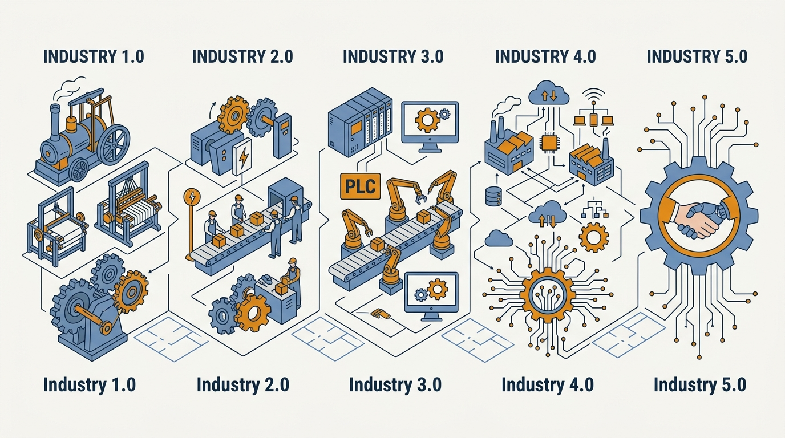
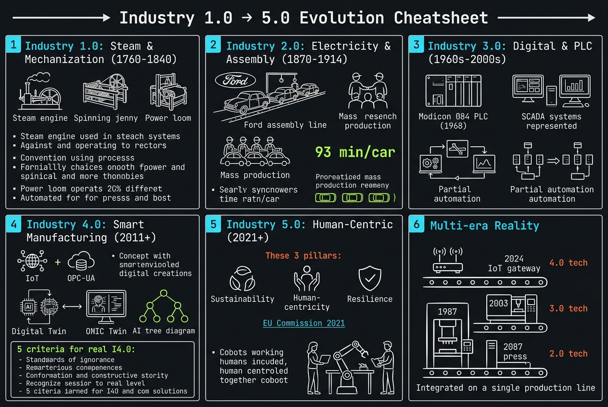
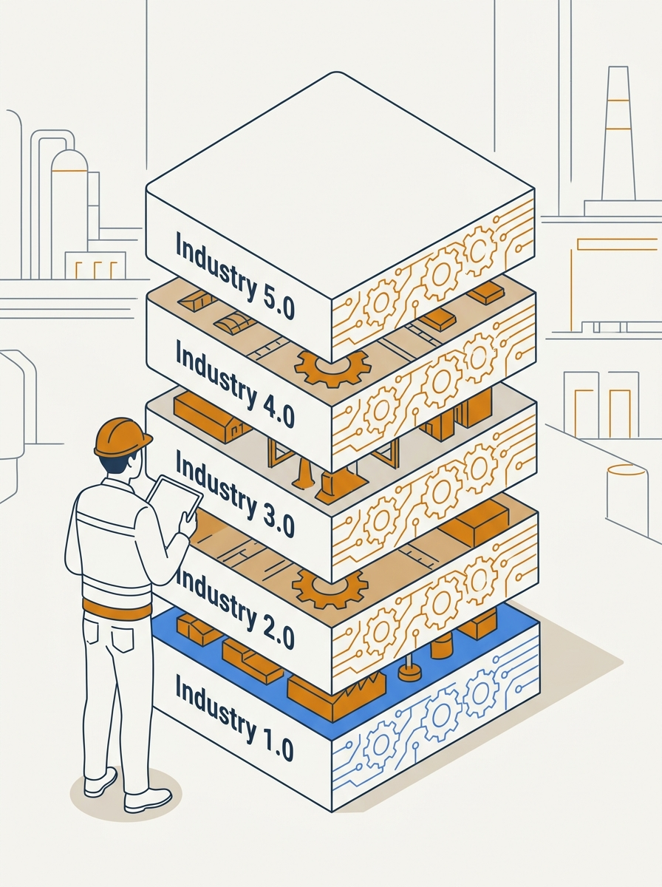
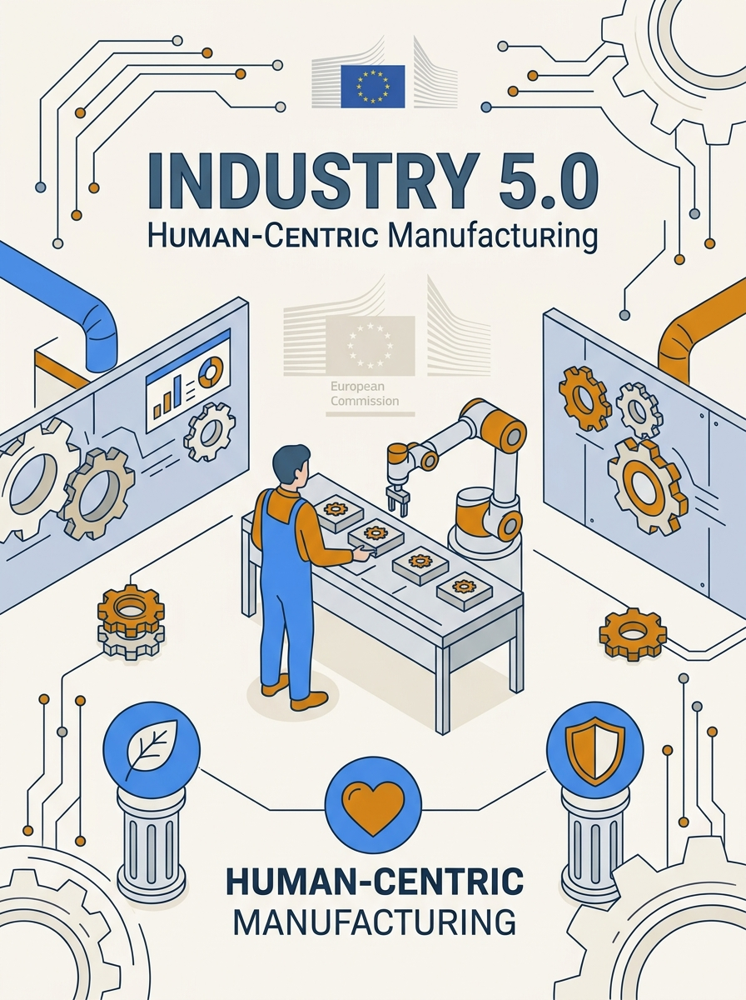
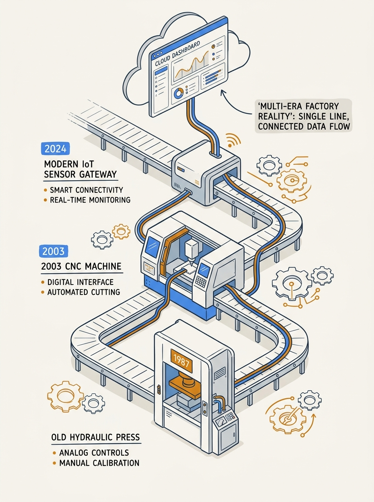

<!-- _class: title -->

# Industry 1.0 ถึง 5.0

เจาะลึกวิวัฒนาการอุตสาหกรรม 5 ยุค — จากไอน้ำสู่ Human-AI Collaboration

<!-- Speaker: 5 industrial revolutions in 12 slides. The core thesis: eras layer on top of each other — they don't replace. Most factories run 3 eras simultaneously right now. -->

---

<!-- _class: cheatsheet -->
<!-- _backgroundColor: #f8f7f4 -->

<!-- Speaker: One-page overview of all 5 eras. Notice the right panel — multi-era factory reality. That's the key insight most miss. -->

---

## 5 Eras Layer, They Don't Replace Each Other

โรงงานในปัจจุบันส่วนใหญ่รัน 3 ยุคพร้อมกัน — ไม่ใช่ก้าวขึ้นบันไดทีละขั้น

<svg viewBox="0 0 1100 310" width="100%" xmlns="http://www.w3.org/2000/svg">
  <rect x="60" y="12" width="980" height="50" rx="8" fill="var(--accent)" opacity=".85"/>
  <text x="120" y="43" font-size="15" font-weight="700" fill="white" font-family="system-ui">Industry 5.0</text>
  <text x="310" y="43" font-size="13" fill="rgba(255,255,255,.85)" font-family="system-ui">Human-Centric + AI + Sustainability  (2020s+)  [EU Commission 2021]</text>
  <rect x="60" y="70" width="980" height="50" rx="8" fill="var(--accent)" opacity=".68"/>
  <text x="120" y="101" font-size="15" font-weight="700" fill="white" font-family="system-ui">Industry 4.0</text>
  <text x="310" y="101" font-size="13" fill="rgba(255,255,255,.85)" font-family="system-ui">IoT + Cloud + AI + Cyber-Physical Systems  (2011+)  [Hannover Messe]</text>
  <rect x="60" y="128" width="980" height="50" rx="8" fill="var(--amber)" opacity=".72"/>
  <text x="120" y="159" font-size="15" font-weight="700" fill="white" font-family="system-ui">Industry 3.0</text>
  <text x="310" y="159" font-size="13" fill="rgba(255,255,255,.88)" font-family="system-ui">PLC + Computers + Digital Automation  (1960s-2000s)</text>
  <rect x="60" y="186" width="980" height="50" rx="8" fill="var(--amber)" opacity=".52"/>
  <text x="120" y="217" font-size="15" font-weight="700" fill="white" font-family="system-ui">Industry 2.0</text>
  <text x="310" y="217" font-size="13" fill="rgba(255,255,255,.88)" font-family="system-ui">Electricity + Assembly Line + Mass Production  (1870-1914)</text>
  <rect x="60" y="244" width="980" height="50" rx="8" fill="var(--muted)" opacity=".55"/>
  <text x="120" y="275" font-size="15" font-weight="700" fill="white" font-family="system-ui">Industry 1.0</text>
  <text x="310" y="275" font-size="13" fill="rgba(255,255,255,.88)" font-family="system-ui">Steam Power + Mechanization + Factory System  (1760-1840)</text>
  <rect x="0" y="0" width="1" height="1" fill="none"/>
</svg>

<b>★ Takeaway:</b> Most factories today run Industry 2.0–4.0 on the same line — understanding the layers beats memorizing the eras as a checklist.

<!-- Speaker: Geological strata analogy: you don't erase old layers when new ones form. A 1987 hydraulic press + 2003 CNC + 2024 IoT gateway on one line is completely normal. -->

---

## Why Industry Eras Matter to Engineers and Product Builders

เข้าใจ context → เลือกเทคโนโลยีถูก; ข้ามขั้น → เสียทั้งเงินและเวลา

  

    
For Developers and PMs

    <h3>Decision Context</h3>
    
เข้าใจ era = รู้ว่า IoT gateway ใดเหมาะกับ PLC ยุค 3.0 โดยไม่ต้องรื้อทั้งสาย

  

  

    
Thailand Context

    <h3>Thailand 4.0 Crossroads</h3>
    
SME ไทยส่วนใหญ่อยู่ระดับ 2.0–3.0 ขณะที่นโยบาย Thailand 4.0 ดันสู่ digital manufacturing

  

  

    
Common Misconception

    <h3>Eras Don't Replace</h3>
    
เครื่องกดปี 1987 + CNC ปี 2003 + IoT gateway ปี 2024 รันบนสายผลิตเดียวกัน — เป็นเรื่องปกติ

  

  

    
Marketing Alert

    <h3>Buzzword vs Reality</h3>
    
"Industry 4.0" ถูกใช้เป็น label มากเกินจริง — นิยามจริงมีเกณฑ์วัดได้ 5 ข้อที่ชัดเจน

  

<b>★ Takeaway:</b> ก่อนเลือก solution ตรวจก่อนว่าองค์กรอยู่ยุคไหน — over-engineering I4.0 สำหรับ factory ที่ยัง 2.0 อยู่ = waste ที่แพงมาก

<!-- Speaker: Thailand 4.0 is a policy direction, not a description of current state. Most Thai SMEs are 2.0–3.0. -->

---

## Industry 1.0: Steam Power Creates the Factory System (1760–1840)

England first — ถ่านหิน + ไอน้ำ = การผลิตย้ายจากบ้านสู่โรงงาน; Craftsman skill becomes machine-readable

<svg viewBox="0 0 1100 270" width="100%" xmlns="http://www.w3.org/2000/svg">
  <line x1="80" y1="130" x2="1030" y2="130" stroke="var(--muted)" stroke-width="2"/>
  <polygon points="1025,123 1045,130 1025,137" fill="var(--muted)"/>
  <circle cx="170" cy="130" r="34" fill="var(--accent)" opacity=".12"/>
  <circle cx="170" cy="130" r="24" fill="var(--accent)"/>
  <text x="170" y="125" font-size="12" fill="white" text-anchor="middle" font-family="system-ui" font-weight="700">1764</text>
  <text x="170" y="139" font-size="10" fill="white" text-anchor="middle" font-family="system-ui">Jenny</text>
  <text x="170" y="178" font-size="13" font-weight="700" fill="var(--ink)" text-anchor="middle" font-family="system-ui">Spinning Jenny</text>
  <text x="170" y="196" font-size="12" fill="var(--ink-dim)" text-anchor="middle" font-family="system-ui">8x thread output</text>
  <circle cx="420" cy="130" r="34" fill="var(--accent)" opacity=".12"/>
  <circle cx="420" cy="130" r="24" fill="var(--accent)"/>
  <text x="420" y="125" font-size="12" fill="white" text-anchor="middle" font-family="system-ui" font-weight="700">1769</text>
  <text x="420" y="139" font-size="10" fill="white" text-anchor="middle" font-family="system-ui">Steam</text>
  <text x="420" y="178" font-size="13" font-weight="700" fill="var(--ink)" text-anchor="middle" font-family="system-ui">Watt Steam Engine</text>
  <text x="420" y="196" font-size="12" fill="var(--ink-dim)" text-anchor="middle" font-family="system-ui">Rotary motion, scalable</text>
  <circle cx="680" cy="130" r="34" fill="var(--amber)" opacity=".2"/>
  <circle cx="680" cy="130" r="24" fill="var(--amber)"/>
  <text x="680" y="125" font-size="12" fill="white" text-anchor="middle" font-family="system-ui" font-weight="700">1785</text>
  <text x="680" y="139" font-size="10" fill="white" text-anchor="middle" font-family="system-ui">Loom</text>
  <text x="680" y="178" font-size="13" font-weight="700" fill="var(--ink)" text-anchor="middle" font-family="system-ui">Power Loom</text>
  <text x="680" y="196" font-size="12" fill="var(--ink-dim)" text-anchor="middle" font-family="system-ui">Mechanical weaving</text>
  <circle cx="930" cy="130" r="34" fill="var(--amber)" opacity=".2"/>
  <circle cx="930" cy="130" r="24" fill="var(--amber)"/>
  <text x="930" y="125" font-size="12" fill="white" text-anchor="middle" font-family="system-ui" font-weight="700">1804</text>
  <text x="930" y="139" font-size="10" fill="white" text-anchor="middle" font-family="system-ui">Rail</text>
  <text x="930" y="178" font-size="13" font-weight="700" fill="var(--ink)" text-anchor="middle" font-family="system-ui">Steam Locomotive</text>
  <text x="930" y="196" font-size="12" fill="var(--ink-dim)" text-anchor="middle" font-family="system-ui">Continental supply chain</text>
  <text x="80" y="55" font-size="12" fill="var(--ink-dim)" font-family="system-ui">Control tech: None — craftsman skill only</text>
  <text x="80" y="73" font-size="12" fill="var(--ink-dim)" font-family="system-ui">Core industries: Textiles / Mining / Iron production</text>
  <rect x="0" y="0" width="1" height="1" fill="none"/>
</svg>

<b>★ Takeaway:</b> Industry 1.0 shifted production from homes to factories via steam — it also created the first labor crisis (child labor, 16-hr days) that forced early labor law.

<!-- Speaker: No feedback loop, no control system. Craftsmen became machine operators. The Factory System was born here. -->

---

## Industry 2.0: Electricity Powers Mass Production (1870–1914)

Electricity + standardized parts + moving assembly line = ของฟุ่มเฟือยกลายเป็นของใช้ทั่วไป

<svg viewBox="0 0 1100 270" width="100%" xmlns="http://www.w3.org/2000/svg">
  <line x1="80" y1="130" x2="1030" y2="130" stroke="var(--muted)" stroke-width="2"/>
  <polygon points="1025,123 1045,130 1025,137" fill="var(--muted)"/>
  <circle cx="200" cy="130" r="34" fill="var(--accent)" opacity=".12"/>
  <circle cx="200" cy="130" r="24" fill="var(--accent)"/>
  <text x="200" y="125" font-size="12" fill="white" text-anchor="middle" font-family="system-ui" font-weight="700">1879</text>
  <text x="200" y="139" font-size="10" fill="white" text-anchor="middle" font-family="system-ui">Edison</text>
  <text x="200" y="178" font-size="13" font-weight="700" fill="var(--ink)" text-anchor="middle" font-family="system-ui">Electric Light Bulb</text>
  <text x="200" y="196" font-size="12" fill="var(--ink-dim)" text-anchor="middle" font-family="system-ui">Factories run at night</text>
  <circle cx="550" cy="130" r="34" fill="var(--accent)" opacity=".12"/>
  <circle cx="550" cy="130" r="24" fill="var(--accent)"/>
  <text x="550" y="125" font-size="12" fill="white" text-anchor="middle" font-family="system-ui" font-weight="700">1901</text>
  <text x="550" y="139" font-size="10" fill="white" text-anchor="middle" font-family="system-ui">Olds</text>
  <text x="550" y="178" font-size="13" font-weight="700" fill="var(--ink)" text-anchor="middle" font-family="system-ui">First Assembly Line</text>
  <text x="550" y="196" font-size="12" fill="var(--ink-dim)" text-anchor="middle" font-family="system-ui">Ransom Olds / car production</text>
  <circle cx="900" cy="130" r="40" fill="var(--amber)" opacity=".2"/>
  <circle cx="900" cy="130" r="28" fill="var(--amber)"/>
  <text x="900" y="125" font-size="12" fill="white" text-anchor="middle" font-family="system-ui" font-weight="700">1913</text>
  <text x="900" y="139" font-size="10" fill="white" text-anchor="middle" font-family="system-ui">Ford</text>
  <text x="900" y="178" font-size="13" font-weight="700" fill="var(--ink)" text-anchor="middle" font-family="system-ui">Ford Moving Line</text>
  <text x="900" y="196" font-size="12" fill="var(--ink-dim)" text-anchor="middle" font-family="system-ui">1 car / 93 min</text>
  <text x="80" y="55" font-size="12" fill="var(--ink-dim)" font-family="system-ui">Key pattern: Interchangeable parts + standardization = easy repair at scale</text>
  <text x="80" y="73" font-size="12" fill="var(--ink-dim)" font-family="system-ui">Side effect: Labor unions + first labor laws (direct response to mass factory conditions)</text>
  <rect x="0" y="0" width="1" height="1" fill="none"/>
</svg>

<b>★ Takeaway:</b> Ford's 1913 assembly line cut car build time from 12.5 hours to 93 minutes — proving that standardization + sequencing beats raw speed.

<!-- Speaker: Rail and telegraph extended supply chains to continental scale for the first time. Mass production made the car — previously a luxury — affordable to factory workers. -->

---

## Industry 3.0: Digital Revolution Automates Factories (1960s–2000s)

Transistor → Microprocessor → PLC → CAD/CAM → ERP: automation becomes programmable, not just mechanical

<svg viewBox="0 0 1100 280" width="100%" xmlns="http://www.w3.org/2000/svg">
  <defs>
    <marker id="arr" markerWidth="8" markerHeight="6" refX="8" refY="3" orient="auto">
      <polygon points="0 0, 8 3, 0 6" fill="var(--muted)"/>
    </marker>
  </defs>
  <rect x="30" y="100" width="150" height="80" rx="10" fill="var(--soft)" stroke="var(--soft-2)" stroke-width="1.5"/>
  <text x="105" y="132" font-size="13" font-weight="700" fill="var(--ink)" text-anchor="middle" font-family="system-ui">Transistor</text>
  <text x="105" y="150" font-size="11" fill="var(--ink-dim)" text-anchor="middle" font-family="system-ui">1947</text>
  <text x="105" y="168" font-size="11" fill="var(--muted)" text-anchor="middle" font-family="system-ui">silicon switch</text>
  <line x1="180" y1="140" x2="225" y2="140" stroke="var(--muted)" stroke-width="2" marker-end="url(#arr)"/>
  <rect x="230" y="100" width="160" height="80" rx="10" fill="var(--accent-wash)" stroke="var(--accent)" stroke-width="1.5"/>
  <text x="310" y="132" font-size="13" font-weight="700" fill="var(--accent-deep)" text-anchor="middle" font-family="system-ui">PLC</text>
  <text x="310" y="150" font-size="11" fill="var(--accent-deep)" text-anchor="middle" font-family="system-ui">Modicon 084</text>
  <text x="310" y="168" font-size="11" fill="var(--ink-dim)" text-anchor="middle" font-family="system-ui">1968 / factory logic</text>
  <line x1="390" y1="140" x2="435" y2="140" stroke="var(--muted)" stroke-width="2" marker-end="url(#arr)"/>
  <rect x="440" y="100" width="160" height="80" rx="10" fill="var(--soft)" stroke="var(--soft-2)" stroke-width="1.5"/>
  <text x="520" y="132" font-size="13" font-weight="700" fill="var(--ink)" text-anchor="middle" font-family="system-ui">Microprocessor</text>
  <text x="520" y="150" font-size="11" fill="var(--ink-dim)" text-anchor="middle" font-family="system-ui">Intel 4004 / 1971</text>
  <text x="520" y="168" font-size="11" fill="var(--muted)" text-anchor="middle" font-family="system-ui">1000x cost drop</text>
  <line x1="600" y1="140" x2="645" y2="140" stroke="var(--muted)" stroke-width="2" marker-end="url(#arr)"/>
  <rect x="650" y="100" width="160" height="80" rx="10" fill="var(--accent-wash)" stroke="var(--accent)" stroke-width="1.5"/>
  <text x="730" y="132" font-size="13" font-weight="700" fill="var(--accent-deep)" text-anchor="middle" font-family="system-ui">CAD / CAM</text>
  <text x="730" y="150" font-size="11" fill="var(--accent-deep)" text-anchor="middle" font-family="system-ui">1970s-80s</text>
  <text x="730" y="168" font-size="11" fill="var(--ink-dim)" text-anchor="middle" font-family="system-ui">design → machine</text>
  <line x1="810" y1="140" x2="855" y2="140" stroke="var(--muted)" stroke-width="2" marker-end="url(#arr)"/>
  <rect x="860" y="100" width="200" height="80" rx="10" fill="var(--soft)" stroke="var(--soft-2)" stroke-width="1.5"/>
  <text x="960" y="132" font-size="13" font-weight="700" fill="var(--ink)" text-anchor="middle" font-family="system-ui">ERP + LAN</text>
  <text x="960" y="150" font-size="11" fill="var(--ink-dim)" text-anchor="middle" font-family="system-ui">1990s</text>
  <text x="960" y="168" font-size="11" fill="var(--muted)" text-anchor="middle" font-family="system-ui">enterprise-wide data</text>
  <text x="30" y="55" font-size="12" fill="var(--ink-dim)" font-family="system-ui">Control tech: SCADA + PLC + internal LAN</text>
  <text x="30" y="73" font-size="12" fill="var(--ink-dim)" font-family="system-ui">Key trait: Partial automation — some steps automated, humans still required for others</text>
  <text x="30" y="240" font-size="12" fill="var(--ink-dim)" font-family="system-ui">Thailand example: Toyota, Honda automotive plants + WD, Seagate electronics in industrial estates = I3.0 anchor</text>
  <rect x="0" y="0" width="1" height="1" fill="none"/>
</svg>

<b>★ Takeaway:</b> Industry 3.0 made automation programmable instead of mechanical — the Modicon 084 PLC (1968) replaced relay cabinets the size of rooms with software logic.

<!-- Speaker: Toyota's Just-In-Time system is I3.0's operational peak. Thailand's automotive and electronics export industries are essentially I3.0 infrastructure. -->

---

## Industry 4.0: Smart Manufacturing Thinks for Itself (2011+)

Term coined: Hannover Messe 2011 (German national strategy) — machines emit data automatically; decisions are automated

<svg viewBox="0 0 1100 300" width="100%" xmlns="http://www.w3.org/2000/svg">
  <rect x="395" y="10" width="310" height="50" rx="10" fill="var(--accent)" opacity=".9"/>
  <text x="550" y="41" font-size="14" font-weight="700" fill="white" text-anchor="middle" font-family="system-ui">Industry 4.0 Factory</text>
  <line x1="550" y1="60" x2="140" y2="100" stroke="var(--muted)" stroke-width="1.5"/>
  <line x1="550" y1="60" x2="335" y2="100" stroke="var(--muted)" stroke-width="1.5"/>
  <line x1="550" y1="60" x2="550" y2="100" stroke="var(--muted)" stroke-width="1.5"/>
  <line x1="550" y1="60" x2="765" y2="100" stroke="var(--muted)" stroke-width="1.5"/>
  <line x1="550" y1="60" x2="960" y2="100" stroke="var(--muted)" stroke-width="1.5"/>
  <rect x="45" y="100" width="190" height="82" rx="10" fill="var(--accent-wash)" stroke="var(--accent)" stroke-width="1.5"/>
  <text x="140" y="130" font-size="12" font-weight="700" fill="var(--accent-deep)" text-anchor="middle" font-family="system-ui">CPS + Digital Twin</text>
  <text x="140" y="148" font-size="10" fill="var(--ink-dim)" text-anchor="middle" font-family="system-ui">Sensors in every machine</text>
  <text x="140" y="164" font-size="10" fill="var(--ink-dim)" text-anchor="middle" font-family="system-ui">Virtual factory mirror</text>
  <rect x="245" y="100" width="180" height="82" rx="10" fill="var(--soft)" stroke="var(--soft-2)" stroke-width="1.5"/>
  <text x="335" y="130" font-size="12" font-weight="700" fill="var(--ink)" text-anchor="middle" font-family="system-ui">IIoT</text>
  <text x="335" y="148" font-size="10" fill="var(--ink-dim)" text-anchor="middle" font-family="system-ui">OPC UA + MQTT</text>
  <text x="335" y="164" font-size="10" fill="var(--muted)" text-anchor="middle" font-family="system-ui">Machine-to-machine</text>
  <rect x="455" y="100" width="190" height="82" rx="10" fill="var(--amber-wash)" stroke="var(--amber)" stroke-width="1.5"/>
  <text x="550" y="130" font-size="12" font-weight="700" fill="var(--amber)" text-anchor="middle" font-family="system-ui">Cloud + Edge</text>
  <text x="550" y="148" font-size="10" fill="var(--ink-dim)" text-anchor="middle" font-family="system-ui">AWS IoT / Azure IoT</text>
  <text x="550" y="164" font-size="10" fill="var(--muted)" text-anchor="middle" font-family="system-ui">Edge = low latency</text>
  <rect x="670" y="100" width="190" height="82" rx="10" fill="var(--success-wash)" stroke="var(--success)" stroke-width="1.5"/>
  <text x="765" y="130" font-size="12" font-weight="700" fill="var(--success-ink)" text-anchor="middle" font-family="system-ui">AI / ML</text>
  <text x="765" y="148" font-size="10" fill="var(--ink-dim)" text-anchor="middle" font-family="system-ui">Predictive Maint.</text>
  <text x="765" y="164" font-size="10" fill="var(--muted)" text-anchor="middle" font-family="system-ui">Vision QC, -45% downtime</text>
  <rect x="870" y="100" width="185" height="82" rx="10" fill="var(--soft)" stroke="var(--soft-2)" stroke-width="1.5"/>
  <text x="962" y="130" font-size="12" font-weight="700" fill="var(--ink)" text-anchor="middle" font-family="system-ui">MES</text>
  <text x="962" y="148" font-size="10" fill="var(--ink-dim)" text-anchor="middle" font-family="system-ui">Real-time ERP link</text>
  <text x="962" y="164" font-size="10" fill="var(--muted)" text-anchor="middle" font-family="system-ui">Orders to machines</text>
  <text x="30" y="242" font-size="12" fill="var(--accent-deep)" font-weight="700" font-family="system-ui">5 criteria for real I4.0:</text>
  <text x="30" y="260" font-size="11" fill="var(--ink-dim)" font-family="system-ui">1. Machines emit data automatically  2. No manual data entry  3. Data links to order/shift context</text>
  <text x="30" y="278" font-size="11" fill="var(--ink-dim)" font-family="system-ui">4. Data triggers automated decisions  5. Architecture is equipment-generation-independent</text>
  <rect x="0" y="0" width="1" height="1" fill="none"/>
</svg>

<b>★ Takeaway:</b> If your factory still requires manual data entry at any step, it is not I4.0 — regardless of how many IoT sensors you have installed.

<!-- Speaker: Siemens Amberg plant, Amazon Kiva robots (750k+), Bosch predictive maintenance are real I4.0 examples. Cybersecurity is the silent risk: OT + IT convergence = new attack surface. -->

---

## Industry 5.0: Worker Well-being at the Centre (2020s+)

EU Commission white paper (Jan 2021): ไปพ้น efficiency เพียงอย่างเดียว — คน, สังคม, และโลก คือเป้าหมายหลัก

  

    
Pillar 1: Human-Centric

    <h3>คนอยู่ศูนย์กลาง</h3>
    
Cobots (Universal Robots, ABB YuMi) ทำงานข้างมนุษย์โดยตรง ไม่ต้องใช้ cage กั้น — force sensor หยุดทันทีเมื่อสัมผัส

  

  

    
Pillar 2: Sustainable

    <h3>ผลิตอย่างยั่งยืน</h3>
    
Circular economy + Green manufacturing + AI energy optimization — ไม่ทำลายทรัพยากรเกินกว่าโลกฟื้นฟูได้

  

  

    
Pillar 3: Resilient

    <h3>รับมือวิกฤตได้</h3>
    
COVID-19 = wake-up call — supply chain ที่พึ่ง single-source เดี๋ยวนี้ต้องกระจาย + มีสายผลิตสำรองในท้องถิ่น

  

<b>★ Takeaway:</b> Industry 5.0 shifts from shareholder value to stakeholder value — but it's still a vision (EU policy), not a measurable ISO standard like I4.0's OPC UA or IEC 62443.

<!-- Speaker: I4.0 asked "how do we automate humans out?" — I5.0 asks "how do we amplify humans with AI?" That's the philosophical flip. Critics call it a marketing reframe; proponents say it's a necessary ethical correction. -->

---

## Multi-era Reality: Most Factories Run 3 Eras Simultaneously

ความจริงที่มักถูกมองข้าม — not a ladder to climb, but layers that accumulate

  

    
Typical European Mid-size Factory

    <h3>Parallel Era Stack</h3>
    
1987 hydraulic press (I2.0) + 2003 CNC machine (I3.0) + 2024 IoT gateway (I4.0) — all on one production line, all producing revenue

  

  

    
Thailand Industry Map

    <h3>Crossroads Reality</h3>
    <ul>
      <li>SMEs: mostly I2.0–I3.0</li>
      <li>Automotive tier-1 (Toyota, Isuzu): I3.0→I4.0 transition</li>
      <li>Electronics (WD, Seagate): I3.0–I4.0</li>
      <li>Thailand 4.0 policy: strategic direction, not current state</li>
    </ul>
  

<b>★ Takeaway:</b> "What era is your factory?" is the wrong question — ask "which processes are at which era, and which gaps cause the most downtime/waste?" Then fix the highest-value gap first.

<!-- Speaker: The multi-era reality means ROI calculations for I4.0 upgrades must account for backward compatibility — retrofitting IoT onto 1987 hardware is a real engineering challenge. -->

---

## Caveats: What Industry N.0 Labels Don't Tell You

5 blind spots ที่มักพลาดเมื่อวางแผน digital transformation

  

    
No Universal Standard

    <h3>ไม่มีมาตรวัดสากล</h3>
    
ไม่มี ISO/IEC ที่วัด "factory is I4.0" — I4.0 มีแค่ component standards (OPC UA IEC 62541, ISA-95) ไม่ใช่ certification level

  

  

    
Digital Divide

    <h3>กระโดดข้ามยาก</h3>
    
ประเทศกำลังพัฒนาส่วนใหญ่ยังข้าม I3.0 ไม่พ้น — กระโดดสู่ I4.0 ต้องการ bandwidth, cloud infra, และ talent ที่อาจยังไม่พร้อม

  

  

    
Transition Cost

    <h3>ต้นทุนสูง, ROI ช้า</h3>
    
IIoT gateway + cloud subscription + retraining = ไม่ถูก — ROI อาจใช้เวลา 3–7 ปี; ต้อง model ก่อนตัดสินใจ

  

  

    
Industry 5.0 Reality

    <h3>Vision ไม่ใช่ Standard</h3>
    
I5.0 ยังไม่มี ISO standard — ต่างจาก I4.0 ที่มี OPC UA, IEC 62443; ระวัง vendor ที่ขายของโดยอ้าง I5.0 compliance

  

  

    
OT + IT Convergence

    <h3>Cybersecurity Blind Spot</h3>
    
การเชื่อม OT กับ IT network ทำให้โรงงานกลายเป็น attack surface — Colonial Pipeline hack (2021) ปิดท่อส่งน้ำมัน 5,500 ไมล์ใน 6 วัน

  

  

    
Best Practice

    <h3>Retrofit + Incrementally</h3>
    
IIoT overlay บน existing PLC = low risk, high signal value — ไม่ต้องรื้อสาย, ได้ data flow ก่อน ค่อย automate decision

  

<b>★ Takeaway:</b> "We're doing Industry 4.0" without the 5 measurable criteria = marketing, not manufacturing transformation.

<!-- Speaker: Colonial Pipeline is the starkest warning: OT systems running critical infrastructure with no IT security posture. When IT and OT converge, the threat model changes completely. -->

---

## Key Takeaways: 5 Era Essentials

โรงงานส่วนใหญ่รัน multi-era — เป้าหมายไม่ใช่ไปถึง 5.0, แต่คือหา gap ที่แพงที่สุดแล้วปิดก่อน

<svg viewBox="0 0 500 400" width="100%" xmlns="http://www.w3.org/2000/svg">
  <circle cx="250" cy="200" r="185" fill="none" stroke="var(--soft-2)" stroke-width="1.5"/>
  <circle cx="250" cy="200" r="145" fill="none" stroke="var(--muted)" stroke-width="1.5" opacity=".5"/>
  <circle cx="250" cy="200" r="105" fill="none" stroke="var(--amber)" stroke-width="1.5" opacity=".6"/>
  <circle cx="250" cy="200" r="65" fill="none" stroke="var(--accent)" stroke-width="2" opacity=".7"/>
  <circle cx="250" cy="200" r="28" fill="var(--accent)" opacity=".15"/>
  <circle cx="250" cy="200" r="28" fill="none" stroke="var(--accent)" stroke-width="2"/>
  <text x="250" y="195" font-size="11" font-weight="700" fill="var(--accent)" text-anchor="middle" font-family="system-ui">I1.0</text>
  <text x="250" y="210" font-size="10" fill="var(--ink)" text-anchor="middle" font-family="system-ui">Steam</text>
  <text x="250" y="130" font-size="11" font-weight="700" fill="var(--accent)" text-anchor="middle" font-family="system-ui">I2.0  Electricity</text>
  <text x="250" y="75" font-size="11" font-weight="700" fill="var(--amber)" text-anchor="middle" font-family="system-ui">I3.0  PLC + Digital</text>
  <text x="250" y="28" font-size="11" font-weight="700" fill="var(--accent)" text-anchor="middle" font-family="system-ui">I4.0  IoT + AI + Cloud</text>
  <text x="250" y="388" font-size="10" fill="var(--muted)" text-anchor="middle" font-family="system-ui">I5.0  Human-Centric (outer context)</text>
  <rect x="0" y="0" width="1" height="1" fill="none"/>
</svg>

  

    
Industry 1.0–2.0

    
Steam → Electricity; Factory System → Mass Production; Craftsmen → Operators

  

  

    
Industry 3.0

    
PLC (1968) + CAD/CAM → Partial automation; SCADA control; Toyota JIT

  

  

    
Industry 4.0

    
IoT + AI + CPS → Smart Mfg; 5 measurable criteria; Cybersecurity risk

  

  

    
Industry 5.0

    
EU vision 2021: Human-Centric + Sustainable + Resilient; Cobots; still no ISO

  

  

    
Multi-era Truth

    
Most factories = I2.0+I3.0+I4.0 simultaneously — find the highest-value gap first

  

<b>★ Takeaway:</b> 5 ยุค ≠ 5 ขั้นบันได — โรงงานส่วนใหญ่รัน multi-era; "Industry 5.0" ยังเป็น vision ไม่ใช่ standard; Cybersecurity คือ blind spot ใหญ่ที่สุดของ I4.0

<!-- Speaker: Final message: don't chase the number. Chase the value gap. A factory that runs I2.0 machines with I4.0 data overlay on the bottleneck process will outperform a factory that buys I4.0 vendor packages without fixing the bottleneck. -->
