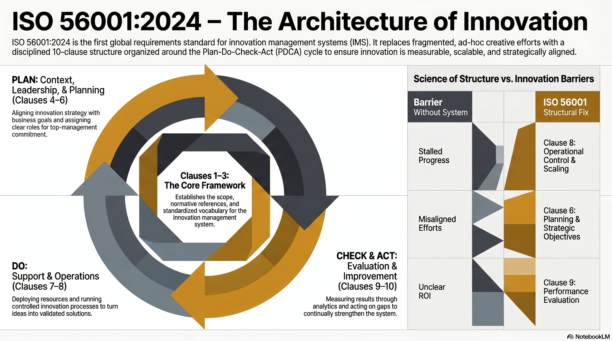

<!-- _class: title -->

# เจาะลึก ISO 56001:2024
# EP1: ภาพรวมและทำไมถึงสำคัญ

EP1 of 6 · มาตรฐาน Innovation Management System ฉบับแรกที่รับรองได้ในระดับสากล

<!-- Speaker: Series 6 EPs deep-dive on ISO 56001:2024. EP1 covers what it is, why it matters, and Thailand context. -->

---

## ISO 56001:2024 คือมาตรฐาน IMS ฉบับแรกที่รับรองได้

ออกโดย ISO กันยายน 2024 หลัง 10+ ปีพัฒนาร่วมกันระดับนานาชาติ

<svg viewBox="0 0 1100 320" width="100%" xmlns="http://www.w3.org/2000/svg">
  <rect x="60" y="30" width="980" height="260" rx="16" fill="var(--paper)" stroke="var(--soft-2)" stroke-width="1.5" style="filter:drop-shadow(0 4px 12px rgba(15,23,42,.08))"/>
  <rect x="60" y="30" width="8" height="260" rx="4" fill="var(--accent)"/>
  <circle cx="160" cy="160" r="50" fill="var(--accent)" opacity=".1"/>
  <circle cx="160" cy="160" r="36" fill="var(--accent)"/>
  <text x="160" y="155" font-size="13" fill="white" text-anchor="middle" font-family="system-ui" font-weight="700">ISO</text>
  <text x="160" y="173" font-size="13" fill="white" text-anchor="middle" font-family="system-ui" font-weight="700">56001</text>
  <text x="240" y="110" font-size="22" font-weight="800" fill="var(--ink)" font-family="system-ui">Innovation Management System Requirements</text>
  <text x="240" y="145" font-size="16" fill="var(--ink-dim)" font-family="system-ui">First certifiable IMS standard · Published Sept 2024</text>
  <rect x="240" y="165" width="160" height="28" rx="6" fill="var(--success-wash)"/>
  <text x="320" y="183" font-size="13" fill="var(--success-ink)" text-anchor="middle" font-family="system-ui" font-weight="600">Certifiable</text>
  <rect x="416" y="165" width="180" height="28" rx="6" fill="var(--accent-wash)"/>
  <text x="506" y="183" font-size="13" fill="var(--accent-deep)" text-anchor="middle" font-family="system-ui" font-weight="600">Internationally recognized</text>
  <rect x="612" y="165" width="120" height="28" rx="6" fill="var(--soft)"/>
  <text x="672" y="183" font-size="13" fill="var(--ink-dim)" text-anchor="middle" font-family="system-ui" font-weight="600">Auditable</text>
  <text x="240" y="235" font-size="14" fill="var(--muted)" font-family="system-ui">Part of ISO 56000 family · Uses same HLS structure as ISO 9001 / 14001 / 27001</text>
</svg>

<b>★ Takeaway:</b> ISO 56001 lifts innovation management to the same certifiable tier as quality and environmental standards.

<!-- Speaker: Key distinction — this is the first REQUIREMENTS standard for IMS. Not a guideline, not a suggestion. -->

---

## นวัตกรรมขาดระบบ = พึ่งโชค ไม่ใช่กระบวนการ

องค์กรส่วนใหญ่ innovate แบบ ad-hoc — ISO 56001 เปลี่ยนจาก project เป็น system

<svg viewBox="0 0 1100 320" width="100%" xmlns="http://www.w3.org/2000/svg">
  <!-- Before column -->
  <rect x="40" y="20" width="470" height="280" rx="12" fill="var(--danger-wash)" stroke="var(--danger)" stroke-width="1.5" opacity=".6"/>
  <text x="275" y="58" font-size="16" font-weight="700" fill="var(--danger-ink)" text-anchor="middle" font-family="system-ui">Without IMS</text>
  <line x1="80" y1="75" x2="470" y2="75" stroke="var(--danger)" stroke-width="1" opacity=".3"/>
  <text x="80" y="108" font-size="14" fill="var(--danger-ink)" font-family="system-ui">Depends on "hero" individuals</text>
  <text x="80" y="140" font-size="14" fill="var(--danger-ink)" font-family="system-ui">No repeatable process</text>
  <text x="80" y="172" font-size="14" fill="var(--danger-ink)" font-family="system-ui">Resources spent without metrics</text>
  <text x="80" y="204" font-size="14" fill="var(--danger-ink)" font-family="system-ui">Culture = annual Hackathon</text>
  <text x="80" y="236" font-size="14" fill="var(--danger-ink)" font-family="system-ui">Success not scalable</text>
  <!-- Arrow -->
  <circle cx="550" cy="160" r="30" fill="var(--accent)"/>
  <polygon points="550,145 565,160 550,175 535,160" fill="white"/>
  <!-- After column -->
  <rect x="590" y="20" width="470" height="280" rx="12" fill="var(--success-wash)" stroke="var(--success)" stroke-width="2"/>
  <text x="825" y="58" font-size="16" font-weight="700" fill="var(--success-ink)" text-anchor="middle" font-family="system-ui">With ISO 56001 IMS</text>
  <line x1="630" y1="75" x2="1020" y2="75" stroke="var(--success)" stroke-width="1" opacity=".3"/>
  <text x="630" y="108" font-size="14" fill="var(--success-ink)" font-family="system-ui">Systematic, process-driven innovation</text>
  <text x="630" y="140" font-size="14" fill="var(--success-ink)" font-family="system-ui">Repeatable across the organization</text>
  <text x="630" y="172" font-size="14" fill="var(--success-ink)" font-family="system-ui">Measurable ROI and KPIs</text>
  <text x="630" y="204" font-size="14" fill="var(--success-ink)" font-family="system-ui">Embedded innovation culture</text>
  <text x="630" y="236" font-size="14" fill="var(--success-ink)" font-family="system-ui">Scalable and certifiable</text>
</svg>

<b>★ Takeaway:</b> ISO 56001 shifts innovation from luck to a managed system — repeatable, measurable, auditable.

<!-- Speaker: Most organizations have innovation initiatives but they are project-based. ISO 56001 embeds innovation into core operations. -->

---

## ISO 56001 vs 56002: Requirements vs Guideline

ทำไม 2024 ถึงเปลี่ยนเกม — ต่างจาก ISO 56002:2019 อย่างไร?

<svg viewBox="0 0 1100 320" width="100%" xmlns="http://www.w3.org/2000/svg">
  <!-- ISO 56002 column -->
  <rect x="40" y="20" width="470" height="280" rx="12" fill="var(--paper)" stroke="var(--soft-2)" stroke-width="1.5" style="filter:drop-shadow(0 2px 6px rgba(15,23,42,.06))"/>
  <rect x="40" y="20" width="470" height="56" rx="12" fill="var(--soft)" opacity=".9"/>
  <text x="275" y="54" font-size="17" font-weight="700" fill="var(--ink-dim)" text-anchor="middle" font-family="system-ui">ISO 56002:2019</text>
  <text x="80" y="105" font-size="15" fill="var(--ink-dim)" font-family="system-ui">Type: Guideline</text>
  <text x="80" y="138" font-size="15" fill="var(--muted)" font-family="system-ui">Certifiable: No</text>
  <text x="80" y="171" font-size="15" fill="var(--muted)" font-family="system-ui">Auditable: No</text>
  <text x="80" y="204" font-size="15" fill="var(--muted)" font-family="system-ui">Defines: HOW (recommendations)</text>
  <text x="80" y="237" font-size="15" fill="var(--muted)" font-family="system-ui">Status: Reference only</text>
  <text x="80" y="270" font-size="13" fill="var(--muted)" font-family="system-ui">Still useful as implementation guide</text>
  <!-- VS badge -->
  <circle cx="550" cy="160" r="32" fill="var(--soft-2)" stroke="var(--muted)" stroke-width="1.5"/>
  <text x="550" y="165" font-size="15" font-weight="700" fill="var(--ink-dim)" text-anchor="middle" font-family="system-ui">vs</text>
  <!-- ISO 56001 column -->
  <rect x="590" y="20" width="470" height="280" rx="12" fill="var(--paper)" stroke="var(--accent)" stroke-width="2.5" style="filter:drop-shadow(0 6px 16px rgba(59,130,246,.18))"/>
  <rect x="590" y="20" width="470" height="56" rx="12" fill="var(--accent)" opacity=".1"/>
  <text x="825" y="54" font-size="17" font-weight="700" fill="var(--accent)" text-anchor="middle" font-family="system-ui">ISO 56001:2024</text>
  <text x="630" y="105" font-size="15" fill="var(--ink)" font-family="system-ui">Type: Requirements Standard</text>
  <rect x="630" y="118" width="110" height="24" rx="5" fill="var(--success-wash)"/>
  <text x="685" y="134" font-size="12" fill="var(--success-ink)" text-anchor="middle" font-family="system-ui" font-weight="600">Certifiable</text>
  <rect x="750" y="118" width="90" height="24" rx="5" fill="var(--accent-wash)"/>
  <text x="795" y="134" font-size="12" fill="var(--accent-deep)" text-anchor="middle" font-family="system-ui" font-weight="600">Auditable</text>
  <text x="630" y="171" font-size="15" fill="var(--ink)" font-family="system-ui">Defines: WHAT (must-dos)</text>
  <text x="630" y="204" font-size="15" fill="var(--ink)" font-family="system-ui">Same tier as ISO 9001 / 14001</text>
  <text x="630" y="237" font-size="15" fill="var(--ink)" font-family="system-ui">3-year cert + annual surveillance</text>
  <text x="630" y="270" font-size="13" fill="var(--accent)" font-family="system-ui" font-weight="600">Game-changer for IMS</text>
</svg>

<b>★ Takeaway:</b> ISO 56001 is the first certifiable IMS standard — organizations can now prove innovation capability externally, not just internally.

<!-- Speaker: ISO 56002 is still valuable as an implementation guide. But 56001 is what enables third-party certification. -->

---

## ISO 56000 Family: ชุดมาตรฐานนวัตกรรม

ISO 56001 เป็น "หัวใจ" — กำหนด WHAT; ส่วนอื่นในตระกูลบอก HOW และ specific tools

<figure class="img-card">

<figcaption>Source: NotebookLM · ISO 56000 Innovation Management Standard Family</figcaption>
</figure>

<b>★ Takeaway:</b> ISO 56001 is the only certifiable standard in the family — the others are vocabulary, guidance, and toolkits.

<!-- Speaker: Emphasize that the family works together — use 56001 for requirements, 56002 for how-to, domain-specific tools for implementation details. -->

---

## โครงสร้าง HLS: 10 Clauses ตาม PDCA

High Level Structure — same skeleton as ISO 9001/14001/27001 → integrate ได้ทันที

<figure class="img-card">

<figcaption>Source: NotebookLM · Clauses 4–10 mapped to Plan-Do-Check-Act cycle</figcaption>
</figure>

<b>★ Takeaway:</b> If you know ISO 9001, you already know the skeleton — ISO 56001 adds innovation-specific content on the same HLS framework.

<!-- Speaker: HLS means organizations already certified in 9001 or 14001 can integrate IMS without rebuilding governance structures from scratch. EP2 will go deep on each clause. -->

---

## IMS ครอบคลุม 4 มิติหลัก

ISO 56001 กำหนด requirements ใน 4 มิติ — ครบตั้งแต่ strategy ถึง culture และ measurement

  

    
Clause 5

    <h3>Leadership &amp; Strategy</h3>
    
Top management ต้องแสดง commitment จริง กำหนด Innovation Policy และ Objectives ที่สอดคล้องกับ business strategy — ไม่ใช่แค่ sponsor Hackathon

  

  

    
Clause 8

    <h3>Processes &amp; Operations</h3>
    
กระบวนการ innovation lifecycle ครบวงจร: opportunity identification → ideation → development → deploy &amp; value realization

  

  

    
Clause 7

    <h3>People &amp; Culture</h3>
    
กำหนด competence ที่ต้องการ สร้าง awareness ทั่วองค์กร และสร้างวัฒนธรรมที่ยอมรับการทดลองและเรียนรู้จากความล้มเหลว

  

  

    
Clause 9

    <h3>Measurement &amp; Improvement</h3>
    
วัดผล innovation performance ด้วย metrics ที่ชัดเจน ทำ internal audit และ management review เพื่อ continual improvement

  

<b>★ Takeaway:</b> IMS covers the full PDCA loop — strategy, execution, culture, and metrics all need to be in place together.

<!-- Speaker: Walk each card. The gold card (measurement) is often the hardest — organizations struggle to define innovation KPIs that aren't just input metrics. -->

---

## ทำไมองค์กรถึงนำ ISO 56001 มาใช้?

4 เหตุผลหลักจากองค์กรที่ implement แล้ว

<figure class="img-card">

<figcaption>Source: NotebookLM · Key drivers for ISO 56001 adoption</figcaption>
</figure>

<b>★ Takeaway:</b> Integration with existing ISO systems (HLS) is the #1 practical accelerator — organizations don't start from zero.

<!-- Speaker: The ESG credibility angle is growing fast — investors and boards now expect demonstrable innovation governance, not just innovation spending. -->

---

## ใช้ได้กับทุกประเภทองค์กร

ISO 56001 ไม่จำกัดอุตสาหกรรม ขนาด หรือประเภท — designed for universal application

  

    
Size

    <h3>SME ถึง Enterprise</h3>
    
Requirements ปรับได้ตามบริบทและทรัพยากรขององค์กร

  

  

    
Sector

    <h3>รัฐ &amp; เอกชน</h3>
    
Government agencies, SOEs, private companies, NGOs ล้วนใช้ได้

  

  

    
Industry

    <h3>ทุกอุตสาหกรรม</h3>
    
Manufacturing, healthcare, tech, education, financial services, F&amp;B

  

  

    
Goal

    <h3>ไม่ต้องเป็น "Tech"</h3>
    
องค์กรที่ต้องการ improve innovation capability — ไม่ใช่เฉพาะ R&amp;D firm

  

<b>★ Takeaway:</b> Any organization that wants systematic innovation — not just tech companies — is a valid candidate for ISO 56001.

<!-- Speaker: Hospital network, power utility, university — all certified in Thailand. Not just tech. -->

---

## ความเคลื่อนไหวในไทย: 3 องค์กรนำร่อง

NIA-TNI-MASCI ผนึกกำลัง — มีองค์กรไทยได้รับรองแล้ว 3 แห่ง ต้นปี 2026

  

    
Healthcare

    <h3>เครือพญาไท-เปาโล</h3>
    
โรงพยาบาลกลุ่มแรกในไทยที่ได้รับรอง ISO 56001 แสดงให้เห็นว่า IMS ไม่จำกัดแค่ภาคอุตสาหกรรม

  

  

    
Utility / SOE

    <h3>การไฟฟ้านครหลวง (MEA)</h3>
    
รัฐวิสาหกิจขนาดใหญ่นำ IMS มา embed เข้ากับ digital transformation strategy

  

  

    
Academia · Asia First

    <h3>CSII จุฬาลงกรณ์ฯ</h3>
    
สถาบันการศึกษาแห่งแรกในเอเชียที่ได้รับรอง — proof point สำคัญสำหรับมหาวิทยาลัยทั่วภูมิภาค

  

<b>★ Takeaway:</b> Thailand has certified organizations across healthcare, utilities, and academia — diversity that validates ISO 56001's universal applicability.

<!-- Speaker: NIA target: 100+ participants, 10% certification. NIA is treating ISO 56001 as a gateway for Thai organizations to compete globally. -->

---

## Caveats: 4 สิ่งที่ต้องระวัง

ISO 56001 ไม่ใช่ silver bullet — ต้องการ commitment และทรัพยากรที่แท้จริง

  

    
Maturity

    <h3>Certification bodies ยังอยู่ใน scaling</h3>
    
เพิ่งออกปี 2024 — ตรวจสอบ accredited body ในไทยก่อนเริ่มกระบวนการ อย่าเลือก body ที่ยังไม่ accredited

  

  

    
Scope

    <h3>กำหนด WHAT ไม่ใช่ HOW</h3>
    
องค์กรต้องออกแบบ processes, tools, และวิธีการเองให้เหมาะกับบริบท — ใช้ ISO 56002 เป็น companion guide

  

  

    
Critical

    <h3>ต้องการ Top Management Commitment</h3>
    
Clause 5 คือหัวใจ — ถ้าผู้บริหารไม่ commit จริง การ implement จะได้แค่ paperwork ที่ไม่สร้างผลลัพธ์

  

  

    
Investment

    <h3>มีค่าใช้จ่าย — คำนวณ ROI ก่อน</h3>
    
External audit + gap analysis + surveillance audits ประจำปี (cert อายุ 3 ปี) — ต้องวางแผนงบประมาณล่วงหน้า

  

<b>★ Takeaway:</b> Top management commitment is non-negotiable — without it, ISO 56001 becomes a compliance exercise, not a capability builder.

<!-- Speaker: The most common failure mode is implementing 56001 as a documentation project. It must be driven by genuine strategic intent. -->

---

## Key Takeaways: EP1 Summary

สิ่งที่ต้องจำจาก EP1 ก่อนไปอ่าน EP2

<svg viewBox="0 0 1100 320" width="100%" xmlns="http://www.w3.org/2000/svg">
  <!-- 6 numbered takeaway boxes in 2 rows of 3 -->
  <!-- Row 1 -->
  <rect x="40" y="20" width="320" height="120" rx="10" fill="var(--accent-wash)" stroke="var(--accent)" stroke-width="1.5"/>
  <circle cx="76" cy="56" r="18" fill="var(--accent)"/>
  <text x="76" y="62" font-size="14" fill="white" text-anchor="middle" font-family="system-ui" font-weight="700">1</text>
  <text x="110" y="52" font-size="14" fill="var(--accent-deep)" font-family="system-ui" font-weight="700">First Certifiable IMS</text>
  <text x="60" y="88" font-size="12" fill="var(--ink-dim)" font-family="system-ui">ISO 56001:2024 — requirements,</text>
  <text x="60" y="106" font-size="12" fill="var(--ink-dim)" font-family="system-ui">not a guideline, published Sept 2024</text>
  <rect x="390" y="20" width="320" height="120" rx="10" fill="var(--soft)" stroke="var(--soft-2)" stroke-width="1.5"/>
  <circle cx="426" cy="56" r="18" fill="var(--ink-dim)"/>
  <text x="426" y="62" font-size="14" fill="white" text-anchor="middle" font-family="system-ui" font-weight="700">2</text>
  <text x="460" y="52" font-size="14" fill="var(--ink)" font-family="system-ui" font-weight="700">HLS Integration</text>
  <text x="410" y="88" font-size="12" fill="var(--ink-dim)" font-family="system-ui">Same skeleton as 9001/14001/27001</text>
  <text x="410" y="106" font-size="12" fill="var(--ink-dim)" font-family="system-ui">— no new governance structure needed</text>
  <rect x="740" y="20" width="320" height="120" rx="10" fill="var(--soft)" stroke="var(--soft-2)" stroke-width="1.5"/>
  <circle cx="776" cy="56" r="18" fill="var(--ink-dim)"/>
  <text x="776" y="62" font-size="14" fill="white" text-anchor="middle" font-family="system-ui" font-weight="700">3</text>
  <text x="810" y="52" font-size="14" fill="var(--ink)" font-family="system-ui" font-weight="700">Universal Applicability</text>
  <text x="760" y="88" font-size="12" fill="var(--ink-dim)" font-family="system-ui">All org types, sizes, sectors,</text>
  <text x="760" y="106" font-size="12" fill="var(--ink-dim)" font-family="system-ui">industries — not just tech</text>
  <!-- Row 2 -->
  <rect x="40" y="175" width="320" height="120" rx="10" fill="var(--soft)" stroke="var(--soft-2)" stroke-width="1.5"/>
  <circle cx="76" cy="211" r="18" fill="var(--ink-dim)"/>
  <text x="76" y="217" font-size="14" fill="white" text-anchor="middle" font-family="system-ui" font-weight="700">4</text>
  <text x="110" y="207" font-size="14" fill="var(--ink)" font-family="system-ui" font-weight="700">Clauses 4-10 = PDCA</text>
  <text x="60" y="243" font-size="12" fill="var(--ink-dim)" font-family="system-ui">Context→Leadership→Planning→</text>
  <text x="60" y="261" font-size="12" fill="var(--ink-dim)" font-family="system-ui">Support→Ops→Eval→Improve</text>
  <rect x="390" y="175" width="320" height="120" rx="10" fill="var(--success-wash)" stroke="var(--success)" stroke-width="1.5"/>
  <circle cx="426" cy="211" r="18" fill="var(--success)"/>
  <text x="426" y="217" font-size="14" fill="white" text-anchor="middle" font-family="system-ui" font-weight="700">5</text>
  <text x="460" y="207" font-size="14" fill="var(--success-ink)" font-family="system-ui" font-weight="700">Thailand: 3 Certified</text>
  <text x="410" y="243" font-size="12" fill="var(--ink-dim)" font-family="system-ui">Phyathai-Paolo, MEA, CSII Chula</text>
  <text x="410" y="261" font-size="12" fill="var(--ink-dim)" font-family="system-ui">NIA drives 100+ target</text>
  <rect x="740" y="175" width="320" height="120" rx="10" fill="var(--danger-wash)" stroke="var(--danger)" stroke-width="1.5"/>
  <circle cx="776" cy="211" r="18" fill="var(--danger)"/>
  <text x="776" y="217" font-size="14" fill="white" text-anchor="middle" font-family="system-ui" font-weight="700">6</text>
  <text x="810" y="207" font-size="14" fill="var(--danger-ink)" font-family="system-ui" font-weight="700">Leadership is Non-Negotiable</text>
  <text x="760" y="243" font-size="12" fill="var(--ink-dim)" font-family="system-ui">Without top management commit</text>
  <text x="760" y="261" font-size="12" fill="var(--ink-dim)" font-family="system-ui">= paperwork, not capability</text>
</svg>

<b>★ Takeaway:</b> EP2 next — deep dive into HLS structure and what each clause actually requires of your organization.

<!-- Speaker: 6 EPs total. EP2 covers HLS + core concepts clause by clause. EP3-6 go deep on each clause group. -->
