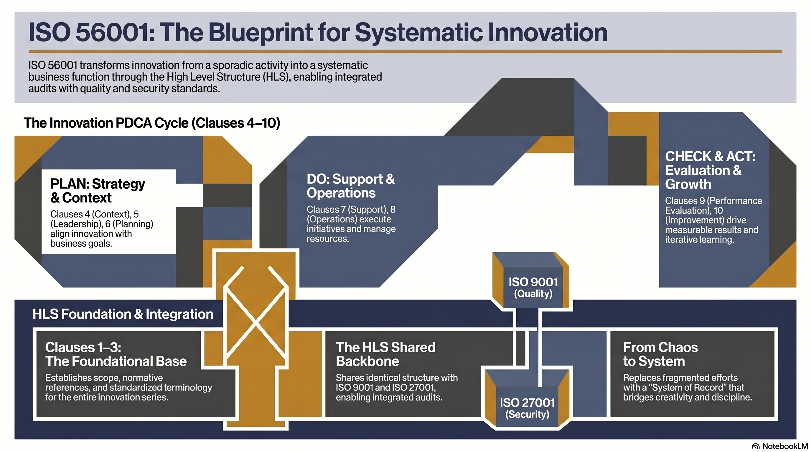

---

<!-- _class: title -->

# ISO 56001:2024 EP2
# โครงสร้าง HLS และ PDCA Loop

ทำไม ISO 56001 integrate กับ ISO 9001/27001 ได้ทันที — และ PDCA ขับ IMS อย่างไร

<!-- Speaker: EP2 อธิบาย DNA ของมาตรฐาน ISO ทุกตัว — High Level Structure และ PDCA loop ที่ทำให้ IMS วนพัฒนาตัวเองได้ -->

---

## HLS: โครงกระดูกร่วมของ ISO ทุกมาตรฐาน

Annex SL / Harmonized Structure ทำให้ ISO 9001, 14001, 27001, 56001 มี 10 Clauses เดียวกัน

  

    
Governance เดิมใช้ได้

    <h3>Audit Model ร่วม</h3>
    
Internal audit cycle, reporting structure, document control ใช้ร่วมกันได้ระหว่าง ISO standards ทั้งหมด

  

  

    
Training Cost ลด

    <h3>โครงสร้างคุ้นเคย</h3>
    
ทีมที่รู้ ISO 9001 เข้าใจ structure ของ ISO 56001 ได้ทันที ลด learning curve ได้มาก

  

  

    
Integration Audit

    <h3>Combined Audit</h3>
    
สามารถทำ combined audit ครอบ ISO 9001 + ISO 56001 + ISO 27001 ในรอบเดียวกัน ประหยัดเวลา

  

<b>★ Takeaway:</b> HLS คือเหตุผลที่ ISO 56001 เป็น "extension" ไม่ใช่ "replacement" ของระบบที่มีอยู่

<!-- Speaker: HLS หรือ Harmonized Structure (เดิมเรียก Annex SL) คือการตัดสินใจสำคัญของ ISO ในปี 2012 ที่ทำให้ทุก management system standard มีโครงสร้าง 10 clauses เหมือนกัน -->

---

## 10 Clauses → PDCA Loop

ISO 56001 ไม่ใช่ checklist ครั้งเดียว — PDCA ทำให้ IMS วนพัฒนาตัวเองอยู่ตลอด

<figure class="img-card">

<figcaption>Source: NotebookLM · ISO 56001 10-Clause HLS PDCA mapping — Foundation (1-3), Plan (4-6), Do (7-8), Check (9), Act (10)</figcaption>
</figure>

<b>★ Takeaway:</b> Clauses 9-10 เป็น feedback loop — ทุก audit cycle ทำให้ระบบ IMS ฉลาดขึ้น ไม่ใช่แค่ compliant

<!-- Speaker: PDCA ไม่ใช่แค่ diagram สวยงาม — มันคือ logic ที่ทำให้ IMS evolve ทุก audit cycle -->

---

## Foundation: Clauses 1-3 ที่มักถูกมองข้าม

Clause 3 (Terms & Definitions) กำหนดนิยาม "innovation" ที่ auditor ใช้ตัดสิน — ต้องมีทั้ง novelty และ value

<svg viewBox="0 0 1100 360" width="100%" xmlns="http://www.w3.org/2000/svg">
  <rect x="60" y="30" width="300" height="300" rx="14" fill="var(--paper)" stroke="var(--soft-2)" stroke-width="1.5" style="filter:drop-shadow(0 4px 12px rgba(15,23,42,.08))"/>
  <rect x="60" y="30" width="300" height="52" rx="14" fill="var(--soft)"/>
  <text x="210" y="62" font-size="16" font-weight="700" fill="var(--ink-dim)" text-anchor="middle" font-family="system-ui">Clause 1 — Scope</text>
  <text x="100" y="120" font-size="14" fill="var(--ink)" font-family="system-ui">ใช้ได้กับทุกองค์กร</text>
  <text x="100" y="148" font-size="14" fill="var(--ink-dim)" font-family="system-ui">ทุกขนาด ทุกอุตสาหกรรม</text>
  <text x="100" y="176" font-size="13" fill="var(--muted)" font-family="system-ui">ต้องพิสูจน์ว่ามี systematic</text>
  <text x="100" y="198" font-size="13" fill="var(--muted)" font-family="system-ui">IMS จริง ไม่ใช่แค่ declare</text>
  <rect x="400" y="30" width="300" height="300" rx="14" fill="var(--paper)" stroke="var(--soft-2)" stroke-width="1.5" style="filter:drop-shadow(0 4px 12px rgba(15,23,42,.08))"/>
  <rect x="400" y="30" width="300" height="52" rx="14" fill="var(--soft)"/>
  <text x="550" y="62" font-size="16" font-weight="700" fill="var(--ink-dim)" text-anchor="middle" font-family="system-ui">Clause 2 — Normative Refs</text>
  <text x="440" y="120" font-size="14" fill="var(--ink)" font-family="system-ui">อ้างอิง ISO 56000:2020</text>
  <text x="440" y="148" font-size="14" fill="var(--ink-dim)" font-family="system-ui">(Vocabulary Standard)</text>
  <text x="440" y="176" font-size="13" fill="var(--muted)" font-family="system-ui">ทุก term ใน audit</text>
  <text x="440" y="198" font-size="13" fill="var(--muted)" font-family="system-ui">ต้องอ่านตาม ISO 56000</text>
  <rect x="740" y="30" width="320" height="300" rx="14" fill="var(--paper)" stroke="var(--accent)" stroke-width="2" style="filter:drop-shadow(0 4px 12px rgba(15,23,42,.12))"/>
  <rect x="740" y="30" width="320" height="52" rx="14" fill="var(--accent-wash)"/>
  <text x="900" y="62" font-size="16" font-weight="700" fill="var(--accent)" text-anchor="middle" font-family="system-ui">Clause 3 — Terms ★</text>
  <text x="780" y="110" font-size="14" fill="var(--ink)" font-family="system-ui">50+ terms จาก ISO 56000</text>
  <text x="780" y="140" font-size="14" fill="var(--ink-dim)" font-family="system-ui">Innovation =</text>
  <text x="780" y="165" font-size="13" fill="var(--accent)" font-family="system-ui" font-weight="600">Entity ใหม่/เปลี่ยนแปลง</text>
  <text x="780" y="190" font-size="13" fill="var(--accent)" font-family="system-ui" font-weight="600">+ สร้าง Value จริง</text>
  <text x="780" y="220" font-size="13" fill="var(--muted)" font-family="system-ui">Novelty เพียงอย่างเดียว</text>
  <text x="780" y="240" font-size="13" fill="var(--muted)" font-family="system-ui">ไม่นับเป็น innovation</text>
</svg>

<b>★ Takeaway:</b> Clause 3 กำหนดนิยาม "innovation" ที่ auditor ใช้ — ถ้าไม่มี value realization ไม่ถือเป็น innovation

---

## PLAN: Clauses 4-6 — วางทิศทาง IMS

Context → Leadership → Planning: สามขั้นที่แปล business strategy เป็น innovation portfolio

<svg viewBox="0 0 1100 360" width="100%" xmlns="http://www.w3.org/2000/svg">
  <rect x="40" y="40" width="320" height="280" rx="14" fill="var(--paper)" stroke="var(--soft-2)" stroke-width="1.5" style="filter:drop-shadow(var(--shadow-sm))"/>
  <rect x="40" y="40" width="320" height="52" rx="14" fill="var(--soft)"/>
  <text x="200" y="72" font-size="16" font-weight="700" fill="var(--ink-dim)" text-anchor="middle" font-family="system-ui">Clause 4: Context</text>
  <text x="70" y="124" font-size="14" fill="var(--ink)" font-family="system-ui">4.1 External factors (PESTLE)</text>
  <text x="70" y="152" font-size="14" fill="var(--ink-dim)" font-family="system-ui">4.2 Stakeholder mapping</text>
  <text x="70" y="180" font-size="14" fill="var(--ink-dim)" font-family="system-ui">4.3 IMS scope definition</text>
  <text x="70" y="208" font-size="14" fill="var(--muted)" font-family="system-ui">4.4 IMS framework design</text>
  <path d="M365 180 L385 180" stroke="var(--accent)" stroke-width="2.5" marker-end="url(#arr)"/>
  <defs><marker id="arr" markerWidth="10" markerHeight="7" refX="9" refY="3.5" orient="auto"><polygon points="0 0,10 3.5,0 7" fill="var(--accent)"/></marker></defs>
  <rect x="390" y="40" width="320" height="280" rx="14" fill="var(--paper)" stroke="var(--accent)" stroke-width="2" style="filter:drop-shadow(var(--shadow-md))"/>
  <rect x="390" y="40" width="320" height="52" rx="14" fill="var(--accent-wash)"/>
  <text x="550" y="72" font-size="16" font-weight="700" fill="var(--accent)" text-anchor="middle" font-family="system-ui">Clause 5: Leadership ★</text>
  <text x="420" y="124" font-size="14" fill="var(--ink)" font-family="system-ui">5.1 Top management commitment</text>
  <text x="420" y="152" font-size="14" fill="var(--ink-dim)" font-family="system-ui">5.2 Innovation Policy</text>
  <text x="420" y="180" font-size="14" fill="var(--ink-dim)" font-family="system-ui">5.3 Roles & Responsibilities</text>
  <text x="420" y="208" font-size="14" fill="var(--muted)" font-family="system-ui">Strategic Intent</text>
  <path d="M715 180 L735 180" stroke="var(--accent)" stroke-width="2.5" marker-end="url(#arr)"/>
  <rect x="740" y="40" width="320" height="280" rx="14" fill="var(--paper)" stroke="var(--soft-2)" stroke-width="1.5" style="filter:drop-shadow(var(--shadow-sm))"/>
  <rect x="740" y="40" width="320" height="52" rx="14" fill="var(--soft)"/>
  <text x="900" y="72" font-size="16" font-weight="700" fill="var(--ink-dim)" text-anchor="middle" font-family="system-ui">Clause 6: Planning</text>
  <text x="770" y="124" font-size="14" fill="var(--ink)" font-family="system-ui">6.1 Risk & opportunity mgmt</text>
  <text x="770" y="152" font-size="14" fill="var(--ink-dim)" font-family="system-ui">6.2 Innovation objectives + KPIs</text>
  <text x="770" y="180" font-size="14" fill="var(--ink-dim)" font-family="system-ui">6.3 Portfolio planning</text>
  <text x="770" y="208" font-size="14" fill="var(--muted)" font-family="system-ui">Resource allocation</text>
</svg>

<b>★ Takeaway:</b> Clause 5 (Leadership) คือ single most important clause — commitment ที่ขาดไม่ได้สำหรับทุก clause อื่น

---

## DO: Clauses 7-8 — ลงมือทำ

Support (enablers) + Operation (execution): ล้มเหลวที่นี่มากที่สุด เพราะมี strategy ดีแต่ไม่มี operation รองรับ

<svg viewBox="0 0 1100 360" width="100%" xmlns="http://www.w3.org/2000/svg">
  <rect x="60" y="30" width="440" height="300" rx="14" fill="var(--paper)" stroke="var(--soft-2)" stroke-width="1.5" style="filter:drop-shadow(var(--shadow-sm))"/>
  <rect x="60" y="30" width="440" height="52" rx="14" fill="var(--soft)"/>
  <text x="280" y="62" font-size="17" font-weight="700" fill="var(--ink-dim)" text-anchor="middle" font-family="system-ui">Clause 7: Support (Enablers)</text>
  <text x="90" y="115" font-size="14" fill="var(--ink)" font-family="system-ui">7.1 Resources — คน เวลา budget ที่ dedicated</text>
  <text x="90" y="145" font-size="14" fill="var(--ink-dim)" font-family="system-ui">7.2 Competence — Design Thinking, Lean Startup</text>
  <text x="90" y="175" font-size="14" fill="var(--ink-dim)" font-family="system-ui">7.3 Awareness — ทุกคนเข้าใจ IMS</text>
  <text x="90" y="205" font-size="14" fill="var(--muted)" font-family="system-ui">7.4 Communication plan</text>
  <text x="90" y="235" font-size="14" fill="var(--accent)" font-family="system-ui" font-weight="600">7.6 Knowledge Management ★</text>
  <path d="M505 180 L585 180" stroke="var(--accent)" stroke-width="2.5" marker-end="url(#arr2)"/>
  <defs><marker id="arr2" markerWidth="10" markerHeight="7" refX="9" refY="3.5" orient="auto"><polygon points="0 0,10 3.5,0 7" fill="var(--accent)"/></marker></defs>
  <rect x="590" y="30" width="450" height="300" rx="14" fill="var(--paper)" stroke="var(--accent)" stroke-width="2" style="filter:drop-shadow(var(--shadow-md))"/>
  <rect x="590" y="30" width="450" height="52" rx="14" fill="var(--accent-wash)"/>
  <text x="815" y="62" font-size="17" font-weight="700" fill="var(--accent)" text-anchor="middle" font-family="system-ui">Clause 8: Operation ★</text>
  <text x="620" y="115" font-size="14" fill="var(--ink)" font-family="system-ui">Opportunity Identification</text>
  <text x="620" y="145" font-size="14" fill="var(--ink-dim)" font-family="system-ui">Concept Creation</text>
  <text x="620" y="175" font-size="14" fill="var(--ink-dim)" font-family="system-ui">Concept Validation (MVP, PoC)</text>
  <text x="620" y="205" font-size="14" fill="var(--muted)" font-family="system-ui">Development &amp; Scaling</text>
  <text x="620" y="235" font-size="14" fill="var(--muted)" font-family="system-ui">Deployment</text>
</svg>

<b>★ Takeaway:</b> Clause 8 ยืดหยุ่นที่สุด — ISO ไม่บังคับ tools แต่บังคับว่า 5 stages ต้องมีใน design

---

## CHECK & ACT: Clauses 9-10 — ปิด Loop

Clause 9 วัดและ audit; Clause 10 ปรับปรุง — สองนี้ทำให้ IMS "live" ไม่ใช่ certify แล้วจบ

<svg viewBox="0 0 1100 340" width="100%" xmlns="http://www.w3.org/2000/svg">
  <rect x="40" y="20" width="490" height="300" rx="14" fill="var(--paper)" stroke="var(--soft-2)" stroke-width="1.5" style="filter:drop-shadow(var(--shadow-sm))"/>
  <rect x="40" y="20" width="490" height="52" rx="14" fill="var(--soft)"/>
  <text x="285" y="52" font-size="17" font-weight="700" fill="var(--ink-dim)" text-anchor="middle" font-family="system-ui">Clause 9: Performance Evaluation</text>
  <text x="70" y="110" font-size="14" fill="var(--ink)" font-family="system-ui">9.1 Monitoring &amp; Measurement</text>
  <text x="70" y="138" font-size="13" fill="var(--ink-dim)" font-family="system-ui">   — Input / Process / Output / Outcome metrics</text>
  <text x="70" y="175" font-size="14" fill="var(--ink)" font-family="system-ui">9.2 Internal Audit</text>
  <text x="70" y="203" font-size="13" fill="var(--ink-dim)" font-family="system-ui">   — Innovation-mindset audit (ไม่ใช่แค่ compliance)</text>
  <text x="70" y="240" font-size="14" fill="var(--ink)" font-family="system-ui">9.3 Management Review</text>
  <text x="70" y="268" font-size="13" fill="var(--ink-dim)" font-family="system-ui">   — Leadership "owns" ผลลัพธ์ของ IMS</text>
  <rect x="570" y="20" width="490" height="300" rx="14" fill="var(--paper)" stroke="var(--accent)" stroke-width="2" style="filter:drop-shadow(var(--shadow-md))"/>
  <rect x="570" y="20" width="490" height="52" rx="14" fill="var(--accent-wash)"/>
  <text x="815" y="52" font-size="17" font-weight="700" fill="var(--accent)" text-anchor="middle" font-family="system-ui">Clause 10: Improvement ★</text>
  <text x="600" y="110" font-size="14" fill="var(--ink)" font-family="system-ui">10.1 Nonconformity &amp; Corrective Action</text>
  <text x="600" y="138" font-size="13" fill="var(--ink-dim)" font-family="system-ui">   React → Investigate → Correct → Review</text>
  <text x="600" y="175" font-size="14" fill="var(--ink)" font-family="system-ui">10.2 Continual Improvement</text>
  <text x="600" y="203" font-size="13" fill="var(--ink-dim)" font-family="system-ui">   — Effectiveness (ทำสิ่งถูกต้อง)</text>
  <text x="600" y="228" font-size="13" fill="var(--ink-dim)" font-family="system-ui">   — Efficiency (ทำอย่างถูกวิธี)</text>
  <text x="600" y="268" font-size="13" fill="var(--accent)" font-family="system-ui" font-weight="600">   ทุก audit cycle = IMS evolves</text>
</svg>

<b>★ Takeaway:</b> Clause 10 คือสิ่งที่ทำให้ ISO 56001 certification มีความหมาย — ระบบต้องพัฒนา ไม่ใช่แค่ผ่าน audit

---

## ISO 56001 vs ISO 56002: เลือกใช้แบบไหน?

Certifiable Requirements vs Non-certifiable Guideline — ต่างกันในสิ่งที่สำคัญ

<figure class="img-card">

<figcaption>Source: NotebookLM · ISO 56001 (Requirements, certifiable) vs ISO 56002 (Guideline, self-assessment only)</figcaption>
</figure>

<b>★ Takeaway:</b> ถ้าต้องการ credibility กับลูกค้า/partner ใช้ ISO 56001; ถ้าแค่ปรับปรุงภายใน ISO 56002 เพียงพอ

---

## Key Takeaways — EP2 HLS & PDCA

สิ่งที่ต้องจำจากตอนนี้ก่อนไป EP3

  

    
HLS Integration

    <h3>10 Clauses เดียวกับ ISO 9001/27001</h3>
    
Governance, audit model, training ใช้ร่วมกันได้ทันที — ISO 56001 คือ extension ไม่ใช่ replacement

  

  

    
PDCA Loop

    <h3>วงจรปรับปรุงต่อเนื่อง</h3>
    
Clauses 4-6 Plan → 7-8 Do → 9 Check → 10 Act ทำซ้ำทุก cycle ทำให้ IMS evolve ตัวเอง

  

  

    
Clause 3 สำคัญ

    <h3>นิยาม Innovation = Novelty + Value</h3>
    
Auditor ใช้นิยามจาก ISO 56000 — ถ้า initiative ไม่มี value realization ไม่ถือเป็น innovation

  

  

    
Clause 8 ยืดหยุ่นสูง

    <h3>ไม่บังคับ Tools</h3>
    
บังคับแค่ 5 stages: Opportunity → Concept → Validate → Develop → Deploy องค์กรเลือก methodology เอง

  

<b>★ Takeaway:</b> EP3 จะเจาะ Clauses 4-5 (Context + Leadership) ซึ่งเป็น foundation ที่ต้องถูก build ก่อนทุกอย่าง

