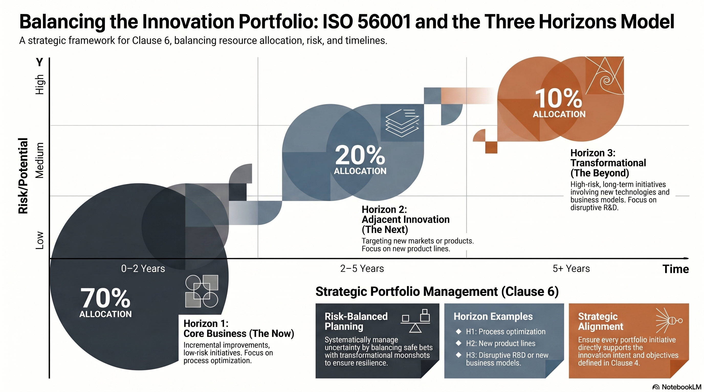

---

<!-- _class: title -->

# ISO 56001:2024 EP4
# Innovation Portfolio Planning

Clause 6 คือตัวแปล Strategic Intent → Portfolio → Operations — balance ระหว่าง now และ future

<!-- Speaker: EP4 เจาะ Clause 6 ซึ่งเป็นหัวใจของการวาง innovation portfolio ให้ balance และมีระบบ -->

---

## Portfolio ≠ Project: มุมมองที่ต่างกันโดยสิ้นเชิง

Clause 6 ต้องการ portfolio thinking — มองทุก initiative รวมกัน ไม่ใช่แค่ดูทีละ project

<svg viewBox="0 0 1100 320" width="100%" xmlns="http://www.w3.org/2000/svg">
  <rect x="40" y="20" width="480" height="280" rx="14" fill="var(--paper)" stroke="var(--soft-2)" stroke-width="1.5" style="filter:drop-shadow(var(--shadow-sm))"/>
  <rect x="40" y="20" width="480" height="52" rx="14" fill="var(--soft)"/>
  <text x="280" y="52" font-size="17" font-weight="700" fill="var(--ink-dim)" text-anchor="middle" font-family="system-ui">Project Management</text>
  <text x="70" y="105" font-size="14" fill="var(--ink)" font-family="system-ui">ขอบเขต: ทีละ project</text>
  <text x="70" y="140" font-size="14" fill="var(--ink-dim)" font-family="system-ui">เป้าหมาย: ส่งมอบ scope ในเวลา/งบ</text>
  <text x="70" y="175" font-size="14" fill="var(--ink-dim)" font-family="system-ui">Decision: ทำให้ project สำเร็จ</text>
  <text x="70" y="210" font-size="14" fill="var(--muted)" font-family="system-ui">Metric: On-time, on-budget</text>
  <rect x="580" y="20" width="480" height="280" rx="14" fill="var(--paper)" stroke="var(--accent)" stroke-width="2" style="filter:drop-shadow(var(--shadow-md))"/>
  <rect x="580" y="20" width="480" height="52" rx="14" fill="var(--accent-wash)"/>
  <text x="820" y="52" font-size="17" font-weight="700" fill="var(--accent)" text-anchor="middle" font-family="system-ui">Innovation Portfolio Management ★</text>
  <text x="610" y="105" font-size="14" fill="var(--ink)" font-family="system-ui">ขอบเขต: ทุก initiative รวมกัน</text>
  <text x="610" y="140" font-size="14" fill="var(--ink-dim)" font-family="system-ui">เป้าหมาย: Optimize return vs. risk</text>
  <text x="610" y="175" font-size="14" fill="var(--ink-dim)" font-family="system-ui">Decision: คัดกรอง / เพิ่ม / หยุด</text>
  <text x="610" y="210" font-size="14" fill="var(--accent)" font-family="system-ui" font-weight="600">Metric: Portfolio balance + value</text>
</svg>

<b>★ Takeaway:</b> Portfolio manager ถามว่า "ทรัพยากรทั้งหมดกระจายถูกต้องไหม?" — ไม่ใช่แค่ "project นี้ on-track ไหม?"

---

## Three Horizons: สูตร Balance ระหว่าง Now และ Future

McKinsey Three Horizons คือ framework ที่ใช้บ่อยที่สุดกับ ISO 56001 Clause 6 — 70/20/10 เป็น starting point ไม่ใช่กฎตายตัว

<figure class="img-card">

<figcaption>Source: NotebookLM · H1 Core (~70%), H2 Adjacent (~20%), H3 Transformational (~10%) — time-risk-allocation matrix</figcaption>
</figure>

<b>★ Takeaway:</b> Horizon 3 ที่ 0% = ไม่มี future growth engine; Horizon 1 ที่ 100% = ประกาศว่าจะ decline ใน 5-10 ปี

---

## Stage Gate Process: ตัวกรอง Portfolio

Gate ทุกตัวต้องมี criteria ชัดเจน — Gate ที่ไม่มี criteria จะ kill ทุก moonshot หรือปล่อยทุก initiative ผ่านแบบไม่มีความหมาย

<figure class="img-card">

<figcaption>Source: NotebookLM · Idea → Gate 1 Feasibility → Concept → Gate 2 Technical → PoC → Gate 3 Business Case → Scale → Gate 4 Investment → Launch</figcaption>
</figure>

<b>★ Takeaway:</b> Stage Gates คือ decision points ไม่ใช่ bureaucracy checkboxes — criteria ต้องชัดและ simple

---

## Innovation Objectives: SMART แต่อย่าวัด Output เพียงอย่างเดียว

KPIs ที่วัดแค่จำนวน patents หรือ ideas submitted จะ incentivize พฤติกรรมผิด

  

    
Vanity Metrics (หลีกเลี่ยง)

    <h3>Output เพียงอย่างเดียว</h3>
    
จำนวน patents filed, จำนวน ideas submitted, จำนวน workshops จัด — วัดได้ง่ายแต่ไม่สะท้อน value จริง

    
Incentivize: ส่ง idea เยอะๆ, patent สิ่งที่ไม่มี commercial value

  

  

    
Balanced KPIs (ใช้นี้)

    <h3>ครอบ 4 ระดับ</h3>
    
<strong>Input:</strong> R&D investment %, innovation FTE

    
<strong>Process:</strong> stage gate conversion rate, time-to-market

    
<strong>Output:</strong> new products launched

    
<strong>Outcome:</strong> revenue from innovations &lt;3yr old ≥20%

  

<b>★ Takeaway:</b> วัดทั้ง 4 ระดับ: Input → Process → Output → Outcome — ขาดระดับใดระดับหนึ่งจะ incentivize behavior ผิด

---

## Resource Allocation: ต้อง Planned ไม่ใช่ "เวลาว่าง"

Clause 6 กำหนดให้มี planned resources — innovation ที่ทำใน "เวลาว่าง" จะ fail เสมอ

  

    
Pain Points ที่พบบ่อย

    <h3>ปัญหา Resource Allocation</h3>
    
<strong>Dedicated time:</strong> ทีมมีเวลา innovation จริงกี่ %?

    
<strong>Budget ringfencing:</strong> เงิน innovation ถูก cut ช่วง budget tight?

    
<strong>Infrastructure:</strong> มี lab / maker space / prototype tools?

    
<strong>Data access:</strong> ทีม innovation เข้าถึง customer data ได้?

  

  

    
Portfolio Balance Red Flags

    <h3>สัญญาณ Portfolio ไม่ Balanced</h3>
    
<strong>มีแต่ incremental:</strong> ไม่มี future growth engine (Horizon 3 = 0%)

    
<strong>มีแต่ moonshots:</strong> ไม่มี quick wins แสดง ROI ระยะสั้น

    
<strong>H1 ครอบ 95%+:</strong> ไม่ได้ลงทุนใน future ไม่มีทาง grow

  

<b>★ Takeaway:</b> Portfolio balance ต้องตรวจสอบอย่างน้อย quarterly — ถ้า check แค่ปีละครั้งจะ course-correct ช้าเกินไป

---

## Key Takeaways — EP4 Portfolio Planning

Clause 6 คือตัวแปลจาก Strategy → Portfolio → Operations

  

    
Core Principle

    <h3>Portfolio ≠ Project</h3>
    
มองทุก initiative รวมกัน optimize return vs. risk ทั้ง portfolio ไม่ใช่แค่ทีละชิ้น

  

  

    
Three Horizons

    <h3>~70/20/10 เป็น Starting Point</h3>
    
Core / Adjacent / Transformational — ปรับ allocation ตาม strategic intent ของแต่ละองค์กร

  

  

    
Stage Gates

    <h3>Decision Points ที่ชัดเจน</h3>
    
Criteria ต้องชัด ทำ Go/No-Go จริง ไม่ใช่แค่ checkpoint ที่ทุกคนผ่านเสมอ

  

  

    
KPI Trap

    <h3>อย่าวัดแค่ Output</h3>
    
Input + Process + Output + Outcome — ครอบ 4 ระดับเสมอ มิฉะนั้นจะ incentivize behavior ผิด

  

  

    
Resources

    <h3>ต้อง Planned ล่วงหน้า</h3>
    
Budget ringfencing, dedicated time, infrastructure — ไม่ใช่ทำใน "เวลาว่าง" แล้วหวังว่าจะ succeed

  

  

    
Next EP

    <h3>EP5: Clauses 7-8</h3>
    
Portfolio วางแล้ว — EP5 จะเจาะ enablers (Clause 7) และ operational process idea-to-launch (Clause 8)

  

<b>★ Takeaway:</b> Clause 6 เป็น bridge จาก "วางแผน" ไปสู่ "ลงมือทำ" — ขาด portfolio logic ทรัพยากรจะกระจายแบบ watering can

