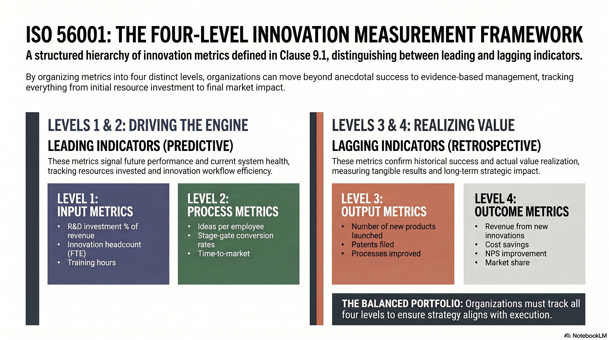

---

<!-- _class: title -->

# ISO 56001:2024 EP6
# วัดผล ตรวจสอบ และปรับปรุงต่อเนื่อง

Clauses 9-10 ปิด PDCA loop — วัดผล 4 ระดับ, audit แบบ innovation mindset, ปรับปรุงไม่หยุด

<!-- Speaker: EP6 ปิดซีรีส์ด้วย Clauses 9-10 ที่ทำให้ IMS เป็น living system ไม่ใช่ document ที่ certify แล้วเก็บลิ้นชัก -->

---

## ปัญหาของการวัด Innovation ผิดวิธี

"What gets measured gets managed" — แต่ถ้าวัดผิด จะ incentivize พฤติกรรมผิด

<svg viewBox="0 0 1100 320" width="100%" xmlns="http://www.w3.org/2000/svg">
  <rect x="40" y="20" width="480" height="280" rx="14" fill="var(--danger-wash)" stroke="var(--danger)" stroke-width="1.5"/>
  <rect x="40" y="20" width="480" height="52" rx="14" fill="var(--danger)" opacity=".15"/>
  <text x="280" y="52" font-size="17" font-weight="700" fill="var(--danger-ink)" text-anchor="middle" font-family="system-ui">Vanity Metrics (หลีกเลี่ยง)</text>
  <text x="70" y="105" font-size="14" fill="var(--danger-ink)" font-family="system-ui">วัดแค่จำนวน ideas submitted</text>
  <text x="70" y="132" font-size="13" fill="var(--ink-dim)" font-family="system-ui">→ คนส่ง ideas เยอะๆ ไม่สนว่าดีหรือไม่</text>
  <text x="70" y="170" font-size="14" fill="var(--danger-ink)" font-family="system-ui">วัดแค่จำนวน patents filed</text>
  <text x="70" y="197" font-size="13" fill="var(--ink-dim)" font-family="system-ui">→ patent สิ่งที่ไม่มี commercial value</text>
  <text x="70" y="235" font-size="14" fill="var(--danger-ink)" font-family="system-ui">วัดแค่ workshops / training sessions</text>
  <text x="70" y="262" font-size="13" fill="var(--ink-dim)" font-family="system-ui">→ วัดได้ง่ายแต่ไม่สะท้อน capability</text>
  <rect x="580" y="20" width="480" height="280" rx="14" fill="var(--success-wash)" stroke="var(--success)" stroke-width="1.5"/>
  <rect x="580" y="20" width="480" height="52" rx="14" fill="var(--success)" opacity=".15"/>
  <text x="820" y="52" font-size="17" font-weight="700" fill="var(--success-ink)" text-anchor="middle" font-family="system-ui">Balanced Metrics (ใช้นี้)</text>
  <text x="610" y="95" font-size="13" font-weight="600" fill="var(--success-ink)" font-family="system-ui">LEADING INDICATORS:</text>
  <text x="610" y="120" font-size="14" fill="var(--ink)" font-family="system-ui">Input: R&D investment %, innovation FTE</text>
  <text x="610" y="148" font-size="14" fill="var(--ink-dim)" font-family="system-ui">Process: stage gate conversion, T2M</text>
  <text x="610" y="185" font-size="13" font-weight="600" fill="var(--success-ink)" font-family="system-ui">LAGGING INDICATORS:</text>
  <text x="610" y="210" font-size="14" fill="var(--ink)" font-family="system-ui">Output: new products, processes improved</text>
  <text x="610" y="238" font-size="14" fill="var(--ink-dim)" font-family="system-ui">Outcome: revenue from innovations &lt;3yr</text>
</svg>

<b>★ Takeaway:</b> วัดแค่ output metrics → องค์กรจะรู้ว่า IMS fail หลังจาก 3-5 ปีแล้ว — ต้องมี leading indicators ด้วย

---

## Framework 4 ระดับ: Input → Process → Output → Outcome

Clause 9.1 กำหนดให้วัดครบ 4 ระดับ — ขาดระดับใดระดับหนึ่งจะ incentivize behavior ผิด

<figure class="img-card">

<figcaption>Source: NotebookLM · Level 1 Input (R&D %, FTE) → Level 2 Process (conversion rate, T2M) → Level 3 Output (products, patents) → Level 4 Outcome (revenue, NPS, market share)</figcaption>
</figure>

<b>★ Takeaway:</b> Leading (Input/Process) + Lagging (Output/Outcome) ต้องใช้คู่กัน — Leading บอก pipeline health, Lagging บอก investment direction

---

## IMS Audit ≠ QMS Audit: ต้องใช้ Innovation Mindset

Auditor ที่ใช้แค่ QMS checklist จะ miss สิ่งที่สำคัญจริงๆ ของ IMS

<svg viewBox="0 0 1100 320" width="100%" xmlns="http://www.w3.org/2000/svg">
  <rect x="40" y="20" width="480" height="280" rx="14" fill="var(--paper)" stroke="var(--soft-2)" stroke-width="1.5" style="filter:drop-shadow(var(--shadow-sm))"/>
  <rect x="40" y="20" width="480" height="52" rx="14" fill="var(--soft)"/>
  <text x="280" y="52" font-size="17" font-weight="700" fill="var(--ink-dim)" text-anchor="middle" font-family="system-ui">QMS Audit (ISO 9001)</text>
  <text x="70" y="100" font-size="14" fill="var(--ink)" font-family="system-ui">Focus: Compliance, Consistency</text>
  <text x="70" y="135" font-size="14" fill="var(--ink-dim)" font-family="system-ui">Evidence: Records, Procedures</text>
  <text x="70" y="170" font-size="14" fill="var(--ink-dim)" font-family="system-ui">Success: Zero nonconformities</text>
  <text x="70" y="220" font-size="15" font-weight="600" fill="var(--ink-dim)" font-family="system-ui">"Did you follow the process?"</text>
  <rect x="580" y="20" width="480" height="280" rx="14" fill="var(--paper)" stroke="var(--accent)" stroke-width="2" style="filter:drop-shadow(var(--shadow-md))"/>
  <rect x="580" y="20" width="480" height="52" rx="14" fill="var(--accent-wash)"/>
  <text x="820" y="52" font-size="17" font-weight="700" fill="var(--accent)" text-anchor="middle" font-family="system-ui">IMS Audit (ISO 56001) ★</text>
  <text x="610" y="100" font-size="14" fill="var(--ink)" font-family="system-ui">Focus: Effectiveness, Learning</text>
  <text x="610" y="135" font-size="14" fill="var(--ink-dim)" font-family="system-ui">Evidence: Outcomes, Decisions</text>
  <text x="610" y="170" font-size="14" fill="var(--ink-dim)" font-family="system-ui">Success: Innovation results + learnings</text>
  <text x="610" y="220" font-size="15" font-weight="600" fill="var(--accent)" font-family="system-ui">"Is the system producing value?"</text>
</svg>

<b>★ Takeaway:</b> IMS audit ต้องถามว่า "ระบบสร้าง value ไหม?" ไม่ใช่แค่ "ทำตาม procedure ไหม?" — mindset ต่างกันโดยสิ้นเชิง

---

## Innovation Maturity Model: อยู่ Level ไหน และต้องไป Level ไหน

ISO 56001 certification = minimum Level 3 ที่ verified โดย third party — ไม่ต้อง perfect เพื่อ certify

<svg viewBox="0 0 1100 340" width="100%" xmlns="http://www.w3.org/2000/svg">
  <rect x="20" y="60" width="185" height="260" rx="10" fill="var(--paper)" stroke="var(--soft-2)" stroke-width="1.5"/>
  <rect x="20" y="60" width="185" height="46" rx="10" fill="var(--muted)" opacity=".2"/>
  <text x="112" y="88" font-size="13" font-weight="700" fill="var(--ink-dim)" text-anchor="middle" font-family="system-ui">Level 1</text>
  <text x="112" y="108" font-size="12" fill="var(--muted)" text-anchor="middle" font-family="system-ui">Ad Hoc</text>
  <text x="112" y="148" font-size="12" fill="var(--ink-dim)" text-anchor="middle" font-family="system-ui">สุ่ม ขึ้นกับ</text>
  <text x="112" y="168" font-size="12" fill="var(--ink-dim)" text-anchor="middle" font-family="system-ui">ตัวบุคคล</text>
  <text x="112" y="188" font-size="12" fill="var(--muted)" text-anchor="middle" font-family="system-ui">ไม่มีระบบ</text>
  <rect x="225" y="50" width="185" height="270" rx="10" fill="var(--paper)" stroke="var(--soft-2)" stroke-width="1.5"/>
  <rect x="225" y="50" width="185" height="46" rx="10" fill="var(--warning)" opacity=".2"/>
  <text x="317" y="78" font-size="13" font-weight="700" fill="var(--warning-ink)" text-anchor="middle" font-family="system-ui">Level 2</text>
  <text x="317" y="98" font-size="12" fill="var(--warning-ink)" text-anchor="middle" font-family="system-ui">Defined</text>
  <text x="317" y="138" font-size="12" fill="var(--ink-dim)" text-anchor="middle" font-family="system-ui">มี process</text>
  <text x="317" y="158" font-size="12" fill="var(--ink-dim)" text-anchor="middle" font-family="system-ui">documented</text>
  <text x="317" y="178" font-size="12" fill="var(--muted)" text-anchor="middle" font-family="system-ui">ทำไม่ consistent</text>
  <rect x="430" y="20" width="200" height="300" rx="10" fill="var(--paper)" stroke="var(--accent)" stroke-width="3"/>
  <rect x="430" y="20" width="200" height="46" rx="10" fill="var(--accent)" opacity=".2"/>
  <text x="530" y="48" font-size="14" font-weight="700" fill="var(--accent)" text-anchor="middle" font-family="system-ui">Level 3 ★</text>
  <text x="530" y="68" font-size="12" fill="var(--accent)" text-anchor="middle" font-family="system-ui">Managed</text>
  <text x="530" y="100" font-size="12" fill="var(--ink)" text-anchor="middle" font-family="system-ui">IMS implement</text>
  <text x="530" y="120" font-size="12" fill="var(--ink)" text-anchor="middle" font-family="system-ui">สม่ำเสมอ</text>
  <text x="530" y="145" font-size="12" fill="var(--ink-dim)" text-anchor="middle" font-family="system-ui">วัดผลได้</text>
  <text x="530" y="165" font-size="12" fill="var(--ink-dim)" text-anchor="middle" font-family="system-ui">มี governance</text>
  <text x="530" y="200" font-size="11" font-weight="700" fill="var(--accent)" text-anchor="middle" font-family="system-ui">ISO 56001</text>
  <text x="530" y="218" font-size="11" font-weight="700" fill="var(--accent)" text-anchor="middle" font-family="system-ui">Certification</text>
  <rect x="650" y="30" width="200" height="290" rx="10" fill="var(--paper)" stroke="var(--soft-2)" stroke-width="1.5"/>
  <rect x="650" y="30" width="200" height="46" rx="10" fill="var(--success)" opacity=".15"/>
  <text x="750" y="58" font-size="13" font-weight="700" fill="var(--success-ink)" text-anchor="middle" font-family="system-ui">Level 4</text>
  <text x="750" y="78" font-size="12" fill="var(--success-ink)" text-anchor="middle" font-family="system-ui">Optimized</text>
  <text x="750" y="118" font-size="12" fill="var(--ink-dim)" text-anchor="middle" font-family="system-ui">IMS เรียนรู้</text>
  <text x="750" y="138" font-size="12" fill="var(--ink-dim)" text-anchor="middle" font-family="system-ui">และปรับตัว</text>
  <text x="750" y="158" font-size="12" fill="var(--muted)" text-anchor="middle" font-family="system-ui">ผลลัพธ์ predictable</text>
  <rect x="870" y="10" width="210" height="310" rx="10" fill="var(--paper)" stroke="var(--gold)" stroke-width="2"/>
  <rect x="870" y="10" width="210" height="46" rx="10" fill="var(--gold)" opacity=".15"/>
  <text x="975" y="38" font-size="13" font-weight="700" fill="var(--ink)" text-anchor="middle" font-family="system-ui">Level 5</text>
  <text x="975" y="58" font-size="12" fill="var(--ink)" text-anchor="middle" font-family="system-ui">Innovative by Design</text>
  <text x="975" y="98" font-size="12" fill="var(--ink-dim)" text-anchor="middle" font-family="system-ui">Innovation = DNA</text>
  <text x="975" y="118" font-size="12" fill="var(--ink-dim)" text-anchor="middle" font-family="system-ui">ขององค์กร</text>
  <text x="975" y="138" font-size="12" fill="var(--muted)" text-anchor="middle" font-family="system-ui">ทุก function</text>
  <text x="975" y="158" font-size="12" fill="var(--muted)" text-anchor="middle" font-family="system-ui">ทุก level</text>
</svg>

<b>★ Takeaway:</b> ไม่ต้อง Level 5 ทุกด้าน — focus ที่ areas ที่ critical ต่อ strategy; Level 3 verified คือจุดหมายของ ISO 56001

---

## Clause 10: ปรับปรุงต่อเนื่อง — IMS ต้อง "Live"

Clause 10 คือสิ่งที่ทำให้ ISO 56001 certification มีความหมายระยะยาว

  

    
10.1 Nonconformity

    <h3>React → Root Cause → Fix</h3>
    
1. React — แก้ปัญหาเฉพาะหน้า

    
2. Investigate — ค้นหา root cause

    
3. Correct — แก้ที่ต้นเหตุ ไม่ใช่ symptom

    
4. Review — ประเมินว่า correction ได้ผล

    
5. Update — ปรับ risk assessment ถ้าจำเป็น

  

  

    
10.2 Continual Improvement

    <h3>Effectiveness + Efficiency</h3>
    
<strong>Effectiveness:</strong> ทำสิ่งถูกต้อง (right things)

    
<strong>Efficiency:</strong> ทำอย่างถูกวิธี (right way)

    
IMS ต้อง improve ทั้งสองมิติอยู่เสมอ

    
ทุก audit cycle = ข้อมูลสำหรับ improve

  

<b>★ Takeaway:</b> Clause 10 ทำให้ IMS "live" — certify แล้วทิ้งไว้ = ระบบจะ decay ภายใน 2-3 ปี

---

## Key Takeaways — EP6 และ Series สรุป

PDCA loop ปิดสมบูรณ์ — IMS ที่ดีคือระบบที่เรียนรู้และพัฒนาตัวเองอยู่ตลอด

  

    
วัด 4 ระดับ

    <h3>Input → Process → Output → Outcome</h3>
    
Leading + Lagging indicators ต้องใช้คู่กัน ขาดระดับใดจะ incentivize behavior ผิด

  

  

    
IMS Audit

    <h3>Innovation Mindset</h3>
    
ถามว่า "สร้าง value ไหม?" ไม่ใช่แค่ "ตาม procedure ไหม?" — focus ที่ effectiveness

  

  

    
Maturity Model

    <h3>Level 3 = ISO 56001 Certification</h3>
    
ไม่ต้อง perfect ทุกด้าน focus ที่ areas ที่ critical ต่อ strategy ขององค์กร

  

  

    
Value Realization

    <h3>ใช้เวลา 2-5 ปี</h3>
    
วาง KPIs ที่ track long-term impact ด้วย ไม่ใช่แค่ year 1 — ถ้าวัดแค่ปีแรกจะ underestimate

  

  

    
Clause 10

    <h3>IMS ต้อง "Live"</h3>
    
Continual improvement คือสิ่งที่ทำให้ certification มีความหมาย — ไม่ใช่ snapshot ที่ certify แล้วจบ

  

  

    
Series จบ

    <h3>EP1-EP6 ครอบ PDCA ครบ</h3>
    
Foundation → Context → Portfolio → Operations → Performance: ระบบ IMS ที่สมบูรณ์

  

<b>★ Takeaway:</b> ISO 56001 ไม่ใช่ "certify แล้วจบ" — คือ commitment ที่ระบบ innovation จะพัฒนาตัวเองอยู่ตลอดผ่าน PDCA loop

